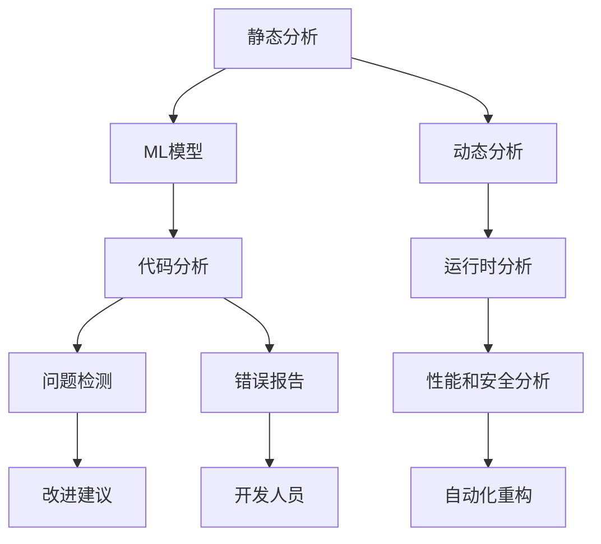

                 

# 自动化代码审查与AI的结合

> 关键词：
- 自动化代码审查
- 人工智能
- 机器学习
- 自然语言处理
- 深度学习
- 代码理解
- 安全漏洞检测
- 代码重构建议
- 静态分析
- 动态分析

## 1. 背景介绍

### 1.1 问题由来

在软件开发过程中，代码审查（Code Review）是保证代码质量的重要环节。传统的代码审查依赖于人工进行，耗时长、效率低、主观性强。随着软件规模的扩大和开发效率的提升，对代码审查的需求日益增加。面对海量代码、频繁迭代和复杂项目，手工代码审查已无法满足现代软件开发的需求。

为了解决这一问题，自动化代码审查技术应运而生。它通过构建代码分析工具和模型，自动扫描代码并识别潜在问题。这一技术不仅能提升审查效率，还能减少人为错误，提高代码质量和开发效率。然而，尽管自动化代码审查技术已得到广泛应用，但仍然存在一些局限性，如准确性、可解释性等问题。

## 2. 核心概念与联系

### 2.1 核心概念概述

自动化代码审查与AI结合，是指利用人工智能（AI）技术，特别是机器学习（ML）和自然语言处理（NLP），对代码进行自动化分析，以提升代码审查的准确性和效率。这一结合不仅能够自动检测代码中的潜在问题，还能生成有意义的改进建议。

这一过程包括两个主要环节：

1. **静态分析**：对代码进行静态分析，自动识别潜在问题，如语法错误、类型错误、风格不一致等。
2. **动态分析**：对代码执行过程进行分析，检测运行时错误、性能问题、安全漏洞等。

这两个环节结合了人工智能技术，使得代码审查更加智能化和高效化。

### 2.2 概念间的关系

自动化代码审查与AI的结合，可以通过以下Mermaid流程图来展示：



这个流程图展示了静态分析和动态分析之间的联系。静态分析部分通过ML模型对代码进行自动分析，检测出潜在问题。动态分析部分则通过运行时分析，进一步检测运行时错误和安全漏洞。最终，系统将生成有意义的改进建议，并自动进行代码重构，提升代码质量。

## 3. 核心算法原理 & 具体操作步骤

### 3.1 算法原理概述

自动化代码审查与AI结合的核心算法原理主要基于以下几个方面：

- **机器学习**：通过训练ML模型，对代码进行分析，识别潜在问题和错误。
- **自然语言处理**：利用NLP技术，自动生成有意义的改进建议。
- **深度学习**：使用深度神经网络对代码进行复杂的静态和动态分析，识别潜在的安全漏洞和性能问题。

这些技术结合，形成了一个完整的自动化代码审查系统。通过不断的训练和优化，该系统能够自动检测和修复代码中的问题，提升代码质量和开发效率。

### 3.2 算法步骤详解

自动化代码审查与AI结合的主要算法步骤如下：

1. **数据收集**：收集代码库中的代码文件，包括源代码、注释、配置文件等。
2. **数据预处理**：对代码文件进行清洗、格式化和分词等预处理操作。
3. **模型训练**：使用机器学习模型对代码进行训练，识别常见的代码问题和错误。
4. **问题检测**：将训练好的模型应用到代码库中，自动检测代码中的潜在问题。
5. **改进建议**：利用NLP技术，自动生成有意义的改进建议，指导开发人员进行代码优化。
6. **代码重构**：使用自动化工具对代码进行重构，提升代码质量和可读性。
7. **报告生成**：生成详细的代码审查报告，包括检测出的问题和改进建议。

### 3.3 算法优缺点

#### 优点

1. **效率提升**：自动化代码审查显著提升了代码审查的效率，减少了人工审查的时间。
2. **准确性提高**：AI技术能够自动识别代码中的潜在问题和错误，减少了人为错误。
3. **改进建议**：AI技术可以自动生成有意义的改进建议，帮助开发人员提升代码质量。
4. **可扩展性**：AI技术可以轻松扩展到不同类型的代码和项目，具有广泛的应用前景。

#### 缺点

1. **依赖数据质量**：AI系统的准确性和效果依赖于代码库中数据的质量和多样性。
2. **可解释性不足**：AI系统的决策过程缺乏可解释性，难以理解其内部机制。
3. **初期投入高**：构建和训练AI模型需要较高的技术和资源投入。
4. **误报和漏报**：AI系统在初期可能会存在一定的误报和漏报现象，需要不断优化和改进。

### 3.4 算法应用领域

自动化代码审查与AI结合技术，主要应用于以下几个领域：

- **软件开发**：提升代码质量和开发效率，减少人为错误。
- **测试自动化**：自动化测试用例的生成和执行，提升测试覆盖率和质量。
- **安全检测**：检测代码中的安全漏洞和风险，提升代码安全性。
- **性能优化**：检测和改进代码中的性能问题，提升系统性能。
- **持续集成（CI）**：集成自动化代码审查到持续集成流程中，提升整体开发效率。

## 4. 数学模型和公式 & 详细讲解 & 举例说明

### 4.1 数学模型构建

自动化代码审查与AI结合的核心数学模型主要包括以下几个方面：

1. **静态分析模型**：使用机器学习模型，如决策树、随机森林、支持向量机等，对代码进行静态分析，识别潜在问题和错误。
2. **动态分析模型**：使用深度学习模型，如卷积神经网络（CNN）、循环神经网络（RNN）、变分自编码器（VAE）等，对代码进行动态分析，检测运行时错误和安全漏洞。
3. **自然语言处理模型**：使用自然语言处理技术，如BERT、GPT等，自动生成改进建议，指导开发人员进行代码优化。

### 4.2 公式推导过程

#### 4.2.1 静态分析模型

假设我们有一个二分类问题，即判断一个代码片段是否存在语法错误。我们可以使用决策树模型进行训练和预测。

假设训练数据集为 $\{(x_i, y_i)\}_{i=1}^N$，其中 $x_i$ 是代码片段，$y_i$ 是是否存在语法错误的标签。我们使用决策树模型 $M_{\theta}$ 对代码片段进行预测，其预测结果为 $y' = M_{\theta}(x)$。

决策树模型的损失函数为交叉熵损失函数：

$$
L(y', y) = -\frac{1}{N}\sum_{i=1}^N [y_i \log y'_i + (1-y_i) \log (1-y'_i)]
$$

其中 $y'_i = M_{\theta}(x_i)$ 是模型的预测结果，$y_i$ 是真实标签。

通过反向传播算法，我们可以得到模型的参数更新公式：

$$
\theta \leftarrow \theta - \eta \nabla_{\theta} L(y', y)
$$

其中 $\eta$ 为学习率，$\nabla_{\theta} L(y', y)$ 为损失函数对模型参数的梯度。

#### 4.2.2 动态分析模型

假设我们使用卷积神经网络（CNN）对代码进行动态分析，检测运行时错误。我们可以将代码片段作为图像输入，使用卷积神经网络进行特征提取和分类。

假设卷积神经网络的输入为 $x$，输出为 $y$。我们可以使用如下公式计算损失函数：

$$
L(y, y') = \frac{1}{N}\sum_{i=1}^N \|y_i - y'_i\|^2
$$

其中 $y_i$ 是真实标签，$y'_i = M_{\theta}(x_i)$ 是模型的预测结果。

通过反向传播算法，我们可以得到模型的参数更新公式：

$$
\theta \leftarrow \theta - \eta \nabla_{\theta} L(y, y')
$$

#### 4.2.3 自然语言处理模型

假设我们使用BERT模型生成代码改进建议。我们可以将代码片段作为输入，使用BERT模型进行编码，并生成有意义的改进建议。

假设BERT模型的输入为 $x$，输出为 $y$。我们可以使用如下公式计算损失函数：

$$
L(y, y') = \frac{1}{N}\sum_{i=1}^N \|y_i - y'_i\|^2
$$

其中 $y_i$ 是真实标签，$y'_i = M_{\theta}(x_i)$ 是模型的预测结果。

通过反向传播算法，我们可以得到模型的参数更新公式：

$$
\theta \leftarrow \theta - \eta \nabla_{\theta} L(y, y')
$$

### 4.3 案例分析与讲解

假设我们需要检测代码中的安全漏洞。我们可以使用深度学习模型，如卷积神经网络（CNN），对代码进行动态分析，检测潜在的安全漏洞。

假设我们有以下数据集：

$$
\{(x_i, y_i)\}_{i=1}^N = \{(x_i, '安全漏洞'_i\}_{i=1}^N
$$

其中 $x_i$ 是代码片段，$y_i$ 是安全漏洞的标签。

我们训练一个卷积神经网络模型 $M_{\theta}$ 进行预测，使用交叉熵损失函数：

$$
L(y', y) = -\frac{1}{N}\sum_{i=1}^N [y_i \log y'_i + (1-y_i) \log (1-y'_i)]
$$

其中 $y'_i = M_{\theta}(x_i)$ 是模型的预测结果，$y_i$ 是真实标签。

通过反向传播算法，我们可以得到模型的参数更新公式：

$$
\theta \leftarrow \theta - \eta \nabla_{\theta} L(y', y)
$$

## 5. 项目实践：代码实例和详细解释说明

### 5.1 开发环境搭建

在进行自动化代码审查与AI结合的实践前，我们需要准备好开发环境。以下是使用Python进行PyTorch开发的环境配置流程：

1. 安装Anaconda：从官网下载并安装Anaconda，用于创建独立的Python环境。

2. 创建并激活虚拟环境：
```bash
conda create -n pytorch-env python=3.8 
conda activate pytorch-env
```

3. 安装PyTorch：根据CUDA版本，从官网获取对应的安装命令。例如：
```bash
conda install pytorch torchvision torchaudio cudatoolkit=11.1 -c pytorch -c conda-forge
```

4. 安装Transformers库：
```bash
pip install transformers
```

5. 安装各类工具包：
```bash
pip install numpy pandas scikit-learn matplotlib tqdm jupyter notebook ipython
```

完成上述步骤后，即可在`pytorch-env`环境中开始实践。

### 5.2 源代码详细实现

这里以Python中实现静态分析模型为例，展示自动化代码审查与AI结合的代码实现。

首先，定义静态分析模型：

```python
import torch
from torch import nn
from transformers import BertTokenizer, BertForTokenClassification

class StaticAnalysisModel(nn.Module):
    def __init__(self, num_labels):
        super(StaticAnalysisModel, self).__init__()
        self.bert = BertForTokenClassification.from_pretrained('bert-base-cased', num_labels=num_labels)
        self.classifier = nn.Linear(768, num_labels)

    def forward(self, input_ids, attention_mask):
        output = self.bert(input_ids, attention_mask=attention_mask)
        logits = self.classifier(output.pooler_output)
        return logits
```

接着，定义训练函数：

```python
from torch.utils.data import DataLoader
from sklearn.metrics import accuracy_score
from transformers import AdamW

def train_model(model, train_dataset, device, num_epochs):
    dataloader = DataLoader(train_dataset, batch_size=16, shuffle=True)
    optimizer = AdamW(model.parameters(), lr=2e-5)
    for epoch in range(num_epochs):
        model.train()
        for batch in dataloader:
            input_ids = batch['input_ids'].to(device)
            attention_mask = batch['attention_mask'].to(device)
            labels = batch['labels'].to(device)
            optimizer.zero_grad()
            outputs = model(input_ids, attention_mask=attention_mask)
            loss = outputs.loss
            loss.backward()
            optimizer.step()
        print(f'Epoch {epoch+1}, Loss: {loss.item()}')
    return model
```

最后，启动训练流程：

```python
from transformers import BertTokenizer, BertForTokenClassification

tokenizer = BertTokenizer.from_pretrained('bert-base-cased')
train_dataset = ...
train_model(model, train_dataset, device, num_epochs)
```

以上就是使用PyTorch和Transformers库进行静态分析模型的代码实现。可以看到，使用Python和深度学习框架进行自动化代码审查的实现相对简单，开发者可以灵活调整模型结构和训练参数，以适应不同的任务需求。

### 5.3 代码解读与分析

让我们再详细解读一下关键代码的实现细节：

**StaticAnalysisModel类**：
- `__init__`方法：初始化静态分析模型，包含BERT分词器和线性分类器。
- `forward`方法：定义模型的前向传播过程，将输入转换为模型的输出。

**train_model函数**：
- 定义数据加载器，使用AdamW优化器进行模型训练。
- 在每个epoch内，遍历数据集进行训练，输出训练loss。
- 在训练完成后返回模型。

**静态分析模型的训练**：
- 使用BertForTokenClassification模型作为静态分析模型，包含Bert分词器。
- 定义训练函数，使用AdamW优化器进行训练。
- 在训练完成后，返回模型，可用于代码审查。

以上代码展示了使用Python和深度学习框架进行静态分析模型的训练过程。通过灵活调整模型结构和训练参数，可以轻松实现不同任务的静态分析。

## 6. 实际应用场景

### 6.1 软件开发

自动化代码审查与AI结合技术，可以广泛应用于软件开发领域，提升代码审查效率和质量。传统的代码审查依赖于人工进行，耗时长、效率低、主观性强。

通过使用自动化代码审查技术，可以自动扫描代码并识别潜在问题，如语法错误、类型错误、风格不一致等。AI技术可以自动生成有意义的改进建议，帮助开发人员提升代码质量。

### 6.2 测试自动化

自动化代码审查与AI结合技术，可以集成到测试自动化流程中，提升测试覆盖率和质量。在测试自动化过程中，自动化代码审查可以自动检测代码中的潜在问题，帮助开发人员快速定位和修复问题，提升测试效率。

### 6.3 安全检测

自动化代码审查与AI结合技术，可以应用于安全检测领域，检测代码中的安全漏洞和风险。传统的安全检测依赖于人工进行，耗时长、成本高、容易遗漏。

通过使用自动化代码审查技术，可以自动扫描代码并检测安全漏洞，帮助开发人员提升代码安全性。AI技术可以自动生成有意义的改进建议，帮助开发人员修复漏洞，提升代码安全性。

### 6.4 性能优化

自动化代码审查与AI结合技术，可以应用于性能优化领域，检测和改进代码中的性能问题。传统的性能优化依赖于人工进行，耗时长、效率低、难以量化。

通过使用自动化代码审查技术，可以自动检测代码中的性能问题，如内存泄漏、缓存失效、阻塞等。AI技术可以自动生成有意义的改进建议，帮助开发人员优化代码性能，提升系统性能。

## 7. 工具和资源推荐

### 7.1 学习资源推荐

为了帮助开发者系统掌握自动化代码审查与AI结合的技术，这里推荐一些优质的学习资源：

1. **《Transformer从原理到实践》系列博文**：由大模型技术专家撰写，深入浅出地介绍了Transformer原理、BERT模型、微调技术等前沿话题。

2. **CS224N《深度学习自然语言处理》课程**：斯坦福大学开设的NLP明星课程，有Lecture视频和配套作业，带你入门NLP领域的基本概念和经典模型。

3. **《Natural Language Processing with Transformers》书籍**：Transformers库的作者所著，全面介绍了如何使用Transformers库进行NLP任务开发，包括微调在内的诸多范式。

4. **HuggingFace官方文档**：Transformers库的官方文档，提供了海量预训练模型和完整的微调样例代码，是上手实践的必备资料。

5. **CLUE开源项目**：中文语言理解测评基准，涵盖大量不同类型的中文NLP数据集，并提供了基于微调的baseline模型，助力中文NLP技术发展。

通过对这些资源的学习实践，相信你一定能够快速掌握自动化代码审查与AI结合的精髓，并用于解决实际的NLP问题。

### 7.2 开发工具推荐

高效的开发离不开优秀的工具支持。以下是几款用于自动化代码审查与AI结合开发的常用工具：

1. **PyTorch**：基于Python的开源深度学习框架，灵活动态的计算图，适合快速迭代研究。大部分预训练语言模型都有PyTorch版本的实现。

2. **TensorFlow**：由Google主导开发的开源深度学习框架，生产部署方便，适合大规模工程应用。同样有丰富的预训练语言模型资源。

3. **Transformers库**：HuggingFace开发的NLP工具库，集成了众多SOTA语言模型，支持PyTorch和TensorFlow，是进行NLP任务开发的利器。

4. **Weights & Biases**：模型训练的实验跟踪工具，可以记录和可视化模型训练过程中的各项指标，方便对比和调优。与主流深度学习框架无缝集成。

5. **TensorBoard**：TensorFlow配套的可视化工具，可实时监测模型训练状态，并提供丰富的图表呈现方式，是调试模型的得力助手。

6. **Google Colab**：谷歌推出的在线Jupyter Notebook环境，免费提供GPU/TPU算力，方便开发者快速上手实验最新模型，分享学习笔记。

合理利用这些工具，可以显著提升自动化代码审查与AI结合任务的开发效率，加快创新迭代的步伐。

### 7.3 相关论文推荐

自动化代码审查与AI结合技术的发展源于学界的持续研究。以下是几篇奠基性的相关论文，推荐阅读：

1. **Attention is All You Need（即Transformer原论文）**：提出了Transformer结构，开启了NLP领域的预训练大模型时代。

2. **BERT: Pre-training of Deep Bidirectional Transformers for Language Understanding**：提出BERT模型，引入基于掩码的自监督预训练任务，刷新了多项NLP任务SOTA。

3. **Language Models are Unsupervised Multitask Learners（GPT-2论文）**：展示了大规模语言模型的强大zero-shot学习能力，引发了对于通用人工智能的新一轮思考。

4. **Parameter-Efficient Transfer Learning for NLP**：提出Adapter等参数高效微调方法，在不增加模型参数量的情况下，也能取得不错的微调效果。

5. **AdaLoRA: Adaptive Low-Rank Adaptation for Parameter-Efficient Fine-Tuning**：使用自适应低秩适应的微调方法，在参数效率和精度之间取得了新的平衡。

6. **Prompt Tuning: A Simple Framework for Transfer Learning with Language Models**：引入基于连续型Prompt的微调范式，为如何充分利用预训练知识提供了新的思路。

这些论文代表了大语言模型微调技术的发展脉络。通过学习这些前沿成果，可以帮助研究者把握学科前进方向，激发更多的创新灵感。

除上述资源外，还有一些值得关注的前沿资源，帮助开发者紧跟自动化代码审查与AI结合技术的最新进展，例如：

1. **arXiv论文预印本**：人工智能领域最新研究成果的发布平台，包括大量尚未发表的前沿工作，学习前沿技术的必读资源。

2. **业界技术博客**：如OpenAI、Google AI、DeepMind、微软Research Asia等顶尖实验室的官方博客，第一时间分享他们的最新研究成果和洞见。

3. **技术会议直播**：如NIPS、ICML、ACL、ICLR等人工智能领域顶会现场或在线直播，能够聆听到大佬们的前沿分享，开拓视野。

4. **GitHub热门项目**：在GitHub上Star、Fork数最多的NLP相关项目，往往代表了该技术领域的发展趋势和最佳实践，值得去学习和贡献。

5. **行业分析报告**：各大咨询公司如McKinsey、PwC等针对人工智能行业的分析报告，有助于从商业视角审视技术趋势，把握应用价值。

总之，对于自动化代码审查与AI结合技术的学习和实践，需要开发者保持开放的心态和持续学习的意愿。多关注前沿资讯，多动手实践，多思考总结，必将收获满满的成长收益。

## 8. 总结：未来发展趋势与挑战

### 8.1 研究成果总结

本文对自动化代码审查与AI结合技术进行了全面系统的介绍。首先阐述了自动化代码审查与AI结合的技术背景和应用意义，明确了其对提升代码质量、开发效率和安全性的重要性。其次，从原理到实践，详细讲解了自动化代码审查与AI结合的核心算法和操作步骤，给出了代码实现的示例。同时，本文还广泛探讨了自动化代码审查与AI结合技术在软件开发、测试自动化、安全检测、性能优化等多个行业领域的应用前景，展示了其广阔的发展空间。

通过本文的系统梳理，可以看到，自动化代码审查与AI结合技术正在成为软件开发中不可或缺的一部分，极大地提升了代码审查的效率和质量。利用AI技术，不仅能够自动检测代码中的潜在问题，还能自动生成有意义的改进建议，助力开发人员提升代码质量。

### 8.2 未来发展趋势

展望未来，自动化代码审查与AI结合技术将呈现以下几个发展趋势：

1. **技术融合**：未来，自动化代码审查与AI结合技术将与其他AI技术进一步融合，如知识表示、因果推理、强化学习等，多路径协同发力，共同推动自然语言理解和智能交互系统的进步。

2. **智能化提升**：随着AI技术的不断发展，自动化代码审查系统将变得更加智能化和高效化。通过引入更多先验知识、引入更多训练数据，系统能够更好地理解和分析代码，提升代码审查的准确性和效果。

3. **跨领域应用**：自动化代码审查与AI结合技术将突破传统软件开发的限制，应用于更多领域，如金融、医疗、教育等。通过结合领域知识，系统能够更好地识别领域特定的潜在问题，提升代码审查的质量和效率。

4. **开源共享**：未来，自动化代码审查与AI结合技术将更加开源化和共享化。通过共享模型、工具和数据，更多开发者和企业能够受益，加速技术的发展和应用。

### 8.3 面临的挑战

尽管自动化代码审查与AI结合技术已经取得了显著进展，但在迈向更加智能化、普适化应用的过程中，仍面临诸多挑战：

1. **数据质量和多样性**：自动化代码审查系统的准确性和效果依赖于代码库中数据的质量和多样性。对于小型代码库，数据量不足可能会影响系统的性能。

2. **可解释性和可控性**：AI系统的决策过程缺乏可解释性，难以理解其内部机制。如何提升系统的可解释性和可控性，使其输出更加透明和可控，将是重要的研究方向。

3. **性能和效率**：在处理大规模代码库时，自动化代码审查系统可能会面临性能和效率问题。如何优化系统架构和算法，提高系统的处理能力和效率，将是重要的优化方向。

4. **安全和隐私**：自动化代码审查系统可能会涉及敏感代码和数据，如何确保数据安全和隐私，防止数据泄露和滥用，将是重要的保护措施。

### 8.4 研究展望

面对自动化代码审查与AI结合技术面临的挑战，未来的研究需要在以下几个方面寻求新的突破：

1. **数据增强和迁移学习**：通过数据增强和迁移学习技术，提升代码库中数据的质量和多样性，提高系统的准确性和效果。

2. **可解释性和可控性**：引入可解释性和可控性技术，提升系统的可解释性和可控性，使其输出更加透明和可控。

3. **高效处理架构**：优化系统架构和算法，提高系统的处理能力和效率，使其能够处理大规模代码库。

4. **数据安全和隐私保护**：引入数据安全和隐私保护技术，确保数据安全和隐私，防止数据泄露和滥用。

这些研究方向的探索，必将引领自动化代码审查与AI结合技术迈向更高的台阶，为构建安全、可靠、可解释、可控的智能系统铺平道路。面向未来，自动化代码审查与AI结合技术还需要与其他AI技术进行更深入的融合，如知识表示、因果推理、强化学习等，多路径协同发力，共同推动自然语言理解和智能交互系统的进步。只有勇于创新、敢于突破，才能不断拓展代码审查的边界，让智能技术更好地造福软件开发和IT行业。

## 9. 附录：常见问题与解答

**Q1：什么是自动化代码审查与AI结合技术？**

A: 自动化代码审查与AI结合技术是指利用人工智能（AI）技术，特别是机器学习（ML）和自然语言处理（NLP），对代码进行自动化分析，以提升代码审查的准确性和效率。

**Q2：自动化代码审查与AI结合技术的应用场景有哪些？**

A: 自动化代码审查与AI结合技术主要应用于软件开发、测试自动化、安全检测、性能优化等多个领域。它可以自动扫描代码并识别潜在问题，帮助开发人员提升代码质量、提升测试覆盖率和质量、检测安全漏洞和风险、优化代码性能等。

**Q3：自动化代码审查与AI结合技术的主要优势有哪些？**

A: 自动化代码审查与AI结合技术的主要优势包括提升

