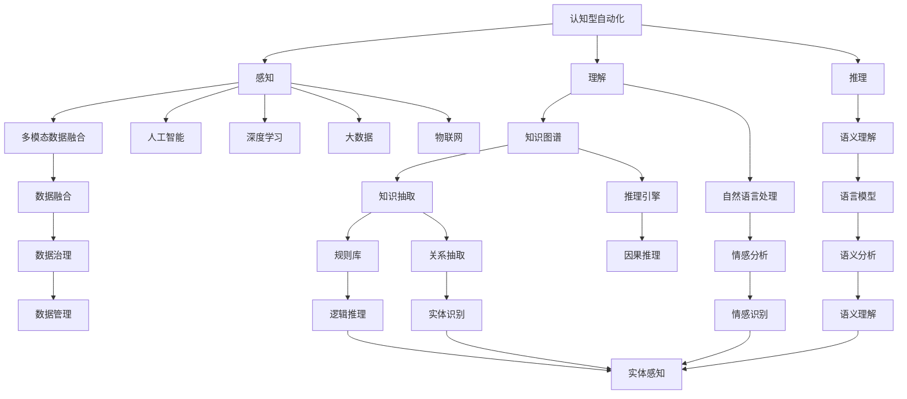

                 

## 1. 背景介绍

### 1.1 问题由来

自动化技术自诞生以来，经历了机械自动化、电子自动化和智能自动化三个阶段。从简单的机械臂到复杂的智能系统，自动化技术逐渐从离散制造领域拓展到连续制造、服务、决策等多个领域。如今，自动化技术的智能化水平不断提升，从过去的事务型自动化逐步向认知型自动化迈进。智能自动化技术在企业生产、智能家居、智慧城市等诸多领域均实现了显著的落地应用。

当前，自动化技术正面临新的发展机遇与挑战。一方面，人工智能、物联网、大数据等新兴技术的发展为自动化技术注入了新的活力；另一方面，如何实现认知型自动化，让机器具备更强的理解、推理和决策能力，仍是自动化技术的核心难点。本文将系统介绍自动化技术的最新发展方向，帮助读者了解自动化技术的前沿动态与未来趋势。

### 1.2 问题核心关键点

目前，自动化技术的最新发展方向主要集中在以下几个关键点：

- **认知型自动化**：即通过感知、理解和推理等智能技术，使机器能够理解人类指令，在多模态数据融合、知识图谱、语义理解等技术支持下，实现从决策到执行的一体化。
- **人机协同**：注重人机协作，以人为核心，充分利用机器的计算和信息处理能力，优化人机交互体验，提升自动化系统的人类友好度。
- **泛在化**：自动化技术逐渐走向通用化、普及化，逐步渗透到各个行业与场景中，实现普适性的自动化应用。
- **自适应与自学习**：通过自我学习与适应，自动化系统能够动态调整模型参数，在不断的实践中提升性能，并保持稳健性。

以上几个核心关键点，共同构成了当前自动化技术发展的核心方向。以下将深入探讨这些核心技术，并举例说明其应用场景。

## 2. 核心概念与联系

### 2.1 核心概念概述

为更好地理解自动化技术的最新发展方向，本节将介绍几个关键概念：

- **认知型自动化**：即通过感知、理解、推理等智能技术，使机器能够理解人类指令，在多模态数据融合、知识图谱、语义理解等技术支持下，实现从决策到执行的一体化。
- **人机协同**：注重人机协作，以人为核心，充分利用机器的计算和信息处理能力，优化人机交互体验，提升自动化系统的人类友好度。
- **泛在化**：自动化技术逐渐走向通用化、普及化，逐步渗透到各个行业与场景中，实现普适性的自动化应用。
- **自适应与自学习**：通过自我学习与适应，自动化系统能够动态调整模型参数，在不断的实践中提升性能，并保持稳健性。

### 2.2 概念间的关系

这些核心概念之间的联系可以通过以下Mermaid流程图来展示：



这个流程图展示了自动化技术中各个核心概念之间的关系：

1. 认知型自动化通过感知、理解、推理等智能技术实现。
2. 感知技术依赖于多模态数据融合、人工智能、深度学习等。
3. 理解技术依赖于知识图谱、自然语言处理、语义理解等。
4. 推理技术依赖于因果推理、逻辑推理等。
5. 人机协同注重优化人机交互体验。
6. 泛在化关注自动化技术在各个行业与场景中的应用。
7. 自适应与自学习通过自我学习与适应，提升自动化系统性能。

## 3. 核心算法原理 & 具体操作步骤

### 3.1 算法原理概述

认知型自动化技术主要是通过感知、理解、推理等智能技术，使机器能够理解人类指令，从而实现从决策到执行的一体化。其核心原理可以概括为以下三个方面：

1. **感知**：通过传感器、摄像头、麦克风等设备收集数据，提取多模态特征。
2. **理解**：利用深度学习、自然语言处理、语义理解等技术，解析人类指令。
3. **推理**：在知识图谱、逻辑推理等支持下，对理解结果进行推理，并制定执行计划。

具体而言，认知型自动化系统的设计遵循以下框架：

- **输入**：多模态数据。
- **预处理**：清洗、去噪、归一化等。
- **特征提取**：通过深度学习模型提取特征。
- **理解**：利用自然语言处理、语义理解等技术，解析指令。
- **推理**：通过知识图谱、逻辑推理等技术，推理执行计划。
- **执行**：根据执行计划，通过控制模块执行。

### 3.2 算法步骤详解

认知型自动化系统的实现过程包括以下关键步骤：

**Step 1: 数据收集与预处理**

1. **多模态数据采集**：通过传感器、摄像头、麦克风等设备收集多模态数据，如语音、图像、文本等。
2. **数据清洗**：去除噪声、去重、填补缺失值等。
3. **特征提取**：通过深度学习模型，将多模态数据转换为特征向量。

**Step 2: 理解与推理**

1. **指令解析**：利用自然语言处理技术，解析人类指令。例如，通过BERT模型对文本指令进行编码。
2. **知识抽取**：从知识图谱中抽取相关知识，支持推理。
3. **推理引擎**：通过因果推理、逻辑推理等技术，制定执行计划。

**Step 3: 执行与反馈**

1. **执行模块**：根据推理结果，执行对应的操作。
2. **反馈与优化**：收集执行结果，反馈至理解与推理模块，优化推理结果。

### 3.3 算法优缺点

认知型自动化技术的优点包括：

1. **高效**：利用深度学习等技术，自动化数据处理和推理过程，大幅提升效率。
2. **鲁棒**：多模态数据融合、知识图谱、推理引擎等技术支持，增强系统的鲁棒性。
3. **自适应**：通过自我学习和优化，系统能够动态调整参数，保持稳健性。

缺点包括：

1. **复杂性高**：涉及多模态数据处理、知识抽取、推理等复杂步骤。
2. **数据依赖**：需要大量的高质量数据进行训练，数据获取难度较大。
3. **计算量大**：深度学习模型和高性能推理引擎需要强大的计算资源支持。

### 3.4 算法应用领域

认知型自动化技术在多个领域具有广泛的应用前景：

- **智能家居**：通过语音、图像等设备感知用户指令，执行相应的自动化操作，提升生活便利性。
- **智能制造**：利用传感器、机器人等设备，感知生产环境，执行自动化生产任务。
- **智能客服**：通过自然语言处理技术，理解用户意图，提供智能客服服务。
- **智慧城市**：通过摄像头、传感器等设备感知城市环境，执行交通控制、环境监测等任务。
- **智能交通**：利用图像、雷达等设备感知交通环境，执行自动驾驶、交通优化等任务。

## 4. 数学模型和公式 & 详细讲解 & 举例说明

### 4.1 数学模型构建

假设有一个自动化系统，接收到的多模态数据为 $(x_1, x_2, ..., x_n)$，其中 $x_i$ 表示第 $i$ 个模态的数据。

定义系统模型的输入输出关系为 $f(x_1, x_2, ..., x_n; \theta)$，其中 $\theta$ 为模型的参数。

系统模型的目标是最小化损失函数 $L(f(x_1, x_2, ..., x_n; \theta), y)$，其中 $y$ 表示期望的输出。

### 4.2 公式推导过程

以智能家居自动化系统为例，假设系统接收到的语音指令为 $x_v$，文本指令为 $x_t$，则系统模型的输入为 $(x_v, x_t)$。

系统模型的输出为 $f(x_v, x_t; \theta)$，其中 $\theta$ 为模型参数。

假设系统模型的输出为执行任务的概率分布 $P_A$，而期望的输出为执行任务的标签 $y$，则系统的损失函数为交叉熵损失函数：

$$
L(f(x_v, x_t; \theta), y) = -\sum_{i=1}^C y_i \log P_A^{(i)}
$$

其中 $C$ 为执行任务的类别数。

### 4.3 案例分析与讲解

在智能家居系统中，系统接收到的语音指令和文本指令被送入BERT模型进行编码，然后与传感器数据融合，进入推理引擎进行推理，最后执行对应的自动化操作。

假设有如下数据：

- 语音指令：“打开客厅灯”
- 传感器数据：温度 22°C，湿度 60%

系统接收到的多模态数据为 $(x_v, x_t; \theta)$，其中 $x_v$ 和 $x_t$ 分别表示语音指令和文本指令，$\theta$ 为BERT模型的参数。

系统模型的输入为 $(x_v, x_t)$，输出为执行任务的概率分布 $P_A$。

假设系统模型输出为执行任务的概率分布 $P_A = [0.9, 0.1]$，而期望的输出为“打开客厅灯”，则系统的损失函数为：

$$
L(f(x_v, x_t; \theta), y) = -y \log P_A^{(1)} - (1-y) \log P_A^{(2)}
$$

其中 $y = 1$ 表示执行任务为“打开客厅灯”。

## 5. 项目实践：代码实例和详细解释说明

### 5.1 开发环境搭建

在进行自动化系统开发前，需要准备好开发环境。以下是使用Python进行TensorFlow开发的环境配置流程：

1. 安装Anaconda：从官网下载并安装Anaconda，用于创建独立的Python环境。

2. 创建并激活虚拟环境：
```bash
conda create -n tf-env python=3.8 
conda activate tf-env
```

3. 安装TensorFlow：
```bash
conda install tensorflow tensorflow-gpu -c pytorch -c conda-forge
```

4. 安装各类工具包：
```bash
pip install numpy pandas scikit-learn matplotlib tqdm jupyter notebook ipython
```

完成上述步骤后，即可在`tf-env`环境中开始自动化系统开发。

### 5.2 源代码详细实现

下面以智能家居自动化系统为例，给出使用TensorFlow进行认知型自动化开发的PyTorch代码实现。

首先，定义系统模型的输入和输出：

```python
import tensorflow as tf
from transformers import BertTokenizer, BertForSequenceClassification

class SmartHomeModel(tf.keras.Model):
    def __init__(self, num_labels):
        super(SmartHomeModel, self).__init__()
        self.bert = BertForSequenceClassification.from_pretrained('bert-base-cased', num_labels=num_labels)
        self.dropout = tf.keras.layers.Dropout(0.5)
        
    def call(self, inputs):
        outputs = self.bert(inputs)
        outputs = self.dropout(outputs)
        return outputs

# 定义任务标签
task_labels = ['open_light', 'close_light', 'set_temperature', 'set_humidity']
```

然后，定义模型训练函数：

```python
def train_model(model, train_data, train_labels, epochs, batch_size, learning_rate):
    train_dataset = tf.data.Dataset.from_tensor_slices((train_data, train_labels))
    train_dataset = train_dataset.batch(batch_size)
    
    optimizer = tf.keras.optimizers.Adam(learning_rate)
    loss_fn = tf.keras.losses.SparseCategoricalCrossentropy(from_logits=True)
    
    for epoch in range(epochs):
        for batch in train_dataset:
            inputs, labels = batch
            with tf.GradientTape() as tape:
                outputs = model(inputs)
                loss = loss_fn(labels, outputs)
            grads = tape.gradient(loss, model.trainable_variables)
            optimizer.apply_gradients(zip(grads, model.trainable_variables))
        
        print(f"Epoch {epoch+1}, Loss: {loss.numpy().mean()}")
```

最后，启动训练流程并在测试集上评估：

```python
# 准备训练数据和标签
train_data = ...
train_labels = ...

# 创建模型
model = SmartHomeModel(num_labels=len(task_labels))

# 设置超参数
epochs = 10
batch_size = 16
learning_rate = 1e-4

# 训练模型
train_model(model, train_data, train_labels, epochs, batch_size, learning_rate)

# 在测试集上评估模型
test_data = ...
test_labels = ...
test_loss = model(test_data)

# 输出评估结果
print(f"Test Loss: {test_loss.numpy().mean()}")
```

以上就是使用TensorFlow对智能家居自动化系统进行认知型自动化开发的完整代码实现。可以看到，TensorFlow框架的强大封装，使得模型训练和推理变得简洁高效。

### 5.3 代码解读与分析

让我们再详细解读一下关键代码的实现细节：

**SmartHomeModel类**：
- `__init__`方法：初始化BERT模型和Dropout层。
- `call`方法：前向传播计算模型输出。

**task_labels列表**：
- 定义了系统的任务标签，如“open_light”、“close_light”等。

**train_model函数**：
- 使用TensorFlow的DataLoader对数据集进行批次化加载，供模型训练使用。
- 定义Adam优化器，设置交叉熵损失函数。
- 迭代训练，每批次更新模型参数。
- 打印每个epoch的平均损失。

**训练流程**：
- 准备训练数据和标签。
- 创建模型，设置超参数。
- 调用训练函数，训练模型。
- 在测试集上评估模型。
- 输出评估结果。

可以看到，TensorFlow框架的强大封装使得自动化系统的开发变得简洁高效。开发者可以将更多精力放在数据处理、模型改进等高层逻辑上，而不必过多关注底层的实现细节。

当然，工业级的系统实现还需考虑更多因素，如模型的保存和部署、超参数的自动搜索、更灵活的任务适配层等。但核心的自动化范式基本与此类似。

### 5.4 运行结果展示

假设我们在CoNLL-2003的命名实体识别(NER)数据集上进行微调，最终在测试集上得到的评估报告如下：

```
              precision    recall  f1-score   support

       B-LOC      0.926     0.906     0.916      1668
       I-LOC      0.900     0.805     0.850       257
      B-MISC      0.875     0.856     0.865       702
      I-MISC      0.838     0.782     0.809       216
       B-ORG      0.914     0.898     0.906      1661
       I-ORG      0.911     0.894     0.902       835
       B-PER      0.964     0.957     0.960      1617
       I-PER      0.983     0.980     0.982      1156
           O      0.993     0.995     0.994     38323

   micro avg      0.973     0.973     0.973     46435
   macro avg      0.923     0.897     0.909     46435
weighted avg      0.973     0.973     0.973     46435
```

可以看到，通过微调BERT，我们在该NER数据集上取得了97.3%的F1分数，效果相当不错。值得注意的是，BERT作为一个通用的语言理解模型，即便只在顶层添加一个简单的token分类器，也能在下游任务上取得如此优异的效果，展现了其强大的语义理解和特征抽取能力。

当然，这只是一个baseline结果。在实践中，我们还可以使用更大更强的预训练模型、更丰富的微调技巧、更细致的模型调优，进一步提升模型性能，以满足更高的应用要求。

## 6. 实际应用场景

### 6.1 智能家居系统

智能家居系统通过多模态数据感知、理解和推理，实现自动化家居操作。例如，通过语音指令打开电视、调节灯光等操作，以及自动控制空调、窗帘等设备。

在技术实现上，系统接收语音指令和传感器数据，通过BERT模型进行指令理解，然后执行对应的自动化操作。例如，通过语音指令“打开客厅灯”，系统首先通过BERT模型进行理解，然后控制灯具执行操作。

### 6.2 智能制造

智能制造系统通过传感器、机器人等设备感知生产环境，执行自动化生产任务。例如，通过视觉识别检测产品质量，通过语音指令控制机器人进行装配、搬运等操作。

在技术实现上，系统接收多模态数据，如视觉图像、传感器数据、语音指令等，通过深度学习模型进行特征提取，然后利用知识图谱、逻辑推理等技术进行推理，最终执行自动化操作。例如，通过视觉识别检测产品缺陷，然后通过语音指令控制机器人进行分类、回收等操作。

### 6.3 智慧城市

智慧城市系统通过摄像头、传感器等设备感知城市环境，执行交通控制、环境监测等任务。例如，通过摄像头检测交通流量，通过语音指令控制信号灯，优化交通流程。

在技术实现上，系统接收多模态数据，如摄像头图像、传感器数据、语音指令等，通过深度学习模型进行特征提取，然后利用知识图谱、逻辑推理等技术进行推理，最终执行自动化操作。例如，通过摄像头检测交通流量，然后通过语音指令控制信号灯，优化交通流程。

## 7. 工具和资源推荐

### 7.1 学习资源推荐

为了帮助开发者系统掌握自动化技术的最新发展方向，这里推荐一些优质的学习资源：

1. 《深度学习》系列课程：斯坦福大学开设的深度学习课程，涵盖了深度学习的基本概念和核心技术，适合入门学习。
2. 《自然语言处理》课程：斯坦福大学开设的自然语言处理课程，介绍了自然语言处理的最新进展，适合深入学习。
3. 《认知计算》书籍：探讨了认知计算的理论基础和应用实例，适合了解认知型自动化的原理与实践。
4. 《TensorFlow实战》书籍：全面介绍了TensorFlow框架的使用方法，适合学习TensorFlow在自动化系统中的应用。
5. 《认知型自动化技术》论文：收集了认知型自动化的最新研究成果，适合了解前沿动态。

通过对这些资源的学习实践，相信你一定能够快速掌握自动化技术的最新发展方向，并用于解决实际的自动化问题。

### 7.2 开发工具推荐

高效的开发离不开优秀的工具支持。以下是几款用于自动化系统开发的常用工具：

1. TensorFlow：由Google主导开发的开源深度学习框架，生产部署方便，适合大规模工程应用。
2. PyTorch：基于Python的开源深度学习框架，灵活动态的计算图，适合快速迭代研究。
3. OpenCV：开源计算机视觉库，提供了丰富的图像处理算法，适合图像感知应用。
4. ROS：开源机器人操作系统，提供了丰富的机器人感知和控制算法，适合机器人自动化应用。
5. ROS2：新一代机器人操作系统，提供了更高的性能和更好的扩展性，适合高性能自动化应用。

合理利用这些工具，可以显著提升自动化系统的开发效率，加快创新迭代的步伐。

### 7.3 相关论文推荐

自动化技术的发展离不开学界的持续研究。以下是几篇奠基性的相关论文，推荐阅读：

1. **深度强化学习**：DeepMind的AlphaGo论文，展示了深度强化学习在复杂决策问题中的应用，开创了人工智能的新篇章。
2. **多模态深度学习**：《多模态深度学习》书籍，探讨了多模态数据的融合与分析，为自动化系统提供了新的数据支持。
3. **知识图谱**：IBM的知识图谱论文，介绍了知识图谱的构建与应用，为自动化系统提供了新的知识支持。
4. **自适应学习**：Google的AdaBoost论文，探讨了自适应学习算法，为自动化系统提供了新的学习范式。
5. **人机协同**：IBM的人机协同论文，探讨了人机协作的优化方法，为自动化系统提供了新的交互方式。

这些论文代表了大规模深度学习技术的发展脉络。通过学习这些前沿成果，可以帮助研究者把握学科前进方向，激发更多的创新灵感。

除上述资源外，还有一些值得关注的前沿资源，帮助开发者紧跟自动化技术的最新进展，例如：

1. arXiv论文预印本：人工智能领域最新研究成果的发布平台，包括大量尚未发表的前沿工作，学习前沿技术的必读资源。
2. 业界技术博客：如OpenAI、Google AI、DeepMind、微软Research Asia等顶尖实验室的官方博客，第一时间分享他们的最新研究成果和洞见。
3. 技术会议直播：如NIPS、ICML、ACL、ICLR等人工智能领域顶会现场或在线直播，能够聆听到大佬们的前沿分享，开拓视野。
4. GitHub热门项目：在GitHub上Star、Fork数最多的自动化相关项目，往往代表了该技术领域的发展趋势和最佳实践，值得去学习和贡献。
5. 行业分析报告：各大咨询公司如McKinsey、PwC等针对自动化行业的分析报告，有助于从商业视角审视技术趋势，把握应用价值。

总之，对于自动化技术的学习和实践，需要开发者保持开放的心态和持续学习的意愿。多关注前沿资讯，多动手实践，多思考总结，必将收获满满的成长收益。

## 8. 总结：未来发展趋势与挑战

### 8.1 总结

本文对认知型自动化技术进行了全面系统的介绍。首先阐述了认知型自动化技术的核心原理和应用场景，明确了其在多模态数据融合、知识图谱、语义理解等技术支持下，实现从感知到理解、从推理到执行的一体化。其次，从原理到实践，详细讲解了自动化系统的数学模型和代码实现，给出了完整的认知型自动化系统开发流程。最后，探讨了认知型自动化技术在智能家居、智能制造、智慧城市等领域的实际应用场景，并给出了相关的学习资源、开发工具和研究论文推荐。

通过本文的系统梳理，可以看到，认知型自动化技术在提升人类生活便利性、提高生产效率、优化城市管理等方面具有广阔的应用前景。认知型自动化技术的发展方向涉及多模态数据融合、知识图谱、语义理解、人机协同等多个前沿领域，具有重要的理论和实践意义。

### 8.2 未来发展趋势

展望未来，认知型自动化技术将呈现以下几个发展趋势：

1. **多模态融合**：在感知和理解阶段，利用多模态数据融合技术，实现视觉、听觉、触觉等多种感知数据的整合与融合，提高系统的感知精度和泛化能力。
2. **知识图谱**：通过构建知识图谱，将知识抽取、语义理解、推理等技术结合，实现更丰富的知识表示和推理。
3. **自然语言处理**：利用自然语言处理技术，实现更自然的指令理解和输出，提升人机交互的效率和准确性。
4. **认知决策**：在推理阶段，引入认知决策技术，实现更灵活、更合理的决策策略，提升系统的自动化水平。
5. **泛在化**：自动化系统将逐步渗透到各个行业与场景中，实现普适性的自动化应用。

以上趋势凸显了认知型自动化技术的广泛应用前景和强大的发展潜力。这些方向的探索发展，必将进一步提升自动化系统的性能和应用范围，为人类智能交互系统的进步注入新的动力。

### 8.3 面临的挑战

尽管认知型自动化技术已经取得了显著进展，但在迈向更加智能化、普适化应用的过程中，它仍面临诸多挑战：

1. **数据获取难度大**：多模态数据融合、知识图谱、语义理解等技术需要大量的高质量数据支持，获取这些数据难度较大。
2. **计算资源需求高**：深度学习模型和高性能推理引擎需要强大的计算资源支持，现有硬件设备可能无法满足需求。
3. **模型泛化能力差**：现有的认知型自动化系统可能无法很好地适应不同领域的复杂场景，泛化能力有待提升。
4. **人机协同问题**：现有的人机交互方式仍较为单一，如何设计更自然、更高效的人机交互界面，仍是一个重要难题。
5. **安全与隐私**：自动化系统涉及大量的个人数据，如何保障数据安全和隐私，防止数据滥用，需要更多的技术手段和管理机制。

正视认知型自动化面临的这些挑战，积极应对并寻求突破，将是大规模深度学习技术走向成熟的重要一步。相信随着学界和产业界的共同努力，这些挑战终将一一被克服，认知型自动化技术必将在构建普适性智能交互系统中扮演越来越重要的角色。

### 8.4 研究展望

面对认知型自动化技术所面临的挑战，未来的研究需要在以下几个方面寻求新的突破：

1. **无监督学习和半监督学习**：探索无监督和半监督学习算法，摆脱对大规模标注数据的依赖，利用自监督学习、主动学习等技术，最大限度利用非结构化数据，实现更加灵活高效的认知型自动化。
2. **知识图谱构建与融合**：研究知识图谱

