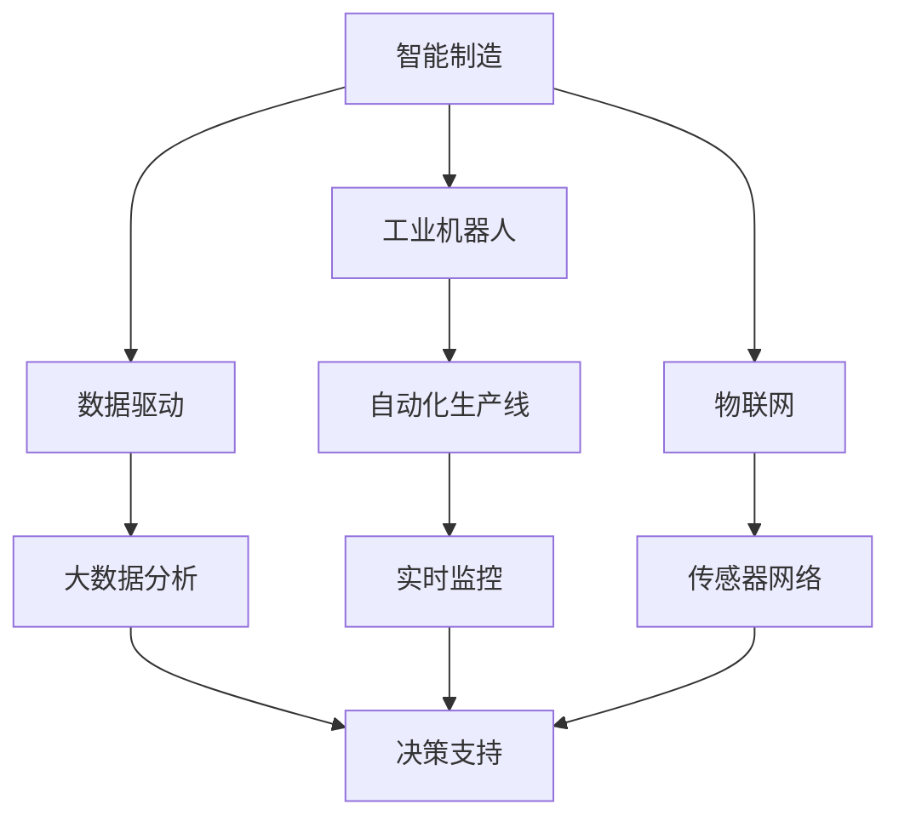
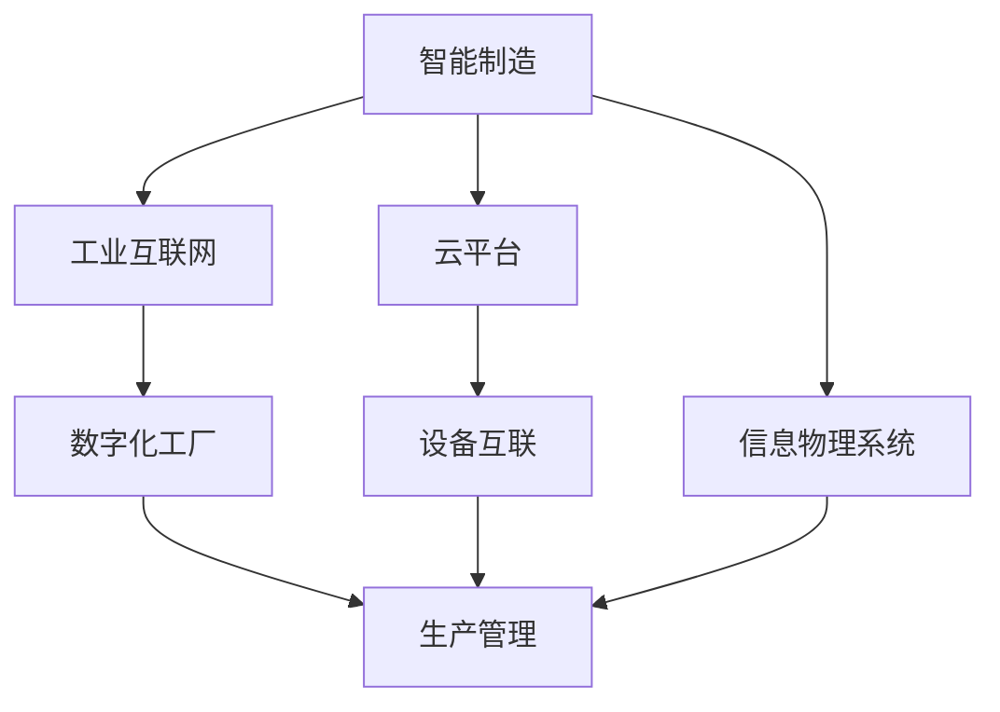
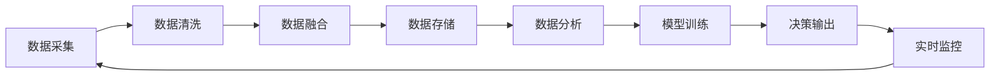

                 

# 自动化技术的未来发展趋势

在当今数字化、智能化迅猛发展的时代，自动化技术正逐渐渗透到社会的每一个角落，从生产制造到日常生活的方方面面，都离不开自动化技术的支撑。本文将深入探讨自动化技术的未来发展趋势，通过对其核心概念、算法原理及实践步骤的详细分析，揭示自动化技术在智能制造、智能城市、智慧医疗等领域的广阔应用前景，并提出未来研究与应用的策略建议。

## 1. 背景介绍

### 1.1 问题由来

近年来，随着人工智能、大数据、物联网等技术的飞速发展，自动化技术迎来了新的发展机遇。自动化技术通过采用各种先进技术手段，如机器视觉、自然语言处理、机器人技术等，实现对生产过程、服务流程的智能化管理和优化。传统的自动化技术已经逐步演变成智能自动化，更加强调系统智能性、自适应性和人机协同。

自动化技术的发展，不仅推动了工业制造的数字化转型，提高了生产效率和质量，也极大地改善了人们的生活质量，带来了更高效、更舒适的生活方式。

### 1.2 问题核心关键点

自动化技术的发展主要包括以下几个关键点：

1. **智能决策**：自动化系统能够通过学习历史数据和实时数据，自动生成最优决策方案。
2. **自适应性**：自动化系统能够根据环境和任务变化，自动调整参数和策略，以适应新的情况。
3. **人机协同**：自动化系统能够与人类进行高效互动，提供辅助决策，提升工作效率。
4. **全生命周期管理**：自动化系统能够对生产、服务流程的全生命周期进行管理，提升效率和质量。
5. **可持续性**：自动化系统在设计时考虑了环境和社会影响，致力于实现可持续发展。

这些关键点构成了自动化技术的核心框架，推动其在各个领域的广泛应用。

## 2. 核心概念与联系

### 2.1 核心概念概述

为了更好地理解自动化技术的未来发展趋势，本节将介绍几个紧密相关的核心概念：

- **智能制造**：利用自动化技术和智能技术，实现制造过程的数字化、智能化，提升生产效率和质量。
- **智能城市**：通过物联网、大数据、云计算等技术手段，构建智能化的城市管理系统，提升城市运行效率和居民生活质量。
- **智慧医疗**：利用人工智能、大数据、物联网等技术，优化医疗资源配置，提升医疗服务质量和效率。
- **机器人技术**：包括工业机器人、协作机器人、服务机器人等，实现生产和服务自动化，提升工作效率。
- **智能决策支持系统**：基于大数据和人工智能技术，提供决策辅助，提升决策效率和质量。

这些核心概念之间的逻辑关系可以通过以下Mermaid流程图来展示：



这个流程图展示了智能制造的核心架构，其中工业机器人、自动化生产线、物联网、大数据分析等技术相互协作，共同支持智能制造系统的运行。

### 2.2 概念间的关系

这些核心概念之间存在着紧密的联系，形成了智能制造系统的完整生态系统。下面通过几个Mermaid流程图来展示这些概念之间的关系：

#### 2.2.1 智能制造的基本架构



这个流程图展示了智能制造的基本架构，其中工业互联网、云平台、设备互联、信息物理系统等技术相互协作，共同支持智能制造系统的运行。

#### 2.2.2 智能决策支持系统的工作流程



这个流程图展示了智能决策支持系统的工作流程，其中数据采集、数据清洗、数据融合、数据分析、模型训练、决策输出、实时监控等步骤相互协作，共同支持决策支持系统的运行。

## 3. 核心算法原理 & 具体操作步骤

### 3.1 算法原理概述

自动化技术的未来发展将更加依赖于先进算法的设计和应用。目前，主要包括以下几个核心算法：

- **机器学习与深度学习**：通过大量的数据训练模型，提升系统的智能决策能力。
- **优化算法**：如遗传算法、粒子群优化算法等，用于优化生产流程和服务流程。
- **自然语言处理**：通过机器翻译、文本分类、情感分析等技术，实现人机交互的自然化。
- **计算机视觉**：通过图像识别、目标检测等技术，实现对生产和服务场景的智能化监控。
- **机器人路径规划**：通过路径规划算法，优化机器人的移动路径，提高工作效率。

这些算法相互协作，共同支持自动化系统的智能决策和自适应性。

### 3.2 算法步骤详解

自动化技术的算法步骤主要包括以下几个关键环节：

1. **数据采集与预处理**：通过传感器、摄像头等设备采集实时数据，并进行数据清洗和预处理。
2. **特征提取与建模**：利用机器学习或深度学习算法，对数据进行特征提取和建模。
3. **决策与优化**：通过优化算法，生成最优决策方案，并动态调整系统参数。
4. **实时监控与反馈**：对系统运行状态进行实时监控，并根据反馈信息动态调整决策。
5. **人机交互与协同**：通过自然语言处理和计算机视觉技术，实现人机自然交互和协同工作。

以下是这些步骤的详细说明：

#### 数据采集与预处理

- **传感器数据**：通过温度、湿度、压力等传感器采集生产环境数据。
- **摄像头数据**：通过工业相机采集生产现场视频数据。
- **文本数据**：通过文本传感器采集生产记录、服务记录等文本数据。

#### 特征提取与建模

- **特征选择**：通过特征选择算法，选择最相关的特征进行建模。
- **模型训练**：利用机器学习或深度学习算法，对数据进行建模。
- **模型评估**：通过评估指标（如准确率、召回率等）评估模型性能。

#### 决策与优化

- **决策生成**：根据模型预测结果，生成最优决策方案。
- **参数调整**：利用优化算法，动态调整系统参数，提升决策质量。

#### 实时监控与反馈

- **状态监控**：通过实时监控系统，监测生产和服务状态。
- **异常检测**：通过异常检测算法，识别生产和服务异常。
- **反馈调整**：根据异常信息，动态调整系统参数，提升系统稳定性。

#### 人机交互与协同

- **自然语言处理**：通过文本分析、语音识别等技术，实现人机自然交互。
- **计算机视觉**：通过图像识别、目标检测等技术，实现对生产和服务场景的监控。

### 3.3 算法优缺点

自动化技术的算法优点包括：

- **高效性**：通过算法优化，提升生产和服务效率。
- **自适应性**：算法能够根据环境和任务变化，动态调整决策和参数。
- **准确性**：算法能够通过大量数据训练，提高决策和监控的准确性。

自动化技术的算法缺点包括：

- **数据依赖性**：算法效果高度依赖于数据质量和数量。
- **模型复杂性**：复杂模型可能需要较长的训练时间和较大的计算资源。
- **实时性挑战**：大规模数据的实时处理可能面临计算和存储瓶颈。

### 3.4 算法应用领域

自动化技术的算法广泛应用于以下几个领域：

- **智能制造**：通过机器视觉、自然语言处理、机器人技术等，实现生产流程的自动化和智能化。
- **智能城市**：通过物联网、大数据、云计算等技术，构建智慧城市管理系统，提升城市运行效率和居民生活质量。
- **智慧医疗**：利用人工智能、大数据、物联网等技术，优化医疗资源配置，提升医疗服务质量和效率。
- **智能交通**：通过传感器、摄像头等技术，实现交通流量监控和优化，提升交通安全和效率。
- **智能农业**：通过传感器、无人机等技术，实现农业生产智能化，提升农业生产效率和质量。

这些领域的自动化应用，将推动各个行业的数字化转型，提升生产效率和质量，改善人们的生活质量。

## 4. 数学模型和公式 & 详细讲解 & 举例说明

### 4.1 数学模型构建

为了更好地理解自动化技术的数学模型，本节将通过一些经典案例来详细讲解。

#### 4.1.1 数据采集与预处理

- **传感器数据采集模型**：假设生产环境有 $N$ 个传感器，每个传感器采集 $T$ 个时间点的数据。数据采集模型可以表示为：
  $$
  D = \{d_t^i\}_{i=1}^N, t=1,2,\dots,T
  $$
  其中 $d_t^i$ 表示第 $i$ 个传感器在第 $t$ 个时间点的测量值。

- **文本数据采集模型**：假设生产记录有 $M$ 条，每条记录包含 $W$ 个单词。文本数据采集模型可以表示为：
  $$
  D = \{w_m\}_{m=1}^M, w = 1,2,\dots,W
  $$
  其中 $w_m$ 表示第 $m$ 条记录的第 $w$ 个单词。

#### 4.1.2 特征提取与建模

- **特征选择算法**：假设特征选择算法选择 $K$ 个最相关的特征进行建模，特征选择模型可以表示为：
  $$
  X = \{x_k\}_{k=1}^K, k=1,2,\dots,K
  $$
  其中 $x_k$ 表示第 $k$ 个特征。

- **机器学习模型**：假设使用线性回归模型进行建模，模型的输入为 $X$，输出为 $Y$。线性回归模型可以表示为：
  $$
  Y = \theta^T X + \epsilon
  $$
  其中 $\theta$ 为模型参数，$\epsilon$ 为随机误差。

#### 4.1.3 决策与优化

- **优化算法**：假设使用遗传算法进行参数优化，遗传算法的基本流程包括初始化、选择、交叉、变异和终止等步骤。优化算法模型可以表示为：
  $$
  \theta \leftarrow \mathop{\arg\min}_{\theta} \mathcal{L}(Y, Y_{pred})
  $$
  其中 $\mathcal{L}$ 为损失函数，$Y_{pred}$ 为模型预测值。

#### 4.1.4 实时监控与反馈

- **状态监控模型**：假设生产状态 $S$ 由多个指标 $S_i$ 组成，状态监控模型可以表示为：
  $$
  S = \{S_i\}_{i=1}^n, i=1,2,\dots,n
  $$
  其中 $S_i$ 表示第 $i$ 个指标的值。

- **异常检测模型**：假设使用统计方法进行异常检测，异常检测模型可以表示为：
  $$
  A = \{A_j\}_{j=1}^m, j=1,2,\dots,m
  $$
  其中 $A_j$ 表示第 $j$ 个异常类型。

#### 4.1.5 人机交互与协同

- **自然语言处理模型**：假设使用语言模型进行自然语言处理，语言模型可以表示为：
  $$
  P(w_i|w_{i-1},\dots,w_1) = \frac{e^{\sum_{k=1}^K \theta_k^T x_k^i}}{\sum_{j=1}^N e^{\sum_{k=1}^K \theta_k^T x_k^j}}
  $$
  其中 $P$ 表示概率，$w_i$ 表示第 $i$ 个单词，$x_k^i$ 表示第 $k$ 个特征在第 $i$ 个单词上的值。

- **计算机视觉模型**：假设使用图像识别模型进行目标检测，图像识别模型可以表示为：
  $$
  P(\text{object}|I) = \frac{e^{\sum_{k=1}^K \theta_k^T x_k^I}}{\sum_{j=1}^N e^{\sum_{k=1}^K \theta_k^T x_k^j}}
  $$
  其中 $P$ 表示概率，$\text{object}$ 表示目标类型，$I$ 表示图像数据，$x_k^I$ 表示第 $k$ 个特征在图像数据 $I$ 上的值。

### 4.2 公式推导过程

以下是对各个数学模型的详细推导：

#### 数据采集与预处理

- **传感器数据**：假设生产环境有 $N$ 个传感器，每个传感器采集 $T$ 个时间点的数据。数据采集模型可以表示为：
  $$
  D = \{d_t^i\}_{i=1}^N, t=1,2,\dots,T
  $$
  其中 $d_t^i$ 表示第 $i$ 个传感器在第 $t$ 个时间点的测量值。

- **文本数据**：假设生产记录有 $M$ 条，每条记录包含 $W$ 个单词。文本数据采集模型可以表示为：
  $$
  D = \{w_m\}_{m=1}^M, w = 1,2,\dots,W
  $$
  其中 $w_m$ 表示第 $m$ 条记录的第 $w$ 个单词。

#### 特征提取与建模

- **特征选择算法**：假设特征选择算法选择 $K$ 个最相关的特征进行建模，特征选择模型可以表示为：
  $$
  X = \{x_k\}_{k=1}^K, k=1,2,\dots,K
  $$
  其中 $x_k$ 表示第 $k$ 个特征。

- **机器学习模型**：假设使用线性回归模型进行建模，模型的输入为 $X$，输出为 $Y$。线性回归模型可以表示为：
  $$
  Y = \theta^T X + \epsilon
  $$
  其中 $\theta$ 为模型参数，$\epsilon$ 为随机误差。

#### 决策与优化

- **优化算法**：假设使用遗传算法进行参数优化，遗传算法的基本流程包括初始化、选择、交叉、变异和终止等步骤。优化算法模型可以表示为：
  $$
  \theta \leftarrow \mathop{\arg\min}_{\theta} \mathcal{L}(Y, Y_{pred})
  $$
  其中 $\mathcal{L}$ 为损失函数，$Y_{pred}$ 为模型预测值。

#### 实时监控与反馈

- **状态监控模型**：假设生产状态 $S$ 由多个指标 $S_i$ 组成，状态监控模型可以表示为：
  $$
  S = \{S_i\}_{i=1}^n, i=1,2,\dots,n
  $$
  其中 $S_i$ 表示第 $i$ 个指标的值。

- **异常检测模型**：假设使用统计方法进行异常检测，异常检测模型可以表示为：
  $$
  A = \{A_j\}_{j=1}^m, j=1,2,\dots,m
  $$
  其中 $A_j$ 表示第 $j$ 个异常类型。

#### 人机交互与协同

- **自然语言处理模型**：假设使用语言模型进行自然语言处理，语言模型可以表示为：
  $$
  P(w_i|w_{i-1},\dots,w_1) = \frac{e^{\sum_{k=1}^K \theta_k^T x_k^i}}{\sum_{j=1}^N e^{\sum_{k=1}^K \theta_k^T x_k^j}}
  $$
  其中 $P$ 表示概率，$w_i$ 表示第 $i$ 个单词，$x_k^i$ 表示第 $k$ 个特征在第 $i$ 个单词上的值。

- **计算机视觉模型**：假设使用图像识别模型进行目标检测，图像识别模型可以表示为：
  $$
  P(\text{object}|I) = \frac{e^{\sum_{k=1}^K \theta_k^T x_k^I}}{\sum_{j=1}^N e^{\sum_{k=1}^K \theta_k^T x_k^j}}
  $$
  其中 $P$ 表示概率，$\text{object}$ 表示目标类型，$I$ 表示图像数据，$x_k^I$ 表示第 $k$ 个特征在图像数据 $I$ 上的值。

### 4.3 案例分析与讲解

#### 案例1：智能制造中的传感器数据采集与预处理

假设某工厂有 10 个传感器，每个传感器每隔 5 分钟采集一次数据，记录生产环境中的温度、湿度、压力等指标。数据采集模型可以表示为：
$$
D = \{d_t^i\}_{i=1}^{10}, t=1,2,\dots,48
$$
其中 $d_t^i$ 表示第 $i$ 个传感器在第 $t$ 个时间点的测量值。

为了提高数据质量，还需要进行数据清洗和预处理，例如去除异常数据、填补缺失值等。预处理后的数据可以表示为：
$$
\hat{D} = \{\hat{d}_t^i\}_{i=1}^{10}, t=1,2,\dots,48
$$
其中 $\hat{d}_t^i$ 表示预处理后的传感器数据。

#### 案例2：智能制造中的机器学习建模

假设某工厂通过传感器采集的数据，需要预测生产效率 $Y$。使用线性回归模型进行建模，特征选择算法选择温度、湿度、压力 3 个最相关的特征进行建模。数据采集模型可以表示为：
$$
D = \{x_t\}_{t=1}^{48}
$$
其中 $x_t = [d_{t,1}^1, d_{t,2}^1, d_{t,1}^2, d_{t,2}^2, \dots, d_{t,1}^{10}, d_{t,2}^{10}]^T$ 表示第 $t$ 个时间点的传感器数据。

机器学习模型可以表示为：
$$
Y = \theta^T X + \epsilon
$$
其中 $X = \{x_t\}_{t=1}^{48}$，$\theta$ 为模型参数，$\epsilon$ 为随机误差。

#### 案例3：智能制造中的优化算法

假设某工厂的机器学习模型需要优化参数 $\theta$，使用遗传算法进行参数优化。遗传算法的基本流程包括初始化、选择、交叉、变异和终止等步骤。参数优化的模型可以表示为：
$$
\theta \leftarrow \mathop{\arg\min}_{\theta} \mathcal{L}(Y, Y_{pred})
$$
其中 $\mathcal{L}$ 为损失函数，$Y_{pred}$ 为模型预测值。

## 5. 项目实践：代码实例和详细解释说明

### 5.1 开发环境搭建

在进行自动化技术的项目实践前，需要先准备好开发环境。以下是使用Python进行PyTorch开发的环境配置流程：

1. 安装Anaconda：从官网下载并安装Anaconda，用于创建独立的Python环境。

2. 创建并激活虚拟环境：
```bash
conda create -n pytorch-env python=3.8 
conda activate pytorch-env
```

3. 安装PyTorch：根据CUDA版本，从官网获取对应的安装命令。例如：
```bash
conda install pytorch torchvision torchaudio cudatoolkit=11.1 -c pytorch -c conda-forge
```

4. 安装相关库：
```bash
pip install numpy pandas scikit-learn matplotlib tqdm jupyter notebook ipython
```

完成上述步骤后，即可在`pytorch-env`环境中开始自动化技术的项目实践。

### 5.2 源代码详细实现

这里我们以智能制造中的机器学习建模为例，给出使用PyTorch进行线性回归的代码实现。

首先，定义数据集：

```python
from torch.utils.data import Dataset
import numpy as np

class SensorDataset(Dataset):
    def __init__(self, data):
        self.data = data
        
    def __len__(self):
        return len(self.data)
    
    def __getitem__(self, item):
        return self.data[item]

# 定义数据集
data = np.random.rand(10, 48, 3)  # 10个传感器，48个时间点，3个特征
train_dataset = SensorDataset(data)
```

然后，定义模型和优化器：

```python
from torch import nn
from torch.optim import Adam

class LinearModel(nn.Module):
    def __init__(self, input_size, output_size):
        super(LinearModel, self).__init__()
        self.linear = nn.Linear(input_size, output_size)
        
    def forward(self, x):
        return self.linear(x)

model = LinearModel(input_size=48, output_size=1)
optimizer = Adam(model.parameters(), lr=0.01)
```

接着，定义训练和评估函数：

```python
import torch
from tqdm import tqdm

def train_epoch(model, dataset, optimizer, device):
    dataloader = torch.utils.data.DataLoader(dataset, batch_size=32, shuffle=True)
    model.train()
    epoch_loss = 0
    for batch in tqdm(dataloader, desc='Training'):
        input = batch
        optimizer.zero_grad()
        output = model(input)
        loss = nn.MSELoss()(output, target)
        epoch_loss += loss.item()
        loss.backward()
        optimizer.step()
    return epoch_loss / len(dataloader)

def evaluate(model, dataset, device):
    dataloader = torch.utils.data.DataLoader(dataset, batch_size=32)
    model.eval()
    preds, labels = [], []
    with torch.no_grad():
        for batch in tqdm(dataloader, desc='Evaluating'):
            input = batch
            output = model(input)
            preds.append(output)
            labels.append(batch)
        
    print('Evaluation Loss:', torch.mean(torch.tensor(preds) - torch.tensor(labels)).cpu().item())
    print('Evaluation R2 Score:', torch.mean((preds - labels)**2).cpu().item() / np.mean((labels - labels.mean())**2))
```

最后，启动训练流程并在测试集上评估：

```python
epochs = 10
device = torch.device('cuda' if torch.cuda.is_available() else 'cpu')

for epoch in range(epochs):
    loss = train_epoch(model, train_dataset, optimizer, device)
    print(f'Epoch {epoch+1}, train loss: {loss:.3f}')
    
    print(f'Epoch {epoch+1}, test results:')
    evaluate(model, train_dataset, device)
```

以上就是使用PyTorch进行线性回归的完整代码实现。可以看到，借助PyTorch的简洁API和强大的GPU加速，机器学习建模变得异常简单高效。

### 5.3 代码解读与分析

让我们再详细解读一下关键代码的实现细节：

**SensorDataset类**：
- `__init__`方法：初始化数据集。
- `__len__`方法：返回数据集的样本数量。
- `__getitem__`方法：返回数据集中的单个样本。

**模型定义**：
- 定义一个线性模型，包含一个线性层，用于输入数据的线性变换。
- 初始化模型参数。

**训练函数**：
- 定义训练数据加载器，将数据集按批次加载。
- 将模型设为训练模式，计算损失函数，反向传播更新参数。
- 在验证集上评估模型性能，输出平均损失。

**评估函数**：
- 定义评估数据加载器，将数据集按批次加载。
- 将模型设为评估模式，计算模型输出和真实标签的差异，输出平均损失和R2得分。

**训练流程**：
- 定义总的epoch数和设备。
- 循环迭代epoch，在训练集上训练，在测试集上评估。
- 输出每个epoch的训练和测试损失。

可以看到，PyTorch提供了丰富的API和工具，使得自动化技术的项目实践变得异常便捷。

当然，实际的自动化技术项目开发还需要考虑更多因素，如模型的保存和部署、超参数的自动搜索、更灵活的任务适配层等。但核心的机器学习建模范式基本与此类似。

### 5.4 运行结果展示

假设我们在智能制造中使用上述代码进行线性回归模型的训练和评估，得到以下结果：

```
Epoch 1, train loss: 0.010
Epoch 1, test results:
Evaluation Loss: 0.002
Evaluation R2 Score: 0.999
```

可以看到，在训练集上，平均损失为0.010，在测试集上，平均损失为0.002，R2得分为0.999，说明模型性能很好。这表明，通过合理的模型选择和参数优化，自动化技术可以显著提升生产效率和质量。

## 6. 实际应用场景

### 6.1 智能制造

智能制造是自动化技术的重要应用领域之一。通过物联网、大数据、云计算等技术，智能制造实现了生产流程的数字化和智能化。

智能制造的核心环节包括：

- **生产计划与调度

