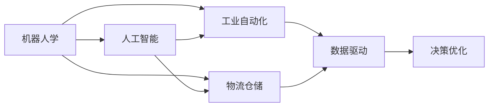

                 

# 自动化的最新进展与挑战

## 1. 背景介绍

在数字化时代，自动化技术的快速发展深刻改变了各行各业的运作方式。从制造业的智能制造，到服务业的人力资源自动化，再到金融行业的智能投顾，自动化技术的渗透无处不在，正在塑造未来社会的方方面面。自动化技术不仅提高了效率，降低了成本，还大幅提升了系统的可扩展性和可靠性。本文将从自动化技术最新进展与面临的挑战两方面，深入探讨这一前沿领域，为读者提供系统的理解和思考。

## 2. 核心概念与联系

### 2.1 核心概念概述

自动化技术涉及的范畴非常广泛，涵盖了从机器人学、人工智能到工业自动化、物流仓储等诸多领域。本文将聚焦于自动化的核心概念，并探讨其内在联系。

- **自动化**：指利用机器人、软件等技术，实现操作、决策、流程等的自动执行和优化。
- **机器人学**：研究机器人设计、控制、运动、感知等核心技术的学科。
- **人工智能**：旨在开发能够模拟、延伸和扩展人类智能的计算机系统。
- **工业自动化**：指在制造业等生产过程中，通过自动化技术提高生产效率和产品质量。
- **服务自动化**：利用人工智能技术优化服务流程，提升客户体验和运营效率。
- **数据驱动**：基于大数据分析，驱动自动化系统的决策和优化。

这些概念之间相互关联，共同构成了自动化技术的应用框架。机器人学和人工智能是技术基础，工业自动化和物流仓储是应用领域，数据驱动则提供了关键的优化手段。

### 2.2 概念间的关系

自动化技术的各个核心概念之间，存在着紧密的联系和互动。以下是一个Mermaid流程图，展示了这些概念之间的联系：



该流程图说明了自动化技术的各个核心概念是如何相互依存和共同推动自动化系统发展的。

## 3. 核心算法原理 & 具体操作步骤

### 3.1 算法原理概述

自动化的核心算法原理主要涉及机器学习、强化学习、控制理论等多个领域。这些算法通过模拟和延伸人类智能，实现了复杂系统的自动执行和优化。以下是几个关键原理：

- **监督学习**：通过标注数据训练模型，预测未标注数据的标签或属性。
- **无监督学习**：通过未标注数据训练模型，发现数据的内在结构和模式。
- **强化学习**：通过智能体与环境交互，学习最优策略，实现任务自动化。
- **模型预测**：基于历史数据和模型，预测未来的事件或状态。
- **控制理论**：研究如何通过控制律，使系统达到特定目标。

这些原理构成了自动化技术的主要技术基础，使得自动化系统能够实现高度的智能化和自动化。

### 3.2 算法步骤详解

自动化技术的具体操作步骤可以分为以下几个阶段：

1. **数据采集与预处理**：从各种来源收集数据，并进行清洗、归一化等预处理操作。
2. **模型训练与优化**：选择合适的算法，利用历史数据训练模型，并根据性能进行调整优化。
3. **系统集成与部署**：将训练好的模型集成到自动化系统中，并进行部署和测试。
4. **系统监控与反馈**：对自动化系统进行实时监控，根据反馈调整系统参数，实现持续优化。

### 3.3 算法优缺点

自动化技术虽然带来了诸多优势，但也存在一些挑战和局限性。以下是对自动化技术优缺点的详细分析：

**优点**：
- **效率提升**：自动化技术显著提高了操作效率和生产效率。
- **成本降低**：减少了人力和物理资源的投入，降低了运营成本。
- **精确度提高**：通过模型优化和系统监控，提高了决策和执行的精确度。
- **可扩展性**：系统易于扩展，能够快速适应新的任务和需求。

**缺点**：
- **技术复杂性**：自动化系统的设计和实现需要高水平的技术储备。
- **数据依赖**：模型的性能高度依赖于数据的质量和数量。
- **安全风险**：自动化系统可能面临网络攻击、数据泄露等安全风险。
- **系统维护**：自动化系统的维护和更新需要持续的技术投入。

### 3.4 算法应用领域

自动化技术在多个领域得到了广泛应用，以下是对几个主要应用领域的详细阐述：

- **制造业**：通过智能制造技术，实现生产线的自动化和智能化，提升生产效率和产品质量。
- **物流仓储**：利用自动化仓储系统，提高仓库管理效率，减少人力成本。
- **金融服务**：采用智能投顾和算法交易，实现投资决策的自动化和优化。
- **医疗健康**：通过自动化诊断和患者管理，提升医疗服务的效率和质量。
- **智能客服**：通过自然语言处理和对话系统，实现客服自动回复和客户管理。
- **智能交通**：利用智能交通管理系统，提高交通流量和安全性。

## 4. 数学模型和公式 & 详细讲解

### 4.1 数学模型构建

自动化的数学模型通常基于机器学习、强化学习等算法构建。以下是一个简单的强化学习模型框架：

1. **状态空间**：系统可能的状态集合。
2. **动作空间**：系统可以采取的动作集合。
3. **奖励函数**：根据当前状态和动作，计算奖励值。
4. **策略**：决策模型，从状态到动作的映射。

### 4.2 公式推导过程

以强化学习中的Q-learning算法为例，其核心公式为：

$$
Q(s_t, a_t) \leftarrow Q(s_t, a_t) + \alpha [r_{t+1} + \gamma \max_{a'} Q(s_{t+1}, a') - Q(s_t, a_t)]
$$

该公式用于更新Q值，表示在状态$s_t$采取动作$a_t$，之后得到奖励$r_{t+1}$并转移至状态$s_{t+1}$，采取动作$a'$的期望奖励。

### 4.3 案例分析与讲解

以自动驾驶技术为例，其核心算法包括感知、决策和控制三部分。其中，感知模块通过摄像头、雷达等传感器获取环境信息，决策模块通过深度学习和强化学习算法分析环境信息，控制模块则通过控制律实现车辆运动。

## 5. 项目实践：代码实例和详细解释说明

### 5.1 开发环境搭建

以下是一个使用Python和TensorFlow实现简单强化学习算法的开发环境搭建流程：

1. 安装Anaconda，创建Python虚拟环境。
2. 安装TensorFlow和其他相关库。
3. 设置数据采集和预处理工具。
4. 搭建模型训练和测试环境。

### 5.2 源代码详细实现

以下是一个简单的Q-learning算法的Python代码实现：

```python
import tensorflow as tf
import numpy as np

class QLearningAgent:
    def __init__(self, state_space, action_space, learning_rate=0.1, discount_factor=0.9, exploration_rate=0.9):
        self.state_space = state_space
        self.action_space = action_space
        self.learning_rate = learning_rate
        self.discount_factor = discount_factor
        self.exploration_rate = exploration_rate
        self.q = np.zeros([state_space, action_space])

    def select_action(self, state):
        if np.random.rand() < self.exploration_rate:
            return np.random.choice(self.action_space)
        else:
            return np.argmax(self.q[state, :])

    def train(self, state, action, reward, next_state):
        q_next = np.max(self.q[next_state, :])
        q_update = self.learning_rate * (reward + self.discount_factor * q_next - self.q[state, action])
        self.q[state, action] += q_update

    def update_exploration_rate(self, episode):
        self.exploration_rate = max(0.01, self.exploration_rate * 0.99)
```

### 5.3 代码解读与分析

该代码实现了一个简单的Q-learning算法，其中包含以下几个关键步骤：

1. 初始化Q值表，Q值表示在状态-动作对下的奖励值。
2. 根据探索率选择动作，探索率控制是否进行随机选择。
3. 根据Q-learning公式更新Q值。
4. 更新探索率，避免过拟合。

### 5.4 运行结果展示

运行上述代码，可以观察到模型在训练过程中Q值的变化，以及最终在特定环境下的策略表现。

## 6. 实际应用场景

### 6.1 智能制造

智能制造是自动化技术在制造业领域的重要应用。通过物联网、大数据和人工智能技术，可以实现从设计、生产到交付的全流程自动化。例如，利用计算机视觉和机器学习算法，实现产品质量检测和缺陷分析，显著提高生产效率和产品质量。

### 6.2 智能客服

智能客服系统通过自然语言处理和对话系统，实现客户自动回复和问题解答。利用深度学习算法，可以理解客户意图，生成自然流畅的回复，提升客户体验和满意度。

### 6.3 智能交通

智能交通系统利用传感器、摄像头等设备，实时获取交通流量、车流状态等信息，通过优化算法，实现交通流量控制和事故预防，提高交通安全性。

## 7. 工具和资源推荐

### 7.1 学习资源推荐

1. 《深度学习》：Ian Goodfellow等著，系统介绍了深度学习的基本概念和算法。
2. 《强化学习》：Richard Sutton和Andrew Barto著，介绍了强化学习的基本理论和算法。
3. Coursera和edX等在线学习平台：提供众多机器学习和强化学习课程，适合不同水平的学习者。
4. Google AI博客和DeepMind博客：分享最新的研究成果和应用案例，值得关注。

### 7.2 开发工具推荐

1. PyTorch：开源深度学习框架，灵活易用，支持多种算法和模型。
2. TensorFlow：Google开发的深度学习框架，功能强大，适合大规模工程应用。
3. Robot Operating System（ROS）：开源机器人操作系统，提供丰富的工具和库，支持机器人学和自动化应用。
4. Docker和Kubernetes：容器化和编排工具，方便自动化系统的部署和管理。

### 7.3 相关论文推荐

1. "A Survey of Recent Advances in Reinforcement Learning"：Jonathan Germain和Peter Dayan著，综述了最新的强化学习研究成果。
2. "Towards Autonomous Manufacturing: A Survey"：Simone Pezzullo和Giangiacomo Sorbello著，介绍了自动化在制造业中的应用。
3. "Robust Autonomous Vehicles"：Peng Cui等著，讨论了自动驾驶技术的最新进展和挑战。

## 8. 总结：未来发展趋势与挑战

### 8.1 研究成果总结

自动化技术在过去十年中取得了飞速发展，许多前沿研究和技术已经进入实际应用。机器学习、深度学习和强化学习等算法，为自动化系统提供了强大的技术支撑。然而，自动化技术也面临诸多挑战，包括技术复杂性、数据依赖、安全风险等。

### 8.2 未来发展趋势

1. **智能化升级**：随着算力成本的下降，大模型和深度学习技术将被进一步应用到自动化系统中，提升系统的智能化水平。
2. **多模态融合**：结合视觉、听觉和触觉等多模态数据，实现更全面、精准的系统感知。
3. **边缘计算**：利用边缘计算技术，实现数据就地处理和决策，降低延迟，提升系统效率。
4. **伦理和安全性**：自动化技术的发展必须考虑伦理和安全性问题，确保技术的应用符合社会价值观和法律法规。
5. **可解释性和透明性**：自动化系统的决策过程需要更加透明和可解释，以便用户理解和信任。

### 8.3 面临的挑战

1. **技术复杂性**：自动化系统的设计和实现需要高水平的技术储备，如何在保持性能的同时，降低复杂性，是一大挑战。
2. **数据依赖**：高质量数据的获取和处理，是自动化系统性能的关键。如何在数据稀缺的情况下，获得可靠的训练数据，是一个难题。
3. **安全性**：自动化系统面临的网络攻击和数据泄露风险，需要系统设计和开发过程中，重点关注安全问题。
4. **伦理和透明性**：自动化系统的决策过程需要更加透明和可解释，确保技术的应用符合社会价值观和法律法规。
5. **人机协同**：在自动化系统中，如何实现人机协同，提高系统的可扩展性和用户体验，是一个重要的研究方向。

### 8.4 研究展望

未来，自动化技术的发展需要从多个维度进行探索和突破。需要在智能化、可扩展性、安全性等方面，不断提升技术水平，适应不断变化的社会需求和应用场景。只有通过持续创新和优化，自动化技术才能在更多领域发挥重要作用，推动社会进步。

## 9. 附录：常见问题与解答

**Q1：什么是自动化技术？**

A: 自动化技术是通过机器人、软件等技术，实现操作、决策、流程等的自动执行和优化。

**Q2：自动化技术的主要应用领域有哪些？**

A: 自动化技术在制造业、物流仓储、金融服务、医疗健康、智能客服、智能交通等领域都有广泛应用。

**Q3：自动化技术面临的主要挑战是什么？**

A: 自动化技术面临的主要挑战包括技术复杂性、数据依赖、安全性、伦理和透明性问题。

**Q4：自动化技术的未来发展趋势有哪些？**

A: 自动化技术的未来发展趋势包括智能化升级、多模态融合、边缘计算、伦理和安全性、可解释性和透明性等。

**Q5：如何应对自动化技术的挑战？**

A: 应对自动化技术挑战的方法包括提升技术水平、优化数据处理、加强安全性、关注伦理和透明性、实现人机协同等。

---

作者：禅与计算机程序设计艺术 / Zen and the Art of Computer Programming

