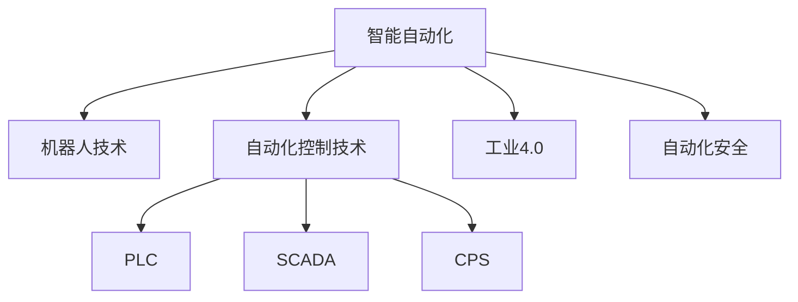

                 

# 自动化领域的最新发展趋势

## 1. 背景介绍

随着人工智能（AI）技术的发展，自动化领域正在经历着深刻的变革。从传统的机械自动化到现代的智能自动化，自动化技术的应用范围和深度都在不断扩大。然而，自动化领域的快速发展也带来了新的挑战和机遇。本文将深入探讨自动化领域的最新发展趋势，包括智能自动化、自动化在各行业的应用、未来发展方向及面临的挑战。

## 2. 核心概念与联系

### 2.1 核心概念概述

在自动化领域，以下概念是至关重要的：

- **智能自动化**：利用人工智能技术，特别是机器学习和深度学习，实现自动化的智能化。智能自动化可以处理更复杂、更动态的任务，并具有更强的适应性。
- **机器人技术**：包括工业机器人、服务机器人和协作机器人等。机器人技术在制造业、物流、医疗等行业得到了广泛应用。
- **自动化控制技术**：如PLC（可编程逻辑控制器）、SCADA（监控和数据采集系统）、CPS（信息物理系统）等，用于控制和优化自动化系统的运行。
- **工业4.0**：以智能制造为核心，通过信息通信技术（ICT）和自动化技术，实现从产品设计到生产的全流程智能化。
- **自动化安全**：包括物理安全、网络安全和数据安全等方面，保障自动化系统的可靠性和安全性。

### 2.2 核心概念之间的联系

自动化领域各核心概念之间存在着密切的联系，通过协同工作，推动了自动化技术的不断进步。以下是一个简单的Mermaid流程图，展示了这些概念之间的关系：



在这个图中，智能自动化是核心概念，通过机器人技术、自动化控制技术、工业4.0等技术的应用，推动了自动化系统的智能化和自动化。同时，自动化安全作为保障，确保了整个系统的可靠性和安全性。

## 3. 核心算法原理 & 具体操作步骤

### 3.1 算法原理概述

自动化领域的算法原理主要基于机器学习和深度学习技术。通过对大量数据的学习，自动化系统可以自主地完成各种任务，如图像识别、语音识别、自然语言处理等。机器学习和深度学习算法主要包括以下几个步骤：

1. **数据预处理**：包括数据清洗、数据增强、数据标准化等。
2. **特征提取**：从原始数据中提取有意义的特征，用于训练模型。
3. **模型训练**：使用训练数据对模型进行训练，优化模型参数。
4. **模型评估**：通过测试数据评估模型的性能，选择合适的模型。
5. **模型部署**：将训练好的模型部署到实际应用中。

### 3.2 算法步骤详解

以下是一个机器学习算法的详细步骤：

1. **数据预处理**：
   - **数据清洗**：去除噪声、缺失值等。
   - **数据增强**：通过旋转、缩放、裁剪等方式增加数据多样性。
   - **数据标准化**：将数据缩放到统一范围，便于模型训练。

2. **特征提取**：
   - **手工特征提取**：根据经验设计特征，如颜色直方图、边缘检测等。
   - **自动特征提取**：使用深度学习模型自动提取特征，如卷积神经网络（CNN）、循环神经网络（RNN）等。

3. **模型训练**：
   - **选择模型**：选择适合的模型，如线性回归、支持向量机（SVM）、神经网络等。
   - **训练数据**：使用训练数据对模型进行训练。
   - **优化算法**：使用梯度下降等优化算法，更新模型参数。
   - **正则化**：使用L2正则化等防止过拟合。

4. **模型评估**：
   - **交叉验证**：使用交叉验证评估模型性能。
   - **准确率、召回率、F1分数**：评估模型的分类准确性。
   - **ROC曲线**：评估模型的二分类性能。

5. **模型部署**：
   - **模型导出**：将训练好的模型导出为可部署的格式，如TensorFlow模型、Keras模型等。
   - **部署平台**：选择适合的平台，如TensorFlow Serving、KubeFlow等。
   - **监控和更新**：实时监控模型性能，定期更新模型以应对数据变化。

### 3.3 算法优缺点

自动化领域的算法具有以下优点：
- **高效性**：自动化算法可以处理大量数据，提高处理效率。
- **可扩展性**：算法可以应用于各种复杂场景，具有很强的适应性。
- **自我优化**：自动化算法可以根据反馈数据不断优化，提高性能。

同时，也存在一些缺点：
- **数据依赖性**：自动化算法的性能依赖于数据质量，数据偏差可能导致模型失效。
- **模型复杂性**：复杂的深度学习模型可能难以理解和调试。
- **计算资源消耗**：深度学习模型需要大量的计算资源，可能对设备要求较高。

### 3.4 算法应用领域

自动化领域的应用范围非常广泛，涵盖以下几个主要领域：

- **制造业**：自动化生产线和智能制造。
- **物流**：自动化仓储和配送系统。
- **医疗**：智能诊断和手术辅助。
- **金融**：自动化交易和风险管理。
- **交通**：自动驾驶和交通管理。

## 4. 数学模型和公式 & 详细讲解 & 举例说明

### 4.1 数学模型构建

以图像识别为例，以下是基本的数学模型构建过程：

1. **输入数据**：图像数据 $X \in \mathbb{R}^{n \times d}$，其中 $n$ 是图像数量，$d$ 是每个图像的维度（如像素数）。
2. **输出数据**：标签数据 $Y \in \{0, 1\}^{n \times c}$，其中 $c$ 是类别数量。
3. **模型结构**：使用卷积神经网络（CNN），如图像卷积层、池化层、全连接层等。

### 4.2 公式推导过程

以简单的线性回归模型为例，推导模型的损失函数：

$$
L(w, b) = \frac{1}{2m} \sum_{i=1}^m (h_\theta(x^{(i)}) - y^{(i)})^2
$$

其中 $h_\theta(x^{(i)}) = \theta^T x^{(i)} + b$，$\theta$ 和 $b$ 是模型的参数。

通过梯度下降等优化算法，求解模型参数 $\theta$ 和 $b$，最小化损失函数 $L(w, b)$。

### 4.3 案例分析与讲解

以图像分类为例，使用TensorFlow实现一个简单的CNN模型：

```python
import tensorflow as tf
from tensorflow.keras import layers, models

# 定义模型
model = models.Sequential([
    layers.Conv2D(32, (3, 3), activation='relu', input_shape=(28, 28, 1)),
    layers.MaxPooling2D((2, 2)),
    layers.Flatten(),
    layers.Dense(10, activation='softmax')
])

# 编译模型
model.compile(optimizer='adam', loss='sparse_categorical_crossentropy', metrics=['accuracy'])

# 训练模型
model.fit(train_images, train_labels, epochs=10, validation_data=(test_images, test_labels))
```

这个模型包含两个卷积层、一个池化层和一个全连接层，用于对MNIST数据集进行分类。模型使用交叉熵损失函数，并使用Adam优化器进行训练。

## 5. 项目实践：代码实例和详细解释说明

### 5.1 开发环境搭建

- **Python环境**：安装Python 3.7及以上版本。
- **TensorFlow**：安装TensorFlow 2.0及以上版本。
- **PyTorch**：安装PyTorch 1.3及以上版本。
- **Keras**：安装Keras 2.0及以上版本。

### 5.2 源代码详细实现

以下是一个简单的图像分类模型实现：

```python
import tensorflow as tf
from tensorflow.keras import layers, models

# 定义模型
model = models.Sequential([
    layers.Conv2D(32, (3, 3), activation='relu', input_shape=(28, 28, 1)),
    layers.MaxPooling2D((2, 2)),
    layers.Flatten(),
    layers.Dense(10, activation='softmax')
])

# 编译模型
model.compile(optimizer='adam', loss='sparse_categorical_crossentropy', metrics=['accuracy'])

# 训练模型
model.fit(train_images, train_labels, epochs=10, validation_data=(test_images, test_labels))
```

这个模型包含两个卷积层、一个池化层和一个全连接层，用于对MNIST数据集进行分类。模型使用交叉熵损失函数，并使用Adam优化器进行训练。

### 5.3 代码解读与分析

- **定义模型**：使用Sequential模型，逐层添加卷积层、池化层和全连接层。
- **编译模型**：设置优化器、损失函数和评估指标。
- **训练模型**：使用训练数据和验证数据进行模型训练，设置训练轮数。

### 5.4 运行结果展示

训练过程中，可以使用TensorBoard可视化模型性能：

```python
from tensorflow.keras.callbacks import TensorBoard

# 初始化TensorBoard回调
tensorboard_callback = TensorBoard(log_dir='logs')

# 训练模型
model.fit(train_images, train_labels, epochs=10, validation_data=(test_images, test_labels), callbacks=[tensorboard_callback])
```

训练完成后，可以在TensorBoard中查看模型损失和准确率的曲线：


## 6. 实际应用场景

### 6.1 智能制造

智能制造是自动化领域的重要应用场景之一。通过自动化技术和人工智能技术，可以实现生产线的智能调度、质量检测和预测维护等。例如，在汽车制造中，使用自动化机器人和智能控制系统，可以实现零件的自动化装配和质量检测，提高生产效率和产品质量。

### 6.2 智能物流

智能物流是自动化技术的另一个重要应用场景。通过自动化仓储和配送系统，可以实现货物的自动化存储、分拣和配送，提高物流效率和准确性。例如，Amazon的Kiva机器人系统，可以在仓储中自动搬运货物，减少人力成本。

### 6.3 医疗诊断

医疗诊断是自动化技术在医疗领域的重要应用之一。通过智能诊断系统，可以实现对患者病历、影像和检查结果的自动化分析，辅助医生进行诊断。例如，使用深度学习技术，可以对医学影像进行自动分析和诊断，如CT、MRI等。

### 6.4 自动驾驶

自动驾驶是自动化技术在交通领域的重要应用之一。通过自动驾驶技术，可以实现对车辆的控制和路径规划，提高行车安全性和效率。例如，特斯拉的Autopilot系统，可以实现自动驾驶和辅助驾驶功能。

## 7. 工具和资源推荐

### 7.1 学习资源推荐

- **Coursera**：提供多个AI和自动化领域的在线课程，如“Deep Learning Specialization”、“Machine Learning by Andrew Ng”等。
- **edX**：提供多个AI和自动化领域的在线课程，如“Artificial Intelligence Fundamentals”、“Introduction to Machine Learning with Python”等。
- **Google AI Education**：提供多个AI和自动化领域的免费课程和教程，如“Machine Learning Crash Course”、“TensorFlow for AI”等。

### 7.2 开发工具推荐

- **TensorFlow**：Google开发的深度学习框架，支持多种算法和模型。
- **PyTorch**：Facebook开发的深度学习框架，支持动态计算图和多种算法。
- **Keras**：一个高级神经网络API，支持多种深度学习模型和框架。

### 7.3 相关论文推荐

- **Attention is All You Need**：一篇介绍Transformer架构的论文，开创了深度学习模型的新纪元。
- **Deep Residual Learning for Image Recognition**：一篇介绍深度残差网络（ResNet）的论文，推动了图像分类和识别技术的发展。
- **Faster R-CNN: Towards Real-Time Object Detection with Region Proposal Networks**：一篇介绍Faster R-CNN模型的论文，推动了目标检测技术的进步。

## 8. 总结：未来发展趋势与挑战

### 8.1 研究成果总结

自动化领域在过去几年中取得了显著的进展，主要体现在以下几个方面：
- **深度学习技术的发展**：深度学习在自动化领域的应用范围不断扩大，如图像识别、语音识别、自然语言处理等。
- **机器人技术的发展**：机器人技术在制造业、物流、医疗等领域得到了广泛应用。
- **自动化系统的智能化**：通过AI技术，自动化系统可以处理更复杂、更动态的任务，具有更强的适应性。

### 8.2 未来发展趋势

未来自动化领域将呈现以下几个发展趋势：
- **智能化和自动化融合**：智能化和自动化技术将更加紧密结合，实现从生产到决策的全流程自动化。
- **多模态融合**：自动化系统将融合多种模态信息，如图像、语音、传感器数据等，提高系统的感知能力和决策水平。
- **自适应和自学习**：自动化系统将具备自适应和自学习能力，根据环境和任务的变化，自主优化和调整。
- **边缘计算**：自动化系统将向边缘计算方向发展，在本地进行数据处理和分析，减少对云端的依赖。
- **人机协同**：自动化系统将与人进行更加紧密的协同工作，实现从简单自动化到智能协作的转变。

### 8.3 面临的挑战

自动化领域面临的挑战主要包括以下几个方面：
- **数据质量**：自动化系统的性能依赖于数据质量，数据偏差可能导致模型失效。
- **模型复杂性**：复杂的深度学习模型可能难以理解和调试。
- **计算资源消耗**：深度学习模型需要大量的计算资源，可能对设备要求较高。
- **安全性和可靠性**：自动化系统的安全性和可靠性是关键，需要综合考虑物理安全、网络安全和数据安全等方面。
- **伦理和法律**：自动化系统的应用需要考虑伦理和法律问题，确保其公正性和透明度。

### 8.4 研究展望

未来自动化领域的研究方向包括：
- **可解释性**：提高自动化系统的可解释性，使其决策过程更加透明和可信。
- **自适应性**：增强自动化系统的自适应性，使其能够灵活应对环境和任务的变化。
- **多模态融合**：探索多模态融合技术，实现视觉、语音、传感器数据等的协同建模。
- **人机协作**：研究人机协作技术，实现更加自然和高效的人机交互。
- **智能决策**：探索智能决策技术，提高自动化系统的决策能力和效果。

## 9. 附录：常见问题与解答

**Q1：自动化技术为什么能够提高生产效率？**

A：自动化技术通过引入机器人和智能化系统，可以代替人类进行重复性和高危工作，提高生产效率和准确性。同时，自动化系统可以24小时不间断工作，减少了人力成本和时间成本。

**Q2：深度学习算法在自动化中有什么应用？**

A：深度学习算法在自动化中的应用非常广泛，如图像识别、语音识别、自然语言处理等。例如，在制造业中，使用深度学习算法可以对产品的外观和缺陷进行自动检测，提高产品质量和生产效率。

**Q3：如何保证自动化系统的安全性？**

A：自动化系统的安全性需要从多个方面进行保障，包括物理安全、网络安全和数据安全等方面。例如，在工业自动化中，需要使用安全锁和监控系统，确保设备的安全运行。

**Q4：自动化系统的维护和更新如何实现？**

A：自动化系统的维护和更新需要定期进行，以应对设备磨损和环境变化。例如，在机器人系统中，需要进行定期维护和保养，确保设备的正常运行。

**Q5：自动化技术在医疗领域的应用有哪些？**

A：自动化技术在医疗领域的应用非常广泛，包括智能诊断、手术辅助、药物推荐等。例如，使用深度学习算法，可以对医学影像进行自动分析和诊断，提高诊断的准确性和效率。

总之，自动化技术在各个领域的应用前景广阔，随着技术的不断进步和创新，自动化将带来更多的变革和机遇。开发者需要紧跟技术发展，不断探索和优化自动化系统的性能和应用，以应对未来的挑战和机遇。

---

作者：禅与计算机程序设计艺术 / Zen and the Art of Computer Programming

