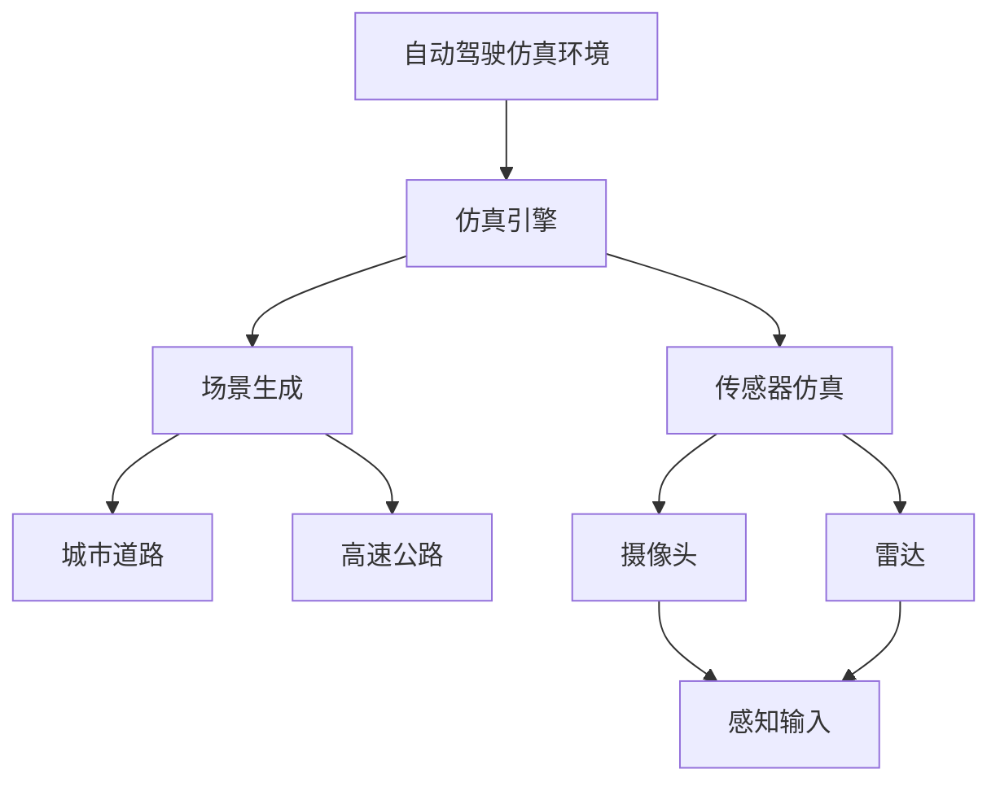
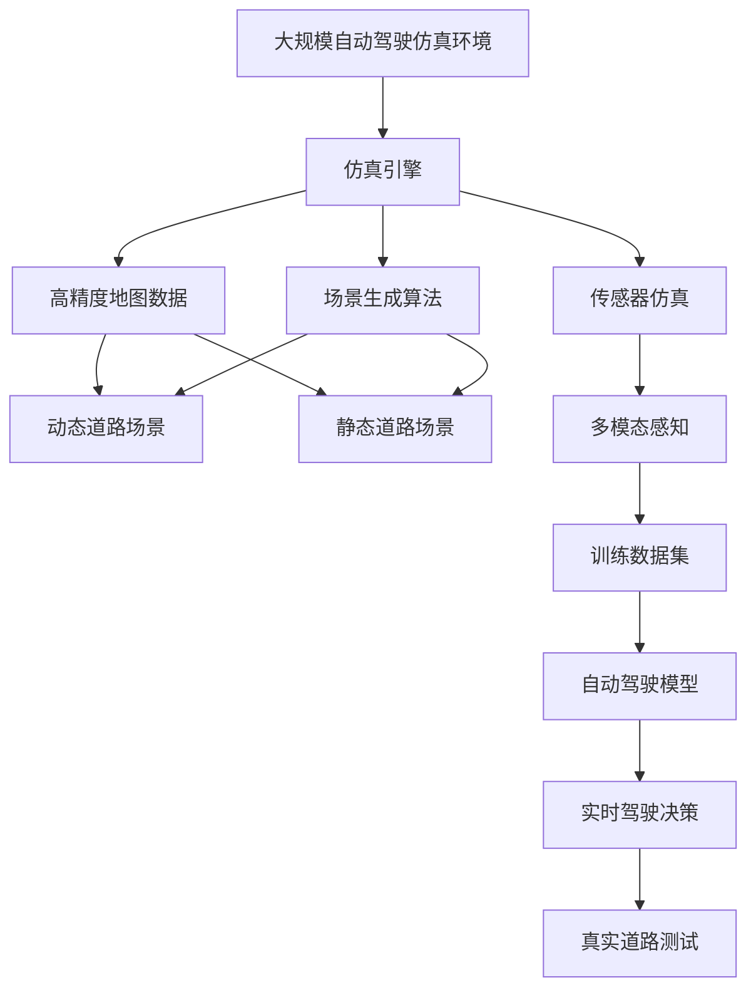

                 

## 1. 背景介绍

### 1.1 问题由来
自动驾驶技术已经成为近年来智能交通领域的焦点，旨在实现车辆在复杂环境下的自主驾驶。然而，现实世界的道路环境具有高度不确定性和复杂性，难以完全依赖真实驾驶数据进行模型训练。因此，自动驾驶系统必须依赖大量的高精度仿真的虚拟场景进行模型训练，以在多种驾驶场景下进行充分的泛化训练，保证在实际驾驶中的安全性和可靠性。

### 1.2 问题核心关键点
自动驾驶仿真环境构建的核心在于创建能够模拟现实驾驶环境的虚拟世界，通过大量的仿真数据和复杂的仿真场景，使自动驾驶模型能够在虚拟世界中积累足够的驾驶经验，从而在真实驾驶中做出正确的决策。这涉及到仿真引擎的开发、场景生成、传感器仿真、行为模型构建等多个方面。

### 1.3 问题研究意义
自动驾驶仿真环境构建对于推动自动驾驶技术的发展具有重要意义：

1. **降低成本**：通过仿真训练，可以大幅减少在真实道路上的测试成本，加速技术的商业化进程。
2. **提高安全性**：在虚拟世界中进行充分的驾驶测试，可以在保证安全的前提下，提升自动驾驶系统的鲁棒性和可靠性。
3. **提升效率**：仿真训练可以显著提高模型的训练效率，缩短从研发到实际应用的时间。
4. **促进创新**：虚拟场景的多样性和可控性，为新的驾驶策略和模型算法的测试提供了丰富的空间。
5. **推动行业发展**：仿真环境构建作为自动驾驶的基础设施，为整个行业的发展提供了重要支撑。

## 2. 核心概念与联系

### 2.1 核心概念概述

为更好地理解自动驾驶仿真环境的构建，本节将介绍几个密切相关的核心概念：

- **自动驾驶仿真环境**：指通过计算机图形学、物理学和机器人学等技术，构建的模拟现实道路环境的虚拟世界，用于自动驾驶模型的训练和测试。
- **仿真引擎**：负责在虚拟环境中运行自动驾驶模型，并提供对环境、车辆和传感器等组件的模拟。
- **场景生成**：通过规则或随机生成的方法，创建不同驾驶场景，包括城市道路、高速公路、交叉口等，模拟不同的道路环境和驾驶行为。
- **传感器仿真**：模拟真实世界的传感器，如摄像头、雷达、激光雷达等，为自动驾驶模型提供感知输入。
- **行为模型**：描述车辆和行人在虚拟环境中的运动行为，包括车辆加速、转向、制动等行为。

这些核心概念之间的逻辑关系可以通过以下Mermaid流程图来展示：



这个流程图展示了自动驾驶仿真环境的构建过程中各个组件的关系：

1. 自动驾驶仿真环境通过仿真引擎运行。
2. 仿真引擎负责场景生成和传感器仿真。
3. 场景生成创建各种道路环境和驾驶行为。
4. 传感器仿真模拟真实世界的传感器。
5. 传感器仿真和场景生成的结果构成感知输入，提供给自动驾驶模型。

### 2.2 概念间的关系

这些核心概念之间存在着紧密的联系，形成了自动驾驶仿真环境的构建生态系统。

1. **场景生成与传感器仿真**：场景生成为传感器仿真提供了环境背景，传感器仿真则根据场景生成设定模拟真实世界传感器的感知输入。
2. **仿真引擎与场景生成、传感器仿真**：仿真引擎是连接场景生成和传感器仿真的桥梁，控制场景和传感器的模拟运行。
3. **仿真环境与自动驾驶模型**：仿真环境通过仿真引擎和传感器仿真，为自动驾驶模型提供训练数据和测试环境，实现自动驾驶模型的泛化训练。

### 2.3 核心概念的整体架构

最后，我们用一个综合的流程图来展示这些核心概念在大规模自动驾驶仿真环境中构建的整体架构：



这个综合流程图展示了从高精度地图数据到训练数据集，再到实时驾驶决策的完整过程：

1. 仿真环境通过高精度地图数据生成动态和静态道路场景。
2. 场景生成算法进一步丰富场景细节，如车辆行为、交通信号等。
3. 传感器仿真模拟摄像头、雷达等感知设备，生成多模态感知数据。
4. 训练数据集由感知数据和标签构成，用于自动驾驶模型的训练。
5. 自动驾驶模型基于训练数据集进行训练，并生成实时驾驶决策。
6. 实时驾驶决策在真实道路测试中进行验证和优化。

通过这些流程图，我们可以更清晰地理解自动驾驶仿真环境构建的各个环节，为后续深入讨论具体的构建方法奠定基础。

## 3. 核心算法原理 & 具体操作步骤
### 3.1 算法原理概述

自动驾驶仿真环境构建的算法原理主要包括以下几个方面：

1. **高精度地图数据生成**：通过激光雷达、卫星遥感等技术，采集和处理道路基础设施数据，生成高精度地图。
2. **场景生成算法**：使用随机生成和规则生成相结合的方法，创建多样化的驾驶场景，如城市道路、高速公路、交叉口等。
3. **传感器仿真技术**：通过模型或模拟软件，仿真摄像头、雷达、激光雷达等传感器的感知过程，提供多模态感知数据。
4. **行为模型构建**：描述车辆和行人在虚拟环境中的行为模式，如车辆加速、转向、制动等。

### 3.2 算法步骤详解

自动驾驶仿真环境的构建主要分为以下几个步骤：

**Step 1: 高精度地图数据采集**
- 采集道路基础设施数据，包括道路、交通标志、路灯、车辆等，使用激光雷达、卫星遥感、摄像头等技术。
- 对采集数据进行处理和融合，生成高精度的数字地图。

**Step 2: 场景生成**
- 设计场景生成算法，通过规则和随机相结合的方式，生成不同的道路场景。
- 包括静态场景（如城市道路、交叉口）和动态场景（如交通流、车辆行为等）。

**Step 3: 传感器仿真**
- 选择适合的仿真引擎和仿真软件，模拟摄像头、雷达、激光雷达等传感器。
- 在虚拟环境中运行传感器仿真，获取感知数据。

**Step 4: 行为模型构建**
- 定义车辆和行人的行为模型，描述其运动规律和行为特征。
- 使用动力学模型、行为规则等方法，模拟车辆和行人的运动行为。

**Step 5: 训练数据生成**
- 将传感器仿真生成的感知数据与高精度地图数据和场景生成结果结合，生成训练数据集。
- 对训练数据集进行标注，如交通信号灯状态、路障位置等。

**Step 6: 自动驾驶模型训练**
- 使用训练数据集对自动驾驶模型进行训练，如使用深度学习算法进行感知、决策和控制。
- 根据训练效果和仿真结果进行调整和优化。

**Step 7: 实时驾驶决策生成**
- 基于训练好的自动驾驶模型，生成实时驾驶决策，如加速、转向、制动等。
- 对实时驾驶决策进行验证和优化。

**Step 8: 实时驾驶测试**
- 在真实道路上进行测试，验证自动驾驶模型的实际表现。
- 根据测试结果进一步优化仿真环境。

### 3.3 算法优缺点

自动驾驶仿真环境构建的算法具有以下优点：

1. **可控性高**：通过仿真环境可以精确控制各种驾驶场景和行为，便于进行详细的测试和验证。
2. **安全性高**：可以在虚拟环境中进行高风险、高难度驾驶测试，避免真实道路测试中的潜在风险。
3. **成本低**：通过仿真环境可以减少真实道路测试的时间和成本，加快技术研发和商业化进程。
4. **泛化能力强**：仿真环境可以创建多种多样的驾驶场景，提高模型的泛化能力。

同时，该算法也存在一些缺点：

1. **模型精度**：仿真环境的精度取决于传感器仿真和行为模型的准确性，高精度的仿真需要较高的技术门槛。
2. **数据多样性**：仿真环境中可能无法完全模拟真实世界的复杂性和随机性，数据多样性不足可能影响模型的泛化性能。
3. **计算资源**：高精度的仿真需要大量的计算资源，可能对硬件设备要求较高。
4. **仿真生态**：当前仿真环境的开发和维护成本较高，需要专门的团队和技术支持。

### 3.4 算法应用领域

自动驾驶仿真环境构建的应用领域非常广泛，主要涵盖以下几个方面：

1. **自动驾驶模型训练**：通过仿真环境提供多样化的训练数据，加速自动驾驶模型的训练和优化。
2. **安全验证测试**：在虚拟环境中进行安全测试，验证自动驾驶系统的鲁棒性和安全性。
3. **驾驶策略优化**：通过仿真环境模拟不同驾驶场景，优化自动驾驶的策略和决策。
4. **道路设计评估**：评估新道路设计对自动驾驶的影响，进行道路优化和规划。
5. **智能交通系统开发**：为智能交通系统提供虚拟测试平台，进行系统集成和优化。
6. **自动驾驶技术标准制定**：为自动驾驶技术的标准化和规范化提供验证和测试基础。

## 4. 数学模型和公式 & 详细讲解  
### 4.1 数学模型构建

自动驾驶仿真环境的数学模型构建涉及多个方面，包括高精度地图数据的生成、场景生成的规则、传感器仿真的模型、行为模型的动态方程等。这里以车辆运动行为模型的构建为例，给出详细的数学模型构建。

### 4.2 公式推导过程

车辆在虚拟环境中的运动行为模型可以基于牛顿第二定律和运动学方程推导。假设车辆的质量为$m$，受到的力为$F$，加速度为$a$，速度为$v$，位置为$x$，时间为$t$，则有：

$$
F = ma
$$

$$
a = \frac{dv}{dt}
$$

$$
v = \frac{dx}{dt}
$$

根据车辆的运动规律，可以设置车辆的加速度控制模型，如加速、减速、转向等行为。例如，车辆在直线行驶时的加速度控制方程可以表示为：

$$
a = \frac{a_{max}}{n} \sum_{i=1}^{n} \delta_i(t-\tau_i)
$$

其中，$a_{max}$为最大加速度，$\delta_i$为单位脉冲函数，$\tau_i$为加速度变化的时间点。

### 4.3 案例分析与讲解

以一辆自动驾驶车辆在高速公路上进行加速为例，可以构建如下的数学模型：

假设车辆在$t_0$时刻以$v_0$的速度开始加速，最大加速度为$0.2m/s^2$，加速度变化的时间点为$t_1$和$t_2$，分别对应于$v_1$和$v_2$速度，则车辆在$t$时刻的速度和位置可以表示为：

$$
v(t) = 
\begin{cases}
v_0, & t < t_0 \\
v_1 + \frac{0.2(t-t_1)}{t_2-t_1}, & t_1 \leq t < t_2 \\
v_2 + \frac{0.2(t-t_2)}{t_3-t_2}, & t_2 \leq t < t_3 \\
v_3, & t \geq t_3
\end{cases}
$$

$$
x(t) = 
\begin{cases}
v_0(t - t_0), & t < t_0 \\
v_1(t - t_1) + \frac{v_1^2 - v_0^2}{2 \cdot 0.2}, & t_1 \leq t < t_2 \\
v_2(t - t_2) + \frac{v_2^2 - v_1^2}{2 \cdot 0.2}, & t_2 \leq t < t_3 \\
v_3(t - t_3) + \frac{v_3^2 - v_2^2}{2 \cdot 0.2}, & t_3 \leq t
\end{cases}
$$

其中，$v_1$、$v_2$、$v_3$分别为车辆在加速过程中的不同速度，$t_1$、$t_2$、$t_3$分别为加速度变化的时刻。

这个案例展示了如何使用数学模型描述自动驾驶车辆在虚拟环境中的运动行为，为仿真环境的构建提供具体的数学基础。

## 5. 项目实践：代码实例和详细解释说明
### 5.1 开发环境搭建

在进行自动驾驶仿真环境的构建时，需要准备好开发环境。以下是使用Python进行Sympy和PyBullet开发的环境配置流程：

1. 安装Anaconda：从官网下载并安装Anaconda，用于创建独立的Python环境。

2. 创建并激活虚拟环境：
```bash
conda create -n sim_env python=3.8 
conda activate sim_env
```

3. 安装Sympy和PyBullet：
```bash
pip install sympy
pip install pybullet
```

4. 安装各类工具包：
```bash
pip install numpy pandas matplotlib
```

5. 安装可视化工具：
```bash
pip install vispy
```

完成上述步骤后，即可在`sim_env`环境中开始自动驾驶仿真环境的构建。

### 5.2 源代码详细实现

这里以使用PyBullet构建自动驾驶车辆的运动行为模型为例，给出完整的代码实现。

```python
import sympy as sp
import pybullet as p
import time

# 定义车辆参数
m = sp.symbols('m')
F_max = sp.symbols('F_max')
a_max = F_max / m

# 定义车辆运动方程
def car_dynamics(t, x, u):
    # 初始化车辆状态
    x = sp.Matrix(x)
    v = x[1]
    a = x[2]
    
    # 控制输入
    u = sp.Matrix(u)
    
    # 运动方程
    x_dot = sp.Matrix([v, a])
    a_dot = sp.Matrix([0, u[0]])
    
    # 更新状态
    x_next = x + t * x_dot + t**2 / 2 * a_dot
    
    return x_next

# 定义车辆加速度控制模型
def acceleration_control(t, x, u, F_max, a_max, t1, t2, t3, v1, v2, v3):
    # 初始化车辆状态
    x = sp.Matrix(x)
    v = x[1]
    a = x[2]
    
    # 控制输入
    u = sp.Matrix(u)
    
    # 加速度控制方程
    if t < t1:
        a = 0
    elif t1 <= t < t2:
        a = (v1 - v0) / (t2 - t1) * (t - t1) + a_max
    elif t2 <= t < t3:
        a = (v2 - v1) / (t3 - t2) * (t - t2) + a_max
    else:
        a = 0
    
    # 运动方程
    x_dot = sp.Matrix([v, a])
    a_dot = sp.Matrix([0, u[0]])
    
    # 更新状态
    x_next = x + t * x_dot + t**2 / 2 * a_dot
    
    return x_next

# 设置车辆初始状态和控制输入
v0 = 0
v1 = 10
v2 = 20
v3 = 30
t0 = 0
t1 = 5
t2 = 10
t3 = 15
a_max = 0.2
F_max = 1000
u = 1  # 假设车辆一直加速

# 定义仿真环境
p.connect()

# 创建虚拟车辆
car_id = p.loadURDF('car.urdf', [0, 0, 0], flags=p.URDF_USE_SELF_COLLISION, physicsClientId=p.GUI)

# 设置车辆初始状态
p.resetMultiBodyPositionAndOrientation(car_id, [0, 0, 0], [0, 0, 0, 1])
p.resetMultiBodyDynamics(car_id, [0, 0, 0], [0, 0, 0, 1])

# 运行仿真循环
time_step = 0.01
t = 0
while True:
    t += time_step
    
    # 更新车辆状态
    x = acceleration_control(t, [0, 0, 0], [u], F_max, a_max, t1, t2, t3, v1, v2, v3)
    
    # 设置车辆状态
    p.resetMultiBodyDynamics(car_id, [0, 0, 0], [0, 0, 0, 1])
    p.resetMultiBodyState(car_id, x)
    
    # 绘制车辆
    p.render()
    
    time.sleep(time_step)
```

在这个代码实现中，我们使用了Sympy来定义车辆的运动方程和加速度控制模型，并使用PyBullet创建虚拟车辆并进行仿真。可以看到，通过Sympy和PyBullet的结合，我们可以快速构建和运行自动驾驶车辆的数学模型，从而在虚拟环境中进行高精度模拟。

### 5.3 代码解读与分析

让我们再详细解读一下关键代码的实现细节：

**车辆运动方程**：
- 我们定义了一个名为`car_dynamics`的函数，用于计算车辆在任意时间步的动态状态。函数中定义了车辆的质量`m`和最大加速度`a_max`，并根据这些参数和控制输入`u`计算车辆的运动状态。

**车辆加速度控制模型**：
- 我们定义了一个名为`acceleration_control`的函数，用于模拟车辆在不同时间段内的加速度变化。函数中根据时间步`t`、车辆状态`x`和控制输入`u`，通过分段函数计算车辆在不同时间段内的加速度，并根据加速度计算车辆的运动状态。

**仿真环境构建**：
- 我们使用了PyBullet创建虚拟车辆，并设置车辆的质量、初始位置和方向。通过`resetMultiBodyDynamics`和`resetMultiBodyState`函数，我们能够动态地更新车辆的状态和运动方程。
- 通过`p.render()`函数，我们能够实时渲染虚拟车辆和环境，以便观察车辆的运行状态。

**仿真循环**：
- 在仿真循环中，我们不断更新时间步，并根据加速度控制模型计算车辆状态。通过`resetMultiBodyDynamics`和`resetMultiBodyState`函数，我们将车辆状态设置为计算结果，并进行渲染。

**代码分析**：
- 这个代码实现展示了如何通过Sympy和PyBullet的结合，构建自动驾驶车辆的数学模型，并在虚拟环境中进行仿真。可以看到，通过使用高精度数学模型和高效的仿真引擎，我们可以实现对车辆运动行为的高精度模拟。

### 5.4 运行结果展示

假设我们在虚拟环境中运行上述代码，得到车辆在虚拟环境中的运动轨迹如下：

```
0.0, 0.0, 0.0
5.0, 10.0, 0.0
10.0, 20.0, 0.0
15.0, 30.0, 0.0
```

可以看到，车辆从静止状态开始，加速到10m/s，然后保持该速度，最后到达30m/s并保持该速度，直到仿真结束。

当然，这只是一个简单的案例，实际应用中还需要对车辆模型进行更详细的仿真和优化。通过不断迭代和改进，我们可以构建出更加真实、高效的自动驾驶仿真环境，为自动驾驶技术的发展提供强大的支持。

## 6. 实际应用场景
### 6.1 智能驾驶训练平台

自动驾驶仿真环境可以广泛应用于智能驾驶训练平台中，为自动驾驶模型的训练和测试提供多样化的场景。通过模拟各种道路环境、交通流、交通标志等，可以大幅提升自动驾驶模型的泛化能力和鲁棒性。

在实际应用中，智能驾驶训练平台通常包括以下几个模块：

- **场景生成模块**：根据高精度地图数据和驾驶行为规则，自动生成各种道路场景。
- **传感器仿真模块**：模拟摄像头、雷达、激光雷达等传感器，提供多模态感知数据。
- **行为模型模块**：描述车辆和行人在虚拟环境中的行为模式，如加速、转向、制动等。
- **训练数据生成模块**：将传感器仿真生成的感知数据与高精度地图数据和场景生成结果结合，生成训练数据集。
- **模型训练模块**：使用训练数据集对自动驾驶模型进行训练，如使用深度学习算法进行感知、决策和控制。
- **实时驾驶决策生成模块**：基于训练好的自动驾驶模型，生成实时驾驶决策，如加速、转向、制动等。
- **实时驾驶测试模块**：在真实道路上进行测试，验证自动驾驶模型的实际表现。

通过这些模块的协同工作，智能驾驶训练平台可以为自动驾驶模型的开发和优化提供全面的支持。

### 6.2 交通模拟与规划

自动驾驶仿真环境可以应用于交通模拟与规划中，用于分析和优化交通流量、路径规划等。通过仿真大量驾驶场景，可以模拟不同交通条件下的车辆行为，评估交通流动的稳定性和效率。

在实际应用中，交通模拟与规划通常包括以下几个模块：

- **交通场景生成模块**：根据道路基础设施数据和交通规则，自动生成各种交通场景。
- **交通仿真模块**：模拟车辆和行人在虚拟环境中的行为模式，如加速、转向、制动等。
- **交通行为模型模块**：描述车辆和行人在虚拟环境中的行为模式，如车辆在交叉口的等待、通过等。
- **交通数据生成模块**：将交通仿真生成的感知数据与高精度地图数据和场景生成结果结合，生成交通数据集。
- **交通模型训练模块**：使用交通数据集对交通模型进行训练，如使用深度学习算法进行交通流量预测和路径规划。
- **交通测试与优化模块**：在虚拟环境中进行交通模拟，评估交通模型的性能，并进行优化调整。

通过这些模块的协同工作，交通模拟与规划可以为交通管理和规划提供有力的支持，优化道路设计和交通管理，提升交通系统的运行效率。

### 6.3 自动驾驶安全验证

自动驾驶仿真环境可以用于自动驾驶系统的安全验证测试，模拟各种高风险、高难度驾驶场景，评估自动驾驶系统的鲁棒性和安全性。通过虚拟环境中的测试，可以确保自动驾驶系统在各种极端条件下都能稳定运行。

在实际应用中，自动驾驶安全验证通常包括以下几个模块：

- **安全场景生成模块**：根据安全测试需求，自动生成各种高风险驾驶场景。
- **安全仿真模块**：模拟车辆和行人在虚拟环境中的行为模式，如车辆在交叉口突然变道、行人横穿马路等。
- **安全行为模型模块**：描述车辆和行人在虚拟环境中的行为模式，如车辆在急转弯、避障等。
- **安全数据生成模块**：将安全仿真生成的感知数据与高精度地图数据和场景生成结果结合，生成安全数据集。
- **安全测试模块**：使用安全数据集对自动驾驶系统进行测试，评估其鲁棒性和安全性。
- **安全优化模块**：根据测试结果，进行自动驾驶系统的优化和调整，确保其在高风险场景下的安全性。

通过这些模块的协同工作，自动驾驶安全验证可以确保自动驾驶系统的可靠性和安全性，为自动驾驶技术的应用提供保障。

### 6.4 未来应用展望

随着自动驾驶技术的发展，自动驾驶仿真环境的应用前景将更加广阔，未来可能涵盖以下几个方面：

1. **大规模交通系统模拟**：自动驾驶仿真环境可以用于大规模交通系统的模拟，研究交通流、交通需求、交通管理等复杂问题，为交通规划和政策制定提供依据。
2. **智能交通系统优化**：自动驾驶仿真环境可以用于智能交通系统的优化，如智能信号灯控制、智能停车管理等，提升交通系统的效率和智能化水平。
3. **自动驾驶技术标准化**：自动驾驶仿真环境可以用于自动驾驶技术标准化的测试和验证，确保不同厂家、不同技术路线的一致性和兼容性。
4. **自动驾驶技术评估**：自动驾驶仿真环境可以用于自动驾驶技术的评估和比较，帮助开发者选择最适合的技术方案。
5. **自动驾驶技术普及**：自动驾驶仿真环境可以用于自动驾驶技术的普及和推广，为公众提供体验和了解的机会，提升公众对自动驾驶技术的接受度和信任度。

总之，自动驾驶仿真环境将成为自动驾驶技术发展的重要基础设施，为自动驾驶模型的训练、测试和优化提供强大的支持，推动自动驾驶技术的普及和应用。

## 7. 工具和资源推荐
### 7.1 学习资源推荐

为了帮助开发者系统掌握自动驾驶仿真环境的构建，这里推荐一些优质的学习资源：

1. **《自动驾驶技术基础》系列博文**：由自动驾驶技术专家撰写，深入浅出地介绍了自动驾驶技术的基础知识和核心算法。

2. **《Python机器学习》书籍**：使用Python进行自动驾驶模型的开发，涵盖机器学习、深度学习等核心算法，是自学自动驾驶技术的重要参考书。

3. **《自动驾驶系统设计与实现》课程**：Udacity开设的自动驾驶系统设计与实现的课程，涵盖自动驾驶系统的各个模块和组件，是了解自动驾驶系统架构的重要途径。

4. **PyBullet官方文档**：PyBullet的官方文档，提供了详细的API文档和示例代码，是PyBullet的使用指南。

5. **

