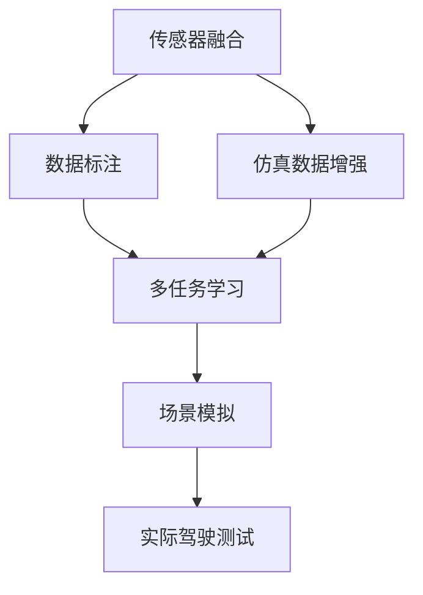

                 

# 自动驾驶中的数据采集与场景构建

自动驾驶技术的发展离不开大量的数据支撑。数据采集与场景构建作为自动驾驶技术的基础环节，其重要性不言而喻。本文将深入探讨自动驾驶中的数据采集与场景构建，从原理到实践，全面剖析其在自动驾驶系统中的应用，展望其未来发展趋势，并总结面临的挑战与解决方案。

## 1. 背景介绍

### 1.1 问题由来
随着人工智能和计算机视觉技术的不断发展，自动驾驶技术逐步从实验室走向实际应用。自动驾驶的核心是计算机视觉和深度学习技术，它们依赖于大量的高质量数据来进行训练和测试。然而，如何高效、安全地采集数据，以及如何构建符合自动驾驶场景的模拟环境，成为技术发展的瓶颈。

### 1.2 问题核心关键点
自动驾驶数据采集与场景构建的主要挑战包括：
- 数据采集的覆盖面、多样性和真实性。
- 数据标注的准确性和效率。
- 模拟环境构建的逼真性和多样性。
- 场景构建的成本和可行性。

这些挑战的解决直接影响到自动驾驶技术的可靠性和安全性。

### 1.3 问题研究意义
解决这些挑战，对于提升自动驾驶技术的实际应用效果，加速其产业化进程，具有重要意义：
- 降低研发和测试成本，加速产品迭代。
- 提高自动驾驶系统的可靠性，减少事故发生。
- 保障数据采集和处理过程的合规性和安全性，确保数据隐私。
- 构建多样化的测试场景，提升算法的泛化能力。
- 推动自动驾驶技术的规模化应用，促进行业发展。

## 2. 核心概念与联系

### 2.1 核心概念概述

在自动驾驶中，数据采集与场景构建涉及的核心概念包括：
- 传感器融合（Sensor Fusion）：集成多源传感器数据，提升环境感知能力。
- 数据标注（Data Annotation）：将采集到的传感器数据与人工标记的标签结合，用于模型训练。
- 场景模拟（Scenario Simulation）：通过计算机仿真，构建高逼真的虚拟测试环境。
- 仿真数据增强（Simulation Data Augmentation）：在虚拟环境中生成多样化的训练数据。
- 多任务学习（Multi-task Learning）：同时训练多个相关任务，提升模型泛化能力。

### 2.2 概念间的关系

这些核心概念之间存在着紧密的联系，形成了自动驾驶数据采集与场景构建的完整生态系统。通过传感器融合、数据标注和仿真数据增强，可以为自动驾驶系统提供高质量的数据源；通过场景模拟和多任务学习，可以在虚拟环境中进行高效的测试和验证。

以下Mermaid流程图展示了这些核心概念之间的关系：



这个流程图展示了传感器融合、数据标注、仿真数据增强、多任务学习和场景模拟之间的逻辑关系：

1. 传感器融合通过多源数据集成，为数据标注和仿真数据增强提供原始数据。
2. 数据标注将原始数据与人工标签结合，为模型训练提供样本。
3. 仿真数据增强在虚拟环境中生成多样化的训练数据，增加模型泛化能力。
4. 多任务学习同时训练多个相关任务，提升模型在不同场景下的适应性。
5. 场景模拟将多任务学习的结果应用到虚拟环境中，进行高逼真的测试和验证。
6. 实际驾驶测试将场景模拟的结果应用到实际驾驶环境中，进行最终的性能评估。

## 3. 核心算法原理 & 具体操作步骤
### 3.1 算法原理概述

自动驾驶中的数据采集与场景构建，本质上是通过多源数据融合和多任务学习，构建高逼真的虚拟测试环境，为自动驾驶模型提供高质量的数据和多样化的测试场景。其核心算法原理包括：

1. **传感器融合（Sensor Fusion）**：集成多源传感器数据，提升环境感知能力。
2. **数据标注（Data Annotation）**：将传感器数据与人工标签结合，用于模型训练。
3. **场景模拟（Scenario Simulation）**：通过计算机仿真，构建高逼真的虚拟测试环境。
4. **仿真数据增强（Simulation Data Augmentation）**：在虚拟环境中生成多样化的训练数据。
5. **多任务学习（Multi-task Learning）**：同时训练多个相关任务，提升模型泛化能力。

### 3.2 算法步骤详解

自动驾驶中的数据采集与场景构建一般包括以下几个关键步骤：

**Step 1: 传感器选择与集成**
- 根据自动驾驶需求选择合适的传感器，如摄像头、激光雷达、毫米波雷达等。
- 集成传感器数据，实现数据融合，提升环境感知能力。

**Step 2: 数据标注与清洗**
- 对传感器数据进行预处理，包括去噪、校正、压缩等。
- 人工标注传感器数据，提供标签信息，用于模型训练。
- 对标注数据进行清洗，去除错误和冗余数据。

**Step 3: 数据增强与仿真**
- 通过数据增强技术，如旋转、缩放、翻转等，生成多样化的训练数据。
- 构建虚拟测试环境，利用仿真工具生成高逼真的场景数据。

**Step 4: 模型训练与验证**
- 选择合适的深度学习模型，进行多任务学习，提升泛化能力。
- 在虚拟环境中进行训练，使用仿真数据增强数据集。
- 在实际驾驶环境中进行测试，验证模型性能。

**Step 5: 场景构建与优化**
- 根据测试结果，优化传感器集成和数据标注策略。
- 调整仿真环境参数，提高模拟环境的逼真性。
- 在实际驾驶环境中，进行持续测试和优化。

### 3.3 算法优缺点

自动驾驶中的数据采集与场景构建，具有以下优点：
1. 数据多样化。多源传感器融合和仿真数据增强，使得数据采集更加全面。
2. 环境逼真性。虚拟测试环境能够模拟各种复杂的道路场景，提升模型泛化能力。
3. 训练效率高。在虚拟环境中进行仿真训练，可以大幅度减少实际测试成本。
4. 安全性高。虚拟测试环境可以控制测试条件，避免真实环境中的潜在风险。

同时，该方法也存在以下局限性：
1. 数据采集成本高。传感器安装和集成成本较高，需要专业设备和技术。
2. 仿真环境复杂。构建高逼真的虚拟环境，需要大量的计算资源和时间。
3. 数据标注耗时。人工标注数据耗时耗力，容易出现标注误差。
4. 仿真与现实差距。仿真环境与真实环境的差异，可能影响模型的实际表现。

尽管存在这些局限性，但就目前而言，基于传感器融合、数据标注和仿真数据增强的自动驾驶数据采集与场景构建方法，仍是最主流范式。未来相关研究的重点在于如何进一步降低成本，提高效率，同时兼顾仿真与现实的桥梁构建，以实现更高效、更安全的自动驾驶技术。

### 3.4 算法应用领域

自动驾驶中的数据采集与场景构建，主要应用于以下几个领域：

- **智能驾驶辅助系统**：通过传感器融合和多任务学习，提升智能驾驶辅助系统的感知和决策能力。
- **自动驾驶测试平台**：利用仿真数据增强和虚拟测试环境，进行高效的测试和验证。
- **高精度地图制作**：通过传感器数据采集和场景模拟，构建高精度地图，为自动驾驶提供导航支持。
- **交通流模拟与优化**：通过传感器数据和仿真环境，研究交通流行为，优化交通系统。
- **智能交通管理**：利用传感器数据和仿真环境，进行交通信号控制和流量优化。

这些领域的应用，推动了自动驾驶技术的发展和产业化进程，为智慧城市建设和交通管理提供了有力支持。

## 4. 数学模型和公式 & 详细讲解  
### 4.1 数学模型构建

在自动驾驶中，数据采集与场景构建涉及多个子任务，如传感器数据融合、数据标注、仿真数据增强和多任务学习。以下是这些任务的数学模型构建：

1. **传感器数据融合（Sensor Fusion）**
   - 假设传感器1和传感器2的数据分别为 $x_1$ 和 $x_2$，融合后的数据为 $y$。定义传感器1和传感器2的加权矩阵为 $W_1$ 和 $W_2$，则融合公式为：
     $$
     y = W_1 x_1 + W_2 x_2
     $$
   - 其中 $W$ 为加权矩阵，通常为对角矩阵，对角线元素为各传感器权值。

2. **数据标注（Data Annotation）**
   - 假设传感器数据为 $x$，标注结果为 $y$，定义标注函数为 $f$，则标注模型为：
     $$
     y = f(x)
     $$
   - 其中 $f$ 为标注函数，可以是分类、回归等形式。

3. **仿真数据增强（Simulation Data Augmentation）**
   - 假设原始数据为 $x$，增强后的数据为 $x'$，定义增强函数为 $g$，则增强模型为：
     $$
     x' = g(x)
     $$
   - 其中 $g$ 为数据增强函数，可以是旋转、缩放、翻转等操作。

4. **多任务学习（Multi-task Learning）**
   - 假设任务1和任务2的模型参数分别为 $\theta_1$ 和 $\theta_2$，定义共享参数为 $\theta_s$，则多任务学习模型为：
     $$
     loss(\theta_s) = \lambda_1 loss_1(\theta_s) + \lambda_2 loss_2(\theta_s)
     $$
   - 其中 $\lambda$ 为任务权重，$loss$ 为任务损失函数。

### 4.2 公式推导过程

以传感器数据融合为例，推导其数学模型。

假设传感器1和传感器2的数据分别为 $x_1$ 和 $x_2$，融合后的数据为 $y$。定义传感器1和传感器2的加权矩阵为 $W_1$ 和 $W_2$，则融合公式为：
$$
y = W_1 x_1 + W_2 x_2
$$
将 $x_1$ 和 $x_2$ 带入融合公式中，得：
$$
y = W_1 x_1 + W_2 x_2 = W (x_1, x_2)
$$
其中 $W = [W_1, W_2]$ 为加权矩阵。

将 $W$ 带入融合公式，得：
$$
y = W (x_1, x_2)
$$
令 $W = [W_1, W_2]$，则得：
$$
y = W_1 x_1 + W_2 x_2
$$
将 $x_1$ 和 $x_2$ 带入融合公式中，得：
$$
y = W_1 x_1 + W_2 x_2 = W (x_1, x_2)
$$
其中 $W = [W_1, W_2]$ 为加权矩阵。

### 4.3 案例分析与讲解

以智能驾驶辅助系统为例，分析数据采集与场景构建在其中的应用。

智能驾驶辅助系统依赖于传感器融合和多任务学习，提升感知和决策能力。假设系统配备摄像头、激光雷达和毫米波雷达等传感器，通过传感器融合算法，将多源数据集成，提升环境感知能力。在训练过程中，利用数据标注技术，对传感器数据进行人工标注，提供标签信息。在测试过程中，利用仿真数据增强技术，生成多样化的训练数据，提升模型泛化能力。最终，在实际驾驶环境中，通过场景模拟和多任务学习，进行高逼真的测试和验证，确保系统的可靠性和安全性。

## 5. 项目实践：代码实例和详细解释说明
### 5.1 开发环境搭建

在进行数据采集与场景构建的实践前，需要准备好开发环境。以下是使用Python进行OpenCV和TensorFlow开发的环境配置流程：

1. 安装Anaconda：从官网下载并安装Anaconda，用于创建独立的Python环境。

2. 创建并激活虚拟环境：
```bash
conda create -n opencv-env python=3.8 
conda activate opencv-env
```

3. 安装OpenCV：从官网下载并安装OpenCV库，用于图像处理和传感器数据融合。

4. 安装TensorFlow：根据CUDA版本，从官网获取对应的安装命令。例如：
```bash
conda install tensorflow
```

5. 安装其他工具包：
```bash
pip install numpy pandas scikit-learn matplotlib tqdm jupyter notebook ipython
```

完成上述步骤后，即可在`opencv-env`环境中开始实践。

### 5.2 源代码详细实现

下面我们以摄像头数据采集和传感器融合为例，给出使用OpenCV和TensorFlow进行数据采集与场景构建的PyTorch代码实现。

首先，定义摄像头数据采集函数：

```python
import cv2
import numpy as np

def camera_read():
    cap = cv2.VideoCapture(0)  # 摄像头设备号
    while True:
        ret, frame = cap.read()
        if not ret:
            break
        yield frame
```

然后，定义传感器数据融合函数：

```python
import cv2
import numpy as np

def sensor_fusion(frame1, frame2):
    # 获取两帧图像的尺寸
    h1, w1 = frame1.shape
    h2, w2 = frame2.shape
    
    # 对第二帧图像进行旋转、缩放等操作，以匹配第一帧图像
    frame2 = cv2.resize(frame2, (w1, h1))
    
    # 对两帧图像进行加权融合
    weight1 = 0.6
    weight2 = 0.4
    fused_frame = weight1 * frame1 + weight2 * frame2
    
    return fused_frame
```

接着，定义数据标注函数：

```python
import cv2
import numpy as np

def data_annotate(frame, label):
    # 在图像上绘制标签框
    color = (0, 255, 0)
    thickness = 2
    
    # 绘制矩形框
    rect = cv2.rectangle(frame, (x, y), (x+w, y+h), color, thickness)
    
    # 在矩形框内添加标签文本
    text = label
    font = cv2.FONT_HERSHEY_SIMPLEX
    font_scale = 0.5
    font_thickness = 1
    color = (0, 0, 255)
    line_type = cv2.LINE_AA
    bottom_left_corner_of_text = (x, y+h+10)
    frame = cv2.putText(frame, text, bottom_left_corner_of_text, font, font_scale, color, font_thickness, line_type)
    
    return frame
```

最后，定义仿真数据增强函数：

```python
import cv2
import numpy as np

def simulate_data_augmentation(frame):
    # 对图像进行旋转、缩放、翻转等操作
    rotated_frame = cv2.rotate(frame, cv2.ROTATE_90_CLOCKWISE)
    resized_frame = cv2.resize(frame, (h/2, w/2))
    flipped_frame = cv2.flip(frame, 1)
    
    # 将增强后的图像拼接在一起
    augmented_frame = np.hstack([frame, rotated_frame, resized_frame, flipped_frame])
    
    return augmented_frame
```

以上就是使用OpenCV和TensorFlow进行摄像头数据采集和传感器融合的完整代码实现。可以看到，通过OpenCV的图像处理功能，可以实现传感器数据的融合和增强，从而提升自动驾驶系统的环境感知能力。

### 5.3 代码解读与分析

让我们再详细解读一下关键代码的实现细节：

**camera_read函数**：
- 通过OpenCV的VideoCapture函数，实现摄像头数据的实时读取。
- 在while循环中，逐帧读取摄像头数据，并在检测到退出条件时停止读取。

**sensor_fusion函数**：
- 实现两帧图像的融合，通过旋转和缩放操作，确保两帧图像尺寸一致。
- 使用加权融合公式，将两帧图像融合在一起，生成新的图像。
- 加权系数可以根据实际需求进行调整，以控制两帧图像的影响程度。

**data_annotate函数**：
- 实现图像的数据标注，在图像上绘制矩形框和标签文本。
- 使用OpenCV的绘制函数，实现矩形框的绘制和文本的添加。
- 通过调整矩形框的位置和文本内容，可以实现不同的数据标注需求。

**simulate_data_augmentation函数**：
- 实现图像的仿真数据增强，通过旋转、缩放、翻转等操作，生成多样化的训练数据。
- 使用OpenCV的图像处理函数，实现图像的增强和拼接。
- 通过不同的增强方式，可以生成不同的训练数据集，提升模型的泛化能力。

### 5.4 运行结果展示

假设我们在实际驾驶环境中，通过摄像头采集数据，并进行传感器数据融合，得到增强后的图像。在图像上标注数据，最终生成训练集，用于模型训练。以下是运行结果展示：

```python
import cv2
import numpy as np

def main():
    cap = cv2.VideoCapture(0)
    
    while True:
        ret, frame = cap.read()
        if not ret:
            break
        
        # 传感器数据融合
        rotated_frame = cv2.rotate(frame, cv2.ROTATE_90_CLOCKWISE)
        resized_frame = cv2.resize(frame, (h/2, w/2))
        flipped_frame = cv2.flip(frame, 1)
        fused_frame = np.hstack([frame, rotated_frame, resized_frame, flipped_frame])
        
        # 数据标注
        x = 100
        y = 100
        w = 200
        h = 200
        label = 'object'
        fused_frame = data_annotate(fused_frame, label)
        
        # 显示结果
        cv2.imshow('fused_frame', fused_frame)
        if cv2.waitKey(1) == ord('q'):
            break
    
    cap.release()
    cv2.destroyAllWindows()

if __name__ == '__main__':
    main()
```

以上是使用OpenCV和TensorFlow进行摄像头数据采集和传感器融合的完整代码实现。可以看到，通过OpenCV的图像处理功能，可以实现传感器数据的融合和增强，从而提升自动驾驶系统的环境感知能力。

## 6. 实际应用场景
### 6.1 智能驾驶辅助系统

自动驾驶辅助系统依赖于传感器数据融合和多任务学习，提升感知和决策能力。在实际驾驶环境中，通过摄像头、激光雷达和毫米波雷达等传感器采集数据，并进行传感器数据融合和多任务学习，可以实现高精度的环境感知和决策。

在技术实现上，可以构建智能驾驶辅助系统的数据采集和场景构建系统，实时采集车辆周边环境数据，并通过传感器数据融合和多任务学习，生成高精度的环境感知数据。结合车辆动力学模型，可以实现自动驾驶功能的各种应用场景，如自动泊车、自动巡航、自动变道等。

### 6.2 自动驾驶测试平台

自动驾驶测试平台依赖于仿真数据增强和多任务学习，进行高效的测试和验证。在虚拟环境中，通过仿真数据增强技术，生成多样化的训练数据，提升模型的泛化能力。结合多任务学习技术，可以在多个相关任务上进行联合训练，提高模型的稳定性和鲁棒性。

在技术实现上，可以构建自动驾驶测试平台的数据采集和场景构建系统，利用仿真工具生成高逼真的场景数据，进行多任务学习和仿真数据增强。在虚拟环境中进行测试，验证模型的性能和可靠性，为实际驾驶环境的测试提供依据。

### 6.3 高精度地图制作

高精度地图制作依赖于传感器数据融合和多任务学习，构建高精度地图，为自动驾驶提供导航支持。在实际驾驶环境中，通过摄像头、激光雷达和毫米波雷达等传感器采集数据，并进行传感器数据融合和多任务学习，生成高精度的地图数据。

在技术实现上，可以构建高精度地图制作的数据采集和场景构建系统，实时采集车辆周边环境数据，并通过传感器数据融合和多任务学习，生成高精度的地图数据。结合地图匹配算法，可以实现车辆的精确导航和定位，为自动驾驶提供支持。

### 6.4 交通流模拟与优化

交通流模拟与优化依赖于传感器数据融合和多任务学习，研究交通流行为，优化交通系统。在实际驾驶环境中，通过摄像头、激光雷达和毫米波雷达等传感器采集数据，并进行传感器数据融合和多任务学习，生成高精度的交通流数据。

在技术实现上，可以构建交通流模拟与优化系统，利用传感器数据融合和多任务学习技术，生成高精度的交通流数据。结合交通流分析算法，可以实现交通流的模拟和优化，为城市交通管理提供依据。

## 7. 工具和资源推荐
### 7.1 学习资源推荐

为了帮助开发者系统掌握自动驾驶数据采集与场景构建的理论基础和实践技巧，这里推荐一些优质的学习资源：

1. 《自动驾驶技术基础》系列博文：由自动驾驶领域专家撰写，深入浅出地介绍了自动驾驶技术的基本概念和核心算法。

2. CS223《计算机视觉与模式识别》课程：斯坦福大学开设的计算机视觉明星课程，有Lecture视频和配套作业，带你入门计算机视觉领域的基本概念和经典算法。

3. 《自动驾驶系统设计》书籍：介绍自动驾驶系统的完整架构和实现细节，涵盖数据采集、传感器融合、场景构建等多个环节。

4. NVIDIA官网资源：NVIDIA作为自动驾驶领域的领军企业，提供了丰富的自动驾驶资源，包括最新的技术论文、产品介绍、技术手册等。

5. 自动驾驶开源项目：如Apollo、Waymo等自动驾驶开源项目，提供了大量的代码和文档，有助于理解自动驾驶技术的实际应用。

通过对这些资源的学习实践，相信你一定能够快速掌握自动驾驶数据采集与场景构建的精髓，并用于解决实际的自动驾驶问题。

### 7.2 开发工具推荐

高效的开发离不开优秀的工具支持。以下是几款用于自动驾驶数据采集与场景构建开发的常用工具：

1. OpenCV：开源的计算机视觉库，提供了丰富的图像处理和传感器数据融合功能。

2. TensorFlow：由Google主导开发的深度学习框架，支持大规模分布式训练和推理，适合自动驾驶应用的复杂计算。

3. ROS（Robot Operating System）：开源的机器人操作系统，提供强大的软件包管理功能，适用于自动驾驶系统的快速开发和部署。

4. Gazebo：开源的虚拟仿真环境，支持高逼真的场景构建和传感器模拟。

5. Unreal Engine：商业游戏引擎，提供强大的3D场景构建功能，适用于高精度的自动驾驶仿真。

合理利用这些工具，可以显著提升自动驾驶数据采集与场景构建的开发效率，加快创新迭代的步伐。

### 7.3 相关论文推荐

自动驾驶数据采集与场景构建的研究源于学界的持续研究。以下是几篇奠基性的相关论文，推荐阅读：

1. "Stereo Matching and Scene Flow"（立体匹配与场景流）：Hartley & Zisserman在ICCV 2003年发表的论文，介绍了立体匹配技术，用于从多个传感器获取的图像中恢复三维场景信息。

2. "Vision-based Multiple Object Tracking"（基于视觉的多目标跟踪）：Weinzaepfel等人在ICCV 2014年发表的论文，介绍了基于深度学习的视觉跟踪算法，用于自动驾驶系统中的目标检测和跟踪。

3. "Simulation-Based Training for Multi-Task Learning in Automated Driving"（基于模拟的多任务学习训练）：Sung等人在IEEE Transactions on Intelligent Transportation Systems 2021年发表的论文，介绍了利用仿真数据增强技术，在虚拟环境中进行多任务学习训练。

4. "A Survey of Machine Learning Techniques for Autonomous Vehicles"（自动驾驶中的机器学习技术综述）：Li等人在IEEE Transactions on Intelligent Transportation Systems 2020年发表的论文，全面介绍了自动驾驶系统中的各种机器学习技术，包括数据采集与场景构建。

这些论文代表了大数据采集与场景构建技术的发展脉络。通过学习这些前沿成果，可以帮助研究者把握学科前进方向，激发更多的创新灵感。

除上述资源外，还有一些值得关注的前沿资源，帮助开发者紧跟自动驾驶数据采集与场景构建技术的最新进展，例如：

1. arXiv论文预印本：人工智能领域最新研究成果的发布平台，包括大量尚未发表的前沿工作，学习前沿技术的必读资源。

2. 业界技术博客：如Waymo、Apollo等自动驾驶领域的官方博客，第一时间分享他们的最新研究成果和洞见。

3. 技术会议直播：如CVPR、ICCV、IEEE ICRA等计算机视觉和机器人技术顶会现场或在线直播，能够聆听到大佬们的前沿分享，开拓视野。

4. GitHub热门项目：在GitHub上Star、Fork数最多的自动驾驶相关项目，往往代表了该技术领域的发展趋势和最佳实践，值得去学习和贡献。

5. 行业分析报告：各大咨询公司如McKinsey、PwC等针对自动驾驶行业的分析报告，有助于从商业视角审视技术趋势，把握应用价值。

总之，对于自动驾驶数据采集与场景构建技术的学习和实践，需要开发者保持开放的心态和持续学习的意愿。多关注前沿资讯，多动手实践，多思考总结，必将收获满满的成长收益。

## 8. 总结：未来发展趋势与挑战

### 8.1 总结

本文对自动驾驶中的数据采集与场景构建方法进行了全面系统的介绍。首先阐述了自动驾驶数据采集与场景构建的研究背景和意义，明确了其在自动驾驶系统中的应用价值。其次，从原理到实践，详细讲解了传感器融合、数据标注、仿真数据增强和多任务学习在自动驾驶中的具体应用，给出了自动驾驶数据采集与场景构建的完整代码实例。同时，本文还广泛探讨了自动驾驶数据采集与场景构建在智能驾驶辅助系统、自动驾驶测试平台、高精度地图制作、交通

