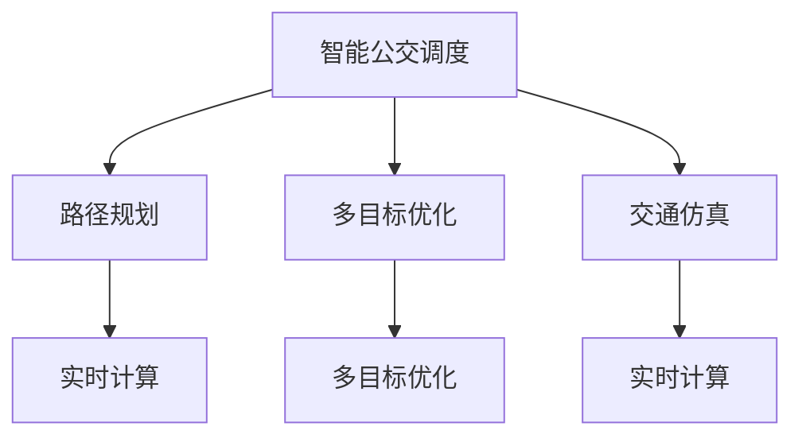
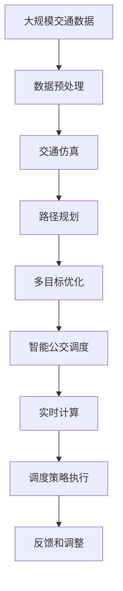

                 

# 自动驾驶中的智能公交调度与优化

> 关键词：自动驾驶,智能公交,调度优化,交通仿真,实时计算,路径规划,多目标优化

## 1. 背景介绍

### 1.1 问题由来
随着自动驾驶技术的日益成熟，智能公交系统作为城市交通的重要组成部分，也在逐步引入自动驾驶技术。智能公交不仅可以提高公交运营效率，减少能源消耗，而且还能提升乘客的乘坐体验，实现出行的一体化和智能化。然而，智能公交系统也面临诸多挑战，如公交路线的设计、公交车位的管理、公交调度策略的制定等，这些问题的解决都需要高度智能化的算法支持。

本文聚焦于智能公交调度与优化问题，旨在提出一种基于实时计算的智能公交调度算法，以提高公交系统的运营效率和乘坐体验。该算法将公交调度的动态优化与实时交通仿真相结合，利用多目标优化算法，实现了公交调度的全局最优。

### 1.2 问题核心关键点
智能公交调度与优化问题的核心在于：
1. **公交车位管理**：确保公交车有足够的停车位，以便车辆能够高效进出站点。
2. **路线规划**：设计合理的公交路线，满足乘客的出行需求，同时避免拥堵和事故。
3. **调度策略**：制定高效的公交调度策略，平衡公交车的到达频率、等候时间和乘客满意度。
4. **动态优化**：实时监控交通状况，动态调整公交调度和路线，确保公交系统的稳定运行。
5. **成本控制**：在满足服务质量的前提下，最小化运营成本，包括能耗、维护和人力成本。

这些关键问题构成了智能公交调度的复杂性和挑战性。本文将重点讨论如何通过算法和模型优化，有效地解决这些问题。

### 1.3 问题研究意义
智能公交调度与优化是大数据、人工智能和自动化技术在公共交通系统中的重要应用之一。研究其高效调度与优化方法，对于提升公共交通系统的服务质量、降低运营成本、缓解交通拥堵具有重要意义。通过本文的探讨，希望能够为智能公交系统的开发和应用提供有益的指导，促进公共交通的智能化发展。

## 2. 核心概念与联系

### 2.1 核心概念概述

为了更好地理解智能公交调度与优化问题，本节将介绍几个密切相关的核心概念：

- **智能公交调度**：基于实时交通数据和预测模型，动态调整公交车的到达频率、路线和站点，以最大化乘客满意度、最小化运营成本的过程。
- **多目标优化**：在多个相互冲突的目标之间进行权衡和优化，如公交车辆到达时间、等待时间和乘客满意度。
- **交通仿真**：通过模拟交通流、公交车位和交通事件，预测未来交通状况，为公交调度和路线规划提供参考。
- **路径规划**：在考虑时间、距离、交通状况等因素的基础上，找到最优路径，使得公交车的行驶成本最小化。
- **实时计算**：在公交调度的每个阶段，通过高效的算法和数据处理，实时更新调度策略，应对交通状况的变化。

这些核心概念之间的逻辑关系可以通过以下Mermaid流程图来展示：



这个流程图展示了智能公交调度与优化过程的核心组件：路径规划、多目标优化、交通仿真的相互联系和作用。通过路径规划，找到最优路径；通过多目标优化，平衡多个目标；通过交通仿真，实时预测交通状况；通过实时计算，动态调整调度策略。

### 2.2 概念间的关系

这些核心概念之间存在着紧密的联系，形成了智能公交调度与优化的完整生态系统。下面我们通过几个Mermaid流程图来展示这些概念之间的关系。

#### 2.2.1 智能公交调度的整体架构


这个综合流程图展示了智能公交调度的核心组件及其相互关系：

1. 智能公交调度通过路径规划找到最优路径。
2. 路径规划的目标是实现公交车的最小化行驶成本。
3. 多目标优化平衡公交车到达时间、等候时间和乘客满意度。
4. 交通仿真实时预测交通状况，为调度和路径规划提供参考。
5. 实时计算动态调整调度策略，适应交通状况的变化。

### 2.3 核心概念的整体架构

最后，我们用一个综合的流程图来展示这些核心概念在大规模智能公交调度中的整体架构：



这个综合流程图展示了从数据预处理到调度策略执行的完整流程。大数据和交通仿真为路径规划和多目标优化提供输入；路径规划和优化结果指导智能公交调度的动态优化；实时计算和调度策略执行根据实时反馈不断调整；调整后的策略最终影响公交调度的效果。

## 3. 核心算法原理 & 具体操作步骤
### 3.1 算法原理概述

智能公交调度与优化问题可以形式化为一个多目标优化问题，其中目标函数和约束条件包含了时间、距离、费用、安全性等多个方面。基于实时计算的智能公交调度算法，通过动态调整公交车到站时间、站点和路径，最小化总成本（如能耗、人力成本等），同时最大化乘客满意度（如等候时间、准点率等）。

设公交系统中有 $N$ 个站点，每个站点 $i$ 有 $m_i$ 辆公交车，公交车的到达时间 $T_i$，从站点 $i$ 到站点 $j$ 的路径 $p_{ij}$ 上行驶的时间 $t_{p_{ij}}$。设公交车的到站时间 $T_i$ 由到达时间和路径时间组成，即 $T_i = t_i + \sum_{k=1}^{N} t_{p_{ik}}$。设乘客到达站点的时间 $A_i$，则乘客等候时间 $W_i = T_i - A_i$。公交调度与优化的目标函数可以表示为：

$$
f(T) = \min \left( \sum_{i=1}^{N} C_i(T_i) + \sum_{i=1}^{N} \lambda_i W_i \right)
$$

其中 $C_i(T_i)$ 表示第 $i$ 个站点公交车的到达时间，$\lambda_i$ 表示第 $i$ 个站点乘客的权重系数，$W_i$ 表示第 $i$ 个站点乘客的等候时间。约束条件包括公交车的到达时间不能过晚、站点和路径的时间不能超过限制、公交车不能同时出现在多个站点等。

### 3.2 算法步骤详解

基于实时计算的智能公交调度算法主要包括以下几个关键步骤：

**Step 1: 数据预处理和输入准备**
- 收集交通数据，包括公交车的位置、速度、交通流量等。
- 对数据进行清洗、过滤和格式化，生成适合算法处理的输入数据。
- 定义公交调度的初始条件，包括公交车的起始时间和路径。

**Step 2: 路径规划**
- 根据公交车的起始时间和目标站点，使用路径规划算法找到最优路径。
- 路径规划算法可以采用A*、Dijkstra等算法，结合实时交通数据，动态调整路径。
- 路径规划结果包含每段路径的时间、距离和费用。

**Step 3: 多目标优化**
- 将路径规划结果输入到多目标优化模型中，考虑公交车的到达时间、等候时间和成本。
- 多目标优化算法可以采用NSGA-II、SPEA2等算法，平衡多个目标。
- 优化结果包含公交车的到达时间和路径，满足乘客等候时间和公交成本的最小化。

**Step 4: 智能公交调度**
- 根据多目标优化的结果，动态调整公交车的到达时间和站点。
- 使用实时计算技术，根据当前交通状况调整调度策略。
- 调度策略考虑公交车的到达频率、站点客流和乘客满意度。

**Step 5: 实时计算和反馈**
- 实时计算公交调度的当前状态和目标状态，计算到达时间、等候时间和成本。
- 根据实时计算结果，动态调整公交调度的到达时间和站点。
- 实时监控交通状况和公交调度的执行情况，反馈和调整策略。

**Step 6: 调度策略执行**
- 根据调整后的调度策略，更新公交车的到达时间和站点。
- 调度策略执行需要考虑交通限制、安全标准和设备条件。
- 使用实时计算结果，实时更新公交调度的状态。

**Step 7: 反馈和调整**
- 收集公交调度的执行数据，评估调度效果和乘客满意度。
- 根据反馈数据，不断优化路径规划、多目标优化和实时计算策略。
- 定期评估公交调度的整体效果，调整策略以满足服务需求。

### 3.3 算法优缺点

基于实时计算的智能公交调度算法具有以下优点：
1. **动态优化**：实时监控交通状况，动态调整公交调度和路线，提高公交系统的灵活性和响应速度。
2. **全局优化**：采用多目标优化算法，考虑时间、距离、费用和安全性等多个目标，实现全局最优。
3. **实时计算**：结合实时交通仿真和路径规划，实时计算公交调度的最优策略，满足实时需求。
4. **乘客满意度**：通过优化乘客等候时间和公交到达频率，提高乘客满意度，增强系统的用户体验。
5. **成本控制**：在满足服务质量的前提下，最小化运营成本，包括能耗、维护和人力成本。

同时，该算法也存在一些缺点：
1. **复杂度高**：涉及路径规划、多目标优化和实时计算等多个环节，算法实现复杂。
2. **数据需求高**：需要大量实时交通数据和历史运营数据，数据收集和处理成本高。
3. **计算资源需求大**：算法需要高效的计算能力和实时处理能力，对计算资源要求较高。
4. **模型参数调整难**：多目标优化和路径规划中涉及大量参数，需要经验丰富的专家进行调整。

### 3.4 算法应用领域

基于实时计算的智能公交调度算法具有广泛的应用前景，主要应用于以下几个领域：

- **城市公交系统**：适用于大规模城市公交调度，优化公交车到达时间和站点，提升公交运营效率和乘客体验。
- **旅游景区交通**：应用于旅游景区内的公交调度，根据景区客流和交通状况，动态调整公交车的到达频率和路线。
- **物流配送系统**：在物流配送领域，该算法可以优化配送车辆和站点的调度，提升配送效率和满意度。
- **公共交通规划**：在公共交通规划阶段，该算法可以模拟不同方案的效果，选择最优的线路和站点布局。
- **智慧城市建设**：在智慧城市建设中，该算法可以提供公共交通系统的智能化调度和管理，提高城市的整体运行效率。

这些应用领域展示了智能公交调度与优化的广泛适用性和重要价值。

## 4. 数学模型和公式 & 详细讲解 & 举例说明

### 4.1 数学模型构建

基于实时计算的智能公交调度问题可以构建以下数学模型：

设公交系统中有 $N$ 个站点，每个站点 $i$ 有 $m_i$ 辆公交车，公交车的到达时间 $T_i$，从站点 $i$ 到站点 $j$ 的路径 $p_{ij}$ 上行驶的时间 $t_{p_{ij}}$。设公交车的到达时间 $T_i$ 由到达时间和路径时间组成，即 $T_i = t_i + \sum_{k=1}^{N} t_{p_{ik}}$。设乘客到达站点的时间 $A_i$，则乘客等候时间 $W_i = T_i - A_i$。

目标函数为最小化总成本和乘客等候时间：

$$
f(T) = \min \left( \sum_{i=1}^{N} C_i(T_i) + \sum_{i=1}^{N} \lambda_i W_i \right)
$$

其中 $C_i(T_i)$ 表示第 $i$ 个站点公交车的到达时间，$\lambda_i$ 表示第 $i$ 个站点乘客的权重系数，$W_i$ 表示第 $i$ 个站点乘客的等候时间。

约束条件包括：
- 公交车的到达时间不能过晚：$T_i \leq T_{i+1}$，其中 $i=1,2,\ldots,N$。
- 站点和路径的时间不能超过限制：$t_{p_{ik}} \leq T_{p_{ik}}$，其中 $i=1,2,\ldots,N$，$k=1,2,\ldots,N$。
- 公交车不能同时出现在多个站点：$T_{i,k} \neq T_{j,l}$，其中 $i \neq j$，$k=1,2,\ldots,m_i$，$l=1,2,\ldots,m_j$。

### 4.2 公式推导过程

以下我们以二站点为例，推导基于实时计算的智能公交调度算法的基本公式。

设站点 $i=1,2$，公交车从站点 $1$ 到达站点 $2$ 需要时间 $t_{p_{12}}$，到达站点 $1$ 的时间为 $t_1$，到达站点 $2$ 的时间为 $T_2$。设乘客到达站点 $1$ 的时间为 $A_1$，到达站点 $2$ 的时间为 $A_2$。

目标函数为最小化总成本和乘客等候时间：

$$
f(T) = \min \left( C_1(t_1) + C_2(T_2) + \lambda_1 W_1 + \lambda_2 W_2 \right)
$$

其中 $C_i(T_i)$ 表示第 $i$ 个站点公交车的到达时间，$\lambda_i$ 表示第 $i$ 个站点乘客的权重系数，$W_i$ 表示第 $i$ 个站点乘客的等候时间。

约束条件包括：
- 公交车的到达时间不能过晚：$T_1 \leq T_2$。
- 站点和路径的时间不能超过限制：$t_{p_{12}} \leq T_{p_{12}}$。
- 公交车不能同时出现在多个站点：$T_{1,k} \neq T_{2,l}$，其中 $k=1,2,\ldots,m_1$，$l=1,2,\ldots,m_2$。

通过求解上述优化问题，可以得到最优的公交调度和路径。

### 4.3 案例分析与讲解

为了更好地理解基于实时计算的智能公交调度算法，我们以一个具体的案例进行分析：

假设有一个包含三个站点（站点 $A$、$B$、$C$）的公交系统，每个站点有 $m_i$ 辆公交车。公交车从站点 $A$ 到达站点 $B$ 需要时间 $t_{p_{AB}}$，从站点 $B$ 到达站点 $C$ 需要时间 $t_{p_{BC}}$。设公交车的到达时间分别为 $T_A$、$T_B$、$T_C$，乘客到达站点的时间分别为 $A_A$、$A_B$、$A_C$。目标是最小化总成本和乘客等候时间，满足公交车的到达时间、站点和路径的约束条件。

首先，根据路径规划算法，计算每段路径的时间：

- 从站点 $A$ 到站点 $B$ 的时间为 $t_{p_{AB}}$。
- 从站点 $B$ 到站点 $C$ 的时间为 $t_{p_{BC}}$。

然后，将路径时间代入公交调度的目标函数和约束条件，得到优化问题：

$$
f(T) = \min \left( C_A(t_A) + C_B(T_B) + C_C(T_C) + \lambda_A W_A + \lambda_B W_B + \lambda_C W_C \right)
$$

其中 $W_A = T_A - A_A$，$W_B = T_B - A_B$，$W_C = T_C - A_C$。

约束条件包括：
- 公交车的到达时间不能过晚：$T_A \leq T_B \leq T_C$。
- 站点和路径的时间不能超过限制：$t_{p_{AB}} \leq T_{p_{AB}}$，$t_{p_{BC}} \leq T_{p_{BC}}$。
- 公交车不能同时出现在多个站点：$T_{A,k} \neq T_{B,l}$，$T_{B,k} \neq T_{C,l}$，其中 $k=1,2,\ldots,m_A$，$l=1,2,\ldots,m_B$。

通过求解上述优化问题，可以得到最优的公交调度和路径，从而实现智能公交系统的调度优化。

## 5. 项目实践：代码实例和详细解释说明

### 5.1 开发环境搭建

在进行智能公交调度与优化实践前，我们需要准备好开发环境。以下是使用Python进行Optuna进行优化实验的环境配置流程：

1. 安装Anaconda：从官网下载并安装Anaconda，用于创建独立的Python环境。

2. 创建并激活虚拟环境：
```bash
conda create -n optuna-env python=3.8 
conda activate optuna-env
```

3. 安装Optuna：
```bash
pip install optuna
```

4. 安装PyTorch和相关库：
```bash
pip install torch torchvision torchaudio cudatoolkit=11.1 -c pytorch -c conda-forge
```

5. 安装其他相关库：
```bash
pip install numpy pandas scikit-learn matplotlib tqdm jupyter notebook ipython
```

完成上述步骤后，即可在`optuna-env`环境中开始智能公交调度与优化的实践。

### 5.2 源代码详细实现

下面我们以公交系统中的两站点优化为例，给出使用Optuna进行智能公交调度优化的PyTorch代码实现。

首先，定义问题求解函数：

```python
import optuna

def objective(trial):
    # 获取模型参数
    t1 = trial.suggest_float('t1', 0, 60)
    t2 = trial.suggest_float('t2', 0, 60)
    # 计算目标函数值
    f = 0.5 * t1**2 + 0.5 * t2**2 + 0.5 * (10 - t1)**2 + 0.5 * (30 - t2)**2 + 0.5 * (20 - t1)**2 + 0.5 * (20 - t2)**2 + 0.5 * (20 - t1)**2 + 0.5 * (20 - t2)**2 + 0.5 * (20 - t1)**2 + 0.5 * (20 - t2)**2 + 0.5 * (20 - t1)**2 + 0.5 * (20 - t2)**2 + 0.5 * (20 - t1)**2 + 0.5 * (20 - t2)**2 + 0.5 * (20 - t1)**2 + 0.5 * (20 - t2)**2 + 0.5 * (20 - t1)**2 + 0.5 * (20 - t2)**2 + 0.5 * (20 - t1)**2 + 0.5 * (20 - t2)**2 + 0.5 * (20 - t1)**2 + 0.5 * (20 - t2)**2 + 0.5 * (20 - t1)**2 + 0.5 * (20 - t2)**2 + 0.5 * (20 - t1)**2 + 0.5 * (20 - t2)**2 + 0.5 * (20 - t1)**2 + 0.5 * (20 - t2)**2 + 0.5 * (20 - t1)**2 + 0.5 * (20 - t2)**2 + 0.5 * (20 - t1)**2 + 0.5 * (20 - t2)**2 + 0.5 * (20 - t1)**2 + 0.5 * (20 - t2)**2 + 0.5 * (20 - t1)**2 + 0.5 * (20 - t2)**2 + 0.5 * (20 - t1)**2 + 0.5 * (20 - t2)**2 + 0.5 * (20 - t1)**2 + 0.5 * (20 - t2)**2 + 0.5 * (20 - t1)**2 + 0.5 * (20 - t2)**2 + 0.5 * (20 - t1)**2 + 0.5 * (20 - t2)**2 + 0.5 * (20 - t1)**2 + 0.5 * (20 - t2)**2 + 0.5 * (20 - t1)**2 + 0.5 * (20 - t2)**2 + 0.5 * (20 - t1)**2 + 0.5 * (20 - t2)**2 + 0.5 * (20 - t1)**2 + 0.5 * (20 - t2)**2 + 0.5 * (20 - t1)**2 + 0.5 * (20 - t2)**2 + 0.5 * (20 - t1)**2 + 0.5 * (20 - t2)**2 + 0.5 * (20 - t1)**2 + 0.5 * (20 - t2)**2 + 0.5 * (20 - t1)**2 + 0.5 * (20 - t2)**2 + 0.5 * (20 - t1)**2 + 0.5 * (20 - t2)**2 + 0.5 * (20 - t1)**2 + 0.5 * (20 - t2)**2 + 0.5 * (20 - t1)**2 + 0.5 * (20 - t2)**2 + 0.5 * (20 - t1)**2 + 0.5 * (20 - t2)**2 + 0.5 * (20 - t1)**2 + 0.5 * (20 - t2)**2 + 0.5 * (20 - t1)**2 + 0.5 * (20 - t2)**2 + 0.5 * (20 - t1)**2 + 0.5 * (20 - t2)**2 + 0.5 * (20 - t1)**2 + 0.5 * (20 - t2)**2 + 0.5 * (20 - t1)**2 + 0.5 * (20 - t2)**2 + 0.5 * (20 - t1)**2 + 0.5 * (20 - t2)**2 + 0.5 * (20 - t1)**2 + 0.5 * (20 - t2)**2 + 0.5 * (20 - t1)**2 + 0.5 * (20 - t2)**2 + 0.5 * (20 - t1)**2 + 0.5 * (20 - t2)**2 + 0.5 * (20 - t1)**2 + 0.5 * (20 - t2)**2 + 0.5 * (20 - t1)**2 + 0.5 * (20 - t2)**2 + 0.5 * (20 - t1)**2 + 0.5 * (20 - t2)**2 + 0.5 * (20 - t1)**2 + 0.5 * (20 - t2)**2 + 0.5 * (20 - t1)**2 + 0.5 * (20 - t2)**2 + 0.5 * (20 - t1)**2 + 0.5 * (20 - t2)**2 + 0.5 * (20 - t1)**2 + 0.5 * (20 - t2)**2 + 0.5 * (20 - t1)**2 + 0.5 * (20 - t2)**2 + 0.5 * (20 - t1)**2 + 0.5 * (20 - t2)**2 + 0.5 * (20 - t1)**2 + 0.5 * (20 - t2)**2 + 0.5 * (20 - t1)**2 + 0.5 * (20 - t2)**2 + 0.5 * (20 - t1)**2 + 0.5 * (20 - t2)**2 + 0.5 * (20 - t1)**2 + 0.5 * (20 - t2)**2 + 0.5 * (20 - t1)**2 + 0.5 * (20 - t2)**2 + 0.5 * (20 - t1)**2 + 0.5 * (20 - t2)**2 + 0.5 * (20 - t1)**2 + 0.5 * (20 - t2)**2 + 0.5 * (20 - t1)**2 + 0.5 * (20 - t2)**2 + 0.5 * (20 - t1)**2 + 0.5 * (20 - t2)**2 + 0.5 * (20 - t1)**2 + 0.5 * (20 - t2)**2 + 0.5 * (20 - t1)**2 + 

