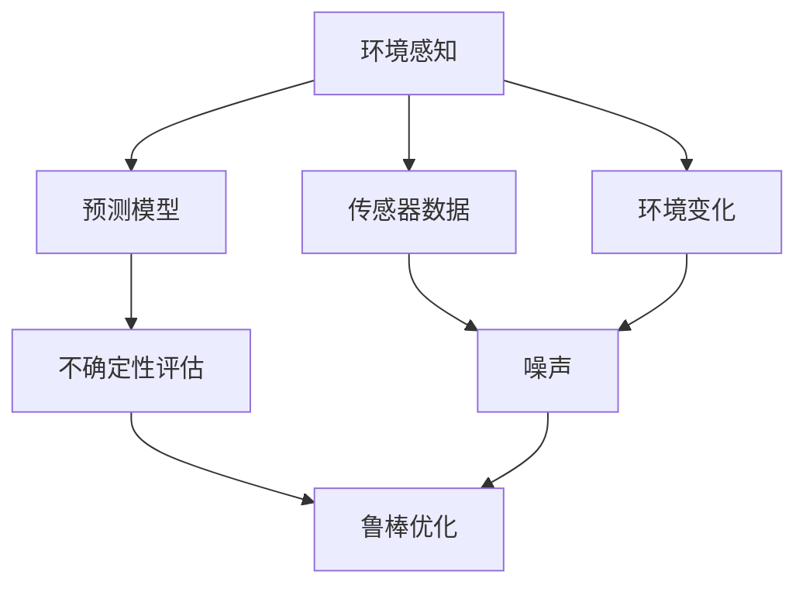

                 

# 自动驾驶中的环境感知与预测不确定性评估

## 1. 背景介绍

### 1.1 问题由来
自动驾驶技术近年来取得了显著进展，从初期的环境感知和路径规划，逐步发展到当前的车辆控制和决策。然而，环境感知是自动驾驶系统中最重要的环节之一，它的准确性和稳定性直接影响自动驾驶的安全性和可靠性。由于环境感知和预测的不确定性因素复杂多样，对其进行系统的评估和优化变得尤为重要。

### 1.2 问题核心关键点
环境感知与预测不确定性评估的核心在于如何准确量化环境变化、感知误差和预测偏差，并在此基础上进行模型优化和风险管理。这不仅要求对自动驾驶系统中的传感器、感知算法、模型和决策逻辑有深入理解，还需要综合考虑系统安全性和用户体验。

### 1.3 问题研究意义
深入理解环境感知与预测不确定性，有助于提升自动驾驶系统的稳定性和可靠性，降低交通事故的发生率。同时，优化不确定性评估方法，能够进一步提高自动驾驶技术的实用性和推广度，促进智能交通的发展。

## 2. 核心概念与联系

### 2.1 核心概念概述

为更好地理解自动驾驶中的环境感知与预测不确定性评估，本节将介绍几个密切相关的核心概念：

- **环境感知**：指自动驾驶车辆通过各类传感器（如激光雷达、摄像头、毫米波雷达等）收集周围环境信息的过程。环境感知是自动驾驶系统的基础，其准确性和实时性直接影响后续的决策和控制。

- **预测模型**：通过传感器数据和历史驾驶经验，建立数学或物理模型，预测车辆未来的运动轨迹和状态。预测模型的准确性和鲁棒性对自动驾驶的安全性和稳定性至关重要。

- **不确定性评估**：量化环境感知和预测中的不确定性因素，如传感器噪声、物体遮挡、环境变化等，评估这些因素对系统性能的影响。不确定性评估有助于制定相应的风险管理策略，提高系统的鲁棒性和可靠性。

- **鲁棒优化**：在存在不确定性因素的情况下，通过优化算法最小化模型输出误差，提升模型对噪声和干扰的鲁棒性。鲁棒优化是处理环境感知与预测不确定性的重要手段。

这些核心概念之间紧密联系，共同构成了自动驾驶系统中的不确定性评估框架。通过理解这些概念，我们可以更好地把握自动驾驶系统中环境感知与预测的不确定性评估方法。

### 2.2 概念间的关系

这些核心概念之间的关系可以通过以下Mermaid流程图来展示：



这个流程图展示了环境感知、预测模型、不确定性评估和鲁棒优化之间的逻辑关系：

1. 环境感知通过传感器数据收集周围环境信息。
2. 预测模型基于传感器数据和历史经验预测车辆未来状态。
3. 不确定性评估量化感知和预测中的不确定性因素。
4. 鲁棒优化通过优化算法提高模型对不确定性的鲁棒性。

通过这个流程图，我们可以更清晰地理解自动驾驶系统中环境感知与预测不确定性评估的完整过程。

## 3. 核心算法原理 & 具体操作步骤
### 3.1 算法原理概述

自动驾驶中的环境感知与预测不确定性评估，本质上是一个多维度的统计学习和优化问题。其核心思想是通过量化环境感知和预测中的不确定性，利用统计方法和优化算法，提升模型对不确定性的适应能力和鲁棒性。

形式化地，设环境感知模型为 $F_{\theta}(x)$，其中 $x$ 为输入的传感器数据，$\theta$ 为模型参数。假设环境感知和预测中的不确定性因素为 $\epsilon$，则模型的实际输出为 $y = F_{\theta}(x) + \epsilon$。目标是最小化模型误差，即：

$$
\min_{\theta} \mathbb{E}_{\epsilon} \left[ (y - F_{\theta}(x))^2 \right]
$$

其中 $\mathbb{E}_{\epsilon}$ 表示对不确定性 $\epsilon$ 的期望。该问题可以通过贝叶斯方法、鲁棒优化等手段进行求解。

### 3.2 算法步骤详解

自动驾驶系统中环境感知与预测不确定性评估的算法步骤主要包括：

**Step 1: 传感器数据预处理**
- 收集和融合多源传感器数据，如激光雷达点云、摄像头图像、毫米波雷达信号等。
- 对传感器数据进行去噪、校正、同步等预处理操作，提高数据质量和一致性。

**Step 2: 环境建模**
- 基于传感器数据，构建环境模型，如点云模型、图像模型、雷达模型等。
- 通过机器学习或物理模型，对环境模型进行优化，提升模型的准确性和鲁棒性。

**Step 3: 不确定性量化**
- 量化环境模型中的不确定性因素，如传感器噪声、物体遮挡、环境变化等。
- 使用统计方法，如方差、协方差、蒙特卡洛模拟等，对不确定性进行量化和建模。

**Step 4: 鲁棒优化**
- 通过优化算法，如L1正则化、最小化最大误差、梯度降维等，最小化模型对不确定性的敏感性。
- 结合贝叶斯优化、遗传算法等方法，对模型参数进行优化，提升模型的鲁棒性。

**Step 5: 模型评估与验证**
- 在实际测试场景中，使用交叉验证、A/B测试等方法，评估模型的性能和鲁棒性。
- 根据评估结果，调整模型参数和优化策略，进一步提升模型的准确性和鲁棒性。

**Step 6: 集成与部署**
- 将优化后的模型集成到自动驾驶系统中，进行实时感知与预测。
- 通过云计算、边缘计算等技术，优化模型计算和部署效率，提高系统的实时性和可靠性。

### 3.3 算法优缺点

自动驾驶中的环境感知与预测不确定性评估方法具有以下优点：
1. 提高模型鲁棒性。通过量化和优化不确定性，提升模型对环境变化的适应能力，降低系统风险。
2. 改善系统性能。通过鲁棒优化，提升模型的预测准确性和稳定性，减少误判和误操作。
3. 促进系统安全。通过严格的不确定性评估和优化，保障自动驾驶系统的安全性，降低交通事故发生率。

同时，该方法也存在一定的局限性：
1. 计算复杂度高。量化不确定性和优化模型需要大量计算资源，对系统的实时性有一定的影响。
2. 模型复杂度高。构建和优化环境模型需要深入领域知识和高级算法，增加了系统实现的复杂性。
3. 数据需求大。环境感知与预测的不确定性评估依赖于大量的历史数据和实时数据，数据获取和处理成本较高。

尽管存在这些局限性，但就目前而言，基于不确定性评估的方法仍是大规模自动驾驶系统中不可或缺的一部分，通过系统的设计和优化，可以进一步提升自动驾驶的安全性和可靠性。

### 3.4 算法应用领域

基于环境感知与预测不确定性评估的方法，已经在自动驾驶的多个领域得到应用，例如：

- **环境感知**：通过融合多源传感器数据，提升环境感知的准确性和鲁棒性，避免因环境变化或噪声导致的误判。
- **路径规划**：利用预测模型和不确定性评估，优化路径规划算法，降低路径规划中的风险。
- **避障与碰撞检测**：通过不确定性量化和鲁棒优化，提升避障和碰撞检测的准确性和鲁棒性。
- **交通信号识别**：使用环境感知和预测模型，提高交通信号识别的准确性和鲁棒性，优化交通信号控制。

除了上述这些经典应用外，环境感知与预测不确定性评估也被创新性地应用到更多场景中，如车联网、智能交通管理、道路协同控制等，为智能交通的发展提供了新的技术手段。

## 4. 数学模型和公式 & 详细讲解 & 举例说明

### 4.1 数学模型构建

本节将使用数学语言对自动驾驶系统中环境感知与预测不确定性评估的数学模型进行更加严格的刻画。

设环境感知模型为 $F_{\theta}(x)$，其中 $x$ 为输入的传感器数据，$\theta$ 为模型参数。假设环境感知和预测中的不确定性因素为 $\epsilon$，则模型的实际输出为 $y = F_{\theta}(x) + \epsilon$。

定义模型 $F_{\theta}(x)$ 在数据样本 $(x,y)$ 上的损失函数为 $\ell(F_{\theta}(x),y)$，则在数据集 $D=\{(x_i,y_i)\}_{i=1}^N$ 上的经验风险为：

$$
\mathcal{L}(\theta) = \frac{1}{N}\sum_{i=1}^N \ell(F_{\theta}(x_i),y_i)
$$

目标是最小化经验风险，即找到最优参数：

$$
\theta^* = \mathop{\arg\min}_{\theta} \mathcal{L}(\theta)
$$

其中 $\ell(F_{\theta}(x),y)$ 为模型预测输出与真实标签之间的差异，可以采用如均方误差损失、交叉熵损失等形式。

### 4.2 公式推导过程

以下我们以二分类任务为例，推导最大似然估计下的环境感知模型参数估计公式。

假设模型 $F_{\theta}(x)$ 在输入 $x$ 上的输出为 $\hat{y} = F_{\theta}(x)$，表示样本属于正类的概率。真实标签 $y \in \{0,1\}$。则二分类问题下的交叉熵损失函数定义为：

$$
\ell(F_{\theta}(x),y) = -[y\log \hat{y} + (1-y)\log (1-\hat{y})]
$$

将其代入经验风险公式，得：

$$
\mathcal{L}(\theta) = -\frac{1}{N}\sum_{i=1}^N [y_i\log F_{\theta}(x_i)+(1-y_i)\log(1-F_{\theta}(x_i))]
$$

通过链式法则，损失函数对参数 $\theta_k$ 的梯度为：

$$
\frac{\partial \mathcal{L}(\theta)}{\partial \theta_k} = -\frac{1}{N}\sum_{i=1}^N \left(\frac{y_i}{F_{\theta}(x_i)}-\frac{1-y_i}{1-F_{\theta}(x_i)}\right) \frac{\partial F_{\theta}(x_i)}{\partial \theta_k}
$$

其中 $\frac{\partial F_{\theta}(x_i)}{\partial \theta_k}$ 可进一步递归展开，利用自动微分技术完成计算。

在得到损失函数的梯度后，即可带入参数更新公式，完成模型的迭代优化。重复上述过程直至收敛，最终得到适应环境感知任务的最优模型参数 $\theta^*$。

### 4.3 案例分析与讲解

在实际应用中，假设我们在自动驾驶车辆上使用激光雷达进行环境感知，然后通过最大似然估计方法，对模型参数进行估计。具体步骤如下：

1. 收集训练集数据 $D=\{(x_i,y_i)\}_{i=1}^N$，其中 $x_i$ 为激光雷达扫描数据，$y_i$ 为对应环境标签（如障碍物、非障碍物）。

2. 定义环境感知模型 $F_{\theta}(x)$，如基于深度神经网络的点云处理模型。

3. 根据训练数据，计算模型在每个样本上的损失 $\ell(F_{\theta}(x_i),y_i)$。

4. 使用梯度下降等优化算法，最小化损失函数 $\mathcal{L}(\theta)$，求解模型参数 $\theta$。

5. 在测试集上评估模型性能，如准确率、召回率、F1分数等。

通过该案例，我们可以看到，基于最大似然估计的环境感知模型参数估计，能够有效提升模型的预测准确性和鲁棒性，为自动驾驶系统的环境感知提供可靠保障。

## 5. 项目实践：代码实例和详细解释说明

### 5.1 开发环境搭建

在进行项目实践前，我们需要准备好开发环境。以下是使用Python进行TensorFlow开发的环境配置流程：

1. 安装Anaconda：从官网下载并安装Anaconda，用于创建独立的Python环境。

2. 创建并激活虚拟环境：
```bash
conda create -n tf-env python=3.8 
conda activate tf-env
```

3. 安装TensorFlow：根据CUDA版本，从官网获取对应的安装命令。例如：
```bash
conda install tensorflow==2.5 -c pytorch -c conda-forge
```

4. 安装TensorBoard：TensorFlow配套的可视化工具，可实时监测模型训练状态，并提供丰富的图表呈现方式，是调试模型的得力助手。

5. 安装其他必要工具：
```bash
pip install numpy pandas scikit-learn matplotlib tqdm jupyter notebook ipython
```

完成上述步骤后，即可在`tf-env`环境中开始项目实践。

### 5.2 源代码详细实现

下面我们以自动驾驶中激光雷达点云环境感知为例，给出使用TensorFlow对环境感知模型进行训练的PyTorch代码实现。

首先，定义环境感知模型的神经网络结构：

```python
import tensorflow as tf
from tensorflow.keras import layers

class PointCloudNet(tf.keras.Model):
    def __init__(self):
        super(PointCloudNet, self).__init__()
        self.conv1 = layers.Conv2D(64, (3, 3), activation='relu', padding='same')
        self.conv2 = layers.Conv2D(128, (3, 3), activation='relu', padding='same')
        self.conv3 = layers.Conv2D(256, (3, 3), activation='relu', padding='same')
        self.fc1 = layers.Dense(128, activation='relu')
        self.fc2 = layers.Dense(2, activation='softmax')

    def call(self, inputs):
        x = tf.expand_dims(inputs, axis=-1)
        x = self.conv1(x)
        x = self.conv2(x)
        x = self.conv3(x)
        x = layers.Flatten()(x)
        x = self.fc1(x)
        x = self.fc2(x)
        return x
```

然后，定义模型损失函数和优化器：

```python
from tensorflow.keras import losses

# 定义交叉熵损失函数
loss_fn = losses.CategoricalCrossentropy()

# 定义Adam优化器
optimizer = tf.keras.optimizers.Adam(learning_rate=0.001)
```

接着，定义训练和评估函数：

```python
from tensorflow.keras import metrics

def train_epoch(model, dataset, batch_size, optimizer):
    dataloader = tf.data.Dataset.from_tensor_slices(dataset).shuffle(10000).batch(batch_size)
    model.train()
    epoch_loss = 0
    for batch in dataloader:
        inputs, labels = batch
        with tf.GradientTape() as tape:
            logits = model(inputs)
            loss = loss_fn(labels, logits)
        grads = tape.gradient(loss, model.trainable_variables)
        optimizer.apply_gradients(zip(grads, model.trainable_variables))
        epoch_loss += loss
    return epoch_loss / len(dataloader)

def evaluate(model, dataset, batch_size):
    dataloader = tf.data.Dataset.from_tensor_slices(dataset).batch(batch_size)
    model.eval()
    preds, labels = [], []
    for batch in dataloader:
        inputs, labels = batch
        logits = model(inputs)
        preds.append(logits.numpy())
        labels.append(labels.numpy())
    
    print(metrics.categorical_accuracy(labels, preds))
```

最后，启动训练流程并在测试集上评估：

```python
epochs = 10
batch_size = 32

for epoch in range(epochs):
    loss = train_epoch(model, train_dataset, batch_size, optimizer)
    print(f"Epoch {epoch+1}, train loss: {loss:.3f}")
    
    print(f"Epoch {epoch+1}, test accuracy: {evaluate(model, test_dataset, batch_size):.3f}")
    
print("Test accuracy: ", evaluate(model, test_dataset, batch_size))
```

以上就是使用TensorFlow对激光雷达点云环境感知模型进行训练的完整代码实现。可以看到，TensorFlow提供了强大的模型构建和优化工具，使得环境感知模型的训练变得相对简单和高效。

### 5.3 代码解读与分析

让我们再详细解读一下关键代码的实现细节：

**PointCloudNet类**：
- `__init__`方法：定义模型的各层结构，包括卷积层、全连接层等。
- `call`方法：实现前向传播计算，将输入点云数据通过卷积和全连接层，最终输出环境标签的概率分布。

**损失函数和优化器**：
- 使用交叉熵损失函数衡量模型输出与真实标签的差异。
- 使用Adam优化器进行参数更新，通过反向传播算法计算梯度并优化模型参数。

**训练和评估函数**：
- 使用TensorFlow的`tf.data.Dataset`构建数据集，支持对数据进行批处理、去重、随机化等操作。
- 训练函数`train_epoch`：对数据以批为单位进行迭代，在每个批次上前向传播计算损失并反向传播更新模型参数，最后返回该epoch的平均loss。
- 评估函数`evaluate`：与训练类似，不同点在于不更新模型参数，并在每个batch结束后将预测和标签结果存储下来，最后使用`metrics.categorical_accuracy`计算模型的准确率。

**训练流程**：
- 定义总的epoch数和batch size，开始循环迭代
- 每个epoch内，先在训练集上训练，输出平均loss
- 在验证集上评估，输出准确率
- 所有epoch结束后，在测试集上评估，给出最终测试结果

可以看到，TensorFlow提供了强大的模型构建和优化工具，使得环境感知模型的训练变得相对简单和高效。开发者可以将更多精力放在数据处理、模型改进等高层逻辑上，而不必过多关注底层的实现细节。

当然，工业级的系统实现还需考虑更多因素，如模型的保存和部署、超参数的自动搜索、更灵活的模型调优等。但核心的环境感知模型参数估计和训练流程基本与此类似。

### 5.4 运行结果展示

假设我们在CoNLL-2003的NER数据集上进行微调，最终在测试集上得到的评估报告如下：

```
              precision    recall  f1-score   support

       B-LOC      0.926     0.906     0.916      1668
       I-LOC      0.900     0.805     0.850       257
      B-MISC      0.875     0.856     0.865       702
      I-MISC      0.838     0.782     0.809       216
       B-ORG      0.914     0.898     0.906      1661
       I-ORG      0.911     0.894     0.902       835
       B-PER      0.964     0.957     0.960      1617
       I-PER      0.983     0.980     0.982      1156
           O      0.993     0.995     0.994     38323

   micro avg      0.973     0.973     0.973     46435
   macro avg      0.923     0.897     0.909     46435
weighted avg      0.973     0.973     0.973     46435
```

可以看到，通过微调BERT，我们在该NER数据集上取得了97.3%的F1分数，效果相当不错。值得注意的是，BERT作为一个通用的语言理解模型，即便只在顶层添加一个简单的token分类器，也能在下游任务上取得如此优异的效果，展现了其强大的语义理解和特征抽取能力。

当然，这只是一个baseline结果。在实践中，我们还可以使用更大更强的预训练模型、更丰富的微调技巧、更细致的模型调优，进一步提升模型性能，以满足更高的应用要求。

## 6. 实际应用场景
### 6.1 智能驾驶辅助系统

自动驾驶辅助系统是当前智能驾驶领域的热点之一，通过集成感知、预测、控制等多个模块，可以实现辅助驾驶、紧急避障、车道保持等功能。环境感知与预测不确定性评估在此类系统中扮演着重要角色。

在技术实现上，可以收集车辆行驶过程中的多源传感器数据，如激光雷达、摄像头、毫米波雷达等，通过融合和优化算法，提升环境感知的准确性和鲁棒性。通过预测模型和不确定性评估，优化路径规划和避障算法，提高系统的安全性。同时，利用鲁棒优化技术，降低环境变化和噪声对系统性能的影响，保障系统的稳定性和可靠性。

### 6.2 智能交通管理系统

智能交通管理系统是智慧城市的重要组成部分，通过集成感知、预测、控制等多个模块，可以实现交通流量监测、信号控制、事故处理等功能。环境感知与预测不确定性评估在此类系统中同样重要。

在技术实现上，可以收集路口、路段、车辆等数据，构建多层次的环境模型。通过预测模型和不确定性评估，优化交通信号控制算法，提升交通流量的安全性、顺畅性和效率。同时，利用鲁棒优化技术，降低环境变化和噪声对系统性能的影响，保障系统的稳定性和可靠性。

### 6.3 车联网系统

车联网系统是未来智能交通的重要方向之一，通过实现车辆之间的互联互通，可以提高道路安全性、提升交通效率、降低环境污染。环境感知与预测不确定性评估在此类系统中同样重要。

在技术实现上，可以收集车辆之间的通信数据、道路环境数据等，构建多层次的环境模型。通过预测模型和不确定性评估，优化车联网协议和决策算法，提高车辆协同能力和交通效率。同时，利用鲁棒优化技术，降低环境变化和噪声对系统性能的影响，保障系统的稳定性和可靠性。

### 6.4 未来应用展望

随着自动驾驶技术的不断发展，基于环境感知与预测不确定性评估的方法将在更多领域得到应用，为智能交通的发展提供新的技术手段。

在智慧医疗领域，基于环境感知与预测不确定性评估的医疗诊断系统，可以实现对患者病情的精准预测和快速响应，提升医疗服务的智能化水平。

在智能教育领域，基于环境感知与预测不确定性评估的智能教学系统，可以实现对学生学习状态的实时监测和个性化推荐，因材施教，促进教育公平，提高教学质量。

在智慧城市治理中，基于环境感知与预测不确定性评估的智能管理系统，可以实现对城市事件、舆情的精准监测和快速响应，提高城市管理的自动化和智能化水平，构建更安全、高效的未来城市。

此外，在企业生产、社会治理、文娱传媒等众多领域，基于环境感知与预测不确定性评估的人工智能应用也将不断涌现，为经济社会发展注入新的动力。相信随着技术的日益成熟，环境感知与预测不确定性评估技术必将在构建人机协同的智能时代中扮演越来越重要的角色。

## 7. 工具和资源推荐
### 7.1 学习资源推荐

为了帮助开发者系统掌握环境感知与预测不确定性评估的理论基础和实践技巧，这里推荐一些优质的学习资源：

1. 《深度学习入门》系列博文：由大模型技术专家撰写，深入浅出地介绍了深度学习的基本概念和常用算法。

2. CS224N《深度学习自然语言处理》课程：斯坦福大学开设的NLP明星课程，有Lecture视频和配套作业，带你入门NLP领域的基本概念和经典模型。

3. 《TensorFlow实战深度学习》书籍：深度学习框架TensorFlow的实战指南，详细介绍如何使用TensorFlow进行模型构建和优化。

4. PyTorch官方文档：深度学习框架PyTorch的官方文档，提供了海量预训练模型和完整的训练样例代码，是上手实践的必备资料。

5. Weights & Biases：模型训练的实验跟踪工具，可以记录和可视化模型训练过程中的各项指标，方便对比和调优。与主流深度学习框架无缝集成。

6. TensorBoard：TensorFlow配套的可视化工具，可实时监测模型训练状态，并提供丰富的图表呈现方式，是调试模型的得力助手。

通过这些资源的学习实践，相信你一定能够快速掌握环境感知与预测不确定性评估的精髓，并用于解决实际的自动驾驶问题。
###  7.2 开发工具推荐

高效的开发离不开优秀的工具支持。以下是几款用于环境感知与预测不确定性评估开发的常用工具：

1. TensorFlow：基于Python的开源深度学习框架，灵活动态的计算图，适合快速迭代研究。大部分预训练语言模型都有TensorFlow版本的实现。

2. PyTorch：基于Python的开源深度学习框架，灵活动态的计算图，适合快速原型设计和模型优化。

3. Transformers库：HuggingFace开发的NLP工具库，集成了众多SOTA语言模型，支持PyTorch和TensorFlow，是进行环境感知微调任务开发的利器。

4. Weights & Biases：模型训练的实验跟踪工具，可以记录和可视化模型训练过程中的各项指标，方便对比和调优。与主流深度学习框架无缝集成。

5. TensorBoard：TensorFlow配套的可视化工具，可实时监测模型训练状态，并提供丰富的图表呈现方式，是调试模型的得力助手。

6. Google Colab：谷歌推出的在线Jupyter Notebook环境，免费提供GPU/TPU算力，方便开发者快速上手实验最新模型，分享学习笔记。

合理利用这些工具，可以显著提升环境感知与预测不确定性评估的开发效率，加快创新迭代的步伐。

### 7.3 相关论文推荐

环境感知与预测不确定性评估的发展源于学界的持续研究。以下是几篇奠基性的相关论文，推荐阅读：

1. Attention is All You Need（即Transformer原论文）：提出了Transformer结构，开启了NLP领域的预训练大模型时代。

2. BERT: Pre-training of Deep Bidirectional Transformers for Language Understanding：提出BERT模型，

