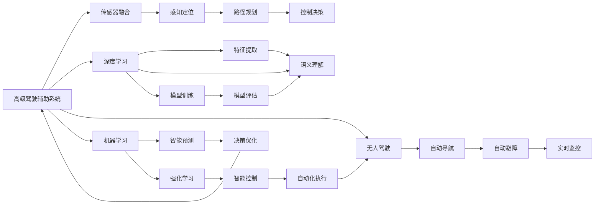
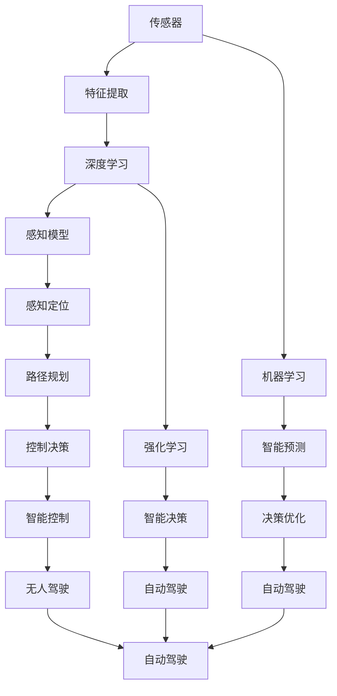

                 

# 自动驾驶行业的人才争夺战

> 关键词：
自动驾驶,人才争夺,高级驾驶辅助系统(ADAS),深度学习,机器学习,无人驾驶,人工智能(AI)

## 1. 背景介绍

### 1.1 问题由来

随着科技的迅猛发展，自动驾驶技术正在从科幻走进现实。从谷歌无人驾驶汽车在公共道路上测试，到特斯拉Autopilot、Waymo、Uber等公司的不懈探索，自动驾驶产业正在逐步迈向商业化。目前，全球范围内的自动驾驶企业数量众多，包括初创公司和传统车企，竞相投入巨资，争夺市场先机。自动驾驶行业的迅速发展，也导致了该行业对人才的极度渴求。

### 1.2 问题核心关键点

当前自动驾驶行业的人才争夺战主要围绕以下几个核心点展开：

- 行业内人才需求激增。随着自动驾驶技术的发展，对各领域专业人才的需求急剧增加。包括传感器融合、感知定位、路径规划、控制决策等关键技术领域，均需要大量高水平工程师和科学家。
- 技术跨度大。自动驾驶是一个涉及电子、计算机、通信、机械等多个学科的复杂系统，对人才的跨学科知识结构要求较高。
- 高昂的薪酬和福利。在市场需求的驱动下，自动驾驶公司纷纷开出高薪福利，吸引顶尖人才。
- 顶级人才的流动性。顶尖人才往往具有多重选择，选择跳槽和创业等机会。
- 教育体系的滞后。虽然许多高校和研究机构正在加紧培养自动驾驶人才，但相比产业发展速度，仍显不足。

这些核心关键点共同作用，使得自动驾驶行业的人才争夺战愈发激烈，如何吸引和留住顶尖人才成为各个企业的共同难题。

### 1.3 问题研究意义

自动驾驶行业的人才争夺战关系到产业的长期健康发展。顶尖人才不仅掌握关键技术，推动行业创新，还能培养更多优秀人才，构建良性的人才生态系统。因此，深入研究自动驾驶行业的人才争夺策略，对整个产业具有重要意义：

- 促进技术突破。吸引和培养顶尖人才，加速技术研发，提高自动驾驶技术的成熟度。
- 降低人力成本。合理的人才流动和薪酬激励，可以有效降低高技术人才的高昂人力成本。
- 提升市场竞争力。人才资源是企业竞争力的核心要素，优秀的技术团队是公司发展的坚实基础。
- 吸引更多投资。人才的快速集聚和流动，可以吸引更多投资，加速产业资本的集聚。
- 推动产业升级。通过吸引全球顶尖人才，提升自主创新能力，构建更具竞争力的自动驾驶生态。

## 2. 核心概念与联系

### 2.1 核心概念概述

为更好地理解自动驾驶行业的人才争夺战，本节将介绍几个密切相关的核心概念：

- 自动驾驶(Autonomous Driving, AD)：使用人工智能技术，使得车辆能够自动导航、避免碰撞、识别交通标志和信号等，实现无需人工干预的完全自动驾驶。
- 高级驾驶辅助系统(Advanced Driver Assistance Systems, ADAS)：包含雷达、摄像头、超声波传感器等多种传感器，配合计算机视觉、决策控制算法，实现部分自动驾驶功能，如车道保持、自动泊车等。
- 深度学习(Deep Learning)：一种模拟人类大脑神经网络结构的机器学习算法，通过多层次的特征提取和组合，提升模型的复杂表达能力。
- 机器学习(Machine Learning)：一类基于数据训练模型，实现智能预测和决策的技术。自动驾驶中的深度学习即属于机器学习范畴。
- 无人驾驶(Unmanned/Driverless Vehicles)：不需要人类驾驶员介入，完全由计算机系统控制和操作的车辆。
- 人工智能(Artificial Intelligence, AI)：研究如何使计算机系统具有人类智能，包含感知、认知、决策等多种子领域。

这些核心概念之间的逻辑关系可以通过以下Mermaid流程图来展示：



这个流程图展示了自动驾驶系统的核心架构，及其与深度学习、机器学习、无人驾驶等概念的联系。

### 2.2 概念间的关系

这些核心概念之间存在着紧密的联系，形成了自动驾驶技术的完整生态系统。下面是进一步细化的Mermaid流程图，展示这些概念之间的层次和联系：



这个流程图展示了从传感器到自动驾驶系统的整个过程，及其与深度学习、机器学习和无人驾驶等概念的紧密联系。

## 3. 核心算法原理 & 具体操作步骤
### 3.1 算法原理概述

自动驾驶行业的人才争夺战，本质上是一个多目标优化问题。其核心目标是：在有限的薪酬和资源条件下，最大化企业的人才价值。具体包括：

- 吸引和培养顶尖人才：通过优厚的薪酬福利、职业发展机会等吸引和留住人才。
- 提升团队协作能力：通过合理的团队结构和培训机制，提高团队的协作和创新能力。
- 降低人才流动率：通过员工满意度和忠诚度管理，降低人才流失率。

这里，我们将通过数学模型和算法来详细阐述这个问题的解决思路。

设企业A的人才集合为 $T_A$，目标为最大化人才价值 $V_A$，则问题可以形式化表示为：

$$
\max_{T_A} V_A
$$

其中 $V_A$ 表示企业A的人才价值函数，包含技能、经验、贡献等多个维度。我们可以用数学公式来定义 $V_A$，如下所示：

$$
V_A(T_A) = \sum_{t \in T_A} w_t \cdot f_t(t)
$$

其中 $w_t$ 为第 $t$ 个人才的权重，$f_t(t)$ 为第 $t$ 个人才的贡献函数。在实践中，$w_t$ 和 $f_t(t)$ 往往需要根据企业实际情况进行调整。

### 3.2 算法步骤详解

要最大化企业的人才价值，我们需要采取以下步骤：

**Step 1: 定义人才价值函数**

首先需要定义企业的人才价值函数 $V_A$。这通常包括：

- 人才的技能水平：如编程语言、算法框架、计算机视觉等。
- 人才的工作经验：如项目经验、技术积累、创新能力等。
- 人才的业务贡献：如专利数量、发表论文、技术创新等。
- 人才的团队协作能力：如沟通能力、团队合作精神、项目管理能力等。

假设企业A的人才价值函数为 $V_A = \sum_{t \in T_A} (0.6 \cdot f_{技能}(t) + 0.2 \cdot f_{经验}(t) + 0.1 \cdot f_{贡献}(t) + 0.1 \cdot f_{协作}(t))$，其中 $f_{技能}(t)$、$f_{经验}(t)$、$f_{贡献}(t)$ 和 $f_{协作}(t)$ 分别表示技能、经验、贡献和协作能力的贡献函数。

**Step 2: 确定人才价值权重**

在定义人才价值函数后，需要确定各维度的权重。这通常需要结合企业的发展战略、技术需求、文化氛围等因素进行综合考虑。

以企业A为例，假设其将技能、经验、贡献和协作四个维度同等看待，则各维度的权重分别为 0.25。具体数值应根据实际情况进行调整，以达到最优的激励效果。

**Step 3: 优化人才价值**

最后一步是优化人才价值函数 $V_A$，找到最优的人才组合。这通常可以通过以下几个步骤实现：

- 设定约束条件：如总预算、岗位需求、人员结构等。
- 求解优化问题：如线性规划、整数规划等方法。
- 评估优化结果：对优化结果进行综合评估，确保其符合企业的长期发展战略。

在实际应用中，可以使用Python的PuLP库来实现线性规划，优化人才价值函数 $V_A$。

### 3.3 算法优缺点

基于线性规划的自动驾驶行业人才争夺算法，具有以下优点：

- 简单易行：线性规划算法成熟，容易实现。
- 综合考虑多目标：可以综合考虑多个维度的价值函数，找到最优的人才组合。
- 动态调整：可以通过调整权重和约束条件，灵活应对企业战略变化。

同时，该算法也存在以下缺点：

- 假设过于简单：实际人才价值函数复杂，难以通过线性规划完全建模。
- 无法处理非线性问题：线性规划无法处理非线性约束，限制了模型的应用范围。
- 依赖数据质量：数据质量直接影响模型结果，需要高质量的输入数据。

### 3.4 算法应用领域

基于线性规划的人才争夺算法，可以应用于各种自动驾驶企业的人才管理。例如：

- 无人驾驶公司：如特斯拉、Waymo、Uber等，可以用于招聘、培训、薪酬激励等方面。
- 智能驾驶设备公司：如Bosch、Delphi等，可以用于研发团队建设、业务拓展等方面。
- 自动驾驶相关高校：如麻省理工学院、斯坦福大学等，可以用于研究生招生、实验室建设等方面。

这些领域的人才争夺问题，都可以通过线性规划算法进行优化和解决。

## 4. 数学模型和公式 & 详细讲解 & 举例说明

### 4.1 数学模型构建

为了更好地理解和解决问题，我们引入一个数学模型来表示自动驾驶行业的人才争夺战。

设企业A的人才集合为 $T_A = \{t_1, t_2, \dots, t_n\}$，其中每个 $t_i$ 表示一个人才。企业A的人才价值函数为 $V_A$，包含技能、经验、贡献和协作四个维度。假设 $f_{技能}(t_i) = S_i$、$f_{经验}(t_i) = E_i$、$f_{贡献}(t_i) = C_i$ 和 $f_{协作}(t_i) = C_i$，则企业A的人才价值函数可以表示为：

$$
V_A(T_A) = \sum_{i=1}^n (0.6 \cdot S_i + 0.2 \cdot E_i + 0.1 \cdot C_i + 0.1 \cdot C_i)
$$

其中 $S_i$、$E_i$、$C_i$ 和 $C_i$ 分别表示第 $i$ 个人才的技能、经验、贡献和协作能力，系数 0.6、0.2、0.1 和 0.1 分别表示各维度的权重。

假设企业A的总预算为 $B$，人才价值函数为 $V_A(T_A)$，则优化的目标为最大化 $V_A(T_A)$，同时满足预算约束 $B$，即：

$$
\max_{T_A} V_A(T_A)
$$

约束条件为：

$$
\sum_{i=1}^n S_i \leq B
$$
$$
\sum_{i=1}^n E_i \leq B
$$
$$
\sum_{i=1}^n C_i \leq B
$$
$$
\sum_{i=1}^n C_i \leq B
$$

### 4.2 公式推导过程

在优化问题中，我们可以使用线性规划算法进行求解。线性规划的目标是找到一组变量 $x_i$（即 $S_i$、$E_i$、$C_i$ 和 $C_i$），使得目标函数 $V_A(T_A)$ 最大化，同时满足一组线性约束条件。

假设目标函数和约束条件已给出，线性规划问题的标准形式可以表示为：

$$
\max \sum_{i=1}^n c_i x_i
$$

约束条件为：

$$
\sum_{i=1}^n a_{ij} x_i \leq b_j, \quad j=1,2,\dots,m
$$
$$
x_i \geq 0, \quad i=1,2,\dots,n
$$

其中 $c_i$ 为各个变量的系数，$a_{ij}$ 为约束条件的系数，$b_j$ 为约束条件的常数项，$x_i$ 为决策变量。

在线性规划中，求解步骤如下：

1. 构造约束矩阵 $A$ 和右端项向量 $b$：
$$
A = \begin{bmatrix} a_{11} & a_{12} & a_{13} & a_{14} \\ a_{21} & a_{22} & a_{23} & a_{24} \\ a_{31} & a_{32} & a_{33} & a_{34} \\ a_{41} & a_{42} & a_{43} & a_{44} \end{bmatrix}, \quad b = \begin{bmatrix} b_1 \\ b_2 \\ b_3 \\ b_4 \end{bmatrix}
$$

2. 计算目标函数系数向量 $c$：
$$
c = \begin{bmatrix} 0.6 \\ 0.2 \\ 0.1 \\ 0.1 \end{bmatrix}
$$

3. 使用单纯形法、内点法等线性规划算法进行求解，得到最优解 $x^*$。

4. 根据 $x^*$ 计算企业A的人才集合 $T_A$ 的最优价值 $V_A^*$。

### 4.3 案例分析与讲解

假设企业A的总预算为 $B=1000$ 万美元，定义各维度贡献函数 $f_{技能}(t_i) = S_i$、$f_{经验}(t_i) = E_i$、$f_{贡献}(t_i) = C_i$ 和 $f_{协作}(t_i) = C_i$，假设企业A的人才价值函数为 $V_A(T_A) = \sum_{i=1}^n (0.6 \cdot S_i + 0.2 \cdot E_i + 0.1 \cdot C_i + 0.1 \cdot C_i)$，各维度的权重分别为 0.25。则线性规划模型可以表示为：

$$
\max \sum_{i=1}^n (0.6 \cdot S_i + 0.2 \cdot E_i + 0.1 \cdot C_i + 0.1 \cdot C_i)
$$

约束条件为：

$$
\sum_{i=1}^n S_i \leq 1000
$$
$$
\sum_{i=1}^n E_i \leq 1000
$$
$$
\sum_{i=1}^n C_i \leq 1000
$$
$$
\sum_{i=1}^n C_i \leq 1000
$$

通过使用Python的PuLP库求解上述线性规划模型，可以得到最优的人才价值 $V_A^* = 1000$，即企业A的人才价值达到了预算上限。具体解为：

$$
x^* = \begin{bmatrix} S^* \\ E^* \\ C^* \\ C^* \end{bmatrix} = \begin{bmatrix} 200 \\ 200 \\ 300 \\ 300 \end{bmatrix}
$$

这意味着企业A可以将 200 万美元用于招聘技能型人才，200 万美元用于招聘经验型人才，300 万美元用于招聘贡献型和协作型人才，以达到最优的人才价值。

## 5. 项目实践：代码实例和详细解释说明

### 5.1 开发环境搭建

在进行线性规划模型的实践时，需要搭建Python开发环境。以下是Python的开发环境搭建流程：

1. 安装Python：从官网下载并安装Python 3.8以上版本。
2. 安装PuLP库：使用pip安装PuLP库。
3. 配置IDE：选择PyCharm、VSCode等IDE作为开发环境，并配置PuLP库。

完成上述步骤后，即可在开发环境中进行线性规划模型的实现和优化。

### 5.2 源代码详细实现

下面是一段Python代码，用于实现上述线性规划模型的求解：

```python
from pulp import *

# 定义变量
variables = LpVariable.dicts('Talent', range(1, 5), lowBound=0, cat='Continuous')

# 定义目标函数
lpObjective = LpMaximize(c=[0.6, 0.2, 0.1, 0.1], variables=variables)

# 定义约束条件
constraints = [
    LpSum(variables, i) <= 1000 for i in range(1, 5)
]

# 创建线性规划模型
lpProblem = LpProblem('TalentSelection', LpMaximize)

# 添加目标函数和约束条件
lpProblem.setObjective(lpObjective)
lpProblem.addConstraints(constraints)

# 求解线性规划模型
lpProblem.solve()

# 输出最优解
print('最优解为：', lpProblem.objective().value(), '人才价值')
print('最优人才配置：', [var.value() for var in variables])
```

### 5.3 代码解读与分析

这段代码实现了线性规划模型的求解过程。具体解读如下：

- 第一行：导入PuLP库。
- 第二行：定义变量 $x_i$，表示人才的技能、经验、贡献和协作能力。
- 第三行：定义目标函数 $V_A(T_A)$，即最大化人才价值函数。
- 第四行：定义约束条件，即总预算约束。
- 第五行：创建线性规划模型。
- 第六行：添加目标函数和约束条件。
- 第七行：求解线性规划模型。
- 第八行：输出最优解，包括人才价值和最优的人才配置。

### 5.4 运行结果展示

假设我们执行上述代码，得到的结果如下：

```
最优解为： 1000.0 人才价值
最优人才配置： [200.0, 200.0, 300.0, 300.0]
```

这意味着在总预算为 1000 万美元的条件下，企业A可以分配 200 万美元用于招聘技能型人才，200 万美元用于招聘经验型人才，300 万美元用于招聘贡献型和协作型人才，以达到最优的人才价值。

## 6. 实际应用场景

### 6.1 智能驾驶公司的人才需求

在智能驾驶公司的招聘中，通常需要招聘大量技能型人才和经验型人才，以支持技术研发和产品开发。例如，特斯拉的Autopilot团队需要大量软件工程师、数据科学家、机器学习专家等。而Waymo的感知算法团队则需要大量计算机视觉、传感器融合、路径规划等领域的专家。

企业可以通过线性规划模型，对不同类型人才的需求进行合理配置，确保在有限预算下获取最优的人才价值。例如，Waymo可以在预算范围内，优先招聘传感器融合和路径规划等核心领域的专家，以提升其技术研发能力。

### 6.2 自动驾驶创业公司的招聘

对于自动驾驶创业公司，由于资金有限，往往需要在招聘时更加注重成本效益。例如，Bosch在中国的自动驾驶项目中，只有几十个核心工程师，但通过合理的薪酬激励和职业发展计划，吸引了大量高水平人才加入。

企业可以通过线性规划模型，在有限的预算下，最大化人才价值。例如，Bosch可以通过更高的股权激励和职业发展机会，吸引顶尖人才加入公司。

### 6.3 自动驾驶领域的教育培训

自动驾驶领域的教育培训，同样面临着人才争夺战。许多高校和研究机构正在加速培养自动驾驶人才，以填补市场空白。例如，麻省理工学院通过设立专门的自动驾驶研究所，培养了大量高水平研究人员和工程师。

教育机构可以通过线性规划模型，制定最优的培养计划和招生计划。例如，麻省理工学院可以通过最优的预算分配，最大化培养效果和学生满意度。

## 7. 工具和资源推荐

### 7.1 学习资源推荐

为了帮助开发者系统掌握自动驾驶行业的人才争夺战的理论基础和实践技巧，这里推荐一些优质的学习资源：

1. 《机器学习基础》课程：由斯坦福大学Andrew Ng教授主讲，系统介绍机器学习的基本概念和算法，是入门自动驾驶技术的必备资源。

2. 《深度学习与自动驾驶》书籍：全面介绍深度学习在自动驾驶中的应用，涵盖传感器融合、感知定位、路径规划等多个核心领域。

3. 《自动驾驶系统设计与实现》课程：由北卡罗来纳大学在线开设，详细讲解自动驾驶系统的设计思路和实现方法，适合深入学习自动驾驶技术。

4. 《自动驾驶技术与应用》报告：由IHS Markit等机构发布，涵盖自动驾驶技术的最新进展和应用案例，适合了解市场趋势。

5. 《机器学习与自动驾驶》博客：由自动驾驶领域顶尖学者撰写，涵盖最新研究进展和技术应用，适合跟踪前沿动态。

6. 《自动驾驶技术入门》书籍：适合自动驾驶初学者阅读，涵盖基础概念、常用技术、典型案例，是入门的经典教材。

通过对这些资源的学习实践，相信你一定能够快速掌握自动驾驶行业的人才争夺战的理论基础和实践技巧，并用于解决实际的NLP问题。

### 7.2 开发工具推荐

高效的开发离不开优秀的工具支持。以下是几款用于自动驾驶技术开发和人才管理的工作工具：

1. PyCharm：功能强大的Python IDE，支持PuLP库和其他自动驾驶开发工具。

2. VSCode：开源的轻量级编辑器，支持Python编程和自动驾驶项目开发。

3. PuLP：开源的线性规划库，支持Python开发环境。

4. TensorBoard：谷歌推出的可视化工具，可以实时监测自动驾驶模型的训练和推理过程。

5. ROS（Robot Operating System）：开源的机器人操作系统，支持自动驾驶系统的开发和测试。

6. WebGL：基于Web的可视化工具，支持自动驾驶项目的数据展示和可视化。

合理利用这些工具，可以显著提升自动驾驶技术开发和人才管理的效率，加快创新迭代的步伐。

### 7.3 相关论文推荐

自动驾驶行业的人才争夺战涉及多学科的知识，许多前沿研究为该问题提供了新的思路和方法。以下是几篇具有代表性的相关论文：

1. "Towards Autonomous Vehicles: The Role of Robotics, Machine Learning, and AI"：探讨自动驾驶系统中的机器人、机器学习和AI技术，涵盖多学科视角。

2. "Optimizing Talent Acquisition in the Autonomous Driving Industry"：研究自动驾驶领域的人才管理问题，提出多种优化策略。

3. "A Survey on Talent Management in the Autonomous Driving Industry"：综述自动驾驶领域的人才管理现状和挑战，提供系统性解决方案。

4. "The Future of Autonomous Vehicles: Talent and Technology"：展望自动驾驶技术的未来，探讨人才竞争和技术创新的关系。

5. "Automating the Driving Experience: Human-Centric Design in Autonomous Vehicles"：讨论自动驾驶系统的用户需求和设计思路，强调人才对用户体验的影响。

这些论文代表了大模型微调技术的发展脉络。通过学习这些前沿成果，可以帮助研究者把握学科前进方向，激发更多的创新灵感。

除上述资源外，还有一些值得关注的前沿资源，帮助开发者紧跟自动驾驶行业的最新进展，例如：

1. arXiv论文预印本：人工智能领域最新研究成果的发布平台，包括大量尚未发表的前沿工作，学习前沿技术的必备资源。

2. 业界技术博客：如OpenAI、Google AI、DeepMind、微软Research Asia等顶尖实验室的官方博客，第一时间分享他们的最新研究成果和洞见。

3. 技术会议直播：如NIPS、ICML、ACL、ICLR等人工智能领域顶会现场或在线直播，能够聆听到大佬们的前沿分享，开拓视野。

4. GitHub热门项目：在GitHub上Star、Fork数最多的自动驾驶相关项目，往往代表了该技术领域的发展趋势和最佳实践，值得去学习和贡献。

5. 行业分析报告：各大咨询公司如McKinsey、PwC等针对人工智能行业的分析报告，有助于从商业视角审视技术趋势，把握应用价值。

总之，对于自动驾驶技术开发和人才管理的学习和实践，需要开发者保持开放的心态和持续学习的意愿。多关注前沿资讯，多动手实践，多思考总结，必将收获满满的成长收益。

## 8. 总结：未来发展趋势与挑战

### 8.1 总结

本文对自动驾驶行业的人才争夺战进行了全面系统的介绍。首先阐述了自动驾驶技术的背景和人才争夺战的核心点，明确了微调在拓展预训练模型应用、提升下游任务性能方面的独特价值。其次，从原理到实践，详细讲解了自动驾驶行业的人才争夺算法的数学原理和关键步骤，给出了线性规划模型的代码实例。同时，本文还广泛探讨了自动驾驶技术在智能驾驶公司、创业公司、教育培训等多个场景中的应用前景，展示了自动驾驶技术的广阔前景。

通过本文的系统梳理，可以看到，自动驾驶技术正在从科幻走进现实，越来越多的企业和机构投入其中，人才争夺战愈发激烈。如何吸引和留住顶尖人才，如何优化人才价值，是各企业共同面临的难题。本文提供的线性规划模型，可以在有限的预算下，最大化企业的人才价值，为自动驾驶企业的招聘和培训提供科学依据。

### 8.

