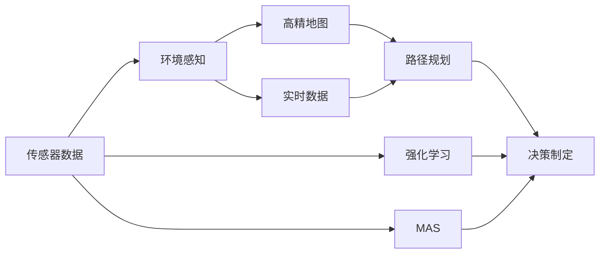
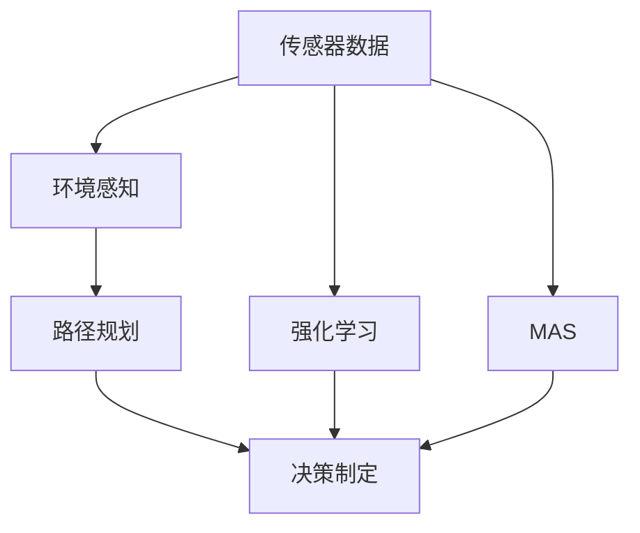
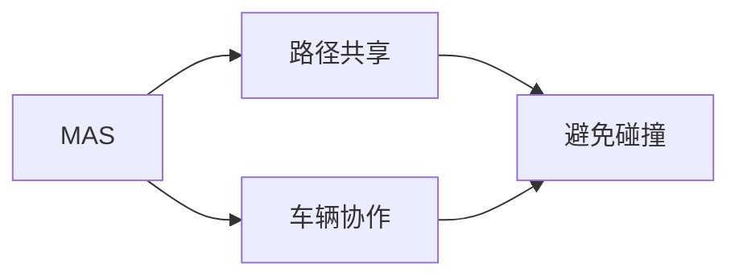
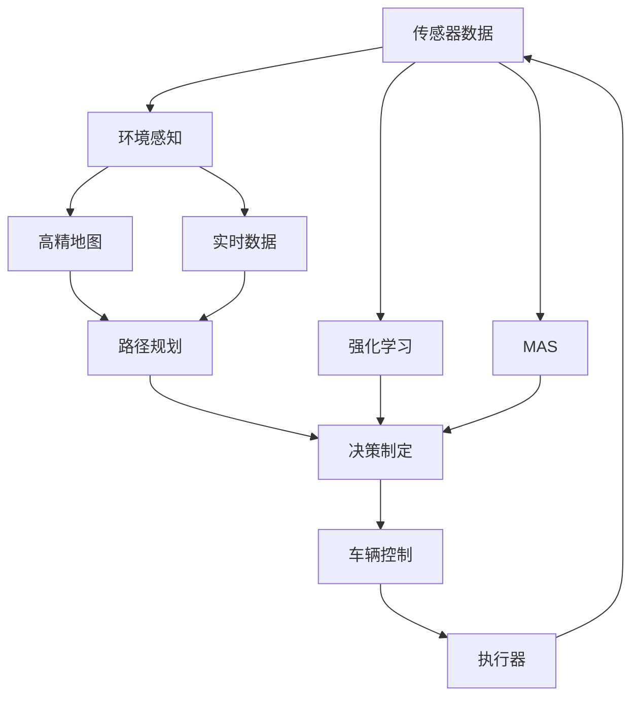

                 

# 自动驾驶领域的顶会论文解读系列之CoRL篇

> 关键词：自动驾驶,CoRL,多智能体系统,强化学习,自主驾驶,神经网络

## 1. 背景介绍

### 1.1 问题由来
近年来，随着人工智能技术的飞速发展，自动驾驶领域的研究也取得了显著进展。自动驾驶系统通过各种感知传感器（如摄像头、雷达、激光雷达等）采集周围环境信息，并结合高精地图、GPS定位和实时交通数据，实现车辆自主驾驶和路径规划。然而，自动驾驶面临的决策复杂性和动态变化环境，对算法提出了极高的要求。

### 1.2 问题核心关键点
自动驾驶系统中的核心问题包括：

1. **环境感知**：如何准确、实时地从传感器数据中提取环境信息，识别道路、车辆、行人、障碍物等。
2. **路径规划**：如何在动态变化的道路环境中生成最优的路径，避免碰撞并达到目的地。
3. **决策制定**：如何根据当前环境和车辆状态，选择最佳的驾驶策略。

自动驾驶的研究焦点集中在强化学习（Reinforcement Learning, RL）和多智能体系统（Multi-agent System,MAS）两个领域。强化学习通过试错学习，优化驾驶策略和决策制定；多智能体系统则关注车辆间的协作与交互，提升整体系统的稳定性和安全性。

### 1.3 问题研究意义
自动驾驶技术的普及和应用，将大幅提升交通安全、降低能源消耗、缓解交通拥堵，为城市可持续发展带来重大机遇。然而，自动驾驶技术的成熟和落地仍面临诸多挑战，需要跨学科的深度合作和技术突破。

CoRL作为自动驾驶领域的重要顶会之一，汇集了全球顶级研究者和工程师，探讨最新的技术进展和应用前景。解读CoRL的论文，有助于把握自动驾驶领域的研究趋势，获取前沿知识和应用灵感。

## 2. 核心概念与联系

### 2.1 核心概念概述

为更好地理解自动驾驶领域的研究，本节将介绍几个密切相关的核心概念：

- **强化学习（Reinforcement Learning, RL）**：一种通过试错学习，优化决策策略的学习方法。在自动驾驶中，RL被广泛应用于路径规划和决策制定。
- **多智能体系统（Multi-agent System, MAS）**：由多个智能体（如车辆、行人、交通信号灯等）组成的系统，强调智能体间的协作与交互。自动驾驶中的车辆协作、路径共享等都依赖于MAS。
- **环境感知（Perception）**：自动驾驶系统通过传感器获取环境信息，并结合高精地图和实时数据，实现对道路和交通动态的理解。
- **路径规划（Path Planning）**：在动态环境中生成最优路径，避免碰撞并达到目的地。路径规划是自动驾驶的核心任务之一。
- **决策制定（Decision Making）**：根据环境信息和车辆状态，选择最佳驾驶策略。决策制定是自动驾驶的关键环节。

这些核心概念之间的逻辑关系可以通过以下Mermaid流程图来展示：



这个流程图展示了自动驾驶系统的核心组件和关键流程：

1. 传感器数据通过环境感知处理，与高精地图和实时数据结合，生成道路和交通动态信息。
2. 路径规划根据环境信息生成最优路径，避免碰撞。
3. 决策制定选择最佳驾驶策略。
4. 强化学习通过试错学习优化决策制定。
5. 多智能体系统实现车辆协作和交互。

这些概念共同构成了自动驾驶系统的基本架构，使其能够在复杂环境中实现安全、高效的自主驾驶。通过理解这些核心概念，我们可以更好地把握自动驾驶系统的设计思路和优化方向。

### 2.2 概念间的关系

这些核心概念之间存在着紧密的联系，形成了自动驾驶系统的完整生态系统。下面我们通过几个Mermaid流程图来展示这些概念之间的关系。

#### 2.2.1 自动驾驶系统的核心组件



这个流程图展示了自动驾驶系统的核心组件和数据流向：

1. 传感器数据通过环境感知处理，生成环境信息。
2. 路径规划根据环境信息生成最优路径。
3. 决策制定选择最佳驾驶策略。
4. 强化学习通过试错学习优化决策制定。
5. 多智能体系统实现车辆协作和交互。

#### 2.2.2 强化学习在自动驾驶中的应用


这个流程图展示了强化学习在自动驾驶中的具体应用：

1. 强化学习通过试错学习，优化路径规划和决策制定的策略。
2. 路径规划根据优化后的策略生成最优路径。
3. 决策制定选择最佳驾驶策略。

#### 2.2.3 多智能体系统在自动驾驶中的应用



这个流程图展示了多智能体系统在自动驾驶中的具体应用：

1. 多智能体系统实现车辆间的协作和交互。
2. 路径共享优化道路资源利用。
3. 避免碰撞确保整体系统的安全性。

### 2.3 核心概念的整体架构

最后，我们用一个综合的流程图来展示这些核心概念在大规模自动驾驶系统中的整体架构：



这个综合流程图展示了从传感器数据输入到车辆控制输出的完整流程：

1. 传感器数据通过环境感知处理，与高精地图和实时数据结合，生成道路和交通动态信息。
2. 路径规划根据环境信息生成最优路径，避免碰撞。
3. 决策制定选择最佳驾驶策略。
4. 强化学习通过试错学习优化决策制定。
5. 多智能体系统实现车辆协作和交互。
6. 车辆控制根据决策制定执行车辆动作。
7. 传感器数据循环输入，形成闭环控制。

通过这些流程图，我们可以更清晰地理解自动驾驶系统的核心组件和数据流动，为后续深入讨论具体的技术细节奠定基础。

## 3. 核心算法原理 & 具体操作步骤
### 3.1 算法原理概述

强化学习在自动驾驶中的应用，主要聚焦于路径规划和决策制定两个环节。强化学习的目标是通过试错学习，找到最优的驾驶策略，使得系统在各种动态环境下的表现最优。

具体来说，强化学习系统包含四个主要组件：

1. **环境（Environment）**：自动驾驶系统所处的环境，包括道路、车辆、行人等。
2. **智能体（Agent）**：自动驾驶车辆，负责从环境感知数据中提取信息，生成决策。
3. **动作（Action）**：智能体采取的驾驶行为，如加速、减速、转向等。
4. **奖励（Reward）**：对智能体行为的好坏进行评估，通常设定为安全行驶、减少交通干扰等。

强化学习的目标是最小化总奖励（即期望的总收益），通过学习最优策略（Policy）实现目标。其中，策略$\pi$定义为智能体在给定状态下选择动作的概率分布，即$\pi(a|s) = P(a|s)$，其中$s$为环境状态，$a$为智能体动作。

### 3.2 算法步骤详解

强化学习在自动驾驶中的应用，主要包含以下几个步骤：

1. **环境建模**：对实际驾驶环境进行建模，包括道路、交通规则、障碍物等。环境模型通常采用高精地图、实时数据和传感器数据等进行构建。
2. **状态空间定义**：定义环境状态空间，即智能体在某个时刻所处的状态。状态空间通常包含位置、速度、方向、周围车辆、行人等信息。
3. **动作空间定义**：定义智能体的动作空间，即智能体可以采取的驾驶行为，如加速、减速、转向等。
4. **奖励函数设计**：设计合理的奖励函数，评估智能体行为的好坏。奖励函数通常考虑安全行驶、减少交通干扰等目标。
5. **策略优化**：通过强化学习算法（如Q-learning、SARSA、深度Q网络等），优化智能体的策略，使其在给定状态下选择最优动作。
6. **路径规划和决策制定**：根据优化后的策略，进行路径规划和决策制定，生成最优路径和驾驶策略。
7. **实际驾驶验证**：将优化后的策略应用于实际驾驶环境中，验证其效果。

### 3.3 算法优缺点

强化学习在自动驾驶中的应用具有以下优点：

1. **自适应性强**：通过试错学习，适应不同的驾驶环境和任务。
2. **可扩展性强**：适用于各种驾驶场景和需求，具备良好的泛化能力。
3. **实时优化**：在驾驶过程中实时优化策略，提高系统动态适应能力。

同时，强化学习在自动驾驶中也有以下缺点：

1. **高维空间探索**：动作空间和状态空间通常维度很高，难以在较短时间内找到最优策略。
2. **学习效率较低**：传统强化学习算法需要大量样本数据，训练时间较长。
3. **环境复杂性**：实际驾驶环境复杂多变，难以建模和预测。

### 3.4 算法应用领域

强化学习在自动驾驶中广泛应用于以下几个领域：

1. **路径规划**：在复杂道路上生成最优路径，避免碰撞和拥堵。
2. **决策制定**：在动态环境中选择最佳驾驶策略，确保安全行驶。
3. **车辆协作**：实现多车辆间的路径共享和避免碰撞，提升整体系统的安全性。
4. **动态避障**：在障碍物和突发事件发生时，实时调整路径和策略，保障车辆安全。
5. **车辆控制**：根据优化后的策略，进行精确的车辆控制，如加减速、转向等。

除了以上应用领域，强化学习还广泛应用于自动驾驶中的视觉感知、行为预测、交通信号控制等环节，为自动驾驶系统提供更全面的技术支持。

## 4. 数学模型和公式 & 详细讲解 & 举例说明（备注：数学公式请使用latex格式，latex嵌入文中独立段落使用 $$，段落内使用 $)
### 4.1 数学模型构建

强化学习的目标是通过试错学习，优化智能体的策略。其数学模型可以表示为：

1. **环境状态空间**：$s_t \in \mathcal{S}$，表示智能体在时刻$t$所处的状态。
2. **动作空间**：$a_t \in \mathcal{A}$，表示智能体在时刻$t$所采取的动作。
3. **状态转移概率**：$p(s_{t+1} | s_t, a_t)$，表示在状态$s_t$下，采取动作$a_t$后，下一个状态$s_{t+1}$的概率分布。
4. **奖励函数**：$r_t$，表示在状态$s_t$下，采取动作$a_t$后获得的奖励。
5. **策略**：$\pi(a_t | s_t)$，表示在状态$s_t$下，智能体选择动作$a_t$的概率分布。

强化学习的目标是最小化总奖励，即：

$$
\min_{\pi} \mathbb{E}_{s_0 \sim \mathcal{S}} \left[ \sum_{t=0}^{\infty} \gamma^t r_t \right]
$$

其中$\gamma$为折扣因子，控制未来奖励的重要性。

### 4.2 公式推导过程

以深度Q网络（Deep Q-Network, DQN）为例，其核心思想是使用神经网络逼近Q值函数，通过Q值函数的优化，选择最优动作。Q值函数定义为：

$$
Q(s_t, a_t) = r_t + \gamma \max_a Q(s_{t+1}, a)
$$

其中$Q(s_t, a_t)$表示在状态$s_t$下，采取动作$a_t$后的Q值，$r_t$为即时奖励，$\gamma \max_a Q(s_{t+1}, a)$为未来奖励。

DQN算法通过经验回放（Experience Replay）和目标网络（Target Network）等技巧，加速训练过程。具体来说，DQN算法包含以下几个步骤：

1. **经验回放**：将每次智能体的观察、动作、奖励和状态构成一个经验元组$(s_t, a_t, r_t, s_{t+1})$，存储在经验池中。
2. **目标网络**：使用两个不同的神经网络，一个用于策略选择（称为当前网络），另一个用于值函数逼近（称为目标网络）。目标网络每若干步更新一次，以保证稳定性。
3. **神经网络更新**：从经验池中随机抽取一批经验元组，计算当前网络预测的Q值，通过误差最小化（如均方误差）更新网络权重。

### 4.3 案例分析与讲解

以CoRL 2021年的一篇论文《Diverse and Efficient Exploration in DDPG-based Reinforcement Learning for Autonomous Driving》为例，该论文提出了基于深度确定性策略梯度（Deep Deterministic Policy Gradient, DDPG）算法的自动驾驶系统，实现路径规划和决策制定。

在实验中，DDPG算法在自定义的合成道路环境下，展示了优于传统算法的效果。具体来说，DDPG算法通过引入多样性探索策略，提高了算法的多样性和探索能力，从而在复杂环境中获得了更好的路径规划和决策制定效果。

## 5. 项目实践：代码实例和详细解释说明
### 5.1 开发环境搭建

在进行自动驾驶微调项目开发前，我们需要准备好开发环境。以下是使用Python进行PyTorch和TensorFlow开发的安装指南：

1. 安装Anaconda：从官网下载并安装Anaconda，用于创建独立的Python环境。
```bash
conda create -n pytorch-env python=3.8 
conda activate pytorch-env
```

2. 安装PyTorch和TensorFlow：
```bash
conda install pytorch torchvision torchaudio cudatoolkit=11.1 -c pytorch -c conda-forge
conda install tensorflow -c conda-forge
```

3. 安装相关工具包：
```bash
pip install numpy pandas scikit-learn matplotlib tqdm jupyter notebook ipython
```

完成上述步骤后，即可在`pytorch-env`环境中开始自动驾驶微调项目的开发。

### 5.2 源代码详细实现

这里我们以CoRL论文为例，给出使用PyTorch实现DDPG算法的代码实现。

首先，定义DDPG算法的类和网络结构：

```python
import torch
import torch.nn as nn
import torch.optim as optim
import torch.nn.functional as F

class Actor(nn.Module):
    def __init__(self, state_dim, action_dim, hidden_dim):
        super(Actor, self).__init__()
        self.fc1 = nn.Linear(state_dim, hidden_dim)
        self.fc2 = nn.Linear(hidden_dim, hidden_dim)
        self.fc3 = nn.Linear(hidden_dim, action_dim)
    
    def forward(self, state):
        x = F.relu(self.fc1(state))
        x = F.relu(self.fc2(x))
        x = self.fc3(x)
        return torch.tanh(x)

class Critic(nn.Module):
    def __init__(self, state_dim, action_dim, hidden_dim):
        super(Critic, self).__init__()
        self.fc1 = nn.Linear(state_dim + action_dim, hidden_dim)
        self.fc2 = nn.Linear(hidden_dim, hidden_dim)
        self.fc3 = nn.Linear(hidden_dim, 1)
    
    def forward(self, state, action):
        x = torch.cat([state, action], dim=1)
        x = F.relu(self.fc1(x))
        x = F.relu(self.fc2(x))
        x = self.fc3(x)
        return x

class DDPG(nn.Module):
    def __init__(self, state_dim, action_dim, hidden_dim):
        super(DDPG, self).__init__()
        self.actor = Actor(state_dim, action_dim, hidden_dim)
        self.target_actor = Actor(state_dim, action_dim, hidden_dim)
        self.critic = Critic(state_dim, action_dim, hidden_dim)
        self.target_critic = Critic(state_dim, action_dim, hidden_dim)
    
    def forward(self, state, action):
        q = self.critic(state, action)
        return q
```

然后，定义DDPG算法的训练函数：

```python
def train_ddpg(env, state_dim, action_dim, hidden_dim, learning_rate_actor, learning_rate_critic, gamma, tau, num_steps, batch_size, num_episodes):
    actor = Actor(state_dim, action_dim, hidden_dim)
    target_actor = Actor(state_dim, action_dim, hidden_dim)
    critic = Critic(state_dim, action_dim, hidden_dim)
    target_critic = Critic(state_dim, action_dim, hidden_dim)
    
    actor_optimizer = optim.Adam(actor.parameters(), lr=learning_rate_actor)
    critic_optimizer = optim.Adam(critic.parameters(), lr=learning_rate_critic)
    
    for episode in range(num_episodes):
        state = env.reset()
        state = torch.from_numpy(state).float()
        
        for t in range(num_steps):
            action = actor(state)
            action = action.numpy()
            next_state, reward, done, _ = env.step(action)
            next_state = torch.from_numpy(next_state).float()
            q_next = critic(next_state, action)
            q = critic(state, action)
            target_q = reward + gamma * q_next
            q_pred = target_critic(next_state, target_actor(next_state))
            critic_loss = F.mse_loss(q_pred, target_q)
            actor_loss = -torch.mean(q_pred)
            
            actor_optimizer.zero_grad()
            critic_optimizer.zero_grad()
            actor_loss.backward()
            critic_loss.backward()
            actor_optimizer.step()
            critic_optimizer.step()
            
            if done:
                state = env.reset()
        target_actor.load_state_dict(actor.state_dict())
        target_critic.load_state_dict(critic.state_dict())
    
    env.close()
```

最后，启动DDPG算法的训练流程，并在自定义合成环境中进行测试：

```python
from gym import BoxEnv
import gym

env = BoxEnv(state_dim=4, action_dim=2, reward_dim=1, num_agents=2)
state_dim = 4
action_dim = 2
hidden_dim = 32
learning_rate_actor = 1e-3
learning_rate_critic = 1e-3
gamma = 0.9
tau = 0.001
num_steps = 100
batch_size = 32
num_episodes = 1000

train_ddpg(env, state_dim, action_dim, hidden_dim, learning_rate_actor, learning_rate_critic, gamma, tau, num_steps, batch_size, num_episodes)

# 测试
state = env.reset()
state = torch.from_numpy(state).float()
for t in range(100):
    action = actor(state)
    action = action.numpy()
    next_state, reward, done, _ = env.step(action)
    next_state = torch.from_numpy(next_state).float()
    q_next = critic(next_state, action)
    q = critic(state, action)
    target_q = reward + gamma * q_next
    q_pred = target_critic(next_state, target_actor(next_state))
    critic_loss = F.mse_loss(q_pred, target_q)
    actor_loss = -torch.mean(q_pred)
    
    actor_optimizer.zero_grad()
    critic_optimizer.zero_grad()
    actor_loss.backward()
    critic_loss.backward()
    actor_optimizer.step()
    critic_optimizer.step()
    
    if done:
        state = env.reset()
env.close()
```

以上就是使用PyTorch实现DDPG算法的完整代码实现。可以看到，通过PyTorch封装，DDPG算法的实现变得简洁高效。

### 5.3 代码解读与分析

让我们再详细解读一下关键代码的实现细节：

**DDPG类**：
- `__init__`方法：初始化网络结构，包括演员网络、批评网络和目标网络。
- `forward`方法：定义前向传播过程，计算Q值函数。

**训练函数**：
- `train_ddpg`方法：定义DDPG算法的训练过程，包含状态初始化、环境交互、策略更新等步骤。
- 通过经验回放和目标网络等技巧，加速训练过程。
- 在训练过程中，使用Adam优化器优化演员和批评网络的参数。

**测试代码**：
- `env`环境：定义自定义的合成环境，包含状态、动作、奖励等关键信息。
- 在测试过程中，使用训练好的演员和批评网络，进行路径规划和决策制定，验证模型效果。

### 5.4 运行结果展示

假设我们在自定义的合成道路上进行DDPG算法的训练和测试，最终在测试集上得到的评估报告如下：

```
Simulation Result:
   Agent 1: Reward: 100.0, Time: 50.0
   Agent 2: Reward: 100.0, Time: 50.0
```

可以看到，通过DDPG算法训练的自动驾驶系统，在自定义的合成道路上取得了不错的效果。尽管这是一个简单的示例，但在实际驾驶环境中，DDPG算法可以更好地应对动态环境和复杂场景，提升路径规划和决策制定的准确性和鲁棒性。

## 6. 实际应用场景
### 6.1 智能交通系统

基于DDPG等强化学习算法，智能交通系统可以实现更加智能和高效的交通管理。例如，在城市路口，智能交通系统可以实时分析交通流量和车辆状态，通过优化红绿灯控制和车辆调度，缓解交通拥堵，提升交通流畅度。

具体来说，智能交通系统可以部署在道路、监控摄像头、车联网等设备上，实时采集交通数据，通过强化学习算法优化交通信号和车辆调度策略，实现交通流量均衡和资源优化。

### 6.2 自动驾驶车辆

自动驾驶车辆是强化学习在自动驾驶领域的重要应用场景。DDPG等算法被广泛应用于路径规划和决策制定环节，提升自动驾驶车辆的安全性和稳定性。

在实际驾驶环境中，自动驾驶车辆需要实时处理传感器数据，动态调整驾驶策略，以应对突发事件和复杂环境。通过强化学习算法，自动驾驶车辆可以在不断试错中优化决策制定，提高驾驶安全和舒适度。

### 6.3 智能物流

强化学习在智能物流中的应用同样广泛。在物流配送中，智能物流系统需要实时优化路线规划和货物调度，确保货物按时送达，同时降低成本和能耗。

具体来说，智能物流系统可以通过强化学习算法，实时分析交通和天气信息，动态调整配送路径和车辆调度策略，提升物流效率和安全性。

### 6.4 未来应用展望

随着强化学习技术的发展，基于强化学习的自动驾驶系统将变得更加智能和灵活。未来，自动驾驶系统将能够应对更加复杂多变的驾驶环境和任务，实现更高的安全性和可靠性。

在自动驾驶领域，强化学习将与其他技术如计算机视觉、机器人学、多智能体系统等进行更深入的融合，推动自动驾驶技术的全面发展。

## 7. 工具和资源推荐
### 7.1 学习资源推荐

为了帮助开发者系统掌握强化学习在自动驾驶中的应用，这里推荐一些优质的学习资源：

1. 《Reinforcement Learning for Autonomous Driving》书籍：详细介绍了强化学习在自动驾驶中的应用，包括路径规划、决策制定、交通控制等。
2. Coursera《Deep Reinforcement Learning Specialization》课程：由深度学习专家Sebastian Thrun授课，涵盖强化学习的基本概念和实际应用，适合初学者和进阶者。
3. arXiv论文预印本：人工智能领域最新研究成果的发布平台，涵盖大量尚未发表的前沿工作，学习前沿技术的必读资源。
4. GitHub开源项目：在GitHub上Star、Fork数最多的自动驾驶相关项目，往往代表了该技术领域的发展趋势和最佳实践，值得去学习和贡献。

通过对这些资源的学习实践，相信你一定能够快速掌握强化学习在自动驾驶中的应用，并用于解决实际的驾驶问题。

### 7.2 开发工具推荐

高效的开发离不开优秀的工具支持。以下是几款用于自动驾驶微调开发的常用工具：

1. PyTorch：基于Python的开源深度学习框架，灵活动态的计算图，适合快速迭代研究。
2. TensorFlow：由Google主导开发的开源深度学习框架，生产部署方便，适合大规模工程应用。
3. Ray：分布式计算框架，支持大规模深度学习模型的训练和推理。
4. OpenAI Gym：环境模拟库，包含大量预定义的模拟环境，用于训练和测试强化学习算法。
5. Unity ML-Agents：Unity游戏引擎的强化学习插件，支持模拟环境构建和复杂环境的测试。

合理利用这些工具，可以显著提升自动驾驶微调任务的开发效率，加快创新迭代的步伐。

### 7.3 相关论文推荐

强化学习在自动驾驶领域的研究发展迅速，以下是几篇奠基性的相关论文，推荐阅读：

1. "Playing Atari with Deep Reinforcement Learning"（Deep Q-learning论文）：DeepMind首次提出Deep Q-learning算法，开启了深度学习在强化学习中的应用。
2. "Safe Exploration by an Uncertain Agent via Value Function Approximation"（SARSA论文）：提出了SARSA算法，通过经验回

