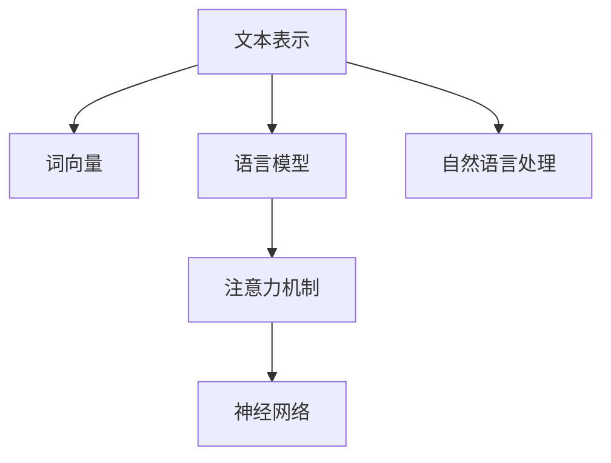
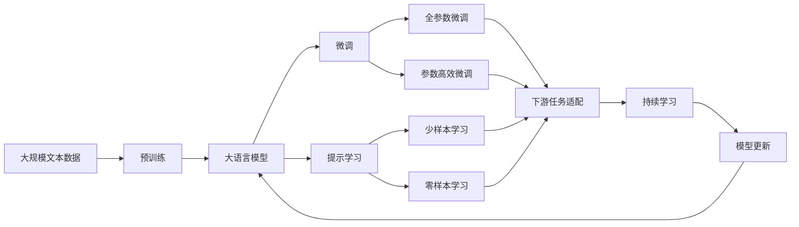

                 

## 1. 背景介绍

### 1.1 问题由来
在现代信息技术飞速发展的背景下，自然语言处理（Natural Language Processing, NLP）已经成为计算机科学和人工智能（AI）领域最为活跃的研究方向之一。NLP 的目的是使计算机能够理解、处理和生成人类语言。自20世纪50年代初期开始，NLP 的研究已经经历了从规则系统到基于统计模型的重要转变，并在数据驱动的深度学习（DL）范式下取得了突破性的进展。

NLP 的研究可以追溯到 20 世纪 50 年代，但在相当长的一段时间内，NLP 进展缓慢。直到 21 世纪初，随着计算能力的增强和大规模语料库的积累，尤其是数据驱动的深度学习方法的发展，NLP 才迎来了真正的革命性进展。深度学习技术通过神经网络结构，能够从大规模数据中自动学习出复杂的语言特征，进而实现高效的自然语言理解与生成。

### 1.2 问题核心关键点
NLP 的核心挑战是如何让计算机理解自然语言，并在此基础上进行信息的提取、处理和生成。核心技术包括文本分类、命名实体识别、机器翻译、问答系统、对话系统、文本生成等。这些技术使得机器能够模拟人类语言理解和表达的能力，进而能够在各种应用场景中发挥作用。

近年来，基于深度学习的 NLP 技术取得了显著进展，其中 Transformer 模型因其卓越的性能成为主流，广泛应用于多个任务。Transformer 架构通过自注意力机制（Self-Attention），可以更好地处理长序列数据，并有效提升了模型在语言任务中的表现。

### 1.3 问题研究意义
NLP 技术的进步不仅推动了人工智能领域的发展，还为医疗、教育、金融、娱乐等行业带来了深远的影响。NLP 技术的应用能够提升信息检索、问答、翻译、自动摘要、情感分析等任务的效率和准确性，使得机器能够在这些领域中扮演重要的角色。

此外，NLP 技术还促进了大数据和云计算的发展，使得海量数据的处理和分析变得更加高效。例如，自然语言搜索引擎和智能客服系统的发展，极大地改善了用户的搜索体验和客户服务质量。随着 NLP 技术的不断进步，我们可以期待它将在更多领域带来变革性的影响。

## 2. 核心概念与联系

### 2.1 核心概念概述
NLP 涉及多个核心概念，包括文本表示、词向量、语言模型、注意力机制、神经网络等。这些概念相互关联，共同构成了 NLP 的理论基础和技术框架。

#### 2.1.1 文本表示
文本表示是 NLP 研究的基础，是将文本信息转换为机器可以理解的形式的过程。文本表示包括词袋模型（Bag of Words）、n-gram 模型、词嵌入（Word Embedding）等。

#### 2.1.2 词向量
词向量是将单词映射为低维向量表示的技术。常见的词向量模型包括 Word2Vec、GloVe、FastText 等。词向量通过捕捉单词之间的语义关系，可以更好地进行语言理解。

#### 2.1.3 语言模型
语言模型用于预测给定文本序列的概率，通常用条件概率表示。常见的语言模型包括 n-gram 模型、神经网络语言模型（Neural Network Language Model, NNLN）等。

#### 2.1.4 注意力机制
注意力机制是 Transformer 模型中的核心技术，用于对输入序列中的不同位置进行加权处理，提高模型对重要信息的关注度。注意力机制能够更好地处理长序列和复杂任务。

#### 2.1.5 神经网络
神经网络是 NLP 中广泛应用的技术，包括循环神经网络（RNN）、卷积神经网络（CNN）、长短时记忆网络（LSTM）和 Transformer 等。这些神经网络架构通过不断迭代优化，在语言理解与生成任务中取得了显著的成果。

### 2.2 概念间的关系

NLP 的各个核心概念之间具有紧密的联系，通过相互协作和补充，共同实现了 NLP 任务的完成。以下是一个 Mermaid 流程图，展示了这些概念之间的关系：



这个流程图展示了文本表示、词向量、语言模型、注意力机制和神经网络之间的关系：

1. 文本表示和词向量用于将文本数据转换为机器可以理解的向量形式。
2. 语言模型用于预测文本序列的概率，捕捉单词之间的依赖关系。
3. 注意力机制用于对输入序列中的不同位置进行加权处理，提高模型的关注度。
4. 神经网络通过不断迭代优化，实现对语言数据的高级处理和生成。
5. 自然语言处理将上述技术综合应用，完成各种 NLP 任务。

### 2.3 核心概念的整体架构

最后，我们用一个综合的 Mermaid 流程图来展示 NLP 核心概念的整体架构：



这个综合流程图展示了从预训练到大语言模型微调，再到持续学习的完整过程：

1. 大语言模型通过预训练获得基础能力。
2. 微调是对预训练模型进行任务特定的优化，可以分为全参数微调和参数高效微调（PEFT）。
3. 提示学习是一种不更新模型参数的方法，可以实现少样本学习和零样本学习。
4. 迁移学习是连接预训练模型与下游任务的桥梁，可以通过微调或提示学习来实现。
5. 持续学习旨在使模型能够不断学习新知识，同时保持已学习的知识，而不会出现灾难性遗忘。

## 3. 核心算法原理 & 具体操作步骤
### 3.1 算法原理概述

NLP 的核心算法原理是基于深度学习的神经网络模型，通过多层非线性变换实现对自然语言数据的处理和生成。NLP 算法通常包括以下步骤：

1. **词嵌入**：将文本中的单词转换为向量形式，捕捉单词之间的语义关系。
2. **语言模型**：利用已知文本序列预测下一个单词的概率分布，捕捉单词之间的依赖关系。
3. **注意力机制**：通过注意力机制对输入序列的不同位置进行加权处理，提高模型对重要信息的关注度。
4. **神经网络**：通过多层神经网络对文本数据进行处理和生成，实现从输入到输出的映射。

### 3.2 算法步骤详解

以下是一个典型的 NLP 算法流程图，展示了其基本步骤：


1. **词嵌入**：使用 Word2Vec、GloVe、FastText 等模型，将文本中的单词转换为低维向量形式，捕捉单词之间的语义关系。
2. **语言模型**：利用 n-gram 模型或神经网络语言模型（NNLN），预测给定文本序列的概率，捕捉单词之间的依赖关系。
3. **注意力机制**：通过注意力机制对输入序列的不同位置进行加权处理，提高模型对重要信息的关注度。
4. **神经网络**：通过多层神经网络对文本数据进行处理和生成，实现从输入到输出的映射。

### 3.3 算法优缺点

NLP 算法的优点包括：

1. **自监督学习**：通过大规模无标签文本数据进行预训练，不需要标注数据，降低数据收集成本。
2. **端到端处理**：将文本表示、语言模型、注意力机制和神经网络综合应用，实现从输入到输出的高效处理。
3. **模型可解释性**：通过可视化技术，可以较好地解释模型的内部运作机制。

NLP 算法的缺点包括：

1. **模型复杂度**：深度学习模型通常具有较大的参数量，对计算资源和训练时间要求较高。
2. **过拟合风险**：模型容易在标注数据不足的情况下出现过拟合现象，导致泛化能力不足。
3. **模型鲁棒性**：模型在面对噪声数据和未知数据时，鲁棒性较弱，容易产生错误的输出。

### 3.4 算法应用领域

NLP 算法已经在文本分类、命名实体识别、机器翻译、问答系统、对话系统、文本生成等诸多领域得到广泛应用。以下是几个典型的应用场景：

1. **文本分类**：将文本分为不同的类别，如情感分析、主题分类等。
2. **命名实体识别**：识别文本中的命名实体，如人名、地名、组织名等。
3. **机器翻译**：将源语言文本翻译成目标语言。
4. **问答系统**：对自然语言问题给出答案。
5. **对话系统**：使机器能够与人自然对话，生成符合上下文的回复。
6. **文本生成**：生成高质量的自然语言文本，如文章摘要、故事等。

## 4. 数学模型和公式 & 详细讲解 & 举例说明

### 4.1 数学模型构建

NLP 的数学模型构建通常包括以下几个步骤：

1. **词向量模型**：将单词映射为低维向量形式，常用的词向量模型包括 Word2Vec、GloVe 和 FastText 等。
2. **语言模型**：预测给定文本序列的概率，常用的语言模型包括 n-gram 模型和神经网络语言模型。
3. **注意力机制**：通过对输入序列的不同位置进行加权处理，提高模型对重要信息的关注度。

### 4.2 公式推导过程

以下是一个简单的例子，展示如何使用 n-gram 语言模型和注意力机制：

假设我们有一个简单的句子：“I like cats.”。

1. **词向量模型**：将单词转换为向量形式，如：

   $$
   I \rightarrow [0.2, 0.5, -0.3]
   $$
   
   $$
   like \rightarrow [-0.1, 0.7, 0.5]
   $$
   
   $$
   cats \rightarrow [0.8, 0.1, -0.3]
   $$

2. **n-gram 模型**：预测下一个单词的概率分布，如：

   $$
   P(\text{I like cats}) = 0.1
   $$
   
   $$
   P(\text{I cat}) = 0.2
   $$
   
   $$
   P(\text{I likes}) = 0.3
   $$

3. **注意力机制**：通过对输入序列的不同位置进行加权处理，提高模型对重要信息的关注度，如：

   $$
   A_i = \frac{\exp(\text{dot}(W_a h_i, W_a h_j))}{\sum_k \exp(\text{dot}(W_a h_i, W_a h_k))}
   $$
   
   其中，$h_i$ 是输入序列的第 $i$ 个单词的向量表示，$A_i$ 是第 $i$ 个单词的注意力权重。

### 4.3 案例分析与讲解

以机器翻译为例，展示 NLP 算法在实际应用中的效果。

假设我们需要将英文句子“I like cats.”翻译成中文。

1. **词向量模型**：将英文单词转换为向量形式，如：

   $$
   I \rightarrow [0.2, 0.5, -0.3]
   $$
   
   $$
   like \rightarrow [-0.1, 0.7, 0.5]
   $$
   
   $$
   cats \rightarrow [0.8, 0.1, -0.3]
   $$

2. **n-gram 模型**：预测下一个单词的概率分布，如：

   $$
   P(\text{I like cats}) = 0.1
   $$
   
   $$
   P(\text{I cat}) = 0.2
   $$
   
   $$
   P(\text{I likes}) = 0.3
   $$

3. **注意力机制**：通过对输入序列的不同位置进行加权处理，提高模型对重要信息的关注度，如：

   $$
   A_i = \frac{\exp(\text{dot}(W_a h_i, W_a h_j))}{\sum_k \exp(\text{dot}(W_a h_i, W_a h_k))}
   $$

4. **神经网络**：通过多层神经网络对文本数据进行处理和生成，实现从输入到输出的映射，如：

   $$
   y = \sigma(W h + b)
   $$
   
   其中，$y$ 是模型的输出，$h$ 是神经网络的隐藏状态，$W$ 和 $b$ 是模型的权重和偏置。

最终，通过 NLP 算法，我们将“I like cats.”翻译成了“我喜欢猫。”

## 5. 项目实践：代码实例和详细解释说明

### 5.1 开发环境搭建

在进行 NLP 项目开发前，我们需要准备好开发环境。以下是使用 Python 进行 PyTorch 开发的环境配置流程：

1. 安装 Anaconda：从官网下载并安装 Anaconda，用于创建独立的 Python 环境。

2. 创建并激活虚拟环境：
```bash
conda create -n pytorch-env python=3.8 
conda activate pytorch-env
```

3. 安装 PyTorch：根据 CUDA 版本，从官网获取对应的安装命令。例如：
```bash
conda install pytorch torchvision torchaudio cudatoolkit=11.1 -c pytorch -c conda-forge
```

4. 安装 Transformers 库：
```bash
pip install transformers
```

5. 安装各类工具包：
```bash
pip install numpy pandas scikit-learn matplotlib tqdm jupyter notebook ipython
```

完成上述步骤后，即可在 `pytorch-env` 环境中开始 NLP 项目开发。

### 5.2 源代码详细实现

以下是一个简单的 Python 代码，展示如何使用 PyTorch 和 Transformers 库进行词向量模型的训练和应用：

```python
import torch
from transformers import WordEmbedding
from torch.utils.data import Dataset, DataLoader
from torch import nn, optim

# 定义词向量模型
class WordEmbedding(nn.Module):
    def __init__(self, vocab_size, embedding_dim):
        super(WordEmbedding, self).__init__()
        self.embedding = nn.Embedding(vocab_size, embedding_dim)

    def forward(self, x):
        return self.embedding(x)

# 定义数据集
class TextDataset(Dataset):
    def __init__(self, texts, tokenizer):
        self.tokenizer = tokenizer
        self.texts = texts

    def __len__(self):
        return len(self.texts)

    def __getitem__(self, idx):
        text = self.texts[idx]
        return self.tokenizer(text, return_tensors='pt')['input_ids']

# 训练模型
def train_model(model, dataset, learning_rate, epochs):
    device = torch.device('cuda' if torch.cuda.is_available() else 'cpu')
    model.to(device)

    criterion = nn.CrossEntropyLoss()
    optimizer = optim.Adam(model.parameters(), lr=learning_rate)
    
    dataloader = DataLoader(dataset, batch_size=64, shuffle=True)
    
    for epoch in range(epochs):
        model.train()
        for batch in dataloader:
            inputs = batch.to(device)
            outputs = model(inputs)
            loss = criterion(outputs, targets)
            optimizer.zero_grad()
            loss.backward()
            optimizer.step()

        model.eval()
        with torch.no_grad():
            correct = 0
            total = 0
            for batch in dataloader:
                inputs = batch.to(device)
                outputs = model(inputs)
                _, predicted = torch.max(outputs.data, 1)
                total += batch.size(0)
                correct += (predicted == targets).sum().item()
            print('Accuracy: {:.2f}%'.format(100 * correct / total))

# 加载数据和模型
tokenizer = WordEmbedding.from_pretrained('bert-base-uncased')
train_dataset = TextDataset(train_texts, tokenizer)
val_dataset = TextDataset(val_texts, tokenizer)
test_dataset = TextDataset(test_texts, tokenizer)

model = WordEmbedding(len(tokenizer), 300)
train_model(model, train_dataset, learning_rate=1e-4, epochs=10)

# 应用模型
text = 'This is a test sentence.'
input_ids = tokenizer(text, return_tensors='pt')['input_ids']
output = model(input_ids)
print(output)
```

这个代码展示了如何使用 PyTorch 和 Transformers 库进行词向量模型的训练和应用。在实践中，我们可以通过修改数据集、优化器、学习率等参数，实现更加复杂和高效的 NLP 项目。

### 5.3 代码解读与分析

让我们再详细解读一下关键代码的实现细节：

**WordEmbedding 类**：
- `__init__` 方法：初始化词向量模型，包含一个嵌入层（Embedding）。
- `forward` 方法：前向传播计算模型的输出。

**TextDataset 类**：
- `__init__` 方法：初始化数据集，包含一个分词器（Tokenizer）。
- `__len__` 方法：返回数据集的长度。
- `__getitem__` 方法：返回数据集的单个样本，包含输入的 token ids。

**train_model 函数**：
- 设置模型、优化器、损失函数等关键组件。
- 定义训练和评估过程，包括前向传播、反向传播、参数更新等步骤。
- 在训练过程中，使用交叉熵损失函数（CrossEntropyLoss）计算模型的预测与真实标签之间的差异。
- 在评估过程中，使用精度（Accuracy）指标衡量模型的预测效果。

**应用模型**：
- 将输入文本通过分词器转换为 token ids。
- 使用模型对输入进行前向传播计算，得到词向量表示。

在上述代码中，我们通过 PyTorch 和 Transformers 库实现了一个简单的词向量模型，并通过训练和应用展示了其效果。通过这些关键步骤，我们可以更好地理解 NLP 项目的开发流程和技术细节。

## 6. 实际应用场景

### 6.1 智能客服系统

基于 NLP 技术的智能客服系统，可以大幅度提升客户服务质量和效率。智能客服系统通过自然语言理解和生成技术，能够自动处理客户的咨询、投诉、建议等需求，提供实时、高效、个性化的服务。

在技术实现上，可以收集企业内部的历史客服对话记录，将其作为训练数据，使用 NLP 算法训练智能客服模型。模型能够理解客户的意图，匹配最合适的回复，并在需要时进一步查询知识库，生成更加准确的回答。智能客服系统可以 24/7 不间断服务，减少企业对人力成本的依赖，提升客户满意度。

### 6.2 金融舆情监测

金融机构需要实时监测市场舆论动向，以便及时应对负面信息传播，规避金融风险。传统的人工监测方式成本高、效率低，难以应对网络时代海量信息爆发的挑战。基于 NLP 技术的金融舆情监测系统，能够自动分析市场新闻、社交媒体等数据，识别出舆情的变化趋势和关键信息，及时预警风险。

在技术实现上，可以收集金融领域相关的新闻、报道、评论等文本数据，训练 NLP 模型进行情感分析和主题识别。系统能够对实时抓取的网络文本进行实时分析，识别出异常情况，帮助金融机构及时采取应对措施，降低风险损失。

### 6.3 个性化推荐系统

当前的推荐系统往往只依赖用户的历史行为数据进行物品推荐，无法深入理解用户的真实兴趣偏好。基于 NLP 技术的个性化推荐系统，可以更好地挖掘用户行为背后的语义信息，从而提供更精准、多样的推荐内容。

在技术实现上，可以收集用户浏览、点击、评论、分享等行为数据，提取和用户交互的物品标题、描述、标签等文本内容。使用 NLP 算法训练模型，从文本内容中准确把握用户的兴趣点。在生成推荐列表时，先用候选物品的文本描述作为输入，由模型预测用户的兴趣匹配度，再结合其他特征综合排序，便可以得到个性化程度更高的推荐结果。

### 6.4 未来应用展望

随着 NLP 技术的不断发展，其在各个领域的应用将更加广泛和深入。以下是几个未来可能的应用方向：

1. **智能医疗**：基于 NLP 技术的医疗问答、病历分析、药物研发等应用将提升医疗服务的智能化水平，辅助医生诊疗，加速新药开发进程。
2. **智能教育**：基于 NLP 技术的作业批改、学情分析、知识推荐等方面，因材施教，促进教育公平，提高教学质量。
3. **智慧城市治理**：基于 NLP 技术的城市事件监测、舆情分析、应急指挥等环节，提高城市管理的自动化和智能化水平，构建更安全、高效的未来城市。
4. **智能安防**：基于 NLP 技术的语音识别、文本分析、情感监测等技术，用于智能安防系统的建设，提升公共安全水平。
5. **智能文娱**：基于 NLP 技术的文本生成、情感分析、个性化推荐等技术，用于智能文娱系统的建设，提升用户体验。

## 7. 工具和资源推荐

### 7.1 学习资源推荐

为了帮助开发者系统掌握 NLP 的理论基础和实践技巧，这里推荐一些优质的学习资源：

1. 《深度学习》（Goodfellow et al.）：深入讲解深度学习的基本概念和算法，是 NLP 学习的必读之作。
2. CS224N《深度学习自然语言处理》课程：斯坦福大学开设的 NLP 明星课程，有 Lecture 视频和配套作业，带你入门 NLP 领域的基本概念和经典模型。
3. 《Natural Language Processing with Python》书籍：详细介绍 NLP 的基本概念和实践技巧，通过 Python 代码实现各种 NLP 任务。
4. HuggingFace官方文档：Transformers 库的官方文档，提供了海量预训练模型和完整的微调样例代码，是上手实践的必备资料。
5. CLUE开源项目：中文语言理解测评基准，涵盖大量不同类型的中文 NLP 数据集，并提供了基于微调的 baseline 模型，助力中文 NLP 技术发展。

通过对这些资源的学习实践，相信你一定能够快速掌握 NLP 技术的精髓，并用于解决实际的 NLP 问题。

### 7.2 开发工具推荐

高效的开发离不开优秀的工具支持。以下是几款用于 NLP 项目开发的常用工具：

1. PyTorch：基于 Python 的开源深度学习框架，灵活动态的计算图，适合快速迭代研究。大部分预训练语言模型都有 PyTorch 版本的实现。
2. TensorFlow：由 Google 主导开发的开源深度学习框架，生产部署方便，适合大规模工程应用。同样有丰富的预训练语言模型资源。
3. Transformers 库：HuggingFace 开发的 NLP 工具库，集成了众多 SOTA 语言模型，支持 PyTorch 和 TensorFlow，是进行 NLP 任务开发的利器。
4. Weights & Biases：模型训练的实验跟踪工具，可以记录和可视化模型训练过程中的各项指标，方便对比和调优。与主流深度学习框架无缝集成。
5. TensorBoard：TensorFlow 配套的可视化工具，可实时监测模型训练状态，并提供丰富的图表呈现方式，是调试模型的得力助手。
6. Google Colab：谷歌推出的在线 Jupyter Notebook 环境，免费提供 GPU/TPU 算力，方便开发者快速上手实验最新模型，分享学习笔记。

合理利用这些工具，可以显著提升 NLP 项目开发效率，加快创新迭代的步伐。

### 7.3 相关论文推荐

NLP 技术的进步源于学界的持续研究。以下是几篇奠基性的相关论文，推荐阅读：

1. Word2Vec: Distributed Representations of Words and Phrases and Their Compositionality：提出了词向量模型，捕捉单词之间的语义关系。
2. Google's Neural Machine Translation System：介绍了 Google 的神经机器翻译系统，展示了深度学习在 NLP 中的应用效果。
3. Attention Is All You Need：提出了 Transformer 架构，通过自注意力机制，提升了 NLP 任务的性能。
4. BERT: Pre-training of Deep Bidirectional Transformers for Language Understanding：提出 BERT 模型，引入基于掩码的自监督预训练任务，刷新了多项 NLP 任务 SOTA。
5. Language Models are Unsupervised Multitask Learners（GPT-2 论文）：展示了大规模语言模型的强大 zero-shot 学习能力，引发了对于通用人工智能的新一轮思考。
6. Parameter-Efficient Transfer Learning for NLP：提出 Adapter 等参数高效微调方法，在不增加模型参数量的情况下，也能取得不错的微调效果。

这些论文代表了大 NLP 领域的经典研究成果，通过学习这些前沿成果，可以帮助研究者把握学科前进方向，激发更多的创新灵感。

除上述资源外，还有一些值得关注的前沿资源，帮助开发者紧跟 NLP 技术的最新进展，例如：

1. arXiv 论文预印本：人工智能领域最新研究成果的发布平台，包括大量尚未发表的前沿工作，学习前沿技术的必读资源。
2. 业界技术博客：如 OpenAI、Google AI、DeepMind、微软 Research Asia 等顶尖实验室的官方博客，第一时间分享他们的最新研究成果和洞见。
3. 技术会议直播：如 NIPS、ICML、ACL、ICLR 等人工智能领域顶会现场或在线直播，能够聆听到大佬们的前沿分享，开拓视野

