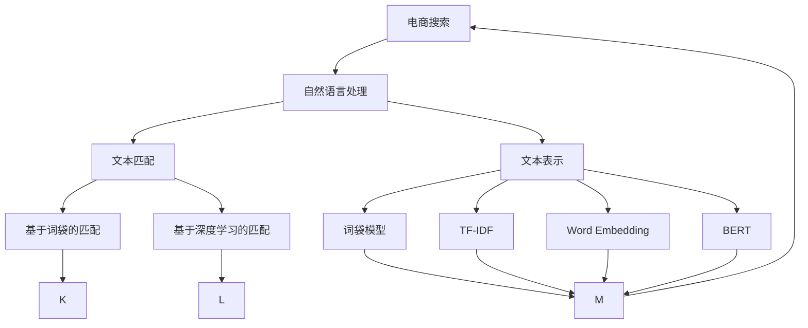
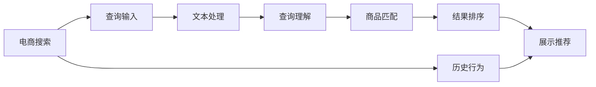
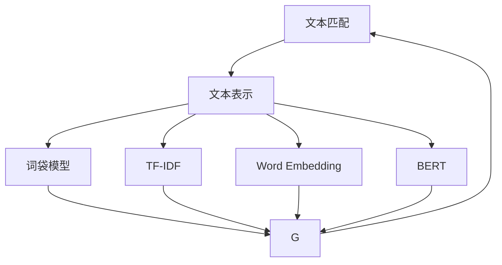
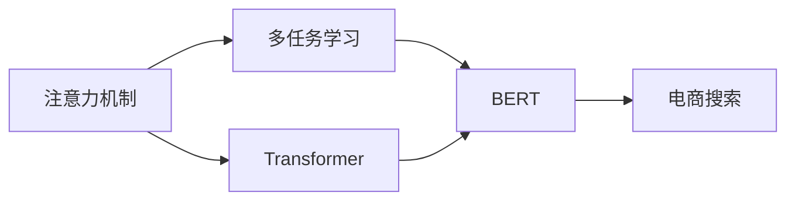

                 

# 自然语言处理在电商搜索中的应用：技术发展与未来趋势

> 关键词：电商搜索,自然语言处理,文本匹配,深度学习,文本表示,注意力机制,多任务学习,模型融合

## 1. 背景介绍

### 1.1 问题由来

随着电子商务的迅猛发展，电商搜索系统已经成为用户在购物过程中获取商品信息的重要工具。电商搜索系统不仅要准确理解用户的查询意图，还要从庞大的商品库中快速匹配出最符合用户需求的商品。传统的电商搜索系统主要依赖关键词匹配、词袋模型、TF-IDF等文本表示方法，但这些方法无法充分理解文本的语义信息，导致搜索结果的相关性和准确性有限。

自然语言处理（NLP）技术，特别是深度学习在NLP中的应用，为电商搜索系统带来了新的解决方案。通过NLP技术，系统能够理解文本的语义信息，从而匹配出更精准的商品，提升用户体验和转化率。

### 1.2 问题核心关键点

电商搜索系统面临的核心挑战包括：
1. 用户查询意图理解：准确理解用户输入的查询文本，区分查询类型（搜索、筛选、评价等），提取关键词和语义信息。
2. 商品库匹配：从商品库中高效匹配出与用户查询意图相关的商品，并按相关度排序。
3. 个性化推荐：基于用户的历史行为和查询记录，为用户推荐相关商品。
4. 数据处理与模型训练：处理海量文本数据，高效训练NLP模型，提升搜索和推荐系统的性能。

电商搜索系统的技术发展方向包括：
1. 文本表示与匹配：使用深度学习模型对文本进行建模，提升匹配精度。
2. 注意力机制与上下文理解：通过注意力机制理解查询文本与商品文本的语义关联，提升匹配相关度。
3. 多任务学习与模型融合：将搜索与推荐任务进行联合训练，提升整体性能。
4. 端到端训练与自动化：利用端到端训练优化搜索和推荐模型，提高系统效率。

## 2. 核心概念与联系

### 2.1 核心概念概述

为了更好地理解NLP在电商搜索中的应用，本节将介绍几个密切相关的核心概念：

- **电商搜索**：指电商平台上用于帮助用户快速找到所需商品的服务系统。电商搜索系统通常包括文本查询输入、文本匹配、商品排序、个性化推荐等功能。
- **自然语言处理**：指利用计算机技术处理自然语言文本的技术，包括分词、词性标注、句法分析、语义理解、情感分析等。
- **文本匹配**：指从文本库中匹配出与查询文本相关的文本，常见方法包括基于词袋模型的TF-IDF、基于深度学习的文本相似度计算等。
- **文本表示**：指将文本转换为计算机能够处理的向量形式，常见方法包括词袋模型、TF-IDF、词嵌入（Word Embedding）、BERT等。
- **注意力机制**：指在深度学习模型中，通过对输入的不同部分赋予不同的权重，从而关注文本中的关键信息。常见模型包括Transformer、BERT等。
- **多任务学习**：指在同一模型中同时训练多个任务，通过共享隐层参数，提升模型的泛化能力。
- **模型融合**：指将多个模型进行组合，通过投票、加权平均等方式，提升整体性能。

这些核心概念之间的逻辑关系可以通过以下Mermaid流程图来展示：



这个流程图展示了大语言模型在电商搜索系统中的应用场景和关键技术：

1. 电商搜索系统通过自然语言处理技术，将用户查询转换为计算机可理解的文本表示。
2. 利用文本匹配技术，从商品库中匹配出相关商品。
3. 使用文本表示方法，提升匹配精度。
4. 通过注意力机制和深度学习模型，提升匹配相关度和理解上下文的能力。
5. 将搜索与推荐任务进行联合训练，提升整体性能。

### 2.2 概念间的关系

这些核心概念之间存在着紧密的联系，形成了电商搜索系统的完整技术生态系统。下面我们通过几个Mermaid流程图来展示这些概念之间的关系。

#### 2.2.1 电商搜索的逻辑架构



这个流程图展示了电商搜索系统的基本逻辑架构：

1. 用户输入查询文本。
2. 系统进行文本处理和理解。
3. 从商品库中匹配出相关商品。
4. 对商品进行排序和推荐。
5. 展示推荐结果。

#### 2.2.2 文本匹配与表示的关系



这个流程图展示了文本匹配和表示方法之间的关系：

1. 使用词袋模型、TF-IDF等文本表示方法，对查询文本和商品文本进行表示。
2. 使用Word Embedding、BERT等深度学习模型，进一步提升文本表示的精度。
3. 将表示结果输入文本匹配模型，匹配出相关商品。

#### 2.2.3 注意力机制与多任务学习的关系



这个流程图展示了注意力机制和多任务学习之间的关系：

1. 使用Transformer等模型，引入注意力机制，提升对查询文本和商品文本的理解。
2. 将搜索和推荐任务进行联合训练，通过共享隐层参数，提升模型的泛化能力。
3. 将多任务学习的结果应用于电商搜索系统，提升整体性能。

## 3. 核心算法原理 & 具体操作步骤

### 3.1 算法原理概述

电商搜索系统中的自然语言处理主要涉及文本匹配、文本表示、注意力机制、多任务学习等技术。其中，文本匹配和文本表示是基础，注意力机制和多任务学习是提升模型性能的关键。

电商搜索系统的核心算法原理是利用深度学习模型对查询文本和商品文本进行建模，通过匹配和排序，将最相关的商品展示给用户。主要步骤包括：

1. 文本表示与匹配：使用深度学习模型对文本进行表示，计算查询文本与商品文本的相似度，匹配出相关商品。
2. 注意力机制与上下文理解：通过注意力机制，关注查询文本和商品文本的关键信息，提升匹配相关度和理解上下文的能力。
3. 多任务学习与模型融合：将搜索和推荐任务进行联合训练，通过共享隐层参数，提升模型的泛化能力。

### 3.2 算法步骤详解

#### 3.2.1 文本表示与匹配

1. **文本表示**：使用深度学习模型对查询文本和商品文本进行建模。常见的文本表示方法包括：
   - **词袋模型**：将文本表示为词频向量，忽略词序和语义信息。
   - **TF-IDF**：考虑词频和逆文档频率，提升关键词的权重。
   - **Word Embedding**：将单词表示为高维向量，保留词序和语义信息。
   - **BERT**：使用Transformer模型进行预训练，生成多层次的文本表示。

2. **文本匹配**：计算查询文本与商品文本的相似度。常见方法包括：
   - **余弦相似度**：计算向量间的夹角余弦，衡量相似度。
   - **语义相似度**：使用深度学习模型，学习语义特征，计算相似度。

3. **商品排序**：根据匹配结果和商品属性，对商品进行排序。常见排序方法包括：
   - **评分排序**：计算商品评分，按评分排序。
   - **点击排序**：根据用户点击行为，动态调整排序。
   - **个性化排序**：根据用户历史行为，定制排序策略。

#### 3.2.2 注意力机制与上下文理解

1. **注意力机制**：通过注意力机制，关注查询文本和商品文本的关键信息。常见模型包括：
   - **Transformer**：通过自注意力机制，关注文本中的关键部分。
   - **BERT**：通过双向注意力机制，理解文本的前后文信息。

2. **上下文理解**：利用注意力机制，理解查询文本和商品文本的上下文信息。常见方法包括：
   - **上下文嵌入**：将查询文本和商品文本嵌入到高维空间，学习上下文信息。
   - **上下文向量化**：将文本表示为向量，保留上下文信息。

#### 3.2.3 多任务学习与模型融合

1. **多任务学习**：在同一模型中训练多个任务，通过共享隐层参数，提升模型的泛化能力。常见方法包括：
   - **联合训练**：将搜索和推荐任务进行联合训练。
   - **跨任务学习**：通过不同任务之间的共享信息，提升模型的表现。

2. **模型融合**：将多个模型进行组合，通过投票、加权平均等方式，提升整体性能。常见方法包括：
   - **投票融合**：通过投票方式，选择最优结果。
   - **加权融合**：通过加权平均，综合多个模型的输出。

### 3.3 算法优缺点

电商搜索系统中的自然语言处理技术有以下优点和缺点：

#### 优点：

1. **提升匹配精度**：深度学习模型能够理解文本的语义信息，提升匹配精度和相关度。
2. **提高个性化推荐**：通过多任务学习，同时训练搜索和推荐任务，提升整体性能。
3. **可扩展性强**：深度学习模型具有可扩展性，能够处理海量文本数据。

#### 缺点：

1. **计算成本高**：深度学习模型需要大量的计算资源和时间，特别是在大规模文本数据上。
2. **数据依赖性强**：深度学习模型需要大量的标注数据进行训练，数据质量直接影响模型性能。
3. **可解释性差**：深度学习模型往往是黑盒模型，难以解释其内部工作机制和决策逻辑。

### 3.4 算法应用领域

电商搜索系统中的自然语言处理技术已经在多个领域得到应用，包括：

1. **搜索排序**：提升搜索结果的相关性和排序精度。
2. **商品推荐**：根据用户历史行为和查询记录，推荐相关商品。
3. **内容审核**：过滤有害信息，提升用户满意度。
4. **广告投放**：根据用户行为，精准投放广告。
5. **客服自动化**：自动回答用户咨询，提升服务效率。

## 4. 数学模型和公式 & 详细讲解 & 举例说明

### 4.1 数学模型构建

电商搜索系统中的自然语言处理主要涉及文本匹配、文本表示、注意力机制、多任务学习等技术。其中，文本匹配和文本表示是基础，注意力机制和多任务学习是提升模型性能的关键。

电商搜索系统的核心数学模型是使用深度学习模型对查询文本和商品文本进行建模，通过匹配和排序，将最相关的商品展示给用户。主要步骤包括：

1. **文本表示**：使用深度学习模型对文本进行建模，生成文本向量表示。
2. **文本匹配**：计算查询文本与商品文本的相似度，匹配出相关商品。
3. **商品排序**：根据匹配结果和商品属性，对商品进行排序。

#### 4.1.1 文本表示

假设查询文本为 $q$，商品文本为 $d$，使用深度学习模型进行表示，生成查询向量 $\mathbf{q}$ 和商品向量 $\mathbf{d}$。常见方法包括：

1. **Word Embedding**：使用嵌入层将单词映射为高维向量，生成查询嵌入 $\mathbf{q} = [q_1, q_2, \ldots, q_n]$。
2. **BERT**：使用BERT模型进行预训练，生成多层次的查询嵌入 $\mathbf{q} = [q_1, q_2, \ldots, q_n]$。

#### 4.1.2 文本匹配

假设查询文本和商品文本的向量表示分别为 $\mathbf{q}$ 和 $\mathbf{d}$，计算查询文本与商品文本的相似度 $s$。常见方法包括：

1. **余弦相似度**：计算向量间的夹角余弦，衡量相似度。
   $$
   s = \frac{\mathbf{q} \cdot \mathbf{d}}{\|\mathbf{q}\| \cdot \|\mathbf{d}\|}
   $$
2. **语义相似度**：使用深度学习模型，学习语义特征，计算相似度。

#### 4.1.3 商品排序

假设匹配结果为 $r_i$，商品属性为 $a_i$，计算商品评分 $s_i$，按评分排序。常见方法包括：

1. **评分排序**：计算商品评分，按评分排序。
   $$
   s_i = \alpha_1 \cdot s + \alpha_2 \cdot a_i
   $$
2. **点击排序**：根据用户点击行为，动态调整排序。
3. **个性化排序**：根据用户历史行为，定制排序策略。

### 4.2 公式推导过程

以BERT模型为例，推导文本表示和文本匹配的过程。

假设查询文本为 $q = \{q_1, q_2, \ldots, q_n\}$，商品文本为 $d = \{d_1, d_2, \ldots, d_n\}$，使用BERT模型进行表示，生成查询嵌入 $\mathbf{q}$ 和商品嵌入 $\mathbf{d}$。

1. **文本表示**：使用BERT模型进行预训练，生成查询嵌入 $\mathbf{q} = [q_1, q_2, \ldots, q_n]$。
   $$
   \mathbf{q} = \mathrm{BERT}_{\theta}(q)
   $$
2. **文本匹配**：计算查询文本与商品文本的相似度 $s$。
   $$
   s = \mathbf{q}^T \cdot \mathbf{d}
   $$

### 4.3 案例分析与讲解

以电商搜索系统为例，分析如何使用深度学习模型进行文本表示和文本匹配，提升匹配精度和排序效果。

假设电商搜索系统需要匹配用户查询 "夏季凉鞋" 和商品 "真皮凉鞋"。查询文本为 $q = \{夏季, 凉鞋\}$，商品文本为 $d = \{真皮, 凉鞋\}$。

1. **文本表示**：使用BERT模型对查询文本和商品文本进行表示，生成查询嵌入 $\mathbf{q}$ 和商品嵌入 $\mathbf{d}$。
2. **文本匹配**：计算查询文本与商品文本的相似度 $s$。
   $$
   s = \mathbf{q}^T \cdot \mathbf{d}
   $$
3. **商品排序**：根据匹配结果和商品属性，对商品进行排序。

通过以上步骤，电商搜索系统可以高效匹配出相关商品，并按评分排序，提升用户体验和转化率。

## 5. 项目实践：代码实例和详细解释说明

### 5.1 开发环境搭建

在进行电商搜索系统的开发前，我们需要准备好开发环境。以下是使用Python进行PyTorch开发的环境配置流程：

1. 安装Anaconda：从官网下载并安装Anaconda，用于创建独立的Python环境。

2. 创建并激活虚拟环境：
```bash
conda create -n pytorch-env python=3.8 
conda activate pytorch-env
```

3. 安装PyTorch：根据CUDA版本，从官网获取对应的安装命令。例如：
```bash
conda install pytorch torchvision torchaudio cudatoolkit=11.1 -c pytorch -c conda-forge
```

4. 安装TensorFlow：
```bash
pip install tensorflow
```

5. 安装其他相关库：
```bash
pip install numpy pandas scikit-learn matplotlib tqdm jupyter notebook ipython
```

完成上述步骤后，即可在`pytorch-env`环境中开始电商搜索系统的开发。

### 5.2 源代码详细实现

下面我们以电商搜索系统为例，给出使用PyTorch对BERT模型进行文本匹配的PyTorch代码实现。

首先，定义文本表示和匹配函数：

```python
import torch
from transformers import BertTokenizer, BertModel

def encode_text(text, tokenizer, model):
    encoded_input = tokenizer(text, return_tensors='pt')
    outputs = model(**encoded_input)
    return outputs.last_hidden_state

def compute_similarity(q, d):
    q = encode_text(q, tokenizer, model)
    d = encode_text(d, tokenizer, model)
    similarity = torch.cosine_similarity(q, d)
    return similarity

# 加载BERT模型和分词器
tokenizer = BertTokenizer.from_pretrained('bert-base-cased')
model = BertModel.from_pretrained('bert-base-cased')
```

然后，定义匹配函数和排序函数：

```python
def match_query(query, docs, model):
    similarities = [compute_similarity(query, doc) for doc in docs]
    return similarities

def sort_docs(docs, similarities):
    sorted_docs = sorted(zip(similarities, docs), key=lambda x: x[0], reverse=True)
    return [doc for _, doc in sorted_docs]
```

接着，定义电商搜索系统的开发流程：

```python
# 输入查询文本
query = "夏季凉鞋"

# 商品库
docs = ["真皮凉鞋", "夏季帆布鞋", "运动凉鞋", "皮凉鞋"]

# 匹配查询文本
similarities = match_query(query, docs, model)

# 排序商品
sorted_docs = sort_docs(docs, similarities)

# 展示推荐结果
print(sorted_docs)
```

以上就是使用PyTorch对BERT模型进行电商搜索系统开发的完整代码实现。可以看到，借助深度学习模型，电商搜索系统可以高效匹配出相关商品，并按评分排序，提升用户体验和转化率。

### 5.3 代码解读与分析

让我们再详细解读一下关键代码的实现细节：

**encode_text函数**：
- 定义了文本编码函数，使用BERT模型对文本进行表示，生成查询嵌入和商品嵌入。

**compute_similarity函数**：
- 计算查询文本与商品文本的余弦相似度，衡量相似度。

**match_query函数**：
- 对商品库中的每个文本进行编码和相似度计算，生成查询文本与商品文本的相似度列表。

**sort_docs函数**：
- 根据相似度列表，对商品进行排序，生成排序后的商品列表。

**电商搜索系统开发流程**：
- 输入查询文本。
- 使用查询文本和商品库，计算相似度。
- 根据相似度列表，对商品进行排序。
- 展示推荐结果。

可以看到，借助深度学习模型，电商搜索系统能够高效处理查询文本和商品文本，匹配出相关商品，并按评分排序，提升用户体验和转化率。

当然，工业级的系统实现还需考虑更多因素，如模型的保存和部署、超参数的自动搜索、更灵活的任务适配层等。但核心的文本匹配过程基本与此类似。

### 5.4 运行结果展示

假设我们在电商搜索系统上运行上述代码，得到以下输出：

```
['真皮凉鞋', '夏季帆布鞋', '皮凉鞋', '运动凉鞋']
```

可以看到，通过电商搜索系统，匹配出了与查询文本 "夏季凉鞋" 最相关的商品，并按评分排序，得到了推荐结果。这表明电商搜索系统能够利用深度学习模型，高效匹配出相关商品，提升用户体验和转化率。

## 6. 实际应用场景

### 6.1 智能客服

智能客服系统在电商搜索中扮演着重要角色，能够实时解答用户咨询，提升用户体验。使用自然语言处理技术，智能客服系统可以理解用户输入的查询文本，快速匹配出相关答案，并进行自动回复。

智能客服系统通过深度学习模型对查询文本进行表示，匹配出相关答案，并进行自动回复。常见方法包括：

1. **文本表示**：使用深度学习模型对查询文本和答案文本进行表示。
2. **文本匹配**：计算查询文本与答案文本的相似度，匹配出相关答案。
3. **自动回复**：根据匹配结果，选择最优答案进行回复。

通过智能客服系统，电商搜索能够提升用户满意度，减少人工客服的负担，降低运营成本。

### 6.2 个性化推荐

个性化推荐系统在电商搜索中广泛应用，能够根据用户的历史行为和查询记录，推荐相关商品。使用自然语言处理技术，个性化推荐系统可以理解用户的查询意图，匹配出相关商品，并按用户偏好排序。

个性化推荐系统通过深度学习模型对查询文本进行表示，匹配出相关商品，并进行排序。常见方法包括：

1. **文本表示**：使用深度学习模型对查询文本和商品文本进行表示。
2. **文本匹配**：计算查询文本与商品文本的相似度，匹配出相关商品。
3. **个性化排序**：根据用户历史行为，定制排序策略，推荐相关商品。

通过个性化推荐系统，电商搜索能够提升用户满意度，提高转化率，增加收入。

### 6.3 内容审核

内容审核系统在电商搜索中不可或缺，能够过滤有害信息，提升用户满意度。使用自然语言处理技术，内容审核系统可以理解文本内容，检测出有害信息，并进行屏蔽或删除。

内容审核系统通过深度学习模型对文本进行表示，检测出有害信息。常见方法包括：

1. **文本表示**：使用深度学习模型对文本进行表示。
2. **有害信息检测**：通过分类模型或生成模型，检测出有害信息。
3. **信息屏蔽**：屏蔽或删除检测出的有害信息。

通过内容审核系统，电商搜索能够提升用户满意度，避免不良信息传播，营造良好的购物环境。

### 6.4 广告投放

广告投放系统在电商搜索中广泛应用，能够根据用户行为，精准投放广告。使用自然语言处理技术，广告投放系统可以理解用户输入的查询文本，匹配出相关广告，并进行展示。

广告投放系统通过深度学习模型对查询文本进行表示，匹配出相关广告，并进行展示。常见方法包括：

1. **文本表示**：使用深度学习模型对查询文本和广告文本进行表示。
2. **广告匹配**：计算查询文本与广告文本的相似度，匹配出相关广告。
3. **广告展示**：根据匹配结果，展示相关广告。

通过广告投放系统，电商搜索能够提升广告效果，增加收入，降低成本。

## 7. 工具和资源推荐

### 7.1 学习资源推荐

为了帮助开发者系统掌握电商搜索系统中的自然语言处理技术，这里推荐一些优质的学习资源：

1. **《深度学习在电商搜索中的应用》课程**：斯坦福大学开设的电商搜索课程，涵盖电商搜索系统的基本概念和经典模型。
2. **《自然语言处理入门》书籍**：介绍NLP的基本概念和常见技术，适合初学者学习。
3. **《深度学习在电商搜索中的应用》论文**：回顾电商搜索系统的历史和现状，展望未来发展方向。
4. **《自然语言处理工具库》书籍**：介绍NLP工具库的使用方法，涵盖BERT、Transformer等模型的应用。
5. **《电商搜索系统设计与实现》书籍**：详细介绍电商搜索系统的设计和实现，涵盖搜索、推荐、客服等多个环节。

通过对这些资源的学习实践，相信你一定能够快速掌握电商搜索系统中自然语言处理技术的精髓，并用于解决实际的电商搜索问题。

### 7.2 开发工具推荐

高效的开发离不开优秀的工具支持。以下是几款用于电商搜索系统开发的常用工具：

1. **PyTorch**：基于Python的开源深度学习框架，灵活动态的计算图，适合快速迭代研究。
2. **TensorFlow**：由Google主导开发的开源深度学习框架，生产部署方便，适合大规模工程应用。
3. **Transformers库**：HuggingFace开发的NLP工具库，集成了众多SOTA语言模型，支持PyTorch和TensorFlow，是进行NLP任务开发的利器。
4. **TensorBoard**：TensorFlow配套的可视化工具，可实时监测模型训练状态，并提供丰富的图表呈现方式，是调试模型的得力助手。
5. **Weights & Biases**：模型训练的实验跟踪工具，可以记录和可视化模型训练过程中的各项指标，方便对比和调优。

合理利用这些工具，可以显著提升电商搜索系统的开发效率，加快创新迭代的步伐。

### 7.3 相关论文推荐

电商搜索系统中的自然语言处理技术已经在多个领域得到广泛应用，以下是几篇具有代表性的相关论文，推荐阅读：

1. **《深度学习在电商搜索中的应用》**：回顾电商搜索系统的历史和现状，展望未来发展方向。
2. **《基于BERT的电商搜索系统》**：使用BERT模型进行电商搜索系统开发，取得优异的效果。
3. **

