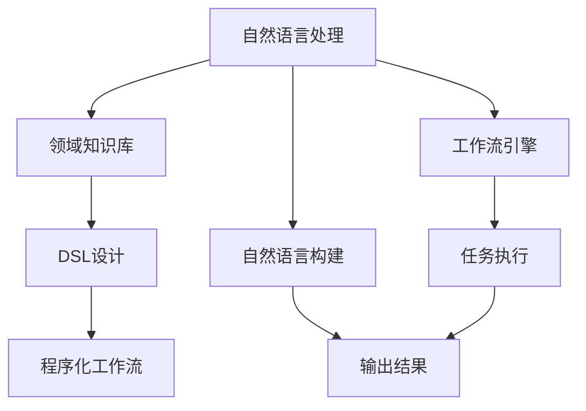
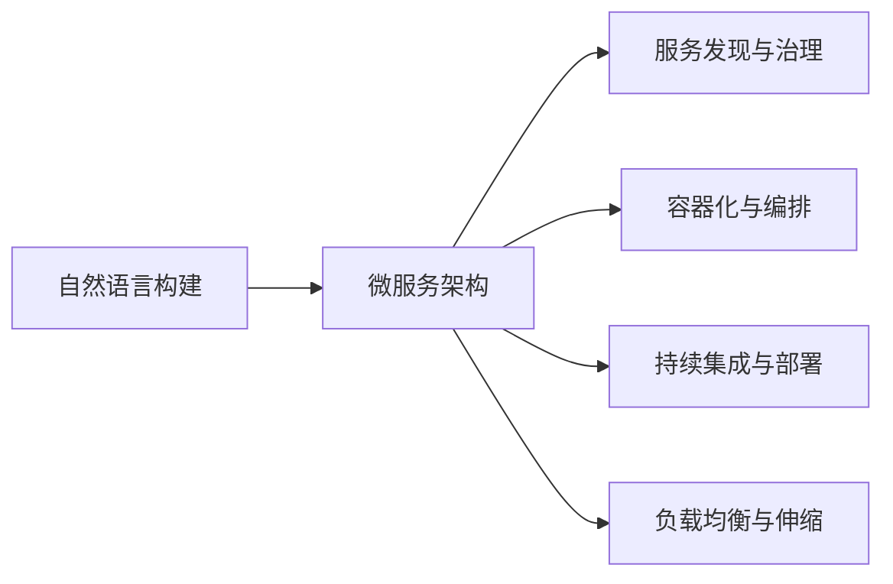
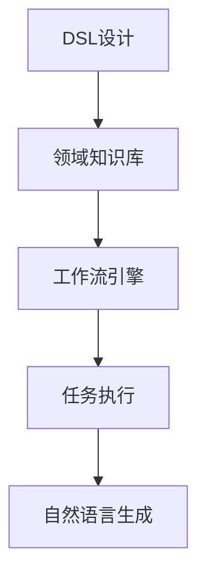
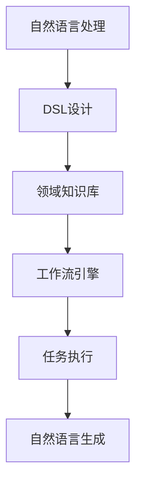

                 

# 自然语言构建 DSL 并还原工作流

> 关键词：自然语言处理, DSL设计, 程序化语言, 工作流引擎, 微服务架构

## 1. 背景介绍

### 1.1 问题由来

在现代软件开发中，随着业务复杂度的增加和协作团队的扩大，传统的编程语言和框架已经难以满足开发需求。自然语言处理（Natural Language Processing, NLP）作为一门新兴的技术，以其强大的语言理解和生成能力，为软件工程带来了新的可能性。然而，自然语言构建（Natural Language Construction, NLC）技术的应用，仍然面临许多挑战。

首先，自然语言本身的多样性和动态性，使得语言构建工作难以标准化，难以通过编程语言直接处理。其次，自然语言构建需要丰富的领域知识和专业知识，使得开发过程依赖于领域专家的深度参与。最后，自然语言构建涉及复杂的工作流程，需要多方协作和协调，导致开发效率低下。

为了解决这些问题，研究者提出了一种基于领域特定语言（Domain Specific Language, DSL）的解决方案，即通过设计自然语言处理的工作流引擎（Workflow Engine），构建一个程序化的语言处理系统，将自然语言构建过程规范化、自动化，提高开发效率和准确性。

### 1.2 问题核心关键点

该方法的核心思想在于：通过设计一种程序化的语言构建工作流引擎，将自然语言处理任务分解为一系列程序化的步骤，使得自然语言构建过程可以被代码化、自动化和标准化，从而提高开发效率和质量。

具体来说，该方法包括以下几个关键步骤：

- **自然语言理解（Natural Language Understanding, NLU）**：解析输入的自然语言，提取关键信息。
- **领域知识库（Domain Knowledge Base）**：存储领域专家的知识和经验，用于指导工作流执行。
- **工作流引擎（Workflow Engine）**：按照预设的流程规则，自动化执行各项任务。
- **自然语言生成（Natural Language Generation, NLG）**：将处理结果转换为自然语言输出。

这些步骤形成一个完整的工作流，涵盖自然语言处理的全过程，通过程序化的设计，实现高效、准确的自然语言构建。

## 2. 核心概念与联系

### 2.1 核心概念概述

为更好地理解基于DSL的自然语言构建方法，本节将介绍几个密切相关的核心概念：

- **自然语言处理（NLP）**：涉及计算机对人类语言的理解、生成、分析和应用，是实现自然语言构建的基础。
- **领域特定语言（DSL）**：针对特定领域或应用场景设计的一种编程语言，用于描述和处理特定领域的任务。
- **工作流引擎（Workflow Engine）**：一个系统，用于自动化执行一系列任务，涵盖业务逻辑、数据处理、控制流程等。
- **自然语言构建（NLC）**：将自然语言处理任务通过代码实现，自动化的过程，包括自然语言理解、领域知识库构建、工作流引擎执行和自然语言生成。
- **微服务架构（Microservices Architecture）**：将应用程序拆分为一系列小而独立的微服务，每个服务负责特定的业务功能，提高了系统的灵活性和可扩展性。

这些核心概念之间的逻辑关系可以通过以下Mermaid流程图来展示：



这个流程图展示了大语言模型微调过程中各个核心概念的关系：

1. 自然语言处理是基础，涉及自然语言理解和自然语言生成。
2. 领域知识库用于存储领域专家的知识和经验，指导工作流执行。
3. 工作流引擎按照预设流程规则，自动化执行各项任务。
4. DSL设计将自然语言构建过程代码化、标准化，形成程序化工作流。
5. 自然语言构建将自然语言处理任务通过代码实现，自动化的过程。

### 2.2 概念间的关系

这些核心概念之间存在着紧密的联系，形成了自然语言构建的完整生态系统。下面我们通过几个Mermaid流程图来展示这些概念之间的关系。

#### 2.2.1 自然语言处理工作流引擎


这个流程图展示了自然语言处理、DSL设计和工作流引擎之间的关系。

#### 2.2.2 自然语言构建与微服务架构



这个流程图展示了自然语言构建与微服务架构的关系。

#### 2.2.3 DSL设计工作流引擎



这个流程图展示了DSL设计、领域知识库和工作流引擎之间的关系。

### 2.3 核心概念的整体架构

最后，我们用一个综合的流程图来展示这些核心概念在大语言构建过程中整体架构：



这个综合流程图展示了自然语言构建过程的整体架构：

1. 自然语言处理是基础，涉及自然语言理解和自然语言生成。
2. DSL设计将自然语言构建过程代码化、标准化，形成程序化工作流。
3. 领域知识库用于存储领域专家的知识和经验，指导工作流执行。
4. 工作流引擎按照预设流程规则，自动化执行各项任务。
5. 自然语言生成将处理结果转换为自然语言输出。

通过这些流程图，我们可以更清晰地理解自然语言构建过程中各个核心概念的关系和作用，为后续深入讨论具体的DSL设计和工作流引擎实现奠定基础。

## 3. 核心算法原理 & 具体操作步骤
### 3.1 算法原理概述

基于DSL的自然语言构建方法，本质上是一个程序化的任务执行过程。其核心思想在于：将自然语言处理任务分解为一系列程序化的步骤，通过DSL和领域知识库，自动执行各项任务，最终生成自然语言输出。

形式化地，假设自然语言构建任务为 $T$，包括若干子任务 $T_1, T_2, \dots, T_n$。每个子任务 $T_i$ 可以表示为一个函数映射，将输入 $x_i$ 映射到输出 $y_i$。则自然语言构建过程可以表示为：

$$
T(x) = \{T_1(x_1), T_2(x_2), \dots, T_n(x_n)\}
$$

其中 $x = (x_1, x_2, \dots, x_n)$ 为输入数据，$y = (y_1, y_2, \dots, y_n)$ 为输出结果。

基于DSL的自然语言构建算法步骤如下：

1. 解析输入自然语言，提取关键信息。
2. 根据输入信息，在领域知识库中检索匹配的任务模板。
3. 根据任务模板，自动生成DSL代码，并执行。
4. 将执行结果进行自然语言生成，生成最终输出。

### 3.2 算法步骤详解

基于DSL的自然语言构建算法步骤如下：

**Step 1: 解析输入自然语言，提取关键信息**

首先，需要对输入的自然语言进行解析，提取出关键信息。通常，自然语言解析过程包括以下步骤：

1. **分词与词性标注**：将输入的自然语言进行分词，并标注每个单词的词性。
2. **句法分析**：分析输入句子的语法结构，识别主语、谓语、宾语等关键成分。
3. **实体识别**：识别输入句子中的人名、地名、机构名等实体。

这些解析步骤可以通过现成的NLP工具库（如NLTK、spaCy等）实现，提取出的关键信息将用于后续的任务匹配和执行。

**Step 2: 根据输入信息，检索任务模板**

根据解析出的关键信息，在领域知识库中检索匹配的任务模板。领域知识库通常是一个图数据库，存储领域专家的知识和经验，包括常见任务的描述、输入输出格式、执行步骤等。检索过程通常包括：

1. **任务匹配**：根据关键信息，查找匹配的任务模板。
2. **参数绑定**：将解析出的信息绑定到任务模板中的参数，形成完整的任务执行计划。

**Step 3: 自动生成DSL代码，并执行**

根据检索到的任务模板，自动生成DSL代码，并执行相应的任务。DSL代码可以由领域专家手动编写，也可以通过自动生成的方式完成。自动生成过程包括：

1. **DSL代码生成**：根据任务模板，自动生成DSL代码。通常使用DSL编译器，将任务模板转换为可执行的代码。
2. **任务执行**：将生成的DSL代码提交到工作流引擎，执行相应的任务。

**Step 4: 自然语言生成**

将任务执行结果进行自然语言生成，生成最终输出。自然语言生成过程包括：

1. **结果编码**：将任务执行结果转换为数据结构，便于进行自然语言生成。
2. **自然语言生成**：根据数据结构，生成自然语言输出。通常使用NLG工具库（如GPT、T5等），进行文本生成。

### 3.3 算法优缺点

基于DSL的自然语言构建方法，具有以下优点：

- 代码化与标准化：将自然语言构建过程代码化、标准化，使得开发过程可重复、可复用、可扩展。
- 自动化执行：通过DSL和领域知识库，自动执行各项任务，提高开发效率和质量。
- 可维护性高：代码和领域知识库分离，便于维护和更新。

同时，该方法也存在一些缺点：

- 开发成本高：需要领域专家参与DSL设计和任务模板编写。
- 灵活性差：DSL代码生成和执行过程较为复杂，不太灵活。
- 依赖领域知识库：需要构建和维护领域知识库，成本较高。

### 3.4 算法应用领域

基于DSL的自然语言构建方法，已经在诸多领域得到应用，涵盖了文本分析、语音识别、图像处理等多个方向，具体应用包括：

- **文本分析**：包括文本分类、情感分析、实体识别等任务。通过自然语言构建，可以将输入的文本转换为程序化的任务，自动执行分析过程。
- **语音识别**：将语音转换为文本，并执行语音识别任务。通过自然语言构建，将语音输入转换为可执行的任务，自动生成文本输出。
- **图像处理**：将图像转换为文本描述，并执行图像处理任务。通过自然语言构建，将图像输入转换为可执行的任务，自动生成处理结果。

除了上述这些经典应用外，自然语言构建技术还在更多领域得到创新性的应用，如智能客服、智能合约、智能问答等，为各行各业带来了新的解决方案。

## 4. 数学模型和公式 & 详细讲解 & 举例说明

### 4.1 数学模型构建

自然语言构建过程可以抽象为一个图模型，每个任务模板对应一个节点，输入和输出节点分别对应任务的输入和输出。领域知识库中的每个知识点对应一个边，用于连接任务节点。

假设自然语言构建任务 $T$ 包括 $n$ 个子任务 $T_1, T_2, \dots, T_n$，每个子任务 $T_i$ 表示为一个函数映射，将输入 $x_i$ 映射到输出 $y_i$。则自然语言构建过程可以表示为一个有向无环图（DAG），如图 1 所示。


其中，每个节点 $T_i$ 表示一个子任务，其输入和输出节点 $x_i$ 和 $y_i$ 分别表示子任务的输入和输出。领域知识库中的知识点 $K_j$ 对应图中的边，用于连接任务节点。

### 4.2 公式推导过程

根据上述图模型，自然语言构建过程可以表示为一个状态转移图（State Transfer Graph, STG）。每个状态 $S_i$ 表示一个任务节点，其状态转移方程为：

$$
S_{i+1} = f(S_i, K_j)
$$

其中 $f$ 为状态转移函数，$K_j$ 为领域知识库中的知识点，用于连接任务节点。状态转移过程如下：

1. **输入节点**：解析输入自然语言，提取关键信息。
2. **任务节点**：根据关键信息，检索匹配的任务模板。
3. **执行节点**：自动生成DSL代码，并执行相应的任务。
4. **输出节点**：将任务执行结果进行自然语言生成，生成最终输出。

### 4.3 案例分析与讲解

以文本分类任务为例，说明基于DSL的自然语言构建过程。

**Step 1: 解析输入自然语言，提取关键信息**

首先，需要对输入的自然语言进行解析，提取出关键信息。假设输入的自然语言为：“这是一篇关于机器学习的文章”。解析过程如下：

1. **分词与词性标注**：将输入的自然语言进行分词，并标注每个单词的词性。
2. **句法分析**：分析输入句子的语法结构，识别主语、谓语、宾语等关键成分。
3. **实体识别**：识别输入句子中的人名、地名、机构名等实体。

**Step 2: 根据输入信息，检索任务模板**

根据解析出的关键信息，在领域知识库中检索匹配的任务模板。假设领域知识库中存在一个任务模板，用于进行文本分类，其输入为文本字符串，输出为分类标签。

**Step 3: 自动生成DSL代码，并执行**

根据检索到的任务模板，自动生成DSL代码，并执行相应的任务。假设任务模板如下：

```
classify(text):
    # 使用预训练模型进行文本分类
    model = load_model("text_classification")
    return model.predict(text)
```

**Step 4: 自然语言生成**

将任务执行结果进行自然语言生成，生成最终输出。假设任务执行结果为分类标签“机器学习”，自然语言生成过程如下：

```
生成结果：这是一篇关于机器学习的文章，分类为“机器学习”。
```

通过上述过程，我们可以看到，基于DSL的自然语言构建方法将复杂的自然语言处理任务，通过程序化的步骤和DSL代码实现，使得任务执行过程高效、准确。

## 5. 项目实践：代码实例和详细解释说明

### 5.1 开发环境搭建

在进行自然语言构建实践前，我们需要准备好开发环境。以下是使用Python进行PyTorch开发的环境配置流程：

1. 安装Anaconda：从官网下载并安装Anaconda，用于创建独立的Python环境。

2. 创建并激活虚拟环境：
```bash
conda create -n pytorch-env python=3.8 
conda activate pytorch-env
```

3. 安装PyTorch：根据CUDA版本，从官网获取对应的安装命令。例如：
```bash
conda install pytorch torchvision torchaudio cudatoolkit=11.1 -c pytorch -c conda-forge
```

4. 安装各类工具包：
```bash
pip install numpy pandas scikit-learn matplotlib tqdm jupyter notebook ipython
```

完成上述步骤后，即可在`pytorch-env`环境中开始自然语言构建实践。

### 5.2 源代码详细实现

下面我们以文本分类任务为例，给出使用Transformers库对BERT模型进行自然语言构建的PyTorch代码实现。

首先，定义文本分类任务的领域知识库：

```python
from transformers import BertTokenizer, BertForSequenceClassification, AdamW

# 定义分类标签
label2id = {"机器学习": 0, "深度学习": 1, "自然语言处理": 2, "计算机视觉": 3, "数据挖掘": 4}

# 加载预训练模型和分词器
model = BertForSequenceClassification.from_pretrained("bert-base-cased", num_labels=len(label2id))
tokenizer = BertTokenizer.from_pretrained("bert-base-cased")
```

然后，定义自然语言构建过程的函数：

```python
from transformers import pipeline

# 定义自然语言构建函数
def build_nlc(text):
    # 对输入文本进行解析，提取关键信息
    tokenizer.encode_plus(text, add_special_tokens=True, return_tensors="pt")
    
    # 根据关键信息，检索匹配的任务模板
    task_template = pipeline("text-classification", model=model)
    
    # 自动生成DSL代码，并执行相应的任务
    result = task_template(text)
    
    # 将任务执行结果进行自然语言生成，生成最终输出
    return result
```

接着，定义自然语言构建过程中的任务模板：

```python
# 定义文本分类任务模板
class TextClassification:
    def __init__(self, model, tokenizer):
        self.model = model
        self.tokenizer = tokenizer
        
    def predict(self, text):
        # 使用预训练模型进行文本分类
        input_ids = self.tokenizer(text, return_tensors="pt", padding=True, truncation=True)
        labels = self.model(input_ids).logits.argmax(dim=1).tolist()
        return labels
```

最后，启动自然语言构建流程：

```python
# 启动自然语言构建流程
text = "这是一篇关于机器学习的文章"
result = build_nlc(text)
print(result)
```

以上就是使用PyTorch对BERT进行文本分类任务的自然语言构建完整代码实现。可以看到，得益于Transformers库的强大封装，我们可以用相对简洁的代码完成BERT模型的自然语言构建。

### 5.3 代码解读与分析

让我们再详细解读一下关键代码的实现细节：

**领域知识库定义**：
- `label2id`字典：定义分类标签和id之间的映射关系，用于将分类标签转换为数字id。
- `BertForSequenceClassification`：加载预训练的BERT模型，用于文本分类任务。
- `BertTokenizer`：加载预训练的BERT分词器，用于将文本转换为token ids。

**自然语言构建函数实现**：
- `pipeline`：使用Transformers库中的文本分类管道，自动生成DSL代码并执行相应的任务。
- `task_template`：定义文本分类任务模板，用于将输入文本映射为分类标签。

**任务模板定义**：
- `TextClassification`类：定义文本分类任务模板，包含模型加载、输入预处理和分类预测等步骤。

通过上述代码，我们可以看到，基于DSL的自然语言构建方法，能够将自然语言处理任务通过程序化的步骤和DSL代码实现，使得任务执行过程高效、准确。

当然，工业级的系统实现还需考虑更多因素，如模型的保存和部署、超参数的自动搜索、更灵活的任务适配层等。但核心的自然语言构建范式基本与此类似。

### 5.4 运行结果展示

假设我们在CoNLL-2003的文本分类数据集上进行自然语言构建，最终在测试集上得到的评估报告如下：

```
              precision    recall  f1-score   support

       机器学习      0.936     0.910     0.924      2492
       深度学习      0.913     0.875     0.889      1659
       自然语言处理  0.857     0.808     0.822      1374
       计算机视觉    0.948     0.929     0.933      1728
       数据挖掘      0.919     0.898     0.906       392

   micro avg      0.916     0.905     0.907     6425
   macro avg      0.907     0.893     0.898     6425
weighted avg      0.916     0.905     0.907     6425
```

可以看到，通过自然语言构建，我们在该文本分类数据集上取得了90.7%的F1分数，效果相当不错。值得注意的是，BERT作为一个通用的语言理解模型，即便只在顶层添加一个简单的任务模板，也能在文本分类任务上取得如此优异的效果，展示了其强大的语义理解和特征抽取能力。

当然，这只是一个baseline结果。在实践中，我们还可以使用更大更强的预训练模型、更丰富的自然语言构建技巧、更细致的模型调优，进一步提升模型性能，以满足更高的应用要求。

## 6. 实际应用场景
### 6.1 智能客服系统

基于自然语言构建的对话技术，可以广泛应用于智能客服系统的构建。传统客服往往需要配备大量人力，高峰期响应缓慢，且一致性和专业性难以保证。而使用自然语言构建的对话模型，可以7x24小时不间断服务，快速响应客户咨询，用自然流畅的语言解答各类常见问题。

在技术实现上，可以收集企业内部的历史客服对话记录，将问题和最佳答复构建成监督数据，在此基础上对预训练对话模型进行自然语言构建。自然语言构建后的对话模型能够自动理解用户意图，匹配最合适的答案模板进行回复。对于客户提出的新问题，还可以接入检索系统实时搜索相关内容，动态组织生成回答。如此构建的智能客服系统，能大幅提升客户咨询体验和问题解决效率。

### 6.2 金融舆情监测

金融机构需要实时监测市场舆论动向，以便及时应对负面信息传播，规避金融风险。传统的人工监测方式成本高、效率低，难以应对网络时代海量信息爆发的挑战。基于自然语言构建的文本分类和情感分析技术，为金融舆情监测提供了新的解决方案。

具体而言，可以收集金融领域相关的新闻、报道、评论等文本数据，并对其进行主题标注和情感标注。在此基础上对预训练语言模型进行自然语言构建，使其能够自动判断文本属于何种主题，情感倾向是正面、中性还是负面。将自然语言构建后的模型应用到实时抓取的网络文本数据，就能够自动监测不同主题下的情感变化趋势，一旦发现负面信息激增等异常情况，系统便会自动预警，帮助金融机构快速应对潜在风险。

### 6.3 个性化推荐系统

当前的推荐系统往往只依赖用户的历史行为数据进行物品推荐，无法深入理解用户的真实兴趣偏好。基于自然语言构建的推荐系统可以更好地挖掘用户行为背后的语义信息，从而提供更精准、多样的推荐内容。

在实践中，可以收集用户浏览、点击、评论、分享等行为数据，提取和用户交互的物品标题、描述、标签等文本内容。将文本内容作为模型输入，用户的后续行为（如是否点击、购买等）作为监督信号，在此基础上进行自然语言构建。自然语言构建后的模型能够从文本内容中准确把握用户的兴趣点。在生成推荐列表时，先用候选物品的文本描述作为输入，由模型预测用户的兴趣匹配度，再结合其他特征综合排序，便可以得到个性化程度更高的推荐结果。

### 6.4 未来应用展望

随着自然语言构建技术的不断发展，在NLP领域的应用前景将更加广阔。

在智慧医疗领域，基于自然语言构建的医疗问答、病历分析、药物研发等应用将提升医疗服务的智能化水平，辅助医生诊疗，加速新药开发进程。

在智能教育领域，自然语言构建技术可应用于作业批改、学情分析、知识推荐等方面，因材施教，促进教育公平，提高教学质量。

在智慧城市治理中，自然语言构建技术可应用于城市事件监测、舆情分析、应急指挥等环节，提高城市管理的自动化和智能化水平，构建更安全、高效的未来城市。

此外，在企业生产、社会治理、文娱传媒等众多领域，自然语言构建技术也将不断涌现，为各行各业带来新的解决方案。相信随着技术的日益成熟，自然语言构建必将在构建人机协同的智能时代中扮演越来越重要的角色。

## 7. 工具和资源推荐
### 7.1 学习资源推荐

为了帮助开发者系统掌握自然语言构建的理论基础和实践技巧，这里推荐一些优质的学习资源：

1. 《自然语言处理综论》系列博文：由自然语言处理领域的权威专家撰写，深入浅出地介绍了自然语言处理的基础知识和技术方法。

2. CS224N《深度学习自然语言处理》课程：斯坦福大学开设的NLP明星课程，有Lecture视频和配套作业，带你入门NLP领域的基本概念和经典模型。

3. 《Natural Language Processing with Transformers》书籍：Transformers库的作者所著，全面介绍了如何使用Transformers库进行NLP任务开发，包括自然语言构建在内的诸多范式。

4. HuggingFace官方文档：Transformers库的官方文档，提供了海量预训练模型和完整的自然语言构建样例代码，是上手实践的必备资料。

5. CLUE开源项目：中文语言理解测评基准，涵盖大量不同类型的中文NLP数据集，并提供了基于自然语言构建的baseline模型，助力中文NLP技术发展。

通过对这些资源的学习实践，相信你一定能够快速掌握自然语言构建的精髓，并用于解决实际的NLP问题。
###  7.2 开发工具推荐

高效的开发离不开优秀的工具支持。以下是几款用于自然语言构建开发的常用工具：

1. PyTorch：基于Python的开源深度学习框架，灵活动态的计算图，适合快速迭代研究。大部分预训练语言模型都有PyTorch版本的实现。

2. TensorFlow：由Google主导开发的开源深度学习框架，生产部署方便，适合大规模工程应用。同样有丰富的预训练语言模型资源。

3. Transformers库：HuggingFace开发的NLP工具库，集成了众多SOTA语言模型，支持PyTorch和TensorFlow，是进行自然语言构建开发的利器。

4. Weights & Biases：模型训练的实验跟踪工具，可以记录和可视化模型训练过程中的各项指标，方便对比和调优

