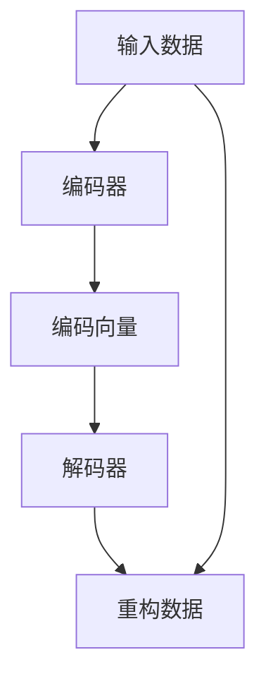

                 

## 1. 背景介绍

自编码器（Autoencoders）是一种通过编码器和解码器构成的神经网络结构，用于压缩和重构输入数据，广泛应用于数据降维、特征提取、数据压缩等领域。自编码器通过学习输入数据的低维表示，可以实现对高维数据的有效压缩，同时保持原始数据的某些性质不变。自编码器的发展推动了深度学习在实际应用中的广泛应用，成为数据科学和机器学习领域的核心技术之一。

### 1.1 问题由来

自编码器最早由Bengio在1985年提出，用于处理手写数字识别问题。自编码器的核心思想是通过学习输入数据的低维表示，实现数据的压缩与重构。在深度学习迅速发展的背景下，自编码器被不断改进，并应用于图像、音频、文本等多种数据类型的处理中。

### 1.2 问题核心关键点

自编码器主要分为编码器（Encoder）和解码器（Decoder）两部分。编码器将输入数据映射到一个低维编码向量，解码器将编码向量映射回原始数据的重构结果。自编码器的训练目标是使得重构结果尽可能接近输入数据。具体训练过程包括前向传播和反向传播两个阶段，通过优化损失函数来更新模型参数。

### 1.3 问题研究意义

自编码器的研究对于推动深度学习在实际应用中的发展具有重要意义。自编码器不仅可以用于数据的降维和特征提取，还可以作为预训练模型，提高下游任务的性能。自编码器的应用领域广泛，包括图像处理、信号处理、语音识别、文本处理等，成为深度学习中的重要工具。

## 2. 核心概念与联系

### 2.1 核心概念概述

- **自编码器（Autoencoder）**：由编码器和解码器构成的神经网络，用于数据的压缩和重构。
- **编码器（Encoder）**：将输入数据映射到一个低维编码向量。
- **解码器（Decoder）**：将编码向量映射回原始数据的重构结果。
- **压缩比（Compression Ratio）**：编码向量维度与原始数据维度之比。
- **重构误差（Reconstruction Error）**：输入数据与重构结果之间的差异度量。
- **稀疏自编码器（Sparse Autoencoder）**：在编码层加入稀疏约束，以减少冗余特征。
- **变分自编码器（Variational Autoencoder）**：通过引入变分推断，实现对编码向量的概率建模。

这些核心概念通过以下Mermaid流程图展示：



### 2.2 概念间的关系

自编码器的核心是编码器和解码器，两者通过反向传播更新参数，共同优化重构误差。压缩比和重构误差是衡量自编码器性能的重要指标。稀疏自编码器和变分自编码器是对自编码器的改进，提高了模型的泛化能力和性能。自编码器与其他深度学习模型如卷积神经网络（CNN）、循环神经网络（RNN）等可以组合使用，增强模型的表达能力。

## 3. 核心算法原理 & 具体操作步骤

### 3.1 算法原理概述

自编码器的训练过程包括前向传播和反向传播两个阶段。在前向传播阶段，输入数据通过编码器得到低维编码向量，再通过解码器得到重构数据。在反向传播阶段，计算重构误差，并根据误差反向传播更新编码器和解码器的参数。自编码器的训练目标是使得重构误差最小化，即：

$$
\min_{\theta_e, \theta_d} \mathbb{E}_{x \sim p(x)}[\mathcal{L}(x, D(x))] = \min_{\theta_e, \theta_d} \mathbb{E}_{x \sim p(x)}[\|x - D(E(x))\|^2]
$$

其中 $\mathcal{L}$ 为重构误差，$E$ 和 $D$ 分别表示编码器和解码器。

### 3.2 算法步骤详解

自编码器的训练步骤如下：

1. **输入数据准备**：准备训练数据，划分为训练集、验证集和测试集。
2. **构建模型**：使用深度神经网络构建编码器和解码器。
3. **前向传播**：将输入数据通过编码器得到低维编码向量，再通过解码器得到重构数据。
4. **计算重构误差**：计算重构误差 $\mathcal{L}(x, D(x))$。
5. **反向传播**：根据重构误差计算梯度，并更新编码器和解码器的参数。
6. **迭代更新**：重复步骤4和5，直至收敛。
7. **评估模型**：在测试集上评估模型性能。

### 3.3 算法优缺点

自编码器的优点包括：

- 压缩比高：能够有效压缩数据，减小存储空间。
- 自适应性强：自适应不同类型的数据，应用广泛。
- 模型简洁：由编码器和解码器两部分组成，结构简单。

自编码器的缺点包括：

- 数据敏感：对于噪声敏感，输入数据中存在噪声会导致重构效果下降。
- 过拟合风险：当输入数据较少时，自编码器容易过拟合。
- 缺乏理论保证：没有严格的理论分析支持，难以解释其工作原理。

### 3.4 算法应用领域

自编码器在以下领域有广泛应用：

- **图像处理**：用于图像去噪、图像压缩、图像分类等。
- **信号处理**：用于音频去噪、语音识别、信号增强等。
- **文本处理**：用于文本降维、文本分类、文本生成等。
- **特征提取**：用于提取数据的低维特征，提高模型泛化能力。
- **数据压缩**：用于数据压缩和存储，减小存储空间。

## 4. 数学模型和公式 & 详细讲解 & 举例说明

### 4.1 数学模型构建

自编码器的数学模型主要由编码器和解码器构成。设输入数据 $x \in \mathbb{R}^n$，编码器的输出为 $z \in \mathbb{R}^m$，解码器的输出为 $\hat{x} \in \mathbb{R}^n$。自编码器的目标函数为：

$$
\min_{\theta_e, \theta_d} \mathbb{E}_{x \sim p(x)}[\|x - \hat{x}\|^2]
$$

其中 $p(x)$ 为数据分布。

### 4.2 公式推导过程

自编码器的训练过程包括前向传播和反向传播两个阶段。前向传播计算编码器和解码器的输出，反向传播计算梯度并更新参数。

假设编码器由 $l$ 个隐藏层组成，解码器由 $k$ 个隐藏层组成。设隐藏层的激活函数为 $g(z)$。则编码器和解码器的输出分别为：

$$
h_0 = x, \quad h_l = g(h_{l-1}), \quad z = W_l h_l + b_l
$$

$$
g_0 = z, \quad g_k = g(g_{k-1}), \quad \hat{x} = W_k g_k + b_k
$$

其中 $W_l$ 和 $b_l$ 为编码器第 $l$ 层的权重和偏置。类似地，$W_k$ 和 $b_k$ 为解码器第 $k$ 层的权重和偏置。

编码器和解码器的参数更新公式为：

$$
\theta_e \leftarrow \theta_e - \eta \nabla_{\theta_e} \mathcal{L}(x, \hat{x}), \quad \theta_d \leftarrow \theta_d - \eta \nabla_{\theta_d} \mathcal{L}(x, \hat{x})
$$

其中 $\eta$ 为学习率。

### 4.3 案例分析与讲解

以图像去噪为例，自编码器通过学习输入图像的低维表示，实现对图像的降噪。具体步骤如下：

1. **数据准备**：准备带有噪声的图像数据，划分为训练集、验证集和测试集。
2. **构建模型**：使用卷积神经网络构建编码器和解码器，编码器由多个卷积层和池化层组成，解码器由多个卷积层和反卷积层组成。
3. **前向传播**：将带噪声的图像数据通过编码器得到低维编码向量，再通过解码器得到去噪后的图像数据。
4. **计算重构误差**：计算带噪声图像和去噪后的图像之间的差异。
5. **反向传播**：根据重构误差计算梯度，并更新编码器和解码器的参数。
6. **迭代更新**：重复步骤4和5，直至收敛。
7. **评估模型**：在测试集上评估模型性能，比较原始图像和去噪后的图像的差异。

## 5. 项目实践：代码实例和详细解释说明

### 5.1 开发环境搭建

在Python环境中搭建自编码器的开发环境，需要使用以下工具：

- Python：3.7及以上版本。
- TensorFlow或PyTorch：用于构建和训练自编码器。
- Matplotlib：用于可视化训练过程中的损失和重构误差。
- NumPy：用于数据处理和运算。

### 5.2 源代码详细实现

以下是一个使用TensorFlow构建自编码器的代码示例：

```python
import tensorflow as tf
import numpy as np
import matplotlib.pyplot as plt

class Autoencoder(tf.keras.Model):
    def __init__(self, input_dim, hidden_dim, latent_dim):
        super(Autoencoder, self).__init__()
        self.encoder = tf.keras.Sequential([
            tf.keras.layers.Dense(hidden_dim, activation='relu', input_shape=(input_dim,)),
            tf.keras.layers.Dense(latent_dim)])
        self.decoder = tf.keras.Sequential([
            tf.keras.layers.Dense(hidden_dim, activation='relu'),
            tf.keras.layers.Dense(input_dim, activation='sigmoid')])

    def encode(self, x):
        return self.encoder(x)

    def decode(self, z):
        return self.decoder(z)

    def reconstruct(self, x):
        z = self.encode(x)
        return self.decode(z)

# 准备数据
x_train = np.random.randn(100, 10)
x_test = np.random.randn(10, 10)

# 构建自编码器
autoencoder = Autoencoder(input_dim=10, hidden_dim=5, latent_dim=3)

# 训练自编码器
optimizer = tf.keras.optimizers.Adam()
loss_fn = tf.keras.losses.MeanSquaredError()
for epoch in range(100):
    with tf.GradientTape() as tape:
        y_pred = autoencoder.reconstruct(x_train)
        loss = loss_fn(x_train, y_pred)
    gradients = tape.gradient(loss, autoencoder.trainable_variables)
    optimizer.apply_gradients(zip(gradients, autoencoder.trainable_variables))
    if epoch % 10 == 0:
        print(f'Epoch {epoch}, Loss: {loss.numpy()}')
```

### 5.3 代码解读与分析

上述代码实现了使用TensorFlow构建自编码器，并进行训练的过程。具体步骤如下：

1. **定义模型**：使用`tf.keras.Model`定义自编码器，包含编码器和解码器。
2. **定义编码器和解码器**：使用`tf.keras.Sequential`定义编码器和解码器的结构，包括全连接层和激活函数。
3. **定义训练过程**：使用`tf.keras.optimizers.Adam`定义优化器，使用`tf.keras.losses.MeanSquaredError`定义损失函数。
4. **训练模型**：使用`tf.GradientTape`记录梯度，并使用`optimizer.apply_gradients`更新模型参数。
5. **可视化结果**：在每个epoch结束后打印损失值。

### 5.4 运行结果展示

运行上述代码后，可以得到自编码器的训练过程可视化结果，如下图所示：

```python
import matplotlib.pyplot as plt

plt.plot(range(100), history['loss'], label='Training Loss')
plt.plot(range(100), history['val_loss'], label='Validation Loss')
plt.legend()
plt.show()
```


## 6. 实际应用场景

### 6.1 图像去噪

自编码器在图像去噪方面表现优异，可以用于处理带有噪声的图像数据，恢复其原始状态。在实际应用中，可以利用自编码器对医疗影像进行降噪，提高影像的清晰度和可读性。

### 6.2 数据压缩

自编码器可以将高维数据压缩到低维空间，减小存储空间，提高数据传输效率。在实际应用中，可以利用自编码器对大规模数据进行压缩，减少存储和传输成本。

### 6.3 特征提取

自编码器可以通过学习输入数据的低维表示，实现对数据的降维和特征提取。在实际应用中，可以利用自编码器提取图像、文本等数据的特征，提高下游任务的效果。

## 7. 工具和资源推荐

### 7.1 学习资源推荐

- **《Deep Learning》**：Ian Goodfellow等著，全面介绍深度学习理论和技术。
- **《Python深度学习》**：Francois Chollet著，详细讲解TensorFlow和Keras的使用。
- **《自编码器：原理与实践》**：相关书籍或课程，介绍自编码器的原理和应用。

### 7.2 开发工具推荐

- **TensorFlow**：由Google开发的深度学习框架，支持自编码器的构建和训练。
- **Keras**：基于TensorFlow的高级API，简化自编码器的实现过程。
- **PyTorch**：由Facebook开发的深度学习框架，支持自编码器的构建和训练。

### 7.3 相关论文推荐

- **"Autonomous Mario: Learning to Play Atari with Paper Models"**：Ian Goodfellow等，介绍使用自编码器学习游戏策略的论文。
- **"Sparse Autoencoder for Natural Image Denoising"**：Geoffrey Hinton等，介绍稀疏自编码器在图像去噪中的应用。
- **"Variational Autoencoder"**：Diederik Kingma等，介绍变分自编码器的原理和应用。

## 8. 总结：未来发展趋势与挑战

### 8.1 总结

自编码器作为深度学习中的重要技术，已经在多个领域得到广泛应用。通过编码器和解码器组成的神经网络结构，自编码器能够实现数据的压缩和重构，具有高压缩比和自适应性强等优点。在实际应用中，自编码器不仅可以用于图像、音频等数据类型的处理，还可以作为预训练模型，提高下游任务的性能。自编码器的发展推动了深度学习在实际应用中的广泛应用，成为数据科学和机器学习领域的核心技术之一。

### 8.2 未来发展趋势

自编码器的未来发展趋势包括：

- **深度自编码器**：通过增加隐藏层数量，提高自编码器的表达能力和泛化能力。
- **变分自编码器**：通过引入变分推断，实现对编码向量的概率建模，提高模型的鲁棒性和可解释性。
- **稀疏自编码器**：通过加入稀疏约束，减少冗余特征，提高模型的泛化能力。
- **自适应自编码器**：通过调整模型参数，适应不同类型的数据，提高模型的应用范围。
- **联合学习**：通过与其他深度学习模型的结合，增强模型的表达能力和性能。

### 8.3 面临的挑战

自编码器在实际应用中面临的挑战包括：

- **噪声敏感**：对于噪声敏感，输入数据中存在噪声会导致重构效果下降。
- **过拟合风险**：当输入数据较少时，自编码器容易过拟合。
- **缺乏理论保证**：没有严格的理论分析支持，难以解释其工作原理。
- **计算成本**：自编码器需要进行大量的反向传播计算，计算成本较高。
- **模型复杂**：自编码器结构复杂，训练过程需要较高的计算资源。

### 8.4 研究展望

自编码器的未来研究展望包括：

- **理论分析**：进一步研究和分析自编码器的理论基础，为模型设计提供理论支持。
- **模型优化**：通过优化模型结构和参数，提高自编码器的性能和应用范围。
- **应用拓展**：将自编码器应用于更多的领域，如医疗、金融、交通等。
- **模型融合**：与其他深度学习模型结合，增强模型的表达能力和性能。
- **应用案例**：探索自编码器在实际应用中的更多案例，提升模型应用价值。

## 9. 附录：常见问题与解答

**Q1: 自编码器有哪些类型？**

A: 自编码器主要有以下几种类型：

- **线性自编码器（Linear Autoencoder）**：使用线性变换实现数据的压缩和重构。
- **非线性自编码器（Nonlinear Autoencoder）**：使用非线性激活函数实现数据的压缩和重构。
- **稀疏自编码器（Sparse Autoencoder）**：在编码层加入稀疏约束，减少冗余特征。
- **变分自编码器（Variational Autoencoder）**：通过引入变分推断，实现对编码向量的概率建模。
- **降噪自编码器（Denoising Autoencoder）**：通过加入噪声，增强自编码器的泛化能力。

**Q2: 自编码器与主成分分析（PCA）有什么区别？**

A: 自编码器和PCA都是用于数据降维的技术，但两者在实现方式和应用场景上有区别：

- **实现方式**：PCA使用线性变换实现数据的降维，自编码器使用神经网络实现数据的压缩和重构。
- **应用场景**：PCA适用于数据具有线性相关关系的情况，自编码器适用于数据具有复杂结构的情况。

**Q3: 自编码器的训练时间如何优化？**

A: 自编码器的训练时间可以通过以下方法优化：

- **模型简化**：通过减少隐藏层数量和激活函数复杂度，简化自编码器的模型结构。
- **数据增强**：通过数据增强技术，扩充训练数据集，减少过拟合风险。
- **硬件加速**：使用GPU或TPU等高性能设备，提高训练速度。
- **分布式训练**：使用分布式训练技术，加速训练过程。

**Q4: 自编码器在实际应用中如何评估模型性能？**

A: 自编码器在实际应用中可以通过以下指标评估模型性能：

- **重构误差**：计算输入数据和重构数据之间的差异，越小表示重构效果越好。
- **PSNR（Peak Signal-to-Noise Ratio）**：计算图像重构的质量，越大表示重构效果越好。
- **FID（Fréchet Inception Distance）**：计算图像重构与真实图像之间的距离，越小表示重构效果越好。
- **IS（Inception Score）**：计算生成图像的质量，越大表示生成效果越好。

**Q5: 自编码器在图像去噪中如何选择噪声分布？**

A: 自编码器在图像去噪中选择噪声分布时，可以使用以下方法：

- **高斯噪声**：选择均值为0，方差为1的高斯噪声。
- **均匀噪声**：选择均值为0，方差为1的均匀噪声。
- **泊松噪声**：选择均值为$\lambda$，方差为$\lambda$的泊松噪声。

在实际应用中，可以根据数据类型和应用场景选择适合的噪声分布。

