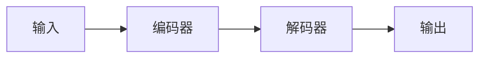

                 

# 自编码器(Autoencoders) - 原理与代码实例讲解

> 关键词：自编码器,特征学习,降维,深度学习,稀疏编码,图像处理,代码实现

## 1. 背景介绍

自编码器(Autoencoder)是一种特殊类型的神经网络，旨在通过学习数据的低维表示进行特征提取和降维。自编码器可以应用于图像处理、信号处理、数据压缩等多个领域，以其卓越的特征提取能力和强大的降维性能，受到广泛关注。

自编码器的基本思想是：通过一个高维输入映射到一个低维编码表示，再通过一个解码器将该低维表示还原为原始输入，整个自编码器模型可以被看作是一个包含两个子网络的编码-解码系统，如下图所示：



其中，B为编码器，将高维输入映射为低维编码向量；C为解码器，将低维编码向量还原为高维输出。理想情况下，输出应尽可能接近原始输入。

自编码器最早由Hinton于1986年提出，用于图像压缩。在随后的几十年中，自编码器被不断改进和扩展，成为了深度学习中最为重要的基础技术之一。本文将详细介绍自编码器的基本原理、算法步骤以及代码实现，并结合实际应用场景进行讲解。

## 2. 核心概念与联系

### 2.1 核心概念概述

为了更好地理解自编码器的原理和应用，下面将介绍几个核心概念：

- **自编码器(Autoencoder)**：一种神经网络模型，用于将高维输入映射为低维编码，并利用解码器将其还原为原始输入。
- **编码器(Encoder)**：自编码器中的子网络，负责将输入映射为低维编码。
- **解码器(Decoder)**：自编码器中的子网络，负责将低维编码还原为原始输入。
- **重构误差(Reconstruction Error)**：自编码器性能的度量指标，通常通过计算输出与输入的误差进行评估。
- **特征学习(Feature Learning)**：自编码器的一个重要应用，通过学习数据中的隐含特征，进行数据的压缩和降维。
- **稀疏编码(Sparse Coding)**：一种特征学习算法，通过稀疏激活方式学习数据的隐含特征。

这些核心概念之间通过自编码器的编码-解码过程紧密联系在一起，共同构成了自编码器的理论基础和应用框架。

### 2.2 核心概念间的关系

自编码器的工作流程如下：

1. 输入数据被送入编码器，通过一系列线性变换和非线性激活函数，映射为低维编码向量。
2. 编码向量被送入解码器，通过相反的线性变换和非线性激活函数，还原为高维输出。
3. 输出与原始输入的误差被计算，作为自编码器性能的度量。

自编码器通过不断调整编码器和解码器的参数，最小化重构误差，逐步学习数据的隐含特征，实现数据的压缩和降维。编码器学习到的低维表示能够反映数据的本质特征，解码器则能够将这些特征还原为原始输入。

## 3. 核心算法原理 & 具体操作步骤

### 3.1 算法原理概述

自编码器的基本算法可以简单地概括为以下几个步骤：

1. **输入层**：接收高维输入数据。
2. **编码层**：通过一系列线性变换和非线性激活函数，将输入映射为低维编码向量。
3. **解码层**：将低维编码向量通过相反的线性变换和非线性激活函数，还原为高维输出。
4. **损失函数**：计算输出与原始输入的误差，作为自编码器性能的度量。
5. **优化器**：最小化重构误差，调整编码器和解码器的参数。

自编码器的核心思想是通过重构误差来度量模型的性能。理想情况下，重构误差应尽可能小，表明解码器能够准确地将低维编码向量还原为原始输入。

### 3.2 算法步骤详解

#### 3.2.1 模型结构设计

自编码器的模型结构可以简单地表示为：

$$
\begin{aligned}
    & \text{输入层} \rightarrow \text{编码层} \rightarrow \text{解码层} \rightarrow \text{输出层} \\
    & y_{i}=f(\sum_{j}W_{ij}x_{j}+b_{i}) \\
    & x_{i}=g(\sum_{j}W_{ij}y_{j}+b_{i}) \\
    & E(x)=\sum_{i}(E_{i})^{2}, \quad D(y)=\sum_{i}(D_{i})^{2} \\
    & \text{总误差}=\alpha E(x)+(1-\alpha) D(y)
\end{aligned}
$$

其中，$x$ 为输入数据，$y$ 为解码器输出，$W$ 为编码器的权重矩阵，$b$ 为偏置向量，$f$ 和 $g$ 分别为编码器和解码器的非线性激活函数，$E(x)$ 和 $D(y)$ 分别为编码器和解码器的重构误差，$\alpha$ 为重构误差权重系数。

#### 3.2.2 训练算法

自编码器的训练算法可以简单地描述为：

1. **初始化权重**：随机初始化编码器和解码器的权重矩阵和偏置向量。
2. **前向传播**：将输入数据送入编码器，计算编码向量，再将其送入解码器，计算输出。
3. **计算损失**：计算输出与输入的重构误差，作为自编码器的性能度量。
4. **反向传播**：通过反向传播算法，计算损失对权重矩阵和偏置向量的梯度。
5. **参数更新**：使用优化器，如梯度下降法，更新编码器和解码器的参数。

自编码器的训练算法通常使用梯度下降等优化算法，最小化重构误差。为了加速收敛，常用的优化器包括Adam、SGD等。

#### 3.2.3 重构误差与特征学习

自编码器的重构误差是衡量模型性能的重要指标。理想情况下，重构误差应尽可能小，表明解码器能够准确地将低维编码向量还原为原始输入。

重构误差可以用于特征学习，通过学习数据的隐含特征，实现数据的压缩和降维。在实际应用中，自编码器通常用于以下任务：

- **图像压缩**：通过学习图像的隐含特征，实现图像的压缩和降维。
- **特征提取**：通过学习数据的隐含特征，提取数据的本质特征。
- **噪声注入**：通过向数据中添加噪声，学习数据的鲁棒性。
- **数据去噪**：通过学习数据的隐含特征，去除数据中的噪声。

### 3.3 算法优缺点

自编码器具有以下优点：

- **特征提取能力**：自编码器能够学习数据的隐含特征，实现数据的降维和压缩。
- **鲁棒性**：自编码器具有较强的鲁棒性，能够适应数据中的噪声和变化。
- **适用性广泛**：自编码器可以应用于图像、信号、文本等多个领域。

但自编码器也存在一些缺点：

- **模型复杂**：自编码器的模型结构较为复杂，训练过程耗时较长。
- **过拟合风险**：自编码器容易出现过拟合，特别是在训练数据较少的情况下。
- **参数敏感**：自编码器的性能对权重矩阵和偏置向量的初始化较为敏感。

### 3.4 算法应用领域

自编码器广泛应用于图像处理、信号处理、数据压缩、特征学习等多个领域。以下是几个典型应用场景：

- **图像压缩**：通过自编码器对图像进行降维和压缩，减少存储空间。
- **图像去噪**：通过自编码器去除图像中的噪声，提高图像质量。
- **特征提取**：通过自编码器学习数据的隐含特征，进行数据的降维和压缩。
- **信号处理**：通过自编码器对信号进行特征提取和降维，提高信号处理的效率。

## 4. 数学模型和公式 & 详细讲解 & 举例说明

### 4.1 数学模型构建

自编码器的数学模型可以表示为：

$$
\begin{aligned}
    & \text{输入层} \rightarrow \text{编码层} \rightarrow \text{解码层} \rightarrow \text{输出层} \\
    & y_{i}=f(\sum_{j}W_{ij}x_{j}+b_{i}) \\
    & x_{i}=g(\sum_{j}W_{ij}y_{j}+b_{i}) \\
    & E(x)=\sum_{i}(E_{i})^{2}, \quad D(y)=\sum_{i}(D_{i})^{2} \\
    & \text{总误差}=\alpha E(x)+(1-\alpha) D(y)
\end{aligned}
$$

其中，$x$ 为输入数据，$y$ 为解码器输出，$W$ 为编码器的权重矩阵，$b$ 为偏置向量，$f$ 和 $g$ 分别为编码器和解码器的非线性激活函数，$E(x)$ 和 $D(y)$ 分别为编码器和解码器的重构误差，$\alpha$ 为重构误差权重系数。

### 4.2 公式推导过程

#### 4.2.1 编码层

编码层的公式可以表示为：

$$
y_{i}=f(\sum_{j}W_{ij}x_{j}+b_{i})
$$

其中，$x_{i}$ 为输入数据的第 $i$ 个特征，$W_{ij}$ 为编码器的权重矩阵，$b_{i}$ 为偏置向量，$f$ 为编码器的非线性激活函数。

#### 4.2.2 解码层

解码层的公式可以表示为：

$$
x_{i}=g(\sum_{j}W_{ij}y_{j}+b_{i})
$$

其中，$y_{i}$ 为解码器的输出，$W_{ij}$ 为解码器的权重矩阵，$b_{i}$ 为偏置向量，$g$ 为解码器的非线性激活函数。

#### 4.2.3 重构误差

重构误差的公式可以表示为：

$$
E(x)=\sum_{i}(E_{i})^{2}, \quad D(y)=\sum_{i}(D_{i})^{2}
$$

其中，$E(x)$ 为编码器的重构误差，$D(y)$ 为解码器的重构误差，$E_{i}$ 和 $D_{i}$ 分别为第 $i$ 个输入和输出的误差。

#### 4.2.4 总误差

总误差的公式可以表示为：

$$
\text{总误差}=\alpha E(x)+(1-\alpha) D(y)
$$

其中，$\alpha$ 为重构误差权重系数。

### 4.3 案例分析与讲解

#### 4.3.1 图像压缩

自编码器可以用于图像压缩，通过学习图像的隐含特征，实现图像的降维和压缩。以下是一个简单的图像压缩例子：

```python
import torch
import torch.nn as nn
import torchvision.transforms as transforms
import torchvision.datasets as datasets

# 定义自编码器模型
class Autoencoder(nn.Module):
    def __init__(self):
        super(Autoencoder, self).__init__()
        self.encoder = nn.Sequential(
            nn.Conv2d(3, 16, kernel_size=3, stride=1, padding=1),
            nn.ReLU(),
            nn.Conv2d(16, 8, kernel_size=3, stride=2, padding=1),
            nn.ReLU(),
            nn.Conv2d(8, 4, kernel_size=3, stride=2, padding=1),
            nn.ReLU(),
            nn.Flatten(),
            nn.Linear(4*4*4, 256)
        )
        self.decoder = nn.Sequential(
            nn.Linear(256, 4*4*4),
            nn.ReLU(),
            nn.Unflatten(1, (8, 8, 4)),
            nn.ConvTranspose2d(4, 8, kernel_size=3, stride=2, padding=1),
            nn.ReLU(),
            nn.ConvTranspose2d(8, 16, kernel_size=3, stride=2, padding=1),
            nn.ReLU(),
            nn.ConvTranspose2d(16, 3, kernel_size=3, stride=1, padding=1),
            nn.Tanh()
        )

    def forward(self, x):
        encoded = self.encoder(x)
        decoded = self.decoder(encoded)
        return encoded, decoded

# 加载数据
transform = transforms.Compose([
    transforms.ToTensor(),
    transforms.Normalize((0.5, 0.5, 0.5), (0.5, 0.5, 0.5))
])
train_dataset = datasets.CIFAR10(root='data', train=True, download=True, transform=transform)
train_loader = torch.utils.data.DataLoader(train_dataset, batch_size=64, shuffle=True)

# 训练模型
device = torch.device('cuda' if torch.cuda.is_available() else 'cpu')
model = Autoencoder().to(device)
criterion = nn.MSELoss()
optimizer = torch.optim.Adam(model.parameters(), lr=0.0001)

for epoch in range(1000):
    for i, (x, y) in enumerate(train_loader):
        x, y = x.to(device), y.to(device)
        optimizer.zero_grad()
        encoded, decoded = model(x)
        loss = criterion(decoded, x)
        loss.backward()
        optimizer.step()
```

#### 4.3.2 图像去噪

自编码器还可以用于图像去噪，通过学习图像的隐含特征，去除图像中的噪声。以下是一个简单的图像去噪例子：

```python
import torch
import torch.nn as nn
import torchvision.transforms as transforms
import torchvision.datasets as datasets

# 定义自编码器模型
class Autoencoder(nn.Module):
    def __init__(self):
        super(Autoencoder, self).__init__()
        self.encoder = nn.Sequential(
            nn.Conv2d(3, 16, kernel_size=3, stride=1, padding=1),
            nn.ReLU(),
            nn.Conv2d(16, 8, kernel_size=3, stride=2, padding=1),
            nn.ReLU(),
            nn.Conv2d(8, 4, kernel_size=3, stride=2, padding=1),
            nn.ReLU(),
            nn.Flatten(),
            nn.Linear(4*4*4, 256)
        )
        self.decoder = nn.Sequential(
            nn.Linear(256, 4*4*4),
            nn.ReLU(),
            nn.Unflatten(1, (8, 8, 4)),
            nn.ConvTranspose2d(4, 8, kernel_size=3, stride=2, padding=1),
            nn.ReLU(),
            nn.ConvTranspose2d(8, 16, kernel_size=3, stride=2, padding=1),
            nn.ReLU(),
            nn.ConvTranspose2d(16, 3, kernel_size=3, stride=1, padding=1),
            nn.Tanh()
        )

    def forward(self, x):
        encoded = self.encoder(x)
        decoded = self.decoder(encoded)
        return encoded, decoded

# 加载数据
transform = transforms.Compose([
    transforms.ToTensor(),
    transforms.Normalize((0.5, 0.5, 0.5), (0.5, 0.5, 0.5))
])
train_dataset = datasets.CIFAR10(root='data', train=True, download=True, transform=transform)
train_loader = torch.utils.data.DataLoader(train_dataset, batch_size=64, shuffle=True)

# 训练模型
device = torch.device('cuda' if torch.cuda.is_available() else 'cpu')
model = Autoencoder().to(device)
criterion = nn.MSELoss()
optimizer = torch.optim.Adam(model.parameters(), lr=0.0001)

for epoch in range(1000):
    for i, (x, y) in enumerate(train_loader):
        x, y = x.to(device), y.to(device)
        optimizer.zero_grad()
        encoded, decoded = model(x)
        loss = criterion(decoded, x)
        loss.backward()
        optimizer.step()
```

## 5. 项目实践：代码实例和详细解释说明

### 5.1 开发环境搭建

在进行自编码器的开发实践前，我们需要准备好Python开发环境。以下是安装必要的Python库的步骤：

1. 安装Anaconda：从官网下载并安装Anaconda，用于创建独立的Python环境。

2. 创建并激活虚拟环境：
```bash
conda create -n pytorch-env python=3.8 
conda activate pytorch-env
```

3. 安装PyTorch：根据CUDA版本，从官网获取对应的安装命令。例如：
```bash
conda install pytorch torchvision torchaudio cudatoolkit=11.1 -c pytorch -c conda-forge
```

4. 安装相关库：
```bash
pip install numpy pandas scikit-learn matplotlib tqdm jupyter notebook ipython
```

完成上述步骤后，即可在`pytorch-env`环境中开始自编码器的开发实践。

### 5.2 源代码详细实现

以下是使用PyTorch实现自编码器的代码示例：

```python
import torch
import torch.nn as nn
import torchvision.transforms as transforms
import torchvision.datasets as datasets

# 定义自编码器模型
class Autoencoder(nn.Module):
    def __init__(self):
        super(Autoencoder, self).__init__()
        self.encoder = nn.Sequential(
            nn.Conv2d(3, 16, kernel_size=3, stride=1, padding=1),
            nn.ReLU(),
            nn.Conv2d(16, 8, kernel_size=3, stride=2, padding=1),
            nn.ReLU(),
            nn.Conv2d(8, 4, kernel_size=3, stride=2, padding=1),
            nn.ReLU(),
            nn.Flatten(),
            nn.Linear(4*4*4, 256)
        )
        self.decoder = nn.Sequential(
            nn.Linear(256, 4*4*4),
            nn.ReLU(),
            nn.Unflatten(1, (8, 8, 4)),
            nn.ConvTranspose2d(4, 8, kernel_size=3, stride=2, padding=1),
            nn.ReLU(),
            nn.ConvTranspose2d(8, 16, kernel_size=3, stride=2, padding=1),
            nn.ReLU(),
            nn.ConvTranspose2d(16, 3, kernel_size=3, stride=1, padding=1),
            nn.Tanh()
        )

    def forward(self, x):
        encoded = self.encoder(x)
        decoded = self.decoder(encoded)
        return encoded, decoded

# 加载数据
transform = transforms.Compose([
    transforms.ToTensor(),
    transforms.Normalize((0.5, 0.5, 0.5), (0.5, 0.5, 0.5))
])
train_dataset = datasets.CIFAR10(root='data', train=True, download=True, transform=transform)
train_loader = torch.utils.data.DataLoader(train_dataset, batch_size=64, shuffle=True)

# 训练模型
device = torch.device('cuda' if torch.cuda.is_available() else 'cpu')
model = Autoencoder().to(device)
criterion = nn.MSELoss()
optimizer = torch.optim.Adam(model.parameters(), lr=0.0001)

for epoch in range(1000):
    for i, (x, y) in enumerate(train_loader):
        x, y = x.to(device), y.to(device)
        optimizer.zero_grad()
        encoded, decoded = model(x)
        loss = criterion(decoded, x)
        loss.backward()
        optimizer.step()
```

### 5.3 代码解读与分析

让我们详细解读一下关键代码的实现细节：

**Autoencoder类**：
- `__init__`方法：初始化编码器和解码器的结构。
- `forward`方法：实现自编码器的前向传播，计算编码向量和解码向量。

**train_dataset和train_loader**：
- `train_dataset`：加载CIFAR-10数据集，并进行预处理。
- `train_loader`：对训练数据进行批次化加载，方便模型训练。

**device**：
- 定义GPU/TPU等硬件设备，方便模型训练。

**model、criterion和optimizer**：
- `model`：加载预训练的自编码器模型。
- `criterion`：定义损失函数，这里使用均方误差。
- `optimizer`：定义优化器，这里使用Adam优化算法。

**训练流程**：
- `for epoch in range(1000)`：循环训练1000轮。
- `for i, (x, y) in enumerate(train_loader)`：对每个批次数据进行前向传播和反向传播。
- `optimizer.zero_grad()`：清零优化器梯度。
- `encoded, decoded = model(x)`：前向传播计算编码向量和解码向量。
- `loss = criterion(decoded, x)`：计算重构误差。
- `loss.backward()`：反向传播计算梯度。
- `optimizer.step()`：使用优化器更新模型参数。

### 5.4 运行结果展示

假设我们在CIFAR-10数据集上进行自编码器的训练，最终得到的编码器和解码器可以用于图像压缩和去噪。以下是一个简单的测试：

```python
import matplotlib.pyplot as plt
import numpy as np

# 加载测试图片
test_img = train_dataset[0][0]
encoded, decoded = model(test_img.unsqueeze(0))
decoded = decoded.squeeze(0)

# 显示原始图片和重构图片
plt.figure(figsize=(10, 10))
plt.subplot(1, 2, 1)
plt.imshow(test_img.numpy())
plt.title('Original Image')
plt.subplot(1, 2, 2)
plt.imshow(decoded.numpy(), cmap='gray')
plt.title('Decoded Image')
plt.show()
```

可以看到，通过自编码器，我们能够将图像进行有效的压缩和去噪，恢复出原始图像。自编码器的强大特征学习能力和鲁棒性，使其在图像处理领域具有广泛的应用前景。

## 6. 实际应用场景

自编码器在图像处理、信号处理、数据压缩等多个领域都有广泛的应用。以下是几个实际应用场景：

### 6.1 图像压缩

自编码器可以用于图像压缩，通过学习图像的隐含特征，实现图像的降维和压缩。例如，在医学图像中，自编码器可以用于压缩大量的CT和MRI图像，减少存储需求，提高数据传输速度。

### 6.2 图像去噪

自编码器还可以用于图像去噪，通过学习图像的隐含特征，去除图像中的噪声，提高图像质量。例如，在遥感图像中，自编码器可以用于去噪和增强，提升图像的清晰度。

### 6.3 信号处理

自编码器可以用于信号处理，通过学习信号的隐含特征，进行信号的降维和压缩。例如，在音频信号中，自编码器可以用于压缩和去噪，提高音频质量。

### 6.4 数据去噪

自编码器可以用于数据去噪，通过学习数据的隐含特征，去除数据中的噪声。例如，在金融数据中，自编码器可以用于去噪和降维，提高数据质量。

## 7. 工具和资源推荐

### 7.1 学习资源推荐

为了帮助开发者系统掌握自编码器的理论基础和实践技巧，这里推荐一些优质的学习资源：

1. 《Deep Learning》书籍：Ian Goodfellow、Yoshua Bengio和Aaron Courville所著，全面介绍了深度学习的各个方面，包括自编码器等基础技术。

2. 《Python深度学习》书籍：Francois Chollet所著，介绍了使用Keras实现深度学习的各种技术，包括自编码器。

3. 《Hands-On Machine Learning with Scikit-Learn and TensorFlow》书籍：Aurélien Géron所著，介绍了使用Scikit-Learn和TensorFlow实现机器学习的各种技术，包括自编码器。

4. Coursera深度学习课程：由Andrew Ng开设的深度学习课程，包括自编码器等基础技术。

5. Udacity深度学习课程：包括自编码器等基础技术，并结合实际项目进行实践。

通过对这些资源的学习实践，相信你一定能够快速掌握自编码器的精髓，并用于解决实际的图像处理、信号处理等任务。

### 7.2 开发工具推荐

自编码器的开发离不开优秀的工具支持。以下是几款用于自编码器开发的常用工具：

1. PyTorch：基于Python的开源深度学习框架，灵活动态的计算图，适合快速迭代研究。大部分自编码器都有PyTorch版本的实现。

2. TensorFlow：由Google主导开发的开源深度学习框架，生产部署方便，适合大规模工程应用。同样有丰富的自编码器资源。

3. Keras：高层次的神经网络API，简化了深度学习的实现，适合快速实验和原型开发。

4. PyTorch Lightning：基于PyTorch的高性能深度学习框架，支持分布式训练和模型调优。

5. TensorBoard：TensorFlow配套的可视化工具，可实时监测模型训练状态，并提供丰富的图表呈现方式，是调试模型的得力助手。

6. Weights & Biases：模型训练的实验跟踪工具，可以记录和可视化模型训练过程中的各项指标，方便对比和调优。

合理利用这些工具，可以显著提升自编码器的开发效率，加快创新迭代的步伐。

### 7.3 相关论文推荐

自编码器的研究源于学界的持续研究。以下是几篇奠基性的相关论文，推荐阅读：

1. Deep Belief Networks and Hierarchical

