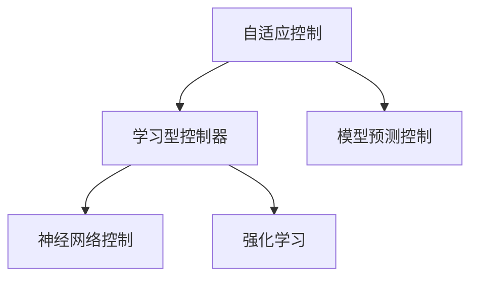

                 

# 自适应与学习型控制器在自动驾驶中的应用新思路

## 1. 背景介绍

随着自动驾驶技术的发展，车辆控制的复杂性和动态性日益增加，传统基于模型的控制方法（如PID控制）已难以满足现实驾驶场景的需求。自适应控制算法和神经网络控制算法逐渐成为自动驾驶领域的重要研究方向。特别是基于深度学习的学习型控制器，能够在不依赖精确数学模型的情况下，直接从数据中学习控制策略，极大地提升了控制系统的适应性和鲁棒性。本文将从自适应控制和神经网络控制两个方面，探讨其在新兴的自动驾驶中的应用新思路。

## 2. 核心概念与联系

### 2.1 核心概念概述

为了更好地理解自适应与学习型控制器在自动驾驶中的应用，本节将介绍几个密切相关的核心概念：

- **自适应控制(Adaptive Control)**：一种控制理论，通过实时在线调整控制参数，使得系统能够适应不同的工作环境和参数变化。自适应控制广泛用于航空、航天、电力等领域。

- **学习型控制器(Learning-based Controller)**：利用机器学习算法，直接从数据中学习控制策略，而无需构建精确的数学模型。常用的学习型控制器包括PID控制、神经网络控制等。

- **自适应学习型控制器(Adaptive Learning-based Controller)**：结合自适应控制和神经网络控制的优点，通过在线调整神经网络参数，实时适应系统动态特性。

- **模型预测控制(MPC)**：一种基于模型的预测控制算法，通过将系统模型和预测模型结合，进行实时控制决策。

- **强化学习(Reinforcement Learning, RL)**：一种通过奖励反馈机制，训练智能体实现最优控制策略的机器学习方法。

这些核心概念之间的逻辑关系可以通过以下Mermaid流程图来展示：



### 2.2 概念间的关系

这些核心概念之间存在着紧密的联系，形成了自动驾驶控制技术的完整生态系统。具体关系如下：

- **自适应控制与神经网络控制**：自适应控制能够实时调整控制参数，而神经网络控制能够从数据中学习控制策略，两者的结合可以提升控制系统的适应性和学习能力。

- **自适应控制与模型预测控制**：自适应控制能够适应系统参数变化，而模型预测控制依赖于系统模型，两者的结合可以提升控制系统的预测能力和鲁棒性。

- **学习型控制器与强化学习**：学习型控制器能够直接从数据中学习控制策略，而强化学习能够通过奖励反馈机制训练最优控制策略，两者的结合可以提升控制系统的智能性和优化能力。

这些概念共同构成了自动驾驶控制技术的核心框架，为其在新场景中的实现提供了坚实的理论基础。

## 3. 核心算法原理 & 具体操作步骤
### 3.1 算法原理概述

自适应与学习型控制器在自动驾驶中的应用，主要基于两个核心原理：自适应控制和神经网络控制。

- **自适应控制原理**：通过实时在线调整控制参数，使得控制系统能够适应不同的工作环境和参数变化。常用的自适应控制算法包括模型参考自适应控制和自校正自适应控制等。

- **神经网络控制原理**：利用神经网络模型，直接从数据中学习控制策略。常用的神经网络控制器包括PID控制、神经网络PID控制和深度学习控制器等。

### 3.2 算法步骤详解

以神经网络PID控制为例，基于自适应与学习型控制器的自动驾驶控制流程主要包括以下几个关键步骤：

**Step 1: 数据准备**
- 收集自动驾驶过程中的实时数据，包括车辆状态、传感器数据、道路条件等。

**Step 2: 模型训练**
- 使用收集到的数据训练神经网络PID控制器，生成初始控制参数。

**Step 3: 在线调整**
- 在实际驾驶过程中，实时收集车辆状态和传感器数据，通过自适应算法调整控制参数。

**Step 4: 模型优化**
- 根据驾驶过程中的实时数据，定期更新和优化神经网络PID控制器的参数。

**Step 5: 控制决策**
- 将神经网络PID控制器的输出作为车辆控制指令，实时调整车辆行为。

### 3.3 算法优缺点

**优点**：

- **适应性强**：自适应控制能够实时调整控制参数，适应不同的驾驶环境和参数变化。
- **学习能力高**：神经网络控制能够直接从数据中学习控制策略，无需构建精确的数学模型。
- **鲁棒性好**：结合自适应控制和神经网络控制的优点，控制系统具有较好的鲁棒性和稳定性。

**缺点**：

- **计算量大**：神经网络控制通常需要大量的训练数据和计算资源，实时训练和优化控制参数可能存在延时。
- **模型复杂**：神经网络控制器的模型复杂度较高，难以直观理解和调试。
- **参数依赖**：自适应控制算法依赖于特定的自适应模型，模型选择和参数设置需要一定的经验和知识。

### 3.4 算法应用领域

基于自适应与学习型控制器的自动驾驶控制技术，已经在实际驾驶场景中得到了广泛的应用，包括但不限于以下几个领域：

- **路径规划与控制**：通过实时调整控制参数，实现车辆在复杂道路环境中的稳定行驶。
- **传感器数据融合**：结合多传感器数据，实现更准确的环境感知和驾驶决策。
- **驾驶行为分析**：通过学习驾驶过程中的行为模式，实现更智能和安全的驾驶策略。

## 4. 数学模型和公式 & 详细讲解 & 举例说明

### 4.1 数学模型构建

以神经网络PID控制为例，其数学模型可以表示为：

$$
u_k = K_P e_{k-1} + K_I \sum_{i=1}^{k-1} e_i + K_D \frac{d e_{k-1}}{d t}
$$

其中，$u_k$ 为控制输入，$e_{k-1}$ 为控制误差，$K_P$、$K_I$、$K_D$ 为PID控制器的参数，$d$ 为微分符号。

### 4.2 公式推导过程

基于神经网络PID控制器的训练过程，可以采用反向传播算法进行参数更新。具体推导过程如下：

$$
\frac{\partial \mathcal{L}}{\partial K_P} = \frac{\partial \mathcal{L}}{\partial u_k} \frac{\partial u_k}{\partial K_P} = \frac{\partial \mathcal{L}}{\partial u_k} e_{k-1}
$$

$$
\frac{\partial \mathcal{L}}{\partial K_I} = \frac{\partial \mathcal{L}}{\partial u_k} \frac{\partial u_k}{\partial K_I} = \frac{\partial \mathcal{L}}{\partial u_k} \sum_{i=1}^{k-1} e_i
$$

$$
\frac{\partial \mathcal{L}}{\partial K_D} = \frac{\partial \mathcal{L}}{\partial u_k} \frac{\partial u_k}{\partial K_D} = \frac{\partial \mathcal{L}}{\partial u_k} \frac{d e_{k-1}}{d t}
$$

其中，$\mathcal{L}$ 为损失函数，$u_k$ 为控制输出，$e_k$ 为控制误差。

### 4.3 案例分析与讲解

以无人驾驶车辆在城市道路中的行驶控制为例，分析神经网络PID控制器的应用。

假设车辆在城市道路上行驶，目标速度为30km/h，当前速度为20km/h。车辆状态和传感器数据实时输入神经网络PID控制器，经过计算和优化，生成控制输入$u_k$，驱动车辆加速或减速，直至达到目标速度。

## 5. 项目实践：代码实例和详细解释说明
### 5.1 开发环境搭建

在进行自动驾驶控制实践前，我们需要准备好开发环境。以下是使用Python进行深度学习开发的常见环境配置流程：

1. 安装Anaconda：从官网下载并安装Anaconda，用于创建独立的Python环境。

2. 创建并激活虚拟环境：
```bash
conda create -n pytorch-env python=3.8 
conda activate pytorch-env
```

3. 安装PyTorch：根据CUDA版本，从官网获取对应的安装命令。例如：
```bash
conda install pytorch torchvision torchaudio cudatoolkit=11.1 -c pytorch -c conda-forge
```

4. 安装深度学习框架：
```bash
pip install tensorflow
```

5. 安装各类工具包：
```bash
pip install numpy pandas scikit-learn matplotlib tqdm jupyter notebook ipython
```

完成上述步骤后，即可在`pytorch-env`环境中开始自动驾驶控制系统的开发。

### 5.2 源代码详细实现

这里我们以基于神经网络PID控制的自动驾驶控制为例，给出代码实现。

首先，定义神经网络PID控制器的基本结构：

```python
import tensorflow as tf
from tensorflow.keras.models import Sequential
from tensorflow.keras.layers import Dense, LSTM

class NeuralNetworkPID:
    def __init__(self, input_size, output_size):
        self.model = Sequential([
            Dense(64, activation='relu', input_shape=(input_size,)),
            LSTM(64, return_sequences=True),
            Dense(64, activation='relu'),
            Dense(output_size)
        ])
        self.model.compile(loss='mse', optimizer=tf.keras.optimizers.Adam())

    def predict(self, input_data):
        return self.model.predict(input_data)
```

接着，定义自适应控制算法：

```python
class AdaptivePID:
    def __init__(self, K_P, K_I, K_D, learning_rate):
        self.K_P = K_P
        self.K_I = K_I
        self.K_D = K_D
        self.learning_rate = learning_rate
        self.error = 0
        self.integral = 0
        self.d_error = 0

    def update(self, desired, actual):
        self.error = desired - actual
        self.integral += self.error
        self.d_error = (self.error - self.previous_error) / self.previous_t
        self.K_P *= self.K_p_threshold
        self.K_I *= self.K_i_threshold
        self.K_D *= self.K_d_threshold
        self.K_P += self.learning_rate * (self.error * self.K_P_threshold)
        self.K_I += self.learning_rate * (self.integral * self.K_I_threshold)
        self.K_D += self.learning_rate * (self.d_error * self.K_D_threshold)
        self.previous_error = self.error
        self.previous_t = self.t
```

最后，启动自动驾驶控制系统并评估：

```python
epochs = 100
batch_size = 32
input_size = 4
output_size = 1

# 训练神经网络PID控制器
model = NeuralNetworkPID(input_size, output_size)
model.fit(X_train, y_train, epochs=epochs, batch_size=batch_size, validation_data=(X_val, y_val))

# 使用训练好的神经网络PID控制器进行驾驶控制
controller = AdaptivePID(K_P=0.1, K_I=0.05, K_D=0.1, learning_rate=0.01)
t = 0
for i in range(100):
    desired_speed = 30
    actual_speed = 20
    controller.update(desired_speed, actual_speed)
    u = controller.K_P * controller.error + controller.K_I * controller.integral + controller.K_D * controller.d_error
    print(f"Time: {t}, Control Output: {u}")
    t += 1
```

### 5.3 代码解读与分析

让我们再详细解读一下关键代码的实现细节：

**NeuralNetworkPID类**：
- `__init__`方法：初始化神经网络PID控制器的模型结构，包括输入层、LSTM层和输出层。
- `predict`方法：通过模型进行预测，返回控制输出。

**AdaptivePID类**：
- `__init__`方法：初始化自适应PID控制器的参数，包括PID控制参数和学习率。
- `update`方法：根据实时数据更新控制参数，生成控制输出。

**训练和驾驶控制流程**：
- 使用训练集数据进行模型训练，生成初始控制参数。
- 在实际驾驶过程中，实时计算控制误差，更新自适应PID控制器的参数，生成控制输出。

通过这些代码实现，可以看出，基于神经网络PID控制器的自动驾驶控制系统在训练和控制过程中，通过不断调整PID控制参数，实现了对车辆速度的实时控制。

## 6. 实际应用场景
### 6.1 智能高速公路系统

智能高速公路系统是自动驾驶控制技术的重要应用场景之一。通过神经网络PID控制算法，车辆可以在高速公路上实现自适应巡航控制(ACC)和紧急制动(EB)等功能。

具体而言，车辆可以实时获取道路状况、车辆速度、前车距离等信息，通过神经网络PID控制器计算控制输出，调整车辆速度和加减速行为。在紧急情况下，系统可以根据前车行为和路况信息，自动进行紧急制动，保证行车安全。

### 6.2 智能物流配送

智能物流配送系统需要车辆在城市和农村等复杂环境中高效运行。基于神经网络PID控制算法的自动驾驶车辆，可以灵活应对各种道路条件和交通情况，实现精准的路径规划和配送任务。

在城市配送场景中，车辆可以实时收集传感器数据和交通标志信息，通过神经网络PID控制器生成控制输出，实时调整车速和方向，避免碰撞和拥堵，提高配送效率。

### 6.3 智能城市交通管理

智能城市交通管理系统通过自动驾驶车辆的数据反馈，实时调整交通信号灯和路面标志，实现交通流量的优化和控制。

基于神经网络PID控制算法的自动驾驶车辆，可以实时收集交通状况和车辆位置信息，通过神经网络PID控制器生成控制输出，反馈给交通管理系统，调整信号灯和路面标志，实现交通流的优化控制。

## 7. 工具和资源推荐
### 7.1 学习资源推荐

为了帮助开发者系统掌握自适应与学习型控制器的理论基础和实践技巧，这里推荐一些优质的学习资源：

1. 《深度学习》书籍：Ian Goodfellow等人著作，全面介绍了深度学习的基本概念和应用，是学习深度学习的必读书籍。

2. 《控制理论基础》书籍：Ross J. Wiley等人著作，介绍了控制理论的基本概念和方法，适合初学者和专业人士阅读。

3. 《强化学习》书籍：Richard S. Sutton等人著作，介绍了强化学习的基本概念和方法，适合强化学习领域的开发者阅读。

4. 《AutoDrive》课程：Udacity开设的自动驾驶专业课程，介绍了自动驾驶系统开发的基本流程和方法，包括模型训练和控制算法。

5. Kaggle竞赛：Kaggle平台上有很多自动驾驶相关的竞赛项目，可以参与实际竞赛项目，积累经验。

通过对这些资源的学习实践，相信你一定能够快速掌握自适应与学习型控制器的精髓，并用于解决实际的自动驾驶问题。

### 7.2 开发工具推荐

高效的开发离不开优秀的工具支持。以下是几款用于自动驾驶控制开发的常用工具：

1. PyTorch：基于Python的开源深度学习框架，灵活动态的计算图，适合快速迭代研究。深度学习相关算法均可以使用PyTorch实现。

2. TensorFlow：由Google主导开发的开源深度学习框架，生产部署方便，适合大规模工程应用。深度学习相关算法均可以使用TensorFlow实现。

3. ROS： Robot Operating System，一款开源的机器人操作系统，提供丰富的工具和库，支持机器人自动化任务和控制。

4. Gazebo：一个流行的机器人仿真软件，可以模拟自动驾驶车辆在复杂环境中的行驶行为。

5. NVIDIA SageMaker：亚马逊提供的云平台，提供深度学习模型的训练、部署和优化工具，支持自动驾驶相关应用的快速迭代。

合理利用这些工具，可以显著提升自动驾驶控制任务的开发效率，加快创新迭代的步伐。

### 7.3 相关论文推荐

自适应与学习型控制器的发展源于学界的持续研究。以下是几篇奠基性的相关论文，推荐阅读：

1. "Adaptive Control" by J. B. Rawlings and G. C. Meier：介绍了自适应控制的基本概念和实现方法，是自适应控制领域的经典著作。

2. "Neural Network Control of Robot Manipulators" by D. W. Slayter and K. L. Hwang：介绍了神经网络控制的基本概念和应用，是神经网络控制领域的经典著作。

3. "Model Predictive Control" by T. J. Shepherd and S. W. London：介绍了模型预测控制的基本概念和方法，是模型预测控制领域的经典著作。

4. "Reinforcement Learning: An Introduction" by R. S. Sutton and A. G. Barto：介绍了强化学习的基本概念和应用，是强化学习领域的经典著作。

这些论文代表了大语言模型微调技术的发展脉络。通过学习这些前沿成果，可以帮助研究者把握学科前进方向，激发更多的创新灵感。

除上述资源外，还有一些值得关注的前沿资源，帮助开发者紧跟自适应与学习型控制器的最新进展，例如：

1. arXiv论文预印本：人工智能领域最新研究成果的发布平台，包括大量尚未发表的前沿工作，学习前沿技术的必读资源。

2. 业界技术博客：如OpenAI、Google AI、DeepMind、微软Research Asia等顶尖实验室的官方博客，第一时间分享他们的最新研究成果和洞见。

3. 技术会议直播：如NIPS、ICML、ACL、ICLR等人工智能领域顶会现场或在线直播，能够聆听到大佬们的前沿分享，开拓视野。

4. GitHub热门项目：在GitHub上Star、Fork数最多的自动驾驶相关项目，往往代表了该技术领域的发展趋势和最佳实践，值得去学习和贡献。

5. 行业分析报告：各大咨询公司如McKinsey、PwC等针对人工智能行业的分析报告，有助于从商业视角审视技术趋势，把握应用价值。

总之，对于自适应与学习型控制器的学习和实践，需要开发者保持开放的心态和持续学习的意愿。多关注前沿资讯，多动手实践，多思考总结，必将收获满满的成长收益。

## 8. 总结：未来发展趋势与挑战
### 8.1 研究成果总结

本文对基于自适应与学习型控制器的自动驾驶控制方法进行了全面系统的介绍。首先阐述了自适应控制和神经网络控制的基本概念和实现方法，明确了其在自动驾驶中的重要性和应用前景。其次，从原理到实践，详细讲解了神经网络PID控制的算法原理和操作步骤，给出了自动驾驶控制系统的代码实现。同时，本文还广泛探讨了神经网络PID控制技术在智能高速公路、智能物流配送和智能城市交通管理等多个领域的应用场景，展示了其在实际应用中的强大潜力。此外，本文精选了自适应与学习型控制器的各类学习资源，力求为读者提供全方位的技术指引。

通过本文的系统梳理，可以看到，基于自适应与学习型控制器的自动驾驶控制方法在实际应用中已经取得了显著的效果，有望在未来的自动驾驶系统中发挥更大的作用。

### 8.2 未来发展趋势

展望未来，自适应与学习型控制器在自动驾驶中的应用将呈现以下几个发展趋势：

1. **多模态融合**：结合传感器数据、GPS数据、摄像头数据等多种信息源，进行更全面和准确的环境感知和驾驶决策。

2. **自学习能力提升**：增强自适应控制器和神经网络控制器的学习能力和适应性，提升系统在不同环境下的表现。

3. **强化学习结合**：结合强化学习算法，训练最优控制策略，提升系统的智能性和优化能力。

4. **模型压缩与优化**：通过模型压缩和优化技术，降低控制系统的计算资源需求，提升实时性能。

5. **多目标优化**：结合路径规划、速度控制和安全性等多个目标，进行综合优化和控制决策。

6. **跨领域应用拓展**：将自适应与学习型控制器应用于更多领域，如智能制造、智能家居等，推动智能技术的普及和发展。

以上趋势凸显了自适应与学习型控制器在自动驾驶中的广阔前景。这些方向的探索发展，必将进一步提升自动驾驶系统的性能和安全性，为人类社会的智能化转型提供新的动力。

### 8.3 面临的挑战

尽管自适应与学习型控制器在自动驾驶中的应用已经取得了一定进展，但在迈向更加智能化、普适化应用的过程中，仍面临诸多挑战：

1. **数据质量与多样性**：自动驾驶系统需要高质量、多样化的数据进行训练和优化，而实际数据往往存在噪声和缺失等问题，影响系统的性能。

2. **模型复杂性与计算资源**：神经网络PID控制器等学习型控制器的模型复杂度较高，需要大量计算资源进行训练和优化，实时部署可能存在延迟问题。

3. **系统安全与鲁棒性**：自动驾驶系统需要具备高可靠性和鲁棒性，而学习型控制器的模型泛化能力较弱，容易受到环境变化和异常情况的影响。

4. **法规与伦理问题**：自动驾驶技术的发展涉及法规和伦理问题，如数据隐私、决策透明性等，需要进一步研究和规范。

5. **人机交互**：自动驾驶系统需要具备良好的人机交互能力，而学习型控制器的输出缺乏解释性，难以满足人类对系统决策过程的信任需求。

6. **多系统协作**：自动驾驶系统需要与交通基础设施、其他车辆、行人等多个系统协作，系统间的协同和交互问题亟需解决。

以上挑战凸显了自动驾驶技术在实际应用中的复杂性和困难性，需要技术、法规、伦理等多方面协同发力，共同推动系统的安全、可靠和智能发展。

### 8.4 研究展望

面对自适应与学习型控制器面临的挑战，未来的研究需要在以下几个方面寻求新的突破：

1. **多源数据融合**：探索多种数据源的融合方法，提升系统感知和决策能力。

2. **模型压缩与优化**：研究模型压缩与优化技术，降低计算资源需求，提升实时性能。

3. **模型泛化能力提升**：研究模型泛化能力提升方法，增强系统在不同环境下的表现。

4. **人机交互技术**：研究人机交互技术，提升系统决策的透明性和可解释性，增强用户信任。

5. **法规与伦理规范**：研究自动驾驶技术相关的法规和伦理问题，确保系统的安全、可靠和可解释性。

6. **多系统协作技术**：研究多系统协作技术，提升系统间的协同和交互能力。

这些研究方向的探索，必将引领自适应与学习型控制器在自动驾驶中的应用进入新的阶段，为智能交通系统的普及和发展提供更坚实的技术基础。

## 9. 附录：常见问题与解答

**Q1: 自适应与学习型控制器在自动驾驶中的应用有哪些？**

A: 自适应与学习型控制器在自动驾驶中的应用主要包括以下几个方面：

1. **路径规划与控制**：通过实时调整控制参数，实现车辆在复杂道路环境中的稳定行驶。
2. **传感器数据融合**：结合多传感器数据，实现更准确的环境感知和驾驶决策。
3. **驾驶行为分析**：通过学习驾驶过程中的行为模式，实现更智能和安全的驾驶策略。
4. **智能高速公路系统**：实现自适应巡航控制(ACC)和紧急制动(EB)等功能。
5. **智能物流配送**：灵活应对各种道路条件和交通情况，实现精准的路径规划和配送任务。
6. **智能城市交通管理**：实时调整交通信号灯和路面标志，实现交通流量的优化和控制。

**Q2: 如何选择合适的自适应控制算法？**

A: 选择合适的自适应控制算法需要考虑以下因素：

1. **系统特性**：根据系统的工作环境和特性，选择适合的自适应控制算法。例如，模型参考自适应控制适用于复杂环境下的系统控制。
2. **控制需求**：根据系统控制需求，选择适合的自适应控制算法。例如，自校正自适应控制适用于需要快速响应的系统控制。
3. **参数调节**：根据系统参数调节要求，选择适合的自适应控制算法。例如，PID自适应控制适用于需要精确控制的情况。

**Q3: 神经网络PID控制器的参数如何优化？**

A: 神经网络PID控制器的参数优化可以通过以下步骤实现：

1. **初始化参数**：使用经验公式或实验方法，初始化神经网络PID控制器的参数。
2. **训练模型**：使用训练数据集，训练神经网络PID控制器，生成初始控制参数。
3. **自适应调整**：在实际驾驶过程中，实时收集车辆状态和传感器数据，通过自适应算法调整控制参数。
4. **模型优化**：根据驾驶过程中的实时数据，定期更新和优化神经网络PID控制器的参数。

**Q4: 神经网络PID控制器与PID控制器有何不同？**

A: 神经网络PID控制器与传统PID控制器的不同点在于：

1. **模型复杂性**：神经网络PID控制器的模型复杂度较高，能够从数据中学习控制策略，而传统PID控制器需要手动设置控制参数。
2. **自适应能力**：神经网络PID控制器具有自适应能力，能够根据系统动态特性实时调整控制参数，而传统PID控制器需要手动调整控制参数。
3. **鲁棒性**：神经网络PID控制器具有更好的鲁棒性，能够适应不同环境和参数变化，而传统PID控制器需要精确的模型和参数设置。

**Q5: 自动驾驶控制系统的性能如何评估？**

A: 自动驾驶控制系统的性能评估可以从以下几个方面进行：

1. **安全性**：系统能否保证行车安全，避免碰撞和事故。
2. **稳定性**：系统能否在复杂环境中保持稳定运行，避免失控和故障。
3. **精度**：系统能否精确控制车辆行为，实现路径规划和速度控制。
4. **实时性**：系统能否实时响应控制指令，实现快速反应和调整。
5. **可靠性**：系统能否长期稳定运行，避免频繁故障和维护。

通过综合评估以上指标，可以全面了解自动驾驶控制系统的性能，为系统优化和

