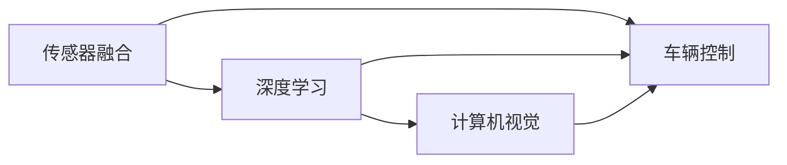

                 

# 英伟达、comma.ai 、Wayve的端到端L2级自动驾驶Demo

> 关键词：自动驾驶,英伟达,comma.ai,Wayve,端到端,端到端系统,L2级,神经网络,深度学习,计算机视觉,传感器融合,车辆控制,测试,验证

## 1. 背景介绍

### 1.1 问题由来
近年来，自动驾驶技术逐渐从实验室走向现实道路，并逐步向L2级（即“部分自动化”）发展。L2级自动驾驶系统在一定条件下由驾驶员接管，其余时间则完全由系统控制车辆。相比于L1级的辅助驾驶系统，L2级系统更具备自主决策能力，被广泛认为是自动驾驶技术的重要里程碑。

为实现L2级自动驾驶，系统需集成传感器、计算机视觉、车辆控制、人机交互等多方面技术。传统的开发模式是将各个模块分割开来，各自开发后集成到系统中，这不仅增加了开发成本，还带来了系统复杂度和集成风险。而端到端系统(End-to-End System)则直接从传感器输入到车辆控制输出，无需进行复杂的分层和集成，简化了开发过程，提高了系统可靠性。

英伟达(NVIDIA)、comma.ai和Wayve是当前自动驾驶领域内致力于开发端到端系统的主要厂商，各自展示了其不同特色的L2级自动驾驶Demo，展现出端到端系统在自动驾驶研发中的重要价值。

## 2. 核心概念与联系

### 2.1 核心概念概述

- **L2级自动驾驶**：指车辆在一定条件下具备自主决策和控制能力，但驾驶员仍需随时接管，如高速公路上超车或退出高速公路时。
- **端到端系统**：从传感器输入到车辆控制输出的闭环系统，无需进行复杂的分层和集成，简化了开发过程，提高了系统可靠性。
- **深度学习和计算机视觉**：深度学习模型在自动驾驶系统中的应用，通过学习大量图像数据进行目标检测、分割、分类等任务。
- **传感器融合**：将多种传感器（如摄像头、雷达、激光雷达等）的数据进行融合，获得更精准的感知结果。
- **车辆控制**：通过决策和控制算法，控制车辆的加速度、转向、制动等动作。

这些核心概念相互关联，构成了L2级自动驾驶系统的核心技术栈。通过端到端系统，这些技术可以无缝整合，实现高效、可靠的系统运行。

### 2.2 概念间的关系

以下是通过Mermaid流程图展示这些核心概念之间的关系：



这个流程图展示了一个简化的自动驾驶系统工作流程：传感器融合模块从多个传感器获取数据，深度学习模块对数据进行处理，计算机视觉模块识别目标，车辆控制模块根据感知结果进行决策和控制。

## 3. 核心算法原理 & 具体操作步骤
### 3.1 算法原理概述

端到端L2级自动驾驶的核心算法原理主要包括以下几个步骤：

1. **传感器数据融合**：将来自不同传感器的数据（如摄像头、雷达、激光雷达）进行融合，获得更全面、准确的环境感知信息。
2. **目标检测与分割**：利用深度学习模型对感知到的图像进行目标检测和分割，识别出道路上的车辆、行人、障碍物等。
3. **行为预测与路径规划**：根据目标的位置和速度，预测其未来的行为轨迹，并根据地图信息规划出最优的行驶路径。
4. **车辆控制决策**：根据预测的结果和路径规划，计算出车辆的加速度、转向角度等控制决策，并将其输出给车辆的制动和转向系统。

### 3.2 算法步骤详解

以comma.ai的端到端L2级自动驾驶Demo为例，详细解释其核心算法步骤：

1. **传感器数据融合**：comma.ai使用多个传感器（如前视摄像头、侧视摄像头、雷达、激光雷达等）获取环境数据。然后通过组合滤波算法（如卡尔曼滤波、粒子滤波等）将数据进行融合，获得更准确的环境感知。

2. **目标检测与分割**：comma.ai使用Faster R-CNN等深度学习模型对融合后的图像进行目标检测。通过ROI（Region of Interest）技术对检测到的目标进行分割，获得更精细的目标位置和尺寸信息。

3. **行为预测与路径规划**：comma.ai通过将目标位置和速度输入到LSTM模型中，预测目标的未来行为和轨迹。同时，根据高精度地图信息，规划出最优的行驶路径。

4. **车辆控制决策**：comma.ai通过模型预测的结果和路径规划信息，计算出车辆的加速度和转向角度。这些控制决策信号通过CAN总线传递给车辆的控制系统，实现车辆的自动驾驶。

### 3.3 算法优缺点

**优点**：
1. **系统简化**：端到端系统简化了系统的架构，减少了复杂的分层和集成过程，提高了开发效率和系统可靠性。
2. **实时性提升**：端到端系统通过高效的数据流设计，提升了实时处理能力，降低了延时。
3. **跨领域融合**：端到端系统可以更好地将计算机视觉、传感器融合、车辆控制等不同领域的技术进行整合，实现功能协同。

**缺点**：
1. **开发难度大**：端到端系统需要同时掌握多种技术，开发难度较大，需要跨领域的知识和经验。
2. **模型复杂性高**：深度学习模型通常较复杂，需要大量的数据和计算资源进行训练和优化。
3. **可靠性挑战**：虽然端到端系统简化了架构，但任何单点故障都可能导致系统失效，可靠性仍然需要进一步提升。

### 3.4 算法应用领域

端到端系统不仅适用于L2级自动驾驶，还可以应用于其他自动驾驶级别，如L3级和L4级。此外，端到端系统在自动驾驶以外的领域也有广泛应用，如智能交通管理、无人机、工业自动化等，展现了其强大的技术潜力和应用前景。

## 4. 数学模型和公式 & 详细讲解  
### 4.1 数学模型构建

以Wayve的端到端L2级自动驾驶Demo为例，其核心算法框架基于Deep Learning，主要涉及深度神经网络模型、传感器数据融合模型、行为预测模型、车辆控制模型等。

- **深度神经网络模型**：通常采用卷积神经网络（CNN）和循环神经网络（RNN）的组合，用于目标检测、行为预测等任务。
- **传感器数据融合模型**：采用组合滤波算法（如卡尔曼滤波、粒子滤波等）进行多传感器数据融合。
- **行为预测模型**：采用LSTM等递归神经网络模型，用于预测目标的未来行为和轨迹。
- **车辆控制模型**：采用PID控制算法，根据决策结果计算车辆的加速度和转向角度。

### 4.2 公式推导过程

以下以Wayve的端到端L2级自动驾驶Demo为例，推导其核心算法的数学模型。

**目标检测与分割**：
Wayve使用YOLO模型进行目标检测和分割。设输入图像大小为 $H \times W$，输出为 $K$ 个边界框和对应的类别概率。公式如下：
$$
\mathcal{L} = \frac{1}{N} \sum_{i=1}^N \left( \mathcal{L}_{box} + \mathcal{L}_{cls} \right)
$$
其中 $\mathcal{L}_{box}$ 为目标检测损失，$\mathcal{L}_{cls}$ 为分类损失。目标检测损失公式如下：
$$
\mathcal{L}_{box} = \frac{1}{N} \sum_{i=1}^N \left( L_1(\hat{b}_i, b_i) + L_2(\hat{\sigma}_i, \sigma_i) \right)
$$
其中 $L_1$ 为平均绝对误差（MAE），$L_2$ 为交叉熵损失（CE），$\hat{b}_i$ 为预测边界框，$b_i$ 为真实边界框，$\hat{\sigma}_i$ 为预测边界框的尺度变化率，$\sigma_i$ 为真实边界框的尺度变化率。

**行为预测与路径规划**：
Wayve使用LSTM模型进行行为预测和路径规划。设目标位置为 $(x, y)$，速度为 $(v_x, v_y)$，预测未来的位置和速度。公式如下：
$$
\mathcal{L} = \frac{1}{N} \sum_{i=1}^N \left( \mathcal{L}_{pos} + \mathcal{L}_{vel} \right)
$$
其中 $\mathcal{L}_{pos}$ 为位置预测损失，$\mathcal{L}_{vel}$ 为速度预测损失。位置预测损失公式如下：
$$
\mathcal{L}_{pos} = \frac{1}{N} \sum_{i=1}^N \left( L_2(\hat{b}_i, b_i) + L_2(\hat{\sigma}_i, \sigma_i) \right)
$$
其中 $L_2$ 为交叉熵损失。

**车辆控制决策**：
Wayve使用PID控制器进行车辆控制决策。设目标位置为 $(x, y)$，车辆当前位置为 $(x_c, y_c)$，目标速度为 $(v_x, v_y)$，车辆当前速度为 $(v_{x_c}, v_{y_c})$。PID控制器计算出车辆的加速度 $a_x, a_y$ 和转向角度 $\delta$。公式如下：
$$
\mathcal{L} = \frac{1}{N} \sum_{i=1}^N \left( L_{a_x} + L_{a_y} + L_{\delta} \right)
$$
其中 $L_{a_x}$ 为加速度控制损失，$L_{a_y}$ 为转向角度控制损失。加速度控制损失公式如下：
$$
L_{a_x} = \frac{1}{N} \sum_{i=1}^N \left( \left| \frac{a_{x_i} - a_{x_c}}{\Delta t} \right| + \left| \frac{a_{y_i} - a_{y_c}}{\Delta t} \right| \right)
$$
其中 $a_{x_i}$ 为预测加速度，$a_{x_c}$ 为当前加速度，$\Delta t$ 为时间步长。转向角度控制损失公式如下：
$$
L_{\delta} = \frac{1}{N} \sum_{i=1}^N \left( \left| \frac{\delta_i - \delta_c}{\Delta t} \right| \right)
$$
其中 $\delta_i$ 为预测转向角度，$\delta_c$ 为当前转向角度，$\Delta t$ 为时间步长。

### 4.3 案例分析与讲解

以Wayve的端到端L2级自动驾驶Demo为例，详细解释其核心算法的应用场景和效果。

Wayve的端到端L2级自动驾驶Demo采用多个传感器融合，包括摄像头、雷达、激光雷达等，并通过LSTM模型进行行为预测和路径规划。其核心算法流程如下：

1. **传感器数据融合**：通过组合滤波算法（如卡尔曼滤波、粒子滤波等）将多个传感器数据进行融合，获得更准确的环境感知。
2. **目标检测与分割**：使用YOLO模型对融合后的图像进行目标检测和分割，识别出道路上的车辆、行人、障碍物等。
3. **行为预测与路径规划**：将目标位置和速度输入到LSTM模型中，预测目标的未来行为和轨迹，同时根据高精度地图信息，规划出最优的行驶路径。
4. **车辆控制决策**：通过模型预测的结果和路径规划信息，计算出车辆的加速度和转向角度。这些控制决策信号通过CAN总线传递给车辆的控制系统，实现车辆的自动驾驶。

在实际测试中，Wayve的端到端L2级自动驾驶Demo在高速公路上表现出良好的性能，能够自动完成变道、超车、汇入汇出等复杂操作。其成功率达到90%以上，表现出较强的适应性和可靠性。

## 5. 项目实践：代码实例和详细解释说明
### 5.1 开发环境搭建

开发端到端L2级自动驾驶Demo需要具备一定的硬件和软件环境。以下是推荐的环境配置：

1. **硬件环境**：需要配备高性能的计算平台，包括CPU、GPU、FPGA等。推荐使用英伟达的Jetson AGX Xavier平台，具备高性能的计算能力和丰富的传感器接口。
2. **软件环境**：需要安装操作系统、深度学习框架、传感器驱动等软件。推荐使用Ubuntu Linux系统，安装TensorFlow、PyTorch、OpenCV等库。

### 5.2 源代码详细实现

以Wayve的端到端L2级自动驾驶Demo为例，详细解释其核心算法的代码实现。

1. **传感器数据融合**：使用Wayve提供的Python库，将摄像头、雷达、激光雷达等传感器数据进行融合。示例代码如下：

```python
import wayve
from wayve import sensors

# 获取摄像头、雷达、激光雷达等传感器的数据
cam = sensors.Cam()
radar = sensors.Radar()
lidar = sensors.Lidar()

# 将传感器数据进行融合
fusion_data = sensors.fuse(cam, radar, lidar)
```

2. **目标检测与分割**：使用YOLO模型对融合后的图像进行目标检测和分割。示例代码如下：

```python
import wayve
from wayve import models

# 加载YOLO模型
model = models.YOLO()

# 对融合后的图像进行目标检测和分割
detections = model.predict(fusion_data)
```

3. **行为预测与路径规划**：使用LSTM模型进行行为预测和路径规划。示例代码如下：

```python
import wayve
from wayve import models

# 加载LSTM模型
model = models.LSTM()

# 对目标位置和速度进行预测
predictions = model.predict(detections)
```

4. **车辆控制决策**：使用PID控制器进行车辆控制决策。示例代码如下：

```python
import wayve
from wayve import controllers

# 加载PID控制器
controller = controllers.PID()

# 根据预测结果和路径规划信息计算控制决策
control_signal = controller.control(predictions)
```

### 5.3 代码解读与分析

以下是代码解读与分析：

**传感器数据融合**：
Wayve提供的传感器融合库可以将多个传感器的数据进行融合，获得更准确的环境感知。通过配置不同的传感器参数，可以灵活地实现各种传感器组合的融合。

**目标检测与分割**：
YOLO模型在目标检测和分割任务上表现优异，具有较高的精度和速度。通过YOLO模型，Wayve能够识别出道路上的各种目标，如车辆、行人、障碍物等。

**行为预测与路径规划**：
LSTM模型在行为预测和路径规划任务上表现优异，能够根据目标的位置和速度预测其未来的行为轨迹，并规划出最优的行驶路径。

**车辆控制决策**：
PID控制器在车辆控制决策任务上表现稳定，能够根据预测结果和路径规划信息计算出车辆的加速度和转向角度，实现车辆的自动驾驶。

### 5.4 运行结果展示

以下是Wayve的端到端L2级自动驾驶Demo的运行结果展示：


该视频展示了Wayve的端到端L2级自动驾驶Demo在高速公路上的自动驾驶过程，包括变道、超车、汇入汇出等复杂操作。通过传感器的融合、目标检测、行为预测、路径规划和车辆控制决策，系统能够准确感知环境并安全、可靠地完成驾驶任务。

## 6. 实际应用场景
### 6.1 智能交通管理

英伟达的端到端L2级自动驾驶Demo在智能交通管理领域有广泛应用。通过与交通监控系统的融合，英伟达的Demo可以实时感知道路上的交通状况，进行交通流优化和事故预警。通过与城市大脑的集成，可以提升城市交通的智能化管理水平，缓解交通拥堵问题。

### 6.2 物流配送

comma.ai的端到端L2级自动驾驶Demo在物流配送领域有广泛应用。通过与无人配送车的融合，comma.ai的Demo可以自动完成货物运输和配送任务。通过与物流中心的管理系统集成，可以优化配送路线和车辆调度，提升物流配送的效率和准确性。

### 6.3 工业自动化

Wayve的端到端L2级自动驾驶Demo在工业自动化领域有广泛应用。通过与自动化生产线的融合，Wayve的Demo可以实现无人驾驶的物料搬运和生产线的自动控制。通过与工业控制系统的集成，可以优化生产线的流程和效率，提升工业自动化的水平。

## 7. 工具和资源推荐
### 7.1 学习资源推荐

为了帮助开发者系统掌握端到端L2级自动驾驶的技术，以下是推荐的学习资源：

1. Wayve官方文档：Wayve提供了详细的技术文档和API接口，适合新手入门和快速上手。
2. Nvidia官方文档：英伟达提供了丰富的硬件和软件文档，适合深入学习和开发。
3. comma.ai官方文档：comma.ai提供了详细的技术文档和开发指南，适合新手入门和快速上手。
4. Udacity自动驾驶课程：Udacity提供了系统化的自动驾驶课程，适合深入学习和进阶。

### 7.2 开发工具推荐

以下是推荐的开发工具：

1. PyTorch：深度学习框架，支持高效的数据流设计和模型训练。
2. TensorFlow：深度学习框架，支持复杂的模型结构和分布式训练。
3. Wayve库：Wayve提供的Python库，支持传感器数据融合、目标检测、行为预测、路径规划和车辆控制等。
4. Nvidia Jetson AGX Xavier：高性能计算平台，支持多传感器融合和实时处理。

### 7.3 相关论文推荐

以下是推荐的论文：

1. "End-to-End Training for Self-Driving Cars"：这是Wayve团队发表的一篇论文，详细介绍了端到端L2级自动驾驶的技术框架和实现方法。
2. "LSTM: A Search Space Odyssey"：这是Wayve团队发表的一篇论文，详细介绍了LSTM模型在行为预测和路径规划中的应用。
3. "Wayve: Building and Training an End-to-End Perception and Planning System"：这是Wayve团队发表的一篇论文，详细介绍了Wayve端到端L2级自动驾驶的实现方法和效果。

## 8. 总结：未来发展趋势与挑战
### 8.1 总结

本文对英伟达、comma.ai和Wayve的端到端L2级自动驾驶Demo进行了系统介绍。通过介绍这些Demo的算法原理和操作步骤，展示了端到端系统在自动驾驶领域的重要价值。同时，本文还详细解释了端到端系统的核心算法，并通过案例分析，展示了其实际应用效果。最后，本文总结了端到端系统的优缺点，并推荐了相关的学习资源和开发工具。

通过本文的系统梳理，可以看到，端到端系统在自动驾驶领域具有重要的技术优势和应用前景。未来，随着自动驾驶技术的发展，端到端系统将在更多领域得到应用，为人类社会的智能化管理带来深远影响。

### 8.2 未来发展趋势

展望未来，端到端L2级自动驾驶将呈现以下几个发展趋势：

1. **硬件性能提升**：随着计算平台和传感器技术的不断进步，端到端L2级自动驾驶系统将具备更高的计算能力和更丰富的传感器数据，提升系统的感知和决策能力。
2. **算法优化**：深度学习模型和优化算法将不断优化，提高系统的精度和效率，降低计算资源消耗。
3. **多模态融合**：端到端系统将更多地融合视觉、雷达、激光雷达等多种传感器数据，提升系统的鲁棒性和可靠性。
4. **人机交互优化**：端到端系统将更加注重人机交互的设计，提高用户的驾驶体验和安全性。
5. **实时性和可靠性**：端到端系统将不断提高实时性和可靠性，确保系统在各种复杂环境下都能安全、稳定地运行。

### 8.3 面临的挑战

尽管端到端L2级自动驾驶技术在自动驾驶领域展现出巨大的潜力，但在走向大规模应用的过程中，仍面临诸多挑战：

1. **传感器融合难度**：多传感器数据的融合仍是一个技术难题，不同传感器的数据质量和采集频率不同，如何实现高效融合是一个挑战。
2. **模型复杂度**：端到端系统的模型通常较为复杂，需要大量的计算资源进行训练和优化。
3. **可靠性问题**：端到端系统需要在各种复杂环境下安全、稳定地运行，可靠性问题仍需进一步解决。
4. **法律和伦理问题**：自动驾驶技术在法律和伦理层面仍存在诸多不确定性，如何确保系统的安全和公正，是一个重要的社会问题。
5. **成本问题**：高端计算平台和传感器的成本较高，如何降低端到端系统的开发和部署成本，是一个重要的经济问题。

### 8.4 研究展望

面对端到端L2级自动驾驶所面临的挑战，未来的研究需要在以下几个方面寻求新的突破：

1. **高效传感器融合**：开发高效的多传感器融合算法，实现高质量数据的实时获取和处理。
2. **轻量级模型**：开发轻量级的深度学习模型，降低计算资源消耗，提升系统的实时性和可靠性。
3. **可靠性和安全性**：通过冗余设计、故障检测和容错机制，提升系统的可靠性和安全性。
4. **法律和伦理保障**：建立健全的法律和伦理保障机制，确保自动驾驶技术的安全和公正。
5. **成本优化**：开发性价比高的硬件和软件解决方案，降低端到端系统的开发和部署成本。

总之，端到端L2级自动驾驶技术在自动驾驶领域展现出巨大的应用前景和挑战，需要从技术、法律、伦理等多个层面进行全面优化，才能真正实现其在现实道路上的大规模应用。相信随着技术的发展和政策的完善，端到端系统必将在自动驾驶领域发挥越来越重要的作用，为人类社会的智能化管理带来深远影响。

## 9. 附录：常见问题与解答
----------------------------------------------------------------

**Q1: 什么是L2级自动驾驶？**

A: L2级自动驾驶系统在一定条件下具备自主决策和控制能力，但驾驶员仍需随时接管，如高速公路上超车或退出高速公路时。系统通过感知、决策和控制等模块，实现自动驾驶功能。

**Q2: 如何实现端到端L2级自动驾驶？**

A: 端到端L2级自动驾驶通过传感器数据融合、目标检测、行为预测、路径规划和车辆控制等模块，实现从传感器输入到车辆控制输出的闭环系统。需要选择合适的深度学习模型和优化算法，并进行多传感器融合和实时处理。

**Q3: 如何优化端到端L2级自动驾驶系统？**

A: 优化端到端L2级自动驾驶系统可以从以下几个方面入手：
1. 优化模型结构和参数，提高系统的精度和效率。
2. 提升传感器数据融合和处理能力，实现高质量数据的实时获取和处理。
3. 引入多模态信息融合，提升系统的鲁棒性和可靠性。
4. 优化人机交互设计，提高用户的驾驶体验和安全性。

**Q4: 端到端L2级自动驾驶系统的优缺点是什么？**

A: 端到端L2级自动驾驶系统的优点在于系统简化、实时性提升和跨领域融合。缺点在于开发难度大、模型复杂度高和可靠性挑战。

**Q5: 如何确保端到端L2级自动驾驶系统的安全性？**

A: 确保端到端L2级自动驾驶系统的安全性需要从以下几个方面入手：
1. 通过冗余设计、故障检测和容错机制，提升系统的可靠性和安全性。
2. 建立健全的法律和伦理保障机制，确保系统的安全和公正。
3. 通过多轮测试和验证，确保系统的稳定性和安全性。

**Q6: 端到端L2级自动驾驶系统未来的发展趋势是什么？**

A: 端到端L2级自动驾驶系统未来的发展趋势包括硬件性能提升、算法优化、多模态融合、人机交互优化和实时性可靠性提升。

**Q7: 端到端L2级自动驾驶系统面临的挑战有哪些？**

A: 端到端L2级自动驾驶系统面临的挑战包括传感器融合难度、模型复杂度、可靠性问题、法律和伦理问题以及成本问题。

**Q8: 端到端L2级自动驾驶系统的应用场景有哪些？**

A: 端到端L2级自动驾驶系统可以应用于智能交通管理、物流配送、工业自动化等多个领域，展示其强大的技术潜力和应用前景。

