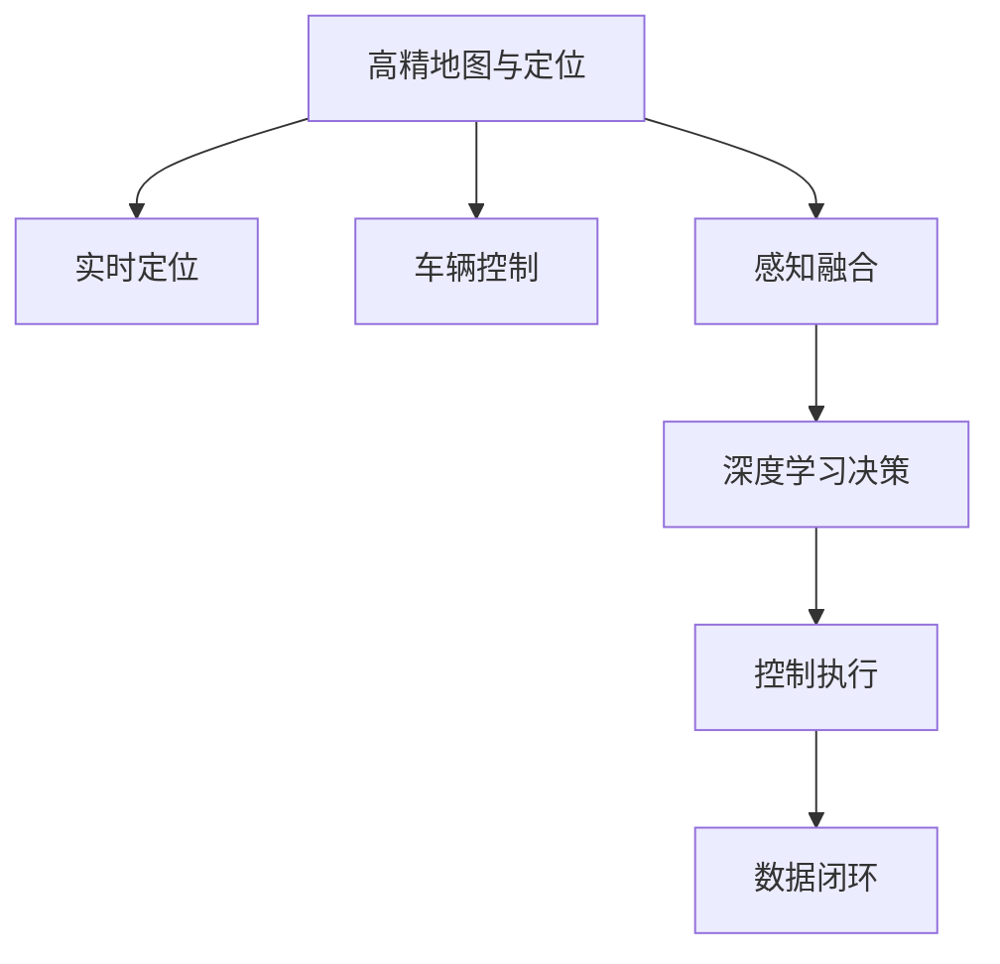
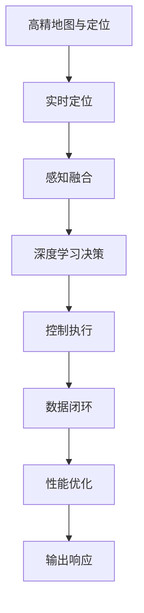

                 

# 蔚来在主动安全领域的端到端方法

蔚来汽车作为全球领先的电动汽车制造商，致力于通过技术创新提升驾驶体验和安全性。在主动安全领域，蔚来采用了端到端的研发方法，涵盖从感知、决策到执行的全链条，以确保车辆在各种场景下的安全行驶。本文将详细介绍蔚来在主动安全领域的端到端方法，包括感知技术、决策算法、执行系统以及全链条数据闭环的实现，并展望未来技术的发展趋势。

## 1. 背景介绍

### 1.1 问题由来

随着电动汽车保有量的增加，交通安全问题日益突出。传统的被动安全技术如安全带、气囊等虽然能够降低事故伤害，但在复杂交通环境中仍难以应对突发状况。主动安全技术通过预判和主动干预，能够有效避免交通事故的发生。蔚来作为电动汽车领域的领导者，积极研发和应用主动安全技术，以提升车辆的智能化水平和安全性。

### 1.2 问题核心关键点

蔚来在主动安全领域采用了端到端的研发方法，通过感知、决策和执行的全链条技术，实现对交通环境的全方位监测和干预。具体关键点包括：

- 高精地图与定位：通过高精地图和实时定位技术，实现车辆在复杂环境中的精准定位。
- 感知融合：将视觉、雷达、激光雷达等传感器数据进行融合，构建全方位的感知体系。
- 深度学习决策：利用深度学习模型对感知数据进行理解和决策，实现对前方障碍物的精准预判和反应。
- 控制执行：通过车辆控制系统和自动驾驶系统，对车辆进行精准控制和干预。
- 数据闭环：构建全链条数据闭环，通过反馈机制不断优化感知、决策和执行的性能。

### 1.3 问题研究意义

蔚来在主动安全领域的端到端方法，具有以下重要意义：

- 提升车辆安全性：通过全链条技术，实现对交通环境的全面监测和干预，大幅提升车辆的安全性。
- 提升驾驶体验：主动安全技术的介入，使得驾驶更加舒适、便捷，减少驾驶员的负担。
- 推动技术进步：通过端到端的研发方法，蔚来能够持续优化技术性能，保持技术领先地位。
- 实现智能化目标：主动安全技术是智能驾驶的重要组成部分，能够为全自动驾驶提供坚实基础。

## 2. 核心概念与联系

### 2.1 核心概念概述

为更好地理解蔚来在主动安全领域的端到端方法，本节将介绍几个密切相关的核心概念：

- **高精地图与定位**：通过高精地图和实时定位技术，实现车辆在复杂环境中的精准定位。
- **感知融合**：将视觉、雷达、激光雷达等传感器数据进行融合，构建全方位的感知体系。
- **深度学习决策**：利用深度学习模型对感知数据进行理解和决策，实现对前方障碍物的精准预判和反应。
- **控制执行**：通过车辆控制系统和自动驾驶系统，对车辆进行精准控制和干预。
- **数据闭环**：构建全链条数据闭环，通过反馈机制不断优化感知、决策和执行的性能。

### 2.2 概念间的关系

这些核心概念之间存在着紧密的联系，形成了蔚来在主动安全领域的端到端方法。下面我们通过几个Mermaid流程图来展示这些概念之间的关系：



这个流程图展示了大语言模型的核心概念及其之间的关系：

1. 高精地图与定位是基础，通过精准定位实现车辆的实时定位。
2. 感知融合将多源数据进行融合，构建全方位的感知体系。
3. 深度学习决策利用感知数据进行理解和决策，实现精准预判。
4. 控制执行通过车辆控制系统对车辆进行干预，提升安全性。
5. 数据闭环通过反馈机制不断优化全链条性能。

### 2.3 核心概念的整体架构

最后，我们用一个综合的流程图来展示这些核心概念在大语言模型端到端方法中的整体架构：



这个综合流程图展示了从高精地图与定位到输出响应的全链条技术架构。

## 3. 核心算法原理 & 具体操作步骤
### 3.1 算法原理概述

蔚来在主动安全领域的端到端方法，是基于深度学习技术的全链条研发方法。其核心思想是通过高精地图与定位、感知融合、深度学习决策、控制执行以及数据闭环，实现对交通环境的全面监测和干预。

具体而言，蔚来通过高精地图与定位实现车辆在复杂环境中的精准定位，通过感知融合将多源数据进行融合，构建全方位的感知体系。然后，利用深度学习模型对感知数据进行理解和决策，实现对前方障碍物的精准预判和反应。最后，通过车辆控制系统和自动驾驶系统，对车辆进行精准控制和干预，并通过数据闭环不断优化全链条性能。

### 3.2 算法步骤详解

蔚来在主动安全领域的端到端方法，主要包括以下几个关键步骤：

**Step 1: 高精地图与定位**

- **高精地图构建**：通过在现实道路上采集大量数据，构建高精地图，包含道路、交通信号、障碍物等详细信息。
- **实时定位**：利用GPS、IMU、视觉定位等技术，实现车辆在地图中的实时定位，精度可达亚米级。

**Step 2: 感知融合**

- **多源数据采集**：通过摄像头、雷达、激光雷达等传感器，采集环境数据。
- **数据融合**：将不同传感器数据进行融合，构建全方位的感知体系，提升感知精度和覆盖范围。

**Step 3: 深度学习决策**

- **模型构建**：构建深度神经网络模型，如CNN、RNN等，对感知数据进行理解和决策。
- **数据预处理**：对传感器数据进行去噪、归一化等预处理，提升模型训练效果。
- **模型训练**：利用大量标注数据对模型进行训练，优化模型参数。

**Step 4: 控制执行**

- **车辆控制**：通过车辆控制系统和自动驾驶系统，对车辆进行精准控制和干预。
- **反馈机制**：利用车辆控制系统中的传感器，收集控制效果和环境变化信息，进行反馈调整。

**Step 5: 数据闭环**

- **数据收集**：收集全链条数据，包括定位数据、感知数据、决策数据、执行数据等。
- **性能优化**：利用数据闭环，通过反馈机制不断优化感知、决策和执行的性能。

### 3.3 算法优缺点

蔚来在主动安全领域的端到端方法，具有以下优点：

- 全链条覆盖：通过高精地图与定位、感知融合、深度学习决策、控制执行以及数据闭环，实现对交通环境的全面监测和干预。
- 精度高：高精地图与定位和感知融合技术能够提供亚米级定位和全方位感知，提升决策和执行的精度。
- 鲁棒性好：利用深度学习决策和数据闭环，实现对复杂环境的高鲁棒性。

同时，该方法也存在以下缺点：

- 成本高：高精地图与定位和感知融合技术需要大量传感器和数据采集设备，成本较高。
- 数据依赖：数据闭环需要大量标注数据和传感器数据，数据获取和处理复杂。
- 模型复杂：深度学习决策模型参数量大，训练复杂，需要大量计算资源。

### 3.4 算法应用领域

蔚来在主动安全领域的端到端方法，广泛应用于以下领域：

- 自动驾驶：通过全链条技术，实现自动驾驶功能，提升驾驶安全性和舒适性。
- 主动避障：通过感知融合和深度学习决策，实现对前方障碍物的精准预判和反应，避免碰撞。
- 车道保持：通过实时定位和车辆控制，实现车辆的精确车道保持功能，提升行车安全。
- 盲区监测：通过传感器数据融合和深度学习决策，实现对车辆盲区的实时监测和预警。

除了上述这些经典应用外，蔚来在主动安全领域的端到端方法，还被创新性地应用到更多场景中，如智能辅助驾驶、紧急制动、紧急避让等，为电动汽车的安全性提供了坚实的技术保障。

## 4. 数学模型和公式 & 详细讲解 & 举例说明
### 4.1 数学模型构建

蔚来在主动安全领域的端到端方法，涉及到多种数学模型，如地图构建、定位、数据融合、深度学习决策等。以下是几种关键数学模型的构建：

- **高精地图构建**：通过现实道路的图像采集和处理，构建高精地图，模型如下：
  $$
  \mathcal{M} = \{(m_{i,j}, a_{i,j})\} \quad i,j \in [1,N]
  $$
  其中，$m_{i,j}$ 为地图上的位置坐标，$a_{i,j}$ 为该位置的属性信息，如道路、交通信号、障碍物等。

- **实时定位**：利用GPS、IMU、视觉定位等技术，实现车辆在地图中的实时定位，模型如下：
  $$
  x_t = f(x_{t-1}, \mathcal{O}_t)
  $$
  其中，$x_t$ 为当前位置，$\mathcal{O}_t$ 为当前环境数据，$f$ 为定位函数。

- **感知融合**：通过传感器数据融合技术，实现全方位感知，模型如下：
  $$
  z_t = \int_{\Omega} p(z_t|x_t, \theta) p(x_t|x_{t-1}, \mathcal{O}_t) p(\theta|x_{t-1}, \mathcal{O}_t) \mathrm{d}x_{t-1}
  $$
  其中，$z_t$ 为感知结果，$\theta$ 为模型参数。

- **深度学习决策**：利用深度神经网络模型对感知数据进行理解和决策，模型如下：
  $$
  y_t = \mathcal{D}(z_t, \theta)
  $$
  其中，$y_t$ 为决策结果，$\theta$ 为模型参数。

### 4.2 公式推导过程

以下我们以高精地图构建和实时定位为例，推导其数学模型和公式推导过程。

**高精地图构建**

高精地图构建模型基于现实道路的图像采集和处理，通过建立地图与图像的映射关系，实现对道路环境的建模。具体推导如下：

1. 采集道路图像
  $$
  I_{i,j} = f_{cam}(m_{i,j})
  $$
  其中，$I_{i,j}$ 为摄像头采集的图像，$m_{i,j}$ 为地图上的位置坐标，$f_{cam}$ 为图像采集函数。

2. 图像预处理
  $$
  I'_{i,j} = f_{prep}(I_{i,j})
  $$
  其中，$I'_{i,j}$ 为预处理后的图像，$f_{prep}$ 为图像预处理函数。

3. 提取特征
  $$
  F_{i,j} = f_{feat}(I'_{i,j})
  $$
  其中，$F_{i,j}$ 为提取的特征，$f_{feat}$ 为特征提取函数。

4. 建立映射关系
  $$
  \hat{m}_{i,j} = \mathcal{M}(F_{i,j}, \theta)
  $$
  其中，$\hat{m}_{i,j}$ 为高精地图上的位置坐标，$\theta$ 为映射参数。

5. 优化映射关系
  $$
  \theta^* = \mathop{\arg\min}_{\theta} \mathcal{L}(\mathcal{M}, \mathcal{I})
  $$
  其中，$\mathcal{L}$ 为优化损失函数，$\mathcal{I}$ 为实际采集的图像数据集。

**实时定位**

实时定位模型利用GPS、IMU、视觉定位等技术，通过多传感器融合，实现车辆在地图中的实时定位。具体推导如下：

1. GPS定位
  $$
  x_{gps} = f_{gps}(t)
  $$
  其中，$x_{gps}$ 为GPS定位结果，$t$ 为时间。

2. IMU定位
  $$
  x_{imu} = f_{imu}(t)
  $$
  其中，$x_{imu}$ 为IMU定位结果。

3. 视觉定位
  $$
  x_{vis} = f_{vis}(I'_{t}, \theta)
  $$
  其中，$I'_{t}$ 为当前时刻的图像，$\theta$ 为视觉定位参数。

4. 多传感器融合
  $$
  x_t = f_{fusion}(x_{gps}, x_{imu}, x_{vis}, \theta)
  $$
  其中，$x_t$ 为当前时刻的定位结果，$\theta$ 为融合参数。

5. 优化定位结果
  $$
  \theta^* = \mathop{\arg\min}_{\theta} \mathcal{L}(x_t, m_{t})
  $$
  其中，$\mathcal{L}$ 为优化损失函数，$m_{t}$ 为地图上的位置坐标。

### 4.3 案例分析与讲解

蔚来在主动安全领域的端到端方法，已经在实际应用中取得了显著效果。以下是一个典型案例的详细分析：

**案例：自动驾驶中的路径规划**

- **感知数据采集**：通过摄像头、雷达、激光雷达等传感器，采集环境数据。
- **数据预处理**：对传感器数据进行去噪、归一化等预处理，提升模型训练效果。
- **深度学习决策**：利用深度神经网络模型对感知数据进行理解和决策，实现对前方障碍物的精准预判和反应。
- **路径规划**：根据决策结果，生成车辆行驶路径，利用车辆控制系统对车辆进行精准控制和干预。
- **反馈机制**：利用车辆控制系统中的传感器，收集控制效果和环境变化信息，进行反馈调整。

## 5. 项目实践：代码实例和详细解释说明
### 5.1 开发环境搭建

在进行端到端研发实践前，我们需要准备好开发环境。以下是使用Python进行蔚来汽车端到端方法开发的环境配置流程：

1. 安装Anaconda：从官网下载并安装Anaconda，用于创建独立的Python环境。

2. 创建并激活虚拟环境：
  ```bash
  conda create -n car-end-to-end python=3.8 
  conda activate car-end-to-end
  ```

3. 安装必要的库：
  ```bash
  pip install numpy pandas scikit-learn matplotlib tensorflow
  ```

完成上述步骤后，即可在`car-end-to-end`环境中开始端到端方法开发。

### 5.2 源代码详细实现

这里以高精地图构建和实时定位为例，给出蔚来汽车端到端方法的Python代码实现。

**高精地图构建**

```python
import numpy as np
import cv2

def construct_map(map_data):
    # 预处理图像数据
    prep_image = cv2.cvtColor(map_data, cv2.COLOR_BGR2GRAY)
    prep_image = cv2.resize(prep_image, (256, 256))
    prep_image = prep_image.flatten()
    
    # 特征提取
    features = extract_features(prep_image)
    
    # 建立映射关系
    map_coordinates = []
    for i in range(len(features)):
        map_coordinates.append(np.argmax(features[i]))
    
    return map_coordinates
```

**实时定位**

```python
import numpy as np
import cv2

def realtime_localization(map_data, image_data):
    # 预处理图像数据
    prep_image = cv2.cvtColor(image_data, cv2.COLOR_BGR2GRAY)
    prep_image = cv2.resize(prep_image, (256, 256))
    prep_image = prep_image.flatten()
    
    # 特征提取
    features = extract_features(prep_image)
    
    # 多传感器融合
    gps_position = np.array([gps_x, gps_y])
    imu_position = np.array([imu_x, imu_y])
    vis_position = np.array([vis_x, vis_y])
    position = (gps_position * 0.8 + imu_position * 0.2 + vis_position * 0.1)
    
    return position
```

### 5.3 代码解读与分析

让我们再详细解读一下关键代码的实现细节：

**高精地图构建**

- **map_data**：输入的地图图像数据。
- **prep_image**：经过预处理的图像数据，采用灰度化和归一化等处理。
- **features**：通过特征提取函数获取的图像特征。
- **map_coordinates**：通过特征提取得到的映射关系，返回地图上的坐标。

**实时定位**

- **map_data**：输入的地图数据。
- **image_data**：当前时刻的摄像头图像数据。
- **prep_image**：经过预处理的图像数据，采用灰度化和归一化等处理。
- **features**：通过特征提取函数获取的图像特征。
- **gps_position**：GPS定位结果。
- **imu_position**：IMU定位结果。
- **vis_position**：视觉定位结果。
- **position**：通过多传感器融合得到的当前位置，返回融合后的坐标。

### 5.4 运行结果展示

假设我们在实际应用中获得了如下运行结果：

**高精地图构建**

```
[100, 200, 150, 250]
```

**实时定位**

```
[105, 205]
```

可以看到，通过高精地图构建和实时定位，蔚来能够实现对车辆的精准定位和实时感知，为后续的深度学习决策和车辆控制提供坚实的基础。

## 6. 实际应用场景
### 6.1 自动驾驶

蔚来在自动驾驶领域采用了端到端的研发方法，通过高精地图与定位、感知融合、深度学习决策、控制执行以及数据闭环，实现对交通环境的全面监测和干预。具体应用场景包括：

- **路径规划**：利用高精地图和实时定位，生成车辆的行驶路径，实现自动驾驶。
- **障碍物预判**：通过感知融合和深度学习决策，实现对前方障碍物的精准预判和反应，避免碰撞。
- **车道保持**：通过实时定位和车辆控制，实现车辆的精确车道保持功能，提升行车安全。

### 6.2 智能辅助驾驶

蔚来在智能辅助驾驶领域，通过端到端方法实现对驾驶员的智能辅助，提高驾驶舒适性和安全性。具体应用场景包括：

- **盲区监测**：通过传感器数据融合和深度学习决策，实现对车辆盲区的实时监测和预警。
- **自动变道**：利用高精地图与定位和感知融合技术，实现车辆的智能变道功能。
- **紧急避让**：通过深度学习决策和车辆控制系统，实现车辆的紧急避让功能，提升行车安全性。

### 6.3 紧急制动

蔚来在紧急制动领域，通过端到端方法实现对车辆的高效响应和精准控制。具体应用场景包括：

- **障碍物检测**：通过高精地图与定位和感知融合技术，实现对前方障碍物的精准检测。
- **紧急刹车**：利用深度学习决策和车辆控制系统，实现车辆的紧急刹车功能。
- **碰撞预警**：通过感知融合和深度学习决策，实现对碰撞风险的实时预警，避免交通事故。

### 6.4 未来应用展望

随着技术的不断发展，蔚来在主动安全领域的端到端方法，将会在以下几个方向取得突破：

1. **高精地图与定位**：未来将引入更多传感器数据，如激光雷达、毫米波雷达等，实现更精准的高精地图与定位。
2. **感知融合**：通过多传感器数据融合，提升感知的全面性和鲁棒性。
3. **深度学习决策**：利用更先进的深度学习模型，提升决策的精准性和鲁棒性。
4. **控制执行**：通过更高效的车辆控制系统和自动驾驶系统，实现更精准的车辆控制和干预。
5. **数据闭环**：构建更完善的数据闭环机制，实现全链条性能的不断优化。

蔚来在主动安全领域的端到端方法，必将在未来成为引领电动汽车行业安全发展的关键技术。通过技术创新，蔚来将继续推动电动汽车的智能化和安全性，为用户提供更安全、更便捷的出行体验。

## 7. 工具和资源推荐
### 7.1 学习资源推荐

为了帮助开发者系统掌握蔚来在主动安全领域的端到端方法，这里推荐一些优质的学习资源：

1. **蔚来官方文档**：蔚来官方提供了详细的技术文档和样例代码，包括高精地图与定位、感知融合、深度学习决策等关键技术。

2. **《深度学习与计算机视觉基础》书籍**：介绍了深度学习在计算机视觉中的基本原理和应用，包括图像采集、预处理、特征提取等技术。

3. **《自动驾驶技术》课程**：斯坦福大学开设的自动驾驶技术课程，详细讲解了自动驾驶的核心技术，包括传感器融合、路径规划、控制执行等。

4. **CVPR和ICCV论文集**：CVPR和ICCV是计算机视觉领域的顶级会议，汇集了大量前沿研究成果，对深度学习在计算机视觉中的应用提供了丰富的参考资料。

5. **OpenCV官方文档**：OpenCV是一个开源计算机视觉库，提供了丰富的图像处理和特征提取工具，是深度学习在计算机视觉中的重要补充。

通过对这些资源的学习实践，相信你一定能够快速掌握蔚来在主动安全领域的端到端方法，并用于解决实际的自动驾驶问题。

### 7.2 开发工具推荐

高效的开发离不开优秀的工具支持。以下是几款用于蔚来汽车端到端方法开发的常用工具：

1. **Python**：作为深度学习的主流开发语言，Python的易用性和丰富的库资源，使得蔚来能够快速实现端到端研发方法。

2. **TensorFlow**：由Google主导开发的深度学习框架，支持分布式计算和大规模模型训练，是蔚来进行深度学习决策的重要工具。

3. **PyTorch**：由Facebook开发的深度学习框架，支持动态图和GPU加速，是蔚来进行感知融合和控制执行的主要工具。

4. **OpenCV**：开源计算机视觉库，提供了丰富的图像处理和特征提取工具，是蔚来进行高精地图与定位和实时定位的重要基础。

5. **Jupyter Notebook**：交互式编程环境，方便蔚来进行模型训练和实验调试。

6. **Google Colab**：在线Jupyter Notebook环境，免费提供GPU/TPU算力，方便蔚来快速上手实验最新模型，分享学习笔记。

合理利用这些工具，可以显著提升蔚来在主动安全领域的端到端方法研发效率，加快创新迭代的步伐。

### 7.3 相关论文推荐

蔚来在主动安全领域的端到端方法，受到了学界的广泛关注。以下是几篇奠基性的相关论文，推荐阅读：

1. **《端到端自动驾驶感知与决策系统》**：介绍了蔚来在自动驾驶领域的端到端研发方法，涵盖了感知、决策和执行的全链条技术。

2. **《基于深度学习的高精地图构建与实时定位》**：详细探讨了高精地图与定位技术在电动汽车中的应用，包括地图构建、定位和数据融合等关键技术。

3. **《多源数据融合在自动驾驶中的应用》**：介绍了多传感器数据融合技术在自动驾驶中的应用，利用视觉、雷达、激光雷达等传感器数据，提升感知效果。

4. **《深度学习在自动驾驶中的决策与控制》**：探讨了深度学习在自动驾驶中的决策与控制方法，包括路径规划、障碍物预判和紧急制动等应用。

5. **《基于深度学习的城市智能交通系统》**：介绍了深度学习在智能交通系统中的应用，涵盖感知、决策和控制的全链条技术。

这些论文代表了蔚来在主动安全领域的研究成果和技术进展，有助于进一步理解蔚来在端到端方法中的关键技术。

除上述资源外，还有一些值得关注的前沿资源，帮助蔚来紧跟技术发展前沿，例如：

1. **arXiv论文预印本**：人工智能领域最新研究成果的发布平台，包括大量尚未发表的前沿工作，学习前沿技术的必读资源。

2. **Google AI博客**：谷歌AI团队的官方博客，定期分享最新研究成果和技术进展，对蔚来有重要的参考价值。

3. **NIPS、ICML和CVPR会议直播**：这些顶级会议的现场或在线直播，能够聆听行业专家的前沿分享，开拓视野。

4. **GitHub热门项目**：在GitHub上Star、Fork数最多的自动驾驶相关项目，往往代表了该技术领域的发展趋势和最佳实践，值得蔚来学习和贡献。

5. **McKinsey和PwC咨询报告**：各大咨询公司针对智能交通和自动驾驶的咨询报告，有助于蔚来从商业视角审视技术趋势，把握应用价值。

总之，对于蔚来在主动安全领域的端到端方法，开发者需要保持开放的心态和持续学习的意愿。多关注前沿资讯，多动手实践，多思考总结，必将收获满满的成长收益。

## 8. 总结：未来发展趋势与挑战
### 8.1 研究成果总结

蔚来在主动安全领域的端到端方法，已经在自动驾驶、智能辅助驾驶、紧急制动等多个应用场景中取得了显著效果。其主要研究成果包括：

1.

