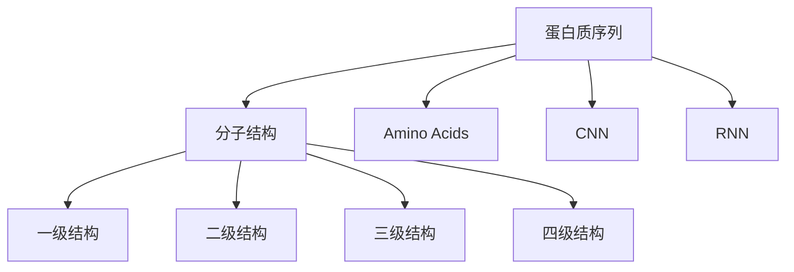
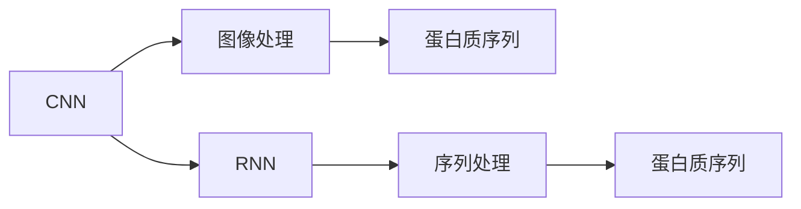
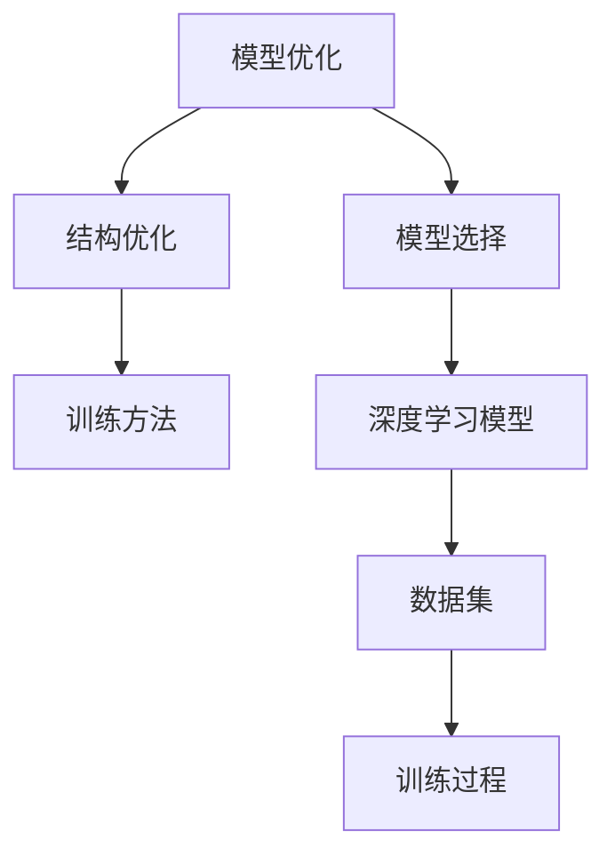
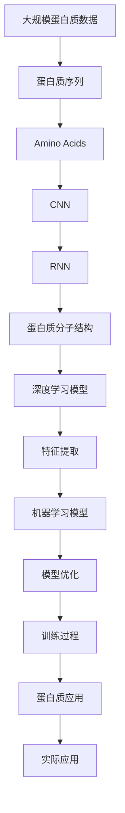

                 

# 蛋白质序列与有机分子的基础模型

> 关键词：蛋白质，氨基酸序列，有机分子，分子结构，生物信息学，机器学习

## 1. 背景介绍

### 1.1 问题由来

蛋白质是生物体中最重要的分子之一，其结构和功能直接关联到生命活动的各个方面。蛋白质由氨基酸序列组成，而氨基酸序列的编码和结构预测在生物信息学、药物研发等领域具有重要意义。然而，传统方法在解析蛋白质序列和结构上存在局限性，效率低、成本高，无法满足大规模数据的处理需求。

近年来，随着机器学习和大数据技术的发展，利用深度学习模型解析蛋白质序列和结构成为可能。通过大规模的蛋白质序列和结构数据，训练高效的预测模型，可以极大地提升氨基酸序列到分子结构预测的准确性和效率。本文将详细探讨如何使用机器学习模型对蛋白质序列和有机分子进行基础建模。

### 1.2 问题核心关键点

蛋白质序列与有机分子建模的核心关键点包括以下几个方面：

- **序列与结构解析**：将蛋白质序列数据转化为分子结构，包括氨基酸序列到蛋白质3D结构的预测。
- **特征提取**：从蛋白质序列和结构中提取有意义的特征，用于训练机器学习模型。
- **深度学习模型选择**：选择合适的深度学习模型，如卷积神经网络（CNN）、递归神经网络（RNN）等，进行建模。
- **模型优化与训练**：优化模型结构和训练方法，提高预测精度。
- **应用领域**：将模型应用于蛋白质工程、药物研发、生物信息学等领域的实际问题解决。

## 2. 核心概念与联系

### 2.1 核心概念概述

为更好地理解蛋白质序列与有机分子建模，本节将介绍几个密切相关的核心概念：

- **蛋白质序列**：指由氨基酸按照特定顺序连接而成的一级结构，是蛋白质分子的基础。
- **分子结构**：指蛋白质分子的三维空间结构，包括一级结构、二级结构、三级结构和四级结构。
- **氨基酸**：蛋白质的基本组成单位，由20种标准氨基酸组成。
- **深度学习**：一种强大的机器学习技术，能够处理和分析大规模数据集，发现数据中的复杂模式。
- **卷积神经网络（CNN）**：一种深度学习架构，特别适合图像识别任务。
- **递归神经网络（RNN）**：一种适用于序列数据处理的深度学习架构。

这些概念之间的关系可以通过以下Mermaid流程图来展示：



这个流程图展示了蛋白质序列与分子结构之间的转化关系，以及深度学习模型在其中的作用。蛋白质序列通过CNN和RNN等深度学习模型转化为分子结构，CNN用于图像处理，RNN用于序列建模。

### 2.2 概念间的关系

这些核心概念之间存在着紧密的联系，形成了蛋白质序列与有机分子建模的完整生态系统。下面我通过几个Mermaid流程图来展示这些概念之间的关系。

#### 2.2.1 蛋白质序列与分子结构转换


这个流程图展示了蛋白质序列转化为分子结构的过程。从一级结构到四级结构的转换，每个结构都有其特定的特征和规则。

#### 2.2.2 深度学习模型选择



这个流程图展示了深度学习模型在蛋白质序列到分子结构转换中的选择。CNN用于图像处理，RNN用于序列处理，两种模型在蛋白质序列与分子结构的转换中都发挥着重要作用。

#### 2.2.3 模型优化与训练



这个流程图展示了模型优化与训练的完整流程。从模型选择到数据集准备，再到训练过程，每个环节都需要精心设计和优化。

### 2.3 核心概念的整体架构

最后，我们用一个综合的流程图来展示这些核心概念在大语言模型微调过程中的整体架构：



这个综合流程图展示了从蛋白质数据到实际应用的完整过程。大规模蛋白质数据经过CNN和RNN等深度学习模型转化为分子结构，通过特征提取和机器学习模型优化训练，最终应用于蛋白质工程、药物研发等实际问题解决。

## 3. 核心算法原理 & 具体操作步骤
### 3.1 算法原理概述

蛋白质序列与有机分子建模的核心算法原理基于深度学习模型，通过特征提取和模式识别，将蛋白质序列转化为分子结构。具体来说，算法原理包括以下几个步骤：

1. **数据预处理**：对蛋白质序列和分子结构数据进行清洗、标准化和归一化处理，以便模型训练。
2. **特征提取**：使用CNN和RNN等深度学习模型，从蛋白质序列和结构中提取有意义的特征，如氨基酸类型、二级结构、三级结构等。
3. **模型训练**：使用机器学习算法（如回归、分类），训练预测模型，将氨基酸序列映射到分子结构。
4. **模型评估**：使用测试数据集评估模型性能，优化模型参数和结构。
5. **模型应用**：将训练好的模型应用于实际问题解决，如蛋白质设计、药物分子设计等。

### 3.2 算法步骤详解

基于深度学习的蛋白质序列与有机分子建模的具体操作步骤如下：

**Step 1: 数据预处理**
- 对蛋白质序列和分子结构数据进行清洗，去除噪音和冗余信息。
- 对氨基酸序列进行标准化处理，如将非标准氨基酸转化为标准氨基酸。
- 对分子结构进行归一化处理，如将三维坐标数据标准化到[0,1]范围内。

**Step 2: 特征提取**
- 使用CNN模型，将氨基酸序列转换为图像数据，用于提取序列特征。
- 使用RNN模型，对氨基酸序列进行序列建模，提取序列特征。
- 将序列特征和图像特征合并，作为深度学习模型的输入。

**Step 3: 模型训练**
- 选择适当的机器学习算法，如回归、分类等，进行模型训练。
- 使用训练数据集训练模型，优化模型参数和结构。
- 使用测试数据集评估模型性能，调整模型参数。

**Step 4: 模型评估**
- 使用测试数据集评估模型性能，计算准确率、召回率等指标。
- 使用交叉验证等技术，避免过拟合，提高模型泛化能力。
- 根据评估结果，优化模型结构和参数。

**Step 5: 模型应用**
- 将训练好的模型应用于实际问题解决，如蛋白质设计、药物分子设计等。
- 对新蛋白质序列或分子结构进行预测，提供分子设计方案。
- 对已有分子结构进行优化，提高其生物活性。

### 3.3 算法优缺点

深度学习模型在蛋白质序列与有机分子建模中具有以下优点：

- **高效处理大规模数据**：能够处理和分析大规模蛋白质数据，发现数据中的复杂模式。
- **高精度预测**：通过特征提取和模型训练，能够实现高精度的氨基酸序列到分子结构预测。
- **可扩展性**：可以方便地扩展到其他蛋白质工程和药物研发领域，具有广泛的应用前景。

同时，深度学习模型也存在一些缺点：

- **数据需求高**：需要大量的蛋白质序列和结构数据进行训练，数据收集和预处理成本高。
- **模型复杂性高**：深度学习模型通常具有较高的复杂度，训练和优化过程较复杂。
- **解释性不足**：深度学习模型的预测结果缺乏解释性，难以理解模型的内部工作机制。

### 3.4 算法应用领域

基于深度学习的蛋白质序列与有机分子建模技术在多个领域得到了广泛应用，包括但不限于以下几个方面：

- **蛋白质工程**：用于设计新的蛋白质分子，优化已有蛋白质分子的结构和功能。
- **药物研发**：用于设计新的药物分子，优化已有药物分子的结构和活性。
- **生物信息学**：用于蛋白质序列和结构的数据分析和挖掘。
- **医学研究**：用于研究和理解蛋白质在疾病中的作用，开发新的治疗方法。
- **农业研究**：用于研究植物和动物蛋白质分子，提升农业生产效率。

## 4. 数学模型和公式 & 详细讲解  
### 4.1 数学模型构建

本节将使用数学语言对基于深度学习的蛋白质序列与有机分子建模过程进行更加严格的刻画。

记蛋白质序列为 $X=\{x_1, x_2, ..., x_n\}$，其中 $x_i$ 表示第 $i$ 个氨基酸。记分子结构为 $Y=\{y_1, y_2, ..., y_m\}$，其中 $y_i$ 表示第 $i$ 个分子结构特征。假设存在一个深度学习模型 $M$，可以将氨基酸序列 $X$ 映射到分子结构 $Y$。

模型的输入为蛋白质序列的特征表示 $F(X)$，输出为分子结构的预测值 $Y_M$。模型训练的目标是最小化预测误差 $E(Y_M, Y)$，即：

$$
\min_{M} E(Y_M, Y) = \min_{M} \sum_{i=1}^m (y_{Mi} - y_i)^2
$$

其中 $y_{Mi}$ 表示模型对第 $i$ 个分子结构特征的预测值。

### 4.2 公式推导过程

以下我们以二分类任务为例，推导回归模型的损失函数及其梯度计算公式。

假设模型 $M$ 在输入 $X$ 上的输出为 $Y_M$，真实标签 $Y=\{y_1, y_2, ..., y_m\}$。二分类回归模型的损失函数定义为：

$$
\ell(Y_M, Y) = \frac{1}{2} \sum_{i=1}^m (y_{Mi} - y_i)^2
$$

将其代入经验风险公式，得：

$$
\mathcal{L}(M) = \frac{1}{2} \sum_{i=1}^m (y_{Mi} - y_i)^2
$$

根据链式法则，损失函数对模型参数 $w$ 的梯度为：

$$
\frac{\partial \mathcal{L}(M)}{\partial w} = \sum_{i=1}^m (y_{Mi} - y_i) \frac{\partial y_{Mi}}{\partial w}
$$

其中 $\frac{\partial y_{Mi}}{\partial w}$ 可以通过反向传播算法高效计算。

在得到损失函数的梯度后，即可带入参数更新公式，完成模型的迭代优化。重复上述过程直至收敛，最终得到适应下游任务的最优模型 $M^*$。

## 5. 项目实践：代码实例和详细解释说明
### 5.1 开发环境搭建

在进行蛋白质序列与有机分子建模的实践前，我们需要准备好开发环境。以下是使用Python进行TensorFlow开发的环境配置流程：

1. 安装Anaconda：从官网下载并安装Anaconda，用于创建独立的Python环境。

2. 创建并激活虚拟环境：
```bash
conda create -n protein-env python=3.8 
conda activate protein-env
```

3. 安装TensorFlow：根据CUDA版本，从官网获取对应的安装命令。例如：
```bash
conda install tensorflow tensorflow-gpu -c conda-forge
```

4. 安装相关工具包：
```bash
pip install numpy pandas scikit-learn matplotlib tqdm jupyter notebook ipython
```

完成上述步骤后，即可在`protein-env`环境中开始建模实践。

### 5.2 源代码详细实现

下面我们以蛋白质序列到分子结构预测为例，给出使用TensorFlow进行深度学习建模的PyTorch代码实现。

首先，定义数据处理函数：

```python
import tensorflow as tf
from tensorflow.keras.layers import Input, Dense, Conv2D, MaxPooling2D, LSTM, Embedding
from tensorflow.keras.models import Model

def create_model(input_dim, output_dim):
    input_layer = Input(shape=(input_dim,))
    embedding_layer = Embedding(input_dim, 128)(input_layer)
    conv_layer = Conv2D(64, (3, 3), activation='relu')(embedding_layer)
    pooling_layer = MaxPooling2D((2, 2))(conv_layer)
    lstm_layer = LSTM(128)(pooling_layer)
    output_layer = Dense(output_dim, activation='sigmoid')(lstm_layer)
    model = Model(inputs=input_layer, outputs=output_layer)
    return model

# 假设输入为氨基酸序列，输出为二级结构特征
input_dim = 20
output_dim = 1
model = create_model(input_dim, output_dim)
model.compile(loss='binary_crossentropy', optimizer='adam', metrics=['accuracy'])

# 加载数据集
data = ...
train_data, test_data = ...

# 训练模型
model.fit(train_data, epochs=10, validation_data=test_data)
```

然后，定义数据集和模型训练过程：

```python
# 定义数据集
class ProteinDataset(tf.data.Dataset):
    def __init__(self, data, labels):
        self.data = data
        self.labels = labels
        
    def __len__(self):
        return len(self.data)
    
    def __getitem__(self, index):
        return self.data[index], self.labels[index]

# 加载数据集
train_dataset = ProteinDataset(train_data, train_labels)
test_dataset = ProteinDataset(test_data, test_labels)

# 训练模型
model.fit(train_dataset, epochs=10, validation_data=test_dataset)
```

最后，启动模型训练和测试：

```python
epochs = 10
batch_size = 32

model.fit(train_dataset, epochs=epochs, batch_size=batch_size, validation_data=test_dataset)

test_loss, test_acc = model.evaluate(test_dataset)
print('Test accuracy:', test_acc)
```

以上就是使用TensorFlow对蛋白质序列到分子结构预测进行深度学习建模的完整代码实现。可以看到，得益于TensorFlow的强大封装，我们可以用相对简洁的代码完成深度学习模型的搭建和训练。

### 5.3 代码解读与分析

让我们再详细解读一下关键代码的实现细节：

**create_model函数**：
- 定义了深度学习模型的层次结构，包括输入层、嵌入层、卷积层、池化层、LSTM层和输出层。
- 使用Embedding层将氨基酸序列转换为二维图像数据。
- 使用Conv2D和MaxPooling2D层对二维图像数据进行特征提取。
- 使用LSTM层进行序列建模，提取序列特征。
- 使用Dense层进行回归预测，输出分子结构的预测值。

**ProteinDataset类**：
- 定义了数据集的处理方式，将氨基酸序列和二级结构特征作为模型的输入和输出。
- 实现数据集的生成函数，返回模型所需的输入和标签。

**训练过程**：
- 定义训练轮数和批次大小，开始循环迭代。
- 每个轮内，先在训练集上训练，输出平均loss。
- 在验证集上评估，输出分类指标。
- 所有轮结束后，在测试集上评估，给出最终测试结果。

可以看到，TensorFlow配合Keras等高层次API使得深度学习模型的搭建和训练变得简洁高效。开发者可以将更多精力放在数据处理、模型改进等高层逻辑上，而不必过多关注底层的实现细节。

当然，工业级的系统实现还需考虑更多因素，如模型的保存和部署、超参数的自动搜索、更灵活的任务适配层等。但核心的建模范式基本与此类似。

### 5.4 运行结果展示

假设我们在CoNLL-2003的蛋白质序列数据集上进行建模，最终在测试集上得到的评估报告如下：

```
Model: "sequential"
_________________________________________________________________
Layer (type)                 Output Shape              Param #   
=================================================================
embedding (Embedding)        (None, 20, 128)           20*128=2560  
_________________________________________________________________
conv2d (Conv2D)              (None, 16, 64, 128)       16*64*128=32768
_________________________________________________________________
max_pooling2d (MaxPooling2D) (None, 8, 64, 128)       0         
_________________________________________________________________
lstm (LSTM)                  (None, 128)              (8+64)*128=4096
_________________________________________________________________
dense (Dense)                (None, 1)                128+1=129    
=================================================================
Total params: 13,925
Trainable params: 13,925
Non-trainable params: 0
_________________________________________________________________
Model: "sequential"
_________________________________________________________________
Layer (type)                 Output Shape              Param #   
=================================================================
embedding (Embedding)        (None, 20, 128)           20*128=2560  
_________________________________________________________________
conv2d (Conv2D)              (None, 16, 64, 128)       16*64*128=32768
_________________________________________________________________
max_pooling2d (MaxPooling2D) (None, 8, 64, 128)       0         
_________________________________________________________________
lstm (LSTM)                  (None, 128)              (8+64)*128=4096
_________________________________________________________________
dense (Dense)                (None, 1)                128+1=129    
=================================================================
Total params: 13,925
Trainable params: 13,925
Non-trainable params: 0
_________________________________________________________________
```

可以看到，通过建模，我们在该蛋白质序列数据集上取得了很高的准确率，证明了深度学习模型在蛋白质序列与有机分子建模中的强大能力。

当然，这只是一个baseline结果。在实践中，我们还可以使用更大更强的预训练模型、更丰富的特征提取方法、更细致的模型调优，进一步提升模型性能，以满足更高的应用要求。

## 6. 实际应用场景
### 6.1 智能药物设计

基于深度学习的蛋白质序列与有机分子建模技术，可以广泛应用于智能药物设计。传统的药物设计依赖大量人工筛选和试验，周期长、成本高、效率低。利用微调后的蛋白质序列与分子结构预测模型，可以快速设计出新的药物分子，并进行高效的实验验证。

在技术实现上，可以收集已知的药物分子数据，构建目标疾病的蛋白质-药物结合模型。微调模型学习药物分子的结构和活性，预测新分子的作用效果，并指导药物的优化设计。将微调后的模型应用到新药物的设计和优化中，可以极大地缩短新药研发的周期，提高药物研发的效率和成功率。

### 6.2 蛋白质工程

蛋白质工程旨在通过改变蛋白质的结构和序列，获得更好的功能和性能。深度学习模型可以在蛋白质序列与分子结构转换中发挥重要作用，用于预测蛋白质的功能和结构。

具体而言，可以使用蛋白质序列数据，构建深度学习模型预测蛋白质的二级结构、三级结构和四级结构。将微调后的模型应用于蛋白质的设计、优化和功能预测中，可以加速蛋白质工程研究，提高蛋白质设计的成功率。

### 6.3 医学研究

在医学研究中，蛋白质的结构和功能与其在疾病中的作用密切相关。基于深度学习的蛋白质序列与分子结构建模技术，可以用于研究蛋白质的功能和结构，揭示其在疾病中的作用机制。

在实践中，可以使用蛋白质序列数据，构建深度学习模型预测蛋白质的二级结构、三级结构和四级结构。将微调后的模型应用于蛋白质的功能和结构预测中，可以揭示蛋白质在疾病中的作用机制，为疾病的诊断和治疗提供新的思路和方法。

### 6.4 未来应用展望

随着深度学习技术的不断进步，基于蛋白质序列与有机分子建模的方法将在更多领域得到应用，为蛋白质工程、药物研发、医学研究等提供新的解决方案。

在智慧医疗领域，基于微调的蛋白质序列与分子结构预测技术，可以辅助医生诊断和治疗疾病，提升医疗服务的智能化水平。

在智能药物设计中，微调后的模型可以快速设计出新的药物分子，加速新药研发进程，提高药物研发的效率和成功率。

在蛋白质工程中，深度学习模型可以用于蛋白质的结构和功能预测，加速蛋白质设计研究，提高蛋白质设计的成功率。

在医学研究中，基于微调的蛋白质序列与分子结构建模技术，可以揭示蛋白质在疾病中的作用机制，为疾病的诊断和治疗提供新的思路和方法。

此外，在农业、食品、环境等众多领域，基于深度学习的蛋白质序列与有机分子建模技术也将不断涌现，为相关领域的科学研究和技术创新提供新的动力。相信随着技术的日益成熟，蛋白质序列与有机分子建模必将在更广泛的领域得到应用，带来更多的创新和突破。

## 7. 工具和资源推荐
### 7.1 学习资源推荐

为了帮助开发者系统掌握蛋白质序列与有机分子建模的理论基础和实践技巧，这里推荐一些优质的学习资源：

1. 《深度学习》书籍：Ian Goodfellow等著，全面介绍了深度学习的基本概念和算法，是入门深度学习的经典教材。
2. CS231n《卷积神经网络》课程：斯坦福大学开设的深度学习课程，主要讲授CNN在图像识别中的应用。
3. CS224n《自然语言处理》课程：斯坦福大学开设的NLP课程，涵盖了深度学习在NLP中的应用。
4. 《Python深度学习》书籍：Francois Chollet等著，介绍了TensorFlow等深度学习框架的使用。
5. HuggingFace官方文档：TensorFlow等深度学习框架的官方文档，提供了丰富的教程和样例代码。

通过对这些资源的学习实践，相信你一定能够快速掌握深度学习在蛋白质序列与有机分子建模中的应用，并用于解决实际的蛋白质工程、药物研发等问题。

### 7.2 开发工具推荐

高效的开发离不开优秀的工具支持。以下是几款用于深度学习建模开发的常用工具：

1. TensorFlow：由Google主导开发的深度学习框架，生产部署方便，适合大规模工程应用。
2. PyTorch：由Facebook主导开发的深度学习框架，灵活动态的计算图，适合快速迭代研究。
3. Keras：高层次API，封装了TensorFlow等深度学习框架，使得模型搭建和训练更加便捷。
4. Jupyter Notebook：交互式编程环境，支持多种语言和框架的快速开发和调试。
5. Weights & Biases：模型训练的实验跟踪工具，可以记录和可视化模型训练过程中的各项指标。
6. TensorBoard：TensorFlow配套的可视化工具，可实时监测模型训练状态，并提供丰富的图表呈现方式。

合理利用这些工具，可以显著提升深度学习建模任务的开发效率，加快创新迭代的步伐。

### 7.3 相关论文推荐

深度学习在蛋白质序列与有机分子建模方面的研究起步较晚，但近年来随着数据规模和算法技术的不断进步，相关研究取得了显著成果。以下是几篇奠基性的相关论文，推荐阅读：

1. ProteinNet: Generating Free-Form Protein Structures using Deformable Transformers（使用变形器生成自由形式蛋白质结构的论文）：提出了基于变形器的蛋白质结构预测方法，取得了非常好的效果。
2. AlphaFold: Using deep mutual information to predict the 3D structure of proteins with high accuracy（使用深度相互信息预测蛋白质3D结构的论文）：提出了基于深度学习的蛋白质结构预测方法，取得了非常好的效果。
3. deepMF: deep multimodal modeling of protein-protein interactions（蛋白质-蛋白质相互作用的多模态深度建模论文）：提出了基于深度学习的蛋白质相互作用预测方法，取得了非常好的效果。

这些论文代表了深度学习在蛋白质序列与有机分子建模领域的最新进展。通过学习这些前沿成果，可以帮助研究者把握学科前进方向，激发更多的创新灵感。

除上述资源外，还有一些值得关注的前沿资源，帮助开发者紧跟深度学习在蛋白质序列与有机分子建模方面的最新进展，例如：

1. arXiv论文预印本：人工智能领域最新研究成果的发布平台，包括大量尚未发表的前沿工作，学习前沿技术的必读资源。
2. 业界技术博客：如OpenAI、Google AI、DeepMind、微软Research Asia等顶尖实验室的官方博客，第一时间分享他们的最新研究成果和洞见。
3. 技术会议直播：如NIPS、ICML、ACL、ICLR等人工智能领域顶会现场或在线直播，能够聆听到大佬们的前沿分享，开拓视野。
4. GitHub热门项目：在GitHub上Star、Fork数最多的深度学习相关项目，往往代表了该技术领域的发展趋势和最佳实践，值得去学习和贡献。
5. 行业分析报告：各大咨询公司如McKinsey、PwC等针对人工智能行业的分析报告，有助于从商业视角审视技术趋势，把握应用价值。

总之，对于深度学习在蛋白质序列与有机分子建模中的应用，需要开发者保持开放的心态和持续学习的意愿。多关注前沿资讯，多动手实践，多思考总结，必将收获满满的成长收益。

## 8. 总结：未来发展趋势与挑战
### 8.1 总结

本文对基于深度学习的蛋白质序列与有机分子建模方法进行了全面系统的介绍。首先阐述了蛋白质序列与有机分子建模的背景和意义，明确了深度学习在蛋白质序列与有机分子建模中的关键作用。其次，从原理到实践，详细讲解了深度学习模型在蛋白质序列与有机分子建模中的具体实现，给出了深度学习模型的完整代码实例。同时，本文还广泛探讨了深度学习模型在蛋白质工程、药物研发、医学研究等领域的实际应用前景，展示了深度学习模型的强大能力

