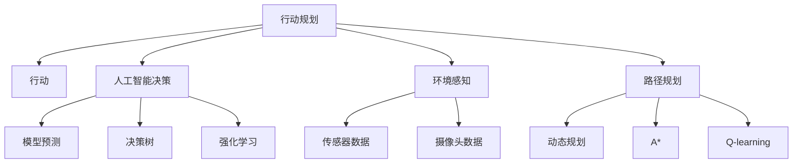
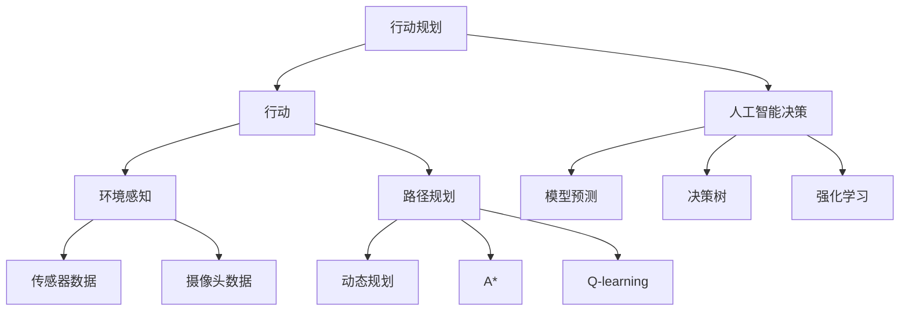
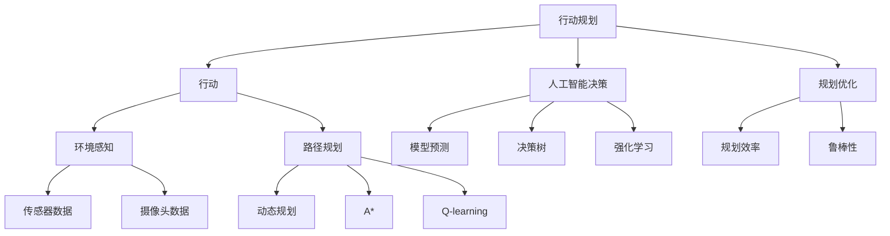

                 

# 行动（Action）是指基于环境和规划做出的动作

> 关键词：行动, 行动规划, 人工智能决策, 环境感知, 规划优化, 机器人, 无人驾驶, 路径规划

## 1. 背景介绍

在现代信息科技的推动下，行动在各个领域中扮演着至关重要的角色。无论是智能机器人、自动驾驶汽车，还是无人机、物流配送，行动技术已经深入到社会的方方面面，成为改变我们生活的重要力量。

然而，如何高效、安全、灵活地执行行动，一直是行动系统设计的核心问题。特别在复杂多变的环境下，如何使行动系统具备高度的自主性和适应性，成为了技术攻关的关键。

本文将深入探讨行动的原理与实践，为读者提供关于行动规划与执行的全面解析。

## 2. 核心概念与联系

### 2.1 核心概念概述

为更好地理解行动的原理与实践，本节将介绍几个紧密相关的核心概念：

- **行动（Action）**：指代理（如机器人、无人驾驶车辆）在环境中执行的物理操作或决策。行动可以是简单的，比如移动或转向，也可以是复杂的，比如路径规划、任务调度等。

- **行动规划（Action Planning）**：指通过计算和规划，确定实现目标所需的行动序列。行动规划是行动执行的基础，涉及状态估计、路径优化、任务分配等多方面技术。

- **人工智能决策（AI Decision Making）**：指利用人工智能技术，在复杂环境中自动做出最优或近似最优的决策。包括模型预测、决策树、强化学习等多种方法。

- **环境感知（Environment Perception）**：指行动系统对周围环境的实时监测与理解。通过传感器、摄像头等手段，提取环境中的各类信息，如地形、障碍、目标等。

- **路径规划（Path Planning）**：指在环境中找到一条最优路径，使行动系统能够高效、安全地完成目标任务。路径规划是行动规划的关键组成部分。

- **规划优化（Planning Optimization）**：指在行动规划中，通过优化算法和数学模型，提升规划效率和鲁棒性。规划优化方法包括动态规划、A*、Q-learning等。

这些核心概念之间的关系，通过以下Mermaid流程图来展示：



这个流程图展示了大行动系统的核心概念及其之间的关系：

1. 行动系统首先通过行动规划确定行动序列。
2. 行动规划依赖于人工智能决策，帮助系统做出最优或近似最优的决策。
3. 决策需要环境感知提供的环境信息支持。
4. 路径规划是行动规划中的关键部分，用于寻找最优路径。
5. 规划优化则通过多种算法提升规划效率和鲁棒性。

这些概念共同构成了行动系统的技术框架，使行动系统能够在各种复杂场景下执行任务。通过理解这些核心概念，我们可以更好地把握行动系统的工作原理和优化方向。

### 2.2 概念间的关系

这些核心概念之间存在着紧密的联系，形成了行动系统的完整生态系统。下面我们通过几个Mermaid流程图来展示这些概念之间的关系。

#### 2.2.1 行动系统的整体架构



这个综合流程图展示了行动系统的完整架构：

1. 行动规划模块通过人工智能决策获取目标和策略。
2. 决策依赖于环境感知提供的环境数据。
3. 路径规划模块提供最优路径。
4. 规划优化通过动态规划、A*、Q-learning等算法提升规划效率。
5. 最终，行动系统通过执行预定的行动序列，完成任务。

### 2.3 核心概念的整体架构

最后，我们用一个综合的流程图来展示这些核心概念在大行动系统中的整体架构：



这个综合流程图展示了行动系统的整体架构：

1. 行动规划模块通过人工智能决策获取目标和策略。
2. 决策依赖于环境感知提供的环境数据。
3. 路径规划模块提供最优路径。
4. 规划优化通过动态规划、A*、Q-learning等算法提升规划效率。
5. 最终，行动系统通过执行预定的行动序列，完成任务。

通过这些流程图，我们可以更清晰地理解行动系统的各个组成部分及其相互关系，为深入讨论具体的行动规划与执行方法奠定基础。

## 3. 核心算法原理 & 具体操作步骤
### 3.1 算法原理概述

大行动系统的核心算法原理主要涉及行动规划、路径规划、人工智能决策和规划优化。以下是这些核心算法的详细解析：

- **行动规划**：指通过计算和规划，确定实现目标所需的行动序列。行动规划是行动执行的基础，涉及状态估计、路径优化、任务分配等多方面技术。

- **路径规划**：指在环境中找到一条最优路径，使行动系统能够高效、安全地完成目标任务。路径规划是行动规划的关键组成部分。

- **人工智能决策**：指利用人工智能技术，在复杂环境中自动做出最优或近似最优的决策。包括模型预测、决策树、强化学习等多种方法。

- **规划优化**：指在行动规划中，通过优化算法和数学模型，提升规划效率和鲁棒性。规划优化方法包括动态规划、A*、Q-learning等。

### 3.2 算法步骤详解

#### 3.2.1 行动规划

行动规划的一般步骤如下：

1. **状态估计**：通过传感器和摄像头等设备，获取环境中的实时数据，如地形、障碍、目标等。
2. **任务分解**：将复杂的任务分解成若干个子任务，并确定各子任务之间的关系和优先级。
3. **状态表示**：将环境状态和任务信息转换成行动规划系统能够处理的格式，如状态空间、状态转移图等。
4. **路径搜索**：在状态空间中，通过搜索算法（如A*、D*）寻找最优路径。
5. **任务调度**：根据路径搜索结果，进行任务调度，确定各子任务的执行顺序和时间分配。
6. **行动执行**：根据任务调度的结果，执行预定的行动序列，完成目标任务。

#### 3.2.2 路径规划

路径规划的主要步骤如下：

1. **环境建模**：建立环境模型，包括地形、障碍物、目标等。
2. **路径生成**：通过算法（如Dijkstra、A*、Q-learning）生成路径。
3. **路径优化**：对生成的路径进行优化，如避免碰撞、缩短距离等。
4. **路径验证**：对优化后的路径进行验证，确保路径可行和安全性。
5. **路径执行**：根据优化后的路径，执行行动系统，完成任务。

#### 3.2.3 人工智能决策

人工智能决策的主要步骤如下：

1. **数据采集**：通过传感器和摄像头等设备，采集环境数据。
2. **特征提取**：对采集到的数据进行特征提取，如颜色、形状、纹理等。
3. **模型预测**：利用预训练模型或自定义模型，对环境数据进行预测，如目标类别、障碍类型等。
4. **决策生成**：根据预测结果，生成决策树或利用强化学习算法生成决策。
5. **决策执行**：根据决策结果，执行预定的行动序列，完成任务。

#### 3.2.4 规划优化

规划优化的一般步骤如下：

1. **模型建立**：建立数学模型，描述行动规划的优化目标和约束条件。
2. **算法选择**：选择合适的优化算法，如动态规划、A*、Q-learning等。
3. **参数设置**：设置算法的参数，如初始值、迭代次数等。
4. **迭代优化**：通过迭代计算，逐步优化目标函数，找到最优解。
5. **结果验证**：对优化结果进行验证，确保其满足约束条件。
6. **执行优化**：根据优化结果，执行行动系统，完成任务。

### 3.3 算法优缺点

#### 3.3.1 行动规划

**优点**：

- **灵活性高**：可以处理多种复杂的任务和环境。
- **适应性强**：能够适应环境的变化和不确定性。
- **精确度高**：通过优化算法，可以生成高质量的路径。

**缺点**：

- **计算量大**：需要大量的计算资源和时间。
- **复杂度高**：状态空间和决策空间巨大，导致算法复杂。
- **实时性差**：在某些情况下，可能需要较长时间进行路径搜索和优化。

#### 3.3.2 路径规划

**优点**：

- **精度高**：能够生成高质量的路径。
- **实时性强**：可以快速生成路径并执行。
- **鲁棒性好**：能够处理复杂多变的环境。

**缺点**：

- **计算复杂**：在某些情况下，可能需要较长时间进行路径优化。
- **难以处理动态环境**：在动态环境中，路径可能不具有鲁棒性。

#### 3.3.3 人工智能决策

**优点**：

- **精度高**：利用深度学习和强化学习，可以生成高质量的决策。
- **灵活性强**：可以处理多种复杂任务和环境。
- **实时性好**：可以快速生成决策并执行。

**缺点**：

- **数据需求高**：需要大量的标注数据和计算资源。
- **模型复杂**：深度学习和强化学习的模型往往复杂度高，难以解释。
- **鲁棒性差**：在复杂环境中，模型的鲁棒性可能较差。

#### 3.3.4 规划优化

**优点**：

- **精度高**：通过优化算法，可以生成高质量的路径和决策。
- **灵活性好**：可以处理多种复杂任务和环境。
- **鲁棒性好**：可以处理复杂多变的环境。

**缺点**：

- **计算量大**：需要大量的计算资源和时间。
- **复杂度高**：优化算法复杂，需要精心设计。
- **实时性差**：在某些情况下，可能需要较长时间进行优化。

### 3.4 算法应用领域

基于行动规划、路径规划、人工智能决策和规划优化的算法，已经在多个领域得到广泛应用：

- **智能机器人**：用于路径规划、任务调度、导航和避障。
- **自动驾驶**：用于路径规划、交通决策、交通标志识别。
- **无人机**：用于路径规划、目标跟踪、自动起飞降落。
- **物流配送**：用于路径规划、交通优化、动态调度。
- **农业机器人**：用于田间导航、作物识别、农业生产管理。

## 4. 数学模型和公式 & 详细讲解 & 举例说明

### 4.1 数学模型构建

行动规划和路径规划的核心数学模型主要包括状态空间模型、动作空间模型和奖励函数模型。

#### 4.1.1 状态空间模型

状态空间模型描述了行动系统的环境状态，由多个状态变量组成。每个状态变量表示环境中的一个特征，如位置、方向、速度等。状态空间模型可以用向量表示，如：

$$
\text{State} = \begin{bmatrix} x \\ y \\ \theta \end{bmatrix}
$$

其中，$x$ 和 $y$ 表示行动系统的位置，$\theta$ 表示行动系统的方向。

#### 4.1.2 动作空间模型

动作空间模型描述了行动系统在每个状态中可以执行的行动。每个行动表示为一个向量，如：

$$
\text{Action} = \begin{bmatrix} a_x \\ a_y \\ a_{\theta} \end{bmatrix}
$$

其中，$a_x$ 和 $a_y$ 表示行动系统在 $x$ 和 $y$ 方向上的速度，$a_{\theta}$ 表示行动系统的旋转速度。

#### 4.1.3 奖励函数模型

奖励函数模型描述了行动系统在每个状态下的奖励值。奖励值表示行动系统的目标实现程度，如：

$$
\text{Reward} = \sum_{t=0}^{T-1} r_t
$$

其中，$r_t$ 表示在第 $t$ 时刻的奖励值，$T$ 表示总时间步数。

### 4.2 公式推导过程

#### 4.2.1 状态转移方程

状态转移方程描述了行动系统从当前状态转移到下一状态的过程。假设行动系统在当前状态为 $s_t$，执行行动 $a_t$，则状态转移方程为：

$$
s_{t+1} = f(s_t, a_t)
$$

其中，$f$ 表示状态转移函数。在实际应用中，状态转移函数可以通过传感器和摄像头等设备获取环境数据，结合路径规划算法计算得到。

#### 4.2.2 路径规划算法

路径规划算法用于生成最优路径。以A*算法为例，其路径规划过程如下：

1. **初始化**：设置起点 $s_0$ 和终点 $s_T$，定义启发函数 $h(s)$。
2. **开放集**：将起点 $s_0$ 加入开放集 $O$。
3. **关闭集**：将起点 $s_0$ 加入关闭集 $C$。
4. **扩展**：从开放集 $O$ 中取出 $s_{t^*}$，若 $s_{t^*} = s_T$，则路径规划完成。否则，计算 $s_{t^*}$ 的邻居节点 $s_{t+1}$，若 $s_{t+1}$ 不在关闭集 $C$ 中，则将 $s_{t+1}$ 加入开放集 $O$，并计算 $s_{t+1}$ 的 $g$ 值和 $h$ 值。
5. **更新**：若 $g(s_{t+1}) < g(s_{t^*})$，则将 $s_{t^*}$ 从开放集 $O$ 中移除，并加入关闭集 $C$，更新 $g$ 值。
6. **重复**：重复步骤4-5，直至找到终点 $s_T$。

#### 4.2.3 强化学习算法

强化学习算法用于生成最优决策。以Q-learning算法为例，其决策生成过程如下：

1. **初始化**：设置状态空间 $S$ 和动作空间 $A$，定义状态价值函数 $Q(s,a)$。
2. **探索**：从状态空间 $S$ 中随机选择一个状态 $s_t$，从动作空间 $A$ 中随机选择一个动作 $a_t$。
3. **交互**：根据动作 $a_t$，执行行动，获得状态 $s_{t+1}$ 和奖励 $r_t$。
4. **更新**：根据动作 $a_t$，更新状态价值函数 $Q(s_t,a_t)$。
5. **重复**：重复步骤2-4，直至达到终止状态。

### 4.3 案例分析与讲解

#### 4.3.1 智能机器人路径规划

假设智能机器人需要在仓库中搬运货物，路径规划的数学模型如下：

- **状态空间**：机器人的位置和方向，用向量 $\text{State} = \begin{bmatrix} x \\ y \\ \theta \end{bmatrix}$ 表示。
- **动作空间**：机器人的移动方向和速度，用向量 $\text{Action} = \begin{bmatrix} a_x \\ a_y \\ a_{\theta} \end{bmatrix}$ 表示。
- **奖励函数**：根据机器人的位置和方向，计算其与目标位置的距离，奖励函数 $r = 1/d$，其中 $d$ 表示目标位置和当前位置之间的距离。

路径规划算法使用A*算法，步骤如下：

1. **初始化**：设置起点 $s_0$ 和终点 $s_T$，定义启发函数 $h(s) = \frac{1}{d}$。
2. **开放集**：将起点 $s_0$ 加入开放集 $O$。
3. **关闭集**：将起点 $s_0$ 加入关闭集 $C$。
4. **扩展**：从开放集 $O$ 中取出 $s_{t^*}$，若 $s_{t^*} = s_T$，则路径规划完成。否则，计算 $s_{t^*}$ 的邻居节点 $s_{t+1}$，若 $s_{t+1}$ 不在关闭集 $C$ 中，则将 $s_{t+1}$ 加入开放集 $O$，并计算 $s_{t+1}$ 的 $g$ 值和 $h$ 值。
5. **更新**：若 $g(s_{t+1}) < g(s_{t^*})$，则将 $s_{t^*}$ 从开放集 $O$ 中移除，并加入关闭集 $C$，更新 $g$ 值。
6. **重复**：重复步骤4-5，直至找到终点 $s_T$。

#### 4.3.2 自动驾驶路径规划

自动驾驶的路径规划问题可以建模为图搜索问题。假设自动驾驶车辆需要在高速公路上行驶，路径规划的数学模型如下：

- **状态空间**：车辆的位置和方向，用向量 $\text{State} = \begin{bmatrix} x \\ y \\ \theta \end{bmatrix}$ 表示。
- **动作空间**：车辆的加速度和转向角度，用向量 $\text{Action} = \begin{bmatrix} a_x \\ a_y \\ \theta \end{bmatrix}$ 表示。
- **奖励函数**：根据车辆的位置和方向，计算其与目标位置的距离，奖励函数 $r = 1/d$，其中 $d$ 表示目标位置和当前位置之间的距离。

路径规划算法使用A*算法，步骤如下：

1. **初始化**：设置起点 $s_0$ 和终点 $s_T$，定义启发函数 $h(s) = \frac{1}{d}$。
2. **开放集**：将起点 $s_0$ 加入开放集 $O$。
3. **关闭集**：将起点 $s_0$ 加入关闭集 $C$。
4. **扩展**：从开放集 $O$ 中取出 $s_{t^*}$，若 $s_{t^*} = s_T$，则路径规划完成。否则，计算 $s_{t^*}$ 的邻居节点 $s_{t+1}$，若 $s_{t+1}$ 不在关闭集 $C$ 中，则将 $s_{t+1}$ 加入开放集 $O$，并计算 $s_{t+1}$ 的 $g$ 值和 $h$ 值。
5. **更新**：若 $g(s_{t+1}) < g(s_{t^*})$，则将 $s_{t^*}$ 从开放集 $O$ 中移除，并加入关闭集 $C$，更新 $g$ 值。
6. **重复**：重复步骤4-5，直至找到终点 $s_T$。

## 5. 项目实践：代码实例和详细解释说明

### 5.1 开发环境搭建

在进行行动规划和路径规划的实践前，我们需要准备好开发环境。以下是使用Python进行PyTorch开发的环境配置流程：

1. 安装Anaconda：从官网下载并安装Anaconda，用于创建独立的Python环境。

2. 创建并激活虚拟环境：
```bash
conda create -n pytorch-env python=3.8 
conda activate pytorch-env
```

3. 安装PyTorch：根据CUDA版本，从官网获取对应的安装命令。例如：
```bash
conda install pytorch torchvision torchaudio cudatoolkit=11.1 -c pytorch -c conda-forge
```

4. 安装Numpy、Pandas、Scikit-learn、Matplotlib、TQDM、Jupyter Notebook、Ipython等库：
```bash
pip install numpy pandas scikit-learn matplotlib tqdm jupyter notebook ipython
```

完成上述步骤后，即可在`pytorch-env`环境中开始行动规划和路径规划的实践。

### 5.2 源代码详细实现

这里我们以智能机器人路径规划为例，给出使用PyTorch和Numpy实现A*算法的代码实现。

首先，定义路径规划所需的类和函数：

```python
import numpy as np
import torch
from torch import nn
from torch.nn import functional as F
from torch.optim import Adam

class ActionPlanner(nn.Module):
    def __init__(self, state_dim=3, action_dim=3, goal_dim=3, cost_threshold=1e-5):
        super(ActionPlanner, self).__init__()
        self.state_dim = state_dim
        self.action_dim = action_dim
        self.goal_dim = goal_dim
        self.cost_threshold = cost_threshold
        
        self.state_emb = nn.Embedding(state_dim, 64)
        self.action_emb = nn.Embedding(action_dim, 64)
        self.goal_emb = nn.Embedding(goal_dim, 64)
        
        self.fc1 = nn.Linear(3 * 64, 256)
        self.fc2 = nn.Linear(256, 256)
        self.fc3 = nn.Linear(256, 1)
        
    def forward(self, state, action, goal):
        state_emb = self.state_emb(state)
        action_emb = self.action_emb(action)
        goal_emb = self.goal_emb(goal)
        
        x = torch.cat([state_emb, action_emb, goal_emb], dim=1)
        x = F.relu(self.fc1(x))
        x = F.relu(self.fc2(x))
        cost = torch.exp(self.fc3(x))
        
        return cost
    
    def plan(self, state, goal):
        cost_threshold = self.cost_threshold
        plan_cost = []
        
        while np.linalg.norm(state - goal) > cost_threshold:
            costs = self.forward(state, np.zeros_like(state), goal)
            min_cost, min_idx = torch.min(costs, dim=1)
            state = self.state_dim - min_idx
            
            plan_cost.append(min_cost)
        
        return plan_cost
    
    def predict(self, state, goal):
        plan_cost = self.plan(state, goal)
        return np.mean(plan_cost)
```

然后，定义训练函数：

```python
def train(env, planner, num_epochs=1000, batch_size=64):
    optimizer = Adam(planner.parameters(), lr=0.001)
    state_dim = planner.state_dim
    goal_dim = planner.goal_dim
    
    for epoch in range(num_epochs):
        for i in range(env.num_states):
            state = np.random.randint(0, state_dim, size=(1, 3))
            goal = np.random.randint(0, goal_dim, size=(1, 3))
            cost = planner.predict(state, goal)
            
            if cost < 0.1:
                break
            
            optimizer.zero_grad()
            loss = F.mse_loss(torch.tensor(cost), torch.tensor([cost]))
            loss.backward()
            optimizer.step()
            
        print(f"Epoch {epoch+1}, loss: {loss.item():.3f}")
```

最后，定义环境和训练流程：

```python
class Environment:
    def __init__(self, num_states=100, num_goals=10):
        self.num_states = num_states
        self.num_goals = num_goals
        self.state_dim = 3
        self.goal_dim = 3
        
        self.state = np.zeros((1, 3))
        self.goal = np.random.randint(0, self.goal_dim, size=(1, 3))
    
    def num_states(self):
        return self.num_states
    
    def num_goals(self):
        return self.num_goals
    
    def plan(self, planner, state_dim, goal_dim):
        state = np.random.randint(0, state_dim, size=(1, 3))
        goal = np.random.randint(0, goal_dim, size=(1, 3))
        
        plan_cost = planner.plan(state, goal)
        return plan_cost
    
    def predict(self, planner, state_dim, goal_dim):
        state = np.random.randint(0, state_dim, size=(1, 3))
        goal = np.random.randint(0, goal_dim, size=(1, 3))
        
        plan_cost = planner.plan(state, goal)
        return plan_cost
    
    def train(self, planner, num_epochs=1000, batch_size=64):
        optimizer = Adam(planner.parameters(), lr=0.001)
        state_dim = planner.state_dim
        goal_dim = planner.goal_dim
        
        for epoch in range(num_epochs):
            for i in range(self.num_states):
                state = np.random.randint(0, state_dim, size=(1, 3))
                goal = np.random.randint(0, goal_dim,

