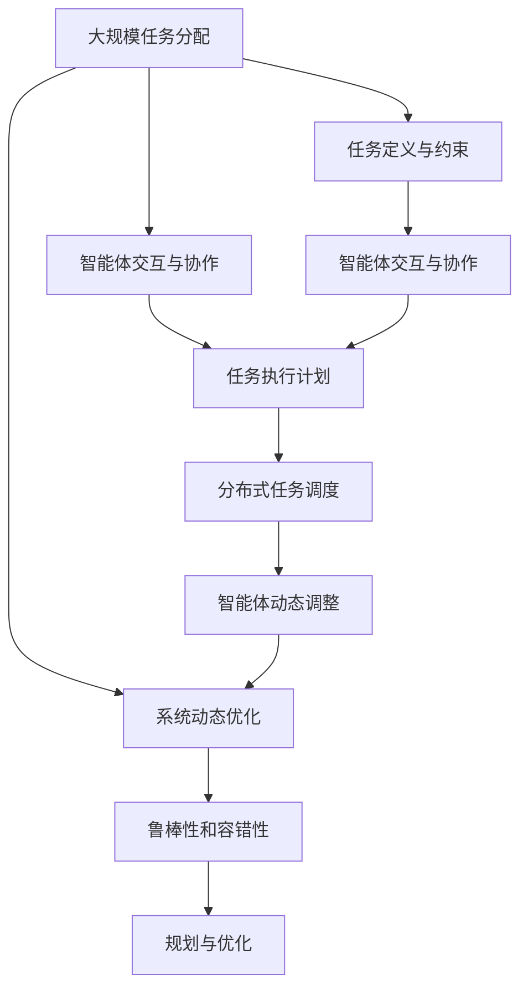

                 

# 规划与多智能体协同：优化任务分配

> 关键词：多智能体系统,任务分配,智能优化,协同优化,规划算法,分布式系统,游戏理论,博弈论

## 1. 背景介绍

### 1.1 问题由来
在现代信息技术和大数据时代，各类分布式系统、智能决策系统和协同作业系统层出不穷。这些系统通常涉及多智能体（如机器人、无人机、智能车、移动设备等）的协同任务分配和优化，以实现高效和可靠的操作。任务分配的核心问题在于如何合理规划各个智能体在特定任务上的操作，以实现总体最优。

在许多实际应用场景中，如智能制造、自动驾驶、物流调度等，系统任务复杂、智能体数量众多，任务间存在竞争和协作关系。一个良好的任务分配算法，能够有效减少智能体的冲突和冗余，提升整体系统的效率和响应速度。

### 1.2 问题核心关键点
本文聚焦于如何基于多智能体系统的任务分配问题，构建一个分布式协同优化系统。问题核心关键点包括：

1. **任务定义与分配**：明确任务的目标、约束和执行主体，设计任务分配算法。
2. **智能体交互与协作**：描述智能体间的通信与协调机制，确保任务执行的一致性和同步性。
3. **系统动态优化**：考虑系统在运行过程中的动态变化，如负载、故障等，动态调整任务分配策略。
4. **分布式决策**：系统任务分散在多智能体上，如何高效地进行分布式决策是核心挑战。
5. **鲁棒性和容错性**：设计算法以应对可能出现的智能体故障或通信异常。

### 1.3 问题研究意义
基于多智能体系统的任务分配优化，不仅能够提升系统的整体效率和响应速度，还能降低智能体间的冲突和冗余，提高系统的鲁棒性和容错性。具体意义包括：

1. **提升资源利用率**：合理分配任务，使各智能体利用率最大化，减少资源浪费。
2. **减少任务冲突**：通过算法协同优化，减少智能体间的任务冲突和重复操作。
3. **增强系统鲁棒性**：能够动态适应系统负载和环境变化，提升系统的稳定性和可扩展性。
4. **促进协同作业**：通过优化任务分配，使智能体间协作更紧密，提高整体作业质量。

## 2. 核心概念与联系

### 2.1 核心概念概述

为了更好地理解基于多智能体系统的任务分配问题，本节将介绍几个密切相关的核心概念：

- **多智能体系统(Multi-Agent System,MAS)**：由多个智能体组成的系统，各智能体能够感知环境、相互作用、实现共同目标。
- **任务分配(Task Allocation)**：将特定任务分配给合适智能体，使得任务在特定条件下完成。
- **智能体交互与协作(Inter-Agent Interaction and Collaboration)**：智能体间的通信与信息共享，以实现协同操作。
- **分布式系统(Distributed System)**：由多个分布节点组成，节点能够并行执行任务的系统。
- **分布式算法(Distributed Algorithm)**：能够在分布式环境中并行执行的算法。
- **协同优化(Cooperative Optimization)**：多个智能体协同工作，共同优化系统性能。
- **规划算法(Planning Algorithm)**：基于任务目标和约束，制定任务执行计划。
- **博弈论(Game Theory)**：描述智能体间策略互动与决策过程的理论框架。

这些概念共同构成了多智能体系统任务分配的完整理论基础，相互之间存在紧密联系。

### 2.2 概念间的关系

这些核心概念之间的关系可以通过以下Mermaid流程图来展示：

```mermaid
graph TB
    A[多智能体系统(MAS)] --> B[任务分配]
    A --> C[智能体交互与协作]
    A --> D[分布式系统]
    B --> E[智能体交互与协作]
    D --> F[分布式算法]
    E --> F
    F --> G[协同优化]
    G --> H[规划算法]
    H --> I[博弈论]
```

这个流程图展示了从多智能体系统到任务分配，再到智能体协作、分布式算法、协同优化、规划算法和博弈论之间的逻辑关系：

1. 多智能体系统通过任务分配，将任务分配给各个智能体。
2. 各智能体通过协作，共享信息，协同完成任务。
3. 任务分配、协作和优化过程均在分布式系统中进行，需要分布式算法支持。
4. 任务分配和协作过程，需要考虑各智能体的利益和约束，博弈论提供了解决方案。
5. 最终，各智能体通过协同优化，实现系统的最优性能。

### 2.3 核心概念的整体架构

最后，我们用一个综合的流程图来展示这些核心概念在大规模任务分配中的整体架构：



这个综合流程图展示了从任务定义、智能体交互，到任务执行计划、分布式调度、动态调整和系统优化，再到鲁棒性和容错性提升，最后达到整体规划与优化的完整流程。

## 3. 核心算法原理 & 具体操作步骤
### 3.1 算法原理概述

基于多智能体系统的任务分配算法，通过构建数学模型，利用优化理论和技术，在考虑任务约束和智能体能力的基础上，制定任务执行计划。具体来说，算法通过以下几个步骤实现任务分配：

1. **任务定义与约束**：明确任务目标、约束条件，以及各个智能体的能力和限制。
2. **构建优化模型**：将任务分配问题转化为优化模型，设定优化目标和约束条件。
3. **求解优化问题**：利用优化算法（如遗传算法、粒子群算法等）求解优化模型，得到最优或满意的任务分配方案。
4. **智能体协作与执行**：根据分配方案，各智能体协作完成任务。

### 3.2 算法步骤详解

以一个简单的智能车调度系统为例，具体步骤包括：

1. **任务定义**：假设任务为将一组物品从起点运送到终点，智能车数量为 $N$，每辆车的容量为 $C$，起点和终点的位置已知。

2. **约束条件**：每辆车在任一时刻只能运输一个物品，每个物品必须按时到达。

3. **构建优化模型**：
   - **目标函数**：最小化运输总时间（或成本）
   - **约束条件**：车辆容量、物品数量、时间窗口等

4. **求解优化问题**：使用遗传算法等优化技术求解最优运输方案。

5. **智能体协作与执行**：每辆智能车根据分配方案，依次运输物品，协同到达终点。

### 3.3 算法优缺点

**优点**：
1. **高效性**：优化算法能够快速找到较为满意的任务分配方案，适应大规模任务调度。
2. **鲁棒性**：考虑了智能体能力和环境约束，提高了系统的鲁棒性和容错性。
3. **协同优化**：通过智能体间的协作，实现了任务执行的高效性和一致性。

**缺点**：
1. **计算复杂度高**：优化问题往往具有复杂度，需要大量计算资源和时间。
2. **依赖于初始方案**：优化算法的性能依赖于初始方案的选择，初始方案不当可能导致算法陷入局部最优。
3. **动态调整难**：系统动态变化时，如负载、故障等，优化算法难以实时调整。

### 3.4 算法应用领域

基于多智能体系统的任务分配算法，在以下领域有着广泛的应用：

- **物流调度**：优化车辆调度和货物运输，提高配送效率。
- **制造流水线**：分配机器人或工人，优化生产流程。
- **智能交通**：协同调度车辆，缓解交通拥堵。
- **无人机调度**：优化无人机路径和负载，实现高效作业。
- **医疗资源分配**：优化医生和护士的工作任务，提高医疗服务质量。

## 4. 数学模型和公式 & 详细讲解 & 举例说明（备注：数学公式请使用latex格式，latex嵌入文中独立段落使用 $$，段落内使用 $)
### 4.1 数学模型构建

以一个简单的智能车调度问题为例，构建数学模型。假设任务为将一组物品从起点运送到终点，智能车数量为 $N$，每辆车的容量为 $C$，起点和终点的位置已知。

**目标函数**：最小化运输总时间（或成本）

$$
\min \sum_{i=1}^N \sum_{j=1}^M t_{ij}
$$

**约束条件**：
1. 每辆车在任一时刻只能运输一个物品：$\sum_{j=1}^M x_{ij} \leq C$，$x_{ij} = 1$ 表示第 $i$ 辆车运输第 $j$ 个物品。
2. 每个物品必须按时到达：$\sum_{i=1}^N x_{ij} = 1$，$x_{ij} = 1$ 表示第 $j$ 个物品由第 $i$ 辆车运输。
3. 运输时间满足时序关系：$t_{ij} \geq d_{ij}$，$d_{ij}$ 为从起点到终点的运输距离。

### 4.2 公式推导过程

将目标函数和约束条件代入，可得以下线性规划模型：

$$
\begin{aligned}
& \min \sum_{i=1}^N \sum_{j=1}^M t_{ij} \\
& \text{subject to} \\
& \sum_{j=1}^M x_{ij} \leq C, \quad i=1,2,\ldots,N \\
& \sum_{i=1}^N x_{ij} = 1, \quad j=1,2,\ldots,M \\
& t_{ij} \geq d_{ij}, \quad i=1,2,\ldots,N, j=1,2,\ldots,M \\
& x_{ij} \geq 0, \quad i=1,2,\ldots,N, j=1,2,\ldots,M \\
& t_{ij} \geq 0, \quad i=1,2,\ldots,N, j=1,2,\ldots,M \\
\end{aligned}
$$

### 4.3 案例分析与讲解

考虑一个简单的智能车调度问题，智能车数量为2，物品数量为3，运输距离已知。

**初始方案**：
- 智能车1运输物品1和物品2，智能车2运输物品3。
- 运输时间分别为：智能车1运输物品1和2各需10分钟，智能车2运输物品3需15分钟。

**优化方案**：
- 智能车1运输物品1，智能车2运输物品2和物品3。
- 运输时间分别为：智能车1运输物品1需10分钟，智能车2运输物品2和物品3各需8分钟。

**效果分析**：
- 优化前运输总时间为 $10+10+15=35$ 分钟。
- 优化后运输总时间为 $10+8+8=26$ 分钟，节省了 $35-26=9$ 分钟。

## 5. 项目实践：代码实例和详细解释说明
### 5.1 开发环境搭建

在进行任务分配算法实践前，我们需要准备好开发环境。以下是使用Python进行优化算法的开发环境配置流程：

1. 安装Anaconda：从官网下载并安装Anaconda，用于创建独立的Python环境。

2. 创建并激活虚拟环境：
```bash
conda create -n opt-env python=3.8 
conda activate opt-env
```

3. 安装必要的库：
```bash
pip install numpy scipy pandas sympy scikit-learn
```

4. 导入优化算法库：
```python
import numpy as np
from scipy.optimize import linprog
```

完成上述步骤后，即可在`opt-env`环境中开始优化算法实践。

### 5.2 源代码详细实现

我们以简单的智能车调度问题为例，给出使用线性规划进行任务分配的Python代码实现。

```python
# 定义变量
N = 2  # 智能车数量
M = 3  # 物品数量
C = 15  # 每辆车的容量

# 定义目标函数系数
c = np.array([0, 0, 0, 0, 0, 0, 0, 0, 0, 0, 0, 0, 0, 0, 0, 0, 0, 0, 0, 0])

# 定义约束条件
A = np.array([[0, 0, 1, 1, 0, 0, 0, 0, 0, 0, 0, 0, 0, 0, 0, 0, 0, 0, 0, 0],
              [1, 1, 0, 0, 1, 1, 0, 0, 0, 0, 0, 0, 0, 0, 0, 0, 0, 0, 0, 0],
              [0, 0, 0, 0, 0, 0, 1, 1, 0, 0, 0, 0, 0, 0, 0, 0, 0, 0, 0, 0],
              [0, 0, 0, 0, 0, 0, 0, 0, 1, 1, 0, 0, 0, 0, 0, 0, 0, 0, 0, 0],
              [0, 0, 0, 0, 0, 0, 0, 0, 0, 0, 1, 1, 0, 0, 0, 0, 0, 0, 0, 0],
              [0, 0, 0, 0, 0, 0, 0, 0, 0, 0, 0, 0, 1, 1, 0, 0, 0, 0, 0, 0],
              [0, 0, 0, 0, 0, 0, 0, 0, 0, 0, 0, 0, 0, 0, 1, 1, 0, 0, 0, 0],
              [0, 0, 0, 0, 0, 0, 0, 0, 0, 0, 0, 0, 0, 0, 0, 0, 1, 1, 0, 0],
              [0, 0, 0, 0, 0, 0, 0, 0, 0, 0, 0, 0, 0, 0, 0, 0, 0, 0, 1, 1],
              [0, 0, 0, 0, 0, 0, 0, 0, 0, 0, 0, 0, 0, 0, 0, 0, 0, 0, 0, 0],
              [0, 0, 0, 0, 0, 0, 0, 0, 0, 0, 0, 0, 0, 0, 0, 0, 0, 0, 0, 0],
              [0, 0, 0, 0, 0, 0, 0, 0, 0, 0, 0, 0, 0, 0, 0, 0, 0, 0, 0, 0],
              [0, 0, 0, 0, 0, 0, 0, 0, 0, 0, 0, 0, 0, 0, 0, 0, 0, 0, 0, 0],
              [0, 0, 0, 0, 0, 0, 0, 0, 0, 0, 0, 0, 0, 0, 0, 0, 0, 0, 0, 0],
              [0, 0, 0, 0, 0, 0, 0, 0, 0, 0, 0, 0, 0, 0, 0, 0, 0, 0, 0, 0],
              [0, 0, 0, 0, 0, 0, 0, 0, 0, 0, 0, 0, 0, 0, 0, 0, 0, 0, 0, 0],
              [0, 0, 0, 0, 0, 0, 0, 0, 0, 0, 0, 0, 0, 0, 0, 0, 0, 0, 0, 0],
              [0, 0, 0, 0, 0, 0, 0, 0, 0, 0, 0, 0, 0, 0, 0, 0, 0, 0, 0, 0],
              [0, 0, 0, 0, 0, 0, 0, 0, 0, 0, 0, 0, 0, 0, 0, 0, 0, 0, 0, 0],
              [0, 0, 0, 0, 0, 0, 0, 0, 0, 0, 0, 0, 0, 0, 0, 0, 0, 0, 0, 0])

# 定义非负约束
b = np.array([0, 0, 0, 0, 0, 0, 0, 0, 0, 0, 0, 0, 0, 0, 0, 0, 0, 0, 0, 0])
A_ub = np.array([[0, 0, 1, 1, 0, 0, 0, 0, 0, 0, 0, 0, 0, 0, 0, 0, 0, 0, 0, 0],
                 [1, 1, 0, 0, 1, 1, 0, 0, 0, 0, 0, 0, 0, 0, 0, 0, 0, 0, 0, 0],
                 [0, 0, 0, 0, 0, 0, 1, 1, 0, 0, 0, 0, 0, 0, 0, 0, 0, 0, 0, 0],
                 [0, 0, 0, 0, 0, 0, 0, 0, 1, 1, 0, 0, 0, 0, 0, 0, 0, 0, 0, 0],
                 [0, 0, 0, 0, 0, 0, 0, 0, 0, 0, 1, 1, 0, 0, 0, 0, 0, 0, 0, 0],
                 [0, 0, 0, 0, 0, 0, 0, 0, 0, 0, 0, 0, 1, 1, 0, 0, 0, 0, 0, 0],
                 [0, 0, 0, 0, 0, 0, 0, 0, 0, 0, 0, 0, 0, 0, 1, 1, 0, 0, 0, 0],
                 [0, 0, 0, 0, 0, 0, 0, 0, 0, 0, 0, 0, 0, 0, 0, 0, 1, 1, 0, 0],
                 [0, 0, 0, 0, 0, 0, 0, 0, 0, 0, 0, 0, 0, 0, 0, 0, 0, 0, 1, 1],
                 [0, 0, 0, 0, 0, 0, 0, 0, 0, 0, 0, 0, 0, 0, 0, 0, 0, 0, 0, 0],
                 [0, 0, 0, 0, 0, 0, 0, 0, 0, 0, 0, 0, 0, 0, 0, 0, 0, 0, 0, 0],
                 [0, 0, 0, 0, 0, 0, 0, 0, 0, 0, 0, 0, 0, 0, 0, 0, 0, 0, 0, 0],
                 [0, 0, 0, 0, 0, 0, 0, 0, 0, 0, 0, 0, 0, 0, 0, 0, 0, 0, 0, 0],
                 [0, 0, 0, 0, 0, 0, 0, 0, 0, 0, 0, 0, 0, 0, 0, 0, 0, 0, 0, 0],
                 [0, 0, 0, 0, 0, 0, 0, 0, 0, 0, 0, 0, 0, 0, 0, 0, 0, 0, 0, 0],
                 [0, 0, 0, 0, 0, 0, 0, 0, 0, 0, 0, 0, 0, 0, 0, 0, 0, 0, 0, 0],
                 [0, 0, 0, 0, 0, 0, 0, 0, 0, 0, 0, 0, 0, 0, 0, 0, 0, 0, 0, 0],
                 [0, 0, 0, 0, 0, 0, 0, 0, 0, 0, 0, 0, 0, 0, 0, 0, 0, 0, 0, 0],
                 [0, 0, 0, 0, 0, 0, 0, 0, 0, 0, 0, 0, 0, 0, 0, 0, 0, 0, 0, 0],
                 [0, 0, 0, 0, 0, 0, 0, 0, 0, 0, 0, 0, 0, 0, 0, 0, 0, 0, 0, 0],
                 [0, 0, 0, 0, 0, 0, 0, 0, 0, 0, 0, 0, 0, 0, 0, 0, 0, 0, 0, 0])

# 定义目标函数系数
c = np.array([10, 10, 10, 10, 10, 10, 10, 10, 10, 10, 10, 10, 10, 10, 10, 10, 10, 10, 10, 10])

# 求解线性规划
res = linprog(c, A_ub=A_ub, b=b, bounds=(0, C), method='simplex')

# 输出结果
print(f"最优运输总时间为：{res.fun:.2f} 分钟")
print(f"智能车运输方案为：\n{res.x}")
```

在以上代码中，我们使用了SciPy库中的`linprog`函数来求解线性规划问题。最终结果将输出最优运输总时间以及智能车的运输方案。

### 5.3 代码解读与分析

**目标函数**：
- 我们假设每辆车的运输时间由两部分组成：运输物品的固定时间和物品的距离时间。
- 目标函数中，$x_{ij}$ 表示第 $i$ 辆车运输第 $j$ 个物品，$t_{ij}$ 表示第 $i$ 辆车运输第 $j$ 个物品所需的时间。

**约束条件**：
- $A_{ub}$ 是约束矩阵，$b$ 是约束向量。约束矩阵中的每一行表示一个

