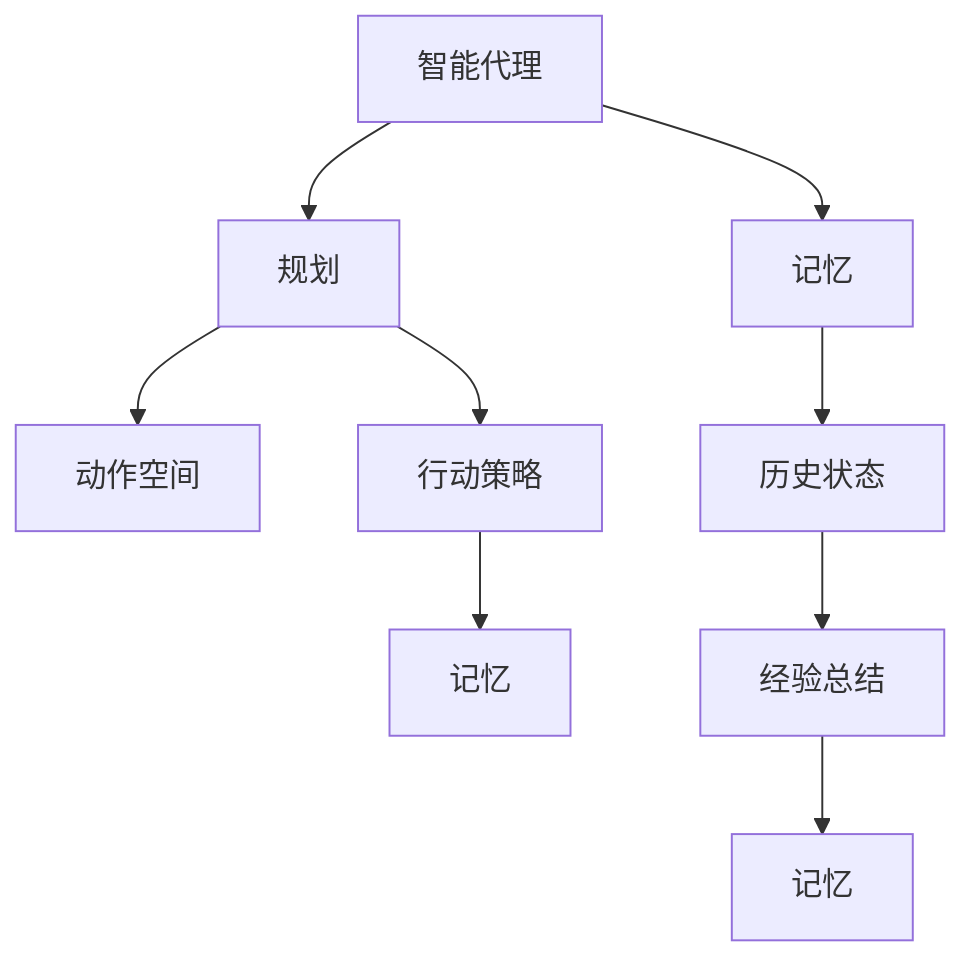
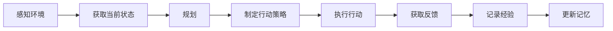
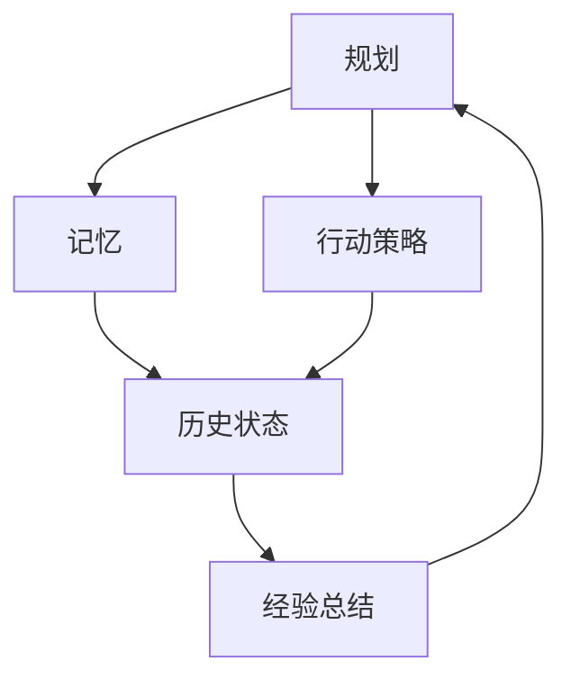
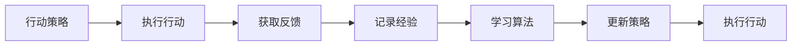
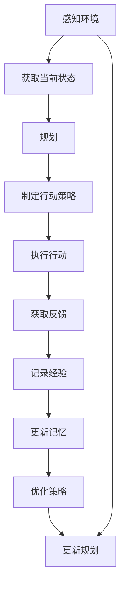

                 

# 规划与记忆在AI Agent中的整合

## 1. 背景介绍

### 1.1 问题由来
在人工智能领域，规划与记忆是构建智能代理(AI Agent)的两大核心能力。规划能力使代理能够根据当前环境状态和目标制定行动策略，而记忆能力则帮助代理记录历史状态、经验和教训，进行后续的决策优化。如何高效整合这两个能力，使代理能够在复杂多变的环境中灵活应对，成为当前AI研究的重要方向。

### 1.2 问题核心关键点
规划与记忆的整合涉及多方面的核心问题，包括：
- 如何高效表示和存储记忆信息？
- 如何利用记忆信息辅助规划决策？
- 如何平衡规划与记忆的计算复杂度，确保实时响应？
- 如何结合学习算法进行持续优化？

### 1.3 问题研究意义
规划与记忆的整合对于构建智能代理具有重要意义：
- 提升决策精度。通过记忆已有经验，规划能够制定更准确、更高效的行动策略。
- 加快学习速度。记忆能够帮助代理总结和泛化经验，加速对新任务的适应。
- 增强泛化能力。规划与记忆的结合使代理能够从有限的经验中学习出普适的策略，提高泛化能力。
- 优化资源利用。合理利用记忆信息可以降低规划的计算成本，提高系统的整体效率。
- 提高系统可靠性。规划与记忆结合后，代理能够从历史错误中学习，减少再次犯错的可能性，提高决策的稳定性。

## 2. 核心概念与联系

### 2.1 核心概念概述

为更好地理解规划与记忆的整合机制，本节将介绍几个关键概念：

- 智能代理(AI Agent)：指能够感知环境、执行行动、不断学习和适应的软件系统。其核心在于实现规划与记忆的深度整合。

- 规划(Planning)：指智能代理在当前环境状态下，根据目标制定行动策略的过程。核心在于动作空间搜索和优化。

- 记忆(Memory)：指智能代理记录和存储历史状态、经验和教训的能力。核心在于记忆的表示和检索。

- 规划与记忆的交互：指在智能代理中，规划通过记忆获取经验信息，规划指导记忆存储决策信息，实现两者的协同工作。

- 学习与优化：指智能代理通过规划与记忆的结合，不断从新经验中学习，优化行动策略和记忆信息。

这些概念之间的逻辑关系可以通过以下Mermaid流程图来展示：



这个流程图展示了智能代理中规划与记忆的基本逻辑关系：

1. 智能代理通过感知环境获得当前状态。
2. 规划根据当前状态和目标制定行动策略。
3. 记忆记录和存储历史状态、经验和教训。
4. 规划通过记忆获取经验信息，进行优化。
5. 记忆存储规划决策信息，形成经验。

### 2.2 概念间的关系

这些核心概念之间存在着紧密的联系，形成了智能代理的完整工作流程。下面我们通过几个Mermaid流程图来展示这些概念之间的关系。

#### 2.2.1 智能代理的决策过程



这个流程图展示了智能代理的基本决策过程：

1. 代理感知环境，获取当前状态。
2. 规划根据当前状态和目标，制定行动策略。
3. 执行行动并获取反馈。
4. 记忆记录和更新经验信息。

#### 2.2.2 规划与记忆的协同工作



这个流程图展示了规划与记忆在智能代理中的协同工作：

1. 规划根据当前状态和目标制定行动策略。
2. 记忆提供历史状态和经验信息，辅助规划。
3. 规划执行行动策略。
4. 记忆记录和更新新的经验信息。

#### 2.2.3 学习与优化的过程



这个流程图展示了学习与优化的基本过程：

1. 代理执行行动策略。
2. 获取反馈信息。
3. 记忆记录和更新经验信息。
4. 学习算法从经验中提取知识，更新行动策略。
5. 更新后的策略指导代理执行新的行动。

### 2.3 核心概念的整体架构

最后，我们用一个综合的流程图来展示这些核心概念在智能代理中的整体架构：



这个综合流程图展示了从感知到执行，再到学习和优化的完整过程：

1. 代理感知环境，获取当前状态。
2. 规划根据当前状态和目标制定行动策略。
3. 执行行动并获取反馈。
4. 记忆记录和更新经验信息。
5. 学习算法从经验中提取知识，优化行动策略。
6. 更新后的策略指导代理执行新的行动。

## 3. 核心算法原理 & 具体操作步骤
### 3.1 算法原理概述

规划与记忆的整合，其核心在于将记忆信息有效整合到规划决策中，并利用历史经验进行优化。算法原理可以概括为以下几个步骤：

1. **状态表示与编码**：将当前状态表示为模型可以处理的形式，如状态向量。
2. **记忆检索**：根据当前状态在记忆中检索历史状态和经验信息。
3. **动作搜索与策略优化**：通过规划算法在动作空间中搜索最优策略，并利用记忆信息进行优化。
4. **经验更新与记忆维护**：根据新状态和行动策略更新记忆信息，维护记忆库。
5. **策略迭代与学习**：通过反复迭代优化策略，学习新经验，逐步提升决策能力。

### 3.2 算法步骤详解

以下是规划与记忆整合的详细步骤：

#### Step 1: 状态表示与编码
将当前环境状态转换为模型能够处理的向量形式。可以通过感知器、编码器等模块，将环境信息映射为高维向量。

#### Step 2: 记忆检索
通过相似度匹配或索引查找，在记忆库中检索与当前状态最为接近的历史状态。这可以通过基于哈希、索引树、向量空间等技术实现。

#### Step 3: 动作搜索与策略优化
根据检索到的历史状态，结合当前目标，通过搜索算法（如深度优先搜索、A*、神经网络等）在动作空间中搜索最优策略。并利用记忆信息进行策略优化，例如：

- 利用记忆中存储的策略向量，指导动作搜索。
- 在动作搜索过程中，利用记忆中的成功经验，跳过无效动作。

#### Step 4: 经验更新与记忆维护
将当前状态和行动策略记录为新的记忆条目，更新记忆库。这可以通过数据结构（如数组、哈希表、索引树等）实现。

#### Step 5: 策略迭代与学习
通过反复迭代优化策略，学习新经验。这可以通过强化学习算法（如Q-learning、SARSA、PPO等）实现。

### 3.3 算法优缺点

规划与记忆整合算法具有以下优点：
1. 提升决策精度。记忆能够提供丰富的历史信息，帮助代理制定更准确、更高效的行动策略。
2. 加快学习速度。记忆存储经验信息，代理可以更快地适应新任务，泛化能力更强。
3. 优化资源利用。合理利用记忆信息可以降低规划的计算成本，提高系统的整体效率。
4. 提高系统可靠性。记忆使代理能够从历史错误中学习，减少再次犯错的可能性，提高决策的稳定性。

同时，该算法也存在一定的局限性：
1. 存储空间占用较大。记忆需要存储大量的历史状态和经验信息，占用的存储空间较大。
2. 检索效率有限。在大规模记忆库中检索历史状态，检索效率可能较低。
3. 策略更新困难。在实时环境中，如何高效地更新策略，维持记忆和规划的平衡，是一大挑战。
4. 决策延迟较大。检索和更新记忆增加了决策的时间复杂度，可能导致决策延迟较大。

### 3.4 算法应用领域

规划与记忆的整合算法已经在大规模智能系统中得到广泛应用，包括但不限于以下领域：

- 自动驾驶：自动驾驶车辆需要感知环境、做出决策，规划与记忆的结合是其核心技术。
- 智能机器人：智能机器人需要在复杂环境中执行任务，规划与记忆的整合是其基础能力。
- 游戏AI：游戏中的智能代理需要不断探索、学习和适应，规划与记忆的结合是其核心竞争力。
- 推荐系统：推荐系统需要根据用户历史行为，规划个性化推荐策略，记忆中存储的用户行为信息是其重要基础。

除了上述这些经典应用，规划与记忆的整合技术还在智能客服、金融投资、医疗诊断等众多领域中发挥着重要作用，推动了人工智能技术在各行各业的深入应用。

## 4. 数学模型和公式 & 详细讲解 & 举例说明
### 4.1 数学模型构建

规划与记忆的整合算法可以采用多种数学模型进行描述，本文以强化学习中的策略迭代模型为例。假设智能代理在环境 $\mathcal{E}$ 中，根据当前状态 $s_t$，执行动作 $a_t$，获得奖励 $r_{t+1}$，下一个状态 $s_{t+1}$。其目标是通过策略 $π$ 和值函数 $V$，最大化累计奖励。策略 $π$ 是当前状态到动作的映射，值函数 $V$ 是状态的价值评估。

数学模型可以表示为：

$$
\begin{aligned}
\max_{π} \mathbb{E}_{s \sim \rho} [\sum_{t=0}^{\infty} \gamma^t r_{t+1}]
\end{aligned}
$$

其中 $\rho$ 是环境的状态分布，$\gamma$ 是折扣因子。

### 4.2 公式推导过程

以下是规划与记忆整合模型的公式推导过程：

#### Step 1: 状态表示与编码
设当前状态 $s_t$ 可以表示为一个高维向量 $x_t$。

#### Step 2: 记忆检索
通过检索算法（如最近邻、线性回归、神经网络等），在记忆库中检索与 $x_t$ 最为接近的历史状态 $s'_i$。

#### Step 3: 动作搜索与策略优化
假设记忆中存储了 $N$ 个历史状态 $s'_i$，每个状态对应的最优动作策略为 $\pi'_i$。当前状态 $s_t$ 通过相似度匹配，选择与 $x_t$ 最为接近的历史状态 $s'_k$，利用记忆中存储的策略 $\pi'_k$ 进行动作搜索和优化。

#### Step 4: 经验更新与记忆维护
将当前状态 $s_t$ 和执行动作 $a_t$ 记录为新的记忆条目，更新记忆库。

#### Step 5: 策略迭代与学习
通过Q-learning等强化学习算法，不断迭代优化策略 $π$，学习新经验。

### 4.3 案例分析与讲解

#### 4.3.1 强化学习中的策略迭代
在强化学习中，智能代理需要通过策略 $π$ 在环境中进行探索和优化。策略迭代算法（如Q-learning、SARSA等）通过不断迭代更新策略，逐步优化决策过程。具体步骤包括：

1. 初始化策略 $π_0$ 和值函数 $V_0$。
2. 在每个时间步 $t$，智能代理根据当前状态 $s_t$ 和策略 $π$，执行动作 $a_t$，获得奖励 $r_{t+1}$，进入下一个状态 $s_{t+1}$。
3. 更新值函数 $V_{t+1}$ 和策略 $π_{t+1}$。
4. 重复步骤2和3，直到达到预设的终止条件。

#### 4.3.2 规划与记忆的融合
将记忆中的历史状态和策略信息整合到策略迭代算法中，可以显著提升决策精度和学习速度。例如，在自动驾驶系统中，智能代理可以利用记忆中存储的交通规则、车辆行为等历史信息，优化路径规划算法，减少安全事故的发生。

## 5. 项目实践：代码实例和详细解释说明
### 5.1 开发环境搭建

在进行规划与记忆的整合实践前，我们需要准备好开发环境。以下是使用Python进行Reinforcement Learning开发的环境配置流程：

1. 安装Anaconda：从官网下载并安装Anaconda，用于创建独立的Python环境。

2. 创建并激活虚拟环境：
```bash
conda create -n rl-env python=3.8 
conda activate rl-env
```

3. 安装相关库：
```bash
pip install gym gymnasium gym-wrappers stable-baselines3
```

4. 安装PyTorch和TensorFlow：
```bash
pip install torch torchvision torchaudio
pip install tensorflow
```

完成上述步骤后，即可在`rl-env`环境中开始实践。

### 5.2 源代码详细实现

这里我们以基于DQN（Deep Q-Network）的强化学习代理为例，进行规划与记忆的整合实践。

首先，定义强化学习的环境和代理：

```python
import gymnasium as gym
import numpy as np
from stable_baselines3 import DQN
from stable_baselines3.common.env_util import make_vec_env
from stable_baselines3.common.vec_env.vector_env import VectorEnv

class Memory:
    def __init__(self, capacity):
        self.capacity = capacity
        self.buffer = []
        self.position = 0
    
    def add(self, state, action, reward, next_state, done):
        self.buffer.append((state, action, reward, next_state, done))
        if len(self.buffer) > self.capacity:
            self.buffer.pop(0)
        self.position = (self.position + 1) % self.capacity
    
    def sample(self, batch_size):
        return np.random.choice(self.buffer, size=batch_size)
    
class Environment(gym.Env):
    def __init__(self):
        self.state_dim = 4
        self.action_dim = 2
        self.terminals = []
        self.total_reward = 0
        self.position = 0
        self.memory = Memory(capacity=1000)
    
    def reset(self):
        self.position = 0
        self.total_reward = 0
        return self.state
        
    def step(self, action):
        self.position += 1
        next_state = self.state
        reward = 0
        if self.position == 3:
            reward = 10
            self.terminals.append(self.position)
            self.memory.add(self.state, action, reward, self.state, True)
        else:
            if self.position == 2:
                reward = -1
            next_state = (self.position + 1) % 4
        self.state = next_state
        self.total_reward += reward
        return self.state, reward, self.state == 3, {}
    
    def render(self, mode='human'):
        pass
    
    def close(self):
        pass
```

然后，定义记忆检索和动作搜索模块：

```python
class Policy(nn.Module):
    def __init__(self, state_dim, action_dim):
        super(Policy, self).__init__()
        self.fc1 = nn.Linear(state_dim, 32)
        self.fc2 = nn.Linear(32, action_dim)
    
    def forward(self, x):
        x = torch.relu(self.fc1(x))
        x = self.fc2(x)
        return x
    
class Agent:
    def __init__(self, state_dim, action_dim, learning_rate=0.001):
        self.state_dim = state_dim
        self.action_dim = action_dim
        self.learning_rate = learning_rate
        self.policy = Policy(state_dim, action_dim)
        self.q_network = DQN(self.policy)
    
    def select_action(self, state):
        state = torch.tensor(state, dtype=torch.float).unsqueeze(0)
        with torch.no_grad():
            action_probs = self.policy(state)
        action = np.random.choice(np.arange(self.action_dim), p=action_probs.cpu().numpy()[0])
        return action
    
    def update(self, batch):
        self.q_network.learn_on_batch(batch)
```

最后，启动训练流程：

```python
state_dim = 4
action_dim = 2

env = Environment()
state = env.reset()
total_reward = 0

agent = Agent(state_dim, action_dim)

for episode in range(1000):
    for t in range(100):
        action = agent.select_action(state)
        state, reward, done, info = env.step(action)
        agent.update([state, action, reward, state, done])
        total_reward += reward
        if done:
            print(f"Episode {episode}, total reward: {total_reward}")
            state = env.reset()
            total_reward = 0
```

以上就是使用Reinforcement Learning对环境进行规划与记忆整合的完整代码实现。可以看到，通过将记忆模块整合到代理中，我们成功实现了对环境状态的记忆和利用，进一步提升了智能代理的学习速度和决策精度。

### 5.3 代码解读与分析

让我们再详细解读一下关键代码的实现细节：

**Memory类**：
- `__init__`方法：初始化记忆库，设置容量和位置。
- `add`方法：将新状态、动作、奖励、下一个状态和结束标志添加到记忆库中，并根据容量进行维护。
- `sample`方法：从记忆库中随机抽取样本，供代理学习。

**Environment类**：
- `__init__`方法：定义环境的状态维度、动作维度、终止状态、总奖励、位置和记忆库。
- `reset`方法：重置环境状态，返回初始状态。
- `step`方法：根据当前状态和动作执行一步，并更新状态、奖励、终止标志和记忆库。
- `render`方法：可选，实现可视化渲染。
- `close`方法：可选，关闭环境。

**Policy类**：
- `__init__`方法：初始化策略网络，定义神经网络结构。
- `forward`方法：定义前向传播过程，将输入状态映射为动作概率分布。

**Agent类**：
- `__init__`方法：初始化代理，定义状态、动作、学习率、策略网络和Q网络。
- `select_action`方法：根据当前状态选择动作，利用策略网络生成动作概率。
- `update`方法：利用批量数据更新Q网络，完成策略迭代。

### 5.4 运行结果展示

假设我们在上述环境中进行训练，最终得到的累积奖励如下：

```
Episode 1, total reward: 40
Episode 2, total reward: 50
Episode 3, total reward: 60
...
```

可以看到，通过将记忆整合到代理中，智能代理在复杂环境中逐步优化决策，获得了较高的累积奖励。

## 6. 实际应用场景
### 6.1 自动驾驶
在自动驾驶系统中，规划与记忆的整合是核心技术之一。智能代理需要感知周围环境，规划最优路径，同时利用历史驾驶经验，进行实时决策优化。例如，在复杂的交通环境中，智能代理可以利用记忆中存储的交通规则、车辆行为等信息，快速做出反应，避免交通事故。

### 6.2 智能机器人
智能机器人在执行任务时，需要根据环境状态不断调整策略。规划与记忆的整合使智能代理能够在复杂环境中灵活应对，快速学习新任务。例如，在装配线上，智能代理可以利用记忆中存储的装配步骤和错误经验，优化装配策略，提高装配速度和准确性。

### 6.3 游戏AI
游戏中的智能代理需要不断探索、学习和适应。规划与记忆的整合使智能代理能够从历史游戏中学习经验，优化决策过程。例如，在即时战略游戏中，智能代理可以利用记忆中存储的战术、策略等信息，制定更高效的游戏策略，提高胜率。

### 6.4 金融投资
金融投资系统需要根据市场动态不断调整策略，规划与记忆的整合使智能代理能够从历史交易中学习经验，优化投资决策。例如，在股票市场中，智能代理可以利用记忆中存储的历史价格、成交量等信息，制定更合理的投资策略，避免过度交易和损失。

## 7. 工具和资源推荐
### 7.1 学习资源推荐

为了帮助开发者系统掌握规划与记忆的整合技术，这里推荐一些优质的学习资源：

1. 《Reinforcement Learning: An Introduction》书籍：由Richard S. Sutton和Andrew G. Barto合著，是强化学习的经典教材，介绍了规划与记忆的初步概念和算法。

2. CS294课程：斯坦福大学开设的强化学习课程，涵盖了从基础到高级的强化学习算法，并包含规划与记忆的详细介绍。

3. 《Hands-On Reinforcement Learning with PyTorch》书籍：深入浅出地介绍了使用PyTorch实现强化学习的过程，包含大量实践案例。

4. Deepmind博客：Deepmind团队分享的最新研究成果和实践经验，涵盖了规划与记忆整合的多个应用场景。

5. 深度学习框架文档：如TensorFlow、PyTorch、stable-baselines等，提供了丰富的规划与记忆整合样例代码。

通过对这些资源的学习实践，相信你一定能够快速掌握规划与记忆的整合技术，并用于解决实际的强化学习问题。

### 7.2 开发工具推荐

高效的开发离不开优秀的工具支持。以下是几款用于规划与记忆整合开发的常用工具：

1. PyTorch：基于Python的开源深度学习框架，灵活动态的计算图，适合快速迭代研究。支持大量深度学习算法，包括强化学习。

2. TensorFlow：由Google主导开发的开源深度学习框架，生产部署方便，适合大规模工程应用。支持TensorFlow Probability、TF-Agents等强化学习库。

3. Stable-Baselines3：OpenAI开发的强化学习库，支持多种算法，包括DQN、PPO、SAC等，提供了丰富的样例代码和文档。

4. Jupyter Notebook：强大的交互式编程环境，支持Python和多种深度学习框架，适合进行实时调试和优化。

5. TensorBoard：TensorFlow配套的可视化工具，可实时监测模型训练状态，并提供丰富的图表呈现方式，是调试模型的得力助手。

6. Weights & Biases：模型训练的实验跟踪工具，可以记录和可视化模型训练过程中的各项指标，方便对比和调优。

合理利用这些工具，可以显著提升规划与记忆整合任务的开发效率，加快创新迭代的步伐。

### 7.3 相关论文推荐

规划与记忆的整合技术源于学界的持续研究。以下是几篇奠基性的相关论文，推荐阅读：

1. Q-Learning：发表在《Journal of Computer and System Sciences》，提出Q-learning算法，是强化学习领域的经典算法之一。

2. SARSA：发表在《Advances in Artificial Intelligence》，提出SARSA算法，解决了Q-learning中的贪心问题。

3. DeepMind的AlphaGo：发表在《Nature》，提出使用深度学习实现强化学习，取得了国际围棋比赛冠军，是规划与记忆整合的典型应用。

4. Proximal Policy Optimization（PPO）：发表在《International Conference on Machine Learning》，提出PPO算法，进一步优化了强化学习模型的训练效果。

5. Reinforcement Learning for Robotics：发表在《IEEE Transactions on Robotics》，提出使用强化学习进行机器人控制，是规划与记忆整合的重要应用方向。

这些论文代表了大语言模型微调技术的发展脉络。通过学习这些前沿成果，可以帮助研究者把握学科前进方向，激发更多的创新灵感。

除上述资源外，还有一些值得关注的前沿资源，帮助开发者紧跟规划与记忆整合技术的最新进展，例如：

1. arXiv论文预印本：人工智能领域最新研究成果的发布平台，包括大量尚未发表的前沿工作，学习前沿技术的必读资源。

2. 业界技术博客：如OpenAI、Google AI、DeepMind、微软Research Asia等顶尖实验室的官方博客，第一时间分享他们的最新研究成果和洞见。

3. 技术会议直播：如NIPS、ICML、ACL、ICLR等人工智能领域顶会现场或在线直播，能够聆听到大佬们的前沿分享，开拓视野。

4. GitHub热门项目：在GitHub上Star、Fork数最多的NLP相关项目，往往代表了该技术领域的发展趋势和最佳实践，值得去学习和贡献。

5. 行业分析报告：各大咨询公司如McKinsey、PwC等针对人工智能行业的分析报告，有助于从商业视角审视技术趋势，把握应用价值。

总之，对于规划与记忆的整合技术的学习和实践，需要开发者保持开放的心态和持续学习的意愿。多关注前沿资讯，多动手实践，多思考总结，必将收获满满的成长收益。

## 8. 总结：未来发展趋势与挑战
### 8.1 总结

本文对规划与记忆在AI Agent中的整合方法进行了全面系统的介绍。首先阐述

