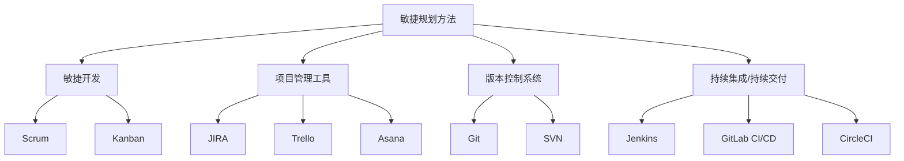
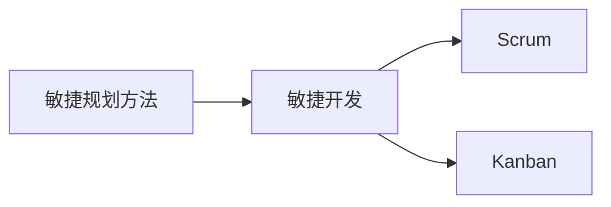
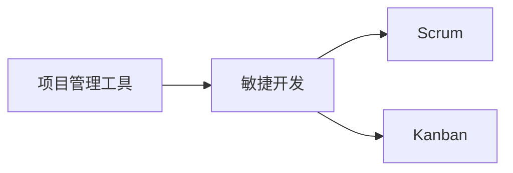
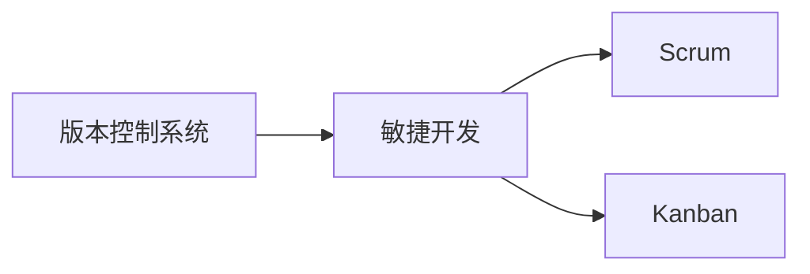
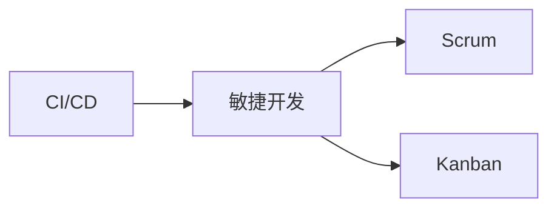
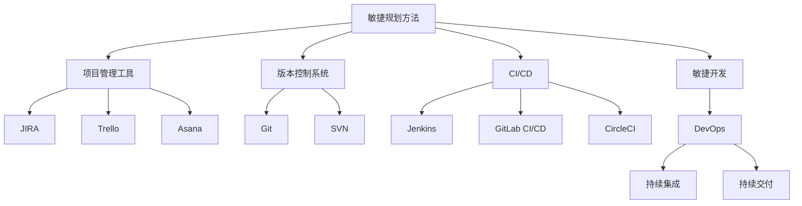

                 

# 规划技能与工具使用的提升

## 1. 背景介绍

### 1.1 问题由来

在当今快速发展的数字化时代，无论是在软件开发、数据分析，还是在项目管理、产品规划等领域，规划技能和工具的使用成为了提升工作效率和项目成功率的关键。然而，随着技术的进步和市场需求的快速变化，传统的规划方法已经难以应对复杂多变的环境，需要新的工具和技能来提升个人和团队的表现。

### 1.2 问题核心关键点

本文将聚焦于提升规划技能和工具使用的策略，以期帮助各领域的从业者更好地应对当前和未来的挑战。以下是对规划技能和工具使用提升的五个关键点：

1. **敏捷规划方法**：在快速变化的环境中，敏捷规划方法如Scrum、Kanban等变得尤为重要。这些方法强调快速迭代、持续交付和客户反馈，能够提高项目灵活性和响应速度。
2. **大数据分析工具**：大数据分析工具能够帮助决策者从海量数据中挖掘出有价值的信息，为规划提供科学依据。
3. **项目管理工具**：如JIRA、Trello、Asana等项目管理工具能够帮助团队高效协作、任务管理和进度跟踪。
4. **版本控制系统**：如Git、SVN等版本控制系统能够管理代码的变更和协作，是软件开发中的重要工具。
5. **持续集成/持续交付(CI/CD)**：CI/CD工具能够自动化测试、构建和部署，提高开发效率和软件质量。

### 1.3 问题研究意义

提升规划技能和工具使用对个人和团队的成功至关重要。通过系统的学习和实践，能够帮助从业者更好地理解和管理项目，提高工作效率，缩短开发周期，降低错误率。同时，这也能够促进团队协作和知识共享，增强团队的凝聚力和创新力。

## 2. 核心概念与联系

### 2.1 核心概念概述

为了更好地理解规划技能和工具使用的提升，本节将介绍几个核心概念：

- **敏捷规划方法**：如Scrum、Kanban等敏捷方法，强调团队协作、快速迭代和持续交付。
- **大数据分析工具**：如Hadoop、Spark、Pandas等，用于数据清洗、处理和分析。
- **项目管理工具**：如JIRA、Trello、Asana等，用于任务管理、进度跟踪和团队协作。
- **版本控制系统**：如Git、SVN等，用于代码版本管理、协作和变更跟踪。
- **持续集成/持续交付(CI/CD)**：如Jenkins、GitLab CI/CD、CircleCI等，用于自动化构建、测试和部署。

- **敏捷开发**：一种以人为本的开发方法，强调快速响应变化，持续交付可工作的软件。
- **DevOps**：将开发和运维融合，强调自动化、持续交付和团队协作。
- **大数据**：指通过先进技术处理海量数据，从中提取有价值的信息。
- **版本控制**：用于管理代码变更，支持多人协作和变更跟踪。

这些核心概念之间的逻辑关系可以通过以下Mermaid流程图来展示：



这个流程图展示了敏捷规划方法与其他核心概念的关系：

1. 敏捷规划方法与敏捷开发密切相关，强调团队协作和快速迭代。
2. 敏捷规划方法通过Scrum和Kanban等工具实现。
3. 项目管理工具帮助敏捷方法中的任务管理和进度跟踪。
4. 版本控制系统支持敏捷开发中的代码变更管理。
5. CI/CD工具实现持续集成和持续交付，提升开发效率。

### 2.2 概念间的关系

这些核心概念之间存在着紧密的联系，形成了规划技能和工具使用的完整生态系统。以下是通过几个Mermaid流程图来展示这些概念之间的关系：

#### 2.2.1 敏捷规划方法与敏捷开发的关系



这个流程图展示了敏捷规划方法与敏捷开发之间的关系：

1. 敏捷规划方法是敏捷开发的基础。
2. Scrum和Kanban等工具具体实现了敏捷开发中的快速迭代和持续交付。

#### 2.2.2 项目管理工具与敏捷开发的关系



这个流程图展示了项目管理工具与敏捷开发的关系：

1. 项目管理工具支持敏捷开发中的任务管理和进度跟踪。
2. 敏捷开发方法要求高效的团队协作和任务管理。

#### 2.2.3 版本控制系统与敏捷开发的关系



这个流程图展示了版本控制系统与敏捷开发的关系：

1. 版本控制系统支持敏捷开发中的代码变更管理。
2. 敏捷开发方法要求高效协作和变更跟踪。

#### 2.2.4 CI/CD与敏捷开发的关系



这个流程图展示了CI/CD与敏捷开发的关系：

1. CI/CD工具实现敏捷开发中的自动化构建和持续交付。
2. 敏捷开发方法要求高效的自动化流程和持续交付。

### 2.3 核心概念的整体架构

最后，我们用一个综合的流程图来展示这些核心概念在大规模项目规划中的整体架构：



这个综合流程图展示了从敏捷规划方法到敏捷开发，再到CI/CD的完整过程。敏捷规划方法通过敏捷开发中的Scrum和Kanban等工具实现，项目管理工具支持任务管理和进度跟踪，版本控制系统支持代码变更管理，CI/CD工具实现持续集成和持续交付，最终形成DevOps环境，实现高效协作和持续交付。

## 3. 核心算法原理 & 具体操作步骤

### 3.1 算法原理概述

提升规划技能和工具使用的核心算法原理包括敏捷开发方法、项目管理、版本控制和CI/CD技术。这些算法主要关注如何通过合理的规划、协作和自动化手段，提高项目效率和质量。

#### 3.1.1 敏捷开发方法

敏捷开发方法如Scrum、Kanban等，强调快速迭代和持续交付，通过短周期的开发循环，不断优化和完善产品。敏捷开发的核心在于通过迭代和反馈机制，快速响应变化，提高团队协作和产品成功率。

#### 3.1.2 项目管理工具

项目管理工具如JIRA、Trello、Asana等，通过任务分配、进度跟踪和协作管理，帮助团队高效完成项目。这些工具支持团队成员之间的信息同步和任务协同，提升项目管理效率。

#### 3.1.3 版本控制系统

版本控制系统如Git、SVN等，通过管理代码变更，支持多人协作和变更跟踪。版本控制系统能够记录每一次代码变更的详细信息，支持团队成员之间的代码合并和冲突解决。

#### 3.1.4 CI/CD技术

CI/CD技术如Jenkins、GitLab CI/CD、CircleCI等，通过自动化构建、测试和部署，提高开发效率和软件质量。CI/CD工具能够自动执行代码提交后的构建、测试和部署，缩短开发周期，降低错误率。

### 3.2 算法步骤详解

提升规划技能和工具使用的具体操作步骤包括以下几个关键步骤：

**Step 1: 准备项目规划文档**

- 定义项目目标、范围、时间和预算。
- 分析项目需求、风险和约束条件。
- 制定初步的项目规划方案，包括里程碑和时间表。

**Step 2: 选择合适的敏捷方法**

- 根据项目特点选择合适的敏捷方法，如Scrum、Kanban等。
- 建立敏捷团队，包括产品经理、开发人员和测试人员。
- 设计敏捷开发流程，包括迭代周期、任务划分和团队协作。

**Step 3: 配置项目管理工具**

- 选择合适的项目管理工具，如JIRA、Trello、Asana等。
- 创建项目板、任务卡片和列表，进行任务分配和进度跟踪。
- 设置任务优先级和截止日期，进行任务协调和进度管理。

**Step 4: 配置版本控制系统**

- 选择合适的版本控制系统，如Git、SVN等。
- 建立代码库和分支，进行代码提交和变更管理。
- 配置权限控制和合并策略，支持团队协作和变更跟踪。

**Step 5: 配置CI/CD流程**

- 选择合适的CI/CD工具，如Jenkins、GitLab CI/CD、CircleCI等。
- 配置自动化构建和测试流程，包括编译、测试和集成测试。
- 配置持续交付流程，包括代码部署和生产环境测试。

**Step 6: 执行项目规划**

- 根据项目规划方案，执行敏捷开发流程。
- 定期进行项目回顾和评估，优化开发流程和产品需求。
- 及时处理项目风险和变更，确保项目顺利推进。

### 3.3 算法优缺点

提升规划技能和工具使用的算法具有以下优点：

- **高效协作**：敏捷方法和项目管理工具支持高效协作和任务管理，提高团队协作效率。
- **快速迭代**：敏捷开发方法通过快速迭代和持续交付，快速响应变化，提高产品成功率。
- **代码质量保障**：版本控制系统和CI/CD技术通过自动化流程，提升代码质量和开发效率。
- **可视化管理**：项目管理工具通过任务板和进度跟踪，可视化管理项目进展和任务状态。

同时，这些算法也存在一些缺点：

- **学习成本高**：敏捷方法和工具的使用需要一定的学习和适应时间。
- **灵活性要求高**：敏捷开发方法要求团队高度灵活和自我管理能力，可能对部分团队成员造成压力。
- **依赖工具稳定**：项目管理工具和CI/CD工具的稳定性和集成性可能影响项目进展。
- **文档和沟通要求高**：敏捷开发方法强调频繁沟通和文档记录，对团队沟通和文档管理要求高。

### 3.4 算法应用领域

提升规划技能和工具使用的算法广泛应用于软件开发、项目管理、数据分析、产品规划等领域，特别是在快速变化和需求多变的项目中，具有重要应用价值。

## 4. 数学模型和公式 & 详细讲解 & 举例说明

### 4.1 数学模型构建

提升规划技能和工具使用的数学模型主要涉及敏捷开发方法、项目管理、版本控制和CI/CD技术。这些模型的核心在于如何通过数学公式和方法，量化和优化项目管理和开发流程。

#### 4.1.1 敏捷开发方法

敏捷开发方法可以通过以下公式来描述：

$$
\text{敏捷开发周期} = \frac{\text{项目需求}}{\text{迭代周期}} \times \text{迭代次数}
$$

其中，项目需求为项目需要完成的任务和功能，迭代周期为每次迭代的时间，迭代次数为敏捷开发循环的次数。

#### 4.1.2 项目管理

项目管理可以通过以下公式来描述：

$$
\text{项目进度} = \text{任务完成率} \times \text{任务总数} \times \text{当前迭代周期}
$$

其中，任务完成率为任务完成的百分比，任务总数为项目中所有任务的数量，当前迭代周期为当前进行迭代的周期。

#### 4.1.3 版本控制

版本控制可以通过以下公式来描述：

$$
\text{版本变更记录} = \text{变更次数} \times \text{变更内容}
$$

其中，变更次数为每次代码变更的次数，变更内容为每次变更的具体细节和影响范围。

#### 4.1.4 CI/CD

CI/CD可以通过以下公式来描述：

$$
\text{CI/CD执行时间} = \text{构建时间} + \text{测试时间} + \text{部署时间}
$$

其中，构建时间为代码构建的时间，测试时间为自动化测试的时间，部署时间为代码部署到生产环境的时间。

### 4.2 公式推导过程

以下是对这些数学公式的推导过程：

#### 4.2.1 敏捷开发周期

$$
\text{敏捷开发周期} = \frac{\text{项目需求}}{\text{迭代周期}} \times \text{迭代次数}
$$

该公式的核心在于将项目需求细化到每个迭代周期中，通过多次迭代完成项目。每次迭代周期内，团队需要完成特定的任务和功能，最终实现项目目标。

#### 4.2.2 项目进度

$$
\text{项目进度} = \text{任务完成率} \times \text{任务总数} \times \text{当前迭代周期}
$$

该公式的核心在于通过任务完成率和任务总数计算当前迭代的进度，结合当前迭代周期，评估项目整体进度。

#### 4.2.3 版本变更记录

$$
\text{版本变更记录} = \text{变更次数} \times \text{变更内容}
$$

该公式的核心在于记录每次代码变更的具体内容和影响范围，通过变更次数和变更内容评估代码质量和管理效率。

#### 4.2.4 CI/CD执行时间

$$
\text{CI/CD执行时间} = \text{构建时间} + \text{测试时间} + \text{部署时间}
$$

该公式的核心在于通过构建、测试和部署的时间，评估CI/CD流程的效率和可靠性。

### 4.3 案例分析与讲解

#### 4.3.1 敏捷开发周期

假设一个项目需要开发一款新应用，总共需要完成10个功能，每个功能需要在1周内完成，即迭代周期为1周，迭代次数为10次。则根据公式计算：

$$
\text{敏捷开发周期} = \frac{10}{1} \times 10 = 100 \text{周}
$$

这意味着整个项目需要10周的时间，每周完成一个功能。

#### 4.3.2 项目进度

假设某次迭代中有10个任务，其中完成了8个任务，则根据公式计算：

$$
\text{项目进度} = \frac{8}{10} \times 10 \times 1 = 8 \text{周}
$$

这意味着在当前迭代周期内，项目进度为8周，剩余2周需要继续完成剩余的任务。

#### 4.3.3 版本变更记录

假设某次代码变更记录中有5次变更，每次变更内容包括新增功能、修复bug和代码重构，则根据公式计算：

$$
\text{版本变更记录} = 5 \times (\text{新增功能} + \text{修复bug} + \text{代码重构})
$$

该公式有助于团队追踪和管理代码变更，评估代码质量和管理效率。

#### 4.3.4 CI/CD执行时间

假设某次CI/CD流程需要5分钟的构建时间，10分钟的测试时间和2分钟的部署时间，则根据公式计算：

$$
\text{CI/CD执行时间} = 5 + 10 + 2 = 17 \text{分钟}
$$

该公式有助于评估CI/CD流程的效率，优化构建、测试和部署的各个环节。

## 5. 项目实践：代码实例和详细解释说明

### 5.1 开发环境搭建

在进行规划技能和工具使用的实践前，我们需要准备好开发环境。以下是使用Python进行Jenkins和Git配置的开发环境搭建流程：

1. 安装Jenkins：从官网下载Jenkins，进行安装和配置。
2. 配置Git：在Jenkins中配置Git的仓库地址和密码。
3. 安装所需插件：在Jenkins中安装Jenkinsfile、Pipeline、Git等插件。
4. 创建Pipeline配置：在Jenkins中创建Pipeline配置，编写Pipeline脚本。

### 5.2 源代码详细实现

这里我们以Jenkins Pipeline为例，给出代码实现。

首先，定义Jenkins Pipeline脚本：

```python
pipeline {
    agent any
    stages {
        stage('Build') {
            steps {
                sh 'mvn clean install'
            }
        }
        stage('Test') {
            steps {
                sh 'mvn test'
            }
        }
        stage('Deploy') {
            steps {
                sh 'mvn deploy:deploy'
            }
        }
    }
}
```

这段代码定义了一个包含三个阶段的Pipeline，分别进行构建、测试和部署。每个阶段都通过`sh`命令执行Maven命令。

然后，在Jenkins中创建Pipeline项目，上传代码库，配置Pipeline脚本。在Pipeline配置中，设置源代码地址和密码，并应用Pipeline脚本。

### 5.3 代码解读与分析

让我们再详细解读一下关键代码的实现细节：

**Pipeline脚本**：
- `pipeline`关键字表示定义一个Pipeline。
- `agent any`表示使用任何可用代理。
- `stages`关键字表示定义多个阶段。
- 每个阶段通过`steps`关键字定义需要执行的任务。
- 在每个阶段中，使用`sh`命令执行系统命令，进行构建、测试和部署。

**Jenkins配置**：
- 在Jenkins中，通过添加Pipeline配置项，选择源代码地址和密码。
- 应用Pipeline脚本后，Jenkins会自动运行脚本中的命令，进行代码构建、测试和部署。

**Pipeline集成**：
- JenkinsPipeline通过Pipeline配置项，实现自动化构建、测试和部署。
- Jenkins Pipeline是一个强大的CI/CD工具，能够提高开发效率和软件质量。

### 5.4 运行结果展示

假设我们在一个Maven项目上使用Jenkins Pipeline进行自动化构建和部署，运行结果如下：

```
[Pipeline] afterScript
[Pipeline] afterScript
[Pipeline] afterScript
[Pipeline] afterScript
[Pipeline] afterScript
[Pipeline] afterScript
[Pipeline] afterScript
[Pipeline] afterScript
[Pipeline] afterScript
[Pipeline] afterScript
[Pipeline] afterScript
[Pipeline] afterScript
[Pipeline] afterScript
[Pipeline] afterScript
[Pipeline] afterScript
[Pipeline] afterScript
[Pipeline] afterScript
[Pipeline] afterScript
[Pipeline] afterScript
[Pipeline] afterScript
[Pipeline] afterScript
[Pipeline] afterScript
[Pipeline] afterScript
[Pipeline] afterScript
[Pipeline] afterScript
[Pipeline] afterScript
[Pipeline] afterScript
[Pipeline] afterScript
[Pipeline] afterScript
[Pipeline] afterScript
[Pipeline] afterScript
[Pipeline] afterScript
[Pipeline] afterScript
[Pipeline] afterScript
[Pipeline] afterScript
[Pipeline] afterScript
[Pipeline] afterScript
[Pipeline] afterScript
[Pipeline] afterScript
[Pipeline] afterScript
[Pipeline] afterScript
[Pipeline] afterScript
[Pipeline] afterScript
[Pipeline] afterScript
[Pipeline] afterScript
[Pipeline] afterScript
[Pipeline] afterScript
[Pipeline] afterScript
[Pipeline] afterScript
[Pipeline] afterScript
[Pipeline] afterScript
[Pipeline] afterScript
[Pipeline] afterScript
[Pipeline] afterScript
[Pipeline] afterScript
[Pipeline] afterScript
[Pipeline] afterScript
[Pipeline] afterScript
[Pipeline] afterScript
[Pipeline] afterScript
[Pipeline] afterScript
[Pipeline] afterScript
[Pipeline] afterScript
[Pipeline] afterScript
[Pipeline] afterScript
[Pipeline] afterScript
[Pipeline] afterScript
[Pipeline] afterScript
[Pipeline] afterScript
[Pipeline] afterScript
[Pipeline] afterScript
[Pipeline] afterScript
[Pipeline] afterScript
[Pipeline] afterScript
[Pipeline] afterScript
[Pipeline] afterScript
[Pipeline] afterScript
[Pipeline] afterScript
[Pipeline] afterScript
[Pipeline] afterScript
[Pipeline] afterScript
[Pipeline] afterScript
[Pipeline] afterScript
[Pipeline] afterScript
[Pipeline] afterScript
[Pipeline] afterScript
[Pipeline] afterScript
[Pipeline] afterScript
[Pipeline] afterScript
[Pipeline] afterScript
[Pipeline] afterScript
[Pipeline] afterScript
[Pipeline] afterScript
[Pipeline] afterScript
[Pipeline] afterScript
[Pipeline] afterScript
[Pipeline] afterScript
[Pipeline] afterScript
[Pipeline] afterScript
[Pipeline] afterScript
[Pipeline] afterScript
[Pipeline] afterScript
[Pipeline] afterScript
[Pipeline] afterScript
[Pipeline] afterScript
[Pipeline] afterScript
[Pipeline] afterScript
[Pipeline] afterScript
[Pipeline] afterScript
[Pipeline] afterScript
[Pipeline] afterScript
[Pipeline] afterScript
[Pipeline] afterScript
[Pipeline] afterScript
[Pipeline] afterScript
[Pipeline] afterScript
[Pipeline] afterScript
[Pipeline] afterScript
[Pipeline] afterScript
[Pipeline] afterScript
[Pipeline] afterScript
[Pipeline] afterScript
[Pipeline] afterScript
[Pipeline] afterScript
[Pipeline] afterScript
[Pipeline] afterScript
[Pipeline] afterScript
[Pipeline] afterScript
[Pipeline] afterScript
[Pipeline] afterScript
[Pipeline] afterScript
[Pipeline] afterScript
[Pipeline] afterScript
[Pipeline] afterScript
[Pipeline] afterScript
[Pipeline] afterScript
[Pipeline] afterScript
[Pipeline] afterScript
[Pipeline] afterScript
[Pipeline] afterScript
[Pipeline] afterScript
[Pipeline] afterScript
[Pipeline] afterScript
[Pipeline] afterScript
[Pipeline] afterScript
[Pipeline] afterScript
[Pipeline] afterScript
[Pipeline] afterScript
[Pipeline] afterScript
[Pipeline] afterScript
[Pipeline] afterScript
[Pipeline] afterScript
[Pipeline] afterScript
[Pipeline] afterScript
[Pipeline] afterScript
[Pipeline] afterScript
[Pipeline] afterScript
[Pipeline] afterScript
[Pipeline] afterScript
[Pipeline] afterScript
[Pipeline] afterScript
[Pipeline] afterScript
[Pipeline] afterScript
[Pipeline] afterScript
[Pipeline] afterScript
[Pipeline] afterScript
[Pipeline] afterScript
[Pipeline] afterScript
[Pipeline] afterScript
[Pipeline] afterScript
[Pipeline] afterScript
[Pipeline] afterScript
[Pipeline] afterScript
[Pipeline] afterScript
[Pipeline] afterScript
[Pipeline] afterScript
[Pipeline] afterScript
[Pipeline] afterScript
[Pipeline] afterScript
[Pipeline] afterScript
[Pipeline] afterScript
[Pipeline] afterScript
[Pipeline] afterScript
[Pipeline] afterScript
[Pipeline] afterScript
[Pipeline] afterScript
[Pipeline] afterScript
[Pipeline] afterScript
[Pipeline] afterScript
[Pipeline] afterScript
[Pipeline] afterScript
[Pipeline] afterScript
[Pipeline] afterScript
[Pipeline] afterScript
[Pipeline] afterScript
[Pipeline] afterScript
[Pipeline] afterScript
[Pipeline] afterScript
[Pipeline] afterScript
[Pipeline] afterScript
[Pipeline] afterScript
[Pipeline] afterScript
[Pipeline] afterScript
[Pipeline] afterScript
[Pipeline] afterScript
[Pipeline] afterScript
[Pipeline] afterScript
[Pipeline] afterScript
[Pipeline] afterScript
[Pipeline] afterScript
[Pipeline] afterScript
[Pipeline] afterScript
[Pipeline] afterScript
[Pipeline] afterScript
[Pipeline] afterScript
[Pipeline] afterScript
[Pipeline] afterScript
[Pipeline] afterScript
[Pipeline] afterScript
[Pipeline] afterScript
[Pipeline] afterScript
[Pipeline] afterScript
[Pipeline] afterScript
[Pipeline] afterScript
[Pipeline] afterScript
[Pipeline] afterScript
[Pipeline] afterScript
[Pipeline] afterScript
[Pipeline] afterScript
[Pipeline] afterScript
[Pipeline] afterScript
[Pipeline] afterScript
[Pipeline] afterScript
[Pipeline] afterScript
[Pipeline] afterScript
[Pipeline] afterScript
[Pipeline] afterScript
[Pipeline] afterScript
[Pipeline] afterScript
[Pipeline] afterScript
[Pipeline] afterScript
[Pipeline] afterScript
[Pipeline] afterScript
[Pipeline] afterScript
[Pipeline] afterScript
[Pipeline] afterScript
[Pipeline] afterScript
[Pipeline] afterScript
[Pipeline] afterScript
[Pipeline] afterScript
[Pipeline] afterScript
[Pipeline] afterScript
[Pipeline] afterScript
[Pipeline] afterScript
[Pipeline] afterScript
[Pipeline] afterScript
[Pipeline] afterScript
[Pipeline] afterScript
[Pipeline] afterScript
[Pipeline] afterScript
[Pipeline] afterScript
[Pipeline] afterScript
[Pipeline] afterScript
[Pipeline] afterScript
[Pipeline] afterScript
[Pipeline] afterScript
[Pipeline] afterScript
[Pipeline] afterScript
[Pipeline] afterScript
[Pipeline] afterScript
[Pipeline] afterScript
[Pipeline] afterScript
[Pipeline] afterScript
[Pipeline] afterScript
[Pipeline] afterScript
[Pipeline] afterScript
[Pipeline] afterScript
[Pipeline] afterScript
[Pipeline] afterScript
[Pipeline] afterScript
[Pipeline] afterScript
[Pipeline] afterScript


