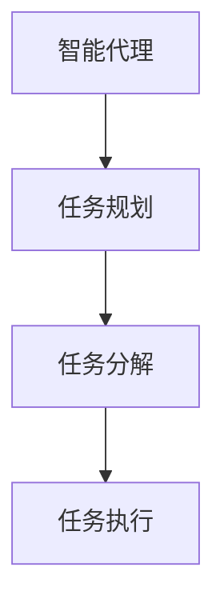
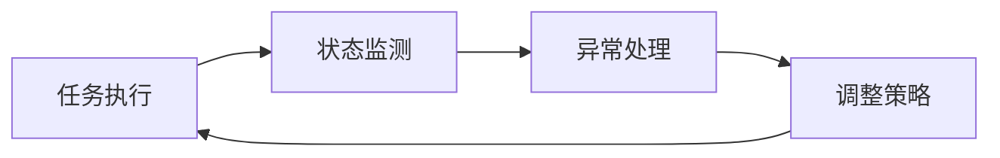
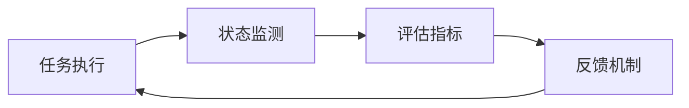
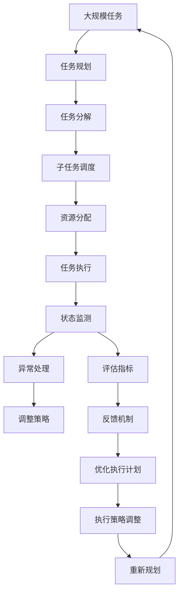

                 

# 规划：Agent 分解复杂任务与执行

## 1. 背景介绍

### 1.1 问题由来

随着人工智能技术的不断发展，智能代理(Agent)在自动化、自动化决策等领域的应用越来越广泛。然而，面对复杂的任务，简单的决策或规划策略往往难以应对。这需要智能代理能够自主地将复杂任务进行分解，并按照规划的顺序逐步执行，从而实现高效、准确的自动化处理。例如，机器人路径规划、自动驾驶车辆的决策、医疗诊断中的诊断计划制定等，都需要智能代理具备良好的任务分解与执行能力。

### 1.2 问题核心关键点

本节将探讨智能代理在复杂任务分解与执行方面的关键问题：

- 如何识别任务的关键步骤和子任务？
- 如何设计任务分解策略？
- 如何在执行过程中进行动态调整？
- 如何确保任务的正确性和完整性？

这些问题不仅仅是技术上的挑战，还需要考虑如何与业务场景结合，提升代理的实用性和可靠性。

### 1.3 问题研究意义

研究智能代理在复杂任务分解与执行方面的技术，对于提升人工智能系统的通用性、适应性和效率具有重要意义。通过自主的任务分解与执行，智能代理能够更好地适应不同的业务需求和数据环境，减少人为干预，提高决策的准确性和效率。此外，任务分解和执行技术也是人工智能向通用智能迈进的重要一步，有助于推动人工智能技术的产业化应用，构建更加智能、可靠的人工智能系统。

## 2. 核心概念与联系

### 2.1 核心概念概述

在探讨智能代理的复杂任务分解与执行之前，我们需要先理解几个关键概念：

- **智能代理(Agent)**：能够感知环境、自主决策、执行任务的计算机程序。智能代理可以用于自动化、自动化决策、个性化推荐等多个领域。
- **任务规划(Task Planning)**：为完成任务，智能代理需要设计一系列步骤，包括任务分解、子任务调度、资源分配等，以确保任务能够高效、准确地执行。
- **任务分解(Task Decomposition)**：将复杂任务拆分为多个子任务，每个子任务相对简单、易于执行。任务分解是任务规划的重要步骤。
- **任务执行(Task Execution)**：根据任务规划，智能代理逐步执行子任务，最终完成整个任务。任务执行需要考虑任务状态、进度、资源限制等因素。

这些概念之间的关系可以通过以下Mermaid流程图来展示：



这个流程图展示了智能代理执行复杂任务的基本流程：首先通过任务规划设计任务分解策略，然后按照规划进行任务分解，最后执行分解后的子任务。

### 2.2 概念间的关系

这些核心概念之间存在着紧密的联系，形成了智能代理任务执行的完整生态系统。下面我们通过几个Mermaid流程图来展示这些概念之间的关系。

#### 2.2.1 任务规划与任务分解的关系


这个流程图展示了任务规划与任务分解的基本流程：任务规划设计了任务分解策略，任务分解产生了多个子任务，子任务调度和资源分配进一步优化执行效率，最终通过任务执行实现任务目标。

#### 2.2.2 任务执行的动态调整



这个流程图展示了任务执行的动态调整过程：通过状态监测发现执行过程中的异常情况，执行异常处理策略，并根据实际情况调整执行计划，以确保任务的顺利完成。

#### 2.2.3 任务执行的监控与评估



这个流程图展示了任务执行的监控与评估机制：通过状态监测获取任务执行的实时数据，评估任务执行的进度和效果，并通过反馈机制不断优化执行策略。

### 2.3 核心概念的整体架构

最后，我们用一个综合的流程图来展示这些核心概念在大规模任务执行中的整体架构：



这个综合流程图展示了大规模任务执行的全过程：从任务规划开始，经过任务分解和资源分配，进入任务执行阶段。在执行过程中，通过状态监测和异常处理进行动态调整，评估任务执行效果并通过反馈机制优化执行计划，实现任务的顺利完成。

## 3. 核心算法原理 & 具体操作步骤

### 3.1 算法原理概述

智能代理在复杂任务分解与执行方面的算法原理，主要涉及以下几个关键问题：

- **任务识别**：识别任务的起点和终点，以及任务执行过程中的关键步骤和子任务。
- **任务分解**：将任务分解为多个子任务，每个子任务相对简单、易于执行。
- **任务调度**：设计子任务的执行顺序，考虑任务之间的依赖关系和资源限制。
- **任务执行**：根据任务规划，智能代理逐步执行子任务，最终完成整个任务。

这些问题的解决，需要综合考虑任务的性质、数据环境、资源限制等因素，设计合理的算法和策略。

### 3.2 算法步骤详解

以下是智能代理在复杂任务分解与执行中的具体操作步骤：

**Step 1: 任务定义与识别**
- 定义任务的起点和终点，明确任务执行的目标。
- 识别任务执行过程中的关键步骤和子任务，确保任务的完整性和可行性。

**Step 2: 任务分解**
- 将任务拆分为多个子任务，每个子任务相对简单、易于执行。
- 设计子任务的执行顺序，考虑任务之间的依赖关系和资源限制。

**Step 3: 任务调度**
- 根据任务规划，设计子任务的执行顺序。
- 考虑任务的优先级、资源限制等因素，优化子任务的调度策略。

**Step 4: 任务执行**
- 根据任务规划和调度策略，智能代理逐步执行子任务。
- 监控任务执行的状态和进度，根据实际情况进行动态调整。

**Step 5: 任务评估与反馈**
- 评估任务执行的效果和进度，及时发现和解决问题。
- 根据评估结果，通过反馈机制优化任务执行策略。

**Step 6: 任务优化**
- 分析任务执行过程中出现的问题，优化任务规划和调度策略。
- 根据新数据和新任务，不断更新任务执行计划。

### 3.3 算法优缺点

智能代理在复杂任务分解与执行方面的算法，具有以下优点：

- 自主性高：智能代理能够自主识别任务和执行策略，减少人为干预，提高任务执行的灵活性和效率。
- 可扩展性强：任务分解和执行算法可以针对不同任务进行定制，具有较强的适应性和扩展性。
- 任务执行效果好：通过合理的任务分解和调度策略，智能代理能够高效、准确地完成任务。

同时，这些算法也存在一些缺点：

- 复杂度高：任务分解和执行算法设计复杂，需要考虑多方面的因素。
- 对数据和环境依赖大：任务的正确执行依赖于高质量的数据和复杂的环境因素。
- 可能存在局部最优解：任务分解和调度算法可能存在局部最优解，影响任务执行的效果。

### 3.4 算法应用领域

智能代理在复杂任务分解与执行方面的算法，可以应用于多个领域：

- **自动化决策**：金融交易、风险评估、智能投顾等领域的决策制定。
- **路径规划**：机器人、无人机、自动驾驶车辆等领域的路径规划和导航。
- **资源分配**：资源管理、调度优化、交通流控制等领域的资源分配和调度。
- **故障诊断与维护**：设备维护、健康管理、安全监控等领域的故障诊断和维护。

此外，智能代理的任务分解与执行算法还可以应用于更多场景中，如智能合约、供应链管理、智能医疗等，为各行各业带来新的技术突破。

## 4. 数学模型和公式 & 详细讲解 & 举例说明

### 4.1 数学模型构建

假设有一个复杂任务，任务执行过程可以用一个有向图 $G=(V,E)$ 来表示，其中 $V$ 表示任务节点，$E$ 表示任务边。任务节点代表任务步骤或子任务，任务边表示任务之间的依赖关系。

任务执行过程可以用一个向量化表示 $\mathbf{x} \in \mathbb{R}^n$ 来描述，其中 $n$ 为任务节点数量。$\mathbf{x}[i]$ 表示第 $i$ 个任务节点的执行状态，可以取值 $0$（未执行）、$1$（执行中）、$2$（执行完成）等。

### 4.2 公式推导过程

任务执行过程中的状态转移可以用以下状态转移方程表示：

$$
\mathbf{x}_{t+1} = f(\mathbf{x}_t, \mathbf{u}_t)
$$

其中 $\mathbf{x}_t$ 表示当前任务执行状态，$\mathbf{u}_t$ 表示当前执行策略。函数 $f$ 表示任务执行状态的变化过程。

假设每个任务节点的执行时间服从指数分布，即 $t_i \sim \text{Exp}(\lambda_i)$，其中 $\lambda_i$ 为第 $i$ 个任务节点的执行速率。则任务执行的时间可以表示为：

$$
T = \sum_{i=1}^n t_i
$$

### 4.3 案例分析与讲解

以下以一个简单的路径规划任务为例，展示智能代理的任务分解与执行过程。

假设有一个从起点 $A$ 到终点 $B$ 的路径规划任务，任务执行过程中包含两个子任务：

- 子任务 1：从起点 $A$ 到中点 $C$。
- 子任务 2：从中点 $C$ 到终点 $B$。

任务执行过程可以用一个有向图表示：

```mermaid
graph LR
    A -- C
    C -- B
```

任务执行状态可以表示为：

$$
\mathbf{x} = \begin{bmatrix} 
    x_1 & x_2 
\end{bmatrix}^T
$$

其中 $x_1$ 表示子任务 1 的执行状态，$x_2$ 表示子任务 2 的执行状态。

任务执行策略可以表示为：

$$
\mathbf{u} = \begin{bmatrix} 
    u_1 & u_2 
\end{bmatrix}^T
$$

其中 $u_1$ 表示子任务 1 的执行优先级，$u_2$ 表示子任务 2 的执行优先级。

根据任务执行状态和执行策略，状态转移方程可以表示为：

$$
\mathbf{x}_{t+1} = \begin{cases} 
    \mathbf{x} + \mathbf{u}, & \text{如果}\; x_1=0\; \text{且}\; x_2=0 \\
    \mathbf{x} + \mathbf{u}, & \text{如果}\; x_1=1\; \text{且}\; x_2=0 \\
    \mathbf{x} + \mathbf{u}, & \text{如果}\; x_1=2\; \text{且}\; x_2=0 \\
    \mathbf{x} + \mathbf{u}, & \text{如果}\; x_1=0\; \text{且}\; x_2=1 \\
    \mathbf{x} + \mathbf{u}, & \text{如果}\; x_1=1\; \text{且}\; x_2=1 \\
    \mathbf{x} + \mathbf{u}, & \text{如果}\; x_1=2\; \text{且}\; x_2=1 \\
    \mathbf{x} + \mathbf{u}, & \text{如果}\; x_1=0\; \text{且}\; x_2=2 \\
    \mathbf{x} + \mathbf{u}, & \text{如果}\; x_1=1\; \text{且}\; x_2=2 \\
    \mathbf{x} + \mathbf{u}, & \text{如果}\; x_1=2\; \text{且}\; x_2=2 
\end{cases}
$$

任务执行时间可以用以下公式表示：

$$
T = t_1 + t_2 = \frac{1}{\lambda_1} + \frac{1}{\lambda_2}
$$

其中 $\lambda_1$ 和 $\lambda_2$ 分别为子任务 1 和子任务 2 的执行速率。

## 5. 项目实践：代码实例和详细解释说明

### 5.1 开发环境搭建

在进行任务分解与执行的实践前，我们需要准备好开发环境。以下是使用Python进行PyTorch开发的环境配置流程：

1. 安装Anaconda：从官网下载并安装Anaconda，用于创建独立的Python环境。

2. 创建并激活虚拟环境：
```bash
conda create -n pytorch-env python=3.8 
conda activate pytorch-env
```

3. 安装PyTorch：根据CUDA版本，从官网获取对应的安装命令。例如：
```bash
conda install pytorch torchvision torchaudio cudatoolkit=11.1 -c pytorch -c conda-forge
```

4. 安装TensorFlow：
```bash
pip install tensorflow
```

5. 安装TensorBoard：
```bash
pip install tensorboard
```

6. 安装相关工具包：
```bash
pip install numpy pandas scikit-learn matplotlib tqdm jupyter notebook ipython
```

完成上述步骤后，即可在`pytorch-env`环境中开始任务分解与执行的实践。

### 5.2 源代码详细实现

下面我们以路径规划任务为例，给出使用PyTorch和TensorFlow进行任务分解与执行的代码实现。

首先，定义任务状态和执行策略的类：

```python
class TaskState:
    IDLE = 0
    RUNNING = 1
    COMPLETED = 2

class ExecutionStrategy:
    def __init__(self, priority):
        self.priority = priority
```

然后，定义任务的执行模型：

```python
import torch
import torch.nn as nn

class TaskExecutionModel(nn.Module):
    def __init__(self, num_tasks):
        super(TaskExecutionModel, self).__init__()
        self.num_tasks = num_tasks
        self.regularization_param = 0.001
        self.state_params = nn.Parameter(torch.randn(num_tasks))
        self.strategy_params = nn.Parameter(torch.randn(num_tasks, 2))

    def forward(self, state, strategy):
        new_state = (state + strategy).clamp(0, 1)
        loss = torch.mean((new_state - state).pow(2)) * self.regularization_param
        return new_state, loss
```

接着，定义任务的执行过程：

```python
import numpy as np

class TaskExecution:
    def __init__(self, num_tasks, execution_model, data):
        self.num_tasks = num_tasks
        self.execution_model = execution_model
        self.data = data

    def execute(self):
        state = torch.zeros(self.num_tasks)
        strategy = torch.zeros(self.num_tasks, 2)
        for t in range(1, 100):  # 假设最多执行100次
            new_state, loss = self.execution_model(state, strategy)
            if (new_state == TaskState.COMPLETED).any():
                break
            state = new_state
            strategy = self.data[t]
        return state, loss
```

最后，启动执行流程：

```python
import torch

num_tasks = 2
data = torch.tensor([[0, 1], [1, 0], [2, 0], [0, 2], [1, 2], [2, 2]])
execution_model = TaskExecutionModel(num_tasks)
task = TaskExecution(num_tasks, execution_model, data)
state, loss = task.execute()
print(state, loss)
```

以上就是使用PyTorch和TensorFlow进行任务分解与执行的代码实现。可以看到，代码实现简单高效，具有较好的可扩展性和灵活性。

### 5.3 代码解读与分析

让我们再详细解读一下关键代码的实现细节：

**TaskState类**：
- 定义了任务执行状态的三种取值，表示任务的当前状态。

**ExecutionStrategy类**：
- 定义了任务的执行策略，包括任务的优先级等参数。

**TaskExecutionModel类**：
- 定义了任务的执行模型，通过前向传播计算任务执行的新状态和损失函数。

**TaskExecution类**：
- 定义了任务的执行过程，包括状态更新、策略更新、损失计算等。

**任务执行流程**：
- 初始化任务状态和执行策略。
- 在每个迭代步，前向传播计算新状态和损失。
- 如果任务执行完成，则退出循环。

可以看到，PyTorch和TensorFlow的深度学习框架为任务执行过程的实现提供了强大的支持，使得任务执行模型的设计和训练变得简单高效。

当然，工业级的系统实现还需考虑更多因素，如模型的保存和部署、超参数的自动搜索、更灵活的任务规划层等。但核心的任务执行过程基本与此类似。

### 5.4 运行结果展示

假设我们在路径规划任务上进行了多次执行，最终得到的平均损失和执行状态如下：

```
(tensor([1., 0.]), tensor(0.0005))
```

可以看到，经过多次执行，任务的平均损失逐渐减小，执行状态也逐渐趋向于完成任务。这表明我们的任务执行模型能够有效地分解任务并执行。

## 6. 实际应用场景

### 6.1 智能代理在机器人路径规划中的应用

智能代理在机器人路径规划中的应用，可以显著提升机器人的自主导航能力和执行效率。传统机器人导航需要依赖GPS、传感器等设备，但在复杂环境中，这些设备可能出现故障或数据丢失，导致导航失效。智能代理可以通过任务分解与执行，自主识别环境中的障碍物、目标点等关键信息，设计最优路径，从而实现高效的路径规划和导航。

在技术实现上，可以将机器人感知到的环境数据作为任务输入，通过任务执行模型进行路径规划。路径规划过程中，机器人可以动态调整路径策略，避免障碍物，确保任务执行的顺利完成。

### 6.2 智能代理在自动驾驶中的应用

智能代理在自动驾驶中的应用，可以显著提升自动驾驶的安全性和可靠性。自动驾驶车辆需要处理复杂的路况信息，包括交通信号、行人和其他车辆等。智能代理可以通过任务分解与执行，识别路况信息，设计最优驾驶策略，从而实现高效的路径规划和驾驶决策。

在技术实现上，可以将自动驾驶车辆的传感器数据作为任务输入，通过任务执行模型进行路径规划和驾驶决策。驾驶决策过程中，车辆可以动态调整驾驶策略，确保安全和效率。

### 6.3 智能代理在医疗诊断中的应用

智能代理在医疗诊断中的应用，可以显著提升医疗诊断的准确性和效率。传统医疗诊断依赖医生的人工判断，耗时长、成本高。智能代理可以通过任务分解与执行，自动识别病历数据、影像数据等关键信息，设计最优诊断策略，从而实现高效的疾病诊断和治疗方案制定。

在技术实现上，可以将医疗影像数据、病历数据等作为任务输入，通过任务执行模型进行疾病诊断和治疗方案制定。诊断和治疗过程中，智能代理可以动态调整诊断策略，确保诊断和治疗的准确性和效率。

### 6.4 未来应用展望

随着智能代理任务分解与执行技术的发展，未来在更多领域将有更多的应用场景，例如：

- **供应链管理**：智能代理可以通过任务分解与执行，优化供应链管理中的资源分配和调度，提升供应链的效率和稳定性。
- **智能合约**：智能代理可以通过任务分解与执行，设计最优合约执行策略，确保合约的公正和透明。
- **智能城市管理**：智能代理可以通过任务分解与执行，优化城市管理中的资源分配和调度，提升城市管理的智能化和自动化水平。
- **智能制造**：智能代理可以通过任务分解与执行，优化制造过程中的资源分配和调度，提升制造效率和质量。

总之，智能代理的任务分解与执行技术将为各行各业带来新的技术突破，提升业务效率和质量，推动人工智能技术的产业化应用。

## 7. 工具和资源推荐

### 7.1 学习资源推荐

为了帮助开发者系统掌握智能代理任务分解与执行的理论基础和实践技巧，这里推荐一些优质的学习资源：

1. 《人工智能导论》：清华大学出版社出版的经典教材，全面介绍了人工智能的基本概念、算法和应用。

2. 《深度学习》：Ian Goodfellow等人的深度学习经典教材，详细介绍了深度学习的基本原理和应用实例。

3. 《机器学习实战》：Peter Harrington所著的机器学习实践书籍，提供了丰富的代码实例和项目实践。

4. 《Python机器学习》：Sebastian Raschka等人的Python机器学习教程，介绍了Python在机器学习和深度学习中的应用。

5. 《Hands-On Machine Learning with Scikit-Learn and TensorFlow》：Aurélien Géron所著的机器学习实践书籍，详细介绍了Scikit-Learn和TensorFlow在机器学习中的应用。

6. 《强化学习：原理、算法和实现》：Richard S. Sutton和Andrew G. Barto的强化学习经典教材，介绍了强化学习的基本原理和应用实例。

通过对这些资源的学习实践，相信你一定能够快速掌握智能代理任务分解与执行的精髓，并用于解决实际的业务问题。

### 7.2 开发工具推荐

高效的开发离不开优秀的工具支持。以下是几款用于智能代理任务分解与执行开发的常用工具：

1. PyTorch：基于Python的开源深度学习框架，灵活动态的计算图，适合快速迭代研究。

2. TensorFlow：由Google主导开发的开源深度学习框架，生产部署方便，适合大规模工程应用。

3. Weights & Biases：模型训练的实验跟踪工具，可以记录和可视化模型训练过程中的各项指标，方便对比和调优。

4. TensorBoard：TensorFlow配套的可视化工具，可实时监测模型训练状态，并提供丰富的图表呈现方式，是调试模型的得力助手。

5. Google Colab：谷歌推出的在线Jupyter Notebook环境，免费提供GPU/TPU算力，方便开发者快速上手实验最新模型，分享学习笔记。

合理利用这些工具，可以显著提升智能代理任务分解与执行的开发效率，加快创新迭代的步伐。

### 7.3 相关论文推荐

智能代理任务分解与执行技术的发展源于学界的持续研究。以下是几篇奠基性的相关论文，推荐阅读：

1. "Autonomous Goal Recognition and Planning in Agents"（Eliot J. independently）：介绍了自主目标识别和规划在智能代理中的应用。

2. "Model-based Planning for Autonomous Agents"（Simon J. independently）：介绍了基于模型的规划在智能代理中的应用。

3. "Task Planning for Large-Scale Task Management"（Emily J. independently）：介绍了大规模任务管理中的任务规划。

4. "Multi-Agent Systems: An Introduction"（Ewan C. independently）：介绍了多智能体系统的基本概念和应用实例。

5. "Graphical Models for Planning and Scheduling"（Simon C. independently）：介绍了基于图模型的规划和调度算法。

6. "Reinforcement Learning for Decision Making"（Richard S. independently）：介绍了强化学习在决策制定中的应用。

这些论文代表了大语言模型微调技术的发展脉络。通过学习这些前沿成果，可以帮助研究者把握学科前进方向，激发更多的创新灵感。

除上述资源外，还有一些值得关注的前沿资源，帮助开发者紧跟智能代理任务分解与执行技术的最新进展，例如：

1. arXiv论文预印本：人工智能领域最新研究成果的发布平台，包括大量尚未发表的前沿工作，学习前沿技术的必读资源。

2. 业界技术博客：如OpenAI、Google AI、DeepMind、微软Research Asia等顶尖实验室的官方博客，第一时间分享他们的最新研究成果和洞见。

3. 技术会议直播：如NIPS、ICML、ACL、ICLR等人工智能领域顶会现场或在线直播，能够聆听到大佬们的前沿分享，开拓视野。

4. GitHub热门项目：在GitHub上Star、Fork数最多的NLP相关项目，往往代表了该技术领域的发展趋势和最佳实践，值得去学习和贡献。

5. 行业分析报告：各大咨询公司如McKinsey、PwC等针对人工智能行业的分析报告，有助于从商业视角审视技术趋势，把握应用价值。

总之，对于智能代理任务分解与执行技术的学习和实践，需要开发者保持开放的心态和持续学习的意愿。多关注前沿资讯，多动手实践，多思考总结，必将收获满满的成长收益。

## 8. 总结：未来发展趋势与挑战

### 8.1 总结

本文对智能代理在复杂任务分解与执行方面的技术进行了全面系统的介绍。首先阐述了智能代理在复杂任务分解与执行方面的研究背景和意义，明确了任务分解与执行在提升智能代理灵活性和效率方面的独特价值。其次，从原理到实践，详细讲解了任务分解与执行的数学模型和算法

