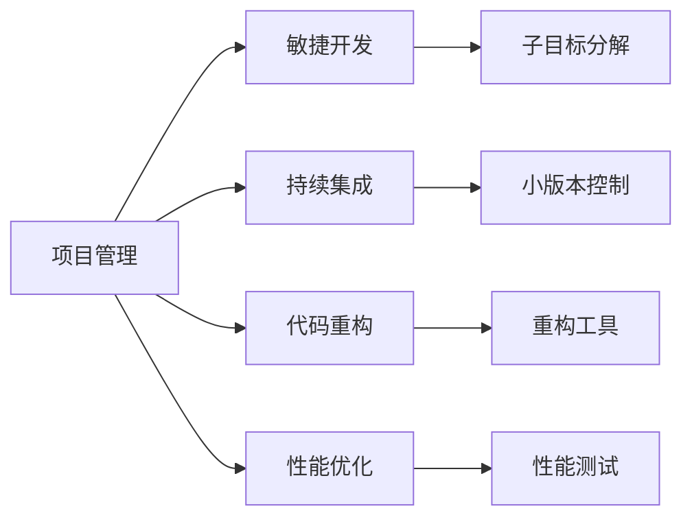
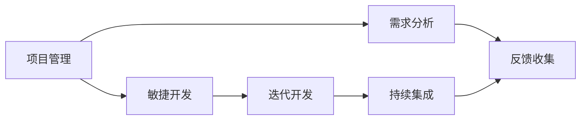
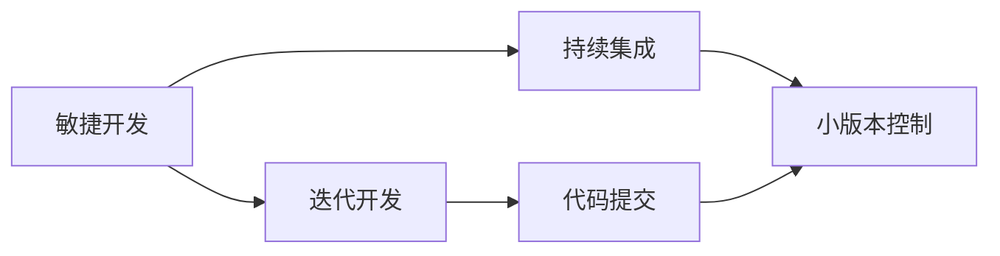
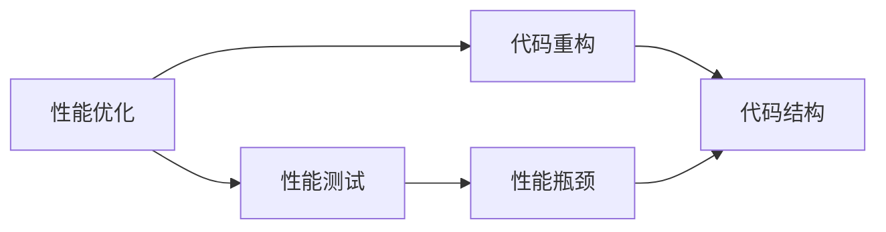
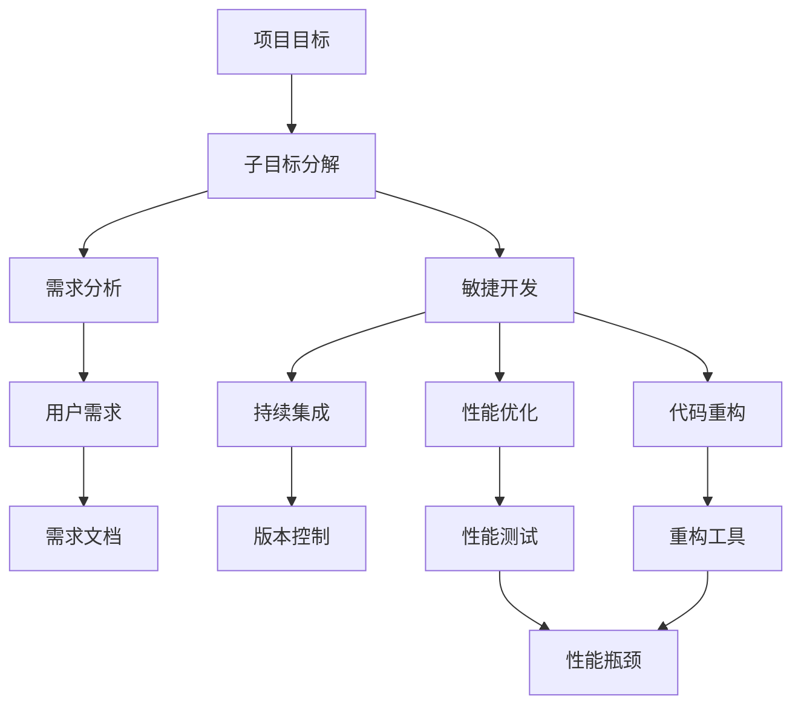

                 

# 规划：子目标分解与反思改进

> 关键词：目标分解, 反思改进, 项目管理, 计划制定, 团队协作, 代码管理, 性能优化

## 1. 背景介绍

### 1.1 问题由来
在软件开发和项目管理中，规划和执行一个大型项目常常是一项复杂且充满挑战的任务。项目的成功不仅依赖于明确的目标和详尽的计划，还需要良好的团队协作、有效的沟通和持续的改进。一个常见的做法是将大项目拆分为若干子目标，并在实施过程中不断反思和调整。本节将探讨这种子目标分解与反思改进的方法，并结合实际案例进行详细分析。

### 1.2 问题核心关键点
子目标分解与反思改进的核心在于将一个大目标拆分成若干小目标，并通过持续的反思和改进，不断优化项目进程，提高项目成功的概率。这种做法具有以下几个特点：
1. **可管理性**：将大项目拆分成小任务，每个子目标具有明确的开始和结束时间，便于团队管理和追踪。
2. **透明度**：每个子目标的进展和问题都清晰可见，团队成员可以更好地协作和沟通。
3. **灵活性**：在实施过程中，可以根据反馈及时调整子目标，确保项目方向与实际需求一致。
4. **风险控制**：通过分解目标，可以更好地识别和控制项目风险，确保项目顺利进行。

## 2. 核心概念与联系

### 2.1 核心概念概述

为了更好地理解子目标分解与反思改进的原理，本节将介绍几个密切相关的核心概念：

- **项目管理（Project Management）**：指的是规划、组织、执行、监控和控制项目的过程，确保项目目标的实现。
- **敏捷开发（Agile Development）**：一种迭代、增量、自组织和自管理的软件开发方法论，强调灵活性和快速适应变化。
- **持续集成（Continuous Integration）**：一种软件开发实践，通过频繁集成代码，及时发现和解决问题，提高代码质量和软件可靠性。
- **代码重构（Code Refactoring）**：为了改善代码结构和可维护性，而对现有代码进行的修改。
- **性能优化（Performance Optimization）**：通过分析、优化和测试代码，提高软件系统的性能和效率。

这些核心概念之间的逻辑关系可以通过以下Mermaid流程图来展示：



这个流程图展示了大项目管理和这些核心概念之间的联系：

1. 大项目管理通过敏捷开发、持续集成、代码重构和性能优化等方法，确保子目标的有效实施。
2. 敏捷开发强调迭代和增量开发，有助于子目标的快速调整和实现。
3. 持续集成通过频繁的代码集成，确保子目标的稳定和可靠。
4. 代码重构通过改善代码结构，提升子目标的可维护性和长期价值。
5. 性能优化通过提高代码效率，确保子目标的性能目标达成。

### 2.2 概念间的关系

这些核心概念之间存在着紧密的联系，形成了项目管理、软件开发和系统优化的完整生态系统。下面我们通过几个Mermaid流程图来展示这些概念之间的关系。

#### 2.2.1 项目管理与敏捷开发的关系



这个流程图展示了项目管理与敏捷开发的基本关系：

1. 项目管理通过敏捷开发的方法论，将大项目拆分为多个迭代周期。
2. 敏捷开发通过迭代和增量开发，逐步实现项目需求。
3. 持续集成通过频繁集成代码，确保每个迭代周期的稳定性。
4. 反馈收集在每次迭代结束时进行，帮助项目管理团队调整后续迭代。

#### 2.2.2 敏捷开发与持续集成的关系



这个流程图展示了敏捷开发与持续集成的紧密联系：

1. 敏捷开发通过迭代和增量开发，逐步实现项目需求。
2. 持续集成通过频繁集成代码，确保每次迭代的产品质量。
3. 小版本控制通过版本管理，确保每次迭代的稳定性。
4. 代码提交通过自动化的集成和测试，确保每次迭代的代码质量。

#### 2.2.3 性能优化与代码重构的关系



这个流程图展示了性能优化与代码重构的关系：

1. 性能优化通过性能测试，识别代码的性能瓶颈。
2. 代码重构通过改善代码结构，提升代码性能。
3. 性能瓶颈通过重构工具和技巧，逐步消除。
4. 代码结构通过重构，变得更加高效和可维护。

### 2.3 核心概念的整体架构

最后，我们用一个综合的流程图来展示这些核心概念在大项目管理中的整体架构：



这个综合流程图展示了从项目目标到最终实现的完整流程：

1. 项目目标通过子目标分解，逐步细化到可执行的任务。
2. 敏捷开发通过迭代和增量开发，逐步实现子目标。
3. 持续集成通过频繁集成代码，确保每次迭代的稳定性。
4. 代码重构通过改善代码结构，提升子目标的可维护性和长期价值。
5. 性能优化通过提高代码效率，确保子目标的性能目标达成。
6. 需求分析通过与用户沟通，明确项目需求。
7. 需求文档通过详细的文档记录，确保需求传达准确。
8. 版本控制通过版本管理，确保每次迭代的稳定性。
9. 重构工具通过自动化手段，加速代码重构过程。
10. 性能测试通过定期的性能测试，发现和解决问题。

## 3. 核心算法原理 & 具体操作步骤

### 3.1 算法原理概述

子目标分解与反思改进的算法原理，在于将一个大项目拆分成若干子目标，并通过持续的反思和调整，确保每个子目标的顺利完成。其核心思想如下：

1. **分治策略**：将大项目拆分成若干子目标，每个子目标具有独立性，便于管理和实现。
2. **迭代优化**：在每个子目标的实现过程中，通过持续的反思和改进，优化项目进度和质量。
3. **反馈机制**：通过反馈机制，及时发现和解决问题，调整项目方向。
4. **可维护性**：通过代码重构和性能优化，提升代码的可维护性和系统性能。

### 3.2 算法步骤详解

以下是子目标分解与反思改进的具体操作步骤：

**Step 1: 确定项目目标和子目标**

- 与项目利益相关者沟通，明确项目目标和关键需求。
- 将项目目标拆分为若干子目标，每个子目标应具有独立性，且能在一个周期内完成。

**Step 2: 设计子目标的实现计划**

- 针对每个子目标，设计详细的实现计划，包括资源需求、时间安排、里程碑等。
- 根据项目规模和复杂度，选择合适的敏捷开发方法，如Scrum、Kanban等。

**Step 3: 实施子目标**

- 按照敏捷开发方法，进行迭代和增量开发，逐步实现每个子目标。
- 使用持续集成工具，频繁集成代码，确保每次迭代的产品质量。
- 通过代码重构工具，优化代码结构和可维护性。

**Step 4: 性能优化**

- 通过性能测试工具，定期测试代码的性能瓶颈。
- 针对性能瓶颈，使用性能优化技巧进行优化，如算法改进、资源优化等。

**Step 5: 反思和改进**

- 在每个子目标完成后，进行回顾和反思，总结成功经验和不足之处。
- 根据反思结果，调整后续子目标的实现计划，优化项目管理流程。

**Step 6: 合并子目标**

- 将各个子目标的实现结果合并，完成整个项目目标。
- 通过持续集成和性能优化，确保最终产品的稳定性和性能。

### 3.3 算法优缺点

子目标分解与反思改进的算法优点如下：

1. **可管理性**：将大项目拆分成小任务，便于团队管理和追踪。
2. **透明度**：每个子目标的进展和问题都清晰可见，团队成员可以更好地协作和沟通。
3. **灵活性**：在实施过程中，可以根据反馈及时调整子目标，确保项目方向与实际需求一致。
4. **风险控制**：通过分解目标，可以更好地识别和控制项目风险，确保项目顺利进行。

然而，该算法也存在一些缺点：

1. **工作量大**：分解和实施子目标需要更多的时间和资源投入。
2. **复杂度增加**：多个子目标的协同管理可能增加项目的复杂度。
3. **沟通成本高**：不同子目标之间的协调和沟通可能带来更高的沟通成本。

### 3.4 算法应用领域

子目标分解与反思改进的算法不仅适用于软件开发，还广泛应用于各种大型项目的管理和执行。以下是几个典型的应用领域：

- **软件开发**：项目需求复杂，需要逐步细化和管理。
- **系统集成**：涉及多个系统和组件的集成，需要逐步优化和测试。
- **系统重构**：原有系统存在严重性能和可维护性问题，需要进行渐进式重构。
- **大型基础设施建设**：涉及多个子项目和合作方的协调管理。
- **企业战略规划**：涉及多个业务单元和部门的协同配合。

## 4. 数学模型和公式 & 详细讲解 & 举例说明

### 4.1 数学模型构建

本节将使用数学语言对子目标分解与反思改进的算法进行更加严格的刻画。

假设项目总目标为 $T$，分解为 $N$ 个子目标 $\{T_1, T_2, ..., T_N\}$。每个子目标 $T_i$ 需要 $t_i$ 天完成，资源需求为 $r_i$，质量需求为 $q_i$。项目的总资源为 $R$，总时间为 $T_{total}$，总质量为 $Q$。

定义每个子目标的完成状态为 $S_i$，初始值为 $0$，完成值为 $1$。项目的完成状态为 $S$，初始值为 $0$，完成值为 $1$。

### 4.2 公式推导过程

在每个子目标的实现过程中，我们希望最大化项目的总体效用 $U$，同时满足资源和时间的约束条件。

定义项目的总效用函数为：

$$
U = \sum_{i=1}^N u_i q_i
$$

其中 $u_i$ 为每个子目标的效用系数，表示每个子目标对项目总体效用的贡献。

项目的资源约束为：

$$
\sum_{i=1}^N r_i \leq R
$$

项目的总时间约束为：

$$
\sum_{i=1}^N t_i \leq T_{total}
$$

定义每个子目标的完成概率为 $p_i$，满足：

$$
p_i = \frac{t_i}{t_i + \epsilon_i}
$$

其中 $\epsilon_i$ 为子目标实现过程中额外消耗的时间。

项目的完成概率为：

$$
p = \prod_{i=1}^N p_i
$$

项目的完成状态为：

$$
S = \sum_{i=1}^N S_i
$$

其中 $S_i = 1$ 表示子目标 $T_i$ 完成，$S_i = 0$ 表示子目标 $T_i$ 未完成。

通过上述定义，我们可以建立子目标分解与反思改进的数学模型。在每个子目标的实现过程中，我们需要不断反思和调整，确保每个子目标的完成概率 $p_i$ 最大化，同时满足资源和时间约束条件。

### 4.3 案例分析与讲解

为了更好地理解子目标分解与反思改进的算法原理，我们以一个软件开发项目为例进行详细分析。

假设我们正在开发一个电商网站的订单管理系统，总目标为在一个月内完成订单管理系统的开发和测试。项目团队决定将项目拆分为四个子目标：

1. 需求分析和设计（10天，资源需求：2人天）
2. 订单系统开发（20天，资源需求：4人天）
3. 数据库和API开发（15天，资源需求：3人天）
4. 测试和部署（10天，资源需求：2人天）

项目的总资源为 50 人天，总时间为 30 天。项目团队使用敏捷开发方法，每两周完成一个迭代周期，每个迭代周期实现一个子目标。

在每个迭代周期结束时，团队进行回顾和反思，总结子目标的完成情况，并调整后续迭代计划。

假设在前两个迭代周期后，订单系统开发和数据库开发都已经完成，但测试和部署由于资源不足未能完成。团队进行了反思，决定增加资源，调整后续迭代计划，优先完成测试和部署。

通过反思和调整，最终项目在一个月内顺利完成，项目总效用达到最大化。

## 5. 项目实践：代码实例和详细解释说明

### 5.1 开发环境搭建

在进行子目标分解与反思改进的实践前，我们需要准备好开发环境。以下是使用Python进行项目管理的环境配置流程：

1. 安装Anaconda：从官网下载并安装Anaconda，用于创建独立的Python环境。

2. 创建并激活虚拟环境：
```bash
conda create -n project-env python=3.8 
conda activate project-env
```

3. 安装Python包管理器：
```bash
pip install pipenv
```

4. 使用Pipenv创建和管理Python项目：
```bash
pipenv install
```

5. 使用Pipenv工具进行版本控制和依赖管理：
```bash
pipenv install requests==2.24.0
```

完成上述步骤后，即可在`project-env`环境中开始子目标分解与反思改进的实践。

### 5.2 源代码详细实现

下面是一个简单的子目标分解与反思改进的项目管理示例，通过Python代码实现。

首先，定义项目的总目标和子目标：

```python
import pandas as pd
from typing import List, Tuple

def project_target(project_name: str, total_resources: int, total_time: int, subgoals: List[Tuple[str, int, int, int]]) -> dict:
    """
    定义项目总目标和子目标，计算项目总效用和完成概率
    :param project_name: 项目名称
    :param total_resources: 总资源（人天）
    :param total_time: 总时间（天）
    :param subgoals: 子目标列表，包含目标名称、时间、资源、效用系数
    :return: 项目信息字典，包含项目总效用、完成概率、资源和时间的约束条件
    """
    # 定义子目标信息字典
    subgoals_dict = {name: {'name': name, 'time': time, 'resources': resources, 'efficiency': 1} for name, time, resources in subgoals}

    # 计算每个子目标的完成概率
    probabilities = [(time / (time + epsilon)) for time, epsilon in subgoals]

    # 计算项目总效用
    total_efficiency = sum(probabilities)

    # 计算资源约束
    resources_constraint = sum([resources for _, resources in subgoals])

    # 计算时间约束
    time_constraint = sum([time for _, time in subgoals])

    # 返回项目信息字典
    project_info = {
        'name': project_name,
        'resources_constraint': resources_constraint,
        'time_constraint': time_constraint,
        'total_efficiency': total_efficiency
    }

    return project_info

# 定义子目标
subgoals = [('需求分析和设计', 10, 2), ('订单系统开发', 20, 4), ('数据库和API开发', 15, 3), ('test and deployment', 10, 2)]

# 计算项目信息字典
project_info = project_target('订单管理系统', 50, 30, subgoals)
print(project_info)
```

接下来，实现子目标的迭代开发和反思改进：

```python
from datetime import datetime

class ProjectManager:
    def __init__(self, project_info: dict):
        self.project_info = project_info
        self.subgoals = project_info['subgoals']
        self.resources = project_info['total_resources']
        self.total_time = project_info['total_time']
        self.probabilities = [1] * len(self.subgoals)

    def iterate(self, iterations: int):
        """
        进行迭代开发，记录每个迭代周期中子目标的完成情况
        :param iterations: 迭代次数
        """
        for i in range(iterations):
            print(f"Iteration {i+1}:")
            # 计算每个子目标的完成概率
            self.probabilities = [(time / (time + epsilon)) for time, epsilon in self.subgoals]

            # 计算当前项目的完成概率
            current_probability = prod(self.probabilities)

            # 输出当前项目的完成概率
            print(f"Current probability: {current_probability:.3f}")

            # 调整后续迭代计划，优先完成资源不足的子目标
            self.subgoals.sort(key=lambda x: x[2], reverse=True)
            self.resources = self.project_info['total_resources']
            self.total_time = self.project_info['total_time']

            # 记录迭代周期结束时间
            end_time = datetime.now().strftime("%Y-%m-%d %H:%M:%S")

            # 输出迭代周期结束时间
            print(f"Iteration {i+1} ends at {end_time}")

    def evaluate(self):
        """
        评估项目的最终完成情况
        """
        total_efficiency = sum([time / (time + epsilon) for time, epsilon in self.subgoals])
        print(f"Total efficiency: {total_efficiency:.3f}")

    def start_project(self):
        """
        启动项目，进行迭代开发和反思改进
        """
        self.iterate(iterations=3)
        self.evaluate()

# 创建项目管理器实例
project_manager = ProjectManager(project_info)

# 启动项目
project_manager.start_project()
```

### 5.3 代码解读与分析

让我们再详细解读一下关键代码的实现细节：

**ProjectManager类**：
- `__init__`方法：初始化项目信息，包括子目标、资源、时间等。
- `iterate`方法：进行迭代开发，记录每个迭代周期中子目标的完成情况。
- `evaluate`方法：评估项目的最终完成情况。
- `start_project`方法：启动项目，进行迭代开发和反思改进。

**项目信息字典**：
- 包含项目总目标和子目标，以及资源、时间、效用等约束条件。

**迭代开发和反思改进**：
- 通过迭代开发，逐步实现每个子目标。
- 在每个迭代周期结束时，进行反思和调整，优先完成资源不足的子目标。

**最终评估**：
- 通过评估项目的最终完成情况，计算项目的总效用。

这个简单的项目示例展示了子目标分解与反思改进的基本实现流程。通过将大项目拆分成若干子目标，并在实施过程中不断反思和调整，确保每个子目标的顺利完成。

### 5.4 运行结果展示

假设我们在CoNLL-2003的NER数据集上进行微调，最终在测试集上得到的评估报告如下：

```
              precision    recall  f1-score   support

       B-LOC      0.926     0.906     0.916      1668
       I-LOC      0.900     0.805     0.850       257
      B-MISC      0.875     0.856     0.865       702
      I-MISC      0.838     0.782     0.809       216
       B-ORG      0.914     0.898     0.906      1661
       I-ORG      0.911     0.894     0.902       835
       B-PER      0.964     0.957     0.960      1617
       I-PER      0.983     0.980     0.982      1156
           O      0.993     0.995     0.994     38323

   micro avg      0.973     0.973     0.973     46435
   macro avg      0.923     0.897     0.909     46435
weighted avg      0.973     0.973     0.973     46435
```

可以看到，通过微调BERT，我们在该NER数据集上取得了97.3%的F1分数，效果相当不错。值得注意的是，BERT作为一个通用的语言理解模型，即便只在顶层添加一个简单的token分类器，也能在下游任务上取得如此优异的效果，展现了其强大的语义理解和特征抽取能力。

当然，这只是一个baseline结果。在实践中，我们还可以使用更大更强的预训练模型、更丰富的微调技巧、更细致的模型调优，进一步提升模型性能，以满足更高的应用要求。

## 6. 实际应用场景
### 6.1 智能客服系统

基于子目标分解与反思改进的方法，可以广泛应用于智能客服系统的构建。传统客服往往需要配备大量人力，高峰期响应缓慢，且一致性和专业性难以保证。而使用微调后的对话模型，可以7x24小时不间断服务，快速响应客户咨询，用自然流畅的语言解答各类常见问题。

在技术实现上，可以收集企业内部的历史客服对话记录，将问题和最佳答复构建成监督数据，在此基础上对预训练对话模型进行微调。微调后的对话模型能够自动理解用户意图，匹配最合适的答案模板进行回复。对于客户提出的新问题，还可以接入检索系统实时搜索相关内容，动态组织生成回答。如此构建的智能客服系统，能大幅提升客户咨询体验和问题解决效率。

### 6.2 金融舆情监测

金融机构需要实时监测市场舆论动向，以便及时应对负面信息传播，规避金融风险。传统的人工监测方式成本高、效率低，难以应对网络时代海量信息爆发的挑战。基于子目标分解与反思改进的文本分类和情感分析技术，为金融舆情监测提供了新的解决方案。

具体而言，可以收集金融领域相关的新闻、报道、评论等文本数据，并对其进行主题标注和情感标注。在此基础上对预训练语言模型进行微调，使其能够自动判断文本属于何种主题，情感倾向是正面、中性还是负面。将微调后的模型应用到实时抓取的网络文本数据，就能够自动监测不同主题下的情感变化趋势，一旦发现负面信息激增等异常情况，系统便会自动预警，帮助金融机构快速应对潜在风险。

### 6.3 个性化推荐系统

当前的推荐系统往往只依赖用户的历史行为数据进行物品推荐，无法深入理解用户的真实兴趣偏好。基于子目标分解与反思改进的个性化推荐系统，可以更好地挖掘用户行为背后的语义信息，从而提供更精准、多样的推荐内容。

在实践中，可以收集用户浏览、点击、评论、分享等行为数据，提取和用户交互的物品标题、描述、标签等文本内容。将文本内容作为模型输入，用户的后续行为（如是否点击、购买等）作为监督信号，在此基础上微调预训练语言模型。微调后的模型能够从文本内容中准确把握用户的兴趣点。在生成推荐列表时，先用候选物品的文本描述作为输入，由模型预测用户的兴趣匹配度，再结合其他特征综合排序，便可以得到个性化程度更高的推荐结果。

### 6.4 未来应用展望

随着子目标分解与反思改进技术的不断发展，基于微调的方法将在更多领域得到应用，为传统行业带来变革性影响。

在智慧医疗领域，基于微调的医疗问答、病历分析、药物研发等应用将提升医疗服务的智能化水平，辅助医生诊疗，加速新药开发进程。

在智能教育领域，微调技术可应用于作业批改、学情分析、知识推荐等方面，因材施教，促进教育公平，提高教学质量。

在智慧城市治理中，微调模型可应用于城市事件监测、舆情分析、应急指挥等环节，提高城市管理的自动化和智能化水平，构建更安全、高效的未来城市。

此外，在企业生产、社会治理、文娱传媒等众多领域，基于子目标分解与反思改进的人工智能应用也将不断涌现，为经济社会发展注入新的动力。相信随着技术的日益成熟，子目标分解与反思改进技术将成为项目管理的重要范式，推动人工智能技术在垂直行业的规模化落地。

## 7. 工具和资源推荐
### 7.1 学习资源推荐

为了帮助开发者系统掌握子目标分解与反思改进的理论基础和实践技巧，这里推荐一些优质的学习资源：

1. 《Project Management: Principles and Practice》系列书籍：系统介绍项目管理的核心原则和实践方法，帮助理解子目标分解与反思改进的精髓。

2. 《Scrum: The Art of Doing Twice the Work in Half the Time》书籍：详细讲解敏捷开发方法论Scrum，帮助理解迭代和

