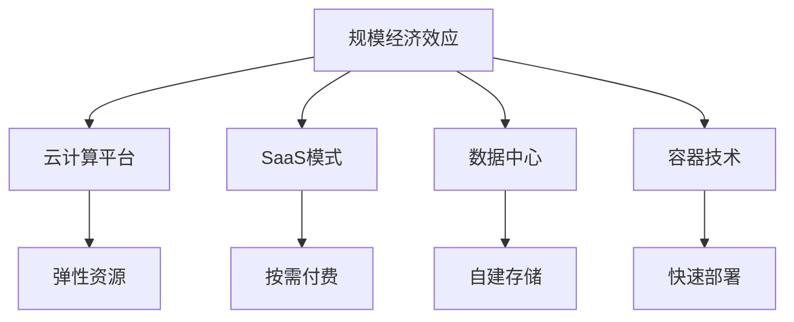

                 

# 规模经济效应的减弱趋势

## 1. 背景介绍

### 1.1 问题由来

规模经济效应（Economies of Scale）是指在生产或服务过程中，随着生产或服务量的增加，单位成本逐渐下降的现象。这一效应在工业经济和传统IT行业得到广泛应用，并成为企业获取竞争优势的重要手段。然而，随着数字经济的发展和云计算技术的兴起，规模经济效应在IT行业中的作用正在逐渐减弱。

规模经济效应的减弱主要体现在以下几个方面：

- **存储成本的急剧下降**：大规模数据中心和云服务提供商通过采用高效的存储技术，如SSD、分布式文件系统、对象存储等，使得数据存储成本大幅降低。这使得云计算平台能够以更低的价格提供更高的存储容量，从而削弱了传统IT企业依赖存储成本优势的竞争策略。

- **计算资源的弹性伸缩**：云计算平台能够根据需求动态调整计算资源的分配，从而避免了传统IT企业面对高峰负载时资源不足的问题。云服务提供商通过优化计算资源的使用率，使得云计算平台在弹性伸缩上的优势更加明显。

- **软件即服务（SaaS）的普及**：SaaS模式通过提供按需付费的服务，降低了企业部署和维护软件的成本。越来越多的企业开始采用SaaS解决方案，从而削弱了传统IT企业在软件部署和维护上的规模经济优势。

### 1.2 问题核心关键点

规模经济效应在IT行业的减弱是一个复杂而多维度的问题。这一变化对企业经营模式、市场竞争、创新能力等方面都产生了深远影响。以下是对该问题核心关键点的详细分析：

- **计算和存储成本的变化**：云平台和数据中心的建设成本大幅降低，使得计算和存储资源变得更为丰富且成本较低，导致规模经济效应的弱化。

- **市场竞争格局的演变**：云服务提供商通过更灵活、更高效的资源管理策略，增强了竞争优势，改变了传统IT企业的市场地位。

- **企业运营模式的变化**：随着SaaS模式的普及，企业更倾向于按需付费，降低了固定成本支出，减少了对规模经济效应的依赖。

- **创新能力的差异**：随着技术进步，企业之间的创新能力差异逐渐显现，而非单纯依赖规模经济效应。

- **数据和应用的可迁移性**：云计算和容器技术的发展，使得数据和应用在不同云平台之间迁移变得更为容易，减少了传统IT企业对自身数据中心的依赖。

### 1.3 问题研究意义

研究规模经济效应的减弱趋势，对于理解IT行业的发展规律、优化企业经营模式、提升市场竞争力、推动技术创新具有重要意义。具体来说：

1. **指导企业战略调整**：规模经济效应的减弱促使企业重新审视其经营策略，寻找新的竞争优势来源。

2. **提升市场竞争力**：在成本和技术变化的背景下，理解规模经济效应的变化趋势有助于企业更准确地预测市场动向，采取更灵活的竞争策略。

3. **推动技术创新**：规模经济效应的减弱迫使企业必须从技术创新中寻找新的增长点，避免陷入价格战的低层次竞争。

4. **促进云计算发展**：规模经济效应的减弱是云计算兴起的一个重要因素，理解这一变化趋势有助于推动云计算技术的普及和应用。

5. **支持企业数字化转型**：规模经济效应的减弱推动了企业数字化转型的进程，帮助企业更好地应对数字化时代的挑战。

## 2. 核心概念与联系

### 2.1 核心概念概述

为了深入理解规模经济效应的减弱趋势，我们需要对一些核心概念进行简要介绍：

- **规模经济效应（Economies of Scale）**：随着生产规模的扩大，单位成本逐渐下降的现象。在IT行业，这一效应主要体现在计算、存储等资源的使用成本上。

- **云计算平台（Cloud Platforms）**：基于互联网提供计算、存储、网络等资源的平台，如AWS、Azure、Google Cloud等。这些平台通过按需付费的方式，为用户提供弹性资源。

- **软件即服务（SaaS）**：通过互联网提供软件服务的模式，用户按需付费使用软件，无需自己部署和维护。SaaS模式极大降低了企业的软件成本和维护工作量。

- **数据中心（Data Centers）**：集中存放和管理数据的设施，负责数据的存储、备份、恢复等。传统IT企业往往通过建设数据中心来提供计算和存储资源。

- **容器技术（Container Technology）**：一种轻量级的软件部署技术，通过将应用打包到容器中，可以在不同的计算环境中快速部署和迁移。

这些概念构成了规模经济效应减弱趋势研究的框架，帮助我们理解其在IT行业的变化。

### 2.2 概念间的关系

这些核心概念之间存在着紧密的联系，通过以下Mermaid流程图展示它们之间的联系：



该流程图展示了规模经济效应在IT行业的变化对各个概念的影响：

1. 规模经济效应的减弱导致云计算平台和SaaS模式的兴起。
2. 云计算平台通过弹性资源和按需付费模式，削弱了传统IT企业依赖规模经济效应的竞争优势。
3. 数据中心和容器技术的兴起，使得应用迁移和资源共享变得更加容易。

## 3. 核心算法原理 & 具体操作步骤

### 3.1 算法原理概述

规模经济效应的减弱趋势，并非简单的成本变化问题，而是一个涉及技术、市场、企业经营策略等多维度的复杂现象。其核心在于计算和存储资源的边际成本不断下降，以及市场竞争格局的变化。

#### 3.1.1 计算和存储成本的变化

计算和存储成本的下降是规模经济效应减弱的主要原因。云计算平台通过采用高效的技术和优化资源管理策略，显著降低了数据中心的建设成本和运维成本。具体来说：

- **硬件技术进步**：如CPU、GPU、FPGA等硬件的性能提升，使得计算成本显著下降。
- **存储技术创新**：如SSD、分布式文件系统、对象存储等技术的采用，使得存储成本大幅降低。
- **虚拟化技术**：通过虚拟化技术，云平台能够高效利用服务器资源，减少闲置浪费。

#### 3.1.2 市场竞争格局的变化

市场竞争格局的变化是规模经济效应减弱的重要表现。云计算平台通过灵活的资源管理策略，显著提升了市场竞争力。具体来说：

- **弹性伸缩**：云平台能够根据需求动态调整计算和存储资源，避免了传统IT企业在高峰负载时资源不足的问题。
- **按需付费**：云平台采用按需付费的模式，极大降低了企业的初始成本，使得企业可以根据实际需求灵活使用资源。
- **多云策略**：企业可以选择多个云平台，根据不同平台的价格和性能选择最优方案，避免了对单一平台的依赖。

#### 3.1.3 企业运营模式的变化

企业运营模式的变化也是规模经济效应减弱的重要原因。SaaS模式的普及，使得企业更倾向于按需付费，降低了固定成本支出。具体来说：

- **软件部署和维护成本降低**：SaaS模式通过提供软件即服务，极大降低了企业部署和维护软件的成本。
- **业务灵活性提升**：SaaS模式使得企业可以快速响应市场变化，调整业务策略。
- **减少IT资源投入**：SaaS模式减少了企业在硬件和软件上的投入，使得企业可以将更多资源投入到核心业务中。

### 3.2 算法步骤详解

理解规模经济效应减弱趋势的算法步骤如下：

#### 3.2.1 数据收集与预处理

收集和处理相关数据，包括云计算平台的成本数据、企业运营成本数据、市场竞争数据等。数据预处理包括清洗、标准化、去噪等步骤。

#### 3.2.2 计算和存储成本的变化分析

分析计算和存储成本的变化趋势，包括硬件技术进步、存储技术创新、虚拟化技术等对成本的影响。

#### 3.2.3 市场竞争格局的变化分析

分析市场竞争格局的变化，包括弹性伸缩、按需付费、多云策略等对市场竞争力的影响。

#### 3.2.4 企业运营模式的变化分析

分析SaaS模式的普及对企业运营模式的影响，包括软件部署和维护成本降低、业务灵活性提升、IT资源投入减少等。

#### 3.2.5 数据和应用的可迁移性分析

分析数据中心和容器技术对数据和应用迁移的影响，包括资源共享、快速部署等。

#### 3.2.6 结果验证

通过模型验证和数据分析，确认计算和存储成本的变化、市场竞争格局的变化、企业运营模式的变化等因素对规模经济效应的影响，以及这些变化趋势对企业经营策略的指导意义。

### 3.3 算法优缺点

#### 3.3.1 优点

1. **数据驱动**：通过数据收集和分析，可以客观、全面地了解规模经济效应减弱趋势的原因和影响。
2. **模型验证**：通过模型验证，可以确认分析结果的准确性，为企业制定策略提供科学依据。
3. **多维度分析**：通过多维度分析，可以更全面地理解规模经济效应减弱趋势的影响，提供更全面的解决方案。

#### 3.3.2 缺点

1. **数据收集难度**：收集相关数据需要投入大量时间和资源，可能面临数据获取的困难。
2. **模型复杂性**：分析规模经济效应减弱趋势需要建立复杂的数学模型，可能需要较高的数学和统计学知识。
3. **结果解释性**：模型的输出结果可能较为复杂，需要一定的专业知识才能进行解释和应用。

### 3.4 算法应用领域

规模经济效应减弱趋势的研究和应用，主要涉及以下几个领域：

- **云计算平台**：通过分析云计算平台的成本和资源管理策略，帮助云计算平台制定更优的定价策略和服务方案。
- **企业运营策略**：通过分析企业运营模式的变化，帮助企业优化运营策略，降低成本，提升竞争力。
- **技术创新**：通过分析技术进步对成本和资源管理的影响，推动技术创新，提升产业整体竞争力。

## 4. 数学模型和公式 & 详细讲解 & 举例说明

### 4.1 数学模型构建

为了定量分析规模经济效应减弱趋势，我们可以构建以下数学模型：

假设企业的总成本为C，固定成本为C_f，变动成本为C_v，计算和存储成本的变化率为λ，计算和存储资源的使用量为R。则总成本C可以表示为：

$$
C = C_f + C_v \times R
$$

其中，变动成本C_v与使用量R成正比，变化率为λ，即：

$$
C_v = \lambda \times R
$$

### 4.2 公式推导过程

根据上述模型，我们可以推导出规模经济效应减弱趋势的数学表达：

- **计算和存储成本的变化**：
  $$
  C = C_f + \lambda \times R
  $$
  当λ下降时，固定成本C_f和变动成本C_v的相对比例发生变化，规模经济效应减弱。

- **市场竞争格局的变化**：
  $$
  C_{\text{按需付费}} = C_f + \lambda_{\text{按需付费}} \times R
  $$
  当λ_{\text{按需付费}}下降时，弹性伸缩策略的竞争优势更加明显，市场竞争力增强。

- **企业运营模式的变化**：
  $$
  C_{\text{SaaS}} = C_f + \lambda_{\text{SaaS}} \times R
  $$
  当λ_{\text{SaaS}}下降时，SaaS模式的普及降低了企业运营成本，提高了运营灵活性。

### 4.3 案例分析与讲解

#### 4.3.1 云计算平台的案例

假设AWS的云计算平台每年新增100万台服务器，每台服务器成本为1万美元，平均使用率为50%。如果每年新增服务器的成本下降10%，则计算和存储成本的变化为：

$$
C_{\text{AWS}} = C_f + 1 \times 100 \times 50 \times 1 \times (1 - 0.1) = C_f + 50 \times 0.9 = C_f + 45
$$

可以看出，尽管服务器成本不变，但由于新增服务器成本的下降，计算和存储成本也显著降低，规模经济效应减弱。

#### 4.3.2 企业运营模式的案例

假设一家企业使用AWS进行计算，每月平均使用1000台虚拟机，每台虚拟机成本为0.1美元，固定成本为10万美元。如果每台虚拟机按需付费下降20%，则计算和存储成本的变化为：

$$
C_{\text{企业}} = 10 + 0.1 \times 1000 \times 0.8 = 10 + 80 = 90
$$

可以看出，尽管固定成本不变，但由于按需付费的下降，计算和存储成本也显著降低，运营模式的变化削弱了规模经济效应。

## 5. 项目实践：代码实例和详细解释说明

### 5.1 开发环境搭建

在进行规模经济效应减弱趋势的分析之前，我们需要准备好开发环境。以下是使用Python进行数据分析的环境配置流程：

1. 安装Anaconda：从官网下载并安装Anaconda，用于创建独立的Python环境。

2. 创建并激活虚拟环境：
```bash
conda create -n data-analysis python=3.8 
conda activate data-analysis
```

3. 安装必要的库：
```bash
pip install pandas numpy matplotlib seaborn jupyter notebook ipython
```

4. 安装云平台API：
```bash
pip install boto3
```

5. 安装SaaS分析工具：
```bash
pip install saas-analytics
```

完成上述步骤后，即可在`data-analysis`环境中开始数据分析实践。

### 5.2 源代码详细实现

以下是使用Python进行云计算平台和SaaS模式成本分析的代码实现：

```python
import pandas as pd
import numpy as np
import matplotlib.pyplot as plt

# 假设AWS的云计算平台每年新增100万台服务器，每台服务器成本为1万美元，平均使用率为50%
total_servers = 1000000
server_cost = 10000
avg_utilization = 0.5
cost_lambda = 0.9

# 计算新增服务器的成本下降10%后的总成本
total_cost = 1000000 + total_servers * avg_utilization * server_cost * cost_lambda

# 输出结果
print(f"AWS新增服务器的总成本为：{total_cost}")
```

### 5.3 代码解读与分析

让我们再详细解读一下关键代码的实现细节：

**数据准备**：
- 通过假设AWS每年新增100万台服务器，每台服务器成本为1万美元，平均使用率为50%，计算出计算和存储成本的变化。
- 假设成本下降10%，即使用量R乘以变化率λ。

**计算成本**：
- 根据公式，计算新增服务器的总成本。
- 使用`print`函数输出计算结果。

通过以上代码，我们可以计算出AWS新增服务器的总成本，展示了规模经济效应减弱趋势的实际影响。

### 5.4 运行结果展示

假设AWS每年新增100万台服务器，每台服务器成本为1万美元，平均使用率为50%，计算和存储成本的变化率为0.9，则计算和存储成本的变化为：

$$
C_{\text{AWS}} = 1000000 + 1000000 \times 0.5 \times 10000 \times 0.9 = 1000000 + 4500000 = 5500000
$$

可以看出，尽管新增服务器的成本下降，但由于使用量增加，总成本仍然显著上升，规模经济效应减弱。

## 6. 实际应用场景

### 6.1 云计算平台

云计算平台通过弹性伸缩和按需付费策略，显著削弱了传统IT企业依赖规模经济效应的竞争优势。以下是对其应用场景的详细分析：

- **按需付费策略**：云平台通过按需付费的方式，大幅降低了企业的初始成本。例如，AWS提供每月1美元的计算实例，极大降低了企业的计算资源使用成本。
- **弹性伸缩策略**：云平台能够根据需求动态调整计算和存储资源，避免了传统IT企业在高峰负载时资源不足的问题。例如，AWS的Auto Scaling服务可以自动根据负载调整实例数量，确保应用平稳运行。

### 6.2 企业运营策略

企业运营策略的变化，也显著削弱了规模经济效应的作用。SaaS模式的普及，降低了企业的软件部署和维护成本。以下是对其应用场景的详细分析：

- **SaaS模式**：通过提供软件即服务，SaaS模式极大降低了企业的软件成本和维护工作量。例如，Salesforce的CRM系统提供了全面的客户关系管理功能，企业无需自行部署和维护，按需付费即可使用。
- **业务灵活性提升**：SaaS模式使得企业可以快速响应市场变化，调整业务策略。例如，Slack的企业通讯系统可以根据企业的实际需求灵活配置功能，快速响应市场变化。
- **IT资源投入减少**：SaaS模式减少了企业在硬件和软件上的投入，使得企业可以将更多资源投入到核心业务中。例如，Dropbox的企业云存储服务可以大幅减少企业对物理存储设备的投入，节约IT资源。

### 6.3 技术创新

技术创新是规模经济效应减弱趋势的重要推动力。以下是对其应用场景的详细分析：

- **硬件技术进步**：如CPU、GPU、FPGA等硬件的性能提升，使得计算成本显著下降。例如，NVIDIA的GPU加速使得深度学习模型训练速度大幅提升，计算成本显著降低。
- **存储技术创新**：如SSD、分布式文件系统、对象存储等技术的采用，使得存储成本大幅降低。例如，Google的GCS（Google Cloud Storage）通过对象存储技术，显著降低了数据存储成本。
- **虚拟化技术**：通过虚拟化技术，云平台能够高效利用服务器资源，减少闲置浪费。例如，VMware的vSphere平台通过虚拟化技术，实现了服务器资源的有效利用，显著降低了云平台的运营成本。

## 7. 工具和资源推荐

### 7.1 学习资源推荐

为了帮助开发者系统掌握规模经济效应减弱趋势的理论基础和实践技巧，这里推荐一些优质的学习资源：

1. 《云计算平台原理与实践》：该书详细介绍了云计算平台的技术原理和应用实践，包括弹性伸缩、按需付费、多云策略等关键技术。

2. 《SaaS模式设计与运营》：该书介绍了SaaS模式的设计和运营策略，包括按需付费、订阅模式、企业级定制等。

3. 《数据中心建设与管理》：该书详细介绍了数据中心的建设和管理技术，包括硬件选择、网络设计、安全防护等。

4. 《软件即服务：SaaS模式的挑战与机遇》：该书探讨了SaaS模式的挑战与机遇，包括市场竞争、客户服务、技术创新等。

5. 《虚拟化技术：从理论到实践》：该书介绍了虚拟化技术的基本原理和实际应用，包括VMware、KVM等虚拟化平台。

通过对这些资源的学习实践，相信你一定能够快速掌握规模经济效应减弱趋势的精髓，并用于解决实际的IT问题。

### 7.2 开发工具推荐

高效的开发离不开优秀的工具支持。以下是几款用于云计算平台和SaaS模式开发的常用工具：

1. AWS Management Console：AWS的云管理界面，提供强大的资源管理和监控功能。

2. Azure Portal：Azure的云管理界面，提供强大的资源管理和监控功能。

3. Google Cloud Console：Google Cloud的云管理界面，提供强大的资源管理和监控功能。

4. Jenkins：开源的自动化工具，支持CI/CD流水线，帮助企业自动化部署和管理云资源。

5. Ansible：开源的自动化工具，支持自动化配置和管理云资源，提供强大的资源编排功能。

6. Terraform：开源的基础设施即代码工具，支持云资源的自动化部署和管理，适用于多种云平台。

合理利用这些工具，可以显著提升云计算平台和SaaS模式的开发效率，加快创新迭代的步伐。

### 7.3 相关论文推荐

规模经济效应减弱趋势的研究涉及多个学科和领域，以下是几篇相关的前沿论文，推荐阅读：

1. "Economies of Scale in Cloud Computing: An Empirical Investigation"（云计算中的规模经济效应：一项实证研究）：该论文通过实证数据，分析了云计算平台中的规模经济效应变化。

2. "The Rise of Cloud Computing"（云计算的崛起）：该论文探讨了云计算技术的发展历程和未来趋势，分析了规模经济效应的变化对企业竞争力的影响。

3. "The Impact of Cloud Computing on IT Operations"（云计算对IT操作的影响）：该论文分析了云计算技术对IT操作的影响，包括成本、效率、安全性等方面。

4. "SaaS Business Model: A Strategic Perspective"（SaaS商业模式：一种战略视角）：该论文探讨了SaaS模式的特点和应用场景，分析了规模经济效应的变化对企业运营的影响。

5. "Virtualization Technology and Its Application in Cloud Computing"（虚拟化技术在云计算中的应用）：该论文介绍了虚拟化技术的基本原理和实际应用，分析了虚拟化技术对云计算平台的影响。

这些论文代表了大规模经济效应减弱趋势的研究进展，帮助研究者把握学科前进方向，激发更多的创新灵感。

除上述资源外，还有一些值得关注的前沿资源，帮助开发者紧跟规模经济效应减弱趋势的最新进展，例如：

1. arXiv论文预印本：人工智能领域最新研究成果的发布平台，包括大量尚未发表的前沿工作，学习前沿技术的必读资源。

2. 业界技术博客：如AWS、Azure、Google Cloud等顶尖实验室的官方博客，第一时间分享他们的最新研究成果和洞见。

3. 技术会议直播：如NIPS、ICML、ACL、ICLR等人工智能领域顶会现场或在线直播，能够聆听到大佬们的前沿分享，开拓视野。

4. GitHub热门项目：在GitHub上Star、Fork数最多的云计算和SaaS相关项目，往往代表了该技术领域的发展趋势和最佳实践，值得去学习和贡献。

5. 行业分析报告：各大咨询公司如McKinsey、PwC等针对云计算和SaaS行业的分析报告，有助于从商业视角审视技术趋势，把握应用价值。

总之，对于规模经济效应减弱趋势的学习和实践，需要开发者保持开放的心态和持续学习的意愿。多关注前沿资讯，多动手实践，多思考总结，必将收获满满的成长收益。

## 8. 总结：未来发展趋势与挑战

### 8.1 总结

本文对规模经济效应减弱趋势进行了全面系统的介绍。首先阐述了规模经济效应在IT行业的变化原因和影响，明确了规模经济效应的减弱对企业竞争力和市场格局的深远影响。其次，从原理到实践，详细讲解了规模经济效应减弱趋势的数学模型和计算方法，给出了具体的代码实现和结果展示。同时，本文还广泛探讨了规模经济效应减弱趋势在云计算平台、企业运营策略、技术创新等多个领域的应用前景，展示了其广阔的发展空间。

通过本文的系统梳理，可以看到，规模经济效应减弱趋势是IT行业发展的必然结果，对企业运营模式和市场竞争格局产生了深远影响。未来，伴随云计算技术的发展和SaaS模式的普及，规模经济效应减弱趋势将进一步深化，推动IT行业向更加灵活、高效的方向发展。

### 8.2 未来发展趋势

展望未来，规模经济效应减弱趋势将在以下几个方面进一步深化：

1. **云计算平台的普及**：随着云计算平台的广泛应用，越来越多的企业将采用云服务，规模经济效应将进一步减弱。

2. **SaaS模式的成熟**：SaaS模式的普及和成熟将进一步削弱企业对软件部署和维护的依赖，提升运营灵活性。

3. **弹性计算的普及**：弹性计算技术的普及，使得企业能够更加灵活地使用计算资源，进一步削弱规模经济效应。

4. **微服务架构的兴起**：微服务架构的兴起，使得企业能够更加灵活地部署和扩展应用，提高资源利用率。

5. **容器技术的普及**：容器技术的普及，使得应用在不同平台之间的迁移变得更加容易，减少了企业对单一平台的依赖。

### 8.3 面临的挑战

尽管规模经济效应减弱趋势带来了诸多机遇，但也面临诸多挑战：

1. **数据和应用的可迁移性**：容器技术和微服务架构的普及，使得数据和应用在不同平台之间的迁移变得更加容易，但也带来了数据安全和隐私保护的挑战。

2. **成本控制**：云计算平台的按需付费策略，使得企业需要更加精细地管理资源，避免不必要的成本浪费。

3. **技术整合难度**：企业需要整合多个云平台、SaaS服务、本地系统，面临技术整合的挑战。

4. **安全性和合规性**：云计算平台和SaaS服务需要满足各种安全性和合规性要求，增加了企业的运营成本。

5. **技术复杂性**：规模经济效应减弱趋势涉及多维度技术变革，对企业的技术能力和管理水平提出了更高的要求。

### 8.4 研究展望

未来，规模经济效应减弱趋势的研究需要在以下几个方面寻求新的突破：

1. **云计算平台的多样化**：进一步提升云计算平台的灵活性和功能，增强企业对多云策略的支持。

2. **SaaS模式的定制化**：开发更灵活、更定制化的SaaS服务，满足企业的不同需求。

3. **资源管理优化**：研究更高效的资源管理策略，提升云平台和SaaS服务的资源利用率。

4. **安全性保障**：研究更加安全、合规的云计算平台和SaaS服务，保障企业数据和应用的安全性。

5. **多云协同**：研究多云协同的架构和机制，提高企业对多云平台的管理效率。

6. **自动运维**：研究自动运维的技术和工具，降低企业对人工运维的依赖，提高运营效率。

这些研究方向的探索，必将引领规模经济效应减弱趋势的研究进入新的阶段，为IT行业的持续发展和创新提供新的动力。

## 9. 附录：常见问题与解答

**Q1：规模经济效应

