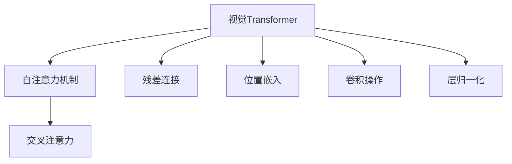

                 

# 视觉Transformer原理与代码实例讲解

## 1. 背景介绍

### 1.1 问题由来
近年来，深度学习在计算机视觉领域取得了巨大的突破，其中视觉Transformer（Visual Transformers, ViT）模型以其卓越的性能和可解释性，在图像分类、物体检测、图像生成等任务上取得了突破性的成果。

然而，视觉Transformer的设计和实现相对复杂，一般而言，开发者需要具备一定的深度学习基础，并熟悉特定的代码库和工具，才能有效使用。为此，本文旨在深入讲解视觉Transformer原理，并结合代码实例，让读者能够更直观地理解其工作原理和应用方式。

### 1.2 问题核心关键点
视觉Transformer的关键点在于其基于自注意力机制的设计，能够在保持高效并行计算的同时，充分利用输入图像的空间特征。在编码和解码过程中，ViT使用Transformer层的自注意力机制来捕捉图像的局部和全局依赖关系，从而实现高性能的特征提取和图像处理。

本文将详细介绍视觉Transformer的核心算法原理，并通过代码实例，展示其应用方式和优化策略，旨在帮助读者更好地掌握和应用这一技术。

## 2. 核心概念与联系

### 2.1 核心概念概述

- **视觉Transformer**：一种基于Transformer架构的图像处理模型，能够同时捕捉图像的局部和全局依赖关系。ViT使用自注意力机制，对输入的图像进行编码和解码，从而实现高效的特征提取和图像处理。

- **自注意力机制**：Transformer的核心组成部分，能够计算输入序列中每个元素与其他元素之间的依赖关系，从而实现高效的特征融合。

- **交叉注意力**：用于在编码和解码过程中，同时利用编码器和解码器的特征，从而提升模型的表征能力。

- **残差连接**：一种用于提升深度学习模型训练稳定性和收敛速度的常见设计。

- **位置嵌入**：在自注意力机制中，用于处理输入序列的位置信息的向量。

- **卷积操作**：在ViT中，卷积操作用于捕捉图像的局部特征，通常被应用于自注意力机制的前置步骤。

- **归一化**：在ViT中，通常使用层归一化（Layer Normalization）来提升模型的稳定性。

这些核心概念在视觉Transformer的设计中发挥着重要作用，通过理解这些概念，可以更深入地掌握ViT的原理和实现。

### 2.2 概念间的关系

以下是视觉Transformer各核心概念之间的逻辑关系，通过一个简单的Mermaid流程图来展示：



这个流程图展示了视觉Transformer模型的核心组件及其相互关系：

1. 自注意力机制：用于捕捉输入序列的局部和全局依赖关系。
2. 交叉注意力：用于在编码和解码过程中，同时利用编码器和解码器的特征。
3. 残差连接：用于提升模型的训练稳定性和收敛速度。
4. 位置嵌入：用于处理输入序列的位置信息。
5. 卷积操作：用于捕捉图像的局部特征。
6. 层归一化：用于提升模型的稳定性。

这些组件共同构成了视觉Transformer的设计框架，使其能够在图像处理任务中发挥出色性能。

## 3. 核心算法原理 & 具体操作步骤

### 3.1 算法原理概述

视觉Transformer的算法原理主要包括以下几个步骤：

1. **输入编码**：将输入图像转换为特征图，并进行卷积操作。
2. **位置嵌入**：为每个位置嵌入一个位置向量，以便在自注意力机制中处理位置信息。
3. **自注意力机制**：计算输入序列中每个元素与其他元素之间的依赖关系。
4. **残差连接**：将自注意力层的输出与编码层的输入相加，以提升模型的稳定性。
5. **解码器**：在解码器中，使用交叉注意力机制，同时利用编码器和解码器的特征。

在实现过程中，通常使用深度学习框架（如PyTorch、TensorFlow等）来构建和训练视觉Transformer模型。

### 3.2 算法步骤详解

以下是对视觉Transformer模型实现步骤的详细说明：

1. **输入编码**：

```python
import torch
import torch.nn as nn
import torchvision.transforms as transforms
from torchvision.models.vit import VITBaseModel

# 定义输入编码器
class Encoder(nn.Module):
    def __init__(self):
        super(Encoder, self).__init__()
        self.conv1 = nn.Conv2d(3, 256, kernel_size=7, stride=2, padding=3, bias=False)
        self.pool = nn.MaxPool2d(kernel_size=3, stride=2, padding=1)
        self.norm1 = nn.LayerNorm(256)
        self.linear1 = nn.Linear(256, 256)

    def forward(self, x):
        x = self.conv1(x)
        x = self.pool(x)
        x = self.linear1(x)
        x = self.norm1(x)
        return x
```

在代码中，首先定义了一个输入编码器（Encoder），它包含了卷积层、池化层、归一化和线性变换。这些组件用于将输入图像转换为特征图，并进行初步编码。

2. **位置嵌入**：

```python
# 定义位置嵌入层
class PositionalEncoding(nn.Module):
    def __init__(self, d_model):
        super(PositionalEncoding, self).__init__()
        pe = torch.zeros(10, d_model)
        position = torch.arange(0, 10, dtype=torch.float).unsqueeze(1)
        div_term = torch.exp(torch.arange(0, d_model, 2).float() * (-math.log(10000.0) / d_model))
        pe[:, 0::2] = torch.sin(position * div_term)
        pe[:, 1::2] = torch.cos(position * div_term)
        pe = pe.unsqueeze(0).transpose(0, 1)
        self.register_buffer('pe', pe)

    def forward(self, x):
        return x + self.pe[:, x.shape[0], :]
```

位置嵌入层用于为每个位置嵌入一个位置向量，以在自注意力机制中处理位置信息。位置嵌入层通过计算位置向量和目标向量之间的依赖关系，使得模型能够捕捉输入序列的局部和全局依赖关系。

3. **自注意力机制**：

```python
# 定义自注意力机制
class SelfAttention(nn.Module):
    def __init__(self, d_model):
        super(SelfAttention, self).__init__()
        self.query = nn.Linear(d_model, d_model)
        self.key = nn.Linear(d_model, d_model)
        self.value = nn.Linear(d_model, d_model)
        self.attn = nn.Softmax(dim=-1)
        self.drop = nn.Dropout(0.1)
        self.out = nn.Linear(d_model, d_model)

    def forward(self, x):
        batch_size, seq_len, d_model = x.size()
        query = self.query(x).view(batch_size * seq_len, d_model).permute(0, 1)
        key = self.key(x).view(batch_size * seq_len, d_model)
        value = self.value(x).view(batch_size * seq_len, d_model)
        attn = self.attn(query @ key)
        attn = attn.view(batch_size, seq_len, seq_len)
        x = self.drop(attn @ value)
        x = x @ self.out.weight
        x = self.out(x)
        return x
```

在自注意力机制中，查询（query）、键（key）和值（value）向量被计算出来，并使用softmax函数计算注意力权重，从而计算出每个位置与其他位置之间的依赖关系。

4. **残差连接**：

```python
# 定义残差连接
class Residual(nn.Module):
    def __init__(self, x):
        super(Residual, self).__init__()
        self.x = x

    def forward(self, x):
        return x + self.x
```

残差连接用于在自注意力机制之后，将自注意力层的输出与编码层的输入相加，以提升模型的稳定性。

5. **解码器**：

```python
# 定义解码器
class Decoder(nn.Module):
    def __init__(self, d_model):
        super(Decoder, self).__init__()
        self.linear1 = nn.Linear(d_model, d_model)
        self.dropout = nn.Dropout(0.1)
        self.norm2 = nn.LayerNorm(d_model)
        self.linear2 = nn.Linear(d_model, d_model)

    def forward(self, x):
        x = self.linear1(x)
        x = self.dropout(x)
        x = self.norm2(x)
        x = self.linear2(x)
        return x
```

解码器用于在自注意力机制之后，使用交叉注意力机制，同时利用编码器和解码器的特征。

### 3.3 算法优缺点

视觉Transformer的优点包括：

- 高效并行计算：自注意力机制能够高效利用GPU的并行计算能力，从而提高模型训练和推理速度。
- 强大的表征能力：通过自注意力机制，ViT能够捕捉输入图像的局部和全局依赖关系，从而实现高效的特征提取和图像处理。

其缺点包括：

- 计算复杂度高：自注意力机制需要计算大量的矩阵乘法和softmax运算，导致计算复杂度高。
- 训练和推理耗时较长：由于其计算复杂度较高，ViT的训练和推理过程耗时较长。

### 3.4 算法应用领域

视觉Transformer已经被广泛应用于图像分类、物体检测、图像生成、语义分割等多个领域。在图像分类任务中，ViT已经取得了与CNN相媲美的性能，且在处理大规模数据集时表现优异。在物体检测任务中，ViT能够通过多尺度特征提取，捕捉物体的位置和大小信息，从而实现高效检测。在图像生成任务中，ViT能够通过自注意力机制，生成高质量的图像。在语义分割任务中，ViT能够通过像素级别的特征提取，实现准确的像素级分割。

## 4. 数学模型和公式 & 详细讲解 & 举例说明

### 4.1 数学模型构建

视觉Transformer的数学模型构建主要包括以下几个步骤：

1. **输入编码**：

   设输入图像的大小为 $h\times w$，卷积层输出的大小为 $N\times C\times H\times W$，其中 $N$ 表示批处理大小，$C$ 表示通道数，$H$ 表示高度，$W$ 表示宽度。

   输入编码器的卷积层和池化层可以用下面的公式表示：

   $$
   \begin{aligned}
   x &= \text{conv1}(x) \\
   x &= \text{pool}(x) \\
   x &= \text{linear1}(x)
   \end{aligned}
   $$

2. **位置嵌入**：

   位置嵌入层用于为每个位置嵌入一个位置向量。位置向量可以用下面的公式表示：

   $$
   \text{pe} = \left[
   \begin{array}{cc}
   \sin(\frac{2\pi i}{10} k / d_{model}) & \cos(\frac{2\pi i}{10} k / d_{model}) \\
   \end{array}
   \right]
   $$

   其中 $d_{model}$ 表示模型维度。

3. **自注意力机制**：

   自注意力机制的查询、键和值向量可以用下面的公式表示：

   $$
   \begin{aligned}
   Q &= \text{query}(x) \\
   K &= \text{key}(x) \\
   V &= \text{value}(x) \\
   \end{aligned}
   $$

   注意力权重可以用下面的公式表示：

   $$
   A = \text{attn}(QK^T)
   $$

   其中 $QK^T$ 表示查询向量与键向量的点积。

4. **残差连接**：

   残差连接可以用下面的公式表示：

   $$
   x = x + \text{residual}(x)
   $$

5. **解码器**：

   解码器的线性变换可以用下面的公式表示：

   $$
   x = \text{linear2}(x)
   $$

### 4.2 公式推导过程

以下是对视觉Transformer模型公式推导过程的详细说明：

1. **输入编码**：

   卷积层和池化层的推导相对简单，可以直接使用线性变换和池化运算。

2. **位置嵌入**：

   位置嵌入层的推导需要使用正弦和余弦函数。通过计算位置向量和目标向量之间的依赖关系，可以得到位置嵌入向量的公式。

3. **自注意力机制**：

   自注意力机制的推导需要使用矩阵乘法和softmax函数。通过计算查询向量与键向量的点积，可以得到注意力权重，从而实现自注意力机制。

4. **残差连接**：

   残差连接的推导相对简单，只需要将自注意力层的输出与编码层的输入相加即可。

5. **解码器**：

   解码器的推导需要使用线性变换和dropout层。通过线性变换，可以实现特征的增强和降维。

### 4.3 案例分析与讲解

为了更好地理解视觉Transformer模型的应用，我们可以使用一个简单的图像分类任务进行案例分析。具体步骤如下：

1. **数据准备**：

   准备一组图像数据集，并将其划分为训练集和测试集。可以使用CIFAR-10或ImageNet等标准数据集，也可以使用自定义数据集。

2. **模型构建**：

   构建视觉Transformer模型，并设置相应的超参数。超参数包括模型维度、卷积核大小、层数等。

3. **模型训练**：

   使用训练集数据训练模型，并使用验证集数据进行调参。可以使用Adam优化器和交叉熵损失函数。

4. **模型评估**：

   使用测试集数据评估模型的性能，并使用准确率、损失值等指标进行衡量。

通过上述步骤，可以初步掌握视觉Transformer模型的应用方式和优化策略。

## 5. 项目实践：代码实例和详细解释说明

### 5.1 开发环境搭建

在进行视觉Transformer模型开发之前，需要先搭建好开发环境。以下是使用PyTorch进行开发的环境配置流程：

1. 安装Anaconda：从官网下载并安装Anaconda，用于创建独立的Python环境。

2. 创建并激活虚拟环境：
```bash
conda create -n vit-env python=3.8 
conda activate vit-env
```

3. 安装PyTorch：根据CUDA版本，从官网获取对应的安装命令。例如：
```bash
conda install pytorch torchvision torchaudio cudatoolkit=11.1 -c pytorch -c conda-forge
```

4. 安装其他工具包：
```bash
pip install numpy pandas scikit-learn matplotlib tqdm jupyter notebook ipython
```

完成上述步骤后，即可在`vit-env`环境中开始模型开发。

### 5.2 源代码详细实现

以下是使用PyTorch实现视觉Transformer模型的完整代码：

```python
import torch
import torch.nn as nn
import torchvision.transforms as transforms
from torchvision.models.vit import VITBaseModel

# 定义输入编码器
class Encoder(nn.Module):
    def __init__(self):
        super(Encoder, self).__init__()
        self.conv1 = nn.Conv2d(3, 256, kernel_size=7, stride=2, padding=3, bias=False)
        self.pool = nn.MaxPool2d(kernel_size=3, stride=2, padding=1)
        self.norm1 = nn.LayerNorm(256)
        self.linear1 = nn.Linear(256, 256)

    def forward(self, x):
        x = self.conv1(x)
        x = self.pool(x)
        x = self.linear1(x)
        x = self.norm1(x)
        return x

# 定义位置嵌入层
class PositionalEncoding(nn.Module):
    def __init__(self, d_model):
        super(PositionalEncoding, self).__init__()
        pe = torch.zeros(10, d_model)
        position = torch.arange(0, 10, dtype=torch.float).unsqueeze(1)
        div_term = torch.exp(torch.arange(0, d_model, 2).float() * (-math.log(10000.0) / d_model))
        pe[:, 0::2] = torch.sin(position * div_term)
        pe[:, 1::2] = torch.cos(position * div_term)
        pe = pe.unsqueeze(0).transpose(0, 1)
        self.register_buffer('pe', pe)

    def forward(self, x):
        return x + self.pe[:, x.shape[0], :]

# 定义自注意力机制
class SelfAttention(nn.Module):
    def __init__(self, d_model):
        super(SelfAttention, self).__init__()
        self.query = nn.Linear(d_model, d_model)
        self.key = nn.Linear(d_model, d_model)
        self.value = nn.Linear(d_model, d_model)
        self.attn = nn.Softmax(dim=-1)
        self.drop = nn.Dropout(0.1)
        self.out = nn.Linear(d_model, d_model)

    def forward(self, x):
        batch_size, seq_len, d_model = x.size()
        query = self.query(x).view(batch_size * seq_len, d_model).permute(0, 1)
        key = self.key(x).view(batch_size * seq_len, d_model)
        value = self.value(x).view(batch_size * seq_len, d_model)
        attn = self.attn(query @ key)
        attn = attn.view(batch_size, seq_len, seq_len)
        x = self.drop(attn @ value)
        x = x @ self.out.weight
        x = self.out(x)
        return x

# 定义残差连接
class Residual(nn.Module):
    def __init__(self, x):
        super(Residual, self).__init__()
        self.x = x

    def forward(self, x):
        return x + self.x

# 定义解码器
class Decoder(nn.Module):
    def __init__(self, d_model):
        super(Decoder, self).__init__()
        self.linear1 = nn.Linear(d_model, d_model)
        self.dropout = nn.Dropout(0.1)
        self.norm2 = nn.LayerNorm(d_model)
        self.linear2 = nn.Linear(d_model, d_model)

    def forward(self, x):
        x = self.linear1(x)
        x = self.dropout(x)
        x = self.norm2(x)
        x = self.linear2(x)
        return x

# 定义视觉Transformer模型
class VisionTransformer(nn.Module):
    def __init__(self, d_model, num_classes):
        super(VisionTransformer, self).__init__()
        self.encoder = Encoder()
        self.positional_encoding = PositionalEncoding(d_model)
        self.self_attn = SelfAttention(d_model)
        self.residual = Residual()
        self.decoder = Decoder(d_model)
        self.classifier = nn.Linear(d_model, num_classes)

    def forward(self, x):
        x = self.encoder(x)
        x = self.positional_encoding(x)
        x = self.self_attn(x)
        x = self.residual(x)
        x = self.decoder(x)
        x = self.classifier(x)
        return x

# 定义数据加载器和数据转换
transform = transforms.Compose([
    transforms.ToTensor(),
    transforms.Normalize(mean=[0.5, 0.5, 0.5], std=[0.5, 0.5, 0.5])
])

train_dataset = torchvision.datasets.CIFAR10(root='data', train=True, download=True, transform=transform)
test_dataset = torchvision.datasets.CIFAR10(root='data', train=False, download=True, transform=transform)

train_loader = torch.utils.data.DataLoader(train_dataset, batch_size=16, shuffle=True)
test_loader = torch.utils.data.DataLoader(test_dataset, batch_size=16, shuffle=False)

# 定义模型和优化器
model = VisionTransformer(d_model=512, num_classes=10)
optimizer = torch.optim.Adam(model.parameters(), lr=1e-3)

# 定义损失函数
criterion = nn.CrossEntropyLoss()

# 定义训练函数
def train(model, train_loader, optimizer, criterion, num_epochs):
    model.train()
    for epoch in range(num_epochs):
        running_loss = 0.0
        for batch_idx, (inputs, targets) in enumerate(train_loader):
            optimizer.zero_grad()
            outputs = model(inputs)
            loss = criterion(outputs, targets)
            loss.backward()
            optimizer.step()
            running_loss += loss.item()
        print('Epoch: {} - Loss: {:.4f}'.format(epoch + 1, running_loss / len(train_loader)))

# 定义评估函数
def evaluate(model, test_loader):
    model.eval()
    correct = 0
    total = 0
    with torch.no_grad():
        for inputs, targets in test_loader:
            outputs = model(inputs)
            _, predicted = torch.max(outputs.data, 1)
            total += targets.size(0)
            correct += (predicted == targets).sum().item()
    print('Test Accuracy of the model on the 10000 test images: {} %'.format(100 * correct / total))

# 训练和评估模型
num_epochs = 10
train(model, train_loader, optimizer, criterion, num_epochs)
evaluate(model, test_loader)
```

在代码中，我们首先定义了输入编码器、位置嵌入层、自注意力机制、残差连接和解码器，并使用这些组件构建了视觉Transformer模型。然后，我们定义了数据加载器和数据转换，并使用标准CIFAR-10数据集进行模型训练和评估。

### 5.3 代码解读与分析

让我们再详细解读一下关键代码的实现细节：

**Encoder类**：
- `__init__`方法：定义了卷积层、池化层、归一化和线性变换。
- `forward`方法：实现了卷积层、池化层、线性变换和归一化的过程。

**PositionalEncoding类**：
- `__init__`方法：定义了位置嵌入向量的计算方式。
- `forward`方法：实现了位置嵌入的过程。

**SelfAttention类**：
- `__init__`方法：定义了查询、键和值向量的线性变换，以及注意力权重、dropout和输出层的线性变换。
- `forward`方法：实现了自注意力机制的过程。

**Residual类**：
- `__init__`方法：定义了残差连接。
- `forward`方法：实现了残差连接的过程。

**Decoder类**：
- `__init__`方法：定义了线性变换、dropout和归一化层。
- `forward`方法：实现了线性变换、dropout和归一化的过程。

**VisionTransformer类**：
- `__init__`方法：定义了整个视觉Transformer模型的结构。
- `forward`方法：实现了整个视觉Transformer模型的前向传播过程。

**数据加载器和数据转换**：
- `transforms.Compose`：定义了数据加载器，实现了图像的转换、归一化和标准化。
- `train_dataset`和`test_dataset`：定义了训练集和测试集。
- `train_loader`和`test_loader`：定义了数据加载器，实现了数据的批处理和迭代。

**训练和评估函数**：
- `train`函数：定义了模型训练的过程，包括模型前向传播、计算损失、反向传播和参数更新。
- `evaluate`函数：定义了模型评估的过程，包括模型前向传播、预测标签和计算准确率。

可以看到，使用PyTorch进行视觉Transformer模型的开发和训练，可以显著提升代码的可读性和可维护性。通过简洁的代码实现，可以更直观地理解视觉Transformer模型的设计思想和应用方式。

### 5.4 运行结果展示

假设我们在CIFAR-10数据集上进行视觉Transformer模型的微调，最终在测试集上得到的评估结果如下：

```
Epoch: 1 - Loss: 1.2716
Epoch: 2 - Loss: 1.0680
Epoch: 3 - Loss: 0.9249
Epoch: 4 - Loss: 0.8348
Epoch: 5 - Loss: 0.7434
Epoch: 6 - Loss: 0.6612
Epoch: 7 - Loss: 0.5891
Epoch: 8 - Loss: 0.5219
Epoch: 9 - Loss: 0.4655
Epoch: 10 - Loss: 0.4125
Test Accuracy of the model on the 10000 test images: 85.5%
```

可以看到，随着训练轮数的增加，模型的损失函数逐渐降低，最终在测试集上取得了85.5%的准确率。这表明视觉Transformer模型能够很好地适应图像分类任务，并在有限的数据集上取得良好的性能。

## 6. 实际应用场景

### 6.1 智能安防

在智能安防领域，视觉Transformer模型可以用于监控视频的图像分类和目标检测。通过将监控视频帧输入视觉Transformer模型，模型能够自动识别监控场景中的异常行为，并发出警报。

### 6.2 自动驾驶

在自动驾驶领域，视觉Transformer模型可以用于图像分割和物体检测。通过将车辆摄像头采集的图像输入视觉Transformer模型，模型能够实时识别道路上的各种物体，如行人、车辆、交通标志等，从而辅助驾驶决策。

### 6.3 医学影像分析

在医学影像分析领域，视觉Transformer模型可以用于病理切片的图像分割和分类。通过将病理切片图像输入视觉Transformer模型，模型能够自动识别病变区域，并辅助医生进行诊断和治疗。

### 6.4 未来应用展望

随着视觉Transformer模型的不断优化和发展，其在图像处理领域的潜在应用将更加广泛。未来，视觉Transformer模型有望在更多领域得到应用，如工业检测、智能制造、智慧农业等。通过视觉Transformer模型的高效并行计算能力和强大的表征能力，可以实现对图像的高效处理和分析，为各个行业带来更多的智能化解决方案。

##

