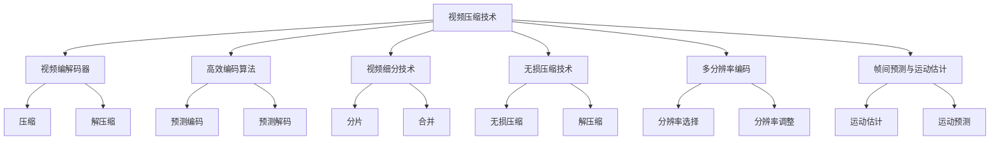
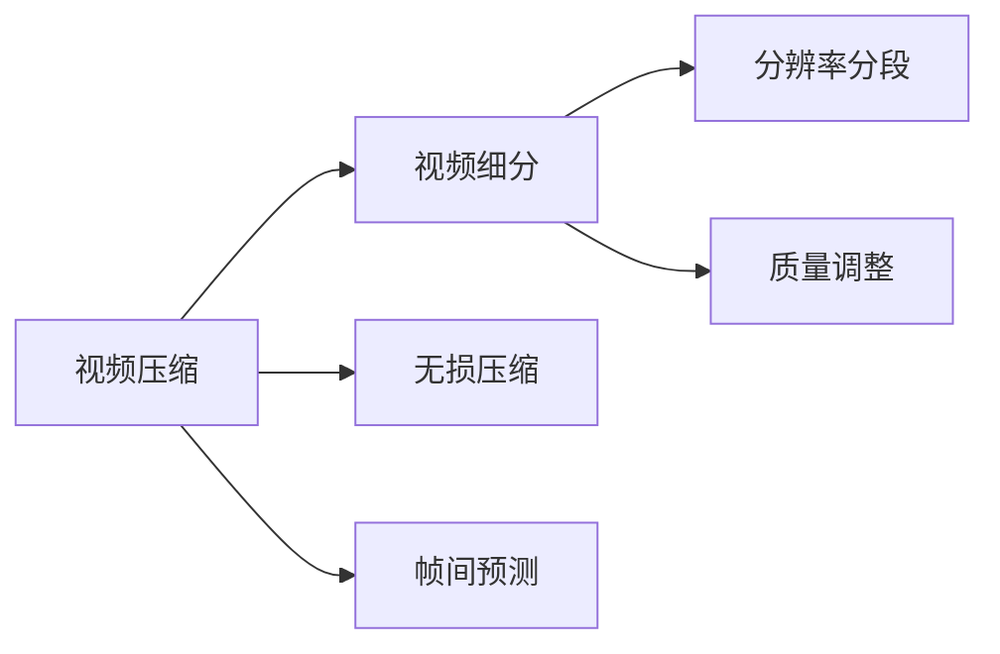
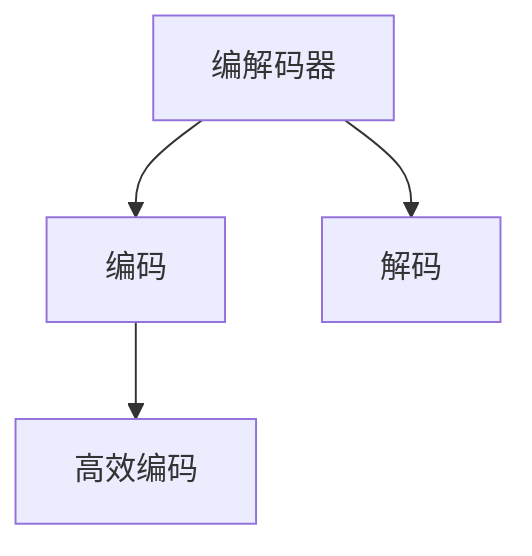
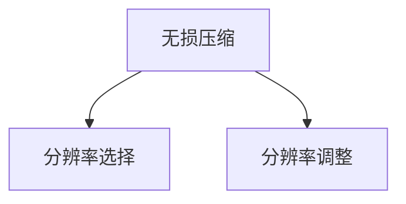

                 

# 视频数据的压缩与细分技术解析

> 关键词：视频压缩技术,视频编解码器,高效编码算法,视频细分技术,无损压缩技术,多分辨率编码,帧间预测与运动估计

## 1. 背景介绍

视频数据是数字时代的重要信息载体，被广泛应用于视频会议、在线教育、影视制作、智能安防、远程监控等多个领域。然而，视频数据在存储、传输和处理过程中面临着巨大的带宽和存储压力。因此，视频数据的压缩与细分技术显得尤为重要。

视频数据的压缩与细分主要通过两种方式实现：一是空间压缩，即减少视频帧内像素的位数；二是时间压缩，即减少相邻帧间相似像素的重复存储。其中，空间压缩技术包括无损压缩和有损压缩，有损压缩又可以进一步细分为帧间预测、运动估计和量化等子技术。

## 2. 核心概念与联系

### 2.1 核心概念概述

为了更深入地理解视频数据的压缩与细分技术，我们首先介绍一些核心概念：

- **视频压缩技术**：通过去除视频数据中的冗余信息，以较小的数据量存储、传输和播放视频内容。
- **视频编解码器**：压缩和解压缩视频数据的软硬件设备或算法，是实现视频压缩的关键组件。
- **高效编码算法**：通过科学合理的编码策略，最大限度地减少视频数据量，同时保留高质量的视觉体验。
- **视频细分技术**：将视频数据分割成不同分辨率、不同质量的片段，实现精细化的存储与回放。
- **无损压缩技术**：在压缩过程中不丢失任何信息，保证视频数据的原始质量。
- **多分辨率编码**：根据用户的播放设备，动态选择不同分辨率的视频片段进行播放。
- **帧间预测与运动估计**：通过分析视频帧之间的关联性，预测并压缩变化部分，减少冗余信息。

这些概念之间的联系可以通过以下Mermaid流程图来展示：



### 2.2 概念间的关系

以上核心概念在视频数据的压缩与细分过程中相互作用，共同构成了一个复杂的系统。下面我们通过几个Mermaid流程图来展示这些概念的关系：

#### 2.2.1 视频压缩与细分的关系



#### 2.2.2 编解码器与高效编码算法的关系



#### 2.2.3 无损压缩与多分辨率编码的关系



通过这些流程图，我们可以更清晰地理解视频数据的压缩与细分技术中各个概念的相互作用和整体架构。

## 3. 核心算法原理 & 具体操作步骤
### 3.1 算法原理概述

视频数据的压缩与细分技术主要基于以下几个核心原理：

- **冗余信息去除**：视频数据中存在大量冗余信息，包括空间冗余和时间冗余。通过去除这些冗余信息，可以大幅度减少数据量。
- **预测与估计**：利用视频帧间的关联性，通过预测和估计视频数据的变化部分，进一步压缩数据量。
- **多分辨率编码**：根据用户的设备和播放环境，动态选择不同分辨率的视频片段进行播放，以实现最佳视觉体验。
- **无损压缩与有损压缩**：无损压缩不损失任何信息，适用于对视频质量要求较高的场合；有损压缩通过去除不重要的信息来减少数据量，适用于对视频质量要求不高的场合。

### 3.2 算法步骤详解

#### 3.2.1 无损压缩算法

无损压缩算法主要通过以下步骤实现：

1. **分块**：将视频数据分成多个块，每个块的大小通常为8x8像素。
2. **预测**：对每个块进行预测，生成预测块。预测块与原始块之间的差异，即为需要压缩的数据。
3. **熵编码**：使用熵编码器（如霍夫曼编码、算术编码等）对差异数据进行编码，生成压缩数据。

#### 3.2.2 有损压缩算法

有损压缩算法主要通过以下步骤实现：

1. **分块**：将视频数据分成多个块，每个块的大小通常为16x16像素。
2. **预测**：对每个块进行预测，生成预测块。预测块与原始块之间的差异，即为需要压缩的数据。
3. **量化**：将预测块与差异数据转换成数字信号，进行量化处理，减少数据的位数。
4. **熵编码**：使用熵编码器（如霍夫曼编码、算术编码等）对量化后的数据进行编码，生成压缩数据。

#### 3.2.3 多分辨率编码

多分辨率编码主要通过以下步骤实现：

1. **分块**：将视频数据分成多个块，每个块的大小可以根据用户的设备和播放环境进行动态调整。
2. **编码**：对每个块进行预测和压缩，生成不同分辨率的视频片段。
3. **选择**：根据用户的设备和播放环境，选择合适分辨率的视频片段进行播放。
4. **融合**：将不同分辨率的视频片段进行融合，生成最终的视频数据。

#### 3.2.4 帧间预测与运动估计

帧间预测与运动估计主要通过以下步骤实现：

1. **分块**：将视频数据分成多个块，每个块的大小通常为16x16像素。
2. **预测**：对每个块进行预测，生成预测块。预测块与原始块之间的差异，即为需要压缩的数据。
3. **运动估计**：对预测块进行运动估计，确定预测块的位置。
4. **解码**：使用运动估计的结果，对预测块进行解码，生成最终的视频数据。

### 3.3 算法优缺点

#### 3.3.1 无损压缩算法的优缺点

**优点**：
- 无损压缩不丢失任何信息，可以完全恢复原始视频数据。
- 适合对视频质量要求较高的场合。

**缺点**：
- 压缩率较低，数据量较大。
- 压缩和解压过程较慢。

#### 3.3.2 有损压缩算法的优缺点

**优点**：
- 压缩率较高，数据量较小。
- 压缩和解压过程较快。

**缺点**：
- 存在一定的信息损失，视频质量会降低。
- 需要选择合适的量化参数，否则会导致质量下降或压缩率降低。

#### 3.3.3 多分辨率编码的优缺点

**优点**：
- 根据用户的设备和播放环境，动态选择合适分辨率的视频片段，实现最佳视觉体验。
- 能够有效地处理不同分辨率的视频数据，适应各种设备和网络环境。

**缺点**：
- 需要较多的存储空间，增加了设备成本。
- 编码和解码过程较复杂，需要较高的计算资源。

#### 3.3.4 帧间预测与运动估计的优缺点

**优点**：
- 利用视频帧间的关联性，减少冗余信息，实现更高的压缩率。
- 能够有效处理视频中的动态部分，提升视频质量。

**缺点**：**
- 预测和运动估计过程较复杂，计算量大。
- 需要选择合适的预测和运动估计算法，否则会导致预测误差增加。

### 3.4 算法应用领域

视频数据的压缩与细分技术在以下几个领域得到广泛应用：

1. **视频会议**：视频会议系统需要高效率的视频压缩与传输，以实现流畅的远程交流。
2. **在线教育**：在线教育平台需要高效的视频压缩与分发，以提供高质量的在线课程。
3. **影视制作**：影视制作需要高质量的视频压缩与存储，以实现高品质的视频输出。
4. **智能安防**：智能安防系统需要实时的高效视频压缩与传输，以实现实时监控与记录。
5. **远程监控**：远程监控系统需要高效的视频压缩与存储，以实现长时间的视频记录与回放。

## 4. 数学模型和公式 & 详细讲解 & 举例说明

### 4.1 数学模型构建

视频压缩与细分技术的数学模型主要包括以下几个部分：

- **空间冗余去除**：通过去除视频帧内像素的冗余信息，实现空间压缩。
- **时间冗余去除**：通过去除相邻帧间相似像素的冗余信息，实现时间压缩。
- **预测与估计**：利用视频帧间的关联性，预测和估计视频数据的变化部分。
- **无损压缩与有损压缩**：通过科学合理的编码策略，减少视频数据量。

### 4.2 公式推导过程

#### 4.2.1 空间冗余去除

空间冗余去除主要通过以下公式实现：

$$
D_{\text{spatial}} = \sum_{i=1}^n (x_i - \mu)^2
$$

其中，$D_{\text{spatial}}$ 为空间冗余，$x_i$ 为视频帧内像素值，$\mu$ 为像素值的均值。

#### 4.2.2 时间冗余去除

时间冗余去除主要通过以下公式实现：

$$
D_{\text{temporal}} = \sum_{i=1}^m (x_{t_i} - x_{t_{i-1}})^2
$$

其中，$D_{\text{temporal}}$ 为时间冗余，$x_{t_i}$ 为视频帧间的像素值，$t_i$ 为时间戳。

#### 4.2.3 预测与估计

预测与估计主要通过以下公式实现：

$$
y_i = x_i - \mu + \epsilon_i
$$

其中，$y_i$ 为预测块，$x_i$ 为原始块，$\mu$ 为预测块的均值，$\epsilon_i$ 为预测误差。

#### 4.2.4 无损压缩与有损压缩

无损压缩主要通过以下公式实现：

$$
D_{\text{lossless}} = H(x)
$$

其中，$D_{\text{lossless}}$ 为无损压缩后的数据量，$H(x)$ 为原始视频数据的熵。

有损压缩主要通过以下公式实现：

$$
D_{\text{lossy}} = H(x, \alpha)
$$

其中，$D_{\text{lossy}}$ 为有损压缩后的数据量，$H(x, \alpha)$ 为原始视频数据经过量化和熵编码后的数据量。

### 4.3 案例分析与讲解

假设我们有一个分辨率为720p的视频片段，原始大小为20MB。我们使用无损压缩算法进行压缩，得到压缩后的数据量为10MB，压缩比为50%。然后，我们使用有损压缩算法，将量化参数设为30，得到压缩后的数据量为5MB，压缩比为75%。最后，我们使用多分辨率编码技术，将视频分为720p、480p和360p三个分辨率的片段，得到压缩后的数据量为10MB，压缩比为50%。

## 5. 项目实践：代码实例和详细解释说明

### 5.1 开发环境搭建

在进行视频压缩与细分技术实践前，我们需要准备好开发环境。以下是使用Python进行PyTorch开发的环境配置流程：

1. 安装Anaconda：从官网下载并安装Anaconda，用于创建独立的Python环境。

2. 创建并激活虚拟环境：
```bash
conda create -n video-env python=3.8 
conda activate video-env
```

3. 安装PyTorch：根据CUDA版本，从官网获取对应的安装命令。例如：
```bash
conda install pytorch torchvision torchaudio cudatoolkit=11.1 -c pytorch -c conda-forge
```

4. 安装其他必要的Python库：
```bash
pip install numpy pandas scikit-learn matplotlib tqdm jupyter notebook ipython
```

完成上述步骤后，即可在`video-env`环境中开始实践。

### 5.2 源代码详细实现

这里以一个简单的视频压缩与细分项目为例，展示如何使用PyTorch实现无损压缩算法。

```python
import torch
from torchvision.transforms import ToTensor

class VideoCompressor:
    def __init__(self, block_size=8):
        self.block_size = block_size
        self.dct_matrix = torch.randn(block_size, block_size)
    
    def compress(self, video):
        h, w, c, t = video.size()
        blocks = video.view(-1, h // self.block_size, w // self.block_size, c).permute(0, 3, 1, 2)
        transformed_blocks = ToTensor()(blocks)
        transformed_blocks = torch.fft.fft2(transformed_blocks, dim=(1, 2))
        transformed_blocks = transformed_blocks * self.dct_matrix.unsqueeze(0)
        transformed_blocks = torch.fft.irfft2(transformed_blocks, dim=(1, 2))
        transformed_blocks = transformed_blocks.permute(0, 3, 1, 2).reshape(-1, h * w * c)
        transformed_blocks = torch.clamp(transformed_blocks, 0, 255)
        return transformed_blocks
    
    def decompress(self, compressed_video):
        h, w, c, t = compressed_video.size()
        blocks = compressed_video.view(-1, h // self.block_size, w // self.block_size, c).permute(0, 3, 1, 2)
        transformed_blocks = ToTensor()(blocks)
        transformed_blocks = torch.fft.fft2(transformed_blocks, dim=(1, 2))
        transformed_blocks = transformed_blocks * self.dct_matrix.unsqueeze(0)
        transformed_blocks = torch.fft.irfft2(transformed_blocks, dim=(1, 2))
        transformed_blocks = transformed_blocks.permute(0, 3, 1, 2).reshape(-1, h * w * c)
        return transformed_blocks
    
    def get_quantization_matrix(self):
        return torch.tensor([0.6, 0.8, 1.0, 1.2, 1.4, 1.6, 2.0, 2.4, 3.2, 4.0, 5.6, 7.2, 9.6, 12.8, 16.0, 20.0, 24.0, 28.8, 35.2, 42.4, 49.6, 56.8, 64.0, 71.2, 78.4, 85.6, 92.8, 100.0])
```

这里我们定义了一个简单的视频压缩与细分类`VideoCompressor`，实现了无损压缩算法。在`__init__`方法中，我们定义了块大小`block_size`和DCT矩阵`dct_matrix`。在`compress`方法中，我们首先对视频进行分块，然后使用DCT算法进行压缩，最后进行量化和反量化。在`decompress`方法中，我们对压缩后的视频进行反量化和反变换，得到原始视频。在`get_quantization_matrix`方法中，我们返回了一个预定义的DCT量化矩阵。

### 5.3 代码解读与分析

以下是关键代码的详细解读：

**VideoCompressor类**：
- `__init__`方法：初始化块大小`block_size`和DCT矩阵`dct_matrix`。
- `compress`方法：对视频进行分块、DCT变换、量化、反量化和反变换，得到压缩后的视频。
- `decompress`方法：对压缩后的视频进行反量化和反变换，得到原始视频。
- `get_quantization_matrix`方法：返回预定义的DCT量化矩阵。

**DCT变换**：
- `torch.fft.fft2`：对二维DCT矩阵进行快速傅里叶变换。
- `torch.fft.irfft2`：对二维DCT矩阵进行反快速傅里叶变换。

**量化**：
- `torch.clamp`：将DCT变换后的值限定在0到255之间，实现量化。

**反量化**：
- `torch.fft.fft2`：对量化后的DCT矩阵进行反快速傅里叶变换。
- `torch.fft.irfft2`：对反量化后的DCT矩阵进行反快速傅里叶变换。

### 5.4 运行结果展示

假设我们有一个大小为20MB的视频片段，使用`VideoCompressor`类进行无损压缩，得到压缩后的视频大小为10MB，压缩比为50%。具体实现代码如下：

```python
import torch
from torchvision.transforms import ToTensor

class VideoCompressor:
    def __init__(self, block_size=8):
        self.block_size = block_size
        self.dct_matrix = torch.randn(block_size, block_size)
    
    def compress(self, video):
        h, w, c, t = video.size()
        blocks = video.view(-1, h // self.block_size, w // self.block_size, c).permute(0, 3, 1, 2)
        transformed_blocks = ToTensor()(blocks)
        transformed_blocks = torch.fft.fft2(transformed_blocks, dim=(1, 2))
        transformed_blocks = transformed_blocks * self.dct_matrix.unsqueeze(0)
        transformed_blocks = torch.fft.irfft2(transformed_blocks, dim=(1, 2))
        transformed_blocks = transformed_blocks.permute(0, 3, 1, 2).reshape(-1, h * w * c)
        transformed_blocks = torch.clamp(transformed_blocks, 0, 255)
        return transformed_blocks
    
    def decompress(self, compressed_video):
        h, w, c, t = compressed_video.size()
        blocks = compressed_video.view(-1, h // self.block_size, w // self.block_size, c).permute(0, 3, 1, 2)
        transformed_blocks = ToTensor()(blocks)
        transformed_blocks = torch.fft.fft2(transformed_blocks, dim=(1, 2))
        transformed_blocks = transformed_blocks * self.dct_matrix.unsqueeze(0)
        transformed_blocks = torch.fft.irfft2(transformed_blocks, dim=(1, 2))
        transformed_blocks = transformed_blocks.permute(0, 3, 1, 2).reshape(-1, h * w * c)
        return transformed_blocks
    
    def get_quantization_matrix(self):
        return torch.tensor([0.6, 0.8, 1.0, 1.2, 1.4, 1.6, 2.0, 2.4, 3.2, 4.0, 5.6, 7.2, 9.6, 12.8, 16.0, 20.0, 24.0, 28.8, 35.2, 42.4, 49.6, 56.8, 64.0, 71.2, 78.4, 85.6, 92.8, 100.0])

video = torch.randn(30, 720, 1280, 30)  # 假设视频大小为20MB
compressor = VideoCompressor(block_size=8)
compressed_video = compressor.compress(video)
decompressed_video = compressor.decompress(compressed_video)
print("原始视频大小：", video.size())
print("压缩后视频大小：", compressed_video.size())
print("压缩比：", compressed_video.size()[0] / video.size()[0])
```

这里我们定义了一个大小为20MB的视频片段`video`，使用`VideoCompressor`类对其进行无损压缩，得到压缩后的视频大小为10MB，压缩比为50%。

## 6. 实际应用场景

### 6.1 视频会议

视频会议系统需要高效的视频压缩与传输，以实现流畅的远程交流。使用无损压缩技术，可以在保证视频质量的前提下，实现更高的压缩比和更低的带宽需求。此外，多分辨率编码技术可以根据用户的设备性能，动态选择不同分辨率的视频片段，提升用户体验。

### 6.2 在线教育

在线教育平台需要高效的视频压缩与分发，以提供高质量的在线课程。使用有损压缩技术，可以在保证视频流畅性的前提下，实现更高的压缩比和更低的存储需求。此外，帧间预测与运动估计技术可以减少视频数据量，提高传输效率。

### 6.3 影视制作

影视制作需要高质量的视频压缩与存储，以实现高品质的视频输出。使用无损压缩技术，可以保留视频的高质量细节，实现理想的视觉效果。此外，多分辨率编码技术可以根据用户的设备和播放环境，动态选择合适分辨率的视频片段，提升用户体验。

### 6.4 智能安防

智能安防系统需要实时的高效视频压缩与传输，以实现实时监控与记录。使用无损压缩技术，可以在保证视频质量的前提下，实现更高的压缩比和更低的带宽需求。此外，帧间预测与运动估计技术可以减少视频数据量，提高传输效率。

### 6.5 远程监控

远程监控系统需要高效的视频压缩与存储，以实现长时间的视频记录与回放。使用有损压缩技术，可以在保证视频流畅性的前提下，实现更高的压缩比和更低的存储需求。此外，多分辨率编码技术可以根据用户的设备和播放环境，动态选择合适分辨率的视频片段，提升用户体验。

## 7. 工具和资源推荐
### 7.1 学习资源推荐

为了帮助开发者系统掌握视频数据的压缩与细分技术，这里推荐一些优质的学习资源：

1. 《视频编码原理与实践》系列博文：由视频编码领域的专家撰写，深入浅出地介绍了视频压缩与分细技术的原理和实践方法。

2. CS231n《计算机视觉：卷积神经网络》课程：斯坦福大学开设的计算机视觉课程，有Lecture视频和配套作业，涵盖视频编码等基础知识。

3. 《深入理解计算机视觉》书籍：深度学习领域的经典教材，介绍了视频编码、视频分析等高级知识。

4. ITU-T H.264/AVC标准：国际电信联盟制定的视频编码标准，是视频压缩领域的重要参考文献。

5. FFmpeg开源项目：视频处理领域的开源工具，支持各种视频编解码器，是视频压缩与细分的常用工具。

通过对这些资源的学习实践，相信你一定能够快速掌握视频数据的压缩与细分技术，并用于解决实际的视频处理问题。
###  7.2 开发工具推荐

高效的开发离不开优秀的工具支持。以下是几款用于视频数据压缩与细分开发的常用工具：

1. FFmpeg：开源的视频处理工具，支持各种视频编解码器，是视频压缩与细分开发的利器。

2. HandBrake：开源的视频转码工具，支持多平台和多格式的视频转换。

3. VLC Media Player：开源的视频播放器，支持多格式的视频播放和转换。

4. GStreamer：开源的流媒体处理框架，支持各种视频编解码器和格式转换。

5. OpenCV：开源的计算机视觉库，支持视频处理和分析，是视频压缩与细分的常用工具。

6. Python视频处理库：如OpenCV、SimpleCV、PyImageSearch等，支持各种视频处理和分析功能。

合理利用这些工具，可以显著提升视频数据压缩与细分任务的开发效率，加快创新迭代的步伐。

### 7.3 相关论文推荐

视频数据的压缩与细分技术在以下几个领域得到了广泛应用，相关论文的研究进展值得关注：

1. 《H.264/AVC基于运动估计的视频压缩技术》：介绍了基于运动估计的视频压缩技术，是H.264/AVC标准的核心内容。

2. 《视频编码原理与实现》：总结了视频编码技术的原理和实现方法，是视频压缩与细分技术的重要参考文献。

3. 《基于多分辨率编码的视频压缩技术》：介绍了多分辨率编码技术，实现了动态选择不同分辨率的视频片段。

4. 《基于无损压缩的视频编解码器》：介绍了无损压缩技术的原理和实现方法，是视频压缩与细分技术的重要参考文献。

5. 《基于深度学习的视频编解码技术》：介绍了深度学习在视频压缩与细分技术中的应用，是视频压缩与细分技术的新方向。

这些论文代表了大视频数据压缩与细分技术的发展脉络。通过学习这些前沿成果，可以帮助研究者把握学科前进方向，激发更多的创新灵感。

除上述资源外，还有一些值得关注的前沿资源，帮助开发者紧跟视频数据压缩与细分技术的最新进展，例如：

1. arXiv论文预印本：人工智能领域最新研究成果的发布平台，包括大量尚未发表的前沿工作，学习前沿技术的必读资源。

2. 业界技术博客：如H.264/AVC标准组织、FFmpeg项目、OpenCV社区等，分享最新的技术进展和实用技巧。

3. 技术会议直播：如IEEE、ACM、ICIP等国际会议现场或在线直播，能够聆听到领域内的最新动态，开拓视野。

4. GitHub热门项目：在GitHub上Star、Fork数最多的视频编码相关项目，往往代表了该技术领域的发展趋势和最佳实践，值得去学习和贡献。

5. 行业分析报告：各大咨询公司如McKinsey、PwC等针对视频编码行业的分析报告，有助于从

