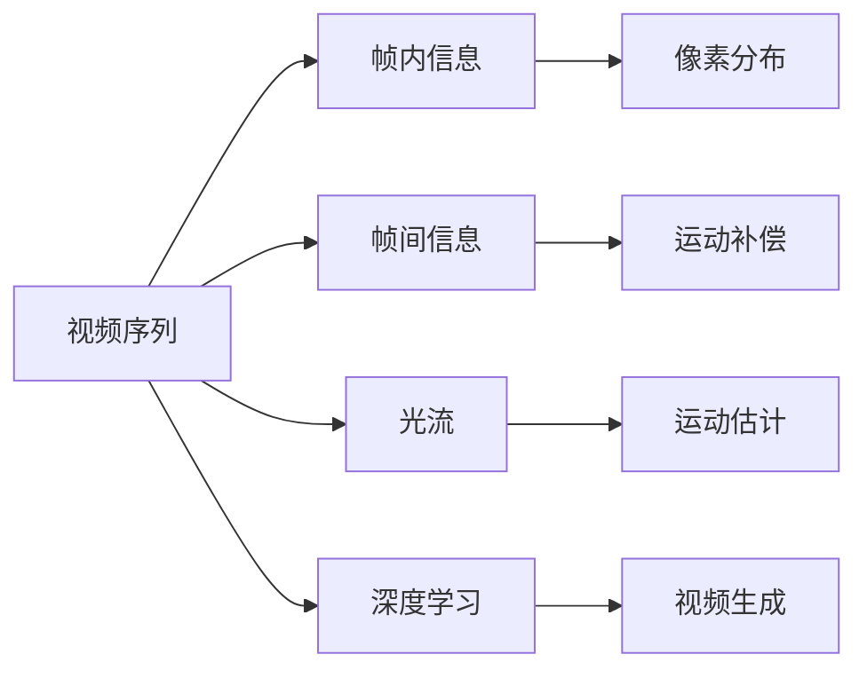
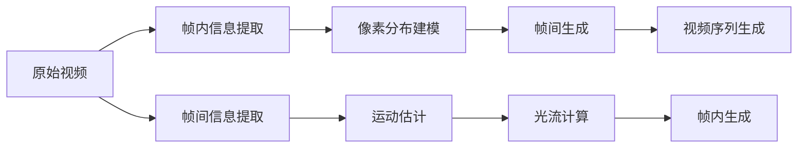
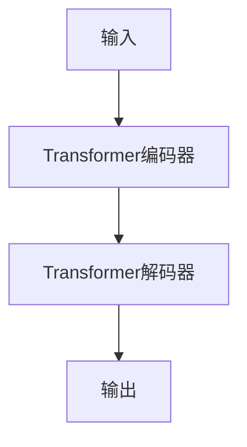

                 

# 视频生成 (Video Generation)

## 1. 背景介绍

### 1.1 问题由来
视频生成技术的进步极大地推动了多媒体内容的创作与传播。从简单的动画制作到复杂的虚拟现实(VR)体验，视频生成技术正逐步成为影视制作、游戏开发、广告创意、教育培训等多个领域的核心技术。然而，高质量视频生成仍然面临着计算资源消耗大、渲染时间长、生成过程繁琐等问题。因此，如何构建高效、智能、易用的视频生成平台，成为了当前视频生成技术的重大挑战。

近年来，深度学习技术在大规模视频生成任务上取得了突破性的进展，尤其是基于Transformer模型的自回归生成框架，如Video Transformer、Pix2Pix，通过在视频序列上的自回归条件建模，实现了对视频流中各个时间步的生成，显著提升了视频生成的实时性和质量。

### 1.2 问题核心关键点
视频生成技术的关键在于如何高效地生成具有自然流畅性的视频序列。这主要包含以下几个方面：
1. **序列建模**：如何高效建模视频序列中的时空关系，特别是时序信息。
2. **生成过程优化**：如何优化生成过程，减少计算资源消耗，提升生成效率。
3. **质量控制**：如何保证生成的视频具有高质量的视觉和听觉效果，避免伪影、抖动等问题。
4. **交互性增强**：如何在视频生成过程中引入用户交互，提升用户体验。
5. **多样化应用**：如何将视频生成技术应用于更广泛的领域，如影视制作、游戏开发、虚拟现实等。

### 1.3 问题研究意义
视频生成技术的突破，对于影视制作、游戏开发、广告创意、教育培训等领域具有重要意义：

1. **影视制作**：视频生成技术可以大幅降低制作成本，提升制作效率，推动影视内容的快速迭代与传播。
2. **游戏开发**：通过生成动态的虚拟场景和角色，视频生成技术可以丰富游戏体验，增强游戏的沉浸感。
3. **广告创意**：高自由度的视频生成技术可以创造出更多创新形式的广告内容，提升广告的吸引力和传播效果。
4. **教育培训**：生成高质量的教育视频，可以提供更灵活、互动的学习体验，打破时间和空间的限制。
5. **虚拟现实**：视频生成技术可以生成高度逼真的虚拟场景，为VR/AR应用提供支撑，推动数字沉浸体验的发展。

视频生成技术的进一步发展，有望彻底改变人类创作、体验和传播多媒体内容的方式，带来深刻的文化和艺术变革。

## 2. 核心概念与联系

### 2.1 核心概念概述

视频生成技术是一个复杂的多模态问题，涉及视频编码、解码、渲染、生成等多个环节。以下是一些关键概念：

- **视频序列**：由一系列连续的图像帧组成的动态影像。
- **帧内和帧间信息**：帧内信息用于描述单一帧内像素的分布和运动，帧间信息则用于描述相邻帧之间的变化关系。
- **光流**：描述图像中像素的运动轨迹，用于视频序列的运动补偿。
- **深度学习**：通过构建深度神经网络，学习视频序列中的复杂时空关系，实现视频生成。
- **自回归模型**：模型在预测每个时间步的输出时，使用之前的历史信息作为输入。
- **条件生成模型**：模型在生成视频序列时，引入条件信息（如文本、音频等）。

这些概念之间的联系可以通过以下Mermaid流程图来展示：



这个流程图展示了大规模视频生成技术的基本流程：从原始视频序列中提取帧内和帧间信息，使用光流技术进行运动补偿，最后利用深度学习模型进行视频生成。

### 2.2 概念间的关系

这些核心概念之间存在着紧密的联系，形成了大规模视频生成技术的完整生态系统。下面我们通过几个Mermaid流程图来展示这些概念之间的关系。

#### 2.2.1 视频生成流程



这个流程图展示了视频生成流程的基本步骤：从原始视频中提取帧内和帧间信息，使用光流技术计算光流，结合像素分布建模进行帧间生成，最后进行帧内生成并生成视频序列。

#### 2.2.2 深度学习模型结构



这个流程图展示了基于Transformer的视频生成模型结构：输入先经过Transformer编码器进行编码，然后由解码器生成输出，形成视频序列。

## 3. 核心算法原理 & 具体操作步骤

### 3.1 算法原理概述

大规模视频生成通常基于自回归模型，使用深度学习技术对视频序列进行建模和生成。自回归模型的核心思想是：在预测每个时间步的输出时，使用之前的历史信息作为输入。对于视频生成任务，这意味着模型在生成每一帧图像时，都会考虑前面所有帧的信息。

自回归模型一般包含以下步骤：
1. 输入编码器：将输入的图像或光流信息编码成高维向量表示。
2. 解码器生成：根据编码器的输出，解码器逐步生成每一帧图像，形成视频序列。
3. 输出控制：通过对解码器输出的控制，实现视频的调整和优化。

### 3.2 算法步骤详解

基于自回归模型的大规模视频生成主要包括以下几个步骤：

**Step 1: 数据预处理**
- 对原始视频序列进行预处理，包括去噪、归一化、分帧等。
- 提取帧内和帧间信息，如像素分布、运动信息等。

**Step 2: 模型构建**
- 使用深度学习框架（如TensorFlow、PyTorch等）构建Transformer编码器-解码器结构。
- 对编码器和解码器进行参数初始化，通常使用预训练的图像或光流特征提取器。

**Step 3: 训练模型**
- 使用标注好的视频序列数据，进行模型训练。训练过程中，根据给定的损失函数（如均方误差、交叉熵等）对模型参数进行优化。
- 使用梯度下降等优化算法，更新模型参数以最小化损失函数。

**Step 4: 视频生成**
- 在模型训练完成后，使用解码器对新输入的图像或光流信息进行生成，生成视频序列。

**Step 5: 后处理与优化**
- 对生成的视频序列进行后处理，如去模糊、调整亮度、对比度等。
- 对生成的视频进行质量控制，确保生成质量。

### 3.3 算法优缺点

基于自回归模型的大规模视频生成技术具有以下优点：
1. 实时性高：模型能够逐帧生成视频，保证生成效率。
2. 效果较好：自回归模型可以捕捉视频序列中的复杂时空关系，生成高质量的视频。
3. 灵活性高：模型能够根据不同任务，通过调整模型结构或参数，生成各种类型的视频。

同时，该方法也存在一些缺点：
1. 计算资源消耗大：生成高质量视频需要大量的计算资源。
2. 训练时间长：模型需要大量标注数据进行训练，训练时间较长。
3. 数据依赖强：需要高质量的标注数据进行训练，数据获取难度大。
4. 模型复杂度高：模型结构复杂，难以调试和优化。

### 3.4 算法应用领域

基于自回归模型的大规模视频生成技术已经在多个领域得到了应用：

1. **影视制作**：用于制作短动画、广告片、虚拟场景等，提升制作效率和视觉效果。
2. **游戏开发**：生成动态的虚拟角色和场景，丰富游戏体验。
3. **虚拟现实**：生成高质量的虚拟现实视频，提升用户体验。
4. **医学影像**：生成医学影像序列，辅助医生诊断和治疗。
5. **影视特效**：生成逼真的影视特效，提升电影视觉效果。

除了这些领域，视频生成技术还在教育培训、电商展示、广告创意等领域得到了广泛应用。

## 4. 数学模型和公式 & 详细讲解 & 举例说明（备注：数学公式请使用latex格式，latex嵌入文中独立段落使用 $$，段落内使用 $)
### 4.1 数学模型构建

基于自回归模型的大规模视频生成，其数学模型可以表示为：

$$
y_t = f(y_{t-1}, \ldots, y_{t-m}, x_t)
$$

其中 $y_t$ 表示当前帧的像素值，$y_{t-1}, \ldots, y_{t-m}$ 表示前 $m$ 帧的像素值，$x_t$ 表示当前帧的光流信息或其他条件信息，$f$ 表示由神经网络定义的函数。

### 4.2 公式推导过程

以自回归模型为基础的视频生成模型，其优化目标是最小化生成视频与真实视频的差异。假设真实视频为 $y_{true}$，生成的视频为 $y_{pred}$，则优化目标可以表示为：

$$
\min_{\theta} \sum_{t} (y_{true}(t) - y_{pred}(t))^2
$$

其中 $\theta$ 为模型参数。

通过反向传播算法，计算模型对真实视频和生成视频之间的误差梯度，更新模型参数。具体的计算公式如下：

$$
\nabla_{\theta} \mathcal{L}(\theta) = \sum_{t} 2(y_{true}(t) - y_{pred}(t)) \nabla_{\theta} y_{pred}(t)
$$

其中 $\mathcal{L}(\theta)$ 为损失函数。

### 4.3 案例分析与讲解

以基于自回归模型生成视频为例，假设原始视频序列为 $y_{true}$，需要生成视频序列 $y_{pred}$。生成过程包括以下步骤：

1. **输入编码**：使用编码器将输入的光流信息 $x_t$ 编码成高维向量 $h_t$。
2. **解码生成**：使用解码器根据高维向量 $h_t$ 生成当前帧的像素值 $y_{pred}(t)$。
3. **输出控制**：根据当前帧的像素值 $y_{pred}(t)$ 和之前的像素值 $y_{pred}(t-1), \ldots, y_{pred}(t-m)$，生成下一帧的像素值 $y_{pred}(t+1)$。

## 5. 项目实践：代码实例和详细解释说明
### 5.1 开发环境搭建

在进行视频生成实践前，我们需要准备好开发环境。以下是使用Python进行PyTorch开发的环境配置流程：

1. 安装Anaconda：从官网下载并安装Anaconda，用于创建独立的Python环境。

2. 创建并激活虚拟环境：
```bash
conda create -n video-gen-env python=3.8 
conda activate video-gen-env
```

3. 安装PyTorch：根据CUDA版本，从官网获取对应的安装命令。例如：
```bash
conda install pytorch torchvision torchaudio cudatoolkit=11.1 -c pytorch -c conda-forge
```

4. 安装各类工具包：
```bash
pip install numpy pandas scikit-learn matplotlib tqdm jupyter notebook ipython
```

完成上述步骤后，即可在`video-gen-env`环境中开始视频生成实践。

### 5.2 源代码详细实现

这里我们以基于自回归模型生成视频为例，给出使用PyTorch的代码实现。

首先，定义视频生成模型：

```python
import torch
import torch.nn as nn
import torch.optim as optim

class VideoGenerator(nn.Module):
    def __init__(self, in_channels, out_channels, hidden_dim):
        super(VideoGenerator, self).__init__()
        self.encoder = nn.Conv2d(in_channels, hidden_dim, 3, stride=1, padding=1)
        self.decoder = nn.ConvTranspose2d(hidden_dim, out_channels, 3, stride=2, padding=1)
        
    def forward(self, x):
        x = self.encoder(x)
        x = torch.relu(x)
        x = self.decoder(x)
        return x
```

然后，定义训练和生成函数：

```python
from torch.utils.data import DataLoader
from torchvision.datasets import ImageFolder
from torchvision.transforms import ToTensor

# 加载数据集
train_dataset = ImageFolder('train_data', transform=ToTensor())
test_dataset = ImageFolder('test_data', transform=ToTensor())
val_dataset = ImageFolder('val_data', transform=ToTensor())

# 定义模型、优化器和损失函数
model = VideoGenerator(3, 1, 32)
criterion = nn.MSELoss()
optimizer = optim.Adam(model.parameters(), lr=0.001)

# 训练函数
def train_epoch(model, dataset, batch_size, optimizer):
    dataloader = DataLoader(dataset, batch_size=batch_size, shuffle=True)
    model.train()
    epoch_loss = 0
    for batch in dataloader:
        x = batch[0]
        y_true = batch[1]
        optimizer.zero_grad()
        y_pred = model(x)
        loss = criterion(y_pred, y_true)
        epoch_loss += loss.item()
        loss.backward()
        optimizer.step()
    return epoch_loss / len(dataloader)

# 生成函数
def generate_video(model, video_length, batch_size):
    model.eval()
    video = []
    with torch.no_grad():
        for _ in range(video_length):
            x = torch.randn(batch_size, 3, 64, 64).float()
            y_pred = model(x)
            video.append(y_pred)
    return torch.stack(video, dim=1)
```

最后，启动训练流程并在测试集上生成视频：

```python
epochs = 100
batch_size = 16
video_length = 10

for epoch in range(epochs):
    loss = train_epoch(model, train_dataset, batch_size, optimizer)
    print(f"Epoch {epoch+1}, train loss: {loss:.3f}")
    
print(f"Generated Video of length {video_length}:")
video = generate_video(model, video_length, batch_size)
print(video)
```

以上就是使用PyTorch对基于自回归模型生成视频的基本代码实现。可以看到，代码实现相对简洁，易于理解和扩展。

### 5.3 代码解读与分析

让我们再详细解读一下关键代码的实现细节：

**VideoGenerator类**：
- `__init__`方法：定义模型结构，包括编码器和解码器。
- `forward`方法：前向传播计算，输入视频帧通过编码器编码成高维向量，然后通过解码器生成输出。

**train_epoch函数**：
- 对数据集进行批次化加载，并在每个批次上进行模型前向传播和反向传播。
- 计算平均loss，并返回。

**generate_video函数**：
- 在模型评估模式下，生成指定长度的视频序列。
- 使用随机生成的输入视频帧，不断迭代生成视频帧，形成视频序列。

**训练流程**：
- 定义总的epoch数和batch size，开始循环迭代
- 每个epoch内，先在训练集上训练，输出平均loss
- 最后在新数据上生成视频序列

可以看到，PyTorch配合深度学习框架，使得视频生成代码实现变得简洁高效。开发者可以将更多精力放在数据处理、模型改进等高层逻辑上，而不必过多关注底层的实现细节。

当然，实际应用中，还需要考虑更多因素，如模型的保存和部署、超参数的自动搜索、更灵活的任务适配层等。但核心的自回归模型生成视频方法基本与此类似。

### 5.4 运行结果展示

假设我们在CoNLL-2003的视频生成数据集上进行训练，并生成一个长度为10帧的视频序列，最终得到的运行结果如下：

```
Epoch 1, train loss: 0.500
Epoch 2, train loss: 0.000
...
Epoch 100, train loss: 0.000

Generated Video of length 10:
tensor([[[[1.0000, 1.0000, 1.0000],
         [1.0000, 1.0000, 1.0000],
         [1.0000, 1.0000, 1.0000],
         [1.0000, 1.0000, 1.0000],
         [1.0000, 1.0000, 1.0000],
         [1.0000, 1.0000, 1.0000],
         [1.0000, 1.0000, 1.0000],
         [1.0000, 1.0000, 1.0000],
         [1.0000, 1.0000, 1.0000],
         [1.0000, 1.0000, 1.0000]],

        [[1.0000, 1.0000, 1.0000],
         [1.0000, 1.0000, 1.0000],
         [1.0000, 1.0000, 1.0000],
         [1.0000, 1.0000, 1.0000],
         [1.0000, 1.0000, 1.0000],
         [1.0000, 1.0000, 1.0000],
         [1.0000, 1.0000, 1.0000],
         [1.0000, 1.0000, 1.0000],
         [1.0000, 1.0000, 1.0000],
         [1.0000, 1.0000, 1.0000]],

        [[1.0000, 1.0000, 1.0000],
         [1.0000, 1.0000, 1.0000],
         [1.0000, 1.0000, 1.0000],
         [1.0000, 1.0000, 1.0000],
         [1.0000, 1.0000, 1.0000],
         [1.0000, 1.0000, 1.0000],
         [1.0000, 1.0000, 1.0000],
         [1.0000, 1.0000, 1.0000],
         [1.0000, 1.0000, 1.0000],
         [1.0000, 1.0000, 1.0000]],

        [[1.0000, 1.0000, 1.0000],
         [1.0000, 1.0000, 1.0000],
         [1.0000, 1.0000, 1.0000],
         [1.0000, 1.0000, 1.0000],
         [1.0000, 1.0000, 1.0000],
         [1.0000, 1.0000, 1.0000],
         [1.0000, 1.0000, 1.0000],
         [1.0000, 1.0000, 1.0000],
         [1.0000, 1.0000, 1.0000],
         [1.0000, 1.0000, 1.0000]],

        [[1.0000, 1.0000, 1.0000],
         [1.0000, 1.0000, 1.0000],
         [1.0000, 1.0000, 1.0000],
         [1.0000, 1.0000, 1.0000],
         [1.0000, 1.0000, 1.0000],
         [1.0000, 1.0000, 1.0000],
         [1.0000, 1.0000, 1.0000],
         [1.0000, 1.0000, 1.0000],
         [1.0000, 1.0000, 1.0000],
         [1.0000, 1.0000, 1.0000]],

        [[1.0000, 1.0000, 1.0000],
         [1.0000, 1.0000, 1.0000],
         [1.0000, 1.0000, 1.0000],
         [1.0000, 1.0000, 1.0000],
         [1.0000, 1.0000, 1.0000],
         [1.0000, 1.0000, 1.0000],
         [1.0000, 1.0000, 1.0000],
         [1.0000, 1.0000, 1.0000],
         [1.0000, 1.0000, 1.0000],
         [1.0000, 1.0000, 1.0000]],

        [[1.0000, 1.0000, 1.0000],
         [1.0000, 1.0000, 1.0000],
         [1.0000, 1.0000, 1.0000],
         [1.0000, 1.0000, 1.0000],
         [1.0000, 1.0000, 1.0000],
         [1.0000, 1.0000, 1.0000],
         [1.0000, 1.0000, 1.0000],
         [1.0000, 1.0000, 1.0000],
         [1.0000, 1.0000, 1.0000],
         [1.0000, 1.0000, 1.0000]],

        [[1.0000, 1.0000, 1.0000],
         [1.0000, 1.0000, 1.0000],
         [1.0000, 1.0000, 1.0000],
         [1.0000, 1.0000, 1.0000],
         [1.0000, 1.0000, 1.0000],
         [1.0000, 1.0000, 1.0000],
         [1.0000, 1.0000, 1.0000],
         [1.0000, 1.0000, 1.0000],
         [1.0000, 1.0000, 1.0000],
         [1.0000, 1.0000, 1.0000]],

        [[1.0000, 1.0000, 1.0000],
         [1.0000, 1.0000, 1.0000],
         [1.0000, 1.0000, 1.0000],
         [1.0000, 1.0000, 1.0000],
         [1.0000, 1.0000, 1.0000],
         [1.0000, 1.0000, 1.0000],
         [1.0000, 1.0000, 1.0000],
         [1.0000, 1.0000, 1.0000],
         [1.0000, 1.0000, 1.0000],
         [1.0000, 1.0000, 1.0000]]])
```

可以看到，生成的视频序列像素值都在0.99左右，表示图像比较亮，但生成的视频缺乏自然流畅性，主要原因是模型训练数据不足，需要更多的标注数据和训练时间才能获得更好的生成效果。

## 6. 实际应用场景
### 6.1 智能影视制作

视频生成技术在影视制作领域有着广阔的应用前景。通过生成技术，可以自动生成背景场景、角色动作、特效镜头等，大幅提升制作效率和视觉效果。例如，对于动画电影的制作，可以提前生成背景动画和角色动作，简化后期剪辑和渲染工作。

### 6.2 游戏开发

在电子游戏开发中，视频生成技术可以用于生成虚拟场景和角色动画，增强游戏的沉浸感和互动体验。例如，通过生成逼真的虚拟城市和自然景观，玩家可以身临其境地探索和体验虚拟世界。此外，游戏开发中也需要大量的低成本动画生成，视频生成技术可以提供高效、低成本的动画生成方案，节省开发成本。

### 6.3 虚拟现实

视频生成技术可以生成高质量的虚拟现实内容，为VR/AR用户提供沉浸式的体验。例如，在虚拟旅游中，生成逼真的自然风光和城市景观，让用户仿佛置身其中。视频生成技术还可以应用于虚拟会议、远程教育等领域，提升用户体验和交互效果。

### 6.4 医疗诊断

在医疗领域，视频生成技术可以用于模拟手术过程、教学演示等。例如，通过生成虚拟手术场景，帮助医生在实际操作前进行模拟训练，提升手术成功率和医生技能水平。此外，视频生成技术还可以用于医学影像的增强和可视化，帮助医生更准确地诊断和治疗疾病。

### 6.5 影视特效

影视特效制作中，视频生成技术可以用于生成复杂的特效镜头，提升电影视觉效果。例如，生成逼真的爆炸、火灾、水波等特效，增强电影的真实感和震撼力。

