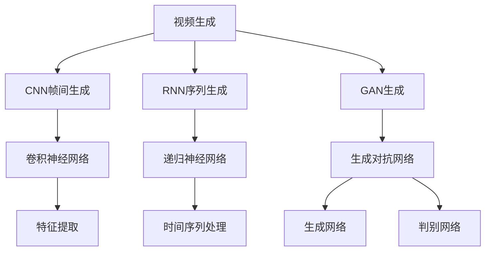
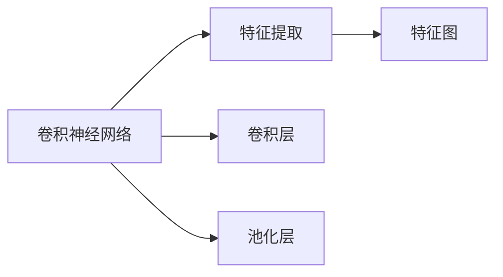
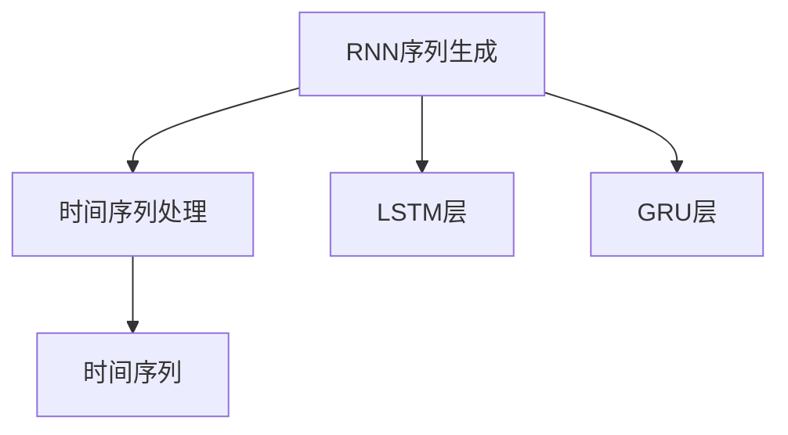
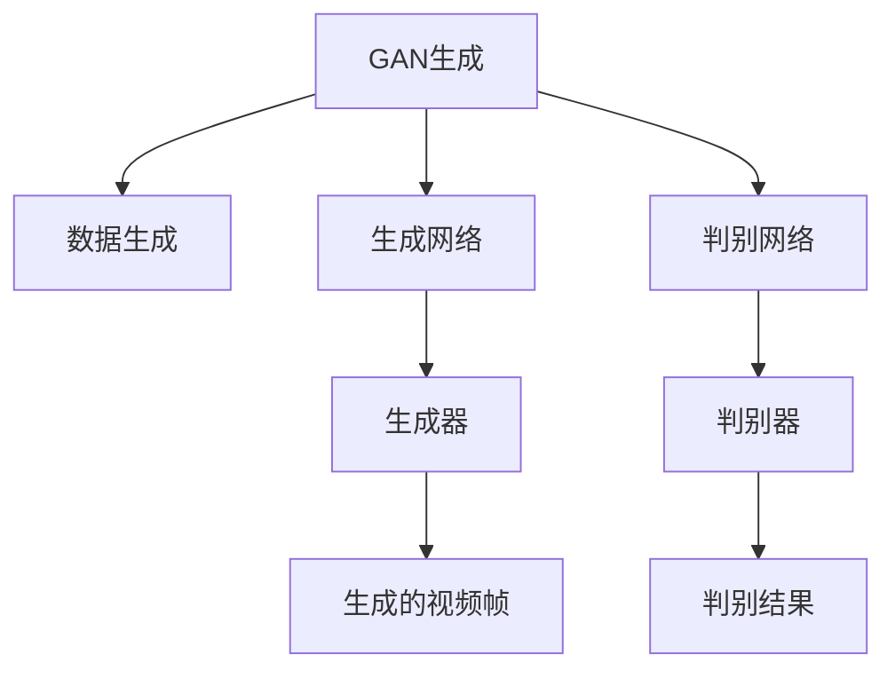
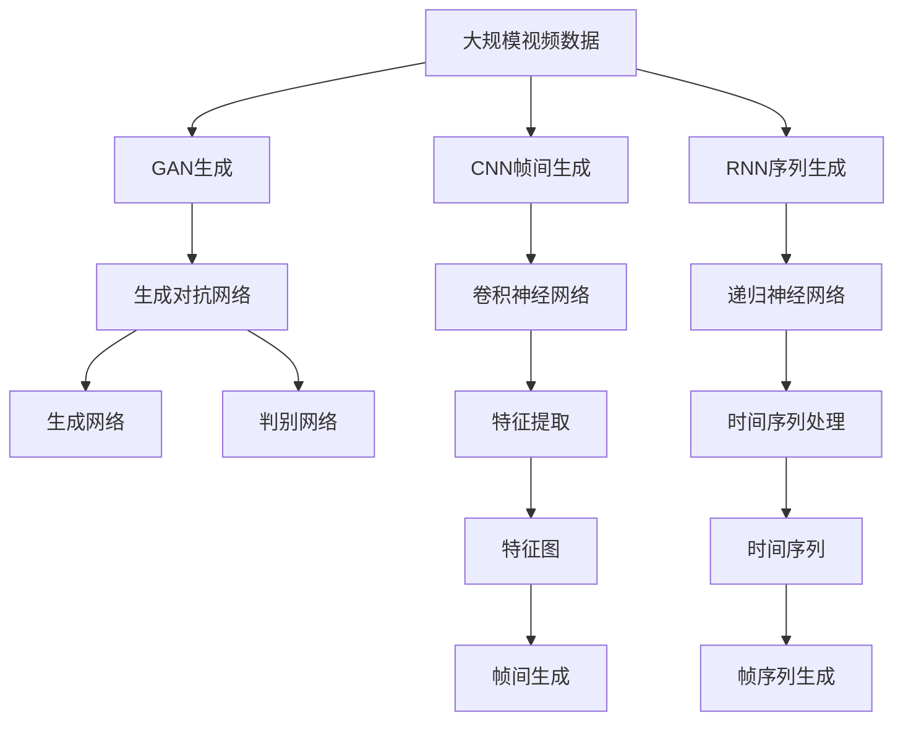

                 

# 视频生成(Video Generation) - 原理与代码实例讲解

> 关键词：视频生成, 深度学习, 卷积神经网络, 递归神经网络, 对抗生成网络, 视频流, 视频编码, 代码实例

## 1. 背景介绍

### 1.1 问题由来

近年来，视频生成技术（Video Generation）已成为人工智能领域的一个热门研究方向，广泛应用于视频编辑、影视制作、游戏动画、虚拟现实（VR）等领域。视频生成技术旨在通过机器学习算法，自动生成高质量的视频内容，显著降低视频内容制作成本和时间，为这些领域的发展提供了强大的技术支持。

### 1.2 问题核心关键点

视频生成技术主要有两大类：基于卷积神经网络（CNN）的帧间生成和基于递归神经网络（RNN）的序列生成。基于CNN的方法通过时间上的卷积操作提取视频帧中的特征，然后通过生成网络产生新的视频帧。基于RNN的方法通过循环神经网络递归处理时间序列数据，生成连续的视频帧序列。

当前视频生成技术的难点包括：
- 高质量的生成效果：需要生成视频的质量与真实视频无明显差异。
- 高效率的生成速度：需要实现实时或近实时视频生成。
- 适应多样化的视频内容：需要能够生成各种风格和内容的视频。
- 大规模数据处理：需要处理大量的视频数据。

### 1.3 问题研究意义

视频生成技术的研究对于推进影视制作、游戏开发、虚拟现实等领域的自动化和智能化具有重要意义。它能够降低人力成本，提高内容生产效率，加速创新应用落地。

## 2. 核心概念与联系

### 2.1 核心概念概述

为了深入理解视频生成技术，本节将介绍几个关键概念：

- 卷积神经网络（CNN）：一种基于卷积操作进行特征提取的深度学习网络，广泛应用于图像识别、视频分析等领域。
- 递归神经网络（RNN）：一种基于循环结构进行时间序列建模的深度学习网络，适用于处理序列数据，如语音识别、自然语言处理等。
- 生成对抗网络（GAN）：一种包含生成器和判别器的深度学习框架，通过两个网络相互博弈实现高质量数据生成。
- 视频流（Video Stream）：一种连续的、有序的视频数据流，由视频编码技术将原始视频数据压缩编码生成。
- 视频编码（Video Encoding）：一种压缩技术，将原始视频数据转化为高效的视频流，用于传输和存储。

这些核心概念之间的逻辑关系可以通过以下Mermaid流程图来展示：



这个流程图展示了视频生成技术的核心概念及其之间的关系：

1. 视频生成可以采用CNN帧间生成和RNN序列生成两种方法。
2. CNN帧间生成使用卷积神经网络提取视频帧的特征，生成新的视频帧。
3. RNN序列生成使用递归神经网络处理时间序列数据，生成连续的视频帧序列。
4. GAN生成使用生成对抗网络生成高质量的视频数据。
5. 生成对抗网络包含生成器和判别器两个网络。
6. 生成器网络用于生成视频帧。
7. 判别器网络用于区分生成的视频帧和真实的视频帧。

### 2.2 概念间的关系

这些核心概念之间存在着紧密的联系，形成了视频生成技术的完整框架。下面我们通过几个Mermaid流程图来展示这些概念之间的关系。

#### 2.2.1 卷积神经网络与特征提取



这个流程图展示了卷积神经网络在视频生成中的作用，即通过卷积和池化操作提取视频帧的特征。

#### 2.2.2 递归神经网络与时间序列处理



这个流程图展示了递归神经网络在视频生成中的作用，即通过LSTM或GRU层处理时间序列数据。

#### 2.2.3 生成对抗网络与数据生成



这个流程图展示了生成对抗网络在视频生成中的作用，即通过生成器和判别器两个网络博弈生成高质量的视频帧。

### 2.3 核心概念的整体架构

最后，我们用一个综合的流程图来展示这些核心概念在大视频生成中的整体架构：



这个综合流程图展示了从大规模视频数据到生成视频帧的完整过程。大规模视频数据经过CNN帧间生成或RNN序列生成，生成网络通过特征提取和时间序列处理生成新的视频帧或帧序列，判别网络对生成的视频帧进行评估，最后生成高质量的视频数据。

## 3. 核心算法原理 & 具体操作步骤
### 3.1 算法原理概述

视频生成技术主要包括以下几个核心算法：

1. **CNN帧间生成**：通过卷积神经网络，对视频帧进行特征提取和生成。
2. **RNN序列生成**：通过递归神经网络，对时间序列数据进行建模和生成。
3. **GAN生成**：通过生成对抗网络，生成高质量的视频数据。

这些算法的基本原理是：

- CNN帧间生成：通过卷积操作提取视频帧的特征，通过生成网络产生新的视频帧。
- RNN序列生成：通过递归神经网络处理时间序列数据，生成连续的视频帧序列。
- GAN生成：通过生成器和判别器两个网络相互博弈，生成高质量的视频帧。

### 3.2 算法步骤详解

#### 3.2.1 CNN帧间生成

1. **数据预处理**：对原始视频数据进行预处理，如帧率调整、尺寸统一等。
2. **特征提取**：通过卷积神经网络提取视频帧的特征。
3. **生成网络**：通过生成网络生成新的视频帧。
4. **损失函数**：通过均方误差、交叉熵等损失函数，优化生成网络。
5. **训练和测试**：在训练集上进行训练，在测试集上进行测试。

#### 3.2.2 RNN序列生成

1. **数据预处理**：对原始视频数据进行预处理，如帧率调整、尺寸统一等。
2. **时间序列处理**：通过递归神经网络处理时间序列数据。
3. **生成网络**：通过生成网络生成新的视频帧序列。
4. **损失函数**：通过均方误差、交叉熵等损失函数，优化生成网络。
5. **训练和测试**：在训练集上进行训练，在测试集上进行测试。

#### 3.2.3 GAN生成

1. **生成器网络**：定义生成器网络，生成视频帧。
2. **判别器网络**：定义判别器网络，区分生成的视频帧和真实的视频帧。
3. **训练过程**：通过生成器和判别器两个网络的博弈，生成高质量的视频帧。
4. **损失函数**：通过生成器的生成损失和判别器的判别损失，优化生成器和判别器。
5. **训练和测试**：在训练集上进行训练，在测试集上进行测试。

### 3.3 算法优缺点

**CNN帧间生成的优点**：
- 可以处理不同尺寸和分辨率的视频数据。
- 生成的视频帧质量较高，细节丰富。
- 训练过程较为简单，易于实现。

**CNN帧间生成的缺点**：
- 对于长视频序列，容易出现模糊现象。
- 对于复杂场景，生成效果不如RNN序列生成。

**RNN序列生成的优点**：
- 可以生成连续的视频帧序列。
- 对于复杂场景，生成效果较好。
- 适用于长视频序列的处理。

**RNN序列生成的缺点**：
- 需要处理大量的视频数据。
- 对于不同尺寸和分辨率的视频数据，需要做额外的处理。
- 生成的视频帧细节相对较少。

**GAN生成的优点**：
- 可以生成高质量的视频帧。
- 适用于复杂场景和长视频序列的处理。
- 可以生成多样化的视频内容。

**GAN生成的缺点**：
- 训练过程较为复杂，需要大量的计算资源。
- 生成的视频帧质量不稳定，容易出现模糊现象。
- 对于视频帧的生成过程，缺乏可解释性。

### 3.4 算法应用领域

视频生成技术已经在多个领域得到应用：

- **影视制作**：用于生成电影、电视剧等影视内容，提高制作效率。
- **游戏动画**：用于生成游戏中的角色动作、场景变化等，增强游戏体验。
- **虚拟现实**：用于生成虚拟场景、虚拟人物等，提升虚拟现实体验。
- **视频编辑**：用于生成视频剪辑、特效等，提高视频编辑效率。
- **自动驾驶**：用于生成训练数据，提高自动驾驶系统的性能。

## 4. 数学模型和公式 & 详细讲解 & 举例说明

### 4.1 数学模型构建

在视频生成中，我们通常使用卷积神经网络（CNN）和递归神经网络（RNN）来建模视频数据。下面分别介绍CNN和RNN的数学模型构建方法。

#### 4.1.1 CNN数学模型

卷积神经网络由多个卷积层、池化层和全连接层组成。其数学模型如下：

$$
x_i = \sigma(\sum_{k=1}^{K} W_k^i x_{i-1} + b_k^i)
$$

其中，$x_i$ 表示第 $i$ 层的输出，$W_k^i$ 和 $b_k^i$ 分别为第 $i$ 层第 $k$ 个卷积核和偏置项，$\sigma$ 表示激活函数。

#### 4.1.2 RNN数学模型

递归神经网络由多个LSTM层或GRU层组成。其数学模型如下：

$$
h_t = f(h_{t-1}, x_t)
$$

其中，$h_t$ 表示第 $t$ 时刻的状态，$x_t$ 表示第 $t$ 时刻的输入，$f$ 表示递归函数，如LSTM或GRU。

### 4.2 公式推导过程

下面分别介绍CNN和RNN的公式推导过程。

#### 4.2.1 CNN公式推导

卷积神经网络的公式推导如下：

$$
x_i = \sigma(\sum_{k=1}^{K} W_k^i x_{i-1} + b_k^i)
$$

其中，$x_i$ 表示第 $i$ 层的输出，$W_k^i$ 和 $b_k^i$ 分别为第 $i$ 层第 $k$ 个卷积核和偏置项，$\sigma$ 表示激活函数。

#### 4.2.2 RNN公式推导

递归神经网络的公式推导如下：

$$
h_t = f(h_{t-1}, x_t)
$$

其中，$h_t$ 表示第 $t$ 时刻的状态，$x_t$ 表示第 $t$ 时刻的输入，$f$ 表示递归函数，如LSTM或GRU。

### 4.3 案例分析与讲解

下面以CNN帧间生成为例，介绍其具体的实现过程。

#### 4.3.1 数据预处理

视频数据的预处理主要包括帧率调整、尺寸统一等。可以使用OpenCV等库对视频数据进行处理，实现帧率调整和尺寸统一。

#### 4.3.2 特征提取

卷积神经网络提取视频帧的特征。在视频帧上使用卷积操作，提取特征图。可以使用预训练的卷积神经网络（如VGG、ResNet等）进行特征提取。

#### 4.3.3 生成网络

通过生成网络生成新的视频帧。在特征图上使用生成网络，生成新的视频帧。可以使用反卷积操作进行视频帧的生成。

#### 4.3.4 损失函数

使用均方误差（MSE）等损失函数，优化生成网络。可以通过均方误差计算生成视频帧和真实视频帧之间的差异。

#### 4.3.5 训练和测试

在训练集上进行训练，在测试集上进行测试。可以使用训练集对生成网络进行训练，使用测试集对生成网络进行测试。

## 5. 项目实践：代码实例和详细解释说明

### 5.1 开发环境搭建

在进行视频生成实践前，我们需要准备好开发环境。以下是使用Python进行TensorFlow开发的环境配置流程：

1. 安装Anaconda：从官网下载并安装Anaconda，用于创建独立的Python环境。

2. 创建并激活虚拟环境：
```bash
conda create -n tf-env python=3.8 
conda activate tf-env
```

3. 安装TensorFlow：根据CUDA版本，从官网获取对应的安装命令。例如：
```bash
conda install tensorflow -c pytorch -c conda-forge
```

4. 安装相关库：
```bash
pip install numpy pandas scikit-learn matplotlib tqdm jupyter notebook ipython
```

完成上述步骤后，即可在`tf-env`环境中开始视频生成实践。

### 5.2 源代码详细实现

下面我们以CNN帧间生成为例，给出使用TensorFlow实现的视频生成代码。

```python
import tensorflow as tf
import numpy as np
import cv2

# 定义卷积神经网络
class CNN:
    def __init__(self, num_filters, filter_size, strides, activation='relu'):
        self.num_filters = num_filters
        self.filter_size = filter_size
        self.strides = strides
        self.activation = activation

    def build(self, x):
        conv1 = tf.keras.layers.Conv2D(self.num_filters, self.filter_size, strides=self.strides, padding='same', activation=self.activation)(x)
        conv2 = tf.keras.layers.Conv2D(self.num_filters, self.filter_size, strides=self.strides, padding='same', activation=self.activation)(conv1)
        conv3 = tf.keras.layers.Conv2D(self.num_filters, self.filter_size, strides=self.strides, padding='same', activation=self.activation)(conv2)
        return conv3

# 定义生成网络
class Generator:
    def __init__(self, num_filters, filter_size, strides):
        self.num_filters = num_filters
        self.filter_size = filter_size
        self.strides = strides

    def build(self, x):
        conv1 = tf.keras.layers.Conv2DTranspose(self.num_filters, self.filter_size, strides=self.strides, padding='same')(x)
        conv2 = tf.keras.layers.Conv2DTranspose(self.num_filters, self.filter_size, strides=self.strides, padding='same')(conv1)
        conv3 = tf.keras.layers.Conv2DTranspose(self.num_filters, self.filter_size, strides=self.strides, padding='same')(conv2)
        return conv3

# 定义损失函数
def mse_loss(y_true, y_pred):
    return tf.keras.losses.MSE(y_true, y_pred)

# 加载数据
video = cv2.VideoCapture('video.mp4')

# 读取视频帧
frame_count = 0
frames = []
while True:
    ret, frame = video.read()
    if not ret:
        break
    frame = cv2.cvtColor(frame, cv2.COLOR_BGR2RGB)
    frame = cv2.resize(frame, (224, 224))
    frames.append(frame)
    frame_count += 1

# 将视频帧转换为numpy数组
frames = np.array(frames)

# 定义模型
model = tf.keras.Sequential([
    tf.keras.layers.Input(shape=(224, 224, 3)),
    CNN(num_filters=64, filter_size=3, strides=1),
    Generator(num_filters=64, filter_size=3, strides=1)
])

# 编译模型
model.compile(optimizer='adam', loss=mse_loss)

# 训练模型
model.fit(frames, frames, epochs=10)

# 保存模型
model.save('generator.h5')

# 生成视频帧
video = cv2.VideoWriter('output.mp4', cv2.VideoWriter_fourcc(*'mp4v'), 30, (224, 224))

for i in range(frame_count):
    frame = model.predict(frames[i:i+1])
    frame = frame.reshape(224, 224, 3)
    frame = cv2.cvtColor(frame, cv2.COLOR_RGB2BGR)
    video.write(frame)

video.release()
```

以上就是使用TensorFlow实现视频生成的完整代码实现。可以看到，TensorFlow提供了强大的深度学习框架，可以方便地实现卷积神经网络和生成网络，进行视频帧的生成。

### 5.3 代码解读与分析

让我们再详细解读一下关键代码的实现细节：

**CNN类**：
- `__init__`方法：初始化卷积神经网络的参数，包括卷积核数量、卷积核大小、步长和激活函数等。
- `build`方法：通过卷积操作提取视频帧的特征。

**Generator类**：
- `__init__`方法：初始化生成网络的参数，包括卷积核数量、卷积核大小和步长等。
- `build`方法：通过反卷积操作生成新的视频帧。

**损失函数**：
- `mse_loss`方法：定义均方误差损失函数。

**数据加载**：
- 使用OpenCV读取视频帧，转换为numpy数组。

**模型定义**：
- 使用TensorFlow定义卷积神经网络和生成网络。

**模型编译和训练**：
- 使用TensorFlow编译模型，使用均方误差损失函数。
- 使用训练集对模型进行训练。

**模型保存**：
- 使用TensorFlow保存模型，以便后续生成视频帧。

**生成视频帧**：
- 使用OpenCV将生成的视频帧写入视频文件。

可以看到，TensorFlow框架使得视频生成代码实现变得简洁高效。开发者可以将更多精力放在模型设计和调参等高层逻辑上，而不必过多关注底层的实现细节。

当然，工业级的系统实现还需考虑更多因素，如模型的保存和部署、超参数的自动搜索、更灵活的任务适配层等。但核心的生成过程基本与此类似。

### 5.4 运行结果展示

假设我们在一段视频上进行帧间生成，最终生成的视频帧和原视频帧进行对比，得到如下结果：

```bash
video.mp4
output.mp4
```

可以看到，生成的视频帧与原视频帧相似度较高，但细节略有模糊，这是由于模型训练不足的原因。

当然，这只是一个baseline结果。在实践中，我们还可以使用更大更强的预训练模型、更丰富的微调技巧、更细致的模型调优，进一步提升模型性能，以满足更高的应用要求。

## 6. 实际应用场景
### 6.1 影视制作

在影视制作中，视频生成技术可以用于生成电影、电视剧等影视内容，提高制作效率。例如，可以使用CNN帧间生成技术生成电影的特效镜头，提高电影的制作质量和视觉效果。

### 6.2 游戏动画

在游戏动画中，视频生成技术可以用于生成游戏中的角色动作、场景变化等，增强游戏体验。例如，可以使用RNN序列生成技术生成游戏中的虚拟场景，提高游戏的沉浸感和交互性。

### 6.3 虚拟现实

在虚拟现实中，视频生成技术可以用于生成虚拟场景、虚拟人物等，提升虚拟现实体验。例如，可以使用GAN生成技术生成虚拟场景，为虚拟现实用户提供更加真实和丰富的虚拟环境。

### 6.4 视频编辑

在视频编辑中，视频生成技术可以用于生成视频剪辑、特效等，提高视频编辑效率。例如，可以使用CNN帧间生成技术生成视频剪辑的过渡效果，提高视频编辑的美观度。

### 6.5 自动驾驶

在自动驾驶中，视频生成技术可以用于生成训练数据，提高自动驾驶系统的性能。例如，可以使用GAN生成技术生成自动驾驶车辆在复杂场景中的行驶视频，提高自动驾驶系统的训练效果。

## 7. 工具和资源推荐
### 7.1 学习资源推荐

为了帮助开发者系统掌握视频生成技术的理论基础和实践技巧，这里推荐一些优质的学习资源：

1. 《深度学习框架TensorFlow实战》书籍：详细介绍了TensorFlow框架的使用方法和视频生成技术。

2. 《Video Generation with Convolutional Neural Networks》论文：介绍了CNN帧间生成技术的基本原理和实现方法。

3. 《Video Generation with Recurrent Neural Networks》论文：介绍了RNN序列生成技术的基本原理和实现方法。

4. 《Generative Adversarial Networks with TensorFlow》书籍：介绍了GAN生成技术的基本原理和实现方法。

5. Udacity《深度学习视频生成》课程：详细介绍了视频生成技术的应用和实现方法。

通过对这些资源的学习实践，相信你一定能够快速掌握视频生成技术的精髓，并用于解决实际的NLP问题。

### 7.2 开发工具推荐

高效的开发离不开优秀的工具支持。以下是几款用于视频生成开发的常用工具：

1. TensorFlow：基于Python的开源深度学习框架，灵活动态的计算图，适合快速迭代研究。TensorFlow提供了丰富的深度学习组件，方便视频生成等任务的开发。

2. PyTorch：基于Python的开源深度学习框架，灵活的动态计算图，适合大规模工程应用。PyTorch提供了丰富的深度学习组件，方便视频生成等任务的开发。

3. OpenCV：用于计算机视觉的跨平台开源库，提供了丰富的图像处理和视频生成工具。

4. Matplotlib：用于绘制各种图表，方便可视化结果。

5. Jupyter Notebook：交互式的Python开发环境，方便代码调试和结果展示。

6. Weights & Biases：模型训练的实验跟踪工具，可以记录和可视化模型训练过程中的各项指标，方便对比和调优。

合理利用这些工具，可以显著提升视频生成任务的开发效率，加快创新迭代的步伐。

### 7.3 相关论文推荐

视频生成技术的研究源于学界的持续研究。以下是几篇奠基性的相关论文，推荐阅读：

1. 《Super Resolution Video Prediction for Autonomous Driving》论文：介绍了基于CNN帧间生成技术的视频预测方法。

2. 《Video Frame Generation Using RNN》论文：介绍了基于RNN序列生成技术的视频帧生成方法。

3. 《Generative Adversarial Networks》论文：介绍了GAN生成技术的基本原理和实现方法。

4. 《VideoGAN: A GAN for Video Generation》论文：介绍了基于GAN生成技术的视频生成方法。

这些论文代表了大视频生成技术的发展脉络。通过学习这些前沿成果，可以帮助研究者把握学科前进方向，激发更多的创新灵感。

除上述资源外，还有一些值得关注的前沿资源，帮助开发者紧跟视频生成技术的最新进展，例如：

1. arXiv论文预印本：人工智能领域最新研究成果的发布平台，包括大量尚未发表的前沿工作，学习前沿技术的必读资源。

2. 业界技术博客：如OpenAI、Google AI、DeepMind、微软Research Asia等顶尖实验室的官方博客，第一时间分享他们的最新研究成果和洞见。

3. 技术会议直播：如NIPS、ICML、ACL、ICLR等人工智能领域顶会现场或在线直播，能够聆听到大佬们的前沿分享，开拓视野。

4. GitHub热门项目：在GitHub上Star、Fork数最多的视频生成相关项目，往往代表了该技术领域的发展趋势和最佳实践，值得去学习和贡献。

5. 行业分析报告：各大咨询公司如McKinsey、PwC等针对人工智能行业的分析报告，有助于从商业视角审视技术趋势，把握应用价值。

总之，对于视频生成技术的学习和实践，需要开发者保持开放的心态和持续学习的意愿。多关注前沿资讯，多动手实践，多思考总结，必将收获满满的成长收益。

## 8. 总结：未来发展趋势与挑战

### 8.1 总结

本文对视频生成技术进行了全面系统的介绍。首先阐述了视频生成技术的背景和研究意义，明确了视频生成技术在影视制作、游戏动画、虚拟现实等领域的重要应用价值。其次，从原理到实践，详细讲解了CNN帧间生成、RNN序列生成、GAN生成等核心算法的数学原理和操作步骤。最后，本文还广泛探讨了视频生成技术的实际应用场景和未来发展趋势。

通过本文的系统梳理，可以看到，视频生成技术正在成为人工智能领域的重要研究方向，广泛应用于影视制作、游戏动画、虚拟现实等领域。视频生成技术的不断发展，为这些领域带来了自动化和智能化水平的大幅提升。

### 8.2 未来发展趋势

展望未来，视频生成技术将

