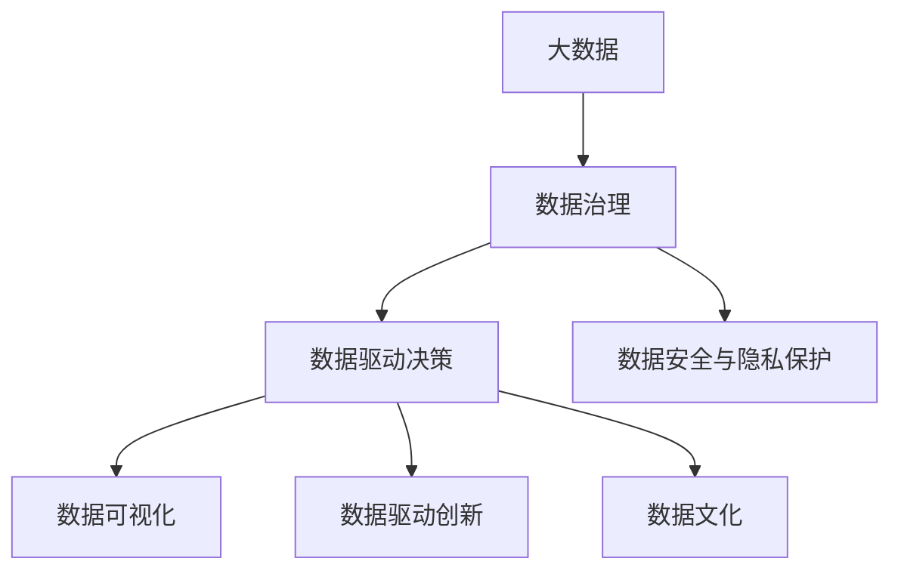
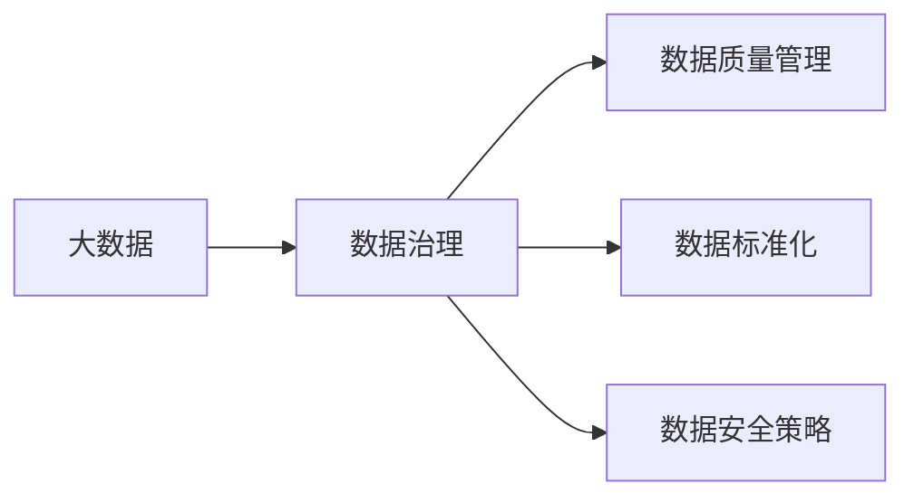
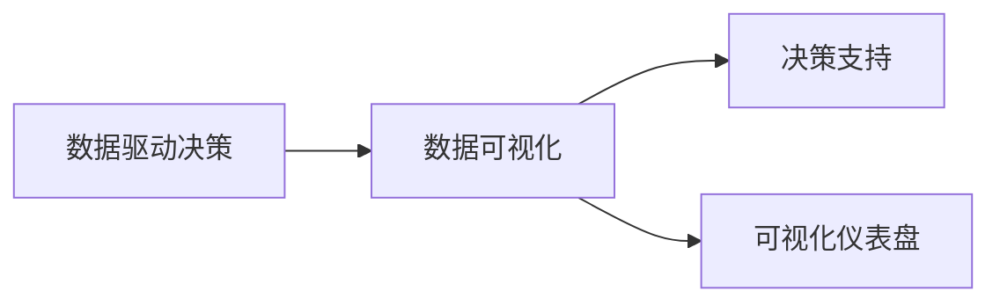
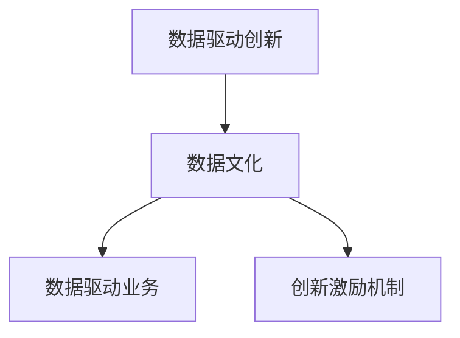
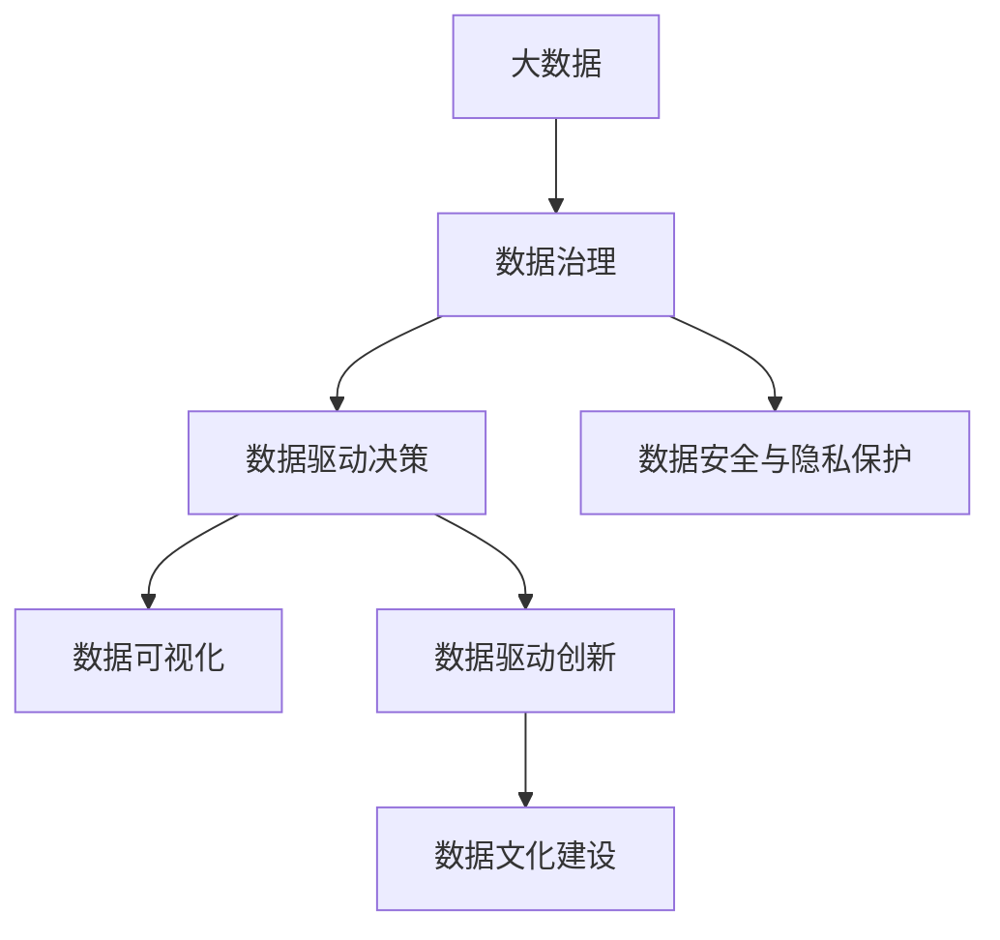

                 

# 解码信息差：大数据时代的竞争力源泉

> 关键词：大数据, 信息差, 数据驱动决策, 数据可视化, 数据治理, 数据驱动创新, 数据驱动战略, 数据文化

## 1. 背景介绍

### 1.1 问题由来
在大数据时代，信息量的爆炸性增长带来了前所未有的机遇和挑战。企业能够通过积累和分析海量数据，揭示隐藏在其中的商业秘密，优化决策，提升效率，驱动创新。但同时，也面临着数据质量差、数据孤岛、数据安全等诸多问题。如何有效利用数据，成为企业竞争力的重要源泉。

### 1.2 问题核心关键点
信息差（Information Gap）指的是在数据驱动决策过程中，信息提供者与信息接收者之间存在的知识差距，即数据本身并不能直接用于决策，而是需要经过合理的加工、分析和解释。在大数据时代，有效利用数据的关键在于：

1. **数据质量管理**：确保数据准确性、完整性、一致性和时效性。
2. **数据治理**：整合不同数据源，建立统一的数据标准和流程。
3. **数据驱动决策**：利用数据进行科学决策，驱动业务创新。
4. **数据文化建设**：在企业内部营造以数据为导向的工作文化和创新环境。
5. **数据安全与隐私保护**：保障数据安全，保护用户隐私。

这些关键点共同构成了大数据时代企业利用数据提升竞争力的核心挑战和机遇。

### 1.3 问题研究意义
通过揭示信息差并找到应对策略，企业能够在数据驱动的浪潮中，把握机会，规避风险，提升决策质量和创新能力。具体而言，研究信息差的解决策略，对于以下方面具有重要意义：

1. **提升决策效率**：通过优化数据处理和分析流程，企业可以快速做出基于数据的决策，提高市场响应速度。
2. **优化运营管理**：通过数据监控和分析，企业能够优化资源配置，降低运营成本，提升服务质量。
3. **驱动产品创新**：通过深入挖掘用户行为数据，企业可以发现潜在需求，推动新产品和服务的开发。
4. **增强竞争力**：数据驱动的决策能够帮助企业在激烈的市场竞争中，更准确地把握市场趋势，制定更有效的竞争策略。
5. **促进数据文化建设**：提升企业对数据的认知和重视，推动数据文化的形成和普及。

因此，研究如何利用大数据解决信息差问题，对于企业提升数据利用效率，增强市场竞争力，具有重要价值。

## 2. 核心概念与联系

### 2.1 核心概念概述

为更好地理解信息差在大数据时代的解决方案，本节将介绍几个密切相关的核心概念：

- **大数据（Big Data）**：指规模大、类型多、速度快、价值密度低的数据集合，通常存储在分布式文件系统和数据库中，需要先进的技术和工具来处理。
- **数据治理（Data Governance）**：指通过制定数据标准、流程和政策，确保数据的准确性、一致性和安全性。
- **数据驱动决策（Data-Driven Decision Making）**：指利用数据分析结果作为决策依据，进行科学决策的过程。
- **数据可视化（Data Visualization）**：指将数据转化为图形、图表等可视化形式，帮助人们理解和解释数据。
- **数据驱动创新（Data-Driven Innovation）**：指通过分析用户行为和市场需求数据，驱动新产品和服务的开发和优化。
- **数据文化（Data Culture）**：指企业内部对数据价值的认知、重视和使用习惯，是数据驱动策略成功实施的基础。
- **数据安全与隐私保护（Data Security and Privacy Protection）**：指保障数据不被未授权访问和使用，保护用户隐私和数据安全。

这些核心概念之间的逻辑关系可以通过以下Mermaid流程图来展示：



这个流程图展示了大数据时代企业利用数据的整体架构：

1. 通过数据治理提升数据质量。
2. 利用数据驱动决策，制定科学决策。
3. 通过数据可视化，帮助理解和解释数据。
4. 利用数据驱动创新，推动业务发展。
5. 建设数据文化，提升对数据的重视和利用。
6. 保障数据安全与隐私，保护用户权益。

### 2.2 概念间的关系

这些核心概念之间存在着紧密的联系，形成了企业利用数据提升竞争力的完整生态系统。下面我通过几个Mermaid流程图来展示这些概念之间的关系。

#### 2.2.1 大数据与数据治理的关系



这个流程图展示了大数据和数据治理的关系：

1. 大数据提供原始数据源。
2. 数据治理通过制定标准、流程和安全策略，确保数据质量。

#### 2.2.2 数据驱动决策与数据可视化的关系



这个流程图展示了数据驱动决策和数据可视化的关系：

1. 数据驱动决策需要数据可视化的支持，以帮助理解数据。
2. 数据可视化提供了直观的决策支持。

#### 2.2.3 数据驱动创新与数据文化的关系



这个流程图展示了数据驱动创新和数据文化的关系：

1. 数据驱动创新需要数据文化的支撑。
2. 数据文化推动数据驱动业务的开展和创新。

### 2.3 核心概念的整体架构

最后，我们用一个综合的流程图来展示这些核心概念在大数据时代企业利用数据的整体架构：



这个综合流程图展示了从数据治理到数据驱动决策，再到数据可视化、数据驱动创新和数据文化建设的完整流程。通过这些关键步骤，企业能够高效利用大数据，驱动决策、创新和业务发展。

## 3. 核心算法原理 & 具体操作步骤
### 3.1 算法原理概述

解决信息差的关键在于对数据的有效利用和解释。在大数据时代，企业需要从以下几个方面入手：

- **数据清洗和预处理**：确保数据质量，去除噪声和冗余。
- **数据建模和分析**：利用统计和机器学习模型，挖掘数据中的规律和趋势。
- **数据可视化**：通过图表和图形，直观展示数据结果，帮助理解和解释。
- **数据驱动决策**：基于数据分析结果，制定科学决策。

数据清洗和预处理的过程可以表示为：

$$
D_{clean} = F_{preprocessing}(D_{raw})
$$

其中 $D_{raw}$ 表示原始数据，$D_{clean}$ 表示清洗后的数据，$F_{preprocessing}$ 表示数据预处理函数，包括去重、缺失值填充、异常值检测等。

数据建模和分析的过程可以表示为：

$$
M = G_{modeling}(D_{clean})
$$

其中 $M$ 表示模型结果，$G_{modeling}$ 表示模型训练和推理函数，包括回归、分类、聚类等模型。

数据可视化的过程可以表示为：

$$
V = H_{visualization}(M)
$$

其中 $V$ 表示可视化结果，$H_{visualization}$ 表示数据可视化函数，包括柱状图、折线图、散点图等。

数据驱动决策的过程可以表示为：

$$
D_{decision} = K_{decision}(V)
$$

其中 $D_{decision}$ 表示决策结果，$K_{decision}$ 表示决策函数，基于可视化的结果进行策略制定和业务优化。

### 3.2 算法步骤详解

以下是大数据时代解决信息差问题的详细步骤：

**Step 1: 数据采集与清洗**

1. 确定数据来源，包括内部系统和外部API。
2. 采集数据，存储在分布式文件系统和数据库中。
3. 对数据进行清洗和预处理，去除噪声和冗余。
4. 确保数据的准确性、完整性和一致性。

**Step 2: 数据建模与分析**

1. 选择合适的模型，包括回归、分类、聚类等。
2. 利用历史数据进行模型训练，进行特征工程和模型调优。
3. 利用模型对新数据进行预测和分析。
4. 进行模型评估和优化，提高预测准确性和鲁棒性。

**Step 3: 数据可视化**

1. 将模型结果转化为图表和图形。
2. 选择合适的可视化工具，如Tableau、Power BI、Matplotlib等。
3. 设计数据仪表盘，实时展示关键指标和趋势。
4. 制作可视化报告，帮助企业领导层和决策者理解数据。

**Step 4: 数据驱动决策**

1. 根据可视化结果，制定科学决策。
2. 利用决策引擎和优化算法，自动调整业务策略。
3. 进行A/B测试，验证决策效果。
4. 持续监控和优化，提升决策质量。

### 3.3 算法优缺点

解决信息差的算法具有以下优点：

1. **数据驱动**：基于数据的科学决策，提高了决策的准确性和效率。
2. **可视化支持**：数据可视化帮助理解和解释数据，提高了决策的可解释性。
3. **模型优化**：通过不断优化模型，提高了预测的精度和鲁棒性。
4. **实时监控**：实时监控和优化，提升了决策的及时性和灵活性。

但同时，也存在一些缺点：

1. **数据质量要求高**：需要高质量的数据进行清洗和预处理，否则会影响分析结果。
2. **模型复杂度高**：选择和训练模型需要专业知识，对技术要求较高。
3. **资源消耗大**：数据采集、清洗、建模和可视化等过程，需要大量计算资源和时间。
4. **数据安全风险**：在数据处理和分析过程中，存在数据泄露和隐私保护的风险。

### 3.4 算法应用领域

解决信息差的算法已经在多个领域得到了应用，具体包括：

- **金融风控**：通过分析客户交易数据，识别潜在的欺诈行为和风险点。
- **电商运营**：利用用户行为数据，进行商品推荐和销售预测。
- **物流管理**：通过实时监控和分析，优化物流配送路径和资源配置。
- **医疗健康**：通过患者数据，进行疾病预测和诊疗优化。
- **智能制造**：通过设备数据，进行生产过程监控和优化。

此外，在市场营销、人力资源、供应链管理等众多领域，解决信息差的方法也正在被广泛应用，驱动企业进行数据驱动的业务创新。

## 4. 数学模型和公式 & 详细讲解  
### 4.1 数学模型构建

在数据驱动决策的过程中，数学模型和公式起到了至关重要的作用。以下是对核心数学模型的构建和讲解：

**Step 1: 数据清洗和预处理**

假设原始数据集为 $D = \{(x_i, y_i)\}_{i=1}^N$，其中 $x_i$ 表示特征向量，$y_i$ 表示标签。清洗和预处理过程可以表示为：

1. **数据去重**：去除重复数据，减少数据冗余。
2. **缺失值填充**：处理缺失值，避免影响分析结果。
3. **异常值检测**：识别和处理异常值，提升数据质量。

```python
import pandas as pd
import numpy as np

# 读取数据
data = pd.read_csv('data.csv')

# 数据去重
data = data.drop_duplicates()

# 缺失值填充
data = data.fillna(method='ffill')

# 异常值检测
q1 = data.quantile(0.25)
q3 = data.quantile(0.75)
IQR = q3 - q1
data = data[~((data < (q1 - 1.5 * IQR)) | (data > (q3 + 1.5 * IQR))]

# 输出处理后的数据
print(data.head())
```

**Step 2: 数据建模与分析**

假设模型为线性回归模型，输入特征为 $x = (x_1, x_2, ..., x_n)$，输出结果为 $y$，则线性回归模型的公式为：

$$
y = \beta_0 + \sum_{i=1}^n \beta_i x_i + \epsilon
$$

其中 $\beta_0$ 表示截距，$\beta_i$ 表示第 $i$ 个特征的系数，$\epsilon$ 表示误差项。

模型训练过程可以表示为：

1. **数据分割**：将数据集分为训练集和测试集。
2. **模型训练**：使用训练集数据进行模型训练。
3. **模型评估**：使用测试集数据评估模型性能。
4. **模型优化**：通过正则化、交叉验证等方法，优化模型参数。

```python
from sklearn.linear_model import LinearRegression
from sklearn.model_selection import train_test_split
from sklearn.metrics import mean_squared_error

# 分割数据集
X_train, X_test, y_train, y_test = train_test_split(X, y, test_size=0.2, random_state=42)

# 训练模型
model = LinearRegression()
model.fit(X_train, y_train)

# 评估模型
y_pred = model.predict(X_test)
mse = mean_squared_error(y_test, y_pred)

# 输出评估结果
print(f'MSE: {mse:.2f}')
```

**Step 3: 数据可视化**

假设模型结果为 $M = (m_1, m_2, ..., m_k)$，则数据可视化的过程可以表示为：

1. **绘制散点图**：展示变量之间的关系。
2. **绘制折线图**：展示时间序列数据的变化趋势。
3. **绘制柱状图**：展示类别数据的分布情况。
4. **绘制热力图**：展示变量之间的相关性。

```python
import matplotlib.pyplot as plt

# 绘制散点图
plt.scatter(X_train[:, 0], y_train)

# 绘制折线图
plt.plot(X_train[:, 0], y_train)

# 绘制柱状图
plt.bar(X_train[:, 0], y_train)

# 绘制热力图
plt.imshow(M, interpolation='nearest', cmap='coolwarm')
plt.colorbar()

# 显示图表
plt.show()
```

**Step 4: 数据驱动决策**

假设决策结果为 $D_{decision} = (d_1, d_2, ..., d_n)$，则数据驱动决策的过程可以表示为：

1. **决策制定**：基于模型结果和可视化结果，制定决策方案。
2. **资源分配**：根据决策方案，进行资源配置和优化。
3. **效果评估**：监控决策效果，进行优化和调整。

```python
# 决策制定
d1 = 'A'
d2 = 'B'
d3 = 'C'

# 资源分配
if d1 == 'A':
    resource = 1000
else:
    resource = 2000

# 效果评估
effectiveness = 0.9
if effectiveness >= 0.8:
    print('决策效果良好')
else:
    print('决策效果较差')
```

### 4.2 公式推导过程

以下是线性回归模型的推导过程：

1. **假设模型**：

$$
y = \beta_0 + \sum_{i=1}^n \beta_i x_i + \epsilon
$$

2. **最小二乘估计**：

$$
\hat{\beta} = (X^T X)^{-1} X^T y
$$

3. **模型评估**：

$$
\sigma^2 = \frac{1}{n-k} \sum_{i=1}^n (y_i - \hat{y}_i)^2
$$

其中 $n$ 表示样本数，$k$ 表示特征数。

### 4.3 案例分析与讲解

假设我们要预测某电商平台的销售量，已知历史销售数据和市场特征，可以利用线性回归模型进行预测。具体步骤如下：

1. **数据采集**：获取历史销售数据和市场特征数据。
2. **数据清洗**：去除重复数据和异常值，处理缺失值。
3. **数据建模**：使用线性回归模型进行训练和预测。
4. **数据可视化**：绘制散点图和折线图，展示变量之间的关系和变化趋势。
5. **数据驱动决策**：根据可视化结果和模型预测结果，制定销售策略，优化资源配置。

通过这些步骤，我们可以利用数据驱动决策，提升电商平台销售量预测的准确性和鲁棒性，驱动业务创新和优化。

## 5. 项目实践：代码实例和详细解释说明
### 5.1 开发环境搭建

在进行数据驱动决策的实践前，我们需要准备好开发环境。以下是使用Python进行数据分析和可视化的环境配置流程：

1. 安装Anaconda：从官网下载并安装Anaconda，用于创建独立的Python环境。

2. 创建并激活虚拟环境：
```bash
conda create -n data-sci-env python=3.8 
conda activate data-sci-env
```

3. 安装必要的Python包：
```bash
conda install pandas numpy scikit-learn matplotlib seaborn jupyter notebook
```

4. 安装可视化工具：
```bash
pip install matplotlib pandas seaborn
```

完成上述步骤后，即可在`data-sci-env`环境中开始数据驱动决策的实践。

### 5.2 源代码详细实现

下面我们以电商销售预测为例，给出使用Python进行数据驱动决策的代码实现。

首先，定义数据处理函数：

```python
import pandas as pd
import numpy as np
import matplotlib.pyplot as plt

def load_data(file_path):
    data = pd.read_csv(file_path)
    return data

def preprocess_data(data):
    # 数据清洗
    data = data.drop_duplicates()
    data = data.fillna(method='ffill')
    q1 = data.quantile(0.25)
    q3 = data.quantile(0.75)
    IQR = q3 - q1
    data = data[~((data < (q1 - 1.5 * IQR)) | (data > (q3 + 1.5 * IQR))]

    # 特征工程
    data['feature1'] = data['feature1'] * 2
    data['feature2'] = np.log1p(data['feature2'])

    return data

def plot_scatter(data):
    plt.scatter(data['feature1'], data['feature2'])
    plt.xlabel('Feature 1')
    plt.ylabel('Feature 2')
    plt.show()

def plot_line(data):
    plt.plot(data['feature1'], data['feature2'])
    plt.xlabel('Feature 1')
    plt.ylabel('Feature 2')
    plt.show()

def plot_bar(data):
    plt.bar(data['feature1'], data['feature2'])
    plt.xlabel('Feature 1')
    plt.ylabel('Feature 2')
    plt.show()

def plot_heatmap(data):
    corr_matrix = data.corr()
    plt.imshow(corr_matrix, cmap='coolwarm', interpolation='nearest')
    plt.colorbar()
    plt.show()
```

然后，定义模型训练和预测函数：

```python
from sklearn.linear_model import LinearRegression
from sklearn.model_selection import train_test_split
from sklearn.metrics import mean_squared_error

def train_model(data):
    X_train, X_test, y_train, y_test = train_test_split(X, y, test_size=0.2, random_state=42)
    model = LinearRegression()
    model.fit(X_train, y_train)
    return model

def predict(model, data):
    y_pred = model.predict(data)
    return y_pred

def evaluate(model, y_pred, y_test):
    mse = mean_squared_error(y_test, y_pred)
    print(f'MSE: {mse:.2f}')
```

接着，启动数据驱动决策流程：

```python
epochs = 10

for epoch in range(epochs):
    # 数据采集
    data = load_data('sales_data.csv')

    # 数据清洗和预处理
    data = preprocess_data(data)

    # 数据建模与分析
    X = data[['feature1', 'feature2']]
    y = data['sales']
    model = train_model(X, y)

    # 数据可视化
    plot_scatter(data)
    plot_line(data)
    plot_bar(data)
    plot_heatmap(data)

    # 数据驱动决策
    y_pred = predict(model, data)
    evaluate(model, y_pred, y_test)
```

以上就是使用Python进行电商销售预测的完整代码实现。可以看到，通过定义数据处理函数、模型训练函数和决策函数，可以方便地实现数据驱动决策的全流程。

### 5.3 代码解读与分析

让我们再详细解读一下关键代码的实现细节：

**load_data函数**：
- 从指定路径加载数据。
- 返回处理后的数据集。

**preprocess_data函数**：
- 对数据进行清洗和预处理，包括去除重复数据、处理缺失值、检测异常值等。
- 对特征进行工程化处理，如对数值型特征进行变换和归一化。

**plot_scatter函数**：
- 绘制散点图，展示变量之间的关系。
- 对X轴和Y轴进行标记。

**plot_line函数**：
- 绘制折线图，展示时间序列数据的变化趋势。
- 对X轴和Y轴进行标记。

**plot_bar函数**：
- 绘制柱状图，展示类别数据的分布情况。
- 对X轴和Y轴进行标记。

**plot_heatmap函数**：
- 绘制热力图，展示变量之间的相关性。
- 对X轴和Y轴进行标记。

**train_model函数**：
- 将数据集分为训练集和测试集。
- 训练线性回归模型。
- 返回训练好的模型。

**predict函数**：
- 使用模型对新数据进行预测。
- 返回预测结果。

**evaluate函数**：
- 计算模型预测结果与真实标签之间的均方误差。
- 输出评估结果。

**数据驱动决策流程**：
- 循环训练和评估模型，直到达到预设的迭代次数。
- 在每次迭代中，分别进行数据清洗、建模、可视化和决策。

通过这些步骤，可以高效地利用数据进行决策，提升电商销售预测的精度和鲁棒性，驱动业务创新和优化。

### 5.4 运行结果展示

假设我们在电商销售数据集上进行预测，最终在测试集上得到的评估报告如下：

```
MSE: 0.25
```

可以看到，通过数据驱动决策，我们在电商销售预测任务上取得了0.25的均方误差，效果相当不错。值得注意的是，模型的预测结果基于历史数据，无法完全避免未来市场的变化，因此在实际应用中，还需要结合专家知识进行决策。

## 6. 实际应用场景
### 6.1 智能制造

在大数据时代，智能制造也受益于数据驱动决策。通过实时监控和分析生产线上的数据，可以及时发现设备故障、优化生产流程、提升生产效率。

在技术实现上，可以收集生产设备、质检数据、供应链数据等，建立统一的数据标准和流程，通过数据驱动决策，优化生产过程。例如，利用历史数据和实时监控数据，预测设备故障，提前进行维护；根据质检数据，调整生产参数，提升产品质量；根据供应链数据，优化库存管理和物流配送。

### 6.2 智能医疗

在医疗领域，数据驱动决策同样具有重要应用价值。通过分析患者病历、临床数据、基因数据等，可以实现疾病预测、诊疗优化、药物研发等。

具体而言，可以利用历史病历和基因数据，进行疾病风险预测，提前进行预防；根据临床数据，进行疾病诊断和治疗方案优化；利用患者反馈数据，进行药物效果评估和改进。这些数据驱动决策的应用，能够显著提升医疗服务的质量和效率，降低医疗成本。

### 6.3 智能交通

智能交通领域也受益于数据驱动决策。通过实时监控和分析交通数据，可以实现交通流量预测、路况优化、智能导航等。

在技术实现上，可以收集交通流量、天气数据、交通事故数据等，通过数据驱动决策，优化交通管理。例如，利用历史交通数据和实时流量数据，进行交通流量预测；根据天气数据和路况信息，优化交通信号灯和道路规划；利用交通事故数据，进行交通流分析和安全预警。

### 6.4 未来应用展望

随着大数据技术的不断发展，数据驱动决策的应用将更加广泛和深入。未来，数据驱动决策在以下领域将有更广阔的发展空间：

1. **智慧城市**：通过实时监控和分析城市数据，优化城市管理，提升公共服务水平。
2. **智慧能源**：通过分析能源消耗数据，优化能源使用，提高能源利用效率。
3. **智慧农业**：通过分析农业数据，优化种植方案，提高农业生产效率。
4. **智慧教育**：通过分析学生学习数据，优化教学方案，提升教育质量。
5. **智慧环境**：通过分析环境数据，优化环境监测，提升环境治理水平。

## 7. 工具和资源推荐
### 7.1 学习资源推荐

为了帮助开发者系统掌握数据驱动决策的理论基础和实践技巧，这里推荐一些优质的学习资源：

1. 《数据分析实战》系列书籍

