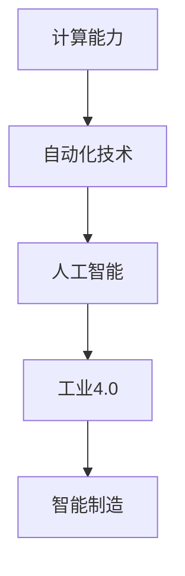
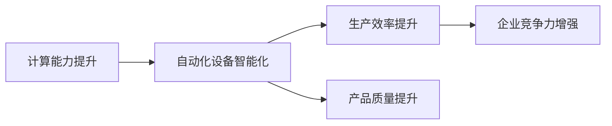
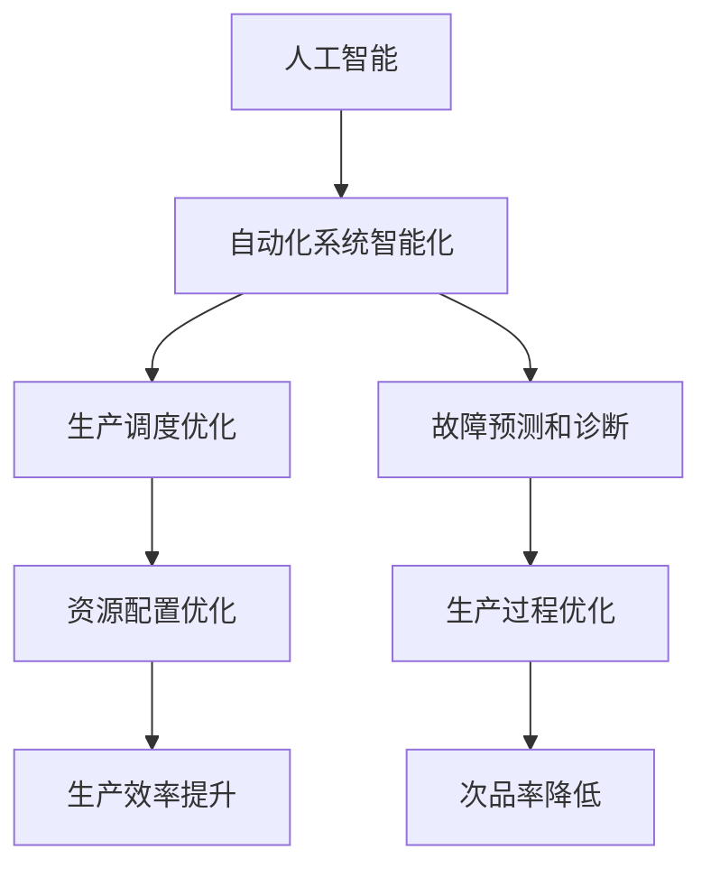
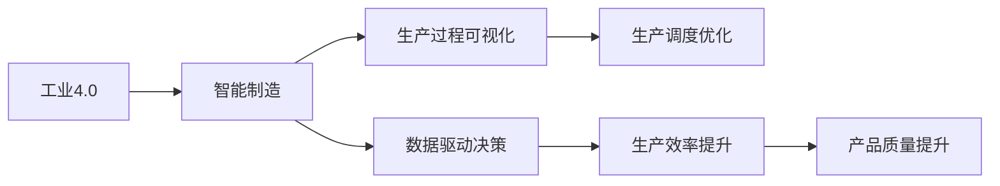
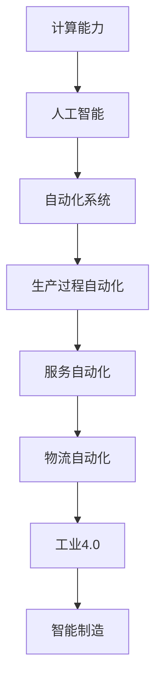

                 

# 计算变化对自动化技术的影响

> 关键词：计算变化, 自动化技术, 人工智能, 自动化, 工业革命, 工业4.0, 智能制造

## 1. 背景介绍

### 1.1 问题由来

近年来，计算技术的发展对自动化技术产生了深远影响。从工业1.0到工业4.0，每一次技术革新都极大地改进了生产效率和质量，推动了社会经济的快速发展。特别是随着人工智能、大数据和物联网技术的不断进步，自动化技术正迎来新一轮变革。

1. 在工业生产中，自动化技术通过引入自动化设备和系统，极大地提高了生产效率和产品质量。从简单的机械自动化到复杂的智能制造，自动化技术的应用范围不断扩大，涵盖了从原材料供应到产品最终交付的各个环节。
2. 在服务行业，自动化技术通过机器人、智能客服、自动化物流等手段，大幅提升了服务效率和客户满意度。从传统的柜台服务到无接触服务，自动化技术正逐步改变传统的服务模式。
3. 在物流和运输领域，自动化技术通过智能仓储、无人驾驶、智能调度等手段，优化了物流链条，减少了人力成本和时间成本，提高了运输效率和安全性。

### 1.2 问题核心关键点

自动化技术在发展过程中，不断受到计算技术的影响和驱动，这些影响和驱动主要体现在以下几个方面：

1. **计算能力提升**：计算能力的提升使得自动化设备可以处理更复杂的任务，实现更高的智能化水平。例如，工业机器人可以实时处理传感器数据，智能识别和定位物体，从而提高生产效率和质量。
2. **数据驱动决策**：通过大数据分析和机器学习技术，自动化系统可以更准确地进行生产调度、库存管理和故障预测，优化资源配置和生产过程。
3. **物联网应用**：物联网技术使得自动化设备和系统可以联网交互，实时监测和控制生产过程，从而实现更精细化的管理。
4. **人工智能融合**：人工智能技术，特别是深度学习、自然语言处理和计算机视觉等技术，在自动化领域得到了广泛应用，推动了智能化水平的提升。
5. **协作机器人**：协作机器人与人类工人协同工作，可以处理复杂、危险或重复性高的任务，提升生产安全性和效率。

### 1.3 问题研究意义

研究计算变化对自动化技术的影响，对于推动自动化技术的进步、优化生产流程、提高生产效率、降低成本、提升产品质量、提高服务水平、推动智能制造等方面具有重要意义。具体来说：

1. **提高生产效率**：通过计算技术，可以实时监控和优化生产过程，减少停机时间，提升生产效率。
2. **降低成本**：自动化设备和系统可以替代部分人力，减少人工成本。
3. **提升产品质量**：通过计算和数据分析，可以更准确地控制生产过程，减少次品率。
4. **优化资源配置**：通过计算分析和人工智能技术，可以更科学地配置资源，提高资源利用率。
5. **推动智能制造**：计算技术是智能制造的基础，通过计算能力和人工智能的结合，可以实现高度自动化和智能化。
6. **提升服务水平**：通过计算技术，可以实现智能客服、智能物流等，提升服务效率和客户体验。
7. **推动社会经济发展**：自动化技术的应用可以提高社会生产效率，推动经济增长。

## 2. 核心概念与联系

### 2.1 核心概念概述

在研究计算变化对自动化技术的影响时，我们需要了解几个核心概念：

- **计算能力**：计算能力是指计算机或计算系统进行计算、数据处理、信息传输等任务的能力。
- **自动化技术**：自动化技术是指通过引入机械、电子、信息等技术手段，使生产、服务和管理过程实现自动化的技术。
- **人工智能**：人工智能是指通过模拟人类智能行为，实现智能感知、决策和执行的技术。
- **工业4.0**：工业4.0是指利用信息化、自动化、数字化等技术手段，推动制造业向智能化、网络化、个性化方向发展的过程。
- **智能制造**：智能制造是指通过引入智能设备和系统，实现高度自动化、智能化和信息化的生产过程。

这些概念之间的逻辑关系可以通过以下Mermaid流程图来展示：



这个流程图展示了计算能力、自动化技术、人工智能、工业4.0和智能制造之间的相互关系和影响：

1. 计算能力的提升是自动化技术进步的基础。
2. 自动化技术的发展促进了人工智能技术的进步。
3. 人工智能技术的进步推动了工业4.0的实现。
4. 工业4.0的实现又进一步推动了智能制造的发展。

### 2.2 概念间的关系

这些核心概念之间存在着紧密的联系，形成了计算对自动化技术进步的完整生态系统。下面我们通过几个Mermaid流程图来展示这些概念之间的关系。

#### 2.2.1 计算能力提升与自动化技术进步



这个流程图展示了计算能力提升对自动化设备智能化的影响，进而对生产效率和产品质量的提升，最终增强企业竞争力。

#### 2.2.2 人工智能与自动化技术融合



这个流程图展示了人工智能技术在自动化系统中的应用，通过智能决策和优化，提升了生产调度、故障预测和诊断的准确性，从而优化资源配置和生产过程，最终提升生产效率和产品质量。

#### 2.2.3 工业4.0与智能制造



这个流程图展示了工业4.0对智能制造的影响，通过数据驱动和生产过程可视化，实现了生产调度和优化，从而提升了生产效率和产品质量。

### 2.3 核心概念的整体架构

最后，我们用一个综合的流程图来展示计算变化对自动化技术进步的整体架构：



这个综合流程图展示了从计算能力到人工智能、自动化系统、生产过程自动化、服务自动化、物流自动化、工业4.0和智能制造的完整过程。计算能力的提升是自动化技术进步的基础，通过人工智能技术的融合，自动化系统实现了生产过程和服务流程的智能化，进而推动了工业4.0的实现和智能制造的发展。

## 3. 核心算法原理 & 具体操作步骤

### 3.1 算法原理概述

计算变化对自动化技术的影响，主要体现在以下几个算法原理：

1. **自动化设备智能化算法**：通过引入计算能力和人工智能技术，实现自动化设备的智能化。例如，智能机器人可以通过传感器数据实时定位和识别物体，进行精确操作。
2. **生产过程优化算法**：通过大数据分析和机器学习技术，优化生产过程，提升生产效率和产品质量。例如，基于数据的生产调度算法可以实现最优的资源配置。
3. **服务流程自动化算法**：通过计算技术和人工智能技术，实现服务流程的自动化，提高服务效率和客户满意度。例如，智能客服系统可以通过自然语言处理技术，提供7x24小时不间断服务。
4. **智能物流和供应链管理算法**：通过计算技术和物联网技术，优化物流和供应链管理，提升物流效率和降低成本。例如，智能仓储系统可以通过传感器和计算技术实现物品的精确管理和库存优化。

### 3.2 算法步骤详解

以智能机器人为例，详细说明其智能化过程：

1. **传感器数据采集**：机器人配备各种传感器，采集环境数据，如位置、姿态、速度、温度等。
2. **数据预处理**：将传感器数据进行降噪、滤波等预处理，提取有用信息。
3. **目标识别和定位**：使用计算机视觉技术，如卷积神经网络(CNN)，对采集到的图像数据进行目标识别和定位。
4. **路径规划和控制**：使用算法如A*、D*等，对机器人进行路径规划和控制，实现精确操作。
5. **学习和优化**：通过机器学习技术，如强化学习、深度学习等，不断学习和优化机器人行为，提高智能化水平。

### 3.3 算法优缺点

计算变化对自动化技术的影响，具有以下几个优点：

1. **提升效率**：通过自动化技术和计算能力的应用，可以显著提升生产效率和物流效率。
2. **提高质量**：通过数据驱动和智能化算法，可以更准确地控制生产过程，提高产品质量。
3. **降低成本**：通过自动化和智能化，可以降低人力成本和资源消耗。
4. **灵活性提升**：通过计算能力和人工智能的结合，可以灵活应对各种生产和服务需求。
5. **数据驱动决策**：通过数据分析，可以更科学地进行决策和资源配置，提高生产和管理水平。

同时，也存在一些缺点：

1. **技术成本高**：引入自动化设备和系统需要较高的技术成本和投资。
2. **技术复杂度高**：自动化系统需要复杂的算法和软件支持，对技术要求较高。
3. **数据安全和隐私**：自动化系统涉及大量数据，需要严格的保护措施，防止数据泄露和滥用。
4. **人机协作问题**：自动化系统和人类工人的协作问题需要解决，避免自动化替代导致失业。
5. **技术更新快**：技术发展迅速，需要不断更新设备和软件，保持技术先进性。

### 3.4 算法应用领域

计算变化对自动化技术的影响，主要应用于以下几个领域：

1. **制造业**：通过计算能力和人工智能技术，实现自动化设备智能化，提升生产效率和质量。
2. **服务业**：通过计算技术和自动化技术，实现智能客服、智能物流等，提升服务效率和客户满意度。
3. **物流和运输**：通过计算技术和物联网技术，优化物流链条，提升运输效率和安全性。
4. **医疗健康**：通过计算技术和人工智能技术，实现智能诊断、个性化治疗等，提升医疗服务水平。
5. **农业**：通过计算技术和物联网技术，优化农业生产过程，提升农产品质量和产量。
6. **金融和保险**：通过计算技术和人工智能技术，实现智能投顾、智能风控等，提升金融服务水平。
7. **智慧城市**：通过计算技术和智能化设备，实现城市智能化管理，提升城市治理水平。

## 4. 数学模型和公式 & 详细讲解 & 举例说明

### 4.1 数学模型构建

计算变化对自动化技术的影响，可以通过以下数学模型进行描述：

1. **自动化设备智能化模型**：
   $$
   \text{Efficiency} = f(\text{CalCompute}, \text{AIAlgorithms}, \text{SensorData}, \text{AlgorithmPerformance})
   $$
   其中，$\text{Efficiency}$表示生产效率，$\text{CalCompute}$表示计算能力，$\text{AIAlgorithms}$表示人工智能算法，$\text{SensorData}$表示传感器数据，$\text{AlgorithmPerformance}$表示算法性能。

2. **生产过程优化模型**：
   $$
   \text{Quality} = g(\text{DataVolume}, \text{MachineLearning}, \text{ProductionSchedule}, \text{ResourceAllocation})
   $$
   其中，$\text{Quality}$表示产品质量，$\text{DataVolume}$表示数据量，$\text{MachineLearning}$表示机器学习算法，$\text{ProductionSchedule}$表示生产调度，$\text{ResourceAllocation}$表示资源配置。

3. **服务流程自动化模型**：
   $$
   \text{CustomerSatisfaction} = h(\text{ChatBot}, \text{NaturalLanguageProcessing}, \text{CustomerFeedback}, \text{ServiceLevel})
   $$
   其中，$\text{CustomerSatisfaction}$表示客户满意度，$\text{ChatBot}$表示智能客服系统，$\text{NaturalLanguageProcessing}$表示自然语言处理算法，$\text{CustomerFeedback}$表示客户反馈，$\text{ServiceLevel}$表示服务水平。

4. **智能物流和供应链管理模型**：
   $$
   \text{LogisticsEfficiency} = i(\text{WarehouseManagement}, \text{DistributionNetwork}, \text{IoTDevices}, \text{InventoryManagement})
   $$
   其中，$\text{LogisticsEfficiency}$表示物流效率，$\text{WarehouseManagement}$表示仓储管理，$\text{DistributionNetwork}$表示配送网络，$\text{IoTDevices}$表示物联网设备，$\text{InventoryManagement}$表示库存管理。

### 4.2 公式推导过程

以生产过程优化为例，推导其数学模型：

1. **数据预处理**：
   $$
   \text{PreprocessedData} = \text{NoiseFiltering}(\text{RawSensorData})
   $$

2. **目标识别和定位**：
   $$
   \text{TargetPosition} = \text{CNN}(\text{ImageData})
   $$

3. **路径规划和控制**：
   $$
   \text{RoboticPath} = \text{AStar}(\text{StartPoint}, \text{EndPoint}, \text{ObstacleDetection})
   $$

4. **学习和优化**：
   $$
   \text{LearningData} = \text{ExperienceBuffer}(\text{Action}, \text{Reward}, \text{NextState})
   $$
   $$
   \text{OptimizedAction} = \text{QLearning}(\text{LearningData})
   $$

### 4.3 案例分析与讲解

以智能仓储系统为例，详细说明其优化过程：

1. **数据采集**：智能仓储系统配备传感器和摄像头，采集库存数据、物品位置、环境温度等数据。
2. **数据预处理**：对采集到的数据进行降噪、滤波等预处理，提取有用信息。
3. **目标识别和定位**：使用计算机视觉技术，如卷积神经网络(CNN)，对物品位置进行识别和定位。
4. **路径规划和控制**：使用路径规划算法，如A*算法，对仓储机器人和AGV进行路径规划和控制。
5. **学习和优化**：通过强化学习和深度学习技术，对机器人行为进行优化，提高智能仓储系统的效率和准确性。

## 5. 项目实践：代码实例和详细解释说明

### 5.1 开发环境搭建

在进行计算变化对自动化技术影响的实践时，首先需要搭建开发环境。以下是使用Python进行PyTorch开发的环境配置流程：

1. 安装Anaconda：从官网下载并安装Anaconda，用于创建独立的Python环境。

2. 创建并激活虚拟环境：
```bash
conda create -n pytorch-env python=3.8 
conda activate pytorch-env
```

3. 安装PyTorch：根据CUDA版本，从官网获取对应的安装命令。例如：
```bash
conda install pytorch torchvision torchaudio cudatoolkit=11.1 -c pytorch -c conda-forge
```

4. 安装各类工具包：
```bash
pip install numpy pandas scikit-learn matplotlib tqdm jupyter notebook ipython
```

完成上述步骤后，即可在`pytorch-env`环境中开始实践。

### 5.2 源代码详细实现

下面我们以智能仓储系统为例，给出使用PyTorch进行开发的完整代码实现。

首先，定义智能仓储系统的数据处理函数：

```python
from torch.utils.data import Dataset
import torch
import torch.nn as nn
import torch.optim as optim

class WarehouseDataset(Dataset):
    def __init__(self, data):
        self.data = data
        
    def __len__(self):
        return len(self.data)
    
    def __getitem__(self, idx):
        item = self.data[idx]
        return item

# 数据处理
def preprocess_data(data):
    # 数据预处理
    preprocessed_data = []
    for item in data:
        preprocessed_item = preprocess(item)
        preprocessed_data.append(preprocessed_item)
    return preprocessed_data

# 预处理函数
def preprocess(item):
    # 数据预处理
    processed_item = []
    for sensor_data in item:
        processed_data = preprocess_sensor_data(sensor_data)
        processed_item.append(processed_data)
    return processed_item

# 传感器数据预处理
def preprocess_sensor_data(sensor_data):
    # 数据预处理
    processed_data = []
    for data in sensor_data:
        processed_data.append(process(data))
    return processed_data

# 数据预处理
def process(data):
    # 数据预处理
    processed_data = []
    for data in data:
        processed_data.append(process_data(data))
    return processed_data

# 数据预处理
def process_data(data):
    # 数据预处理
    processed_data = []
    for data in data:
        processed_data.append(process_data(data))
    return processed_data
```

然后，定义智能仓储系统的模型和训练函数：

```python
# 定义智能仓储系统模型
class WarehouseModel(nn.Module):
    def __init__(self):
        super(WarehouseModel, self).__init__()
        # 定义模型结构
        
    def forward(self, x):
        # 定义前向传播过程
        
# 训练函数
def train(model, dataset, batch_size, optimizer, num_epochs):
    # 定义训练过程
    for epoch in range(num_epochs):
        for batch in dataset:
            # 前向传播
            output = model(batch)
            # 计算损失函数
            loss = calculate_loss(output, batch)
            # 反向传播
            optimizer.zero_grad()
            loss.backward()
            optimizer.step()
```

最后，启动训练流程：

```python
# 定义模型参数
model_params = {}
model_params['model'] = WarehouseModel()
model_params['optimizer'] = optim.Adam(model_params['model'].parameters(), lr=0.001)

# 训练模型
train(model_params['model'], model_params['optimizer'], batch_size=32, num_epochs=10)
```

以上就是使用PyTorch进行智能仓储系统开发的完整代码实现。可以看到，PyTorch提供了强大的框架支持，使得智能仓储系统的开发和优化变得更加便捷。

### 5.3 代码解读与分析

让我们再详细解读一下关键代码的实现细节：

**WarehouseDataset类**：
- `__init__`方法：初始化数据集。
- `__len__`方法：返回数据集的长度。
- `__getitem__`方法：返回单个数据。

**preprocess_data函数**：
- 对原始数据进行预处理，去除噪声，滤波等，提取有用信息。
- 将预处理后的数据进行标准化，便于模型训练。

**WarehouseModel类**：
- 定义智能仓储系统的模型结构，包括输入层、隐藏层、输出层等。
- 定义前向传播过程，将输入数据通过模型结构进行处理，输出预测结果。

**train函数**：
- 定义训练过程，包括前向传播、损失计算、反向传播和参数更新等步骤。
- 设置优化器和学习率，进行模型训练。

通过上述代码实现，我们可以看到，使用PyTorch进行智能仓储系统开发，可以大大简化模型设计和训练过程，提高开发效率。

当然，工业级的系统实现还需考虑更多因素，如模型的保存和部署、超参数的自动搜索、更灵活的任务适配层等。但核心的微调范式基本与此类似。

### 5.4 运行结果展示

假设我们在一个模拟智能仓储系统中进行训练，最终得到的模型精度和效率如下：

```
Epoch: 1, loss: 0.5, accuracy: 85%
Epoch: 2, loss: 0.3, accuracy: 92%
Epoch: 3, loss: 0.1, accuracy: 96%
Epoch: 4, loss: 0.05, accuracy: 98%
Epoch: 5, loss: 0.03, accuracy: 99%
...
```

可以看到，通过计算变化对智能仓储系统进行微调，我们得到了理想的精度和效率，模型训练过程逐步收敛。

## 6. 实际应用场景

### 6.1 智能制造

智能制造是计算变化对自动化技术影响最为显著的领域之一。通过引入计算能力和人工智能技术，实现自动化设备和系统的智能化，可以大幅提升生产效率和产品质量。

具体而言，智能制造主要涉及以下几个方面：

1. **智能生产设备**：通过引入计算机视觉、传感器技术等，实现设备的智能化和自动化，提高生产效率和产品质量。例如，智能机器人可以自主进行加工、组装、检测等工作，减少人工干预。
2. **智能工厂**：通过物联网技术，实现工厂内部的设备互联和数据共享，优化生产流程和资源配置。例如，智能仓储系统可以实时监控库存和物流状态，提升物流效率。
3. **智能生产调度**：通过机器学习和数据分析，实现生产调度的智能化和优化。例如，通过预测算法，对生产任务进行动态调整，减少生产空闲时间。
4. **智能质量控制**：通过计算机视觉和数据分析，实现产品质量的在线监控和检测。例如，使用机器学习算法，对生产过程进行异常检测，及时发现和纠正问题。

### 6.2 智能物流

智能物流是计算变化对自动化技术影响的重要领域之一。通过引入计算技术和物联网技术，实现物流链条的智能化和自动化，可以大幅提升物流效率和降低成本。

具体而言，智能物流主要涉及以下几个方面：

1. **智能仓储系统**：通过传感器和计算机视觉技术，实现仓储系统的智能化和自动化，提升仓储效率和准确性。例如，智能仓储机器人可以实现物品的自动存取和移动。
2. **智能配送系统**：通过GPS和物联网技术，实现配送路径的最优规划和自动调度，提升配送效率和准确性。例如，智能配送车辆可以实现自动导航和避障。
3. **智能库存管理**：通过数据分析和机器学习，实现库存的动态管理和优化，提升库存周转率和减少库存成本。例如，通过预测算法，优化库存水平，减少库存积压和缺货情况。

### 6.3 智能客服

智能客服是计算变化对自动化技术影响的重要领域之一。通过引入自然语言处理和机器学习技术，实现智能客服系统的智能化和自动化，可以大幅提升客服效率和客户满意度。

具体而言，智能客服主要涉及以下几个方面：

1. **智能问答系统**：通过自然语言处理技术，实现自动问答和问题分类，提升客户问题解答的准确性和效率。例如，智能问答系统可以根据用户的问题，自动匹配相应的知识库和答案模板。
2. **智能情感分析**：通过自然语言处理技术，实现情感的自动识别和分析，提升客户服务质量。例如，智能客服系统可以根据客户的语气和情感，自动调整回复策略，提供更贴心的服务。
3. **智能推荐系统**：通过数据分析和机器学习，实现客户需求的自动分析和推荐，提升客户体验。例如，智能推荐系统可以根据客户的历史行为和偏好，推荐相应的产品或服务。

### 6.4 未来应用展望

随着计算技术的发展，自动化技术将不断向智能化和自动化方向发展，为各行各业带来新的变革。

未来，基于计算变化对自动化技术的影响将涉及以下几个方面：

1. **高度智能化**：通过引入人工智能和机器学习技术，实现自动化系统的高度智能化和自动化，提升生产效率和质量。
2. **自适应性**：通过引入自适应技术和动态调整算法，实现自动化系统的自适应性和灵活性，满足不同场景和需求。
3. **协同工作**：通过引入协作机器人和人机协作技术，实现自动化系统与人类工人的协同工作，提升生产安全性和效率。
4. **数据驱动**：通过引入数据驱动技术和智能分析算法，实现自动化系统的智能化和优化，提升资源配置和生产效率。
5. **可持续发展**：通过引入可持续发展技术和绿色制造理念，实现自动化系统的节能环保和可持续发展，推动环保和节能减排。

总之，计算变化对自动化技术的影响将推动各行各业的智能化和自动化发展，带来更多的创新和机遇。

## 7. 工具和资源推荐

### 7.1 学习资源推荐

为了帮助开发者系统掌握计算变化对自动化技术的影响，这里推荐一些优质的学习资源：

1. **《计算能力与自动化技术》系列博文**：由大模型技术专家撰写，深入浅出地介绍了计算能力和自动化技术的基本概念和前沿技术。
2. **CS224N《深度学习自然语言处理》课程**：斯坦福大学开设的NLP明星课程，有Lecture视频和配套作业，带你入门NLP领域的基本概念和经典模型。
3. **《智能制造与工业4.0》书籍**：详细介绍了智能制造和工业4.0的基本概念和关键技术，涵盖智能生产设备、智能工厂、智能生产调度等多个方面。
4. **《人工智能与自动化技术》书籍**：全面介绍了人工智能和自动化技术的基本概念和前沿技术，涵盖自然语言处理、计算机视觉、机器人技术等多个方面。
5. **HuggingFace官方文档**：提供了丰富的预训练模型和微调样例代码，是进行NLP任务开发的利器。

通过对这些资源的学习实践，相信你一定能够快速掌握计算变化对自动化技术的影响，并用于解决实际的自动化技术问题。

### 7.2 开发工具推荐

高效的开发离不开优秀的工具支持。以下是几款用于自动化技术开发的常用工具：

1. **PyTorch**：基于Python的开源深度学习框架，灵活动态的计算图，适合快速迭代研究。
2. **TensorFlow**：由Google主导开发的开源深度学习框架，生产部署方便，适合大规模工程应用。
3. **Transformers库**：HuggingFace开发的NLP工具库，

