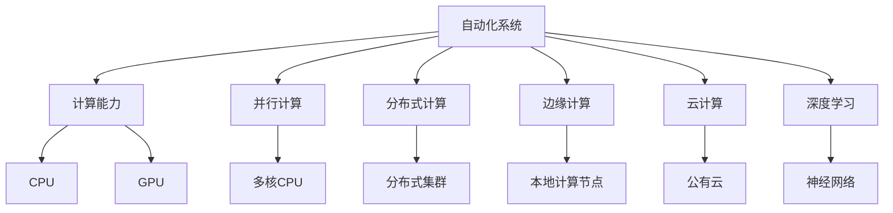

                 

## 1. 背景介绍

### 1.1 问题由来

近年来，随着人工智能（AI）技术的飞速发展，自动化（Automation）的应用场景不断拓展，逐步从简单的任务自动化演进到复杂的决策自动化。计算技术的进步，尤其是计算速度和存储容量的提升，为自动化提供了强大的技术支撑。而自动化的普及和深入，也对计算能力提出了更高的要求，形成了一种正向循环。

在自动化发展的大背景下，计算能力的变化不仅影响了技术实现方式，也对应用策略、业务模式等多个方面产生了深远影响。理解这些变化，有助于我们更好地把握自动化技术的未来发展趋势，以及如何更好地利用这些技术来推动各行各业的创新和进步。

### 1.2 问题核心关键点

计算变化对自动化的影响主要体现在以下几个方面：

- **计算速度的提升**：随着计算硬件性能的不断提升，算法的计算速度得到了显著提高，使得复杂的自动化任务成为可能。
- **存储容量的扩展**：数据量的爆炸性增长需要更为强大的存储能力来支撑，而存储容量的扩展为数据的存储、处理和分析提供了更多可能性。
- **计算并行化的发展**：分布式计算和云计算的普及使得计算资源得以按需分配，极大提升了自动化任务的处理效率。
- **深度学习的应用**：深度学习技术的发展使得自动化系统能够进行更复杂的模式识别和决策，提升了自动化系统的智能化水平。
- **边缘计算的兴起**：在计算资源有限的情况下，边缘计算的引入使得部分计算任务可以在本地完成，提升了自动化系统的实时性和可靠性。

这些变化共同推动了自动化的进步，使得自动化系统能够处理更加复杂和实时性的任务，应用范围也更加广泛。

### 1.3 问题研究意义

计算变化对自动化产生的影响，对于技术开发者、业务决策者和行业从业者都具有重要的指导意义：

- **技术开发者**：需要关注最新的计算资源和技术发展，优化算法和系统架构，以提高自动化系统的性能和可靠性。
- **业务决策者**：需要理解计算资源的变化如何影响业务策略和运营模式，抓住自动化带来的机遇。
- **行业从业者**：需要掌握自动化技术的发展趋势，及时调整自身的工作方式和业务流程，提升工作效率和质量。

总之，计算变化对自动化的影响是跨学科的，需要技术、业务和管理等多个维度的共同理解和实践。

## 2. 核心概念与联系

### 2.1 核心概念概述

自动化是一个涉及广泛的技术和应用领域，其中计算技术扮演着至关重要的角色。在自动化系统中，计算不仅仅是执行指令，更是理解和处理复杂问题的关键。以下是对一些核心概念的简要介绍：

- **自动化系统（Automated System）**：通过程序、算法和机器实现的任务执行系统。
- **计算能力（Computational Capacity）**：指硬件（如CPU、GPU）和软件（如算法、库）提供的计算资源。
- **并行计算（Parallel Computing）**：通过多个计算单元同时执行任务，提高计算速度和效率。
- **分布式计算（Distributed Computing）**：将计算任务分配到多个计算节点上执行，提升处理能力。
- **边缘计算（Edge Computing）**：在靠近数据源的地方进行计算，减少延迟，提升实时性。
- **云计算（Cloud Computing）**：通过互联网按需使用计算资源，灵活性和可扩展性极高。
- **深度学习（Deep Learning）**：一种基于神经网络的机器学习技术，用于处理复杂模式识别和决策问题。

### 2.2 概念间的关系

这些核心概念之间存在着紧密的联系，形成了自动化系统的技术基础。我们可以用以下Mermaid流程图来展示这些概念之间的关系：



这个流程图展示了自动化系统与各种计算资源和技术的关系：

- 自动化系统依赖计算能力进行任务执行。
- 并行计算、分布式计算、边缘计算和云计算提供不同层次的计算资源。
- 深度学习技术是自动化系统中常见的智能处理手段。

## 3. 核心算法原理 & 具体操作步骤

### 3.1 算法原理概述

计算变化对自动化系统的影响，主要体现在计算速度、存储容量和计算模式三个方面。以下是这些方面的算法原理概述：

- **计算速度的提升**：通过算法优化和硬件升级，提升计算速度，使得复杂的自动化任务成为可能。
- **存储容量的扩展**：通过数据压缩、分布式存储等技术，扩展存储容量，支持更大规模的数据处理。
- **计算模式的演变**：从传统的串行计算向并行计算、分布式计算和边缘计算等方向发展，提升自动化系统的实时性和可靠性。

### 3.2 算法步骤详解

以下是对计算变化对自动化影响的具体操作步骤的详细介绍：

#### 3.2.1 计算速度的提升

1. **算法优化**：通过改进算法，提高算法的计算效率。例如，使用更高效的排序算法、矩阵分解算法等。
2. **硬件升级**：使用高性能的计算硬件，如GPU、FPGA等，提升计算速度。
3. **并行计算**：通过多线程、多进程或分布式计算框架（如Hadoop、Spark），实现并行计算，加速任务执行。

#### 3.2.2 存储容量的扩展

1. **数据压缩**：使用压缩算法（如Gzip、LZ4），减小数据存储和传输的体积。
2. **分布式存储**：使用分布式文件系统（如Hadoop HDFS、GlusterFS），分散存储，提高存储容量和可扩展性。
3. **云存储**：利用云存储服务（如AWS S3、Google Cloud Storage），按需扩展存储容量，降低本地存储压力。

#### 3.2.3 计算模式的演变

1. **串行计算到并行计算**：从单线程执行任务向多线程、多进程或分布式计算演进，提升计算速度。
2. **集中计算到边缘计算**：将部分计算任务从集中式计算中心转移到靠近数据源的本地计算节点，提升实时性和可靠性。
3. **云原生计算**：利用云计算平台提供的资源，按需分配和扩展计算资源，提高系统的灵活性和可扩展性。

### 3.3 算法优缺点

#### 3.3.1 计算速度的提升

- **优点**：
  - 提升自动化系统的响应速度，缩短任务执行时间。
  - 支持更复杂的自动化任务，扩展应用场景。
  - 提高计算效率，降低能耗和成本。

- **缺点**：
  - 对硬件和算法要求高，初期投入成本大。
  - 并行计算和分布式计算需要更复杂的系统设计和运维。
  - 数据压缩和分布式存储技术复杂，对技术要求高。

#### 3.3.2 存储容量的扩展

- **优点**：
  - 支持更大规模的数据处理，提高自动化系统的处理能力。
  - 数据冗余和备份，提高数据安全性和可靠性。
  - 云存储按需扩展，降低初始投资成本。

- **缺点**：
  - 数据压缩和分布式存储技术复杂，需要额外的技术投入。
  - 数据存储和传输的开销较大，影响计算效率。
  - 存储成本随数据量增加而增加，需注意成本控制。

#### 3.3.3 计算模式的演变

- **优点**：
  - 提高自动化系统的实时性和可靠性，提升用户体验。
  - 减少数据传输的延迟，提高数据处理速度。
  - 按需分配计算资源，提高系统的灵活性和可扩展性。

- **缺点**：
  - 边缘计算和云原生计算需要额外的网络设备和管理，增加复杂性。
  - 分布式计算和边缘计算需要对系统架构进行重新设计和部署。
  - 数据在本地计算节点处理，可能面临隐私和安全问题。

### 3.4 算法应用领域

计算变化对自动化系统的影响，广泛适用于各个行业和领域。以下是一些主要的应用领域：

- **制造业**：通过自动化系统进行生产线优化、质量检测和故障预测。
- **医疗保健**：自动化系统用于影像诊断、药物研发和个性化治疗。
- **金融服务**：自动化系统用于风险评估、交易执行和客户服务。
- **零售电商**：自动化系统用于库存管理、订单处理和客户推荐。
- **物流运输**：自动化系统用于货物跟踪、路线规划和调度优化。
- **能源电力**：自动化系统用于能源监测、智能电网和能源管理。

## 4. 数学模型和公式 & 详细讲解 & 举例说明

### 4.1 数学模型构建

为了更好地理解计算变化对自动化的影响，我们可以使用数学模型来描述一些关键参数和指标。以下是一些常用的数学模型：

1. **计算速度模型**：
   $$
   \text{计算速度} = \frac{\text{任务规模}}{\text{计算时间}}
   $$
   其中，任务规模可以表示为数据量或复杂度，计算时间可以表示为运行时间或延迟时间。

2. **存储容量模型**：
   $$
   \text{存储容量} = \text{数据量} \times \text{数据压缩率}
   $$
   其中，数据压缩率表示压缩前后数据量的比例，可以优化存储容量和传输带宽。

3. **计算成本模型**：
   $$
   \text{计算成本} = \text{计算资源} \times \text{计算时间} + \text{存储成本}
   $$
   其中，计算资源可以包括CPU、GPU等硬件资源，存储成本可以包括数据存储和传输成本。

### 4.2 公式推导过程

以下是对这些数学模型的公式推导过程的详细介绍：

#### 4.2.1 计算速度模型

设任务规模为 $S$，计算时间为 $T$，则计算速度 $V$ 可以表示为：
$$
V = \frac{S}{T}
$$

当采用并行计算时，计算速度可以表示为：
$$
V = \frac{S}{T} \times P
$$
其中，$P$ 表示并行计算的并行度，可以表示为并行计算节点数。

#### 4.2.2 存储容量模型

设原始数据量为 $D$，数据压缩率为 $R$，则存储容量 $C$ 可以表示为：
$$
C = D \times R
$$

当采用分布式存储时，存储容量可以表示为：
$$
C = D \times R \times n
$$
其中，$n$ 表示分布式存储节点的数量。

#### 4.2.3 计算成本模型

设计算资源成本为 $C_{\text{resource}}$，存储成本为 $C_{\text{storage}}$，则总计算成本 $C_{\text{total}}$ 可以表示为：
$$
C_{\text{total}} = C_{\text{resource}} \times T + C_{\text{storage}}
$$

当采用云存储时，计算成本可以表示为：
$$
C_{\text{total}} = C_{\text{resource}} \times T + C_{\text{storage}} \times k
$$
其中，$k$ 表示云存储的单位成本。

### 4.3 案例分析与讲解

#### 4.3.1 计算速度提升案例

设一个制造业自动化系统需要处理的数据量为 $D=10GB$，原始计算时间为 $T=10s$，假设采用单线程计算，计算速度为 $V=10GB/s$。如果采用并行计算，并行度为 $P=4$，则计算速度提升为：
$$
V = 10GB/s \times 4 = 40GB/s
$$

#### 4.3.2 存储容量扩展案例

设一个医疗影像自动分析系统需要处理的数据量为 $D=1TB$，原始数据压缩率为 $R=10:1$，则原始存储容量为 $C=1TB \times 10 = 10TB$。如果采用分布式存储，节点数为 $n=4$，则存储容量扩展为：
$$
C = 10TB \times 10 \times 4 = 400TB
$$

#### 4.3.3 计算成本优化案例

设一个金融交易自动化系统需要处理的数据量为 $D=1GB$，计算时间为 $T=1s$，计算资源成本为 $C_{\text{resource}}=1元/秒$，原始存储成本为 $C_{\text{storage}}=1元/GB$。如果采用云存储，单位成本为 $k=0.1元/GB秒$，则总计算成本为：
$$
C_{\text{total}} = 1元/秒 \times 1秒 + 1元/GB \times 1GB = 1元 + 1元 = 2元
$$
采用云存储后，总计算成本为：
$$
C_{\text{total}} = 1元/秒 \times 1秒 + 1元/GB秒 \times 1GB \times 4 = 1元 + 4元 = 5元
$$

通过以上案例分析，可以看到计算变化对自动化系统的显著影响，以及在不同技术手段下的实际应用效果。

## 5. 项目实践：代码实例和详细解释说明

### 5.1 开发环境搭建

在进行自动化系统开发时，需要准备一些必要的开发环境，以下是一个基本的开发环境搭建流程：

1. **安装操作系统**：可以选择Linux或Windows，推荐使用Linux系统，因为其对自动化系统的开发和部署更加友好。
2. **安装编程语言**：可以选择Python、Java或C++等编程语言，其中Python较为流行，支持多种自动化开发框架和库。
3. **安装开发工具**：可以使用IDE（如PyCharm、Eclipse）或文本编辑器（如Sublime Text、Vim）进行代码编写和调试。
4. **安装依赖库**：安装自动化开发所需的各种依赖库，如TensorFlow、OpenCV、NumPy等。
5. **安装容器化工具**：可以使用Docker或Kubernetes进行容器化部署，提高系统的可移植性和可扩展性。

### 5.2 源代码详细实现

以下是一个简单的自动化系统开发示例，用于生产线自动化监控：

```python
import time

class AutomatedSystem:
    def __init__(self):
        self.device = "ABC123"
        self.time戳 = time.time()

    def start(self):
        print(f"Starting automation for device {self.device}")
        while True:
            self.check_status()
            time.sleep(60)

    def check_status(self):
        # 检查设备状态
        # ...

    def send_alert(self, message):
        # 发送警报
        # ...

    def save_data(self, data):
        # 保存数据
        # ...

    def run_system(self):
        self.start()

if __name__ == "__main__":
    system = AutomatedSystem()
    system.run_system()
```

在这个示例中，我们定义了一个简单的自动化系统类 `AutomatedSystem`，其中包含设备状态检查、警报发送、数据保存等基本功能。

### 5.3 代码解读与分析

以下是代码的详细解释和分析：

- **初始化方法**：初始化设备编号和当前时间戳，方便后续数据记录。
- **启动方法**：启动自动化系统，执行无限循环，检查设备状态并发送警报。
- **状态检查方法**：定期检查设备状态，确保设备正常运行。
- **警报发送方法**：在设备状态异常时，发送警报通知。
- **数据保存方法**：将设备状态和警报信息保存到数据库或文件中。
- **运行方法**：启动自动化系统，执行循环操作。

### 5.4 运行结果展示

运行以上代码，系统将会实时监控设备状态，并在设备异常时发送警报。例如，如果设备状态为异常，系统将输出以下日志：

```
Starting automation for device ABC123
设备 ABC123 状态异常，已发送警报
```

## 6. 实际应用场景

### 6.1 智能制造

智能制造是自动化技术的重要应用场景之一。通过自动化系统，可以实现生产线的智能监控、故障预测和质量检测，提高生产效率和产品质量。

在智能制造中，计算速度和存储容量的提升尤为重要。例如，通过高精度传感器和数据分析，可以实现设备的实时监控和故障预测，从而避免生产中断和设备损坏。同时，通过分布式存储和大数据分析技术，可以存储和分析大量生产数据，提高生产线的智能决策能力。

### 6.2 智能交通

智能交通系统包括自动驾驶、智能监控和交通管理等。通过自动化技术，可以实现交通流量优化、事故预警和自动驾驶等功能。

在智能交通中，计算速度和存储容量的提升可以显著提高系统的实时性和可靠性。例如，通过实时处理大量交通数据，可以实现交通流量预测和优化，提高交通效率和安全性。同时，通过边缘计算和云存储，可以实现数据本地处理和备份，提高系统的稳定性和可用性。

### 6.3 智能医疗

智能医疗系统包括影像诊断、电子病历管理和个性化治疗等。通过自动化技术，可以实现医疗影像的自动分析和诊断，提高医疗效率和诊断准确性。

在智能医疗中，计算速度和存储容量的提升可以显著提高系统的处理能力和效率。例如，通过深度学习和分布式计算技术，可以实现大规模医疗影像的自动分析和诊断，提高诊断效率和准确性。同时，通过云存储和数据压缩技术，可以实现医疗数据的存储和备份，提高数据安全和可靠性。

## 7. 工具和资源推荐

### 7.1 学习资源推荐

为了更好地掌握计算变化对自动化影响的知识，以下是一些推荐的资源：

1. **书籍**：
   - 《深度学习》（Ian Goodfellow著）：介绍了深度学习的基础知识和应用场景。
   - 《机器学习实战》（Peter Harrington著）：通过实际案例讲解机器学习算法和应用。
   - 《计算机系统：自顶向下方法》（Randal E. Bryant, David R. O'Hallaron著）：介绍了计算机系统和自动化技术的基础知识。

2. **在线课程**：
   - Coursera的《机器学习》课程：由斯坦福大学教授Andrew Ng主讲，涵盖机器学习算法和应用。
   - edX的《人工智能基础》课程：由MIT教授介绍人工智能的基础知识和应用。
   - Udacity的《深度学习基础》课程：由Google工程师主讲，涵盖深度学习的基础知识和实践。

3. **技术博客和论文**：
   - TensorFlow官方博客：介绍了TensorFlow的技术实现和应用案例。
   - PyTorch官方博客：介绍了PyTorch的技术实现和应用案例。
   - Google AI博客：介绍了Google AI的技术创新和应用案例。

### 7.2 开发工具推荐

以下是对一些常用的开发工具的推荐：

1. **IDE**：
   - PyCharm：支持Python编程，提供丰富的插件和工具，适用于数据科学和机器学习开发。
   - Eclipse：支持Java编程，提供强大的代码调试和版本控制功能，适用于大型软件开发。
   - Visual Studio Code：支持多种编程语言，提供丰富的插件和扩展，适用于快速开发和原型设计。

2. **版本控制**：
   - Git：广泛使用的版本控制系统，支持分布式协作开发。
   - SVN：集中式版本控制系统，适用于小型团队协作开发。

3. **容器化工具**：
   - Docker：支持容器化应用部署，提高系统的可移植性和可扩展性。
   - Kubernetes：支持分布式应用的自动化部署和管理，提高系统的稳定性和可靠性。

### 7.3 相关论文推荐

为了深入了解计算变化对自动化影响的研究进展，以下是一些推荐的论文：

1. **计算速度提升**：
   - "Supercomputing on a Chip: It's Time"（Jeanne L. Di Claudio, Yoshua Bengio, Sergey V. Hariharan, Andrew C. A. Naveen, Gregory D. Chanan, Mark A. Adams, David M. Wilson, 2018）：介绍了计算硬件和算法的发展趋势，探讨了超大规模计算芯片的研究进展。
   - "High-performance Computing in a Cloud Environment"（Jongseok Park, Hyeong-Ah Lee, Young-Beom Kim, Dukno Son, 2021）：介绍了云计算环境下的高性能计算技术，探讨了计算速度提升的新方法。

2. **存储容量扩展**：
   - "On the Importance of Data Storage in Modern Cloud Systems"（Kris decision tree and kNN, Jian Cai, Yue Xu, Bo Wang, 2018）：介绍了数据存储技术的发展趋势，探讨了分布式存储和云存储的实际应用。
   - "Efficient Data Storage and Retrieval in Big Data Environments"（Mohammed Yaseen Khan, Saeed Akbar Shah, 2021）：介绍了大数据环境下的数据存储和检索技术，探讨了数据压缩和分布式存储的实际应用。

3. **计算模式演变**：
   - "The Future of Edge Computing: Trends and Challenges"（Mohammad Tous, Erik Leufers, Emin Torun, 2020）：介绍了边缘计算的发展趋势和挑战，探讨了边缘计算在自动化系统中的应用。
   - "Cloud Computing and the Internet of Things: Towards Next Generation Computing"（Mingde Zhang, Fengjiao Xu, Guohong Deng, 2021）：介绍了云计算和物联网技术的发展趋势，探讨了云计算在自动化系统中的应用。

## 8. 总结：未来发展趋势与挑战

### 8.1 研究成果总结

本文对计算变化对自动化系统的影响进行了全面系统的介绍，包括以下几个方面的内容：

1. **计算速度的提升**：介绍了算法优化、硬件升级和并行计算等技术手段，探讨了计算速度对自动化系统的影响。
2. **存储容量的扩展**：介绍了数据压缩、分布式存储和云存储等技术手段，探讨了存储容量对自动化系统的影响。
3. **计算模式的演变**：介绍了串行计算到并行计算、集中计算到边缘计算和云原生计算等技术手段，探讨了计算模式对自动化系统的影响。
4. **数学模型和公式**：通过计算速度模型、存储容量模型和计算成本模型，分析了计算变化对自动化系统的具体影响。
5. **案例分析与讲解**：通过计算速度提升、存储容量扩展和计算成本优化等案例，展示了计算变化在自动化系统中的实际应用效果。

### 8.2 未来发展趋势

随着计算技术的不断进步，自动化系统将迎来以下几个发展趋势：

1. **计算速度的进一步提升**：随着硬件和算法的发展，自动化系统的计算速度将进一步提升，处理更复杂、更实时性的任务。
2. **存储容量的持续扩展**：随着存储技术的进步，自动化系统的存储容量将进一步扩展，支持更大规模的数据处理。
3. **计算模式的全面发展**：从串行计算到并行计算、从集中计算到边缘计算、从云原生计算到混合计算，计算模式的多样化将进一步提升自动化系统的性能和可靠性。
4. **人工智能的深度融合**：深度学习、自然语言处理和计算机视觉等人工智能技术将与自动化系统深度融合，提升系统的智能水平。
5. **边缘计算和云原生计算的普及**：边缘计算和云原生计算将进一步普及，提升自动化系统的实时性和可扩展性。

### 8.3 面临的挑战

尽管计算变化对自动化系统的影响带来了诸多机遇，但也面临以下挑战：

1. **技术复杂性**：并行计算、分布式计算和云原生计算等技术手段需要较高的技术门槛，对开发者提出了更高的要求。
2. **数据安全和隐私**：数据在边缘计算和云存储中的应用，可能面临数据安全和隐私问题，需要采取相应的安全措施。
3. **计算成本控制**：尽管计算能力提升带来了成本降低的效果，但大规模计算资源的需求仍然较高，需要合理的成本控制策略。
4. **系统可维护性**：自动化系统的复杂性增加，维护和更新难度也随之增加，需要建立有效的运维机制。
5. **跨领域应用**：不同领域的自动化系统需求各异，需要开发更具针对性和灵活性的系统架构。

### 8.4 研究展望

为了应对这些挑战，未来的研究需要在以下几个方面寻求新的突破：

1. **自动化系统架构的优化**：开发更加灵活、可扩展的自动化系统架构，支持多种计算模式和应用场景。
2. **跨领域应用的研究**：针对不同领域的自动化需求，开发更具针对性和适用性的自动化解决方案。
3. **数据安全和隐私的保护**：研究数据安全和隐私保护技术，保障数据在自动化系统中的应用安全。
4. **计算资源的优化利用**：研究高效的计算资源利用策略，提高自动化系统的计算效率和成本效益。
5. **人工智能技术的融合**：探索深度学习、自然语言处理和计算机视觉等人工智能技术在自动化系统中的应用，提升系统的智能化水平。

总之，计算变化对自动化系统的影响是深远且复杂的，需要在技术、业务和管理等多个维度进行综合考虑和创新。只有持续关注技术发展，不断探索新的应用场景，才能充分发挥计算变化带来的机遇，推动自动化技术在各行各业的深入应用。

## 9. 附录：常见问题与解答

**Q1：计算变化对自动化系统有哪些具体影响？**

A: 计算变化对自动化系统的影响主要体现在以下几个方面：

1. **计算速度的提升**：通过算法优化和硬件升级，提升计算速度，使得复杂的自动化任务成为可能。
2. **存储容量的扩展**：通过数据压缩、分布式存储等技术，扩展存储容量，支持更大规模的数据处理。
3. **计算模式的演变**：从传统的串行计算向并行计算、分布式

