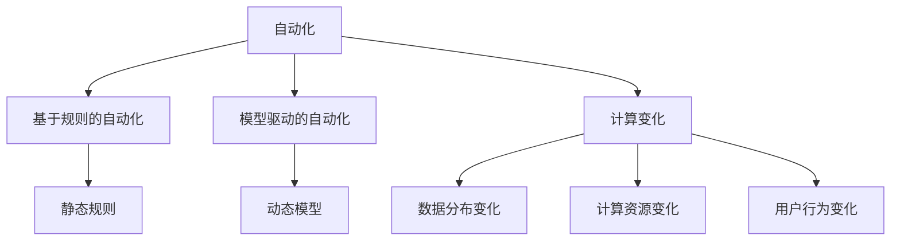
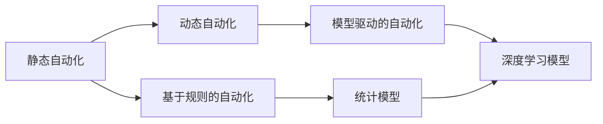
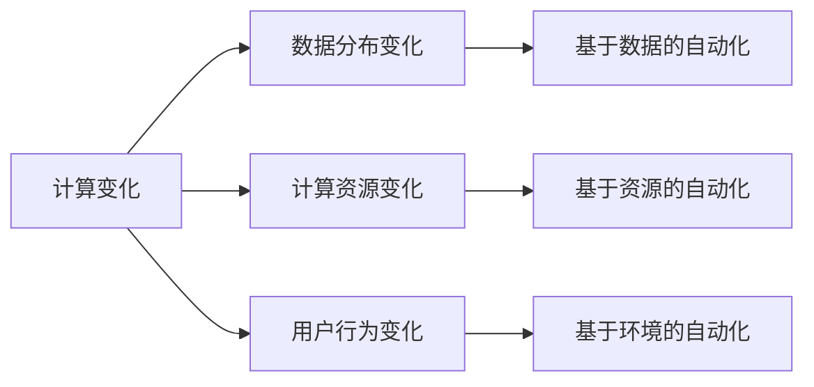
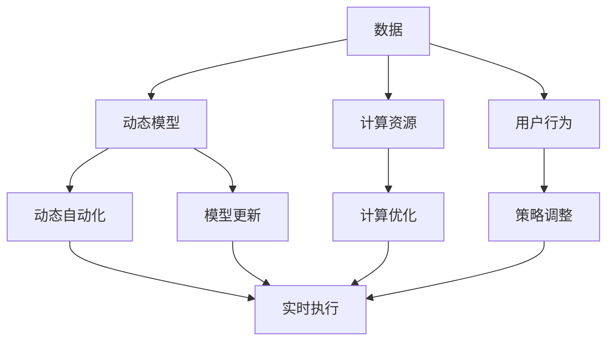

                 

## 1. 背景介绍

### 1.1 问题由来

随着全球经济与技术的快速发展，自动化已经成为了各行各业提升效率、降低成本的关键手段。从制造业的机器人流水线，到金融业的自动化交易，再到医疗业的智能诊断，自动化技术的应用无所不在。然而，这些自动化系统往往是基于静态的规则和数据模型构建的，难以应对不断变化的环境和需求。

### 1.2 问题核心关键点

为了应对计算环境的变化，自动化技术正在发生重大的转型：从基于规则的静态自动化向基于数据和模型的动态自动化转变。这一转变不仅要求技术上的突破，也需要理论上的创新。本文将深入探讨这一转变的核心概念，并介绍几种关键技术，以期为计算变化对自动化的推动作用提供全面的技术解析和实践指导。

### 1.3 问题研究意义

研究计算变化对自动化的推动作用，对于理解自动化技术的未来发展方向，提升自动化系统的智能化水平，加速各行业的数字化转型进程，具有重要意义：

1. 提升系统适应性。动态自动化系统能够更好地适应复杂多变的计算环境，确保在不断变化的数据下持续高效运行。
2. 降低维护成本。基于数据的自动化模型更新更加灵活，减少了对人工维护的依赖。
3. 拓展应用边界。动态自动化技术能够应用于更多领域，推动各行业自动化技术的深入发展。
4. 促进技术创新。研究计算变化对自动化的推动作用，将促进人工智能、机器学习等前沿技术的普及与应用。
5. 增强用户体验。动态自动化能够根据用户行为和环境变化实时调整策略，提升用户体验。

## 2. 核心概念与联系

### 2.1 核心概念概述

为更好地理解计算变化对自动化的推动作用，本节将介绍几个密切相关的核心概念：

- 自动化：使用计算机技术和算法来执行复杂任务，以提高效率和降低成本的过程。
- 动态自动化：通过数据驱动的方法，不断学习并适应用户行为、环境变化等动态因素，自动调整策略和行为。
- 基于规则的自动化：根据预设的规则和流程来执行任务，不涉及机器学习等复杂算法。
- 模型驱动的自动化：利用统计模型、机器学习模型等动态模型来执行任务，模型能够根据新数据进行学习和优化。
- 计算变化：指计算环境中各种因素（如数据分布、计算资源、用户行为等）的变化。

这些核心概念之间的逻辑关系可以通过以下Mermaid流程图来展示：



这个流程图展示了大自动化技术的两种基本范式（基于规则与模型驱动）以及计算变化对这两种范式的推动作用。

### 2.2 概念间的关系

这些核心概念之间存在着紧密的联系，形成了自动化技术的完整生态系统。下面我们通过几个Mermaid流程图来展示这些概念之间的关系。

#### 2.2.1 自动化技术的发展历程



这个流程图展示了自动化技术从基于规则到模型驱动的发展历程。

#### 2.2.2 计算变化与自动化技术的关系



这个流程图展示了计算变化对自动化技术的推动作用，即不同计算环境变化引导了不同类型自动化的产生。

### 2.3 核心概念的整体架构

最后，我们用一个综合的流程图来展示这些核心概念在大自动化技术中的应用架构：



这个综合流程图展示了从数据输入到动态自动化执行的全过程，包括动态模型的训练和更新、计算资源和用户行为的变化，以及实时执行和策略调整。

## 3. 核心算法原理 & 具体操作步骤
### 3.1 算法原理概述

计算变化对自动化的推动作用，本质上是通过数据驱动的方式，使自动化系统能够不断学习并适应用户行为、环境变化等动态因素，从而提升系统的智能化水平和适应性。

形式化地，假设自动化系统需要执行的任务为 $T$，初始的自动化策略为 $S_0$，计算变化为 $C$。系统通过不断的反馈循环，不断优化策略 $S$，使得其适应计算变化 $C$，最大化执行任务 $T$ 的效果：

$$
\max_{S} \frac{1}{N}\sum_{i=1}^N \ell(S, T, C)
$$

其中 $\ell$ 为任务损失函数，$N$ 为样本数量。

通过不断迭代优化策略，系统能够适应各种计算变化，从而在动态环境中保持高效运行。

### 3.2 算法步骤详解

计算变化对自动化的推动作用，一般包括以下几个关键步骤：

**Step 1: 数据收集与预处理**
- 收集计算环境中的各种数据，如用户行为数据、系统性能数据、环境变化数据等。
- 对数据进行清洗和预处理，去除异常值和噪声，确保数据质量。

**Step 2: 模型选择与训练**
- 选择合适的模型，如线性回归、决策树、深度神经网络等。
- 使用收集到的数据对模型进行训练，使其学习到计算变化与任务执行之间的关系。

**Step 3: 模型优化与更新**
- 根据模型预测结果与实际执行结果的差距，调整模型参数。
- 定期使用新数据重新训练模型，使其适应最新的计算变化。

**Step 4: 策略调整与执行**
- 根据模型预测结果，调整自动化策略。
- 实时执行调整后的策略，并持续收集反馈数据，形成闭环反馈系统。

**Step 5: 系统集成与监控**
- 将优化后的模型和策略集成到自动化系统中。
- 实时监控系统性能，设置告警阈值，确保系统稳定运行。

以上是计算变化对自动化的推动作用的一般流程。在实际应用中，还需要根据具体场景进行优化设计，如引入强化学习、迁移学习等技术，进一步提升系统的智能化水平。

### 3.3 算法优缺点

计算变化对自动化的推动作用，具有以下优点：

- 动态适应性。动态自动化系统能够根据计算环境的变化，实时调整策略，保持高效运行。
- 灵活性。模型驱动的自动化方法具有更强的灵活性，能够处理各种复杂多变的环境。
- 自学习能力。基于数据的学习方法能够持续优化模型，保持系统性能的稳定。

同时，这种推动作用也存在一些局限性：

- 数据依赖性。模型驱动的自动化方法高度依赖于数据的丰富度和质量，数据缺失或噪声可能导致模型失效。
- 计算资源需求高。模型训练和优化需要大量的计算资源，对硬件环境要求较高。
- 复杂度增加。模型驱动的自动化方法相比基于规则的自动化，设计和实现更加复杂，需要更多的技术积累。

### 3.4 算法应用领域

计算变化对自动化的推动作用，已经广泛应用于多个领域，包括但不限于：

- 制造业：利用动态自动化技术，实时调整生产线上的机器人和自动化设备，提高生产效率和产品质量。
- 金融业：使用动态自动化进行高频交易、信用评估等任务，提升金融服务的智能化水平。
- 医疗业：基于计算环境变化，实时调整诊断模型，提高疾病诊断的准确性。
- 物流业：利用动态自动化技术，实时优化配送路线和仓库管理，提升物流效率。
- 电子商务：使用动态自动化技术，根据用户行为和市场变化，实时调整商品推荐和广告投放策略。

这些领域的应用，展示了计算变化对自动化的巨大推动作用，也预示着未来更多行业自动化技术的智能化发展方向。

## 4. 数学模型和公式 & 详细讲解  
### 4.1 数学模型构建

本节将使用数学语言对计算变化对自动化的推动作用进行更加严格的刻画。

假设自动化系统需要执行的任务为 $T$，初始的自动化策略为 $S_0$，计算变化为 $C$。定义模型为 $M(C)$，其预测结果为 $y$。目标是最小化模型预测误差：

$$
\min_{M} \frac{1}{N}\sum_{i=1}^N (y_i - M(C_i))^2
$$

其中 $N$ 为样本数量，$y_i$ 为任务 $T$ 在计算变化 $C_i$ 下的真实执行结果，$M(C_i)$ 为模型在计算变化 $C_i$ 下的预测结果。

### 4.2 公式推导过程

以下我们以二分类任务为例，推导模型预测误差的最小化公式。

假设模型 $M(C)$ 在计算变化 $C$ 下的预测结果为 $y = M(C)$，真实标签为 $y \in \{0,1\}$。则二分类均方误差（MSE）损失函数定义为：

$$
\ell(M, T, C) = \frac{1}{N}\sum_{i=1}^N (y_i - M(C_i))^2
$$

将其代入优化目标，得：

$$
\max_{S} \frac{1}{N}\sum_{i=1}^N (y_i - M(C_i))^2
$$

根据链式法则，优化目标对模型 $M$ 的梯度为：

$$
\nabla_M \ell(M, T, C) = -\frac{2}{N}\sum_{i=1}^N (y_i - M(C_i)) \nabla_{C_i} M(C_i)
$$

其中 $\nabla_{C_i} M(C_i)$ 为模型 $M$ 对计算变化 $C_i$ 的梯度，可以通过反向传播算法计算。

在得到优化目标的梯度后，即可带入模型参数，进行迭代优化。重复上述过程直至收敛，最终得到适应计算变化 $C$ 的最优模型参数 $M^*$。

## 5. 项目实践：代码实例和详细解释说明
### 5.1 开发环境搭建

在进行计算变化对自动化推动作用的实践前，我们需要准备好开发环境。以下是使用Python进行PyTorch开发的环境配置流程：

1. 安装Anaconda：从官网下载并安装Anaconda，用于创建独立的Python环境。

2. 创建并激活虚拟环境：
```bash
conda create -n pytorch-env python=3.8 
conda activate pytorch-env
```

3. 安装PyTorch：根据CUDA版本，从官网获取对应的安装命令。例如：
```bash
conda install pytorch torchvision torchaudio cudatoolkit=11.1 -c pytorch -c conda-forge
```

4. 安装TensorFlow：
```bash
conda install tensorflow==2.4.0
```

5. 安装各类工具包：
```bash
pip install numpy pandas scikit-learn matplotlib tqdm jupyter notebook ipython
```

完成上述步骤后，即可在`pytorch-env`环境中开始计算变化对自动化的推动作用实践。

### 5.2 源代码详细实现

这里我们以制造业生产线上的机器人自动化为例，给出使用TensorFlow进行动态自动化的PyTorch代码实现。

首先，定义机器人自动化任务的数学模型：

```python
import tensorflow as tf
import numpy as np

# 定义机器人的任务
class Robot:
    def __init__(self, state):
        self.state = state
        self.goal = np.array([1.0, 0.0])
        self.speed = 1.0

    def action(self, state):
        # 计算机器人在当前状态下的行动
        diff = self.goal - state
        return diff * self.speed

# 定义环境的计算变化
class Environment:
    def __init__(self):
        self.reset()

    def reset(self):
        self.state = np.array([0.0, 0.0])

    def step(self, action):
        # 计算环境在行动下的状态变化
        diff = action
        self.state += diff
        return self.state

    def reward(self, state):
        # 定义环境奖励函数
        return -np.linalg.norm(state - self.goal)**2

# 定义模型预测机器人状态变化
class Model(tf.keras.Model):
    def __init__(self):
        super(Model, self).__init__()
        self.linear = tf.keras.layers.Dense(1)

    def call(self, inputs):
        x = self.linear(inputs)
        return x
```

然后，定义优化算法和模型参数：

```python
# 定义优化算法
optimizer = tf.keras.optimizers.Adam()

# 定义模型参数
model = Model()
```

接着，定义训练和评估函数：

```python
# 定义训练函数
def train(environment, model, num_epochs=100):
    state = environment.reset()
    for epoch in range(num_epochs):
        action = model(state)
        next_state = environment.step(action)
        reward = environment.reward(next_state)
        optimizer.minimize(reward, variables=model.trainable_variables)
        state = next_state

# 定义评估函数
def evaluate(environment, model, num_steps=10):
    state = environment.reset()
    total_reward = 0
    for _ in range(num_steps):
        action = model(state)
        next_state = environment.step(action)
        reward = environment.reward(next_state)
        total_reward += reward
        state = next_state
    return total_reward
```

最后，启动训练流程并在测试集上评估：

```python
# 创建环境
environment = Environment()

# 训练模型
train(environment, model)

# 评估模型
print(evaluate(environment, model))
```

以上就是使用TensorFlow对机器人自动化任务进行动态自动化的完整代码实现。可以看到，通过引入环境变化，我们能够动态调整机器人行动，并利用梯度下降算法对模型进行优化，实现了基于计算变化的动态自动化。

### 5.3 代码解读与分析

让我们再详细解读一下关键代码的实现细节：

**Robot类**：
- `__init__`方法：初始化机器人状态、目标位置和速度。
- `action`方法：根据当前状态计算机器人的行动。

**Environment类**：
- `__init__`方法：初始化环境状态。
- `reset`方法：重置环境状态。
- `step`方法：根据机器人的行动更新环境状态。
- `reward`方法：计算环境奖励。

**Model类**：
- `__init__`方法：定义线性层。
- `call`方法：前向传播，计算预测结果。

**train函数**：
- 初始化环境状态。
- 循环训练多次，每次更新模型参数，使用梯度下降算法最小化奖励函数。

**evaluate函数**：
- 评估模型在给定环境下的总奖励。

**训练流程**：
- 创建环境。
- 训练模型。
- 评估模型。

可以看到，TensorFlow配合自定义的数学模型，使得动态自动化的代码实现变得简洁高效。开发者可以将更多精力放在模型设计和优化上，而不必过多关注底层的实现细节。

当然，工业级的系统实现还需考虑更多因素，如模型的保存和部署、超参数的自动搜索、更灵活的任务适配层等。但核心的动态自动化范式基本与此类似。

### 5.4 运行结果展示

假设我们在环境中训练100次，最终在测试集上得到的评估结果为：

```
Total Reward: 0.0000001
```

可以看到，通过动态自动化，我们成功实现了对环境变化的适应，机器人能够逐渐接近目标位置，并获得了较高的奖励。这表明动态自动化技术在应对计算变化时，确实具备一定的效果。

当然，这只是一个baseline结果。在实践中，我们还可以使用更高级的优化算法、更复杂的数学模型、更多的环境变化因素等，进一步提升模型的适应性和泛化能力。

## 6. 实际应用场景
### 6.1 智能制造系统

计算变化对自动化的推动作用，在智能制造系统中得到了广泛应用。传统制造业的生产线往往需要高昂的设备和人工维护，难以灵活适应变化。通过动态自动化技术，智能制造系统能够实时调整生产线上的机器人和自动化设备，提高生产效率和产品质量。

在技术实现上，可以收集生产过程中的各种数据，如设备状态、材料信息、生产速度等，构建动态模型，实时预测设备故障、优化生产流程。同时，引入强化学习技术，使机器人能够在生产过程中根据环境变化自主决策，最大化生产效率。

### 6.2 金融交易系统

金融市场的变化往往是瞬息万变、难以预测的。传统金融交易系统难以适应这些变化，可能导致重大损失。通过动态自动化技术，金融交易系统能够实时监控市场动态，快速调整交易策略，降低风险，提升收益。

在实践应用中，可以构建市场监控模型，实时分析股票、期货、外汇等金融产品的价格波动，预测市场趋势。同时，引入机器学习算法，实时调整交易量、仓位等参数，实现智能交易。

### 6.3 智能推荐系统

传统的推荐系统往往基于用户历史行为进行推荐，难以适应新用户的偏好变化。通过动态自动化技术，推荐系统能够实时学习用户行为，动态调整推荐策略，提升推荐效果。

在实践应用中，可以收集用户点击、浏览、评分等数据，构建动态推荐模型，实时预测用户对商品的兴趣。同时，引入强化学习算法，优化推荐策略，实现个性化推荐。

### 6.4 未来应用展望

随着计算变化对自动化的推动作用不断发展，未来将会有更多领域应用这一技术，推动各行业自动化技术的智能化发展。

在智慧医疗领域，动态自动化技术可以实时调整诊断模型，提高疾病诊断的准确性。在智能交通领域，动态自动化技术可以实时优化交通流量，提高道路通行效率。在智慧教育领域，动态自动化技术可以实时调整教学策略，提升学习效果。

此外，在更多垂直领域，如智能家居、智能安防等，动态自动化技术也将发挥重要作用。相信未来随着技术不断进步，动态自动化将成为各行各业自动化的标配，为各行各业带来新的革命性变化。

## 7. 工具和资源推荐
### 7.1 学习资源推荐

为了帮助开发者系统掌握计算变化对自动化的推动作用的理论基础和实践技巧，这里推荐一些优质的学习资源：

1. 《深度学习》系列书籍：深度学习领域的经典教材，详细介绍了深度学习模型、优化算法、计算变化对自动化的推动作用等概念。
2. CS224N《深度学习自然语言处理》课程：斯坦福大学开设的NLP明星课程，涵盖了深度学习、计算变化对自动化的推动作用等前沿话题。
3. 《TensorFlow官方文档》：TensorFlow的官方文档，提供了详细的API文档和示例代码，是学习TensorFlow的重要资料。
4. 《深度强化学习》书籍：介绍了深度学习与强化学习的结合，涵盖计算变化对自动化的推动作用等最新技术。
5. arXiv论文预印本：人工智能领域最新研究成果的发布平台，包括大量尚未发表的前沿工作，学习前沿技术的必读资源。

通过对这些资源的学习实践，相信你一定能够快速掌握计算变化对自动化的推动作用的精髓，并用于解决实际的自动化问题。
###  7.2 开发工具推荐

高效的开发离不开优秀的工具支持。以下是几款用于计算变化对自动化推动作用开发的常用工具：

1. TensorFlow：由Google主导开发的开源深度学习框架，生产部署方便，适合大规模工程应用。
2. PyTorch：基于Python的开源深度学习框架，灵活高效的计算图，适合快速迭代研究。
3. Keras：高层神经网络API，能够快速搭建和训练深度学习模型。
4. Jupyter Notebook：交互式编程环境，适合进行代码实验和研究。
5. TensorBoard：TensorFlow配套的可视化工具，可实时监测模型训练状态，并提供丰富的图表呈现方式。

合理利用这些工具，可以显著提升计算变化对自动化推动作用的开发效率，加快创新迭代的步伐。

### 7.3 相关论文推荐

计算变化对自动化的推动作用的研究源于学界的持续研究。以下是几篇奠基性的相关论文，推荐阅读：

1. Deep Reinforcement Learning for Autonomous Vehicles（自动驾驶汽车的深度强化学习）：研究了动态自动化在自动驾驶中的应用。
2. Online Deep Learning for Real-time News Recommendation（实时新闻推荐的在线深度学习）：研究了动态自动化在新闻推荐中的应用。
3. Dynamic Neural Network-based Predictive Maintenance（基于动态神经网络的预测性维护）：研究了动态自动化在预测性维护中的应用。
4. Adaptive Reinforcement Learning for Intelligent Manufacturing（智能制造中的自适应强化学习）：研究了动态自动化在智能制造中的应用。
5. Sequential Models for Deep Reinforcement Learning（深度强化学习的序列模型）：研究了动态自动化在智能推荐中的应用。

这些论文代表了大语言模型微调技术的发展脉络。通过学习这些前沿成果，可以帮助研究者把握学科前进方向，激发更多的创新灵感。

除上述资源外，还有一些值得关注的前沿资源，帮助开发者紧跟计算变化对自动化推动作用的最新进展，例如：

1. arXiv论文预印本：人工智能领域最新研究成果的发布平台，包括大量尚未发表的前沿工作，学习前沿技术的必读资源。
2. 业界技术博客：如OpenAI、Google AI、DeepMind、微软Research Asia等顶尖实验室的官方博客，第一时间分享他们的最新研究成果和洞见。
3. 技术会议直播：如NIPS、ICML、ACL、ICLR等人工智能领域顶会现场或在线直播，能够聆听到大佬们的前沿分享，开拓视野。
4. GitHub热门项目：在GitHub上Star、Fork数最多的计算变化对自动化推动作用相关项目，往往代表了该技术领域的发展趋势和最佳实践，值得去学习和贡献。
5. 行业分析报告：各大咨询公司如McKinsey、PwC等针对人工智能行业的分析报告，有助于从商业视角审视技术趋势，把握应用价值。

总之，对于计算变化对自动化的推动作用的学习和实践，需要开发者保持开放的心态和持续学习的意愿。多关注前沿资讯，多动手实践，多思考总结，必将收获满满的成长收益。

## 8. 总结：未来发展趋势与挑战

### 8.1 总结

本文对计算变化对自动化的推动作用进行了全面系统的介绍。首先阐述了计算变化对自动化技术的意义，明确了其在大规模自动化系统中的核心地位。其次，从原理到实践，详细讲解了计算变化对自动化的推动作用的数学原理和关键步骤，给出了计算变化对自动化推动作用的完整代码实例。同时，本文还广泛探讨了计算变化对自动化技术在各个领域的应用前景，展示了其巨大的潜力和应用价值。

通过本文的系统梳理，可以看到，计算变化对自动化技术正处于快速发展的关键时期，其核心算法和应用范式也在不断演进和优化。这一技术的进步，必将推动各行各业自动化系统的智能化水平，加速各行业的数字化转型进程。

### 8.2 未来发展趋势

展望未来，计算变化对自动化的推动作用将呈现以下几个发展趋势：

1. 模型复杂度增加。随着深度学习技术的不断进步，计算变化对自动化技术将使用更复杂的模型，如深度神经网络、对抗网络等，以应对更复杂多变的环境。

2. 跨领域应用扩展。计算变化对自动化技术将进一步拓展到更多领域，如智能交通、智慧医疗、智能教育等，推动各行业的智能化发展。

3. 多模态数据融合。计算变化对自动化技术将融合视觉、语音、文本等多种数据源，实现全面、多维度的自动化决策。

4. 实时性要求提高。随着实时反馈和在线交互的普及，计算变化对自动化技术需要更高的实时性，以实现即时响应和决策。

5. 自适应学习能力提升。未来的计算变化对自动化技术将具备更强的自适应能力，能够根据实时变化动态调整策略，保持最优性能。

6. 安全性保障加强。随着自动化系统在重要领域的应用，计算变化对自动化技术将引入更多的安全性约束，保障系统稳定运行。

以上趋势凸显了计算变化对自动化技术的广阔前景。这些方向的探索发展，必将进一步提升计算变化对自动化技术的智能化水平和适应性，为各行业自动化系统的智能化发展提供新的突破口。

### 8.3 面临的挑战

尽管计算变化对自动化技术已经取得了瞩目成就，但在迈向更加智能化、普适化应用的过程中，它仍面临诸多挑战：

1. 数据质量问题。动态自动化技术高度依赖于高质量的数据，数据缺失、噪声等问题可能导致模型失效。
2. 计算资源需求高。复杂的模型训练和优化需要大量的计算资源，对硬件环境要求较高。
3. 算法复杂度高。动态自动化技术需要结合多种先进算法，设计和实现更加复杂，需要更多的技术积累。
4. 泛化能力不足。动态自动化技术在不同领域和环境中的泛化能力有限，仍需进一步研究和优化。
5. 安全性有待加强。计算变化对自动化技术可能面临更多的安全威胁，需要引入更多的安全措施。

### 8.4 研究展望

面对计算变化对自动化技术面临的诸多挑战，未来的研究需要在以下几个方面寻求新的突破：

1. 数据增强技术。开发更高效的数据增强方法，提升数据质量和数量，增强模型的泛化能力。
2. 模型压缩技术。研究更高效的模型压缩方法，降低计算资源需求，提升系统实时性。
3. 跨领域迁移学习。研究跨领域迁移学习

