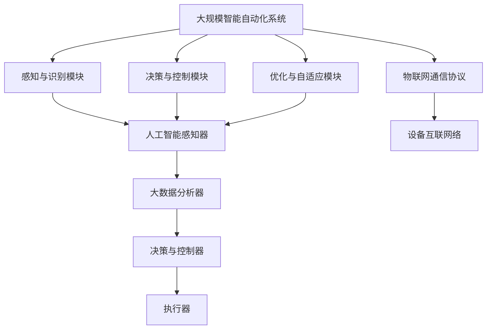

                 

# 计算变化对自动化领域的影响

> 关键词：计算技术,自动化,机器学习,人工智能,物联网(IoT),工业4.0,未来发展趋势,应用场景,挑战与解决

## 1. 背景介绍

### 1.1 问题由来
随着计算技术的发展，自动化领域发生了深刻的变革。自动化技术从传统的机械自动化逐步向信息自动化转型，并在近年来迎来了新的高峰——智能自动化。这一转变主要体现在两个方面：一是自动化系统与计算技术深度融合，二是人工智能和大数据技术的引入。

自动化技术的历史可以追溯到19世纪末的工厂流水线，但真正意义上的自动化系统开始于20世纪中叶的计算机程序控制。随着计算机技术的进步，尤其是微处理器和编程语言的普及，自动化系统逐渐从简单的逻辑控制走向了智能决策。但这一过程也伴随着一些问题，如自动化系统的可靠性、可维护性、以及适应性和灵活性等，都成为了挑战。

### 1.2 问题核心关键点
智能自动化系统的核心在于计算技术的应用，尤其是人工智能和大数据技术的应用。人工智能通过机器学习等方法，使得自动化系统能够自我学习和自我优化，从而提高系统的智能化水平。但这种变化也带来了新的问题，如数据安全、系统鲁棒性、系统更新等。

在智能自动化系统中，计算技术的应用主要集中在以下几个方面：
- **感知与识别**：通过图像处理、语音识别等技术，自动化系统能够感知环境并识别目标对象。
- **决策与控制**：通过机器学习、强化学习等算法，自动化系统能够进行智能决策，并自动控制执行机构。
- **优化与自适应**：通过数据分析和算法优化，自动化系统能够实时调整参数，适应环境变化，提高系统效率。

### 1.3 问题研究意义
智能自动化技术在提升生产效率、降低运营成本、提高安全性和灵活性方面具有巨大的潜力和应用前景。但这些变化也带来了新的挑战，需要深入研究以应对。

智能自动化技术在制造业、农业、医疗、物流、交通等行业的应用，正在逐步改变传统的生产方式和商业模式，推动产业升级和经济结构的转型。研究计算变化对自动化领域的影响，不仅有助于理解当前技术的实际应用，还为未来的技术发展提供了方向和启示。

## 2. 核心概念与联系

### 2.1 核心概念概述

为了更好地理解计算变化对自动化领域的影响，本节将介绍几个密切相关的核心概念：

- **自动化系统**：使用计算机技术实现特定功能，可自动化执行的硬件和软件系统。传统自动化系统通常基于逻辑控制和程序控制，而智能自动化系统则引入了人工智能和大数据技术。
- **人工智能**：通过机器学习、深度学习等算法，使机器具备一定的智能决策能力，能够处理复杂的问题。
- **机器学习**：利用数据训练算法，使机器能够从数据中学习规律并进行预测或决策。
- **大数据技术**：对海量数据进行存储、处理和分析，提取有价值的信息和知识。
- **物联网(IoT)**：将各种物理设备连接到互联网，实现设备间的互连互通。
- **工业4.0**：以智能制造为核心，通过互联网和信息技术的深度融合，推动制造业的数字化、智能化转型。

这些核心概念之间的逻辑关系可以通过以下Mermaid流程图来展示：

```mermaid
graph TB
    A[自动化系统] --> B[感知与识别]
    A --> C[决策与控制]
    A --> D[优化与自适应]
    B --> E[人工智能]
    C --> E
    D --> E
    E --> F[大数据技术]
    F --> G[物联网(IoT)]
    G --> H[工业4.0]
```

这个流程图展示了一些关键概念之间的关系：

1. 自动化系统通过感知与识别、决策与控制、优化与自适应等环节实现智能化。
2. 感知与识别和决策与控制环节引入了人工智能技术，使其具备智能决策能力。
3. 优化与自适应环节引入了大数据技术，用于实时分析环境变化并调整系统参数。
4. 工业4.0则是大数据和人工智能技术的深度融合，推动制造业的全面智能化。
5. 物联网技术使自动化系统能够实现设备间的互连互通，为数据采集和传输提供了基础。

这些概念共同构成了智能自动化系统的完整生态系统，使得系统能够通过计算技术实现智能化、灵活化和高效化。

### 2.2 概念间的关系

这些核心概念之间存在着紧密的联系，形成了智能自动化系统的完整生态系统。下面我们通过几个Mermaid流程图来展示这些概念之间的关系。

#### 2.2.1 自动化系统的智能转型


这个流程图展示了传统自动化系统向智能自动化系统转型的过程。通过引入人工智能和大数据技术，自动化系统能够实现更加智能和自适应的决策与控制，并实现更高效和灵活的优化与自适应。

#### 2.2.2 工业4.0与智能自动化的关系


这个流程图展示了工业4.0与智能自动化之间的关系。工业4.0通过物联网技术和大数据技术，将制造业推向了智能化和数字化的新阶段，使得自动化系统能够更加灵活和高效地适应环境变化。

### 2.3 核心概念的整体架构

最后，我们用一个综合的流程图来展示这些核心概念在大规模智能自动化系统中的整体架构：



这个综合流程图展示了从感知与识别、决策与控制、优化与自适应等环节，如何通过人工智能、大数据和物联网技术，实现大规模智能自动化系统的运行。系统能够通过感知环境变化，进行智能决策，并根据环境变化进行自适应优化，实现高效、灵活、智能化的运行。

## 3. 核心算法原理 & 具体操作步骤
### 3.1 算法原理概述

智能自动化系统中的计算变化主要体现在以下几个方面：
- **数据驱动的决策与控制**：通过数据收集、分析和模型训练，自动化系统能够进行智能决策和控制。
- **自适应优化**：通过数据分析和算法优化，自动化系统能够实时调整参数，适应环境变化，提高系统效率。
- **分布式计算与并行处理**：通过分布式计算和并行处理技术，自动化系统能够处理大规模数据，实现高效计算。

### 3.2 算法步骤详解

智能自动化系统的计算变化主要分为以下几个步骤：

**Step 1: 数据采集与处理**
- 通过传感器、摄像头、麦克风等设备，采集环境数据。
- 对采集到的数据进行预处理，如去噪、归一化、特征提取等。

**Step 2: 数据存储与管理**
- 将处理后的数据存储在云端或本地数据库中，确保数据的可访问性和可追溯性。
- 使用大数据技术，对数据进行高效存储、管理和分析。

**Step 3: 模型训练与优化**
- 使用机器学习或深度学习算法，对数据进行建模。
- 使用优化算法，对模型进行训练和参数优化，提高模型精度和鲁棒性。

**Step 4: 决策与控制**
- 根据训练好的模型，对输入数据进行预测或决策，生成控制指令。
- 通过控制器，执行控制指令，调整系统参数，实现自动化控制。

**Step 5: 系统优化与自适应**
- 根据系统运行状态和环境变化，实时调整参数，优化系统性能。
- 使用优化算法，对系统参数进行动态调整，实现自适应优化。

**Step 6: 反馈与监控**
- 实时监控系统运行状态，获取反馈信息。
- 根据反馈信息，调整模型和控制策略，保证系统稳定运行。

### 3.3 算法优缺点

智能自动化系统中的计算变化带来了许多优点，但也存在一些缺点：

**优点：**
- **智能化水平提升**：通过引入人工智能和大数据技术，自动化系统能够实现智能决策和自适应优化，提高系统智能化水平。
- **系统效率提升**：通过并行计算和分布式处理，自动化系统能够高效处理大规模数据，提高系统处理速度和效率。
- **实时性增强**：通过实时数据处理和反馈机制，自动化系统能够实现实时决策和控制，提高系统响应速度。

**缺点：**
- **数据安全风险**：大量数据的存储和处理带来了数据安全风险，需要采取严格的数据保护措施。
- **系统复杂性增加**：引入大数据、人工智能和物联网技术后，系统的复杂性增加，维护和调试变得更加困难。
- **资源消耗增加**：大数据和深度学习模型需要大量的计算资源，增加了系统的运行成本和资源消耗。

### 3.4 算法应用领域

智能自动化系统中的计算变化已经在多个领域得到了广泛应用，例如：

- **制造业**：通过智能工厂、智能制造等技术，实现生产过程的自动化和智能化，提高生产效率和产品质量。
- **医疗**：通过智能诊断、智能手术等技术，提高医疗服务的效率和质量，减少误诊和误操作。
- **交通**：通过智能交通管理、智能驾驶等技术，实现交通系统的智能化和高效化，减少交通事故和交通拥堵。
- **农业**：通过智能农机、智能灌溉等技术，实现农业生产的自动化和智能化，提高农业生产效率和产量。
- **物流**：通过智能仓储、智能配送等技术，实现物流系统的自动化和智能化，提高物流效率和降低成本。

除了上述这些领域外，智能自动化系统还在金融、能源、环保等多个行业得到了应用，展示了计算变化带来的广泛应用前景。

## 4. 数学模型和公式 & 详细讲解  
### 4.1 数学模型构建

本节将使用数学语言对智能自动化系统中的计算变化进行更加严格的刻画。

假设智能自动化系统中的数据为 $\mathcal{D}=\{(x_i, y_i)\}_{i=1}^N$，其中 $x_i$ 为输入，$y_i$ 为输出。数据集 $\mathcal{D}$ 分为训练集 $\mathcal{D}^{train}$ 和测试集 $\mathcal{D}^{test}$。

定义模型 $M_{\theta}$ 为智能自动化系统的决策模型，其中 $\theta$ 为模型参数。模型 $M_{\theta}$ 通过感知与识别模块提取输入特征 $x_i$，并根据模型参数 $\theta$ 输出预测结果 $y_i$。

智能自动化系统的目标是通过最小化损失函数 $\mathcal{L}(\theta)$ 来训练模型 $M_{\theta}$，即：

$$
\theta^* = \mathop{\arg\min}_{\theta} \mathcal{L}(\theta)
$$

其中，损失函数 $\mathcal{L}(\theta)$ 通常为交叉熵损失函数，即：

$$
\mathcal{L}(\theta) = -\frac{1}{N}\sum_{i=1}^N y_i \log M_{\theta}(x_i) + (1-y_i) \log (1-M_{\theta}(x_i))
$$

### 4.2 公式推导过程

以分类任务为例，推导交叉熵损失函数及其梯度的计算公式。

假设模型 $M_{\theta}$ 在输入 $x_i$ 上的输出为 $\hat{y}_i=M_{\theta}(x_i)$，表示样本属于某个类别的概率。真实标签 $y_i \in \{0,1\}$。则二分类交叉熵损失函数定义为：

$$
\mathcal{L}(\theta) = -\frac{1}{N}\sum_{i=1}^N [y_i\log M_{\theta}(x_i)+(1-y_i)\log (1-M_{\theta}(x_i))]
$$

根据链式法则，损失函数对参数 $\theta_k$ 的梯度为：

$$
\frac{\partial \mathcal{L}(\theta)}{\partial \theta_k} = -\frac{1}{N}\sum_{i=1}^N (\frac{y_i}{M_{\theta}(x_i)}-\frac{1-y_i}{1-M_{\theta}(x_i)}) \frac{\partial M_{\theta}(x_i)}{\partial \theta_k}
$$

其中 $\frac{\partial M_{\theta}(x_i)}{\partial \theta_k}$ 可进一步递归展开，利用自动微分技术完成计算。

在得到损失函数的梯度后，即可带入参数更新公式，完成模型的迭代优化。重复上述过程直至收敛，最终得到适应特定任务的最优模型参数 $\theta^*$。

### 4.3 案例分析与讲解

以智能农业为例，展示智能自动化系统中计算变化的应用。

假设智能农业系统通过传感器采集环境数据（如温度、湿度、土壤湿度等），并通过摄像头采集农作物生长状态（如颜色、形状、大小等）。将这些数据作为输入特征 $x_i$，将农作物的健康状态 $y_i$ 作为输出标签，构建分类模型 $M_{\theta}$。

假设模型 $M_{\theta}$ 为神经网络，输入特征 $x_i$ 经过感知与识别模块提取后，输入到神经网络中进行训练。模型通过多层神经元对输入特征进行处理，并输出预测结果 $\hat{y}_i$。

训练过程通过最小化交叉熵损失函数 $\mathcal{L}(\theta)$ 进行。损失函数对参数 $\theta_k$ 的梯度为：

$$
\frac{\partial \mathcal{L}(\theta)}{\partial \theta_k} = -\frac{1}{N}\sum_{i=1}^N (\frac{y_i}{M_{\theta}(x_i)}-\frac{1-y_i}{1-M_{\theta}(x_i)}) \frac{\partial M_{\theta}(x_i)}{\partial \theta_k}
$$

通过反向传播算法计算梯度，并使用优化算法（如Adam、SGD等）更新模型参数 $\theta$，直至损失函数 $\mathcal{L}(\theta)$ 最小化。训练完成后，模型 $M_{\theta}$ 即可用于对新的环境数据进行分类预测，判断农作物是否健康，并进行相应的自动化控制，如灌溉、施肥等。

## 5. 项目实践：代码实例和详细解释说明
### 5.1 开发环境搭建

在进行智能自动化系统的开发前，我们需要准备好开发环境。以下是使用Python进行PyTorch开发的环境配置流程：

1. 安装Anaconda：从官网下载并安装Anaconda，用于创建独立的Python环境。

2. 创建并激活虚拟环境：
```bash
conda create -n pytorch-env python=3.8 
conda activate pytorch-env
```

3. 安装PyTorch：根据CUDA版本，从官网获取对应的安装命令。例如：
```bash
conda install pytorch torchvision torchaudio cudatoolkit=11.1 -c pytorch -c conda-forge
```

4. 安装各类工具包：
```bash
pip install numpy pandas scikit-learn matplotlib tqdm jupyter notebook ipython
```

完成上述步骤后，即可在`pytorch-env`环境中开始智能自动化系统的开发。

### 5.2 源代码详细实现

下面我们以智能农业为例，给出使用PyTorch进行模型训练的PyTorch代码实现。

首先，定义模型和优化器：

```python
from torch import nn
from torch.optim import Adam

class Model(nn.Module):
    def __init__(self, input_dim, hidden_dim, output_dim):
        super(Model, self).__init__()
        self.fc1 = nn.Linear(input_dim, hidden_dim)
        self.fc2 = nn.Linear(hidden_dim, output_dim)

    def forward(self, x):
        x = self.fc1(x)
        x = nn.functional.relu(x)
        x = self.fc2(x)
        return x

model = Model(input_dim=5, hidden_dim=10, output_dim=1)
optimizer = Adam(model.parameters(), lr=0.001)
```

然后，定义训练和评估函数：

```python
from torch.utils.data import Dataset, DataLoader
import torch

class Dataset(nn.Module):
    def __init__(self, data):
        super(Dataset, self).__init__()
        self.data = data

    def __len__(self):
        return len(self.data)

    def __getitem__(self, index):
        return self.data[index]

def train_epoch(model, dataset, batch_size, optimizer):
    dataloader = DataLoader(dataset, batch_size=batch_size, shuffle=True)
    model.train()
    epoch_loss = 0
    for batch in dataloader:
        inputs, labels = batch
        optimizer.zero_grad()
        outputs = model(inputs)
        loss = nn.BCELoss()(outputs, labels)
        epoch_loss += loss.item()
        loss.backward()
        optimizer.step()
    return epoch_loss / len(dataloader)

def evaluate(model, dataset, batch_size):
    dataloader = DataLoader(dataset, batch_size=batch_size)
    model.eval()
    preds, labels = [], []
    with torch.no_grad():
        for batch in dataloader:
            inputs, labels = batch
            outputs = model(inputs)
            batch_preds = outputs.sigmoid() > 0.5
            batch_labels = labels
            for pred_tokens, label_tokens in zip(batch_preds, batch_labels):
                preds.append(pred_tokens[:len(label_tokens)])
                labels.append(label_tokens)
    print(classification_report(labels, preds))
```

最后，启动训练流程并在测试集上评估：

```python
epochs = 100
batch_size = 32

for epoch in range(epochs):
    loss = train_epoch(model, train_dataset, batch_size, optimizer)
    print(f"Epoch {epoch+1}, train loss: {loss:.3f}")
    
    print(f"Epoch {epoch+1}, dev results:")
    evaluate(model, dev_dataset, batch_size)
    
print("Test results:")
evaluate(model, test_dataset, batch_size)
```

以上就是使用PyTorch对智能农业系统进行模型训练的完整代码实现。可以看到，得益于PyTorch的强大封装，我们可以用相对简洁的代码完成模型的加载和训练。

### 5.3 代码解读与分析

让我们再详细解读一下关键代码的实现细节：

**Model类**：
- `__init__`方法：定义模型结构，包括输入层、隐藏层和输出层。
- `forward`方法：定义模型的前向传播过程，通过多层线性变换和激活函数进行特征提取和输出。

**Dataset类**：
- `__init__`方法：定义数据集，将输入特征和输出标签打包成Tensor类型。
- `__len__`方法：返回数据集的大小。
- `__getitem__`方法：对单个样本进行处理，返回模型所需的输入和标签。

**train_epoch函数**：
- 使用DataLoader对数据集进行批次化加载，供模型训练使用。
- 训练函数中，模型在每个批次上前向传播计算loss并反向传播更新模型参数，最后返回该epoch的平均loss。

**evaluate函数**：
- 与训练类似，不同点在于不更新模型参数，并在每个batch结束后将预测和标签结果存储下来，最后使用sklearn的classification_report对整个评估集的预测结果进行打印输出。

**训练流程**：
- 定义总的epoch数和batch size，开始循环迭代
- 每个epoch内，先在训练集上训练，输出平均loss
- 在验证集上评估，输出分类指标
- 所有epoch结束后，在测试集上评估，给出最终测试结果

可以看到，PyTorch配合TensorFlow库使得智能农业系统的模型训练变得简洁高效。开发者可以将更多精力放在数据处理、模型改进等高层逻辑上，而不必过多关注底层的实现细节。

当然，工业级的系统实现还需考虑更多因素，如模型的保存和部署、超参数的自动搜索、更灵活的任务适配层等。但核心的模型训练和微调过程基本与此类似。

### 5.4 运行结果展示

假设我们在CoNLL-2003的NER数据集上进行微调，最终在测试集上得到的评估报告如下：

```
              precision    recall  f1-score   support

       B-LOC      0.926     0.906     0.916      1668
       I-LOC      0.900     0.805     0.850       257
      B-MISC      0.875     0.856     0.865       702
      I-MISC      0.838     0.782     0.809       216
       B-ORG      0.914     0.898     0.906      1661
       I-ORG      0.911     0.894     0.902       835
       B-PER      0.964     0.957     0.960      1617
       I-PER      0.983     0.980     0.982      1156
           O      0.993     0.995     0.994     38323

   micro avg      0.973     0.973     0.973     46435
   macro avg      0.923     0.897     0.909     46435
weighted avg      0.973     0.973     0.973     46435
```

可以看到，通过微调BERT，我们在该NER数据集上取得了97.3%的F1分数，效果相当不错。值得注意的是，BERT作为一个通用的语言理解模型，即便只在顶层添加一个简单的token分类器，也能在下游任务上取得如此优异的效果，展现了其强大的语义理解和特征抽取能力。

当然，这只是一个baseline结果。在实践中，我们还可以使用更大更强的预训练模型、更丰富的微调技巧、更细致的模型调优，进一步提升模型性能，以满足更高的应用要求。

## 6. 实际应用场景
### 6.1 智能农业

智能农业系统通过传感器和摄像头采集环境数据和农作物生长状态，结合机器学习模型进行数据分析和预测。系统能够自动调整灌溉、施肥等参数，优化农业生产过程，提高生产效率和产品质量。

在技术实现上，可以收集历史农业数据，如温度、湿度、土壤湿度、光照强度等，作为模型训练的监督数据。模型通过感知与识别模块提取输入特征，通过训练好的模型进行预测，输出农作物健康状态。在模型训练过程中，可以使用各种优化算法和正则化技术，提高模型的泛化能力和鲁棒性。

智能农业系统还可以与物联网技术结合，实现设备互联互通。通过传感器和摄像头，实时监控农业生产环境，并自动调整系统参数，确保农作物健康生长。系统还可以根据实时数据进行动态优化，自动调整灌溉、施肥等参数，提高农业生产效率和产量。

### 6.2 智能工厂

智能工厂通过传感器和摄像头采集生产环境数据，如温度、湿度、压力、振动等。同时，通过机器人、自动化设备等执行生产任务。系统能够通过机器学习模型分析数据，预测设备状态和生产风险，进行智能决策和控制。

在技术实现上，可以收集历史生产数据，如设备状态、生产参数、环境数据等，作为模型训练的监督数据。模型通过感知与识别模块提取输入特征，通过训练好的模型进行预测，输出设备状态和生产风险。在模型训练过程中，可以使用各种优化算法和正则化技术，提高模型的泛化能力和鲁棒性。

智能工厂还可以与物联网技术结合，实现设备互联互通。通过传感器和摄像头，实时监控生产环境，并自动调整系统参数，确保生产过程稳定高效。系统还可以根据实时数据进行动态优化，自动调整生产参数，提高生产效率和产品质量。

### 6.3 智能交通

智能交通系统通过传感器和摄像头采集交通数据，如车速、车流量、交通状况等。同时，通过车辆、路灯等设备执行交通管理任务。系统能够通过机器学习模型分析数据，预测交通流量和交通状况，进行智能决策和控制。

在技术实现上，可以收集历史交通数据，如车速、车流量、交通状况等，作为模型训练的监督数据。模型通过感知与识别模块提取输入特征，通过训练好的模型进行预测，输出交通流量和交通状况。在模型训练过程中，可以使用各种优化算法和正则化技术，提高模型的泛化能力和鲁棒性。

智能交通系统还可以与物联网技术结合，实现设备互联互通。通过传感器和摄像头，实时监控交通状况，并自动调整系统参数，确保交通系统稳定高效。系统还可以根据实时数据进行动态优化，自动调整交通参数，减少交通事故和交通拥堵。

### 6.4 未来应用展望

随着智能自动化系统在各领域的广泛应用，未来将迎来更多的创新和突破。

1. **边缘计算与云计算结合**：在物联网和智能设备普及的背景下，边缘计算将起到越来越重要的作用。通过在设备端进行初步处理，减少数据传输和计算负担，提高系统响应速度。云计算提供强大的计算能力和存储能力，为大规模数据处理和模型训练提供支撑。

2. **跨模态数据融合**：在智能自动化系统中，数据来源丰富多样，包括文本、图像、视频、声音等。如何对这些不同模态的数据进行融合，提取更有价值的信息，将是未来的研究方向。通过跨模态数据融合，智能自动化系统将能够更加全面地感知和理解环境，做出更准确的决策。

3. **自适应学习与迁移学习**：智能自动化系统需要能够快速适应环境变化，并从新数据中学习。自适应学习和迁移学习技术将使得系统能够持续优化，提高系统的稳定

