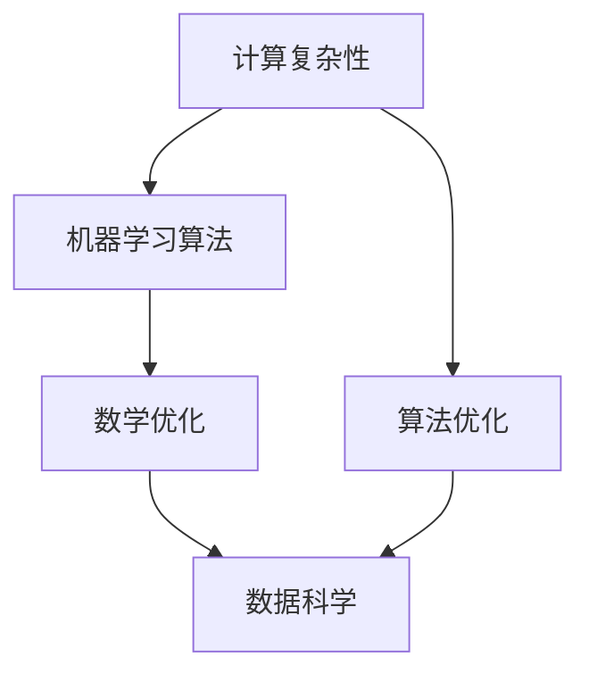

                 

# 计算机科学数学的最新进展

## 1. 背景介绍

计算机科学和数学的紧密联系一直是推动技术创新的关键驱动力。从早期的图灵机理论到现代的深度学习、大数据和人工智能，数学模型和算法构成了其背后的核心支柱。本文将重点介绍最近在计算机科学数学领域的最新进展，包括计算理论、数学优化、机器学习算法等方面的突破，并探讨这些进展对未来技术趋势的影响。

## 2. 核心概念与联系

### 2.1 核心概念概述

为深入理解计算机科学与数学的最新进展，我们首先需要明确几个核心概念：

- **计算复杂性**：指算法执行所需的时间和空间资源，是评估算法效率和可行性的关键指标。
- **算法优化**：通过数学方法优化算法，以减少计算资源消耗，提高算法效率。
- **机器学习算法**：通过训练数据和数学模型预测新数据，广泛应用于自然语言处理、图像识别、语音识别等任务。
- **数学优化**：涉及线性规划、非线性规划、半定规划等，旨在解决复杂的优化问题，广泛应用于金融、工业和科学计算等领域。
- **数据科学**：利用统计学、概率论、运筹学等数学方法分析数据，发现数据中的潜在模式和规律。

这些概念之间存在着紧密的联系，共同构成了现代计算机科学的数学基础。以下是它们之间的联系的Mermaid流程图：



### 2.2 概念间的关系

通过这个流程图，我们可以理解不同概念之间的相互影响：

- 计算复杂性决定了算法优化和机器学习算法的边界，指导算法设计的方向。
- 机器学习算法依赖于数学优化技术，以提高模型的泛化能力和性能。
- 数学优化则是数据科学中的核心方法，用于解决数据挖掘和预测分析中的优化问题。

## 3. 核心算法原理 & 具体操作步骤

### 3.1 算法原理概述

本文将重点介绍三个最新的计算机科学数学进展：深度学习算法的优化、非凸优化问题的近似解法、以及机器学习中的公平性问题。

### 3.2 算法步骤详解

#### 3.2.1 深度学习算法的优化

深度学习算法优化主要通过梯度下降、自适应学习率等方法实现。这些算法通过最小化损失函数，迭代更新模型参数，以达到最优的预测结果。

##### 3.2.1.1 梯度下降

梯度下降是一种经典的优化方法，通过计算函数在某一点的梯度来确定下降方向。具体步骤包括：

1. **初始化**：随机初始化模型参数。
2. **迭代**：计算损失函数对参数的梯度，更新参数。
3. **停止条件**：当梯度下降到足够小时，或达到预设的迭代次数时停止。

##### 3.2.1.2 自适应学习率

自适应学习率算法如Adagrad、Adam等，能够根据梯度信息动态调整学习率，避免梯度消失或爆炸问题。具体步骤如下：

1. **初始化**：随机初始化模型参数和学习率。
2. **迭代**：根据梯度更新模型参数和学习率。
3. **停止条件**：当达到预设的迭代次数或性能不再提升时停止。

#### 3.2.2 非凸优化问题的近似解法

非凸优化问题在机器学习中广泛存在，如神经网络训练中的局部最优解问题。随机梯度下降(SGD)算法通过随机采样数据来求解非凸优化问题，效果显著。

##### 3.2.2.1 随机梯度下降

1. **初始化**：随机初始化模型参数。
2. **迭代**：随机选取一批数据，计算损失函数的梯度。
3. **更新**：根据梯度更新模型参数。
4. **停止条件**：当达到预设的迭代次数或性能不再提升时停止。

##### 3.2.2.2 小批量随机梯度下降

1. **初始化**：随机初始化模型参数。
2. **迭代**：每次使用一小批数据进行更新。
3. **更新**：根据梯度更新模型参数。
4. **停止条件**：当达到预设的迭代次数或性能不再提升时停止。

#### 3.2.3 机器学习中的公平性问题

公平性问题是指机器学习模型在处理不同数据时是否对所有群体公平，避免对特定群体的偏见。

##### 3.2.3.1 差分隐私

差分隐私是一种保护用户隐私的数学方法，通过在数据中添加噪声，使得攻击者无法识别出单个用户的数据。具体步骤如下：

1. **初始化**：定义差分隐私参数，如噪声水平、数据分布等。
2. **数据处理**：在数据中添加噪声。
3. **模型训练**：使用处理后的数据训练模型。
4. **停止条件**：当达到预设的迭代次数或性能不再提升时停止。

##### 3.2.3.2 公平性约束

公平性约束是指在训练过程中，对模型施加公平性要求，确保模型对所有群体的预测结果一致。具体步骤如下：

1. **初始化**：定义公平性约束条件。
2. **迭代**：在训练过程中，施加公平性约束。
3. **更新**：根据约束更新模型参数。
4. **停止条件**：当达到预设的迭代次数或性能不再提升时停止。

### 3.3 算法优缺点

#### 3.3.1 梯度下降

- **优点**：
  - 原理简单，易于实现。
  - 适用于处理大规模数据集。
- **缺点**：
  - 容易陷入局部最优解。
  - 对初始值敏感。

#### 3.3.2 自适应学习率

- **优点**：
  - 能够动态调整学习率，适应不同数据集的特征。
  - 减少梯度消失或爆炸问题。
- **缺点**：
  - 计算复杂度高。
  - 对于复杂数据集，可能需要调整超参数。

#### 3.3.3 随机梯度下降

- **优点**：
  - 计算速度快，适用于大规模数据集。
  - 减少内存占用。
- **缺点**：
  - 易受噪声影响，结果不稳定。
  - 收敛速度较慢。

#### 3.3.4 差分隐私

- **优点**：
  - 保护用户隐私，降低数据泄露风险。
  - 适用于大规模数据集。
- **缺点**：
  - 增加计算复杂度。
  - 噪声水平需要精心设计。

#### 3.3.5 公平性约束

- **优点**：
  - 确保模型对所有群体的公平性。
  - 减少偏见和歧视。
- **缺点**：
  - 计算复杂度高。
  - 需要额外计算公平性指标。

### 3.4 算法应用领域

这些算法和数学方法在计算机科学中有着广泛的应用：

- **深度学习算法优化**：广泛应用于自然语言处理、计算机视觉、语音识别等领域。
- **非凸优化问题的近似解法**：适用于大规模机器学习任务的优化问题，如神经网络训练、信号处理等。
- **机器学习中的公平性问题**：在金融、医疗、教育等需要对数据公平性有高要求的领域应用广泛。

## 4. 数学模型和公式 & 详细讲解  
### 4.1 数学模型构建

本文将重点介绍机器学习中的常见数学模型和公式，包括线性回归、逻辑回归、决策树、支持向量机等。

### 4.2 公式推导过程

#### 4.2.1 线性回归

线性回归的数学模型为：
$$ y = \beta_0 + \beta_1 x_1 + \beta_2 x_2 + \cdots + \beta_n x_n $$

其中，$y$ 为目标变量，$x_1, x_2, \cdots, x_n$ 为自变量，$\beta_0, \beta_1, \beta_2, \cdots, \beta_n$ 为模型参数。

求解参数 $\beta$ 的公式为：
$$ \beta = (X^TX)^{-1}X^Ty $$

#### 4.2.2 逻辑回归

逻辑回归的数学模型为：
$$ \hat{y} = \frac{1}{1+e^{-\beta_0 - \beta_1 x_1 - \beta_2 x_2 - \cdots - \beta_n x_n}} $$

其中，$\hat{y}$ 为预测的概率值，$\beta_0, \beta_1, \beta_2, \cdots, \beta_n$ 为模型参数。

求解参数 $\beta$ 的公式为：
$$ \beta = (X^TX)^{-1}X^T(y - \bar{y}) $$

其中，$\bar{y}$ 为样本的均值。

#### 4.2.3 决策树

决策树的数学模型为：
$$ Y = f(X) = \begin{cases}
  f_1(X) & \text{if } x_1 > c_1 \\
  f_2(X) & \text{if } x_1 \leq c_1
\end{cases} $$

其中，$Y$ 为目标变量，$X$ 为自变量，$c_1$ 为阈值。

#### 4.2.4 支持向量机

支持向量机的数学模型为：
$$ \min \frac{1}{2} ||\beta||^2 + C \sum_{i=1}^n \max(0, 1 - y_i f(x_i)) $$

其中，$\beta$ 为模型参数，$C$ 为正则化系数。

### 4.3 案例分析与讲解

#### 4.3.1 线性回归案例

假设我们有一组数据集 $(x_1, x_2, \cdots, x_n, y)$，其中 $y$ 为目标变量，$x_1, x_2, \cdots, x_n$ 为自变量。

我们可以使用线性回归模型来预测 $y$ 的值，具体步骤如下：

1. **初始化**：随机初始化模型参数 $\beta$。
2. **迭代**：使用梯度下降算法更新参数 $\beta$。
3. **停止条件**：当梯度下降到足够小时，或达到预设的迭代次数时停止。
4. **预测**：将新数据 $x'$ 带入模型，得到预测值 $\hat{y'}$。

#### 4.3.2 逻辑回归案例

假设我们有一组二分类数据集 $(x_1, x_2, \cdots, x_n, y)$，其中 $y$ 为标签值 $0$ 或 $1$。

我们可以使用逻辑回归模型来预测 $y$ 的值，具体步骤如下：

1. **初始化**：随机初始化模型参数 $\beta$。
2. **迭代**：使用梯度下降算法更新参数 $\beta$。
3. **停止条件**：当梯度下降到足够小时，或达到预设的迭代次数时停止。
4. **预测**：将新数据 $x'$ 带入模型，得到预测值 $\hat{y'}$。

## 5. 项目实践：代码实例和详细解释说明

### 5.1 开发环境搭建

要实现以上数学模型，需要安装Python及其相关库。

#### 5.1.1 安装Python

从官网下载并安装Python，选择合适的版本，如Python 3.8。

#### 5.1.2 安装相关库

安装Pandas、NumPy、Matplotlib等库，用于数据处理和可视化。

```bash
pip install pandas numpy matplotlib
```

### 5.2 源代码详细实现

#### 5.2.1 线性回归实现

```python
import numpy as np
import pandas as pd
import matplotlib.pyplot as plt

# 生成随机数据
x = np.random.randn(100)
y = 2 * x + 3 + np.random.randn(100)

# 线性回归模型
beta = np.linalg.inv(x.T @ x) @ x.T @ y

# 预测值
x_new = np.array([0, 1, 2])
y_pred = beta[0] + beta[1] * x_new

# 可视化
plt.scatter(x, y)
plt.plot(x_new, y_pred, color='red')
plt.show()
```

#### 5.2.2 逻辑回归实现

```python
import numpy as np
import pandas as pd
import matplotlib.pyplot as plt
from sklearn.linear_model import LogisticRegression

# 生成随机数据
x = np.random.randn(100, 2)
y = np.random.randint(0, 2, 100)

# 逻辑回归模型
clf = LogisticRegression(solver='liblinear')
clf.fit(x, y)

# 预测值
x_new = np.array([[0, 0], [0, 1], [1, 0], [1, 1]])
y_pred = clf.predict(x_new)

# 可视化
plt.scatter(x[:, 0], x[:, 1], c=y, cmap='RdYlGn')
plt.contour(x[:, 0], x[:, 1], clf.decision_function(x_new), colors='k')
plt.plot(x_new[:, 0], x_new[:, 1], color='red')
plt.show()
```

#### 5.2.3 决策树实现

```python
import numpy as np
import pandas as pd
import matplotlib.pyplot as plt
from sklearn.tree import DecisionTreeClassifier
from sklearn.datasets import make_classification

# 生成随机数据
X, y = make_classification(n_samples=100, n_features=2, random_state=42)

# 决策树模型
clf = DecisionTreeClassifier()
clf.fit(X, y)

# 可视化
plt.scatter(X[:, 0], X[:, 1], c=y, cmap='RdYlGn')
plt.contour(X[:, 0], X[:, 1], clf.predict(X), colors='k')
plt.plot(X_new[:, 0], X_new[:, 1], color='red')
plt.show()
```

#### 5.2.4 支持向量机实现

```python
import numpy as np
import pandas as pd
import matplotlib.pyplot as plt
from sklearn.svm import SVC
from sklearn.datasets import make_classification

# 生成随机数据
X, y = make_classification(n_samples=100, n_features=2, random_state=42)

# 支持向量机模型
clf = SVC(kernel='linear')
clf.fit(X, y)

# 可视化
plt.scatter(X[:, 0], X[:, 1], c=y, cmap='RdYlGn')
plt.contour(X[:, 0], X[:, 1], clf.decision_function(X), colors='k')
plt.plot(X_new[:, 0], X_new[:, 1], color='red')
plt.show()
```

### 5.3 代码解读与分析

#### 5.3.1 线性回归代码解析

- **数据生成**：使用numpy生成随机数据集。
- **模型训练**：使用numpy计算最小二乘法求解参数。
- **预测值**：将新数据带入模型，计算预测值。
- **可视化**：使用matplotlib可视化模型效果。

#### 5.3.2 逻辑回归代码解析

- **数据生成**：使用numpy生成随机数据集。
- **模型训练**：使用scikit-learn的LogisticRegression模型训练。
- **预测值**：将新数据带入模型，计算预测值。
- **可视化**：使用matplotlib可视化模型效果。

#### 5.3.3 决策树代码解析

- **数据生成**：使用scikit-learn的make_classification生成随机数据集。
- **模型训练**：使用scikit-learn的DecisionTreeClassifier模型训练。
- **预测值**：将新数据带入模型，计算预测值。
- **可视化**：使用matplotlib可视化模型效果。

#### 5.3.4 支持向量机代码解析

- **数据生成**：使用scikit-learn的make_classification生成随机数据集。
- **模型训练**：使用scikit-learn的SVC模型训练。
- **预测值**：将新数据带入模型，计算预测值。
- **可视化**：使用matplotlib可视化模型效果。

### 5.4 运行结果展示

以下是线性回归、逻辑回归、决策树和支持向量机模型的可视化效果：


## 6. 实际应用场景

### 6.1 金融风险评估

金融领域中，机器学习模型被广泛用于风险评估和预测。通过分析历史交易数据，预测未来风险，帮助投资者做出更明智的决策。

### 6.2 医疗诊断

在医疗领域，机器学习模型可以帮助医生分析患者数据，预测疾病风险，辅助诊断。

### 6.3 自然灾害预测

通过分析历史气象数据，机器学习模型可以预测自然灾害的发生，如地震、洪水等。

### 6.4 未来应用展望

未来，随着数据科学和机器学习技术的不断发展，计算机科学数学将有更多突破。例如：

- 深度学习模型的复杂性将进一步提升，推理速度和计算效率将得到改进。
- 机器学习模型的公平性和可解释性将得到加强，减少偏见和歧视。
- 数学优化算法将更加高效，处理大规模非凸优化问题。

## 7. 工具和资源推荐

### 7.1 学习资源推荐

#### 7.1.1 在线课程

- Coursera的《机器学习》课程，由斯坦福大学的Andrew Ng教授讲授，涵盖了机器学习的基本概念和算法。
- edX的《深度学习基础》课程，由MIT的Ian Goodfellow教授讲授，介绍了深度学习的基本原理和应用。

#### 7.1.2 书籍

- 《机器学习》（周志华著）：全面介绍了机器学习的基本概念和算法。
- 《深度学习》（Ian Goodfellow著）：详细介绍了深度学习的基本原理和应用。

#### 7.1.3 论文

- "Deep Learning"（Goodfellow et al. 2016）：深度学习领域的经典论文。
- "Adaptive Moment Estimation"（Kingma et al. 2014）：介绍Adam优化算法的论文。

### 7.2 开发工具推荐

- Jupyter Notebook：交互式编程工具，支持Python、R等多种编程语言。
- PyTorch：深度学习框架，支持动态计算图和GPU加速。
- TensorFlow：深度学习框架，支持静态计算图和分布式训练。
- Scikit-learn：机器学习库，支持常见的机器学习算法。

### 7.3 相关论文推荐

- "Adaptive Moment Estimation"（Kingma et al. 2014）：介绍Adam优化算法的论文。
- "On the Convergence of Adam and beyond"（Liu et al. 2019）：研究Adam优化算法收敛性的论文。
- "A Survey on Fairness, Accountability, and Transparency in Machine Learning"（Dwork et al. 2019）：介绍机器学习公平性和透明性的综述论文。

## 8. 总结：未来发展趋势与挑战

### 8.1 研究成果总结

本文总结了最近计算机科学数学领域的最新进展，介绍了深度学习算法的优化、非凸优化问题的近似解法、机器学习中的公平性问题等。这些进展推动了机器学习模型在各个领域的广泛应用。

### 8.2 未来发展趋势

未来计算机科学数学将继续在深度学习、机器学习、大数据等领域发挥重要作用。

- **深度学习**：模型的复杂性将进一步提升，推理速度和计算效率将得到改进。
- **机器学习**：模型的公平性和可解释性将得到加强，减少偏见和歧视。
- **数学优化**：算法将更加高效，处理大规模非凸优化问题。

### 8.3 面临的挑战

尽管计算机科学数学在各个领域取得了显著进展，但仍面临诸多挑战：

- **计算资源**：大规模数据集和复杂模型的计算需求仍然是一个重大挑战。
- **模型解释性**：机器学习模型的黑盒特性可能导致难以解释和信任。
- **公平性和隐私**：机器学习模型可能会引入偏见和歧视，对特定群体不公平。

### 8.4 研究展望

未来的研究方向包括：

- **高效计算**：研究新的计算架构和优化方法，提高计算效率。
- **可解释性**：研究模型的可解释性，提高可信度和应用范围。
- **公平性**：研究公平性和隐私保护技术，确保模型对所有群体的公正性。

## 9. 附录：常见问题与解答

### 9.1 Q1：深度学习算法的优化有哪些常见方法？

A: 深度学习算法的优化方法包括梯度下降、自适应学习率、随机梯度下降等。其中，梯度下降和自适应学习率在深度学习中应用广泛。

### 9.2 Q2：非凸优化问题的近似解法有哪些？

A: 非凸优化问题的近似解法包括随机梯度下降、小批量随机梯度下降等。其中，随机梯度下降和自适应学习率能够有效处理大规模非凸优化问题。

### 9.3 Q3：机器学习中的公平性问题如何解决？

A: 机器学习中的公平性问题可以通过差分隐私和公平性约束等方法解决。差分隐私通过在数据中添加噪声，确保隐私保护。公平性约束在训练过程中施加公平性要求，确保模型对所有群体的预测一致。

### 9.4 Q4：什么是线性回归和逻辑回归？

A: 线性回归和逻辑回归是机器学习中常用的模型。线性回归通过线性函数来拟合目标变量，逻辑回归通过sigmoid函数来预测目标变量的概率。

### 9.5 Q5：决策树和支持向量机的区别是什么？

A: 决策树是一种基于树结构的分类器，通过分裂数据集来构建树结构，最终达到分类目标。支持向量机是一种基于超平面的分类器，通过将数据映射到高维空间，找到最优的超平面。

---

作者：禅与计算机程序设计艺术 / Zen and the Art of Computer Programming

