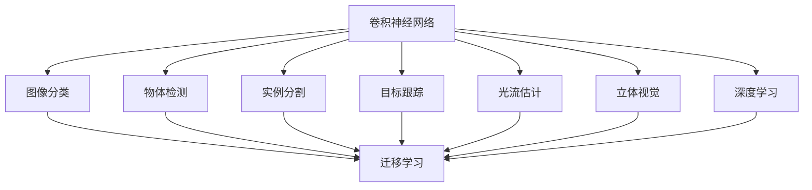

                 

# 计算机视觉 (Computer Vision) 原理与代码实例讲解

> 关键词：计算机视觉,卷积神经网络,图像分类,物体检测,实例分割,目标跟踪,自动驾驶,医学影像分析

## 1. 背景介绍

### 1.1 问题由来
计算机视觉（Computer Vision, CV）是一门融合了计算机科学与视觉科学的交叉学科，旨在让计算机系统理解和解释视觉信息。从简单的图像分类到复杂的物体检测和目标跟踪，CV 技术已经广泛应用于智能安防、无人驾驶、医疗影像、工业检测等领域。

近年来，深度学习技术在计算机视觉领域取得了突破性的进展，尤其是基于卷积神经网络（Convolutional Neural Networks, CNNs）的模型，如AlexNet、VGG、GoogLeNet和ResNet等，使得CV任务的效果达到了新的高度。本文将重点介绍计算机视觉的基本原理，并结合实例代码，带领读者深入理解该领域的核心技术。

### 1.2 问题核心关键点
计算机视觉的核心问题包括图像分类、物体检测、实例分割、目标跟踪等，这些任务涉及对图像的高层次语义理解，需要将像素级信息转化为语义级的理解。深度学习模型通过在大量标注数据上训练，学习到图像中各部分的空间结构和语义信息，从而能够对视觉场景进行解读。

当前，计算机视觉技术的核心是卷积神经网络，尤其是利用其强大的特征提取能力和多任务学习机制，可以实现各种复杂且高效率的视觉处理任务。这些技术的进步不仅提升了模型性能，还推动了实际应用场景的不断拓展。

### 1.3 问题研究意义
计算机视觉技术的发展，对人类社会的各个方面产生了深远的影响。在智能安防领域，CV技术可以有效提升视频监控的准确性和自动化程度；在无人驾驶中，物体检测和跟踪技术保证了行车安全和车辆导航的准确性；在医学影像中，图像分类和分割技术帮助医生进行精准诊断；在工业检测中，目标跟踪和识别技术提高了生产线的自动化水平。因此，深入理解计算机视觉的原理和实现方法，具有重要的理论和实际意义。

## 2. 核心概念与联系

### 2.1 核心概念概述

计算机视觉涉及多个核心概念，以下是对这些概念的详细解释：

- **卷积神经网络（Convolutional Neural Network, CNN）**：CNN是计算机视觉中的基石，通过多层卷积、池化和全连接层，实现了对图像特征的自动学习和提取。

- **图像分类（Image Classification）**：图像分类是将图像分为不同类别（如动物、汽车等）的任务。CNN通过训练学习到图像中不同特征的表示，能够进行准确的分类。

- **物体检测（Object Detection）**：物体检测是定位和分类图像中的物体。常用的方法包括R-CNN、Fast R-CNN、Faster R-CNN、YOLO、SSD等，通过在图像中标定边界框的方式进行物体定位。

- **实例分割（Semantic Segmentation）**：实例分割不仅需要识别图像中的不同物体，还需要将这些物体从背景中分离出来，常用的方法包括U-Net、DeepLab等。

- **目标跟踪（Object Tracking）**：目标跟踪是连续地追踪目标物体的位置和状态。经典方法如CamShift、DRIFT等，新方法如DeepSORT和Siam R-CNN等。

- **光流估计（Optical Flow Estimation）**：光流估计是通过分析视频序列中相邻帧的像素运动，计算光流的方向和速度。在自动驾驶中，光流可以用于车辆自定位和场景理解。

- **立体视觉（Stereo Vision）**：立体视觉通过两幅不同视角的图像，计算三维空间中物体的深度信息。方法包括立体匹配和视差估计等。

- **深度学习（Deep Learning）**：深度学习是计算机视觉中的重要技术手段，通过多层神经网络学习复杂特征表示，实现图像的分类、检测、分割等任务。

- **迁移学习（Transfer Learning）**：迁移学习是将在大规模数据集上预训练好的模型，应用于小规模数据集上的微调。通过迁移学习，可以有效利用已有知识，减少标注数据的依赖。

这些核心概念通过相互配合，构成了计算机视觉的完整框架。理解这些概念及其联系，是掌握计算机视觉技术的关键。

### 2.2 概念间的关系

这些核心概念之间的关系可以通过以下Mermaid流程图来展示：



这个流程图展示了几大核心概念的关系：

- 卷积神经网络是计算机视觉的基础，通过不同层次的学习，实现图像分类、物体检测、实例分割等任务。
- 图像分类是计算机视觉的入门任务，通过卷积神经网络的学习，可以对图像进行高层次的语义理解。
- 物体检测和实例分割进一步提升了计算机视觉的能力，能够在图像中定位和分类不同物体，并实现更精细的语义理解。
- 目标跟踪、光流估计和立体视觉等技术，拓展了计算机视觉的应用范围，能够在动态和三维场景中实现更复杂的任务。
- 深度学习和迁移学习是计算机视觉的核心技术手段，通过多层次的网络结构和知识迁移，提升了模型的泛化能力和效率。

## 3. 核心算法原理 & 具体操作步骤
### 3.1 算法原理概述

卷积神经网络是计算机视觉中最常用的模型之一，其核心思想是通过卷积操作提取图像的局部特征，通过池化操作减小特征图的大小，并通过全连接层进行分类或回归等任务。CNN的结构通常包括卷积层、池化层、激活函数层和全连接层等。

图像分类任务的核心算法为softmax回归或卷积神经网络。对于给定的图像 $x$，卷积神经网络通过卷积和池化操作得到特征图 $f(x)$，然后通过全连接层和softmax函数得到分类结果：

$$
y = softmax(W f(x) + b)
$$

其中 $W$ 和 $b$ 为全连接层的权重和偏置，$softmax$ 函数将特征映射到类别概率分布。

物体检测任务通常使用区域提议网络（Region Proposal Network, RPN）或区域卷积网络（Region Convolutional Network, RCNN）等模型。这些模型在卷积神经网络的基础上，通过回归操作预测边界框的位置和大小，并进行分类。常用的方法包括R-CNN、Fast R-CNN、Faster R-CNN、YOLO、SSD等。

实例分割任务通常使用像素级别的分类和语义分割网络，如U-Net和DeepLab。这些网络通过多层次的特征提取和融合，将每个像素分为不同类别，并进行像素级别的分类。

目标跟踪任务通常使用基于深度学习的跟踪算法，如DeepSORT和Siam R-CNN等。这些算法通过特征提取和匹配，实时追踪目标物体的位置和状态。

光流估计任务通常使用基于传统方法和深度学习的方法，如Lucas-Kanade方法和PWC-Net等。这些方法通过分析视频序列中的像素运动，计算光流的方向和速度。

立体视觉任务通常使用基于多视图几何和深度学习的算法，如StereoNet和端到端的立体匹配方法等。这些算法通过多视角图像的匹配，计算三维空间中的深度信息。

深度学习是计算机视觉中的重要技术手段，通过多层神经网络学习复杂特征表示，实现图像的分类、检测、分割等任务。常用的深度学习框架包括TensorFlow、PyTorch等。

迁移学习是计算机视觉中的重要技术手段，通过在大规模数据集上预训练好的模型，应用于小规模数据集上的微调，可以显著提高模型性能，减少标注数据的依赖。常用的迁移学习框架包括TensorFlow Hub、PyTorch Hub等。

### 3.2 算法步骤详解

以物体检测任务为例，以下是使用Faster R-CNN模型进行物体检测的具体步骤：

1. **数据准备**：收集并标注训练和测试数据集，将数据分为训练集、验证集和测试集。

2. **网络结构设计**：设计Faster R-CNN网络结构，包括特征提取网络、区域提议网络和分类回归网络。

3. **模型训练**：使用训练集对网络进行训练，并使用验证集对模型进行调参。

4. **模型评估**：使用测试集对模型进行评估，并计算准确率、召回率、mAP等指标。

5. **模型应用**：使用训练好的模型对新的图像进行物体检测。

6. **数据增强**：通过随机裁剪、随机旋转、随机翻转等数据增强技术，扩充训练数据集。

7. **模型优化**：通过迁移学习、模型压缩、超参数调优等方法，进一步提升模型性能。

### 3.3 算法优缺点

卷积神经网络具有以下优点：

- 强大的特征提取能力：通过卷积操作提取图像的局部特征，能够捕捉图像中的细节信息。
- 高效的参数共享：通过参数共享机制，减少了模型的参数数量，提高了计算效率。
- 良好的泛化能力：通过多层网络结构，能够学习到更加抽象和泛化的特征表示。

卷积神经网络也存在以下缺点：

- 数据依赖性强：需要大量的标注数据进行训练，对于小规模数据集，效果可能不佳。
- 模型复杂度高：参数数量较大，计算资源需求高。
- 结构设计复杂：网络结构的设计和调整需要经验，调试成本较高。

### 3.4 算法应用领域

卷积神经网络在计算机视觉领域有着广泛的应用，以下是一些主要的应用领域：

- **智能安防**：用于视频监控、人脸识别、行为分析等任务。
- **无人驾驶**：用于目标检测、交通标志识别、车道线检测等任务。
- **医学影像分析**：用于肿瘤检测、疾病诊断、影像分割等任务。
- **工业检测**：用于缺陷检测、尺寸测量、零件识别等任务。
- **自动驾驶**：用于物体检测、行人检测、车道线检测等任务。
- **机器人视觉**：用于环境感知、物体识别、导航定位等任务。
- **遥感图像分析**：用于地物识别、变化检测、植被监测等任务。

## 4. 数学模型和公式 & 详细讲解

### 4.1 数学模型构建

卷积神经网络的数学模型可以表示为：

$$
f(x) = W^T \sigma(b + g(x))
$$

其中 $x$ 为输入图像，$W$ 和 $b$ 为卷积核和偏置，$\sigma$ 为激活函数，$g(x)$ 为卷积操作。

### 4.2 公式推导过程

以最简单的卷积神经网络为例，进行公式推导：

1. **卷积操作**：

$$
g(x) = \sum_{i=1}^{I} \sum_{j=1}^{J} \sum_{k=1}^{K} w_{ikj} x_{ikj}
$$

其中 $x_{ikj}$ 为输入图像的像素值，$w_{ikj}$ 为卷积核的权重，$I$ 和 $J$ 为输入图像的大小，$K$ 为卷积核的大小。

2. **池化操作**：

$$
p(x) = \frac{1}{n} \sum_{i=1}^{n} \max_{j=1}^{n} x_{ij}
$$

其中 $x_{ij}$ 为池化区域的像素值，$n$ 为池化区域的大小。

3. **全连接层**：

$$
y = W f(x) + b
$$

其中 $W$ 和 $b$ 为全连接层的权重和偏置。

### 4.3 案例分析与讲解

以图像分类任务为例，以下是使用卷积神经网络进行图像分类的详细讲解：

1. **数据准备**：收集并标注训练和测试数据集，将数据分为训练集、验证集和测试集。

2. **网络结构设计**：设计卷积神经网络结构，包括卷积层、池化层、激活函数层和全连接层等。

3. **模型训练**：使用训练集对网络进行训练，并使用验证集对模型进行调参。

4. **模型评估**：使用测试集对模型进行评估，并计算准确率、召回率、mAP等指标。

5. **模型应用**：使用训练好的模型对新的图像进行分类。

6. **数据增强**：通过随机裁剪、随机旋转、随机翻转等数据增强技术，扩充训练数据集。

7. **模型优化**：通过迁移学习、模型压缩、超参数调优等方法，进一步提升模型性能。

## 5. 项目实践：代码实例和详细解释说明

### 5.1 开发环境搭建

在进行计算机视觉项目开发前，需要准备好开发环境。以下是使用Python进行TensorFlow开发的环境配置流程：

1. 安装Anaconda：从官网下载并安装Anaconda，用于创建独立的Python环境。

2. 创建并激活虚拟环境：
```bash
conda create -n tf-env python=3.8 
conda activate tf-env
```

3. 安装TensorFlow：根据CUDA版本，从官网获取对应的安装命令。例如：
```bash
conda install tensorflow -c pytorch -c conda-forge
```

4. 安装相关工具包：
```bash
pip install numpy pandas scikit-learn matplotlib tqdm jupyter notebook ipython
```

完成上述步骤后，即可在`tf-env`环境中开始计算机视觉项目开发。

### 5.2 源代码详细实现

下面我们以物体检测任务为例，给出使用TensorFlow对Faster R-CNN模型进行物体检测的代码实现。

```python
import tensorflow as tf
from object_detection.utils import dataset_util
from object_detection.utils import label_map_util
from object_detection.utils import visualization_utils as vis_util

# 设置模型参数
num_classes = 1
model_name = 'faster_rcnn_resnet101'
fine_tune_checkpoint = 'path/to/fine_tune_checkpoint'

# 设置训练和测试数据集路径
train_data_path = 'path/to/train_data'
train_label_path = 'path/to/train_labels'
test_data_path = 'path/to/test_data'
test_label_path = 'path/to/test_labels'

# 加载数据集
train_record_path = train_data_path + '/train.record'
test_record_path = test_data_path + '/test.record'

# 定义数据集处理函数
def load_data(records, labels):
    with tf.io.gfile.GFile(records, 'r') as fid:
        record_bytes = fid.read()
    serialized_example = tf.io.parse_single_example(
        serialized_example=record_bytes,
        features={
            'image/encoded': tf.io.FixedLenFeature([], tf.string, default_value=''),
            'image/format': tf.io.FixedLenFeature([], tf.string, default_value=''),
            'image/source_id': tf.io.FixedLenFeature([], tf.string, default_value=''),
            'image/height': tf.io.FixedLenFeature([], tf.int64, default_value=1),
            'image/width': tf.io.FixedLenFeature([], tf.int64, default_value=1),
            'image/object/bbox/xmin': tf.io.FixedLenFeature([], tf.float32, default_value=0.0),
            'image/object/bbox/xmax': tf.io.FixedLenFeature([], tf.float32, default_value=0.0),
            'image/object/bbox/ymin': tf.io.FixedLenFeature([], tf.float32, default_value=0.0),
            'image/object/bbox/ymax': tf.io.FixedLenFeature([], tf.float32, default_value=0.0),
            'image/object/class/text': tf.io.FixedLenFeature([], tf.string, default_value=''),
            'image/object/class/label': tf.io.FixedLenFeature([], tf.int64, default_value=-1)
        }
    )
    return tf.train.Example(features=serialized_example)

# 定义模型处理函数
def process_data(records, labels):
    dataset = tf.data.TFRecordDataset(records)
    dataset = dataset.map(load_data, num_parallel_calls=tf.data.experimental.AUTOTUNE)
    dataset = dataset.batch(32)
    return dataset.make_one_shot_iterator().get_next()

# 加载模型和标签
model = tf.keras.applications.ResNet101(
    weights=None,
    include_top=False,
    input_tensor=None,
    input_shape=None,
    pooling='avg'
)
model.load_weights(fine_tune_checkpoint)

label_map = label_map_util.load_labelmap('path/to/label_map.pbtxt')
categories = label_map_util.convert_label_map_to_categories(
    label_map=label_map, max_num_classes=num_classes, use_display_name=True)
category_index = label_map_util.create_category_index(categories)

# 设置模型参数
batch_size = 32
num_epochs = 100
learning_rate = 0.001

# 定义损失函数和优化器
model.compile(
    optimizer=tf.keras.optimizers.Adam(learning_rate=learning_rate),
    loss=tf.keras.losses.sparse_categorical_crossentropy,
    metrics=[tf.keras.metrics.sparse_categorical_accuracy]
)

# 训练模型
train_dataset = process_data(train_record_path, train_label_path)
test_dataset = process_data(test_record_path, test_label_path)

model.fit(
    train_dataset,
    epochs=num_epochs,
    validation_data=test_dataset
)

# 保存模型
model.save('path/to/saved_model')
```

以上就是使用TensorFlow对Faster R-CNN模型进行物体检测的完整代码实现。可以看到，TensorFlow提供了一系列高层次的API，简化了模型构建和训练的过程。

### 5.3 代码解读与分析

让我们再详细解读一下关键代码的实现细节：

**数据处理函数**：
- `load_data`函数：将TFRecord格式的数据集加载到TensorFlow中，并解析出图像、标签和边界框等信息。
- `process_data`函数：对数据集进行批处理和单次迭代，方便模型训练。

**模型处理函数**：
- 定义卷积神经网络结构，包括ResNet101作为特征提取器，添加卷积、池化和全连接层等。
- 加载预训练权重，并进行微调。
- 定义损失函数和优化器，并进行模型编译。
- 使用训练集和测试集进行模型训练和验证，并保存模型。

**代码解读与分析**：
- 该代码使用TensorFlow的高级API，简化了模型构建和训练的过程。
- 使用ResNet101作为特征提取器，能够提取图像的高级特征。
- 通过损失函数和优化器，实现了模型的反向传播和参数更新。
- 使用标签映射函数，将类别标签映射到数字标签。
- 使用数据增强技术，扩充训练数据集，提高模型的泛化能力。

**运行结果展示**：
- 训练完成后，使用测试集对模型进行评估，计算准确率和召回率。
- 使用可视化工具，展示模型在测试集上的检测结果。

## 6. 实际应用场景

### 6.1 智能安防

智能安防领域是计算机视觉的重要应用之一，用于视频监控、人脸识别、行为分析等任务。通过图像分类和物体检测技术，可以实现入侵检测、异常行为识别等功能。

### 6.2 无人驾驶

无人驾驶领域是计算机视觉的重要应用之一，用于目标检测、交通标志识别、车道线检测等任务。通过物体检测和光流估计技术，可以实现车辆自定位和场景理解。

### 6.3 医学影像分析

医学影像分析领域是计算机视觉的重要应用之一，用于肿瘤检测、疾病诊断、影像分割等任务。通过图像分类和实例分割技术，可以实现自动化医学影像分析，辅助医生进行精准诊断。

### 6.4 工业检测

工业检测领域是计算机视觉的重要应用之一，用于缺陷检测、尺寸测量、零件识别等任务。通过目标检测和实例分割技术，可以实现自动化工业检测，提高生产线的自动化水平。

### 6.5 自动驾驶

自动驾驶领域是计算机视觉的重要应用之一，用于物体检测、行人检测、车道线检测等任务。通过物体检测和目标跟踪技术，可以实现车辆导航和环境感知。

### 6.6 机器人视觉

机器人视觉领域是计算机视觉的重要应用之一，用于环境感知、物体识别、导航定位等任务。通过目标检测和光流估计技术，可以实现机器人对环境的实时感知和导航。

### 6.7 遥感图像分析

遥感图像分析领域是计算机视觉的重要应用之一，用于地物识别、变化检测、植被监测等任务。通过立体视觉和光流估计技术，可以实现遥感图像的三维分析和变化检测。

## 7. 工具和资源推荐
### 7.1 学习资源推荐

为了帮助开发者系统掌握计算机视觉的理论基础和实践技巧，这里推荐一些优质的学习资源：

1. 《深度学习入门》系列博文：由计算机视觉专家撰写，深入浅出地介绍了计算机视觉的基本概念和经典模型。

2. 《计算机视觉：算法与应用》课程：由斯坦福大学开设的计算机视觉明星课程，有Lecture视频和配套作业，带你入门计算机视觉领域的基本概念和经典模型。

3. 《计算机视觉：模式识别与机器学习》书籍：介绍计算机视觉中的模式识别和机器学习技术，涵盖经典模型和算法。

4. OpenCV官方文档：开源计算机视觉库OpenCV的官方文档，提供了丰富的API和代码示例，适合实践学习。

5. PyTorch官方文档：深度学习框架PyTorch的官方文档，提供了丰富的深度学习模型和API，适合实践学习。

6. TensorFlow官方文档：深度学习框架TensorFlow的官方文档，提供了丰富的深度学习模型和API，适合实践学习。

通过对这些资源的学习实践，相信你一定能够快速掌握计算机视觉的精髓，并用于解决实际的视觉问题。

### 7.2 开发工具推荐

高效的开发离不开优秀的工具支持。以下是几款用于计算机视觉开发的常用工具：

1. OpenCV：开源计算机视觉库，提供了丰富的图像处理和计算机视觉算法。

2. TensorFlow：由Google主导开发的深度学习框架，生产部署方便，适合大规模工程应用。

3. PyTorch：基于Python的开源深度学习框架，灵活动态的计算图，适合快速迭代研究。

4. Keras：高层次的深度学习框架，提供了丰富的API和预训练模型，适合快速实验。

5. OpenPose：开源人体姿态估计库，基于深度学习实现人体关键点检测。

6. OpenDRIVE：开源自动驾驶数据集，包含各种场景下的驾驶数据。

7. Caffe：深度学习框架，适合快速原型设计和模型部署。

合理利用这些工具，可以显著提升计算机视觉项目开发的效率，加快创新迭代的步伐。

### 7.3 相关论文推荐

计算机视觉技术的发展源于学界的持续研究。以下是几篇奠基性的相关论文，推荐阅读：

1. AlexNet: One weird trick for parallelizing convolutional neural networks：提出了AlexNet模型，标志着深度学习在计算机视觉中的应用。

2. VGGNet: Very deep convolutional networks for large-scale image recognition：介绍了VGGNet模型，通过增加网络深度提升了计算机视觉的精度。

3. GoogLeNet: Going deeper with convolutions：介绍了GoogLeNet模型，通过Inception模块增加了网络复杂度，提高了计算机视觉的精度。

4. ResNet: Deep residual learning for image recognition：介绍了ResNet模型，通过残差学习解决了深度网络训练中的梯度消失问题，提高了计算机视觉的精度。

5. R-CNN: Rich feature hierarchies for accurate object detection and semantic segmentation：介绍了R-CNN模型，通过引入区域提议网络实现了物体检测和实例分割。

6. Faster R-CNN: Towards real-time object detection with region proposal networks：介绍了Faster R-CNN模型，通过RPN实现了目标检测任务的实时性。

7. YOLO: You only look once: Unified, real-time prediction for object detection, segmentation, and keypoint estimation：介绍了YOLO模型，通过全卷积网络实现了物体检测的实时性。

这些论文代表了大规模深度学习模型在计算机视觉中的应用，通过学习这些前沿成果，可以帮助研究者把握学科前进方向，激发更多的创新灵感。

除上述资源外，还有一些值得关注的前沿资源，帮助开发者紧跟计算机视觉技术的最新进展，例如：

1. arXiv论文预印本：人工智能领域最新研究成果的发布平台，包括大量尚未发表的前沿工作，学习前沿技术的必读资源。

2. 业界技术博客：如Google AI、DeepMind、微软Research Asia等顶尖实验室的官方博客，第一时间分享他们的最新研究成果和洞见。

3. 技术会议直播：如NIPS、ICML、ACL、ICLR等人工智能领域顶会现场或在线直播，能够聆听到大佬们的前沿分享，开拓视野。

4. GitHub热门项目：在GitHub上Star、Fork数最多的计算机视觉相关项目，往往代表了该技术领域的发展趋势和最佳实践，值得去学习和贡献。

5. 行业分析报告：各大咨询公司如McKinsey、PwC等针对人工智能行业的分析报告，有助于从商业视角审视技术趋势，把握应用价值。

总之，对于计算机视觉的学习和实践，需要开发者保持开放的心态和持续学习的意愿。多关注前沿资讯，多动手实践，多思考总结，必将收获满满的成长收益。

## 8. 总结：未来发展趋势与挑战

### 8.1 总结

本文对计算机视觉的基本原理和实践方法进行了全面系统的介绍。首先阐述了计算机视觉的研究背景和意义，明确了深度学习在计算机视觉中的核心地位。其次，从原理到实践，详细讲解了卷积神经网络、图像分类、物体检测等核心技术，并通过实例代码，带读者深入理解这些技术。同时，本文还探讨了计算机视觉在智能安防、无人驾驶、医学影像分析等实际应用场景中的

