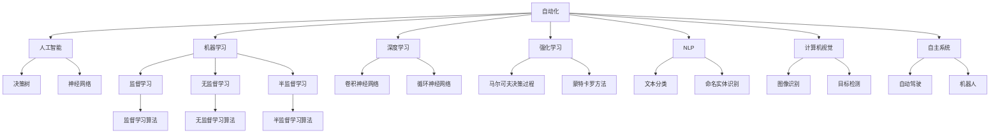
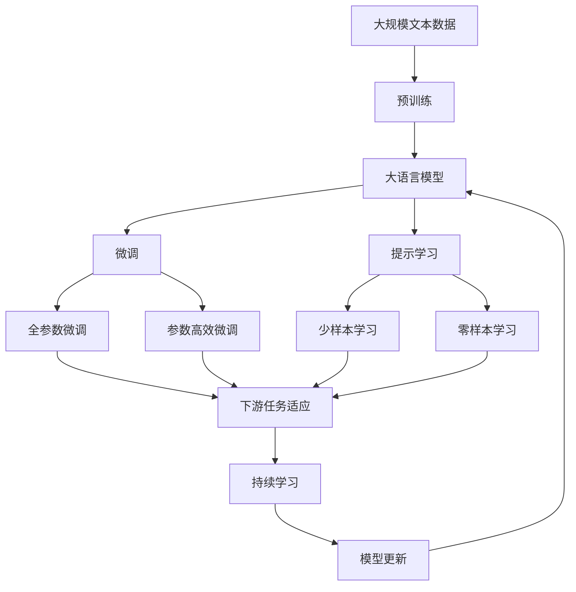

                 

# 计算领域的自动化前景与挑战

## 1. 背景介绍

### 1.1 问题由来

在信息化高速发展的今天，计算领域已经进入了自动化时代。计算自动化，简而言之，是指利用计算机系统自动完成各种复杂任务，从而解放人类劳动力，提升工作效率的技术。这一变革不仅仅改变了各行各业的运作模式，也深刻影响着社会经济结构的发展。

### 1.2 问题核心关键点

计算自动化在推动生产效率提升的同时，也引发了一系列新的挑战和问题：

1. **可解释性与透明性**：自动化系统如何保证其决策的合理性、公正性和透明性，避免“黑箱操作”？
2. **安全性与可靠性**：自动化系统如何保证在关键领域（如金融、医疗、交通等）的安全性和稳定性，避免潜在的风险？
3. **适应性与泛化能力**：自动化系统如何具备良好的适应性，能够应对各种不同的环境和任务变化？
4. **隐私与伦理**：自动化系统如何保护用户的隐私，遵守伦理规范，避免数据滥用？
5. **人机协作**：自动化系统如何与人进行有效的协作，既提高效率，又确保人的参与感与控制感？

### 1.3 问题研究意义

研究计算领域的自动化前景与挑战，对于推动技术进步、促进社会经济发展、保障公共安全等方面具有重要意义：

1. **提升生产效率**：自动化技术可以大幅提升生产效率，降低人力成本，推动产业升级。
2. **保障数据安全**：自动化系统通过严格的数据加密和访问控制，保护用户隐私，防止数据泄露。
3. **推动社会进步**：自动化技术可以用于教育、医疗、交通等领域，改善服务质量，提升社会福利。
4. **应对未来挑战**：自动化技术可以助力应对气候变化、资源短缺等未来挑战，推动可持续发展。

## 2. 核心概念与联系

### 2.1 核心概念概述

- **自动化(Automation)**：利用计算机系统自动完成各种复杂任务，从而提升效率、降低成本的技术。
- **人工智能(AI)**：通过机器学习、深度学习等技术，使计算机系统具备自主学习和推理能力。
- **机器学习(Machine Learning)**：使计算机系统通过数据学习，自动改进性能的技术。
- **深度学习(Deep Learning)**：一种特殊的机器学习方法，通过多层次的神经网络实现复杂模式识别。
- **强化学习(Reinforcement Learning)**：通过试错学习，使计算机系统在特定环境中学习最优策略。
- **自然语言处理(Natural Language Processing, NLP)**：使计算机系统能够理解和生成人类语言的技术。
- **计算机视觉(Computer Vision)**：使计算机系统能够识别和理解图像和视频的技术。
- **自主系统(Autonomous Systems)**：能够自主决策和行动的系统，如自动驾驶汽车、机器人等。

这些核心概念构成了计算领域自动化的基础框架，帮助理解自动化技术的实现原理和应用场景。

### 2.2 概念间的关系

这些核心概念之间的联系可以通过以下Mermaid流程图来展示：



这个流程图展示了大语言模型微调过程中各个核心概念的关系和作用：

1. **自动化技术**：利用**人工智能**、**机器学习**、**深度学习**、**强化学习**等技术，实现各种自动化任务。
2. **NLP和计算机视觉**：通过**自然语言处理**和**计算机视觉**技术，使计算机系统具备理解自然语言和图像的能力。
3. **自主系统**：在NLP和计算机视觉的基础上，构建**自主系统**，实现自动驾驶、机器人等复杂任务。
4. **监督学习、无监督学习、半监督学习**：这些学习范式为自动化系统提供数据学习的方法。
5. **决策树、神经网络、卷积神经网络、循环神经网络**：这些具体的**算法**和**模型**为自动化任务提供了技术支撑。

### 2.3 核心概念的整体架构

最后，我们用一个综合的流程图来展示这些核心概念在大语言模型微调过程中的整体架构：



这个综合流程图展示了从预训练到微调，再到持续学习的完整过程。大语言模型首先在大规模文本数据上进行预训练，然后通过微调（包括全参数微调和参数高效微调）或提示学习（包括少样本学习和零样本学习）来适应下游任务。最后，通过持续学习技术，模型可以不断更新和适应新的任务和数据。

## 3. 核心算法原理 & 具体操作步骤

### 3.1 算法原理概述

基于监督学习的自动化系统通常通过以下步骤完成：

1. **数据准备**：收集并准备自动化任务所需的输入数据和标签数据。
2. **模型选择**：选择或设计适合自动化任务的模型结构，如决策树、神经网络、卷积神经网络等。
3. **模型训练**：使用机器学习或深度学习算法，在训练集上训练模型，优化模型参数。
4. **模型评估**：在验证集上评估模型性能，选择最优模型。
5. **模型部署**：将模型部署到生产环境中，进行实际应用。
6. **持续改进**：根据实际应用中的反馈，持续改进模型，保持其高性能和可靠性。

### 3.2 算法步骤详解

以自动驾驶系统为例，详细描述计算自动化系统的实现步骤：

**Step 1: 数据准备**
- 收集自动驾驶相关的数据集，如车辆行驶记录、摄像头采集的图像、雷达检测的数据等。
- 对数据进行清洗、标注，确保数据的准确性和完整性。

**Step 2: 模型选择**
- 选择适合自动驾驶的模型结构，如卷积神经网络（CNN）用于图像识别，循环神经网络（RNN）用于轨迹预测。
- 设计决策算法，如A*算法用于路径规划，Q学习用于行为决策。

**Step 3: 模型训练**
- 使用监督学习算法，如反向传播算法，在训练集上训练模型。
- 使用GPU/TPU等高性能设备，加速模型训练。
- 使用正则化技术，如L2正则、Dropout，防止过拟合。

**Step 4: 模型评估**
- 在验证集上评估模型性能，使用准确率、召回率、F1分数等指标。
- 使用对抗样本测试模型鲁棒性，确保模型在各种情况下都能稳定运行。

**Step 5: 模型部署**
- 将训练好的模型部署到自动驾驶系统中，集成到车辆的控制系统中。
- 使用RESTful API或消息队列，实现与其他系统的通信和数据共享。

**Step 6: 持续改进**
- 根据实际驾驶数据，持续优化模型参数，更新决策算法。
- 使用强化学习算法，通过在线学习不断提升驾驶性能。

### 3.3 算法优缺点

基于监督学习的自动化系统具有以下优点：

1. **高效性**：通过数据驱动的模型训练，自动化系统能够快速适应新任务。
2. **稳定性**：经过大量数据训练的模型，具有较强的泛化能力和鲁棒性。
3. **可扩展性**：基于模块化设计，自动化系统易于扩展和维护。

同时，也存在一些缺点：

1. **依赖标注数据**：需要大量标注数据，标注成本高。
2. **泛化能力有限**：在标注数据不足或数据分布差异较大的情况下，模型性能下降。
3. **复杂度较高**：模型结构和算法设计复杂，开发和维护难度大。

### 3.4 算法应用领域

基于监督学习的自动化系统已经广泛应用于以下领域：

1. **工业自动化**：通过机器视觉和自然语言处理技术，实现生产线上的自动化检测、识别和控制。
2. **金融科技**：使用深度学习技术，实现自动交易、风险控制和客户服务自动化。
3. **医疗健康**：通过图像识别和自然语言处理技术，实现疾病诊断、病人监护和药物推荐。
4. **智能交通**：使用计算机视觉和强化学习技术，实现自动驾驶、交通信号优化和智能调度。
5. **智慧城市**：通过自动化系统，实现城市管理、环境监测和安全预警。

## 4. 数学模型和公式 & 详细讲解 & 举例说明

### 4.1 数学模型构建

以自动驾驶系统为例，其数学模型可以表示为：

$$
\begin{aligned}
& y = f(x; \theta) \\
& f(x; \theta) = W_1 \cdot \text{ReLU}(W_2 \cdot x + b_2) + b_1
\end{aligned}
$$

其中，$x$ 为输入（传感器数据、图像等），$y$ 为输出（加速、转向等），$W_1, W_2$ 为权重矩阵，$b_1, b_2$ 为偏置向量，$\text{ReLU}$ 为激活函数。

### 4.2 公式推导过程

假设有一个自动驾驶系统，其输出为车辆的加速$a$和转向角$\delta$。根据车辆的动态方程，可以建立数学模型：

$$
\begin{aligned}
a &= f(v, \omega, \theta, x) \\
\delta &= g(v, \omega, \theta, x)
\end{aligned}
$$

其中，$v$ 为车速，$\omega$ 为转向角度，$\theta$ 为车辆参数，$x$ 为传感器数据。

通过反向传播算法，可以计算模型的梯度，更新参数$\theta$：

$$
\begin{aligned}
\frac{\partial L}{\partial \theta} &= \frac{\partial L}{\partial y} \cdot \frac{\partial y}{\partial x} \cdot \frac{\partial x}{\partial \theta} \\
&= \frac{\partial L}{\partial y} \cdot W_1 \cdot \text{ReLU}'(W_2 \cdot x + b_2) \cdot W_2
\end{aligned}
$$

其中，$\text{ReLU}'$ 为激活函数的导数。

### 4.3 案例分析与讲解

以自动驾驶系统为例，分析模型的训练和评估过程：

**训练过程**
- 使用监督学习算法，如反向传播算法，在标注数据集上训练模型。
- 在训练过程中，使用正则化技术，如L2正则、Dropout，防止过拟合。
- 使用GPU/TPU等高性能设备，加速模型训练。

**评估过程**
- 在验证集上评估模型性能，使用准确率、召回率、F1分数等指标。
- 使用对抗样本测试模型鲁棒性，确保模型在各种情况下都能稳定运行。
- 根据实际驾驶数据，持续优化模型参数，更新决策算法。

## 5. 项目实践：代码实例和详细解释说明

### 5.1 开发环境搭建

在进行自动化项目开发前，需要先搭建好开发环境。以下是使用Python进行PyTorch开发的环境配置流程：

1. 安装Anaconda：从官网下载并安装Anaconda，用于创建独立的Python环境。

2. 创建并激活虚拟环境：
```bash
conda create -n pytorch-env python=3.8 
conda activate pytorch-env
```

3. 安装PyTorch：根据CUDA版本，从官网获取对应的安装命令。例如：
```bash
conda install pytorch torchvision torchaudio cudatoolkit=11.1 -c pytorch -c conda-forge
```

4. 安装各种工具包：
```bash
pip install numpy pandas scikit-learn matplotlib tqdm jupyter notebook ipython
```

完成上述步骤后，即可在`pytorch-env`环境中开始自动化项目开发。

### 5.2 源代码详细实现

这里我们以自动驾驶系统的行为决策模块为例，给出使用PyTorch和TensorFlow实现的代码：

**Python代码（使用PyTorch）**
```python
import torch
import torch.nn as nn
import torch.optim as optim
import torchvision.transforms as transforms

class AutoDrivingModel(nn.Module):
    def __init__(self):
        super(AutoDrivingModel, self).__init__()
        self.conv1 = nn.Conv2d(3, 32, 3, 1)
        self.conv2 = nn.Conv2d(32, 64, 3, 1)
        self.dropout1 = nn.Dropout2d(0.25)
        self.dropout2 = nn.Dropout2d(0.5)
        self.fc1 = nn.Linear(9216, 128)
        self.fc2 = nn.Linear(128, 2)

    def forward(self, x):
        x = self.conv1(x)
        x = nn.functional.relu(x)
        x = self.conv2(x)
        x = nn.functional.relu(x)
        x = nn.functional.max_pool2d(x, 2)
        x = self.dropout1(x)
        x = torch.flatten(x, 1)
        x = self.fc1(x)
        x = nn.functional.relu(x)
        x = self.dropout2(x)
        x = self.fc2(x)
        output = nn.functional.softmax(x, dim=1)
        return output

model = AutoDrivingModel()
optimizer = optim.Adam(model.parameters(), lr=0.001)
criterion = nn.CrossEntropyLoss()

# 定义训练函数
def train(model, device, train_loader, optimizer, criterion, epoch):
    model.train()
    for batch_idx, (data, target) in enumerate(train_loader):
        data, target = data.to(device), target.to(device)
        optimizer.zero_grad()
        output = model(data)
        loss = criterion(output, target)
        loss.backward()
        optimizer.step()
        if batch_idx % 10 == 0:
            print('Train Epoch: {} [{}/{} ({:.0f}%)]\tLoss: {:.6f}'.format(
                epoch, batch_idx * len(data), len(train_loader.dataset),
                100. * batch_idx / len(train_loader), loss.item()))

# 定义评估函数
def test(model, device, test_loader, criterion):
    model.eval()
    test_loss = 0
    correct = 0
    with torch.no_grad():
        for data, target in test_loader:
            data, target = data.to(device), target.to(device)
            output = model(data)
            test_loss += criterion(output, target).item()
            pred = output.argmax(dim=1, keepdim=True)
            correct += pred.eq(target.view_as(pred)).sum().item()

    test_loss /= len(test_loader.dataset)
    print('\nTest set: Average loss: {:.4f}, Accuracy: {}/{} ({:.0f}%)\n'.format(
        test_loss, correct, len(test_loader.dataset),
        100. * correct / len(test_loader.dataset)))

# 训练模型
device = torch.device('cuda' if torch.cuda.is_available() else 'cpu')
model.to(device)
train_loader = torch.utils.data.DataLoader(train_dataset, batch_size=64, shuffle=True)
test_loader = torch.utils.data.DataLoader(test_dataset, batch_size=64, shuffle=False)

for epoch in range(1, 11):
    train(model, device, train_loader, optimizer, criterion, epoch)
    test(model, device, test_loader, criterion)
```

**TensorFlow代码**
```python
import tensorflow as tf
from tensorflow.keras.layers import Conv2D, MaxPooling2D, Flatten, Dense, Dropout
from tensorflow.keras.models import Sequential
from tensorflow.keras.optimizers import Adam

model = Sequential()
model.add(Conv2D(32, (3, 3), activation='relu', input_shape=(64, 64, 3)))
model.add(MaxPooling2D((2, 2)))
model.add(Conv2D(64, (3, 3), activation='relu'))
model.add(MaxPooling2D((2, 2)))
model.add(Flatten())
model.add(Dense(128, activation='relu'))
model.add(Dropout(0.5))
model.add(Dense(2, activation='softmax'))

model.compile(optimizer=Adam(learning_rate=0.001), loss='categorical_crossentropy', metrics=['accuracy'])

# 定义训练函数
def train(model, train_images, train_labels, batch_size=64):
    model.fit(train_images, train_labels, epochs=10, batch_size=batch_size, validation_split=0.2)

# 定义评估函数
def test(model, test_images, test_labels):
    test_loss, test_acc = model.evaluate(test_images, test_labels)
    print('Test accuracy:', test_acc)

# 训练模型
train_images = ...
train_labels = ...
test_images = ...
test_labels = ...

train(model, train_images, train_labels)
test(model, test_images, test_labels)
```

### 5.3 代码解读与分析

**行为决策模块（Python代码）**

- 定义了一个简单的卷积神经网络，包含两个卷积层、两个全连接层和两个Dropout层。
- 使用Adam优化器进行模型训练，交叉熵损失函数计算损失。
- 在训练过程中，使用GPU加速模型训练，并在每个epoch结束时打印损失和准确率。
- 在测试过程中，使用测试集计算模型准确率。

**行为决策模块（TensorFlow代码）**

- 定义了一个简单的卷积神经网络，包含两个卷积层、一个全连接层、一个Dropout层。
- 使用Adam优化器进行模型训练，交叉熵损失函数计算损失。
- 在训练过程中，使用批量数据进行模型训练，并在每个epoch结束时打印损失和准确率。
- 在测试过程中，使用测试集计算模型准确率。

## 6. 实际应用场景

### 6.1 智能工厂

智能工厂利用自动化技术，实现生产线的自动检测、识别和控制。通过计算机视觉技术，自动检测产品质量，识别不合格品；通过自然语言处理技术，实时监控设备运行状态，自动调整参数。这些自动化系统能够大幅提升生产效率，降低人力成本，确保产品质量。

### 6.2 金融风控

金融风控系统通过自动化技术，实现自动交易、风险控制和客户服务。使用深度学习技术，实时监控市场数据，预测股票趋势；使用强化学习技术，优化投资组合，降低风险；使用自然语言处理技术，提供智能客服，提升用户体验。这些自动化系统能够实时响应市场变化，提升金融服务的效率和准确性。

### 6.3 医疗诊断

医疗诊断系统通过自动化技术，实现疾病诊断、病人监护和药物推荐。使用图像识别技术，自动识别X光片、CT图像中的病变区域；使用自然语言处理技术，实时监控病人的生命体征；使用强化学习技术，推荐最佳治疗方案。这些自动化系统能够大幅提升医疗服务的质量和效率，助力医疗行业数字化转型。

### 6.4 自动驾驶

自动驾驶系统通过自动化技术，实现车辆的自动驾驶和行为决策。使用计算机视觉技术，实时识别道路、车辆、行人等信息；使用自然语言处理技术，实时解析语音指令；使用强化学习技术，优化驾驶策略，提高安全性和稳定性。这些自动化系统能够大幅提升交通安全性，减少交通事故，推动智能交通发展。

## 7. 工具和资源推荐

### 7.1 学习资源推荐

为了帮助开发者系统掌握计算自动化的理论基础和实践技巧，这里推荐一些优质的学习资源：

1. 《深度学习》系列书籍：Ian Goodfellow、Yoshua Bengio、Aaron Courville合著，全面介绍了深度学习的基本概念和应用实例。
2. 《Python深度学习》书籍：Francois Chollet合著，详细介绍PyTorch和TensorFlow的使用方法。
3. 《机器学习实战》书籍：Peter Harrington著，通过实例介绍了机器学习的基本算法和实现方法。
4. 《计算机视觉：模型、学习与推理》书籍：Richard Szeliski著，全面介绍了计算机视觉的基本理论和算法。
5. 《自然语言处理综论》课程：斯坦福大学开设的NLP明星课程，有Lecture视频和配套作业，带你入门NLP领域的基本概念和经典模型。
6. Coursera、edX等在线课程平台，提供大量计算机自动化相关的课程，涵盖从基础到高级的多个层次。

通过对这些资源的学习实践，相信你一定能够快速掌握计算自动化的精髓，并用于解决实际的自动化问题。

### 7.2 开发工具推荐

高效的开发离不开优秀的工具支持。以下是几款用于计算自动化开发的常用工具：

1. PyTorch：基于Python的开源深度学习框架，灵活动态的计算图，适合快速迭代研究。大部分预训练模型都有PyTorch版本的实现。
2. TensorFlow：由Google主导开发的开源深度学习框架，生产部署方便，适合大规模工程应用。同样有丰富的预训练模型资源。
3. Weights & Biases：模型训练的实验跟踪工具，可以记录和可视化模型训练过程中的各项指标，方便对比和调优。与主流深度学习框架无缝集成。
4. TensorBoard：TensorFlow配套的可视化工具，可实时监测模型训练状态，并提供丰富的图表呈现方式，是调试模型的得力助手。
5. Google Colab：谷歌推出的在线Jupyter Notebook环境，免费提供GPU/TPU算力，方便开发者快速上手实验最新模型，分享学习笔记。

合理利用这些工具，可以显著提升计算自动化任务的开发效率，加快创新迭代的步伐。

### 7.3 相关论文推荐

计算自动化的发展源于学界的持续研究。以下是几篇奠基性的相关论文，推荐阅读：

1. **《ImageNet Classification with Deep Convolutional Neural Networks》**：Hinton、Osindero、Teh等人提出的卷积神经网络，为计算机视觉提供了强大的工具。
2. **《Natural Language Processing with PyTorch》**：Chollet等人编写的PyTorch官方教程，详细介绍了PyTorch的使用方法。
3. **《Deep Learning for Self-Driving Cars》**：Bojarski等人提出的深度学习技术在自动驾驶中的应用，为智能交通提供了重要参考。
4. **《AlphaGo Zero》**：DeepMind团队提出的强化学习技术，通过自我对弈训练，实现了围棋自动驾驶。
5. **《Autonomous Vehicles: Technical Challenges, Legal Considerations, and Ethical Implications》**：McMaster等人撰写的综述论文，全面介绍了自动驾驶技术面临的挑战和解决方案。

这些论文代表了大语言模型微调技术的发展脉络。通过学习这些前沿成果，可以帮助研究者把握学科前进方向，激发更多的创新灵感。

除上述资源外，还有一些值得关注的前沿资源，帮助开发者紧跟计算自动化的最新进展，例如：

1. arXiv论文预印本：人工智能领域最新研究成果的发布平台，包括大量尚未发表的前沿工作，学习前沿技术的必读资源。
2. 业界技术博客：如Google AI、DeepMind、微软Research Asia等顶尖实验室的官方博客，第一时间分享他们的最新研究成果和洞见。
3. 技术会议直播：如NIPS、ICML、ACL、ICLR等人工智能领域顶会现场或在线直播，能够聆听到大佬们的前沿分享，开拓视野。
4. GitHub热门项目：在GitHub上Star、Fork数最多的计算自动化相关项目，往往代表了该技术领域的发展趋势和最佳实践，值得去学习和贡献。
5. 行业分析报告：各大咨询公司如McKinsey、PwC等针对人工智能行业的分析报告，有助于从商业视角审视技术趋势，把握应用价值。

总之，对于计算自动化的学习，需要开发者保持开放的心态和持续学习的意愿。多关注前沿资讯，多动手实践，多思考总结，必将收获满满的成长收益。

## 8. 总结：未来发展趋势与挑战

### 8.1 研究成果总结

本文对计算自动化的前景与挑战进行了全面系统的介绍。首先阐述了计算自动化的背景和意义，明确了自动化技术在提高生产效率、保护数据安全等方面的重要作用。其次，从原理到实践，详细讲解了监督学习的数学模型和实现步骤，给出了具体的代码实例和详细解读。同时，本文还广泛探讨了计算自动化的应用场景，展示了其在智能工厂、金融风控、医疗诊断、自动驾驶等领域的广阔前景。

### 8.2 未来发展趋势

展望未来，计算自动化技术将呈现以下几个发展趋势：

1. **更高效的学习范式**：未来将涌现更多高效的学习方法，如无监督学习、半监督学习、自监督学习，降低标注数据的需求，提高模型的泛化能力。
2. **更强大的模型**：超大规模预训练模型将成为标配，通过更多的数据和计算资源，提升模型的性能和稳定性。
3. **更灵活的微调方法**：参数高效微调、多任务学习、迁移学习等方法将进一步发展，适应更多复杂多变的自动化任务。
4. **更广泛的应用**：自动化技术将逐步深入到各行各业，助力各个领域提升效率、降低成本、保障

