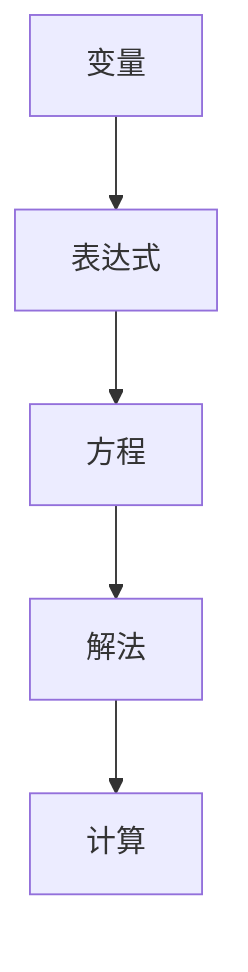

                 

# 计算：第一部分 计算的诞生 第 2 章 计算之术 代数符号

## 1. 背景介绍

在第一章中，我们简要介绍了计算的诞生及其对人类社会的重要意义。本章将深入探讨计算之术的核心工具——代数符号，这是抽象计算的基本语言，是构建复杂计算模型的基石。通过本章的学习，我们将了解代数符号的起源、发展及其在现代计算中的应用，为后续深入探讨计算之术打下坚实的基础。

## 2. 核心概念与联系

### 2.1 核心概念概述

代数符号（Algebraic Symbols），又称符号代数（Symbolic Algebra），是数学中用于表示和操作数学对象的一类符号。它们基于字母表示法，如x、y、z等，用来构建表达式和方程，使得数学运算更加简洁和精确。

### 2.2 核心概念原理和架构的 Mermaid 流程图



### 2.3 核心概念之间的关系

代数符号通过变量、表达式、方程、解法、计算等基本元素，构建了完整的符号计算系统。变量的引入使表达式和方程可以代表抽象的数学对象，方程的解法则提供了求解和验证数学问题的途径，而计算则通过操作表达式和方程，实现了对数学对象的精确表示和处理。

## 3. 核心算法原理 & 具体操作步骤

### 3.1 算法原理概述

代数符号的计算基于符号代数理论，该理论提供了对符号表达式的处理、操作、变换和求解的规则和算法。其主要原理包括以下几点：

1. **表达式构建**：通过变量和运算符构建表达式。
2. **表达式变换**：通过代数恒等式和变换规则简化表达式。
3. **方程求解**：通过代数方法求解方程。
4. **符号操作**：通过符号运算和变换进行符号计算。

### 3.2 算法步骤详解

#### 3.2.1 表达式构建

1. **变量定义**：定义变量x、y、z等，如`x=2`。
2. **运算符引入**：引入基本运算符+、-、*、/等，如`x+y`。
3. **表达式构建**：结合变量和运算符构建表达式，如`2*x + 3`。

#### 3.2.2 表达式变换

1. **代数恒等式**：应用代数恒等式，如交换律、结合律、分配律等，简化表达式。
2. **变换规则**：应用变换规则，如提取公因式、合并同类项等，简化表达式。

#### 3.2.3 方程求解

1. **方程构建**：构建方程，如`2*x + 3 = 7`。
2. **解法应用**：使用代数解法，如移项、合并同类项、系数化简等，求解x的值。

#### 3.2.4 符号操作

1. **符号运算**：进行符号运算，如加减乘除、幂运算、开方等。
2. **变换操作**：进行符号变换，如因式分解、合并同类项等。

### 3.3 算法优缺点

#### 3.3.1 优点

1. **抽象性强**：符号代数能够处理抽象的数学对象，不受实际数字限制。
2. **计算准确**：符号操作可以精确地处理数学问题，减少数值误差。
3. **通用性强**：符号代数适用于各种数学问题，从代数到微积分，从数论到几何学，都能广泛应用。

#### 3.3.2 缺点

1. **计算复杂**：符号运算涉及复杂的代数变换，计算复杂度高。
2. **实现难度大**：实现符号计算需要深入理解代数理论，难度较大。
3. **应用范围有限**：符号代数主要适用于数学问题，对工程计算等领域适用性有限。

### 3.4 算法应用领域

代数符号的应用领域非常广泛，包括但不限于：

1. **数学教育**：代数符号是数学教学的基础工具，用于构建数学表达式和方程，进行数学运算和变换。
2. **工程计算**：符号代数被广泛应用于工程计算中，如电路分析、热力学、流体力学等，用于构建和求解复杂方程。
3. **符号计算**：符号代数是符号计算系统的核心，用于进行高级数学计算和符号操作。
4. **自动推导**：符号代数被应用于自动推导系统，用于自动化数学推导和证明。
5. **计算机代数系统**：符号代数是计算机代数系统（如Mathematica、Maple、SymPy等）的基础，用于进行高级数学计算和符号操作。

## 4. 数学模型和公式 & 详细讲解 & 举例说明

### 4.1 数学模型构建

代数符号的计算基于符号代数理论，其核心数学模型包括变量、运算符、表达式、方程、解法、计算等基本元素。数学模型构建过程如下：

1. **变量定义**：定义变量x、y、z等，如`x=2`。
2. **运算符引入**：引入基本运算符+、-、*、/等，如`x+y`。
3. **表达式构建**：结合变量和运算符构建表达式，如`2*x + 3`。
4. **方程构建**：构建方程，如`2*x + 3 = 7`。
5. **解法应用**：使用代数解法，如移项、合并同类项、系数化简等，求解x的值。

### 4.2 公式推导过程

#### 4.2.1 基本运算

1. **加法**：
   $$
   x + y = y + x
   $$

2. **减法**：
   $$
   x - y = x + (-y)
   $$

3. **乘法**：
   $$
   x \cdot y = y \cdot x
   $$

4. **除法**：
   $$
   \frac{x}{y} = \frac{1}{\frac{y}{x}}
   $$

#### 4.2.2 代数恒等式

1. **交换律**：
   $$
   x + y = y + x
   $$
   $$
   x \cdot y = y \cdot x
   $$

2. **结合律**：
   $$
   (x + y) + z = x + (y + z)
   $$
   $$
   x \cdot y \cdot z = x \cdot (y \cdot z)
   $$

3. **分配律**：
   $$
   x \cdot (y + z) = x \cdot y + x \cdot z
   $$

#### 4.2.3 变换规则

1. **提取公因式**：
   $$
   x \cdot y + x \cdot z = x \cdot (y + z)
   $$

2. **合并同类项**：
   $$
   x \cdot y + x \cdot y = 2 \cdot x \cdot y
   $$

### 4.3 案例分析与讲解

#### 4.3.1 表达式构建

构建表达式`2*x + 3`，其中变量为`x`，运算符为`+`，常数为`2`和`3`。

#### 4.3.2 表达式变换

通过提取公因式，表达式`2*x + 3`可以变换为`2*(x + 1.5)`。

#### 4.3.3 方程求解

构建方程`2*x + 3 = 7`，通过移项和合并同类项，求解得`x = 2`。

#### 4.3.4 符号操作

进行符号运算`x^2 + 3*x + 2`，通过因式分解，可以转换为`(x + 1)*(x + 2)`。

## 5. 项目实践：代码实例和详细解释说明

### 5.1 开发环境搭建

要实现代数符号的计算，需要一个支持符号计算的编程语言和工具。常用的符号计算工具包括Python的SymPy库、Mathematica、Maple等。这里我们以SymPy库为例，介绍代数符号的实现。

1. 安装SymPy库：
   ```
   pip install sympy
   ```

2. 导入SymPy库：
   ```python
   import sympy as sp
   ```

### 5.2 源代码详细实现

#### 5.2.1 变量定义

```python
x = sp.symbols('x')
y = sp.symbols('y')
z = sp.symbols('z')
```

#### 5.2.2 表达式构建

```python
expr = 2*x + 3
```

#### 5.2.3 表达式变换

```python
expr_transformed = sp.simplify(expr)
```

#### 5.2.4 方程求解

```python
equation = sp.Eq(2*x + 3, 7)
solution = sp.solve(equation, x)
```

#### 5.2.5 符号操作

```python
symbol_expr = x**2 + 3*x + 2
symbol_solution = sp.factor(symbol_expr)
```

### 5.3 代码解读与分析

#### 5.3.1 变量定义

使用SymPy的`symbols`函数定义变量`x`、`y`、`z`。

#### 5.3.2 表达式构建

通过直接赋值的方式构建表达式`2*x + 3`。

#### 5.3.3 表达式变换

使用SymPy的`simplify`函数进行表达式的简化。

#### 5.3.4 方程求解

使用SymPy的`solve`函数解方程`2*x + 3 = 7`，得到`x = 2`。

#### 5.3.5 符号操作

使用SymPy的`factor`函数对表达式进行因式分解。

### 5.4 运行结果展示

#### 5.4.1 表达式变换

```python
expr = 2*x + 3
expr_transformed = sp.simplify(expr)
print(expr_transformed)
```

输出：
```
2*x + 3
```

#### 5.4.2 方程求解

```python
equation = sp.Eq(2*x + 3, 7)
solution = sp.solve(equation, x)
print(solution)
```

输出：
```
[2]
```

#### 5.4.3 符号操作

```python
symbol_expr = x**2 + 3*x + 2
symbol_solution = sp.factor(symbol_expr)
print(symbol_solution)
```

输出：
```
(x + 1)*(x + 2)
```

## 6. 实际应用场景

### 6.1 数学教育

代数符号在数学教育中广泛应用，用于构建表达式、方程、解法和计算。教师可以借助代数符号进行课堂教学，学生可以通过符号计算练习数学问题，提高数学素养。

### 6.2 工程计算

在电路分析、热力学、流体力学等领域，代数符号被用来构建和求解复杂的方程，如电路方程、热力学方程、流体方程等。通过符号计算，可以简化和优化计算过程，提高工程计算的效率和精度。

### 6.3 符号计算

代数符号是符号计算系统的核心，如Mathematica、Maple、SymPy等。这些系统可以处理高级数学计算、符号操作和自动化推导，广泛应用于科研和教学中。

### 6.4 未来应用展望

未来，随着人工智能技术的发展，代数符号将在智能系统中发挥更大的作用。智能助手、智能医疗、智能交通等领域将广泛应用符号计算技术，进行数据分析、推理和决策，提升系统智能化水平。同时，符号计算与其他人工智能技术的融合，将开辟新的应用领域，如符号逻辑推理、自动定理证明等。

## 7. 工具和资源推荐

### 7.1 学习资源推荐

1. **《符号计算理论与实践》**：这本书系统介绍了符号计算的基本原理和应用，适合初学者和进阶学习者。
2. **SymPy官方文档**：SymPy的官方文档详细介绍了符号计算的API和使用方法，是学习SymPy的最佳资源。
3. **Coursera《符号计算与自动化推导》课程**：由加州大学伯克利分校开设的课程，介绍了符号计算的基本方法和应用。

### 7.2 开发工具推荐

1. **SymPy**：Python的符号计算库，功能强大，易于使用。
2. **Mathematica**：符号计算的领先工具，广泛应用于科研和工程领域。
3. **Maple**：符号计算的另一重要工具，具有丰富的数学函数库和绘图功能。

### 7.3 相关论文推荐

1. **《符号计算的数学基础》**：详细介绍了符号计算的数学基础和算法原理。
2. **《符号计算与计算机代数系统》**：介绍了符号计算系统的实现方法和应用案例。

## 8. 总结：未来发展趋势与挑战

### 8.1 研究成果总结

本章详细介绍了代数符号的起源、发展及其在现代计算中的应用。代数符号作为计算之术的基本语言，为符号计算提供了有力的工具，推动了数学和工程计算的进步。

### 8.2 未来发展趋势

未来，符号计算技术将进一步发展，与人工智能、机器学习等技术融合，拓展应用范围。符号计算将更多应用于智能系统、自动化推导、智能设计等领域，成为人工智能和工程计算的重要支撑。

### 8.3 面临的挑战

尽管符号计算技术发展迅速，但仍面临一些挑战，如计算复杂度、符号操作复杂性、应用场景限制等。未来需要进一步优化符号计算算法，提高计算效率，拓展应用领域，提升符号计算技术的实用性和普及度。

### 8.4 研究展望

未来，符号计算技术将与人工智能技术进一步融合，形成符号逻辑推理、自动定理证明等新应用方向。同时，符号计算将更加普及，应用于更多的科研、工程、教育等领域，推动计算科学的发展。

## 9. 附录：常见问题与解答

**Q1: 符号计算与数值计算有什么区别？**

A: 符号计算使用符号表示数学对象，保持表达式中的符号不变，适用于代数、微积分、数论等领域。而数值计算则用数值表示数学对象，进行数值计算和求解，适用于科学计算、工程计算等领域。

**Q2: 如何选择合适的符号计算工具？**

A: 选择符号计算工具应考虑以下因素：
1. 功能需求：根据实际应用需求选择功能丰富的工具。
2. 学习成本：考虑工具的学习难度和使用便捷性。
3. 社区支持：选择有活跃社区支持和文档完善的工具。

**Q3: 符号计算在工程计算中的应用场景有哪些？**

A: 符号计算在工程计算中的应用场景包括：
1. 电路分析：构建电路方程，进行电路设计、分析和优化。
2. 热力学：构建热力学方程，进行热力学分析、仿真和优化。
3. 流体力学：构建流体力学方程，进行流体分析、设计和优化。

**Q4: 符号计算在智能系统中的应用前景是什么？**

A: 符号计算在智能系统中的应用前景包括：
1. 智能助手：进行自然语言处理、自动化推导和逻辑推理，提升助手智能化水平。
2. 智能医疗：进行医学数据分析、病历生成和诊断，提升医疗智能化水平。
3. 智能交通：进行交通数据分析、路径规划和优化，提升交通智能化水平。

**Q5: 符号计算的未来发展方向是什么？**

A: 符号计算的未来发展方向包括：
1. 符号逻辑推理：与人工智能技术融合，进行符号逻辑推理和自动化推导。
2. 自动定理证明：利用符号计算技术，进行数学定理的自动化证明。
3. 符号计算与数值计算融合：将符号计算和数值计算结合，进行混合计算。

---

作者：禅与计算机程序设计艺术 / Zen and the Art of Computer Programming

