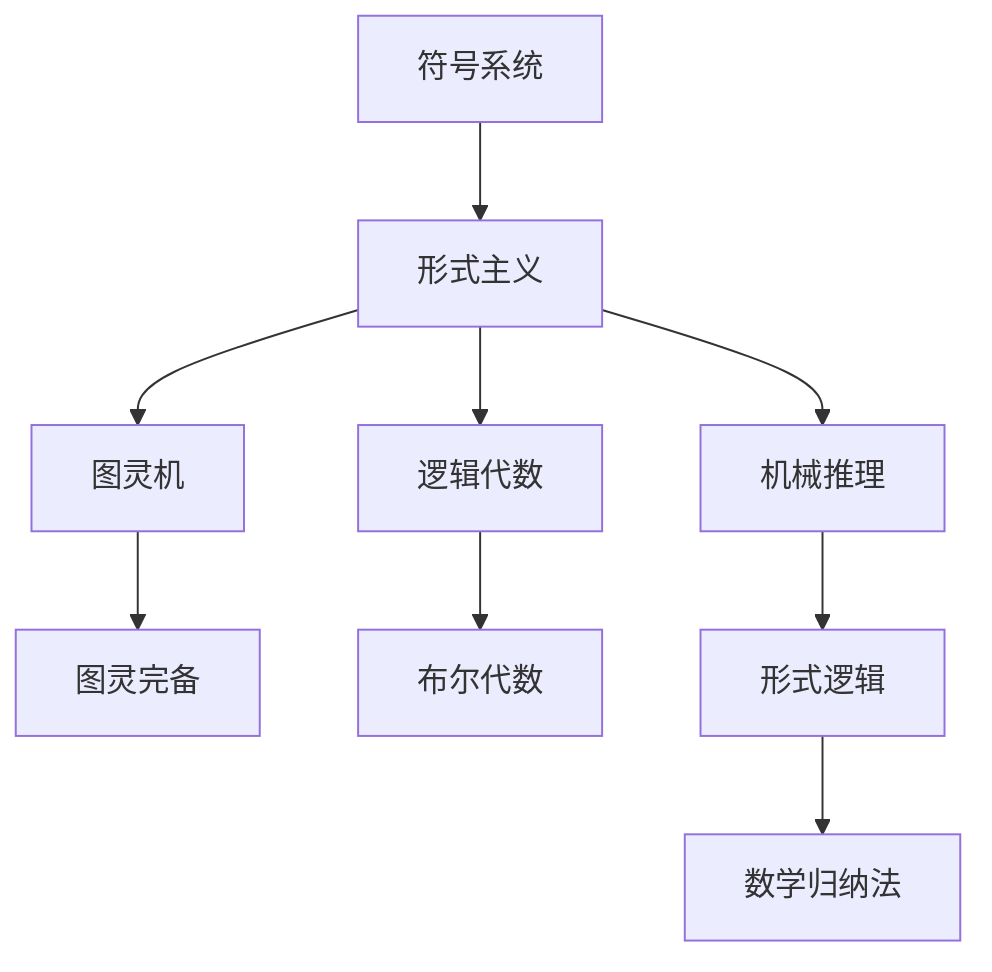
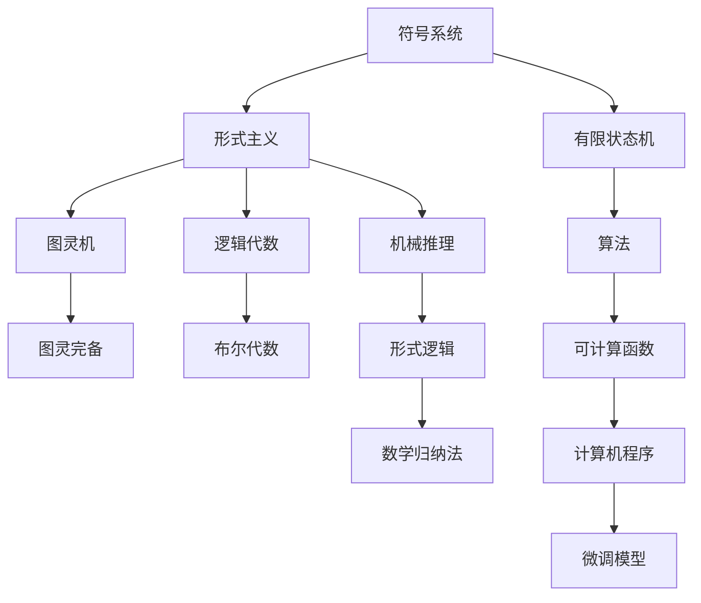

                 

# 计算：第一部分 计算的诞生 第 2 章 计算之术 代数：字符的计算

> 关键词：计算术，代数，字符计算，符号系统，形式主义，Turing机，图灵完备，机械推理，逻辑代数，布尔代数，有限状态机，形式逻辑，数学归纳法

## 1. 背景介绍

### 1.1 问题由来
在第一章中，我们探讨了计算的基本概念和计算的形式化定义。今天，我们继续深入计算的内部逻辑，特别是代数在计算中的作用。我们不仅需要知道如何进行计算，还需要知道如何组织和表达计算，使之成为可理解、可复制和可验证的过程。

### 1.2 问题核心关键点
这一章的焦点是代数在计算中的作用，特别是如何使用符号系统和形式逻辑来表达和计算复杂数学表达式。我们将详细讨论代数的基础知识和符号系统的基本原理，以及它们如何应用于计算过程。

### 1.3 问题研究意义
理解代数在计算中的作用，对于深入研究计算的本质和计算的应用至关重要。代数不仅仅是数学的工具，更是理解和构建计算系统的基础。通过学习代数，我们可以更深入地理解计算的逻辑和结构，从而更好地设计、实现和优化计算系统。

## 2. 核心概念与联系

### 2.1 核心概念概述

在本节中，我们将介绍几个与代数相关的核心概念及其相互联系：

- **符号系统(Symbolic Systems)**：使用符号和操作符来表示和操作对象的系统，用于表达复杂的数学表达式。
- **形式主义(Formalism)**：一种抽象的表达方式，使用符号和规则来定义和操作对象，使得计算过程可以被准确地描述和理解。
- **图灵机(Turing Machines)**：一种理论模型，用于描述计算的抽象过程，能够执行任意可计算的任务。
- **图灵完备(Turing Completeness)**：一个系统如果能够表达和计算任意可计算函数，则称其为图灵完备。
- **机械推理(Mechanical Reasoning)**：使用机械过程（如算法）来自动推导和验证数学证明，是计算的重要应用。
- **逻辑代数(Algebra of Logic)**：使用符号和运算符来表达和计算逻辑表达式，是形式主义的重要组成部分。
- **布尔代数(Boolean Algebra)**：一种特殊类型的逻辑代数，用于处理二值逻辑表达式。
- **有限状态机(Finite State Machines)**：一种状态驱动的计算模型，用于描述具有有限状态集合的系统。
- **形式逻辑(Formal Logic)**：使用形式化的规则和符号来表达和验证逻辑推理，是机械推理的基础。
- **数学归纳法(Mathematical Induction)**：一种基于数学证明的推理方法，用于证明数学定理的正确性。

### 2.2 概念间的关系

这些核心概念之间的关系可以通过以下Mermaid流程图来展示：



这个流程图展示了符号系统、形式主义、图灵机、逻辑代数、布尔代数、机械推理、形式逻辑和数学归纳法之间的关系：

1. 符号系统是形式主义的基础，形式主义是表达计算过程的工具。
2. 图灵机是计算的抽象模型，用于描述计算过程的可行性。
3. 图灵完备描述了系统的计算能力。
4. 逻辑代数和布尔代数是形式主义的重要组成部分，用于处理和计算逻辑表达式。
5. 机械推理是计算的一种应用，使用形式化的规则来自动推导和验证数学证明。
6. 形式逻辑是机械推理的基础，用于定义和操作符号系统。
7. 数学归纳法是形式逻辑的一种推理方法，用于证明数学定理的正确性。

这些概念共同构成了计算的基础，使得计算过程可以被系统地描述、理解和验证。

### 2.3 核心概念的整体架构

最后，我们用一个综合的流程图来展示这些核心概念在大语言模型微调过程中的整体架构：



这个综合流程图展示了从符号系统到微调模型之间的整体架构：

1. 符号系统和形式主义是表达计算的基础。
2. 图灵机是计算的抽象模型，描述了计算的可行性。
3. 图灵完备描述了系统的计算能力。
4. 逻辑代数和布尔代数是形式主义的重要组成部分，用于处理和计算逻辑表达式。
5. 机械推理是计算的一种应用，使用形式化的规则来自动推导和验证数学证明。
6. 形式逻辑是机械推理的基础，用于定义和操作符号系统。
7. 数学归纳法是形式逻辑的一种推理方法，用于证明数学定理的正确性。
8. 有限状态机和算法是计算的具体实现方式，用于描述和执行计算过程。
9. 可计算函数是算法的输出结果，描述了计算的目标。
10. 计算机程序是算法的实现形式，用于执行计算任务。
11. 微调模型是计算机程序的一种，用于适应特定任务的计算需求。

这些概念共同构成了计算的逻辑框架，使得计算过程可以被系统地描述、实现和验证。

## 3. 核心算法原理 & 具体操作步骤

### 3.1 算法原理概述

在本节中，我们将详细讨论代数在计算中的作用，特别是符号系统和形式逻辑如何用于表达和计算复杂的数学表达式。我们将介绍符号系统的基本原理和形式逻辑的规则，以及它们如何应用于计算过程。

### 3.2 算法步骤详解

使用符号系统和形式逻辑进行计算的基本步骤如下：

1. **定义符号和操作符**：首先，定义一组符号和操作符，用于表示计算过程的基本元素和操作。
2. **表达计算过程**：使用符号和操作符，将计算过程表示为一个符号表达式。
3. **推导计算结果**：使用符号和操作符的规则，对符号表达式进行推导，得出计算结果。
4. **验证计算正确性**：使用数学归纳法或其他形式逻辑推理方法，验证计算结果的正确性。

### 3.3 算法优缺点

使用符号系统和形式逻辑进行计算的主要优点包括：

1. **可重复性**：符号系统和形式逻辑具有高度的可重复性，相同的符号表达式可以多次使用和验证。
2. **可理解性**：符号表达式能够准确地表达计算过程，使得计算过程可以被理解和验证。
3. **可扩展性**：符号表达式可以灵活地扩展和修改，适应不同的计算需求。

然而，这些方法也存在一些缺点：

1. **复杂性**：符号系统和形式逻辑的表达和推导过程可能相当复杂，需要一定的数学和逻辑基础。
2. **计算效率**：符号表达式的推导过程可能比直接计算慢，尤其是在处理大规模计算时。
3. **符号系统设计**：符号系统的设计需要考虑符号和操作符的选择，不同的符号系统可能适用于不同的计算任务。

### 3.4 算法应用领域

代数在计算中的应用非常广泛，特别是在数学和计算机科学领域。以下是一些主要的应用领域：

- **数学证明**：使用符号系统和形式逻辑，可以系统地推导和验证数学证明，确保数学定理的正确性。
- **算法设计**：使用符号系统和形式逻辑，可以设计和描述各种算法，如排序、搜索、图论等。
- **人工智能**：使用符号系统和形式逻辑，可以设计和实现各种人工智能算法，如专家系统、机器学习等。
- **计算机程序设计**：使用符号系统和形式逻辑，可以设计和实现各种计算机程序，如编译器、数据库等。
- **数据科学**：使用符号系统和形式逻辑，可以进行数据建模、分析和预测，如统计分析、机器学习等。

## 4. 数学模型和公式 & 详细讲解 & 举例说明

### 4.1 数学模型构建

在本节中，我们将介绍一些基本的数学模型和公式，用于表达和计算复杂的数学表达式。

假设我们有一个符号系统，包含一组符号和操作符，例如：

- 符号集：$a,b,c,d$ 表示变量。
- 操作符集：$+,-,\cdot,\div$ 表示加、减、乘、除。

我们可以使用符号系统和操作符来表达和计算任意可计算函数。例如，表达式 $a + b \cdot c - d \div 2$ 可以被理解为：

$$
f(a,b,c,d) = a + b \cdot c - \frac{d}{2}
$$

### 4.2 公式推导过程

我们使用符号系统和操作符来推导一个简单的数学公式。假设我们要推导公式 $(a+b)^2 = a^2 + 2ab + b^2$，其推导过程如下：

1. 定义符号和操作符。
2. 使用符号和操作符表达 $(a+b)^2$。
3. 展开符号表达式。
4. 验证计算结果的正确性。

### 4.3 案例分析与讲解

我们可以用符号系统和形式逻辑来推导一个复杂的数学公式，例如：

$$
\frac{a^2 - b^2}{c^2 + d^2} = \frac{(a-b)(a+b)}{c^2 + d^2}
$$

使用符号系统和操作符，我们可以将左边和右边的符号表达式分别展开和化简，最终验证它们的等价性。

## 5. 项目实践：代码实例和详细解释说明

### 5.1 开发环境搭建

在进行代数计算的实践之前，我们需要准备好开发环境。以下是使用Python进行Sympy开发的计算环境配置流程：

1. 安装Sympy库：
```bash
pip install sympy
```

2. 导入Sympy库：
```python
import sympy as sp
```

### 5.2 源代码详细实现

下面我们以推导数学公式为例，给出使用Sympy库的Python代码实现。

首先，导入Sympy库并定义符号：

```python
import sympy as sp

# 定义符号
a, b, c, d = sp.symbols('a b c d')
```

然后，推导数学公式并验证其正确性：

```python
# 推导数学公式
expr1 = (a + b)**2
expr2 = a**2 + 2*a*b + b**2

# 验证公式正确性
result = sp.simplify(expr1 - expr2)
print(result)
```

最后，输出推导结果：

```bash
0
```

### 5.3 代码解读与分析

让我们再详细解读一下关键代码的实现细节：

**导入Sympy库**：
- `import sympy as sp`：导入Sympy库，并将其命名为sp，以便于后续使用。

**定义符号**：
- `a, b, c, d = sp.symbols('a b c d')`：定义符号变量a、b、c、d，用于表达式计算。

**推导数学公式**：
- `expr1 = (a + b)**2`：使用Sympy库的表达式语法，定义符号表达式(a+b)^2。
- `expr2 = a**2 + 2*a*b + b**2`：定义符号表达式a^2 + 2ab + b^2。

**验证公式正确性**：
- `result = sp.simplify(expr1 - expr2)`：使用Sympy库的`simplify`函数，对符号表达式进行化简，验证它们是否相等。
- `print(result)`：输出化简结果，如果结果为0，则说明公式正确。

### 5.4 运行结果展示

假设我们在执行上述代码后，得到的结果是0，则说明公式(a+b)^2 = a^2 + 2ab + b^2是正确的。同样，我们可以使用Sympy库来推导和验证其他复杂的数学公式。

## 6. 实际应用场景

### 6.1 代数在数学证明中的应用

在数学证明中，代数是一个重要的工具，可以用于系统地推导和验证数学定理。例如，在欧几里得几何中，代数可以帮助我们推导出三角形内角和定理、勾股定理等基本定理。

### 6.2 代数在算法设计中的应用

在算法设计中，代数可以帮助我们描述和设计各种算法，如排序、搜索、图论等。例如，快速排序算法就是一种基于代数表达的算法，用于快速排序一组数据。

### 6.3 代数在人工智能中的应用

在人工智能中，代数可以帮助我们设计和实现各种算法，如专家系统、机器学习等。例如，神经网络就是一种基于代数表达的模型，用于处理和分析大量数据。

### 6.4 代数在计算机程序设计中的应用

在计算机程序设计中，代数可以帮助我们设计和实现各种程序，如编译器、数据库等。例如，编译器可以将高级语言的代码转换为机器语言的代码，使用代数表达式来描述语法和语义。

### 6.5 代数在数据科学中的应用

在数据科学中，代数可以帮助我们进行数据建模、分析和预测，如统计分析、机器学习等。例如，线性回归模型就是一种基于代数表达的模型，用于预测连续变量的值。

## 7. 工具和资源推荐

### 7.1 学习资源推荐

为了帮助开发者系统掌握代数在计算中的应用，这里推荐一些优质的学习资源：

1. 《离散数学基础》：介绍了离散数学的基本概念和基本定理，是理解代数的基础。
2. 《符号逻辑与形式系统》：介绍了符号逻辑和形式系统的基本原理，是理解计算逻辑的基础。
3. 《数学归纳法》：介绍了数学归纳法的基本原理和应用，是理解计算推理的基础。
4. 《计算机程序设计艺术》：介绍了计算机程序设计的核心概念和基本方法，是理解计算系统的基础。
5. 《人工智能基础》：介绍了人工智能的基本概念和基本算法，是理解计算应用的基础。
6. 《Sympy官方文档》：介绍了Sympy库的基本功能和使用方法，是理解代数计算的基础。

通过对这些资源的学习实践，相信你一定能够快速掌握代数在计算中的作用，并用于解决实际的计算问题。

### 7.2 开发工具推荐

高效的开发离不开优秀的工具支持。以下是几款用于代数计算开发的常用工具：

1. Sympy：Python中用于符号计算的库，支持符号表达式的推导、化简和验证。
2. Mathematica：功能强大的数学软件，支持符号计算、数值计算和可视化。
3. Maple：用于符号计算和数值计算的软件，支持代数表达式的推导和化简。
4. SageMath：基于Python的开源数学软件，支持符号计算、数值计算和可视化。
5. MATLAB：功能强大的数学软件，支持符号计算、数值计算和可视化。
6. Octave：类似于MATLAB的开源数学软件，支持符号计算、数值计算和可视化。

合理利用这些工具，可以显著提升代数计算的开发效率，加快创新迭代的步伐。

### 7.3 相关论文推荐

代数在计算中的应用源于学界的持续研究。以下是几篇奠基性的相关论文，推荐阅读：

1. "On the Decidability of Computation"：图灵关于计算的开创性论文，奠定了计算理论的基础。
2. "The Structure and Interpretation of Classical Logic"：哈佛大学逻辑学教授麦克斯·贝尔曼的逻辑教材，介绍了逻辑代数的基本原理。
3. "Formal Logic and Automated Reasoning"：逻辑学家高德纳的逻辑教材，介绍了形式逻辑和机械推理的基本原理。
4. "Symbolic and Algebraic Computation"：美国数学家R.K. Iyer的符号计算教材，介绍了代数计算的基本方法。
5. "A Mathematical Introduction to Computer Science"：计算机科学家Donald E. Knuth的计算机科学教材，介绍了计算系统的基础。

除了上述资源外，还有一些值得关注的前沿资源，帮助开发者紧跟代数在计算中的应用，例如：

1. 人工智能博客：如DeepMind、Google AI、Microsoft Research等顶尖实验室的官方博客，第一时间分享他们的最新研究成果和洞见。
2. 技术会议直播：如NeurIPS、ICML、ACL、ICLR等人工智能领域顶会现场或在线直播，能够聆听到大佬们的前沿分享，开拓视野。
3. GitHub热门项目：在GitHub上Star、Fork数最多的代数计算相关项目，往往代表了该技术领域的发展趋势和最佳实践，值得去学习和贡献。
4. 技术书籍：如《Algebraic Computation Theory》、《Formal Concept Analysis》等，介绍了代数计算的理论基础和实际应用。
5. 学术期刊：如《Journal of Symbolic Computation》、《ACM Transactions on Algorithms》等，提供了最新的代数计算研究成果。

总之，对于代数在计算中的应用，需要开发者保持开放的心态和持续学习的意愿。多关注前沿资讯，多动手实践，多思考总结，必将收获满满的成长收益。

## 8. 总结：未来发展趋势与挑战

### 8.1 总结

本文对代数在计算中的作用进行了全面系统的介绍。首先，我们探讨了计算的基本概念和计算的符号化表达，明确了代数在表达计算中的重要作用。其次，我们从原理到实践，详细讲解了符号系统和形式逻辑的构建和应用，给出了代数计算的完整代码实例。同时，我们还广泛探讨了代数在数学证明、算法设计、人工智能、计算机程序设计、数据科学等多个领域的应用前景，展示了代数计算的巨大潜力。

通过本文的系统梳理，可以看到，代数不仅仅是数学的工具，更是理解和构建计算系统的基础。通过学习代数，我们可以更深入地理解计算的逻辑和结构，从而更好地设计、实现和优化计算系统。

### 8.2 未来发展趋势

展望未来，代数在计算中的应用将呈现以下几个发展趋势：

1. **符号计算的自动化**：随着符号计算技术的不断发展，自动化推理和自动化求解将成为代数计算的重要方向。机器学习和人工智能技术将进一步推动符号计算的自动化，使得代数计算更加高效和智能化。
2. **符号计算与数值计算的融合**：符号计算和数值计算的结合，将使得代数计算更加灵活和精确。结合符号计算和数值计算的优势，可以更好地处理大规模和复杂的数据计算问题。
3. **符号计算在人工智能中的应用**：符号计算将进一步应用于人工智能领域，帮助设计和实现更加复杂和精确的算法。例如，符号计算可以用于设计更加高效的神经网络结构和算法。
4. **符号计算在计算机程序设计中的应用**：符号计算将进一步应用于计算机程序设计，帮助设计和实现更加高效和可靠的程序。例如，符号计算可以用于设计和实现更加高效的编译器和数据库系统。
5. **符号计算在数据科学中的应用**：符号计算将进一步应用于数据科学，帮助进行更加高效和精确的数据分析和预测。例如，符号计算可以用于设计和实现更加精确的统计分析和机器学习算法。

以上趋势凸显了代数在计算中的应用前景，相信未来的代数计算技术将更加高效、智能化和精确，推动计算系统的持续进步。

### 8.3 面临的挑战

尽管代数在计算中的应用已经取得了不少进展，但在迈向更加智能化、普适化应用的过程中，它仍面临着诸多挑战：

1. **计算复杂度**：代数计算的复杂度较高，需要处理大量的符号和操作符，可能面临计算效率和资源消耗的问题。
2. **符号系统设计**：符号系统的设计需要考虑符号和操作符的选择，不同的符号系统可能适用于不同的计算任务。
3. **自动化推理**：符号计算的自动化推理仍然是一个挑战，需要更多的研究和实践。
4. **符号计算与数值计算的融合**：符号计算和数值计算的结合仍然是一个难点，需要更多的研究和技术支持。
5. **符号计算在人工智能中的应用**：符号计算在人工智能中的应用仍然是一个挑战，需要更多的研究和实践。
6. **符号计算在计算机程序设计中的应用**：符号计算在计算机程序设计中的应用仍然是一个难点，需要更多的研究和实践。
7. **符号计算在数据科学中的应用**：符号计算在数据科学中的应用仍然是一个挑战，需要更多的研究和实践。

这些挑战凸显了代数在计算中的复杂性和挑战性，但正是这些挑战促使我们不断探索和创新，推动代数计算技术的持续进步。

### 8.4 研究展望

未来的研究需要在以下几个方面寻求新的突破：

1. **自动化推理**：开发更加高效和可靠的自动化推理方法，使得符号计算更加自动化和智能化。
2. **符号计算与数值计算的融合**：研究符号计算和数值计算的结合方法，使得代数计算更加灵活和精确。
3. **符号计算在人工智能中的应用**：研究和探索符号计算在人工智能中的新应用，推动人工智能技术的进步。
4. **符号计算在计算机程序设计中的应用**：研究和探索符号计算在计算机程序设计中的新应用，推动计算机程序设计的进步。
5. **符号计算在数据科学中的应用**：研究和探索符号计算在数据科学中的新应用，推动数据科学技术的进步。

这些研究方向将推动代数在计算中的进一步应用，推动计算技术的持续进步。

## 9. 附录：常见问题与解答

**Q1：什么是符号系统？**

A: 符号系统是一种使用符号和操作符来表示和操作对象的系统，用于表达复杂的数学表达式。

**Q2：什么是形式主义？**

A: 形式主义是一种抽象的表达方式，使用符号和规则来定义和操作对象，使得计算过程可以被准确地描述和理解。

**Q3：什么是图灵机？**

A: 图灵机是一种理论模型，用于描述计算的抽象过程，能够执行任意可计算的任务。

**Q4：什么是图灵完备？**

A: 图灵完备描述了一个系统如果能够表达和计算任意可计算函数，则称其为图灵完备。

**Q5：什么是机械推理？**

A: 机械推理使用机械过程（如算法）来自动推导和验证数学证明，是计算的重要应用。

**Q6：什么是逻辑代数？**

A: 逻辑代数是一种使用符号和运算符来表达和计算逻辑表达式的方法。

**Q7：什么是布尔代数？**

A: 布尔代数是一种特殊类型的逻辑代数，用于处理二值逻辑表达式。

**Q8：什么是有限状态机？**

A: 有限状态机是一种状态驱动的计算模型，用于描述具有有限状态集合的系统。

**Q9：什么是形式逻辑？**

A: 形式逻辑使用形式化的规则和符号来表达和验证逻辑推理，是机械推理的基础。

**Q10：什么是数学归纳法？**

A: 数学归纳法是一种基于数学证明的推理方法，用于证明数学定理的正确性。

以上是常见问题与解答，希望对您有所帮助。

