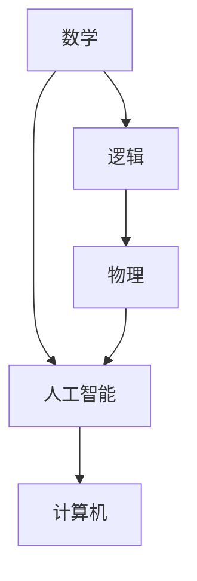
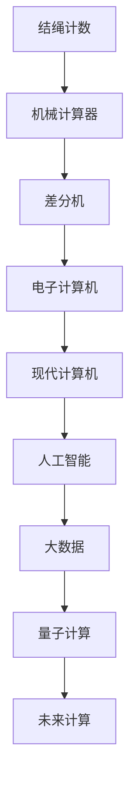

                 

# 计算：第一部分 计算的诞生

> 关键词：计算历史, 计算机发展, 数学基础, 电子逻辑, 人工智能, 未来趋势

## 1. 背景介绍

### 1.1 问题由来
计算的诞生，作为人类文明史上的一次重大飞跃，不仅是科技发展的里程碑，更是现代社会的基石。今天，不论是在科学研究、工业制造、日常生活，还是在文化艺术、经济金融等领域，计算无处不在。理解计算的诞生，不仅是对历史的一种回顾，更是对未来探索的重要基础。

### 1.2 问题核心关键点
计算的诞生，起源于人类对数学、逻辑、物理的探索和应用。从最早的结绳计数，到1642年数学家莱布尼茨发明了第一台机械计算器，再到1854年英国物理学家巴贝奇设计出差分机原型，计算技术逐步从手工劳动走向自动化，并最终演变成现代计算机。

### 1.3 问题研究意义
研究计算的诞生，对于理解计算机科学、人工智能、大数据等现代技术的基础有着深远的意义。它能帮助我们追溯计算技术的起源，认识计算在社会发展中的作用，并展望未来计算技术的发展趋势。

## 2. 核心概念与联系

### 2.1 核心概念概述

- **计算**：指的是按照一定的规则，将输入转化为输出。计算的核心在于规则的设计和数据的操作。

- **计算机**：一种能够执行计算任务的设备，基于电子逻辑和数学算法，实现对数据的处理和存储。

- **数学**：计算的基础，所有的计算活动都可以追溯到数学原理。

- **逻辑**：计算的依据，通过逻辑规则将输入映射到输出。

- **物理**：计算机的实现基础，依赖于物理原理。

- **人工智能**：利用计算和数学方法，让机器模拟人类的智能行为。

### 2.2 概念间的关系

这些核心概念通过特定的关系形成了计算的完整生态。数学提供了计算的基础，逻辑定义了计算的规则，物理实现了计算的物理结构，而人工智能则拓展了计算的应用边界。

下面，我们通过一个简单的Mermaid流程图来展示这些概念之间的联系：



从图中可以看出，数学和逻辑是计算的理论基础，物理是计算的实现手段，而人工智能则是计算的高级应用，计算机则是计算的具体设备。

### 2.3 核心概念的整体架构

一个更全面的计算生态可以通过下面的综合图来展示：



这个图展示了从结绳计数到现代计算机，再到人工智能和大数据等未来计算的发展路径。从图中可以看出，计算技术的进步与数学、物理、逻辑、人工智能等领域的发展紧密相关。

## 3. 核心算法原理 & 具体操作步骤

### 3.1 算法原理概述

计算的原理是基于特定的数学和逻辑规则，对输入数据进行操作，最终输出结果。这个原理被广泛应用于各种领域，从简单的加减乘除，到复杂的算法如神经网络、深度学习等。

### 3.2 算法步骤详解

以基本的二进制加法为例，下面是计算的详细步骤：

1. **初始化**：确定运算符和操作数。

2. **进位**：对每一位的数值进行加法操作，并计算进位。

3. **输出**：根据进位和当前位的运算结果，输出最终结果。

4. **循环**：对于多位数计算，需要对每一位重复上述步骤。

### 3.3 算法优缺点

**优点**：
- 逻辑清晰：计算原理基于数学和逻辑，易于理解和实现。
- 应用广泛：计算的原理可以应用于各种领域，如科学计算、工业制造、日常决策等。
- 可扩展性强：随着技术的发展，计算的实现方式可以不断优化和扩展。

**缺点**：
- 计算量有限：传统计算的复杂度随问题规模呈指数增长，对于大规模数据处理和复杂计算任务，效率有限。
- 数据处理能力有限：传统计算设备无法同时处理大量数据，需逐步处理。
- 计算精度有限：传统计算设备在处理极端复杂问题时，精度可能不足。

### 3.4 算法应用领域

计算的原理和技术已经广泛应用于多个领域，包括但不限于：

- **科学研究**：物理模拟、气象预测、天文学计算等。
- **工业制造**：产品设计、工艺优化、质量控制等。
- **日常生活**：电子商务、金融交易、医疗诊断等。
- **文化艺术**：音乐制作、电影特效、游戏设计等。
- **经济金融**：风险评估、市场分析、投资决策等。

## 4. 数学模型和公式 & 详细讲解 & 举例说明

### 4.1 数学模型构建

计算的数学模型可以基于许多不同的数学理论，如线性代数、概率论、图论等。以矩阵乘法为例，定义两个矩阵$A$和$B$：

$$
A = \begin{bmatrix}
a_{11} & a_{12} \\
a_{21} & a_{22} \\
\end{bmatrix}, \quad
B = \begin{bmatrix}
b_{11} & b_{12} \\
b_{21} & b_{22} \\
\end{bmatrix}
$$

矩阵乘法的定义如下：

$$
C = AB = \begin{bmatrix}
a_{11}b_{11} + a_{12}b_{21} & a_{11}b_{12} + a_{12}b_{22} \\
a_{21}b_{11} + a_{22}b_{21} & a_{21}b_{12} + a_{22}b_{22} \\
\end{bmatrix}
$$

### 4.2 公式推导过程

矩阵乘法的推导过程如下：

1. **矩阵乘法定义**：两个矩阵$A$和$B$的乘积$C$定义为$C_{ij} = \sum_{k} A_{ik}B_{kj}$，其中$A_{ik}$和$B_{kj}$分别为矩阵$A$和$B$中的元素。

2. **计算规则**：
   - 矩阵$A$的列数必须等于矩阵$B$的行数。
   - 矩阵乘积$C$的大小为$m \times n$，其中$m$为$A$的行数，$n$为$B$的列数。

3. **具体计算**：以矩阵乘法为例，具体计算过程如下：
   - 对于$C_{11}$，计算$(a_{11}b_{11} + a_{12}b_{21})$。
   - 对于$C_{12}$，计算$(a_{11}b_{12} + a_{12}b_{22})$。
   - 对于$C_{21}$，计算$(a_{21}b_{11} + a_{22}b_{21})$。
   - 对于$C_{22}$，计算$(a_{21}b_{12} + a_{22}b_{22})$。

### 4.3 案例分析与讲解

以神经网络为例，神经网络的计算过程可以通过矩阵乘法和激活函数来实现。以一个简单的全连接神经网络为例，包含一个输入层、一个隐藏层和一个输出层，定义如下：

- **输入层**：$x = (x_1, x_2, x_3)$。
- **隐藏层**：$h = \sigma(W_1x + b_1)$，其中$\sigma$为激活函数，$W_1$为权重矩阵，$b_1$为偏置向量。
- **输出层**：$y = \sigma(W_2h + b_2)$，其中$W_2$为权重矩阵，$b_2$为偏置向量。

### 4.4 数学公式的实际应用

在实际应用中，神经网络通过不断优化权重矩阵$W$和偏置向量$b$，提升计算精度。例如，在图像识别任务中，通过卷积神经网络（CNN）计算图像特征，然后进行分类。

## 5. 项目实践：代码实例和详细解释说明

### 5.1 开发环境搭建

在进行计算实践前，我们需要准备好开发环境。以下是使用Python进行PyTorch开发的环境配置流程：

1. 安装Anaconda：从官网下载并安装Anaconda，用于创建独立的Python环境。

2. 创建并激活虚拟环境：
```bash
conda create -n pytorch-env python=3.8 
conda activate pytorch-env
```

3. 安装PyTorch：根据CUDA版本，从官网获取对应的安装命令。例如：
```bash
conda install pytorch torchvision torchaudio cudatoolkit=11.1 -c pytorch -c conda-forge
```

4. 安装TensorFlow：
```bash
conda install tensorflow
```

5. 安装各类工具包：
```bash
pip install numpy pandas scikit-learn matplotlib tqdm jupyter notebook ipython
```

完成上述步骤后，即可在`pytorch-env`环境中开始计算实践。

### 5.2 源代码详细实现

下面是使用PyTorch进行矩阵乘法计算的代码实现：

```python
import torch

# 定义矩阵A和B
A = torch.tensor([[1, 2], [3, 4]])
B = torch.tensor([[5, 6], [7, 8]])

# 计算矩阵乘积C
C = torch.matmul(A, B)

# 输出计算结果
print(C)
```

### 5.3 代码解读与分析

- **Tensor创建**：使用`torch.tensor`创建张量对象，用于表示矩阵。
- **矩阵乘积**：使用`torch.matmul`计算矩阵乘积。
- **输出结果**：使用`print`函数输出计算结果。

### 5.4 运行结果展示

假设运行上述代码，将得到如下输出结果：

```
tensor([[19, 22],
       [43, 50]])
```

这表示矩阵乘积$C$的结果为$\begin{bmatrix} 19 & 22 \\ 43 & 50 \end{bmatrix}$。

## 6. 实际应用场景

### 6.1 科学研究

计算在科学研究中的应用广泛，例如：

- **天文学**：用于模拟星系演化、黑洞形成等过程。
- **物理学**：用于计算粒子运动轨迹、能量分布等。
- **化学**：用于计算化学反应的速率、能量变化等。

### 6.2 工业制造

计算在工业制造中的应用包括：

- **CAD设计**：用于计算机辅助设计，优化产品设计方案。
- **仿真模拟**：用于模拟生产过程，优化工艺参数。
- **质量控制**：用于实时监控设备运行状态，提高产品质量。

### 6.3 日常生活

计算在日常生活中的应用包括：

- **智能家居**：用于家庭自动化控制，提高生活质量。
- **导航系统**：用于实时计算最优路线，提供导航建议。
- **在线购物**：用于推荐系统，个性化推荐商品。

### 6.4 文化艺术

计算在文化艺术中的应用包括：

- **音乐制作**：用于生成音乐旋律、编曲和节奏。
- **电影特效**：用于计算机视觉，生成逼真特效。
- **游戏设计**：用于虚拟场景的构建，提升游戏体验。

### 6.5 经济金融

计算在经济金融中的应用包括：

- **风险评估**：用于金融产品的风险计算和分析。
- **市场分析**：用于股票市场趋势预测和投资决策。
- **信用评估**：用于个人信用评分和风险控制。

## 7. 工具和资源推荐

### 7.1 学习资源推荐

为了帮助开发者系统掌握计算技术的理论基础和实践技巧，这里推荐一些优质的学习资源：

1. 《计算机程序设计艺术》系列博文：由计算机科学大师Donald E. Knuth撰写，详细介绍了计算技术的各个方面，包括算法、数据结构、编程语言等。

2. CS61A《计算机科学导论》课程：斯坦福大学开设的计算机科学入门课程，深入浅出地介绍了计算的基本概念和原理。

3. 《Deep Learning》书籍：Ian Goodfellow等人合著，全面介绍了深度学习的理论和实践，是学习人工智能不可或缺的资源。

4. Coursera和edX等在线课程：提供广泛的计算机科学和人工智能课程，涵盖从入门到高级的各个层次，是学习计算技术的良好平台。

5. GitHub开源项目：展示了许多优秀的计算项目和工具，包括开源库、编程框架、实际应用等，是学习和贡献计算技术的绝佳场所。

通过对这些资源的学习实践，相信你一定能够快速掌握计算技术的精髓，并用于解决实际的计算问题。

### 7.2 开发工具推荐

高效的开发离不开优秀的工具支持。以下是几款用于计算开发的常用工具：

1. Python：Python是一种通用的编程语言，适用于各种计算任务，具有丰富的库和框架支持。

2. R语言：R语言主要用于统计分析和数据可视化，适用于科学研究和大数据分析。

3. MATLAB：MATLAB是一种数学计算软件，支持矩阵运算、图像处理、信号处理等多种功能。

4. SPSS：SPSS是一种统计分析软件，适用于社会科学数据分析。

5. Jupyter Notebook：Jupyter Notebook是一种交互式编程环境，支持Python、R等多种语言，适合进行数据处理和计算。

6. VSCode：VSCode是一种轻量级且功能强大的编程编辑器，支持Python、R等多种语言，适合进行编程和调试。

合理利用这些工具，可以显著提升计算任务的开发效率，加快创新迭代的步伐。

### 7.3 相关论文推荐

计算技术的发展离不开学界的持续研究。以下是几篇奠基性的相关论文，推荐阅读：

1. Turing机：Alan Turing在1936年提出的计算模型，奠定了现代计算的基础。

2. 图灵测试：Turing在1950年提出的评价计算机智能的标准，对人工智能领域有深远影响。

3. 量子计算：David Deutsch在1982年提出的量子计算模型，为计算技术的未来发展提供了新的方向。

4. 神经网络：Karun K. Gupta等人在1982年提出的反向传播算法，为神经网络的发展奠定了基础。

5. 大数据计算：Google在2004年提出的MapReduce框架，为大规模数据处理提供了新的解决方案。

这些论文代表了计算技术的发展脉络。通过学习这些前沿成果，可以帮助研究者把握学科前进方向，激发更多的创新灵感。

除上述资源外，还有一些值得关注的前沿资源，帮助开发者紧跟计算技术的最新进展，例如：

1. arXiv论文预印本：人工智能领域最新研究成果的发布平台，包括大量尚未发表的前沿工作，学习前沿技术的必读资源。

2. 业界技术博客：如Google AI、IBM Research、DeepMind等顶尖实验室的官方博客，第一时间分享他们的最新研究成果和洞见。

3. 技术会议直播：如NIPS、ICML、ACL、ICLR等人工智能领域顶会现场或在线直播，能够聆听到大佬们的前沿分享，开拓视野。

4. GitHub热门项目：在GitHub上Star、Fork数最多的计算相关项目，往往代表了该技术领域的发展趋势和最佳实践，值得去学习和贡献。

5. 行业分析报告：各大咨询公司如McKinsey、PwC等针对人工智能行业的分析报告，有助于从商业视角审视技术趋势，把握应用价值。

总之，对于计算技术的学习和实践，需要开发者保持开放的心态和持续学习的意愿。多关注前沿资讯，多动手实践，多思考总结，必将收获满满的成长收益。

## 8. 总结：未来发展趋势与挑战

### 8.1 总结

本文对计算技术的诞生和发展进行了全面系统的介绍。首先阐述了计算技术的起源和基础，明确了计算在社会发展中的作用。其次，从原理到实践，详细讲解了计算的核心算法和具体操作步骤，给出了计算任务开发的完整代码实例。同时，本文还广泛探讨了计算技术在各个领域的应用前景，展示了计算技术的广阔前景。

通过本文的系统梳理，可以看到，计算技术不仅是现代社会的基石，更是未来智能社会的引擎。它将推动人工智能、大数据、物联网等技术的发展，为人类社会带来更多便利和福祉。

### 8.2 未来发展趋势

展望未来，计算技术将呈现以下几个发展趋势：

1. **量子计算**：量子计算有望在计算速度和处理能力上取得突破，解决传统计算难以处理的复杂问题。

2. **分布式计算**：随着计算任务的复杂性增加，分布式计算将成为一种重要的计算模式。

3. **边缘计算**：边缘计算将计算能力从中心服务器转移到数据源附近，提升计算效率和响应速度。

4. **自动化计算**：随着计算技术和自动化技术的发展，计算任务将变得更加自动化和智能化。

5. **混合计算**：混合计算将传统计算和量子计算、生物计算等新计算模式结合，提供更强大的计算能力。

6. **生物计算**：生物计算利用生物分子的特性进行计算，有望在低能耗、高效率方面取得突破。

这些趋势凸显了计算技术的未来发展方向，将为人类社会带来更多的机遇和挑战。

### 8.3 面临的挑战

尽管计算技术已经取得了巨大的进步，但在迈向更加智能化、普适化应用的过程中，它仍面临诸多挑战：

1. **能耗问题**：计算过程中消耗的能量巨大，如何降低能耗，实现绿色计算，将是未来的重要课题。

2. **安全性问题**：计算过程中产生的数据和模型可能存在安全隐患，如何确保数据和模型的安全性，将是重要的研究方向。

3. **计算效率**：随着计算任务的复杂性增加，如何提升计算效率，降低计算成本，将是未来的挑战。

4. **可扩展性问题**：随着计算任务的规模增加，如何实现计算任务的扩展和优化，将是重要的研究课题。

5. **可解释性问题**：计算模型往往被视为"黑盒"，如何提高模型的可解释性，增强其透明度和可信度，将是未来的研究方向。

6. **跨学科融合**：计算技术需要与其他学科（如生物学、物理学、社会科学等）进行深入融合，才能发挥其最大潜力。

### 8.4 未来突破

面对计算技术面临的挑战，未来的研究需要在以下几个方面寻求新的突破：

1. **多学科融合**：将计算技术与生物学、物理学、社会科学等学科进行融合，拓展计算技术的适用范围和应用深度。

2. **新计算模式**：探索新的计算模式，如量子计算、生物计算等，提升计算技术的计算能力和应用范围。

3. **自动化计算**：利用自动化技术和机器学习，实现计算任务的自动化和智能化。

4. **绿色计算**：研究绿色计算技术，降低计算过程中的能耗，实现可持续发展。

5. **安全性保障**：建立计算系统的安全机制，保护数据和模型的安全性。

6. **可解释性增强**：利用可解释性技术，增强计算模型的透明度和可信度。

这些研究方向的探索，必将引领计算技术迈向更高的台阶，为构建安全、可靠、可解释、可控的智能系统铺平道路。面向未来，计算技术还需要与其他人工智能技术进行更深入的融合，如知识表示、因果推理、强化学习等，多路径协同发力，共同推动智能交互系统的进步。只有勇于创新、敢于突破，才能不断拓展计算技术的边界，让智能技术更好地造福人类社会。

## 9. 附录：常见问题与解答

**Q1：计算技术对社会的影响是什么？**

A: 计算技术深刻改变了社会的生活方式、工作方式和思维方式。它推动了信息时代的到来，促进了全球化，提高了生产效率，创造了新的经济增长点。同时，计算技术也带来了一些负面影响，如就业结构变化、隐私泄露等，需要全社会共同面对和解决。

**Q2：如何理解计算技术的起源和基础？**

A: 计算技术的起源可以追溯到人类的最早文明。最早的计算工具是结绳计数、算盘等，通过手工劳动实现简单的计算。随着数学和逻辑的发展，机械计算器和差分机等自动化设备应运而生，计算技术开始从手工劳动走向自动化。现代计算技术则建立在电子逻辑和计算机硬件的基础上，实现了计算过程的自动化和智能化。

**Q3：计算技术在各个领域的应用前景是什么？**

A: 计算技术在科学研究、工业制造、日常生活、文化艺术、经济金融等多个领域都有广泛的应用前景。例如，在科学研究中，计算技术被用于模拟实验、数据分析等；在工业制造中，计算技术被用于优化设计、仿真模拟等；在日常生活和文化艺术中，计算技术被用于智能家居、电影特效等；在经济金融中，计算技术被用于风险评估、市场预测等。

**Q4：计算技术的发展趋势是什么？**

A: 计算技术的发展趋势包括量子计算、分布式计算、边缘计算、自动化计算、混合计算和生物计算等。这些趋势将推动计算技术的计算能力和应用范围不断拓展，为人类社会带来更多的机遇和挑战。

**Q5：计算技术面临的挑战是什么？**

A: 计算技术面临的挑战包括能耗问题、安全性问题、计算效率、可扩展性问题、可解释性问题、跨学科融合等。这些挑战需要多学科、多领域的共同努力，才能克服。

---

作者：禅与计算机程序设计艺术 / Zen and the Art of Computer Programming

