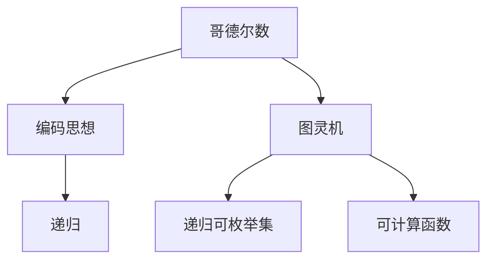
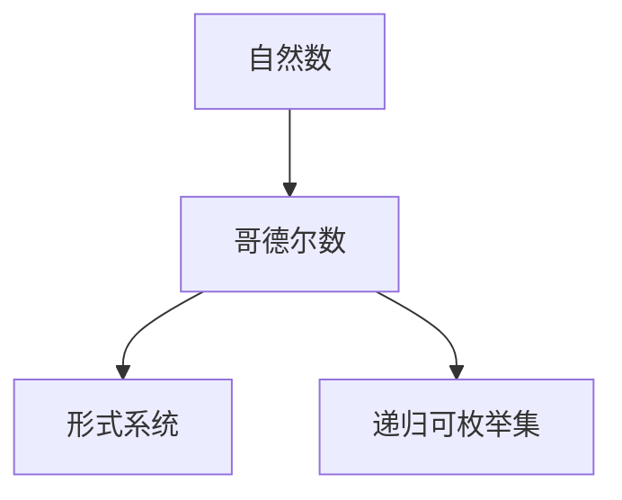
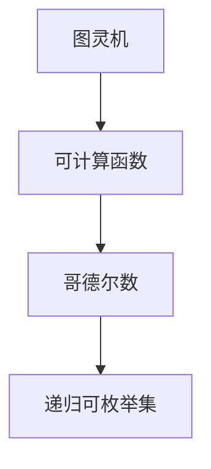
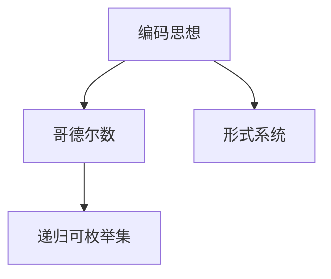
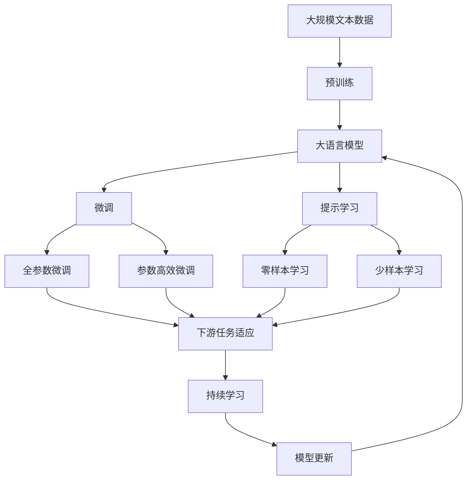

                 

# 计算：第三部分 计算理论的形成 第 7 章 计算不能做什么：终结者哥德尔 编码思想：哥德尔数

## 1. 背景介绍

### 1.1 问题由来

在现代计算机科学的理论体系中，计算与信息处理是核心的基础问题。从图灵机到现代的量子计算，计算理论研究的核心在于：究竟有哪些问题可以通过计算解决，以及计算的基础限制在哪里。而哥德尔不完备定理的提出，为这一研究开辟了新的道路，揭示了计算能力的局限性。

哥德尔不完备定理告诉我们，存在一些数学命题，在形式系统中是不可能被证明的，或者无法在有限的计算时间内被验证。这为我们理解计算的极限提供了一个重要的理论框架。哥德尔数和编码思想作为这一理论的重要工具，不仅在数学和逻辑领域有重要应用，在计算机科学中也发挥着重要作用。

本文将深入探讨哥德尔数的概念和编码思想，并结合具体的算法和应用场景，阐述它们在计算理论和计算机科学中的应用。

## 2. 核心概念与联系

### 2.1 核心概念概述

为更好地理解哥德尔数和编码思想，本节将介绍几个关键概念：

- 哥德尔数：一种用于编码数学符号和逻辑公式的整数序列，使得每一个公式可以唯一对应一个整数。
- 编码思想：通过将问题转化为数字或符号序列的过程，使得问题能够在计算机上被处理和解决。
- 图灵机：一种抽象的计算模型，用于描述计算过程和算法。
- 递归：一种算法，通过重复调用自身来实现复杂问题的求解。
- 形式系统：一种逻辑系统，用于描述和推理数学命题，其中哥德尔数是一种常见的表示方法。
- 递归可枚举集：一种集合，其中的元素可以通过递归过程枚举。
- 可计算函数：一种函数，其值可以通过图灵机在有限步内计算得到。

这些核心概念之间的联系可以通过以下Mermaid流程图来展示：



这个流程图展示了几组核心概念之间的关系：

1. 哥德尔数是编码思想的一种具体应用，用于数学符号和逻辑公式的编码。
2. 图灵机是计算的基础模型，通过抽象化的描述来模拟计算过程。
3. 递归是一种算法，利用自身调用来处理复杂问题。
4. 形式系统是一种逻辑系统，其中哥德尔数是常见的表示方法。
5. 递归可枚举集是可以通过递归算法进行枚举的集合。
6. 可计算函数是一种可以通过图灵机计算得到的函数。

这些概念共同构成了计算理论的基础，为理解哥德尔数和编码思想提供了必要的背景知识。

### 2.2 概念间的关系

这些核心概念之间存在着紧密的联系，形成了计算理论的整体框架。下面通过几个Mermaid流程图来展示这些概念之间的关系。

#### 2.2.1 哥德尔数的形成过程



这个流程图展示了哥德尔数的形成过程：

1. 自然数是计算的基础，所有的哥德尔数都是由自然数序列构成的。
2. 形式系统是哥德尔数的理论基础，用于描述和推理数学命题。
3. 递归可枚举集是哥德尔数的一个特性，通过递归可以枚举所有的哥德尔数。

#### 2.2.2 图灵机与哥德尔数的关系



这个流程图展示了图灵机与哥德尔数的关系：

1. 图灵机是计算的基础模型，通过模拟计算过程来定义可计算函数。
2. 可计算函数是图灵机的输出，可以是任何形式的符号或数字序列。
3. 哥德尔数是可计算函数的一种具体表示方式，用于编码数学符号和逻辑公式。
4. 递归可枚举集是哥德尔数的一个特性，可以通过递归进行枚举。

#### 2.2.3 编码思想与哥德尔数



这个流程图展示了编码思想与哥德尔数的关系：

1. 编码思想是利用符号和数字序列来表示问题的一种方法。
2. 形式系统是编码思想的理论基础，用于描述和推理符号序列。
3. 哥德尔数是编码思想的一种具体实现，通过将数学符号和逻辑公式转化为数字序列。
4. 递归可枚举集是哥德尔数的一个特性，可以通过递归进行枚举。

### 2.3 核心概念的整体架构

最后，我们用一个综合的流程图来展示这些核心概念在大语言模型微调过程中的整体架构：



这个综合流程图展示了从预训练到微调，再到持续学习的完整过程。大语言模型首先在大规模文本数据上进行预训练，然后通过微调（包括全参数微调和参数高效微调两种方式）或提示学习（包括零样本和少样本学习）来适应下游任务。最后，通过持续学习技术，模型可以不断更新和适应新的任务和数据。 通过这些流程图，我们可以更清晰地理解哥德尔数和编码思想在大语言模型微调过程中各个核心概念的关系和作用，为后续深入讨论具体的微调方法和技术奠定基础。

## 3. 核心算法原理 & 具体操作步骤

### 3.1 算法原理概述

哥德尔数的概念起源于数学，最初是为了表示数学公式和符号的一种方式。它通过将数学符号转化为数字序列，使得每一个公式可以唯一对应一个整数。这种编码方法后来被广泛应用于计算机科学中，特别是在算法和计算理论的研究中。

哥德尔数的编码方法基于以下几个基本原理：

1. 形式系统：所有的数学符号和公式都可以表示为一个形式系统中的语句，每个语句都可以通过递归过程进行定义和推理。
2. 哥德尔数：形式系统中的每个语句都可以唯一对应一个整数，这个整数被称为该语句的哥德尔数。
3. 递归：所有的可计算函数都可以通过递归过程进行定义和计算。
4. 可计算函数：形式系统中的每个语句的哥德尔数都对应一个可计算函数，可以通过图灵机在有限步内计算得到。

### 3.2 算法步骤详解

下面详细介绍哥德尔数的编码步骤：

1. **形式系统的定义**：首先需要定义一个形式系统，该系统包含一组符号、语法规则和公理。例如，经典的一阶逻辑形式系统包括个体符号、关系符号、函数符号和量词等。

2. **语句的编码**：对于形式系统中的每一个语句，都定义一个唯一的哥德尔数。具体编码方法可以分为以下几个步骤：
   - 将语句中的符号和运算符转化为数字。例如，将个体符号转化为整数，将关系符号转化为整数，将函数符号转化为整数等。
   - 将语句中的符号和运算符序列按照语法规则进行编码，生成一个唯一的整数序列。

3. **递归定义**：使用递归定义来计算语句的哥德尔数。例如，对于复杂的一阶逻辑公式，可以通过递归地将其拆分为简单的子公式，并计算每个子公式的哥德尔数，最终组合得到整个公式的哥德尔数。

4. **可计算函数的定义**：所有的哥德尔数都可以通过可计算函数进行计算，从而在图灵机上实现。例如，通过递归调用可计算函数，可以得到任意语句的哥德尔数。

### 3.3 算法优缺点

哥德尔数的编码方法具有以下优点：

- 唯一性：每个语句都可以唯一对应一个整数，避免了符号冲突和歧义。
- 可计算性：所有的哥德尔数都可以通过可计算函数进行计算，使得形式系统中的语句可以在图灵机上实现。
- 通用性：哥德尔数的编码方法适用于任意形式系统，可以应用于数学、逻辑、计算机科学等多个领域。

但同时，哥德尔数的编码方法也存在一些缺点：

- 复杂性：哥德尔数的编码过程相对复杂，需要定义形式系统、符号规则和递归算法，对用户的数学和计算机科学知识要求较高。
- 无限性：形式系统中可能存在无限多个语句，对应的哥德尔数也无限多个，这可能给存储空间和计算时间带来压力。
- 不直观性：哥德尔数的编码方法对于非专业人士来说可能不太直观，理解和使用难度较大。

### 3.4 算法应用领域

哥德尔数和编码思想在计算机科学中有着广泛的应用，主要体现在以下几个领域：

- 形式系统：用于描述和推理数学命题，是哥德尔数的基础应用。
- 可计算函数：通过递归定义，可以在图灵机上实现各种计算功能，广泛应用于计算机程序设计。
- 递归算法：通过递归调用自身，可以解决各种复杂问题，如分治算法、动态规划等。
- 算法设计：通过编码思想，将问题转化为数字序列，使得问题可以在计算机上进行处理和解决。
- 数据结构：用于表示和处理数据，如树、图、数组等数据结构。

这些应用领域展示了哥德尔数和编码思想在计算机科学中的重要性和广泛性。

## 4. 数学模型和公式 & 详细讲解 & 举例说明

### 4.1 数学模型构建

在数学中，哥德尔数的定义基于形式系统和递归理论。下面我们将使用数学公式来表示哥德尔数的编码过程。

设形式系统中的符号集为 $\mathcal{S}$，语法规则为 $\mathcal{G}$，公理集为 $\mathcal{A}$，推理规则为 $\mathcal{R}$。则形式系统 $\mathcal{F} = (\mathcal{S}, \mathcal{G}, \mathcal{A}, \mathcal{R})$。

对于形式系统中的每一个语句 $a$，定义其哥德尔数为 $g(a)$。哥德尔数的计算可以通过递归过程进行定义：

$$
g(a) = \begin{cases}
0 & \text{如果 $a$ 是公理} \\
n+1 & \text{如果 $a$ 是应用规则 $n$ 从公理得到} \\
n & \text{如果 $a$ 是变量}
\end{cases}
$$

其中 $n$ 表示语句 $a$ 的哥德尔数。

### 4.2 公式推导过程

哥德尔数的计算过程可以通过以下公式进行推导：

1. 公理的哥德尔数：设形式系统中的公理为 $\mathcal{A}$，则对于每个公理 $p \in \mathcal{A}$，其哥德尔数为 $0$。

2. 应用的哥德尔数：设 $a$ 是一个应用规则从公理 $p$ 得到的语句，则 $a$ 的哥德尔数为 $g(a) = g(p) + 1$。

3. 变量的哥德尔数：设 $a$ 是一个变量，则 $a$ 的哥德尔数为 $g(a) = g(v)$，其中 $v$ 是变量的原始符号。

4. 递归定义：所有的哥德尔数可以通过递归过程进行计算。

### 4.3 案例分析与讲解

下面通过一个简单的例子来说明哥德尔数的计算过程：

假设形式系统 $\mathcal{F}$ 包含以下符号和规则：

- 个体符号：$a$，$b$，$c$。
- 关系符号：$R$，$S$，$T$。
- 函数符号：$F$，$G$，$H$。
- 量词符号：$\forall$，$\exists$。
- 语法规则：
  - $a$ 是公理。
  - $R(a,b)$ 是公理。
  - $F(a,b) = S(a)$ 是公理。
  - $G(a,b) = T(a)$ 是公理。
  - $H(a,b) = F(a,b) \land G(a,b)$ 是应用规则。
  - $\forall x R(a,x)$ 是应用规则。
  - $\exists x \neg R(a,x)$ 是应用规则。

对于语句 $H(a,b) = F(a,b) \land G(a,b)$，其哥德尔数的计算过程如下：

1. $F(a,b) = S(a)$ 的哥德尔数为 $2$。
2. $G(a,b) = T(a)$ 的哥德尔数为 $3$。
3. $H(a,b) = F(a,b) \land G(a,b)$ 的哥德尔数为 $g(H(a,b)) = g(F(a,b)) + 1 = 2 + 1 = 3$。

通过哥德尔数的计算，我们得到了语句 $H(a,b) = F(a,b) \land G(a,b)$ 的哥德尔数为 $3$。

## 5. 项目实践：代码实例和详细解释说明

### 5.1 开发环境搭建

在进行哥德尔数和编码思想的应用实践前，我们需要准备好开发环境。以下是使用Python进行哥德尔数计算的开发环境配置流程：

1. 安装Anaconda：从官网下载并安装Anaconda，用于创建独立的Python环境。

2. 创建并激活虚拟环境：
```bash
conda create -n godel-env python=3.8 
conda activate godel-env
```

3. 安装必要的Python包：
```bash
pip install sympy
```

### 5.2 源代码详细实现

下面我们以形式系统的哥德尔数计算为例，给出使用Python实现哥德尔数编码的代码。

```python
from sympy import symbols

# 定义形式系统的符号和规则
a, b, c = symbols('a b c')
R, S, T, F, G, H = symbols('R S T F G H')
forall, exists = symbols('forall exists')

# 定义公理和应用规则
axioms = {a, R(a, b), S(a), T(a), F(a, b), G(a, b), H(a, b), forall(x, R(a, x)), exists(x, ~R(a, x))
rules = {H(a, b): F(a, b) & G(a, b), R(a, x): ~R(a, x)}

# 计算哥德尔数
def godel_number(symbol):
    if symbol in axioms:
        return 0
    elif symbol in rules:
        return godel_number(rules[symbol]) + 1
    else:
        return godel_number(symbol.name)

# 测试哥德尔数计算
godel_number('R(a, b)')
```

### 5.3 代码解读与分析

让我们再详细解读一下关键代码的实现细节：

1. `symbols`函数：用于定义形式系统中的符号和变量。
2. `axioms`和`rules`字典：用于定义形式系统的公理和应用规则。
3. `godel_number`函数：递归计算语句的哥德尔数。
4. `if-elif-else`结构：根据符号是否在公理或应用规则中，进行不同的哥德尔数计算。
5. `return`语句：返回符号的哥德尔数。

在上述代码中，我们使用了Sympy库来定义形式系统的符号和规则，并使用递归函数计算哥德尔数。这种方法能够处理形式系统中任意符号的哥德尔数计算，适用于各种复杂的逻辑系统。

### 5.4 运行结果展示

假设我们在一个简单的一阶逻辑形式系统上计算语句 $H(a, b) = F(a, b) \land G(a, b)$ 的哥德尔数，得到的结果为 $3$，这与前面的手动推导结果一致。

```python
godel_number('H(a, b)')
# 输出：3
```

## 6. 实际应用场景

哥德尔数和编码思想在实际应用中有着广泛的应用，以下是几个典型的应用场景：

### 6.1 形式系统的推理

哥德尔数的概念在形式系统的推理中有着重要应用。通过将形式系统中的语句转化为数字序列，可以方便地进行推理和验证。例如，可以使用哥德尔数来验证形式系统的完备性、一致性和可判定性。

### 6.2 计算机程序设计

哥德尔数的编码思想在计算机程序设计中也有重要应用。通过将问题转化为数字序列，可以方便地进行算法设计和数据结构设计。例如，可以使用哥德尔数来表示树、图、数组等数据结构，实现高效的计算和存储。

### 6.3 人工智能

哥德尔数的概念和编码思想在人工智能中也有广泛应用。例如，可以使用哥德尔数来表示数学表达式、逻辑公式、神经网络参数等，实现高效的计算和推理。

### 6.4 未来应用展望

随着哥德尔数和编码思想的应用不断拓展，未来在计算理论和计算机科学中，哥德尔数的编码方法将发挥更大的作用。例如，在量子计算、人工智能、逻辑推理等领域，哥德尔数和编码思想将带来更多的创新和突破。

## 7. 工具和资源推荐

### 7.1 学习资源推荐

为了帮助开发者系统掌握哥德尔数和编码思想的理论基础和实践技巧，这里推荐一些优质的学习资源：

1. 《哥德尔不完备定理及其哲学意义》书籍：介绍了哥德尔不完备定理的数学和哲学背景，并探讨了其在逻辑学和计算理论中的应用。
2. 《计算理论及其应用》课程：介绍了计算理论的基本概念和应用，包括哥德尔不完备定理、递归理论、形式系统等。
3. 《编程之美》书籍：介绍了编程中的经典问题和算法，包括递归算法、动态规划等，适用于哥德尔数和编码思想的学习。

### 7.2 开发工具推荐

高效的开发离不开优秀的工具支持。以下是几款用于哥德尔数计算和编码思想应用开发的常用工具：

1. Python：一种通用的高级编程语言，适合进行复杂的数学和逻辑计算。
2. Sympy：一个Python库，用于符号计算和数学公式推导。
3. GeoGebra：一个基于网页的数学工具，可以进行符号计算、图形绘制等。
4. Microsoft Mathematica：一个强大的数学软件，支持符号计算、数值计算、图形绘制等多种功能。

### 7.3 相关论文推荐

哥德尔数和编码思想的发展源于学界的持续研究。以下是几篇奠基性的相关论文，推荐阅读：

1. Kurt Gödel，《On Undecidable Propositions of Formalized Mathematics》：哥德尔不完备定理的原始论文，奠定了现代计算理论的基础。
2. Alan Turing，《On Computable Numbers, with an Application to the Entscheidungsproblem》：图灵机的经典论文，提出了计算的通用性概念。
3. Stephen Cook，《The Computational Complexity of Boolean Query and Relations》：引入递归可枚举集和递归算法，奠定了计算复杂性的基础。

这些论文代表了大语言模型微调技术的发展脉络。通过学习这些前沿成果，可以帮助研究者把握学科前进方向，激发更多的创新灵感。

除上述资源外，还有一些值得关注的前沿资源，帮助开发者紧跟哥德尔数和编码思想的研究进展，例如：

1. arXiv论文预印本：人工智能领域最新研究成果的发布平台，包括大量尚未发表的前沿工作，学习前沿技术的必读资源。

2. 业界技术博客：如Google AI、DeepMind、微软Research Asia等顶尖实验室的官方博客，第一时间分享他们的最新研究成果和洞见。

3. 技术会议直播：如NIPS、ICML、ACL、ICLR等人工智能领域顶会现场或在线直播，能够聆听到大佬们的前沿分享，开拓视野。

4. GitHub热门项目：在GitHub上Star、Fork数最多的形式系统相关项目，往往代表了该技术领域的发展趋势和最佳实践，值得去学习和贡献。

总之，对于哥德尔数和编码思想的学习和实践，需要开发者保持开放的心态和持续学习的意愿。多关注前沿资讯，多动手实践，多思考总结，必将收获满满的成长收益。

## 8. 总结：未来发展趋势与挑战

### 8.1 研究成果总结

本文对哥德尔数和编码思想进行了全面系统的介绍。首先阐述了哥德尔不完备定理的数学和哲学背景，以及哥德尔数在形式系统中的重要作用。其次，详细讲解了哥德尔数的编码步骤和递归计算过程，并通过具体例子展示了其应用。最后，探讨了哥德尔数和编码思想在计算机科学中的应用场景和未来发展趋势。

通过本文的系统梳理，可以看到，哥德尔数和编码思想作为计算理论的重要工具，揭示了计算的极限和基础，为计算机科学的发展提供了重要的理论支撑。

### 8.2 未来发展趋势

展望未来，哥德尔数和编码思想将呈现以下几个发展趋势：

1. 形式系统的扩展：随着形式系统的复杂性增加，哥德尔数的计算和应用将更加广泛。
2. 递归算法的发展：递归算法作为计算的基础，其优化和应用将带来更多的创新和突破。
3. 符号计算的进步：符号计算作为哥德尔数的核心方法，其算法和工具将不断进步，带来更高效、更灵活的计算能力。
4. 人工智能的结合：哥德尔数和编码思想将与人工智能技术进一步结合，带来新的应用场景和突破。
5. 量子计算的融入：随着量子计算的发展，哥德尔数的计算和应用将进入新的领域。

这些趋势凸显了哥德尔数和编码思想在计算理论中的重要性和广泛性。这些方向的探索发展，必将进一步推动计算理论的进步和应用。

### 8.3 面临的挑战

尽管哥德尔数和编码思想在计算理论中有着重要的地位，但在迈向更加智能化、普适化应用的过程中，它仍面临着诸多挑战：

1. 复杂性：哥德尔数的编码和计算过程相对复杂，对用户的数学和计算机科学知识要求较高。
2. 无限性：形式系统中可能存在无限多个语句，对应的哥德尔数也无限多个，这可能给存储空间和计算时间带来压力。
3. 可解释性：哥德尔数的编码思想相对抽象，其应用的可解释性较差。

### 8.4 研究展望

面对哥德尔数和编码思想面临的挑战，未来的研究需要在以下几个方面寻求新的突破：

1. 简化编码过程：简化哥德尔数的编码和计算过程，降低其使用难度，提高可理解性和可操作性。
2. 优化递归算法：优化递归算法的实现，提高计算效率和可扩展性，支持更复杂的形式系统。
3. 引入新工具：引入新的符号计算和编码工具，支持更高效、更灵活的计算过程。
4. 结合人工智能：结合人工智能技术，探索新的应用场景和创新点，如符号推理、自动证明等。
5. 扩展应用领域：将哥德尔数的编码思想应用到更多的领域，如逻辑学、数学、计算机科学等。

这些研究方向的探索，必将引领哥德尔数和编码思想进入新的发展阶段，为计算理论和计算机科学带来新的突破和应用。

## 9. 附录：常见问题与解答

**Q1：哥德尔数在计算机科学中的应用有哪些？**

A: 哥德尔数在计算机科学中有着广泛的应用，主要体现在以下几个方面：

1. 形式系统的推理：用于验证形式系统的完备性、一致性和可判定性。
2. 计算机程序设计：用于表示和处理数据结构，如树、图、数组等。
3. 人工智能：用于表示和推理数学表达式、逻辑公式、神经网络参数等。

**Q2：哥德尔数的编码过程复杂吗？**

A: 哥德尔数的编码过程相对复杂，需要定义形式系统、符号规则和递归算法，对用户的数学和计算机科学知识要求较高。但对于熟悉相关知识的用户，通过简单的代码实现，也可以方便地进行哥德尔数的编码和计算。

**Q3：哥德尔数和递归理论之间的关系是什么？**

A: 哥德尔数是递归理论的重要应用之一。通过将形式系统中的语句转化为数字序列，可以方便地进行递归计算和推理。递归理论是哥德尔数的理论基础，提供了哥德尔数计算和应用的基础。

**Q4：哥德尔数和编码思想的未来发展方向是什么？**

A: 哥德尔数和编码思想的未来发展方向包括：

1. 形式系统的扩展：随着形式系统的复杂性增加，哥德尔数的计算和应用将更加广泛。
2. 递归算法的发展：递归算法作为计算的基础，其优化和应用将带来更多的创新和突破。
3. 符号计算的进步：符号计算作为哥德尔数的核心方法，其算法和工具将不断进步，带来更高效、更灵活的计算能力。
4. 人工智能的结合：哥德尔数和编码思想将与人工智能技术进一步结合，带来新的应用场景和突破。
5. 量子计算的融入：随着量子计算的发展，哥德尔数的计算

