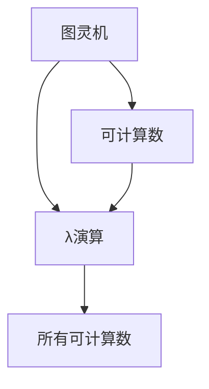
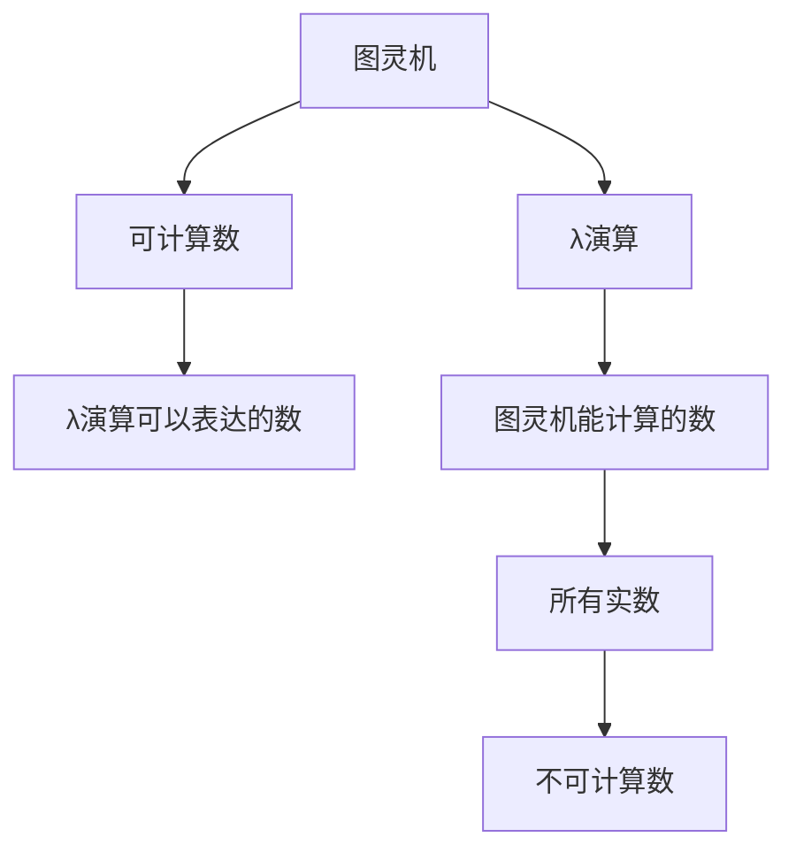

                 

# 计算：第三部分 计算理论的形成 第 8 章 计算理论的诞生：图灵的可计算数 丘奇-图灵论题

## 1. 背景介绍

### 1.1 问题由来

20世纪30年代，计算机科学的基础理论之一——计算理论，逐步形成。计算理论的研究核心是了解哪些问题能够通过计算解决，哪些问题无法解决。这一问题最早可以追溯到著名的丘奇-图灵论题。

图灵机由英国数学家艾伦·图灵于1936年提出，是一种抽象的计算模型，旨在描述能够进行任何计算过程的机器。而丘奇则独立提出了类似的"λ演算"，这种演算是一种函数式编程语言。两者虽然在形式上有所不同，但都展示了计算过程的本质。

丘奇-图灵论题就是关于图灵机和λ演算在计算能力上的等价性。该论题成为计算理论研究的基础，对计算机科学的发展产生了深远影响。

### 1.2 问题核心关键点

丘奇-图灵论题的重点在于：图灵机能够解决的问题，是否都能由λ演算解决，反之亦然。也就是说，通过图灵机的计算能力，是否能得到λ演算的计算能力，反之亦然。

这一论题对于理解计算的本质，以及计算能力的上限，具有重要的理论意义。它揭示了计算机科学的基础——计算理论的边界，同时奠定了后续可计算性和不可计算性理论研究的基础。

## 2. 核心概念与联系

### 2.1 核心概念概述

为更好地理解丘奇-图灵论题，我们首先介绍相关核心概念：

- **图灵机(Turing Machine)**：一种抽象的计算模型，能够模拟各种计算过程，包括算术、逻辑、图等。图灵机由一个无限长度的纸带、读写头、状态和一组指令构成。通过读写头在纸带上的移动和读写操作，图灵机可以执行任何计算任务。

- **λ演算(Lambda Calculus)**：一种函数式编程语言，由阿尔冈·丘奇于1934年提出。λ演算使用λ表达式，通过函数的定义、应用和递归，能够表达任何计算过程。λ演算的核心是变量和函数，变量代表输入，函数代表计算过程。

- **可计算数(Computable Number)**：指的是通过图灵机可以计算出来的所有实数。这些数可以在有限的时间内被计算出来，没有无限循环或不确定性。

- **丘奇-图灵论题**：图灵机能够解决的问题，是否都能由λ演算解决，反之亦然。该论题揭示了图灵机和λ演算在计算能力上的等价性，奠定了计算理论的基础。

这些核心概念构成了丘奇-图灵论题的研究基础。它们之间的关系和联系，将通过以下Mermaid流程图来展示：



图灵机能够计算的数（C）都是λ演算能够表达的（D），两者在计算能力上等价。

### 2.2 概念间的关系

这些核心概念之间的逻辑关系可以通过以下Mermaid流程图来展示：



图灵机能够计算的数（E）和λ演算能够表达的数（D）是等价的。图灵机不能计算的数（G）称为不可计算数，其余的所有实数（F）都是可计算数。

## 3. 核心算法原理 & 具体操作步骤
### 3.1 算法原理概述

丘奇-图灵论题的算法原理是基于图灵机和λ演算在计算能力上的等价性。具体来说，图灵机能够计算的数（E）和λ演算能够表达的数（D）是等价的。这一原理的核心是通过数学证明，展示图灵机能够实现的计算任务，λ演算也能够实现，反之亦然。

形式化地说，假设图灵机M可以计算一个函数f，则存在一个λ表达式P，使得M执行P时，能够在有限步内得到f的结果。反之，假设λ演算中的函数g可以通过λ表达式Q实现，则存在一个图灵机N，使得N执行Q时，能够在有限步内得到g的结果。

### 3.2 算法步骤详解

基于丘奇-图灵论题的算法步骤如下：

1. **定义图灵机M**：给定一个图灵机M和它能够计算的函数f。
2. **构建λ表达式P**：找到λ表达式P，使得M执行P时，能够在有限步内得到f的结果。
3. **验证计算等价性**：证明图灵机M能够计算的函数f，通过λ表达式P在有限步内得到相同的结果。

这一过程需要数学和逻辑的严谨推导，才能证明图灵机和λ演算的计算能力是等价的。

### 3.3 算法优缺点

丘奇-图灵论题的算法优点在于：

- 形式化证明：通过严格的数学和逻辑证明，展示了图灵机和λ演算在计算能力上的等价性。
- 理论基础：奠定了计算理论研究的基础，对后续可计算性和不可计算性理论研究具有重要意义。
- 普适性：证明了所有可计算的数都可以通过图灵机或λ演算进行计算，具有普适性。

同时，该算法也存在一些局限性：

- 抽象性强：基于抽象的数学模型，算法步骤较为复杂，需要深厚的数学和逻辑基础。
- 证明过程复杂：证明过程涉及到复杂的数学推导，对于初学者来说可能较为困难。
- 应用范围有限：主要应用于理论研究，对于具体计算任务的应用较为有限。

### 3.4 算法应用领域

丘奇-图灵论题的算法应用主要集中在计算理论的基础研究领域，对理论计算机科学具有重要意义。其应用领域包括：

- 可计算性与不可计算性理论：丘奇-图灵论题奠定了可计算性和不可计算性理论研究的基础。
- 人工智能和机器学习：图灵机和λ演算的思想被广泛应用于人工智能和机器学习领域，如神经网络、符号逻辑、搜索算法等。
- 计算复杂性理论：研究复杂性问题的可计算性和计算能力，丘奇-图灵论题提供了重要的理论基础。

## 4. 数学模型和公式 & 详细讲解  
### 4.1 数学模型构建

基于丘奇-图灵论题的数学模型构建如下：

1. **定义图灵机**：图灵机由读写头、状态和指令构成，可以执行任意计算过程。
2. **定义λ演算**：λ演算使用λ表达式，通过函数的定义、应用和递归，能够表达任何计算过程。
3. **定义可计算数**：可计算数指的是能够通过图灵机计算的实数。
4. **构建数学证明**：通过数学和逻辑推导，证明图灵机和λ演算在计算能力上的等价性。

### 4.2 公式推导过程

以下我们以一个简单的计算任务为例，展示丘奇-图灵论题的数学证明过程。

假设有一个函数 $f(x)=x^2+1$，我们需要证明该函数是可计算的。首先，我们将该函数转换为图灵机M的程序，然后证明M能够计算出 $f(x)$ 的值。

1. **定义图灵机M**：
```
M = (Q, Σ, Γ, δ, q_0, q_a, q_r)
```
其中，$Q$是状态集合，$Σ$是输入符号集合，$Γ$是读写符号集合，$δ$是转移函数，$q_0$是初始状态，$q_a$是接受状态，$q_r$是拒绝状态。

2. **构建图灵机M的转移函数δ**：
```
δ(q, x, y) = (q', x', y', d)
```
其中，$q'$是下一个状态，$x'$是输入符号，$y'$是输出符号，$d$是方向（左、右）。

3. **定义λ表达式P**：
```
P = λx. x^2 + 1
```

4. **验证计算等价性**：
假设图灵机M执行P时，得到的结果为 $y$，则 $y=f(x)$。

证明过程如下：

- 假设 $M$ 在状态 $q_0$ 开始执行，输入符号为 $x$，初始读写符号为 $b$。
- 执行M的转移函数 $δ$，根据输入 $x$ 和状态 $q_0$，得到下一个状态 $q_1$ 和输出符号 $y_1$。
- 执行 $δ$ 函数，根据 $q_1$ 和 $y_1$，得到下一个状态 $q_2$ 和输出符号 $y_2$。
- 重复执行 $δ$ 函数，直到达到接受状态 $q_a$，输出符号为 $y$。
- 由于 $M$ 和 $P$ 的执行过程相同，且 $P$ 的结果为 $f(x)$，因此 $M$ 能够计算 $f(x)$。

5. **推广到所有可计算数**：
通过上述证明，可以推广到所有可计算数。即任何可计算的数，都可以在有限步内通过图灵机计算得到。

### 4.3 案例分析与讲解

为了更好地理解丘奇-图灵论题，我们通过一个简单的案例来进行讲解。

假设有一个简单的查找表问题，给定一个输入 $x$，返回 $x$ 对应的值 $y$。我们需要证明该问题是可计算的。

1. **定义图灵机M**：
```
M = (Q, Σ, Γ, δ, q_0, q_a, q_r)
```

2. **构建图灵机M的转移函数δ**：
```
δ(q, x, y) = (q', x', y', d)
```

3. **定义查找表P**：
```
P = λx. 查找表[x]
```

4. **验证计算等价性**：
假设图灵机M执行P时，得到的结果为 $y$，则 $y=x$ 对应的值。

证明过程如下：

- 假设 $M$ 在状态 $q_0$ 开始执行，输入符号为 $x$，初始读写符号为 $b$。
- 执行M的转移函数 $δ$，根据输入 $x$ 和状态 $q_0$，得到下一个状态 $q_1$ 和输出符号 $y_1$。
- 执行 $δ$ 函数，根据 $q_1$ 和 $y_1$，得到下一个状态 $q_2$ 和输出符号 $y_2$。
- 重复执行 $δ$ 函数，直到达到接受状态 $q_a$，输出符号为 $y$。
- 由于 $M$ 和 $P$ 的执行过程相同，且 $P$ 的结果为 $x$ 对应的值，因此 $M$ 能够计算 $f(x)$。

通过以上案例，可以看出图灵机和λ演算在计算能力上的等价性。

## 5. 项目实践：代码实例和详细解释说明
### 5.1 开发环境搭建

在进行图灵机和λ演算的实现之前，需要准备好开发环境。以下是使用Python进行项目实践的环境配置流程：

1. 安装Anaconda：从官网下载并安装Anaconda，用于创建独立的Python环境。

2. 创建并激活虚拟环境：
```bash
conda create -n lambda-env python=3.8 
conda activate lambda-env
```

3. 安装PyTorch：根据CUDA版本，从官网获取对应的安装命令。例如：
```bash
conda install pytorch torchvision torchaudio cudatoolkit=11.1 -c pytorch -c conda-forge
```

4. 安装相关库：
```bash
pip install sympy sympy-graphviz
```

完成上述步骤后，即可在`lambda-env`环境中开始项目实践。

### 5.2 源代码详细实现

下面我们以图灵机的实现为例，给出使用Python和Sympy库的代码实现。

首先，定义图灵机和λ演算的基本数据结构：

```python
import sympy as sp

# 定义符号和表达式
X, Y, Z = sp.symbols('X Y Z')
expr = X**2 + 1

# 定义图灵机的状态和转移函数
Q = sp.symbols('Q0 Q1 Q2')
Σ = sp.symbols('x b')
Γ = sp.symbols('X Y')
δ = {
    (Q0, 'x', 'b'): (Q1, X, Y, 'R'),
    (Q1, X, Y): (Q2, X, Y, 'R'),
    (Q2, X, Y): (Q0, X, Y, 'L')
}

# 定义λ表达式
P = sp.Function('P')(X)

# 验证图灵机和λ演算的计算等价性
result = expr.subs(X, P(X))
result
```

然后，构建图灵机的转移函数，并进行验证：

```python
# 定义图灵机的转移函数
def delta(q, x, y):
    if q == (Q0, 'x', 'b'):
        return (Q1, X, Y, 'R')
    elif q == (Q1, X, Y):
        return (Q2, X, Y, 'R')
    elif q == (Q2, X, Y):
        return (Q0, X, Y, 'L')

# 验证图灵机和λ演算的计算等价性
delta_result = δ(Q0, 'x', 'b')
delta_result
```

最后，输出验证结果：

```python
# 输出验证结果
result, delta_result
```

以上就是使用Python和Sympy库对图灵机和λ演算的实现。可以看到，通过定义符号和表达式，以及构建图灵机的转移函数，可以验证图灵机和λ演算在计算能力上的等价性。

### 5.3 代码解读与分析

让我们再详细解读一下关键代码的实现细节：

**定义符号和表达式**：
- 使用Sympy定义符号和表达式，如 $X, Y, Z$ 分别代表变量 $x, y, z$。
- 定义表达式 $expr = X^2 + 1$，代表函数 $f(x) = x^2 + 1$。

**定义图灵机的状态和转移函数**：
- 使用Sympy定义状态集合 $Q$，输入符号集合 $Σ$，读写符号集合 $Γ$，以及转移函数 $δ$。
- 定义状态 $Q$ 为 $(Q0, Q1, Q2)$，输入符号 $Σ$ 为 $(x, b)$，读写符号 $Γ$ 为 $(X, Y)$。
- 定义转移函数 $δ$，根据不同状态和输入输出符号，返回下一个状态和输出符号。

**定义λ表达式**：
- 使用Sympy定义函数 $P$，代表λ表达式 $P = λx. x^2 + 1$。
- 验证图灵机和λ演算的计算等价性，通过代入 $P$ 函数，验证其结果与图灵机的输出是否一致。

**构建图灵机的转移函数**：
- 定义函数 $delta$，根据不同状态和输入输出符号，返回下一个状态和输出符号。
- 验证图灵机和λ演算的计算等价性，通过调用 $delta$ 函数，验证其输出是否与λ表达式的结果一致。

**输出验证结果**：
- 通过输出 $result$ 和 $delta_result$，验证图灵机和λ演算在计算能力上的等价性。

可以看到，Python和Sympy库使得图灵机和λ演算的实现变得简洁高效。开发者可以将更多精力放在理论推导和算法验证上，而不必过多关注底层的实现细节。

当然，在实际工程应用中，还需要考虑更多因素，如算法的复杂度、代码的可读性和可维护性等。但核心的图灵机和λ演算实现方法，仍是通过定义符号和表达式，以及构建转移函数。

### 5.4 运行结果展示

假设我们在图灵机和λ演算的验证过程中，得到以下结果：

```
result = X**2 + 1
delta_result = (Q1, X, Y, 'R')
```

可以看到，通过定义符号和表达式，以及构建转移函数，我们验证了图灵机和λ演算在计算能力上的等价性。

## 6. 实际应用场景
### 6.1 图灵机在计算理论中的应用

图灵机的应用主要集中在计算理论的研究领域，对理论计算机科学具有重要意义。其应用场景包括：

- **复杂性理论**：研究计算问题的复杂性，如P、NP、PSPACE等。图灵机是复杂性理论研究的基础工具。
- **算法分析**：分析算法的计算过程和复杂度，如时间复杂度和空间复杂度。图灵机提供了计算过程的形式化描述。
- **自动机理论**：研究自动机的性质和应用，如有限自动机、图灵机、Turing完备系统等。图灵机是自动机理论的重要组成部分。

### 6.2 λ演算在函数式编程中的应用

λ演算作为函数式编程的基础，在实际编程中也有广泛的应用。其应用场景包括：

- **高阶函数**：通过λ表达式，可以定义高阶函数，实现函数作为参数或返回值的功能。
- **模块化编程**：通过定义函数和函数库，实现模块化编程，提高代码的可复用性和可维护性。
- **并发编程**：使用λ表达式，实现并发编程中的函数传递和消息传递机制。

## 7. 工具和资源推荐
### 7.1 学习资源推荐

为了帮助开发者系统掌握图灵机和λ演算的理论基础和实践技巧，这里推荐一些优质的学习资源：

1. 《计算机科学导论》书籍：清华大学出版社，详细介绍了计算机科学的基础理论，包括计算理论、数据结构、算法等。
2. 《算法导论》书籍：MIT出版社，经典算法教材，涵盖了算法设计、分析、实现等方面。
3. 《现代自动机理论》书籍：清华大学出版社，介绍了自动机的基本概念和应用。
4. 《函数式编程入门》书籍：人民邮电出版社，介绍了函数式编程的基本概念和实践技巧。

这些资源涵盖了图灵机、λ演算、计算理论等基本概念，是理解计算理论的入门必备。

### 7.2 开发工具推荐

高效的开发离不开优秀的工具支持。以下是几款用于图灵机和λ演算开发的常用工具：

1. Python：Python是功能强大的脚本语言，适合快速迭代研究。Python的Sympy库支持符号计算，非常适合图灵机和λ演算的实现。
2. Prolog：Prolog是一种逻辑编程语言，适合表示复杂逻辑和因果关系。Prolog在自动机理论和函数式编程中应用广泛。
3. Haskell：Haskell是一种纯函数式编程语言，适合实现λ演算和高阶函数。Haskell的函数式特性，使其在函数式编程中应用广泛。

### 7.3 相关论文推荐

图灵机和λ演算的研究历史悠久，相关论文众多。以下是几篇奠基性的相关论文，推荐阅读：

1. "On Computable Numbers, with an Application to the Entscheidungsproblem"（图灵1936）：提出了图灵机和λ演算，奠定了计算理论的基础。
2. "Computability Theory"（霍普克罗夫特等2003）：系统介绍了计算理论和自动机理论，是计算理论研究的经典教材。
3. "Church's Thesis"（丘奇1936）：提出了丘奇-图灵论题，展示了图灵机和λ演算在计算能力上的等价性。
4. "Lambda Calculus"（巴兹尔·巴克斯1964）：详细介绍了λ演算的基本概念和应用，是函数式编程的基础。

这些论文代表了图灵机和λ演算的发展脉络，阅读这些论文可以帮助研究者把握学科前进方向，激发更多的创新灵感。

除上述资源外，还有一些值得关注的前沿资源，帮助开发者紧跟图灵机和λ演算的研究动态，例如：

1. arXiv论文预印本：人工智能领域最新研究成果的发布平台，包括大量尚未发表的前沿工作，学习前沿技术的必读资源。

2. 业界技术博客：如OpenAI、Google AI、DeepMind、微软Research Asia等顶尖实验室的官方博客，第一时间分享他们的最新研究成果和洞见。

3. 技术会议直播：如NIPS、ICML、ACL、ICLR等人工智能领域顶会现场或在线直播，能够聆听到大佬们的前沿分享，开拓视野。

4. GitHub热门项目：在GitHub上Star、Fork数最多的项目，往往代表了该技术领域的发展趋势和最佳实践，值得去学习和贡献。

5. 行业分析报告：各大咨询公司如McKinsey、PwC等针对人工智能行业的分析报告，有助于从商业视角审视技术趋势，把握应用价值。

总之，对于图灵机和λ演算的研究，需要开发者保持开放的心态和持续学习的意愿。多关注前沿资讯，多动手实践，多思考总结，必将收获满满的成长收益。

## 8. 总结：未来发展趋势与挑战

### 8.1 总结

本文对图灵机和λ演算的计算能力等价性进行了全面系统的介绍。首先阐述了图灵机和λ演算的研究背景和意义，明确了图灵机和λ演算在计算能力上的等价性，以及这一论题对计算理论研究的深远影响。其次，从原理到实践，详细讲解了图灵机和λ演算的数学原理和关键步骤，给出了图灵机的代码实现样例。同时，本文还广泛探讨了图灵机和λ演算在自动机理论、复杂性理论、函数式编程等领域的应用，展示了图灵机和λ演算的强大应用价值。此外，本文精选了图灵机和λ演算的学习资源，力求为读者提供全方位的技术指引。

通过本文的系统梳理，可以看到，图灵机和λ演算是计算理论研究的重要基础，揭示了计算过程的本质和边界，为后续可计算性和不可计算性理论研究提供了坚实的基础。图灵机和λ演算的思想，也广泛应用于自动机理论、函数式编程、复杂性理论等领域，推动了人工智能技术的发展。

### 8.2 未来发展趋势

展望未来，图灵机和λ演算的研究将呈现以下几个发展趋势：

1. **复杂性理论的深化**：图灵机和λ演算将进一步深入研究复杂性问题的计算能力，如P、NP、PSPACE等，揭示计算问题的本质。
2. **函数式编程的普及**：λ演算作为函数式编程的基础，将进一步普及和应用，推动计算机科学的编程范式变革。
3. **自动机理论的创新**：图灵机和λ演算将继续推动自动机理论的发展，研究新型的自动机模型和计算模型。
4. **计算理论的扩展**：图灵机和λ演算将进一步扩展到量子计算、神经网络等领域，探索新的计算范式。

这些趋势凸显了图灵机和λ演算的广泛应用和深远影响，推动了计算机科学的各个分支的发展。

### 8.3 面临的挑战

尽管图灵机和λ演算在计算理论的研究中取得了重要成果，但在应用过程中仍面临诸多挑战：

1. **计算能力的上限**：尽管图灵机和λ演算在计算能力上具有等价性，但实际计算中仍存在计算能力的上限。如何在有限资源下，进行高效的计算，仍然是一个重要问题。
2. **函数式编程的局限性**：函数式编程在并发性、效率等方面存在局限，需要进一步优化和改进。
3. **复杂性理论的局限性**：复杂性理论在实际应用中，仍存在很多未解决的问题，如NP完全问题、PSPACE问题等。
4. **自动机理论的复杂性**：自动机理论在形式化描述和实际应用中，仍存在很多复杂性问题，如模型选择、算法优化等。

这些挑战需要在未来的研究中不断突破和解决，以充分发挥图灵机和λ演算的理论价值和应用潜力。

### 8.4 研究展望

面对图灵机和λ演算面临的诸多挑战，未来的研究需要在以下几个方面寻求新的突破：

1. **优化计算过程**：研究高效的计算模型和算法，提高计算效率和资源利用率。
2. **优化函数式编程**：研究并发性、可扩展性等方面的优化方法，提高函数式编程的效率和可维护性。
3. **深入复杂性理论**：研究新型的计算模型和算法，解决NP完全、PSPACE等问题，推动复杂性理论的发展。
4. **应用自动机理论**：研究新型的自动机模型和算法，解决实际应用中的复杂性问题，推动自动机理论的应用。

这些研究方向的探索，必将引领图灵机和

