                 

# 计算：第二部分 计算的数学基础 第 4 章 数学的基础 无穷大有多大

## 1. 背景介绍

### 1.1 问题由来
在数学的浩瀚星海中，无穷大始终是一个神秘而又引人入胜的概念。从古希腊的芝诺悖论到现代物理学中的相对论，无穷大不仅是数学理论的基石，也是探索宇宙、物理和哲学的关键工具。在计算科学的领域，无穷大同样扮演着重要的角色，尤其在算法设计和理论分析中起着不可或缺的作用。本章将深入探讨无穷大的数学基础，帮助读者理解其本质和应用，从而更好地把握计算科学的精髓。

### 1.2 问题核心关键点
无穷大是一个多维度的概念，涉及数学、哲学、物理学等多个学科。其核心在于探索无穷的极限、边界以及超越常规的数学方法。在计算科学中，无穷大主要体现在算法时间复杂度、空间复杂度以及处理数据规模的理论极限。了解无穷大的原理，对于设计高效、可靠的程序，乃至理解计算机科学的基本原理都至关重要。

### 1.3 问题研究意义
无穷大是数学和计算科学的桥梁，深入理解无穷大可以帮助我们更深刻地认识计算资源和限制，从而设计出更为高效和优化的算法。此外，无穷大的理论基础还涉及复杂度分析、算法优化、计算机体系结构等多个领域，对于推动计算科学的发展具有重要意义。

## 2. 核心概念与联系

### 2.1 核心概念概述
无穷大（Infinity）是数学中一个具有特殊含义的概念，它指代一个超出人类常规理解的数值极限。在计算科学中，无穷大常用于描述算法处理数据规模的理论上限，以及算法执行时间、空间复杂度的极端情况。

### 2.2 概念间的关系

无穷大与其他数学概念有着密切的关系，通过以下Mermaid流程图来展示：

```mermaid
graph LR
    A[无穷大] --> B[极限]
    A --> C[超越函数]
    A --> D[微积分]
    B --> E[拓扑学]
    C --> F[概率论]
    D --> G[数论]
    E --> H[线性代数]
    F --> I[统计学]
    G --> J[离散数学]
    H --> K[几何]
    I --> L[数据分析]
    J --> M[算法]
    K --> N[物理]
    L --> O[人工智能]
    M --> P[计算机体系结构]
    N --> Q[宇宙学]
    O --> R[认知科学]
    P --> S[分布式计算]
    Q --> T[宇宙探索]
    R --> U[心理]
    S --> V[云计算]
    T --> W[空间探索]
    U --> X[人机交互]
    V --> Y[智能系统]
    W --> Z[遥感]
    X --> AA[用户体验]
    Y --> AB[智能决策]
    Z --> AC[遥测]
    AA --> AD[交互设计]
    AB --> AE[智能控制]
    AC --> AF[遥测数据]
    AD --> AG[交互逻辑]
    AE --> AH[智能控制]
    AF --> AI[数据处理]
    AG --> AJ[交互界面]
    AH --> AK[智能推理]
    AI --> AL[数据科学]
    AJ --> AM[用户界面]
    AK --> AN[智能推理]
    AL --> AO[数据可视化]
    AM --> AP[用户交互]
    AN --> AQ[智能推理]
    AO --> AR[数据可视化]
    AP --> AS[用户反馈]
    AQ --> AT[智能控制]
    AR --> AU[数据监控]
    AS --> AV[用户反馈]
    AT --> AW[智能控制]
    AU --> AX[数据监控]
```



通过这张图表，我们可以看到无穷大在数学、物理学、计算机科学等领域的广泛应用，以及它与其他数学概念、计算科学概念之间的紧密联系。

## 3. 核心算法原理 & 具体操作步骤
### 3.1 算法原理概述
无穷大在算法设计中的应用主要体现在两个方面：理论上的极限分析和实际中的数据处理。

- **理论极限**：无穷大用于描述算法在最坏情况下的时间复杂度、空间复杂度等指标的上限。例如，在排序算法中，最坏情况下需要比较的次数为O(nlogn)，其中n为数据规模，而无穷大表示当n趋近于无穷时，算法的比较次数也会趋近于无穷。
- **数据处理**：无穷大用于描述算法能够处理的最大数据规模。例如，在稠密矩阵乘法中，算法的时间复杂度为O(n^3)，而无穷大表示当矩阵大小为n×n时，算法无法在可接受的时间内完成计算。

### 3.2 算法步骤详解
在实际应用中，无穷大往往需要结合具体算法进行理解。以递归算法为例，无穷大可以帮助我们分析算法的时间复杂度和空间复杂度：

1. **时间复杂度分析**：
   - 假设递归函数f(n)的时间复杂度为O(n)，则递归深度为O(logn)，故总时间复杂度为O(nlogn)。
   - 当n趋近于无穷时，总时间复杂度也趋近于无穷，即算法的时间复杂度具有无穷大特性。

2. **空间复杂度分析**：
   - 递归函数的空间复杂度同样可以通过分析递归栈的深度得到。
   - 对于深度为k的递归调用，每次调用需要O(n)的空间，故总空间复杂度为O(kn)。
   - 当k趋近于无穷时，总空间复杂度也趋近于无穷，即算法的空间复杂度具有无穷大特性。

### 3.3 算法优缺点
无穷大在算法设计和理论分析中具有重要地位，但也存在一些缺点：

**优点**：
- 提供了算法时间复杂度和空间复杂度的理论上限，帮助分析算法的资源需求。
- 有助于理解算法在极端情况下的表现，指导算法优化。

**缺点**：
- 无穷大仅提供理论上的上限，实际运行中的数据规模可能远小于无穷大。
- 无穷大概念抽象，理解和使用需要较高的数学基础。

### 3.4 算法应用领域
无穷大在计算机科学中的应用领域非常广泛，包括但不限于：

- **算法设计**：在分析算法时间复杂度、空间复杂度时，无穷大是一个重要的工具。
- **数据结构设计**：在设计数据结构时，无穷大常用于描述数据存储的极限规模。
- **计算机体系结构**：在分析计算机系统的性能极限时，无穷大是一个重要的理论参考。
- **计算复杂性理论**：在研究计算复杂性的边界时，无穷大提供了关键的理论工具。

## 4. 数学模型和公式 & 详细讲解 & 举例说明

### 4.1 数学模型构建
无穷大在数学中通常用于表示无限集合、极限值等概念。在计算科学中，无穷大常用于描述算法处理数据规模的极限，以及算法执行时间、空间复杂度的理论上限。

### 4.2 公式推导过程
在推导无穷大相关公式时，通常需要使用极限符号$\lim_{n \to \infty}$表示当n趋近于无穷时的极限值。例如，考虑一个简单的数列：

$$
a_n = \frac{1}{n}
$$

当n趋近于无穷时，数列$\{a_n\}$的极限为0。即：

$$
\lim_{n \to \infty} a_n = 0
$$

### 4.3 案例分析与讲解
以经典的分治算法为例，分析其时间复杂度和空间复杂度：

1. **时间复杂度分析**：
   - 假设每次递归处理的数据规模为n/2，递归深度为logn，故总时间复杂度为O(nlogn)。
   - 当n趋近于无穷时，总时间复杂度也趋近于无穷，即算法的时间复杂度具有无穷大特性。

2. **空间复杂度分析**：
   - 递归函数的空间复杂度同样可以通过分析递归栈的深度得到。
   - 对于深度为k的递归调用，每次调用需要O(1)的空间，故总空间复杂度为O(k)。
   - 当k趋近于无穷时，总空间复杂度也趋近于无穷，即算法的空间复杂度具有无穷大特性。

## 5. 项目实践：代码实例和详细解释说明

### 5.1 开发环境搭建
在开始实践前，需要准备好开发环境。

1. 安装Anaconda：从官网下载并安装Anaconda，用于创建独立的Python环境。
2. 创建并激活虚拟环境：
```bash
conda create -n infinite python=3.8 
conda activate infinite
```
3. 安装Python和相关库：
```bash
pip install numpy matplotlib sympy scipy
```

### 5.2 源代码详细实现
以下是一个使用Python计算无穷大极限的示例代码：

```python
import sympy as sp

# 定义符号
n = sp.symbols('n')

# 定义极限表达式
limit_expr = sp.limit(1/n, n, sp.oo)

# 计算极限值
limit_value = limit_expr.evalf()

print(f"Infinite limit of 1/n is: {limit_value}")
```

### 5.3 代码解读与分析
上述代码使用Sympy库来计算无穷大的极限。首先定义符号n，然后定义极限表达式$\lim_{n \to \infty} \frac{1}{n}$，最后计算并输出结果。

### 5.4 运行结果展示
运行代码后，输出结果应为：

```
Infinite limit of 1/n is: 0
```

这表明数列$\{a_n\}$在无穷大时的极限为0。

## 6. 实际应用场景
### 6.1 数据处理与分析
在数据处理中，无穷大常用于描述数据规模的理论上限。例如，在分布式计算中，数据的并行处理能力受到集群规模的限制，但理论上限可以趋近于无穷。

### 6.2 算法设计与优化
在算法设计中，无穷大用于分析算法时间复杂度和空间复杂度的极限。例如，在排序算法中，最坏情况下需要比较的次数为O(nlogn)，其中n为数据规模，而无穷大表示当n趋近于无穷时，算法的比较次数也会趋近于无穷。

### 6.3 理论分析与证明
在理论分析中，无穷大是证明各种数学和算法理论的基础。例如，在大数定律的证明中，无穷大用于描述样本数量趋近于无穷时的极限分布。

## 7. 工具和资源推荐
### 7.1 学习资源推荐
1. 《离散数学》：该书详细介绍了无穷大在数理逻辑、集合论、数论中的应用。
2. 《计算机算法设计与分析》：该书介绍了无穷大在算法设计和复杂度分析中的应用。
3. 《数学分析》：该书是理解无穷大极限、连续性等数学概念的基础。

### 7.2 开发工具推荐
1. Anaconda：用于创建和管理Python环境，支持多种科学计算库的安装。
2. Sympy：用于符号计算和数学建模的Python库，支持极限、积分、微分等数学运算。

### 7.3 相关论文推荐
1. "Infinite Series and Infinite Products" by Albert Einstein：介绍了无穷级数的计算和应用。
2. "The Elegant Universe" by Brian Greene：讨论了无穷大在物理宇宙学中的应用。

## 8. 总结：未来发展趋势与挑战
### 8.1 研究成果总结
无穷大是数学和计算科学的重要概念，其理论基础和应用广泛而深刻。未来，随着计算能力的提升和理论研究的深入，无穷大在算法设计、数据处理、理论分析等领域的应用将更加丰富和深入。

### 8.2 未来发展趋势
1. **算法复杂度分析**：随着算法复杂度的提高，无穷大在算法设计和优化中的作用将更加显著。
2. **数据处理技术**：在处理大规模数据时，无穷大将用于描述数据规模的理论上限，指导数据处理技术的优化。
3. **人工智能**：无穷大在人工智能中的作用将进一步增强，用于指导模型设计、优化和训练。

### 8.3 面临的挑战
1. **计算资源限制**：无穷大虽然提供了理论上的极限，但实际应用中仍需考虑计算资源的限制。
2. **算法效率问题**：无穷大往往与算法效率问题相关，如何在保证效率的同时达到理论极限，仍需深入研究。
3. **数学基础薄弱**：无穷大涉及复杂的数学概念，对数学基础薄弱的人仍有一定挑战。

### 8.4 研究展望
未来，无穷大的研究将进一步深入，其在计算科学中的应用也将更加广泛。深入理解无穷大，不仅有助于算法设计和优化，还将推动计算科学和人工智能的进步。

## 9. 附录：常见问题与解答
### Q1：无穷大在算法设计中有何作用？
A: 无穷大用于描述算法时间复杂度和空间复杂度的理论上限，帮助分析算法的资源需求，指导算法优化。

### Q2：无穷大与实际计算资源有何关系？
A: 无穷大提供了一个理论上的上限，实际计算资源有限，不能达到无穷大。因此，在实际应用中，需要根据计算资源合理设置数据规模和算法复杂度。

### Q3：如何理解无穷大的极限值？
A: 无穷大表示一个数列或函数的值在n趋近于无穷时的极限值。例如，$\lim_{n \to \infty} \frac{1}{n} = 0$，表示当n趋近于无穷时，$\frac{1}{n}$的值趋近于0。

### Q4：无穷大在计算机体系结构中的应用有哪些？
A: 无穷大在计算机体系结构中的应用包括：
1. 用于分析计算机系统的性能极限。
2. 指导计算机体系结构的设计和优化。

### Q5：如何解释无穷大在实际应用中的意义？
A: 无穷大在实际应用中表示一个理论上的极限，指导我们设计算法和处理数据时，考虑到资源和性能的极限。例如，在排序算法中，无穷大表示当数据规模趋近于无穷时，算法的时间复杂度趋近于无穷，帮助我们优化算法，提升效率。

---
作者：禅与计算机程序设计艺术 / Zen and the Art of Computer Programming

