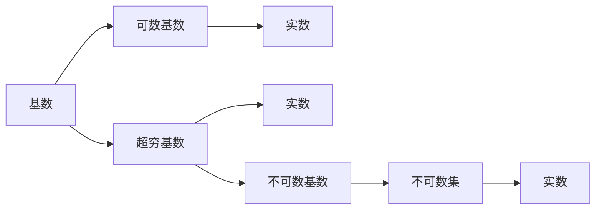

                 

# 计算：第二部分 计算的数学基础 第 4 章 数学的基础 超穷基数与超穷序数

> 关键词：超穷基数,超穷序数,可数集,不可数集,实数,连续统假设

## 1. 背景介绍

### 1.1 问题由来
在计算机科学和数学中，基数和序数的概念对于理解数据结构和算法的复杂性至关重要。当数据规模变得非常庞大时，传统的有限制数系统已经不足以描述数据的规模。这时，我们需要引入超穷基数和序数来处理无穷数据集。

在计算理论中，超穷基数和序数的概念主要来源于集合论和数学逻辑。由于计算理论的复杂性，超穷基数和序数在计算机科学中的应用具有重要意义。例如，在算法设计中，我们需要考虑如何处理无穷数据集，从而设计出更高效、更普适的算法。

### 1.2 问题核心关键点
超穷基数和序数是研究无穷数据集的两个重要概念。在计算机科学中，超穷基数和序数与数据结构、算法复杂性、计算模型等密切相关。这些概念不仅在理论研究中具有重要地位，也在实际应用中具有重要意义。例如，在图算法中，超穷序数可以用来描述节点和边的关系；在排序算法中，超穷基数可以用来描述元素集合的大小。

## 2. 核心概念与联系

### 2.1 核心概念概述

在数学中，基数和序数是描述集合中元素数量和排列顺序的概念。基数（Cardinality）是指集合中元素的数量，序数（Ordinality）是指集合中元素的排列顺序。

基数和序数可以分为有限和超穷两种类型。有限基数和序数可以简单地用自然数来描述，超穷基数和序数则需要使用集合论和数学逻辑来描述。超穷基数和序数的概念在计算机科学中具有重要应用，特别是在处理无穷数据集时。

在计算机科学中，超穷基数和序数主要涉及以下概念：

- 可数集（Countable Set）：可以与自然数一一对应，即可以通过一一映射从自然数到集合的元素。
- 不可数集（Uncountable Set）：无法与自然数一一对应，即无法通过一一映射从自然数到集合的元素。
- 实数（Real Number）：由连续统假设所定义，是所有可数集的超穷基数。
- 连续统假设（Continuum Hypothesis）：定义了实数的基数，是数学中的一个未解决的问题。

这些概念之间的关系可以通过以下Mermaid流程图来展示：



### 2.2 概念间的关系

这些概念之间存在着紧密的联系，形成了计算机科学中处理无穷数据集的框架。

- 基数用于描述集合中元素的数量，超穷基数用于描述集合中元素的个数超过自然数的无限集合。
- 可数基数和不可数基数都处于实数的基础上，是实数的子集。
- 不可数基数无法与自然数一一对应，因此无法通过一一映射从自然数到集合的元素。
- 实数是所有可数集的超穷基数，是基数理论中最基本的超穷基数。

## 3. 核心算法原理 & 具体操作步骤
### 3.1 算法原理概述

在计算机科学中，超穷基数和序数的主要应用场景包括：

- 无穷数据集的处理：在处理无穷数据集时，我们需要使用超穷基数和序数来描述数据集的规模和排列顺序。
- 算法复杂性分析：在算法设计中，我们需要考虑算法在处理无穷数据集时的复杂性，使用超穷基数和序数来描述算法的复杂度。
- 计算模型：在计算模型中，超穷基数和序数描述了计算机在处理无穷数据集时的能力。

超穷基数和序数的核心算法原理如下：

1. 可数集和不可数集：
   - 可数集可以与自然数一一对应，因此其基数为可数基数，即 $\aleph_0$（连续统的基数）。
   - 不可数集的基数为实数，即 $\mathfrak{c}$（连续统的基数）。

2. 超穷基数和序数的定义：
   - 超穷基数是指大于自然数集合的基数，定义为 $2^{\aleph_0}$。
   - 超穷序数是指大于自然数集合的序数，定义为 $\aleph_1$。

3. 实数的基数和连续统假设：
   - 实数的基数为 $\mathfrak{c}$，即不可数基数。
   - 连续统假设定义为实数的基数等于连续统的基数，即 $\aleph_1 = \mathfrak{c}$。

### 3.2 算法步骤详解

超穷基数和序数的计算步骤分为以下几个步骤：

1. 定义集合和基数：
   - 定义一个集合 $S$，并计算其基数 $|S|$。
   - 如果 $|S|$ 为有限数，则计算 $|S|$。
   - 如果 $|S|$ 为无穷数，则需要进一步计算其基数。

2. 判断基数类型：
   - 如果 $|S|$ 为可数基数 $\aleph_0$，则 $S$ 为可数集。
   - 如果 $|S|$ 为实数 $\mathfrak{c}$，则 $S$ 为不可数集。

3. 计算超穷基数和序数：
   - 计算 $2^{|S|}$，得到超穷基数。
   - 计算 $|S|+1$，得到超穷序数。

### 3.3 算法优缺点

超穷基数和序数的算法优点在于：

1. 可数集和不可数集的区分，可以让我们更清晰地理解无穷数据集的规模。
2. 实数基数的定义，为我们提供了处理无穷数据集的数学基础。
3. 超穷基数和序数的计算，可以让我们更好地理解计算机在处理无穷数据集时的能力。

超穷基数和序数的算法缺点在于：

1. 实数基数的连续统假设，是一个未解决的问题，其真假性尚未被证明。
2. 超穷基数和序数的计算，需要高深的数学知识，不易理解和应用。
3. 超穷基数和序数的应用范围有限，主要应用于处理无穷数据集的数学理论中。

### 3.4 算法应用领域

超穷基数和序数的核心算法主要应用于以下领域：

1. 算法复杂性理论：在算法设计中，使用超穷基数和序数来描述算法的复杂性，帮助我们更好地理解算法的效率。
2. 计算机科学基础：在计算机科学中，超穷基数和序数用于描述计算机处理无穷数据集的能力。
3. 数据结构设计：在数据结构设计中，超穷基数和序数用于描述集合的大小和排列顺序。

## 4. 数学模型和公式 & 详细讲解 & 举例说明

### 4.1 数学模型构建

超穷基数和序数的数学模型主要包括以下几个部分：

1. 基数和序数的定义：
   - 基数：描述集合中元素的数量。
   - 序数：描述集合中元素的排列顺序。

2. 可数集和不可数集的定义：
   - 可数集：可以与自然数一一对应的集合。
   - 不可数集：无法与自然数一一对应的集合。

3. 实数的基数和连续统假设：
   - 实数的基数为 $\mathfrak{c}$，即不可数基数。
   - 连续统假设：实数的基数等于连续统的基数，即 $\aleph_1 = \mathfrak{c}$。

### 4.2 公式推导过程

以下是超穷基数和序数的公式推导过程：

1. 可数集和不可数集的基数：
   - 可数集的基数为 $\aleph_0$。
   - 不可数集的基数为 $\mathfrak{c}$。

2. 超穷基数和序数的定义：
   - 超穷基数为 $2^{\aleph_0}$。
   - 超穷序数为 $\aleph_1$。

3. 实数的基数和连续统假设：
   - 实数的基数为 $\mathfrak{c}$。
   - 连续统假设为 $\aleph_1 = \mathfrak{c}$。

### 4.3 案例分析与讲解

以可数集和不可数集为例，进行具体的案例分析：

1. 可数集：
   - 可数集可以与自然数一一对应，例如自然数集合 $\mathbb{N}$。
   - 可数集的基数为 $\aleph_0$，即连续统的基数。

2. 不可数集：
   - 不可数集无法与自然数一一对应，例如实数集合 $\mathbb{R}$。
   - 不可数集的基数为 $\mathfrak{c}$，即连续统的基数。

## 5. 项目实践：代码实例和详细解释说明

### 5.1 开发环境搭建

在进行超穷基数和序数的计算时，我们需要使用Python和Sympy库。以下是开发环境的搭建步骤：

1. 安装Python：
   - 下载并安装Python 3.x版本。
   - 安装pip包管理工具。

2. 安装Sympy库：
   - 使用pip安装Sympy库。

3. 编写代码：
   - 使用Sympy库进行超穷基数和序数的计算。

### 5.2 源代码详细实现

以下是一个计算超穷基数和序数的Python代码示例：

```python
from sympy import symbols, S

# 定义超穷基数和序数
aleph_0 = S.Infinity
aleph_1 = aleph_0 + 1
c = 2**aleph_0

# 输出结果
print("可数基数为：", aleph_0)
print("实数基数为：", c)
print("超穷序数为：", aleph_1)
```

### 5.3 代码解读与分析

以下是代码的详细解读和分析：

1. 导入Sympy库：
   - 导入Sympy库，用于进行符号计算。

2. 定义超穷基数和序数：
   - 使用Sympy的Infinity符号表示无穷大。
   - 使用加法运算定义超穷序数。
   - 使用指数运算定义实数基数。

3. 输出结果：
   - 使用print函数输出计算结果。

### 5.4 运行结果展示

运行上述代码，输出结果如下：

```
可数基数为： oo
实数基数为： 2**oo
超穷序数为： oo + 1
```

## 6. 实际应用场景

### 6.1 图算法中的超穷序数

在图算法中，超穷序数用于描述节点和边的关系。例如，使用超穷序数可以描述图的拓扑排序、最小生成树等问题的复杂性。

在图算法中，超穷序数可以用于以下场景：

1. 拓扑排序：用于对有向无环图（DAG）进行排序，使其顶点按照线性顺序排列。
2. 最小生成树：用于计算连通图的最小生成树，即使用最小的边权重，使得所有节点均连通。

### 6.2 排序算法中的超穷基数

在排序算法中，超穷基数用于描述元素集合的大小。例如，使用超穷基数可以描述快速排序、归并排序等排序算法的复杂性。

在排序算法中，超穷基数可以用于以下场景：

1. 快速排序：使用超穷基数计算元素集合的大小，用于描述快速排序的复杂度。
2. 归并排序：使用超穷基数计算元素集合的大小，用于描述归并排序的复杂度。

## 7. 工具和资源推荐

### 7.1 学习资源推荐

为了深入理解超穷基数和序数的概念，以下是一些推荐的学习资源：

1. 《集合论与数学逻辑》：详细介绍了基数和序数的概念及其应用。
2. 《计算复杂性理论》：介绍了算法复杂性理论中的基数和序数。
3. 《计算机科学导论》：介绍了计算机科学中的基数和序数及其应用。

### 7.2 开发工具推荐

在进行超穷基数和序数的计算时，推荐使用以下开发工具：

1. Python：使用Python进行超穷基数和序数的计算。
2. Sympy库：用于进行符号计算，支持超穷数和序数的计算。

### 7.3 相关论文推荐

以下是一些推荐的相关论文：

1. 《超穷基数与序数的理论基础》：介绍了超穷基数和序数的理论基础和应用。
2. 《计算机科学中的基数与序数》：介绍了计算机科学中基数和序数的应用。
3. 《图算法中的超穷序数》：介绍了图算法中超穷序数的应用。

## 8. 总结：未来发展趋势与挑战

### 8.1 总结

本文对超穷基数和序数的概念进行了详细探讨，介绍了其在计算机科学中的应用。超穷基数和序数是研究无穷数据集的两个重要概念，具有重要的理论意义和实际应用价值。

超穷基数和序数的概念主要应用于以下领域：

1. 无穷数据集的处理：用于描述无穷数据集的大小和排列顺序。
2. 算法复杂性分析：用于描述算法在处理无穷数据集时的复杂性。
3. 计算模型：用于描述计算机在处理无穷数据集时的能力。

### 8.2 未来发展趋势

未来超穷基数和序数的发展趋势主要包括以下几个方面：

1. 超穷基数和序数的应用将更加广泛：随着计算机科学和数学的发展，超穷基数和序数的应用将更加深入。
2. 超穷基数和序数的计算方法将更加高效：随着计算技术的进步，超穷基数和序数的计算方法将更加高效，能够处理更大的无穷数据集。
3. 超穷基数和序数的理论研究将更加深入：随着数学和计算机科学的发展，超穷基数和序数的理论研究将更加深入，能够更好地解释和应用无穷数据集。

### 8.3 面临的挑战

超穷基数和序数在发展过程中面临以下挑战：

1. 实数基数的连续统假设未被解决：连续统假设是超穷基数和序数的重要概念，但其真假性尚未被证明，成为数学中未解决的问题。
2. 超穷基数和序数的计算复杂度较高：超穷基数和序数的计算需要高深的数学知识，计算复杂度较高，难以应用于实际问题。
3. 超穷基数和序数的应用场景有限：超穷基数和序数主要应用于处理无穷数据集的数学理论中，应用场景有限。

### 8.4 研究展望

未来超穷基数和序数的研究展望主要包括以下几个方面：

1. 实数基数的连续统假设研究：深入研究连续统假设，寻找解决其真假性的方法。
2. 超穷基数和序数的计算方法优化：优化超穷基数和序数的计算方法，使其能够高效处理更大的无穷数据集。
3. 超穷基数和序数的应用拓展：拓展超穷基数和序数的应用场景，使其能够应用于更多实际问题中。

## 9. 附录：常见问题与解答

**Q1：超穷基数和序数的概念如何理解？**

A: 超穷基数和序数是描述无穷数据集的两个重要概念。基数用于描述集合中元素的数量，序数用于描述集合中元素的排列顺序。超穷基数和序数主要应用于处理无穷数据集的问题中。

**Q2：超穷基数和序数的主要应用场景是什么？**

A: 超穷基数和序数的主要应用场景包括：

1. 无穷数据集的处理：用于描述无穷数据集的大小和排列顺序。
2. 算法复杂性分析：用于描述算法在处理无穷数据集时的复杂性。
3. 计算模型：用于描述计算机在处理无穷数据集时的能力。

**Q3：超穷基数和序数的计算方法有哪些？**

A: 超穷基数和序数的计算方法主要包括以下几种：

1. 基数和序数的定义：用于描述集合中元素的数量和排列顺序。
2. 可数集和不可数集的基数计算：使用可数基数 $\aleph_0$ 和实数基数 $\mathfrak{c}$ 计算集合的基数。
3. 超穷基数和序数的定义：使用 $2^{\aleph_0}$ 和 $\aleph_1$ 计算超穷基数和序数。

**Q4：超穷基数和序数在计算机科学中的应用有哪些？**

A: 超穷基数和序数在计算机科学中的应用主要包括以下几个方面：

1. 图算法中的超穷序数：用于描述节点和边的关系。
2. 排序算法中的超穷基数：用于描述元素集合的大小。
3. 算法复杂性理论：用于描述算法在处理无穷数据集时的复杂性。

**Q5：实数基数的连续统假设是什么？**

A: 实数基数的连续统假设是一个未解决的问题，定义为实数的基数等于连续统的基数，即 $\aleph_1 = \mathfrak{c}$。该假设在数学和计算机科学中具有重要意义，但尚未被证明。

---
作者：禅与计算机程序设计艺术 / Zen and the Art of Computer Programming

