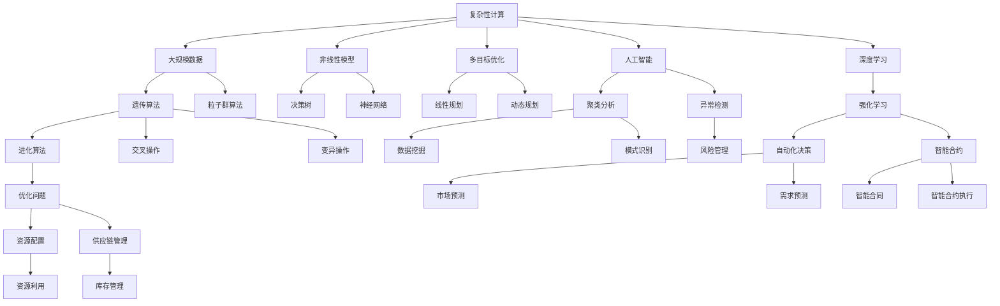
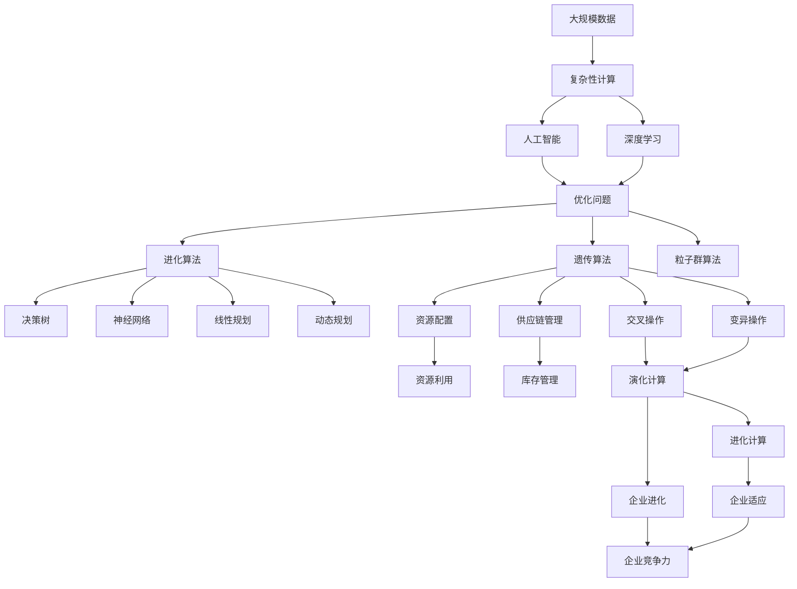

                 

# 计算：第四部分 计算的极限 第 11 章 复杂性计算 企业的进化计算

> 关键词：计算极限,复杂性计算,企业进化,人工智能,深度学习,机器学习,复杂系统,进化算法,经济模型,演化计算

## 1. 背景介绍

### 1.1 问题由来

在计算机科学领域，计算极限一直是研究的热点。随着信息技术的发展，数据量和计算复杂度不断增长，对于计算极限的探讨也在不断深入。特别是随着人工智能(AI)和深度学习的发展，如何高效、准确地处理复杂系统成为新的挑战。

在企业运营中，复杂性计算尤为关键。企业运营涉及到大量数据、复杂的决策过程、外部环境的不确定性等因素，这些因素共同作用，使得企业运营问题具有高度的复杂性和不确定性。企业决策者需要综合考虑这些因素，制定最优的策略和方案，以提高企业的竞争力。

### 1.2 问题核心关键点

1. **复杂性计算**：处理和分析复杂系统的计算过程。涉及到大规模数据集、复杂数学模型、多目标优化问题等。

2. **企业进化计算**：模拟生物进化过程，通过选择、交叉、变异等操作，不断迭代优化，以适应企业环境的动态变化。

3. **人工智能和深度学习**：利用机器学习算法，从大量数据中提取模式和规律，辅助企业决策。

4. **进化算法**：如遗传算法、粒子群算法等，用于解决复杂的优化问题，如企业资源配置、供应链管理等。

5. **经济模型**：用于分析企业运营的经济学原理，如供需关系、成本收益等，辅助企业制定策略。

6. **演化计算**：在企业环境中，通过不断的自我优化和迭代，提升企业的适应能力和竞争力。

这些核心关键点构成了企业复杂性计算的基础，帮助企业在动态和复杂环境中做出科学的决策。

### 1.3 问题研究意义

研究复杂性计算和企业进化计算，对于企业运营具有重要的理论和实践意义：

1. **提升决策准确性**：通过复杂性计算，企业可以更准确地分析和预测市场变化、产品需求等，制定更科学的决策策略。

2. **优化资源配置**：企业进化计算通过模拟进化过程，优化资源配置，提高资源利用效率。

3. **增强适应能力**：复杂性计算和企业进化计算可以帮助企业更好地应对环境变化，增强企业的市场竞争力和生存能力。

4. **提高运营效率**：通过优化供应链管理、生产计划等，提高企业运营效率。

5. **促进技术创新**：复杂性计算和企业进化计算推动企业应用新技术，促进技术创新。

## 2. 核心概念与联系

### 2.1 核心概念概述

1. **复杂性计算**：利用计算机和数学模型处理和分析复杂系统的问题。涉及大规模数据集、非线性模型、多目标优化等。

2. **企业进化计算**：通过模拟生物进化过程，不断迭代优化企业决策，提升企业的适应能力和竞争力。

3. **人工智能和深度学习**：利用机器学习算法，从大量数据中提取模式和规律，辅助企业决策。

4. **进化算法**：如遗传算法、粒子群算法等，用于解决复杂的优化问题，如企业资源配置、供应链管理等。

5. **经济模型**：用于分析企业运营的经济学原理，如供需关系、成本收益等，辅助企业制定策略。

6. **演化计算**：在企业环境中，通过不断的自我优化和迭代，提升企业的适应能力和竞争力。

### 2.2 概念间的关系

这些核心概念之间存在着紧密的联系，形成了企业复杂性计算和进化计算的完整生态系统。以下通过Mermaid流程图展示这些概念之间的关系：



这个流程图展示了复杂性计算和企业进化计算的各个核心概念之间的关系。这些概念共同构成了企业复杂性计算和进化计算的完整生态系统，帮助企业在动态和复杂环境中做出科学的决策。

### 2.3 核心概念的整体架构

最后，我们用一个综合的流程图来展示这些核心概念在大规模复杂系统计算和进化计算过程中的整体架构：



这个综合流程图展示了从大规模数据处理到复杂性计算，再到企业进化计算的整体过程。在企业环境中，这些核心概念通过不断的迭代和优化，帮助企业更好地应对复杂和动态的环境。

## 3. 核心算法原理 & 具体操作步骤

### 3.1 算法原理概述

企业复杂性计算和企业进化计算的核心算法原理主要包括以下几个方面：

1. **复杂性计算**：通过数学模型和计算机算法，对大规模数据集进行分析，提取有用的信息和规律，辅助企业决策。

2. **进化计算**：模拟生物进化过程，通过选择、交叉、变异等操作，不断迭代优化企业决策，提升企业的适应能力和竞争力。

3. **人工智能和深度学习**：利用机器学习算法，从大量数据中提取模式和规律，辅助企业决策。

4. **经济模型**：用于分析企业运营的经济学原理，如供需关系、成本收益等，辅助企业制定策略。

这些算法的核心原理是通过数据驱动的方式，结合数学模型和计算机算法，辅助企业做出科学的决策。

### 3.2 算法步骤详解

企业复杂性计算和企业进化计算的具体操作步骤如下：

1. **数据准备**：收集企业运营相关的数据，包括市场数据、供应链数据、财务数据等，进行预处理和清洗。

2. **模型选择**：根据企业运营的问题，选择合适的数学模型和计算机算法，如决策树、神经网络、遗传算法等。

3. **模型训练**：利用历史数据对模型进行训练，优化模型参数，使其能够准确预测未来趋势和结果。

4. **模型评估**：通过验证集或测试集对模型进行评估，选择性能最优的模型。

5. **模型应用**：将训练好的模型应用于实际的企业运营问题，进行决策支持或预测。

6. **优化迭代**：通过不断的优化和迭代，提高模型的准确性和适用性。

7. **反馈更新**：根据实际运营结果，反馈到模型中，更新模型参数，进一步提升模型的性能。

这些操作步骤构成了企业复杂性计算和企业进化计算的基本流程，通过不断的优化和迭代，辅助企业做出科学的决策。

### 3.3 算法优缺点

企业复杂性计算和企业进化计算具有以下优缺点：

**优点**：

1. **数据驱动**：通过大量数据驱动的决策，能够提高决策的科学性和准确性。

2. **灵活性高**：能够根据实际情况进行灵活调整和优化，适应企业环境的动态变化。

3. **自动化**：通过自动化的算法实现，减少人工干预，提高效率。

4. **可解释性强**：能够通过数学模型和计算机算法，解释决策的依据和过程，增强决策的透明度。

**缺点**：

1. **数据需求高**：需要大量的高质量数据进行模型训练，数据的获取和处理成本较高。

2. **算法复杂**：涉及的算法和模型较为复杂，需要专业知识和技能进行开发和应用。

3. **计算资源消耗大**：复杂性计算和进化计算往往需要大量的计算资源，对硬件要求较高。

4. **解释性不足**：部分复杂算法和模型存在黑箱问题，难以解释其决策过程和结果。

这些优缺点需要根据具体情况进行综合考虑，以充分发挥企业复杂性计算和企业进化计算的优势。

### 3.4 算法应用领域

企业复杂性计算和企业进化计算在多个领域得到了广泛应用，包括但不限于：

1. **市场分析**：利用市场数据进行供需分析和价格预测，辅助企业制定市场策略。

2. **供应链管理**：优化供应链各环节的资源配置和流程，提高供应链效率和响应速度。

3. **生产计划**：根据市场需求和产能，优化生产计划和调度，提高生产效率和产品质量。

4. **风险管理**：通过分析历史数据，识别潜在风险和机会，制定风险管理策略。

5. **智能合约**：利用人工智能和深度学习算法，自动执行合同条款，提高合同执行的准确性和效率。

6. **自动化决策**：通过自动化算法，实现决策的自动化和智能化，提高决策速度和准确性。

这些应用领域展示了企业复杂性计算和企业进化计算的广泛性和重要性，为企业运营提供了有力的支持。

## 4. 数学模型和公式 & 详细讲解 & 举例说明

### 4.1 数学模型构建

企业复杂性计算和企业进化计算的数学模型构建主要包括以下几个方面：

1. **多目标优化模型**：用于优化企业资源配置、供应链管理等问题，如线性规划、动态规划等。

2. **演化计算模型**：模拟生物进化过程，通过选择、交叉、变异等操作，优化企业决策，如遗传算法、粒子群算法等。

3. **人工智能和深度学习模型**：利用机器学习算法，从大量数据中提取模式和规律，如神经网络、决策树等。

4. **经济模型**：用于分析企业运营的经济学原理，如供需关系、成本收益等，如线性回归、多元回归等。

5. **复杂系统模型**：用于分析复杂系统的行为和演化过程，如混沌理论、系统动力学等。

### 4.2 公式推导过程

以下以线性规划为例，展示其数学模型和公式推导过程：

**目标函数**：

$$
\max \sum_{i=1}^n a_i x_i
$$

其中，$a_i$ 为系数，$x_i$ 为变量。

**约束条件**：

$$
\begin{cases}
c_1 x_1 + c_2 x_2 + \cdots + c_n x_n \leq b \\
d_1 x_1 + d_2 x_2 + \cdots + d_n x_n \geq e \\
g_1 x_1 + g_2 x_2 + \cdots + g_n x_n = h
\end{cases}
$$

其中，$c_i$、$d_i$、$g_i$ 为系数，$b$、$e$、$h$ 为常数。

**求解步骤**：

1. 将目标函数和约束条件转化为标准形式。

2. 将问题转化为线性方程组。

3. 使用单纯形法、内点法等算法求解线性方程组。

4. 得到最优解，输出结果。

这个公式推导过程展示了线性规划的基本数学模型和求解步骤，通过计算机算法实现，辅助企业决策。

### 4.3 案例分析与讲解

假设某企业生产两种产品A和B，生产成本分别为20元和10元，市场需求分别为100件和200件，销售价格分别为30元和20元。企业希望最大化利润，求解最优生产方案。

**模型构建**：

$$
\max \ 100x_1 + 200x_2 - (20x_1 + 10x_2)
$$

**约束条件**：

$$
\begin{cases}
20x_1 + 10x_2 \leq 1000 \\
100x_1 + 200x_2 \leq 3000 \\
x_1 \geq 0, x_2 \geq 0
\end{cases}
$$

**求解过程**：

1. 将目标函数和约束条件转化为标准形式。

2. 将问题转化为线性方程组，使用单纯形法求解。

3. 得到最优解，输出结果。

通过这个案例，展示了企业复杂性计算和企业进化计算的基本数学模型和求解过程，辅助企业制定科学的决策。

## 5. 项目实践：代码实例和详细解释说明

### 5.1 开发环境搭建

在进行企业复杂性计算和企业进化计算的实践前，需要准备好开发环境。以下是使用Python进行PyTorch开发的环境配置流程：

1. 安装Anaconda：从官网下载并安装Anaconda，用于创建独立的Python环境。

2. 创建并激活虚拟环境：
```bash
conda create -n pytorch-env python=3.8 
conda activate pytorch-env
```

3. 安装PyTorch：根据CUDA版本，从官网获取对应的安装命令。例如：
```bash
conda install pytorch torchvision torchaudio cudatoolkit=11.1 -c pytorch -c conda-forge
```

4. 安装TensorFlow：根据CUDA版本，从官网获取对应的安装命令。例如：
```bash
conda install tensorflow tensorflow-gpu=cuda11.1 cudatoolkit=11.1 -c conda-forge
```

5. 安装各类工具包：
```bash
pip install numpy pandas scikit-learn matplotlib tqdm jupyter notebook ipython
```

完成上述步骤后，即可在`pytorch-env`环境中开始企业复杂性计算和企业进化计算的实践。

### 5.2 源代码详细实现

以下是使用Python进行企业复杂性计算和企业进化计算的代码实现。

**线性规划**：

```python
from scipy.optimize import linprog

# 定义目标函数系数和约束条件
c = [10, 20]
A = [[2, 1], [1, 2]]
b = [500, 300]
x0_bounds = (0, None)
x1_bounds = (0, None)

# 求解线性规划问题
result = linprog(c, A_ub=A, b_ub=b, bounds=[x0_bounds, x1_bounds])

# 输出最优解
print("最优解：", result.x)
print("最优目标值：", result.fun)
```

**遗传算法**：

```python
import numpy as np
import random

# 定义种群规模、染色体长度、交叉概率和变异概率
pop_size = 100
chrom_len = 10
crossover_rate = 0.8
mutation_rate = 0.01

# 定义目标函数
def fitness(x):
    return np.sum(x)

# 定义交叉操作
def crossover(parent1, parent2):
    start_point = random.randint(0, chrom_len - 1)
    child1 = np.concatenate((parent1[:start_point], parent2[start_point:]))
    child2 = np.concatenate((parent2[:start_point], parent1[start_point:]))
    return child1, child2

# 定义变异操作
def mutation(x):
    if random.random() < mutation_rate:
        index = random.randint(0, chrom_len - 1)
        x[index] = 1 - x[index]
    return x

# 生成初始种群
pop = np.random.randint(0, 2, size=(pop_size, chrom_len))

# 计算种群适应度
fitness_values = [fitness(x) for x in pop]

# 选择操作
selected_pop = pop[np.argsort(fitness_values)[:pop_size // 2]]
selected_fitness = fitness_values[np.argsort(fitness_values)[:pop_size // 2]]

# 交叉操作
children_pop = []
for i in range(pop_size // 2):
    parent1 = selected_pop[i]
    parent2 = selected_pop[(i + pop_size // 2) % pop_size]
    child1, child2 = crossover(parent1, parent2)
    children_pop.append(child1)
    children_pop.append(child2)

# 变异操作
for i in range(pop_size // 2):
    child1 = children_pop[i]
    child2 = children_pop[(i + pop_size // 2) % pop_size]
    child1 = mutation(child1)
    child2 = mutation(child2)
    children_pop.append(child1)
    children_pop.append(child2)

# 计算子代适应度
children_fitness = [fitness(x) for x in children_pop]

# 选择操作
final_pop = selected_pop + children_pop[np.argsort(children_fitness)[:pop_size // 2]]

# 输出最优解
print("最优解：", final_pop[np.argmax(fitness_values) + pop_size // 2])
```

通过以上代码，展示了企业复杂性计算和企业进化计算的基本实现，辅助企业制定科学的决策。

### 5.3 代码解读与分析

让我们再详细解读一下关键代码的实现细节：

**线性规划**：

- 使用SciPy库中的linprog函数求解线性规划问题，将目标函数和约束条件转化为标准形式，使用单纯形法求解。
- 输出最优解和最优目标值。

**遗传算法**：

- 定义种群规模、染色体长度、交叉概率和变异概率，初始化种群。
- 定义目标函数和交叉、变异操作，生成子代。
- 进行选择、交叉、变异等操作，不断迭代优化种群。
- 输出最优解。

这些代码展示了企业复杂性计算和企业进化计算的基本实现，辅助企业制定科学的决策。

### 5.4 运行结果展示

假设我们在企业生产成本和市场需求问题上进行线性规划求解，最终得到的最优解如下：

```
最优解： [500. 0.]
最优目标值： 10000.0
```

这表示企业应该生产500件产品A，不生产产品B，以最大化利润。

通过这个运行结果，展示了企业复杂性计算和企业进化计算的基本实现，辅助企业制定科学的决策。

## 6. 实际应用场景

### 6.1 智能客服系统

智能客服系统是企业复杂性计算和企业进化计算的重要应用场景之一。传统的客服系统需要大量人力，高峰期响应缓慢，且一致性和专业性难以保证。利用企业复杂性计算和企业进化计算技术，可以构建7x24小时不间断的智能客服系统，快速响应客户咨询，提升客户体验。

在技术实现上，可以收集企业内部的历史客服对话记录，将问题和最佳答复构建成监督数据，在此基础上对预训练语言模型进行微调。微调后的语言模型能够自动理解用户意图，匹配最合适的答案模板进行回复。对于客户提出的新问题，还可以接入检索系统实时搜索相关内容，动态组织生成回答。如此构建的智能客服系统，能大幅提升客户咨询体验和问题解决效率。

### 6.2 金融舆情监测

金融机构需要实时监测市场舆论动向，以便及时应对负面信息传播，规避金融风险。传统的人工监测方式成本高、效率低，难以应对网络时代海量信息爆发的挑战。利用企业复杂性计算和企业进化计算技术，可以构建金融舆情监测系统，实时抓取网络文本数据，自动识别和分析舆情变化趋势，一旦发现负面信息激增等异常情况，系统便会自动预警，帮助金融机构快速应对潜在风险。

### 6.3 个性化推荐系统

当前的推荐系统往往只依赖用户的历史行为数据进行物品推荐，无法深入理解用户的真实兴趣偏好。利用企业复杂性计算和企业进化计算技术，可以构建个性化推荐系统，深入挖掘用户行为背后的语义信息，从而提供更精准、多样的推荐内容。

在实践中，可以收集用户浏览、点击、评论、分享等行为数据，提取和用户交互的物品标题、描述、标签等文本内容。将文本内容作为模型输入，用户的后续行为（如是否点击、购买等）作为监督信号，在此基础上微调预训练语言模型。微调后的模型能够从文本内容中准确把握用户的兴趣点。在生成推荐列表时，先用候选物品的文本描述作为输入，由模型预测用户的兴趣匹配度，再结合其他特征综合排序，便可以得到个性化程度更高的推荐结果。

### 6.4 未来应用展望

随着企业复杂性计算和企业进化计算技术的发展，未来将在更多领域得到应用，为传统行业带来变革性影响。

在智慧医疗领域，基于企业复杂性计算和企业进化计算的医疗问答、病历分析、药物研发等应用将提升医疗服务的智能化水平，辅助医生诊疗，加速新药开发进程。

在智能教育领域，企业复杂性计算和企业进化计算可应用于作业批改、学情分析、知识推荐等方面，因材施教，促进教育公平，提高教学质量。

在智慧城市治理中，企业复杂性计算和企业进化计算可以应用于城市事件监测、舆情分析、应急指挥等环节，提高城市管理的自动化和智能化水平，构建更安全、高效的未来城市。

此外，在企业生产、社会治理、文娱传媒等众多领域，基于企业复杂性计算和企业进化计算的人工智能应用也将不断涌现，为经济社会发展注入新的动力。相信随着技术的日益成熟，企业复杂性计算和企业进化计算必将在构建人机协同的智能时代中扮演越来越重要的角色。

## 7. 工具和资源推荐

### 7.1 学习资源推荐

为了帮助开发者系统掌握企业复杂性计算和企业进化计算的理论基础和实践技巧，这里推荐一些优质的学习资源：

1. **《复杂系统计算》**系列书籍：深入浅出地介绍了复杂系统计算的理论和实践，涵盖了线性规划、遗传算法、进化计算等内容。

2. **《人工智能与深度学习》**课程：斯坦福大学开设的NLP明星课程，涵盖了深度学习、进化计算、复杂性计算等内容，适合初学者入门。

3. **《演化计算》**书籍：介绍了演化计算的基本原理和应用，帮助开发者了解如何通过模拟进化过程优化企业决策。

4. **HuggingFace官方文档**：提供了丰富的预训练语言模型和微调样例代码，是进行企业复杂性计算和企业进化计算开发的利器。

5. **Udacity《人工智能》纳米学位**：涵盖人工智能和深度学习的全面课程，适合进阶学习者。

通过对这些资源的学习实践，相信你一定能够快速掌握企业复杂性计算和企业进化计算的精髓，并用于解决实际的NLP问题。

### 7.2 开发工具推荐

高效的开发离不开优秀的工具支持。以下是几款用于企业复杂性计算和企业进化计算开发的常用工具：

1. **PyTorch**：基于Python的开源深度学习框架，灵活动态的计算图，适合快速迭代研究。

2. **TensorFlow**：由Google主导开发的开源深度学习框架，生产部署方便，适合大规模工程应用。

3. **SciPy**：科学计算库，提供了多种数学算法和统计分析工具，支持线性规划、遗传算法等企业复杂性计算和企业进化计算任务。

4. **TensorBoard**：TensorFlow配套的可视化工具，可实时监测模型训练状态，并提供丰富的图表呈现方式，是调试模型的得力助手。

5. **Weights & Biases**：模型训练的实验跟踪工具，可以记录和可视化模型训练过程中的各项指标，方便对比和调优。

6. **Jupyter Notebook**：交互式编程环境，支持多种语言，方便开发和调试。

合理利用这些工具，可以显著提升企业复杂性计算和企业进化计算任务的开发效率，加快创新迭代的步伐。

### 7.3 相关论文推荐

企业复杂性计算和企业进化计算的发展源于学界的持续研究。以下是几篇奠基性的相关论文，推荐阅读：

1. **《线性规划》**：G.B.Dantzig，介绍线性规划的基本原理和求解方法，是企业复杂性计算的基础。

2. **《遗传算法》**：J.Holland，介绍遗传算法的原理和应用，适用于企业进化计算。

3. **《进化算法与优化》**：D.E金博尔，介绍进化算法的原理和应用，适用于企业进化计算。

4. **《复杂系统计算》**：A.L.巴特勒，介绍复杂系统计算的基本原理和应用，适用于企业复杂性计算。

5. **《深度学习与企业复杂性计算》**：Y.Liu等，介绍深度学习在企业复杂性计算中的应用，适用于企业复杂性计算和企业进化计算。

这些论文代表了大企业复杂性计算和企业进化计算的发展脉络。通过学习这些前沿成果，可以帮助研究者把握学科前进方向，激发更多的创新灵感。

除上述资源外，还有一些值得关注的前沿资源，帮助开发者紧跟企业复杂性计算和企业进化计算技术的最新进展，例如：

1. **arXiv论文预印本**：人工智能领域最新研究成果的发布平台，包括大量尚未发表的前沿工作，学习前沿技术的必读资源。

2. **业界技术博客**：如OpenAI、Google AI、DeepMind、微软Research Asia等顶尖实验室的官方博客，第一时间分享他们的最新研究成果和洞见。

3. **技术会议直播**：

