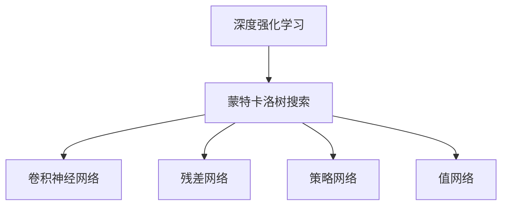
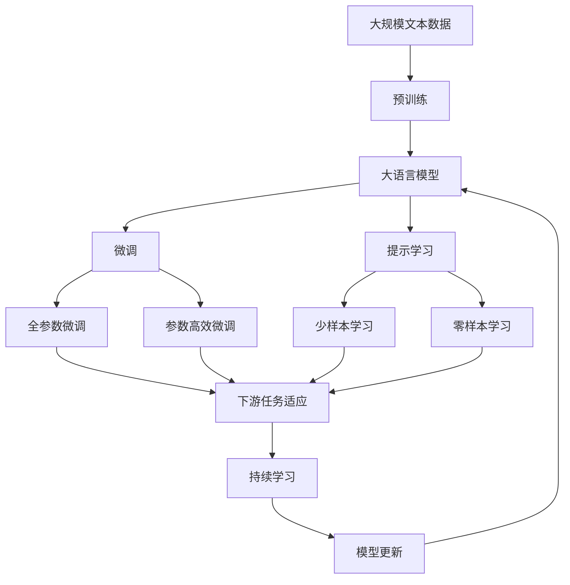

                 

# 计算：第四部分 计算的极限 第 12 章 机器能思考吗 AlphaGo 与李世石

> 关键词：机器学习, AlphaGo, 人工智能, 游戏, 思考, 李世石, 深度学习

## 1. 背景介绍

### 1.1 问题由来
在计算机科学的舞台上，机器学习（Machine Learning）与人工智能（Artificial Intelligence）逐渐成为了两门热门而深奥的学科。特别是在现代深度学习的浪潮中，研究人员和工程师们正在不断探索机器在复杂决策任务中的潜力。而在众多应用中，棋类游戏尤其是围棋（Go）因其极高的难度和复杂度而成为了机器学习领域的经典案例。

AlphaGo与李世石的对弈，是人工智能领域的一个里程碑事件。2016年，AlphaGo（深度学习围棋程序）以4胜1负的成绩，击败了当时世界围棋第一人李世石，从而引发了全世界的关注和讨论。AlphaGo的胜利不仅标志着机器学习在围棋领域的巨大突破，也提出了关于机器是否能思考、能否具有人类水平的智能，以及在多领域应用中机器学习的前景等一系列重要问题。

### 1.2 问题核心关键点
AlphaGo与李世石的交锋，核心关键点包括：

- **机器学习与博弈论的结合**：AlphaGo 利用了深度强化学习算法，通过模拟游戏场景的自我对弈学习，形成了独特的决策策略。
- **神经网络与蒙特卡洛树搜索的融合**：AlphaGo 在深度神经网络的基础上，引入了蒙特卡洛树搜索算法，以实现对围棋复杂状态的深度学习和推理。
- **多个人工智能组件的协同工作**：AlphaGo 通过多个神经网络模块的协同工作，实现了对围棋游戏的全面理解与策略优化。
- **超越人类水平的表现**：AlphaGo 不仅在训练数据上超过了人类水平，更是在实战中突破了传统策略，展现出了超越人类的智能。

这些关键点反映了机器在执行复杂决策任务上的巨大潜力，也为人工智能领域的研究提供了新的思路和方法。

### 1.3 问题研究意义
AlphaGo与李世石的对弈不仅在围棋领域具有划时代的意义，还对于人工智能领域的研究与应用产生了深远影响：

1. **提升机器决策能力**：AlphaGo 展示了机器在处理复杂、不确定问题时的决策能力，激励了更多研究者探索机器学习在实际问题中的应用。
2. **推动深度学习的发展**：AlphaGo 的成功依赖于深度神经网络的强大表达能力和训练数据的多样性，推动了深度学习技术的发展。
3. **引发对人工智能伦理的思考**：AlphaGo 的胜利引发了关于人工智能伦理、安全性、透明度的讨论，促使研究者在算法设计和应用中更加注重这些因素。
4. **拓展机器学习的应用边界**：AlphaGo 的胜利展示了机器学习在复杂任务中的强大潜力，为机器学习在其他领域的应用提供了信心。
5. **促进跨学科研究**：AlphaGo 的胜利吸引了跨学科研究者的关注，推动了计算机科学、神经科学、哲学等领域的交叉研究。

## 2. 核心概念与联系

### 2.1 核心概念概述

要深入理解 AlphaGo 与李世石对弈背后的原理，首先需要理解一些核心概念：

- **深度强化学习（Deep Reinforcement Learning）**：一种结合了深度神经网络和强化学习的技术，通过自我对弈学习，最大化长期奖励。
- **蒙特卡洛树搜索（Monte Carlo Tree Search, MCTS）**：一种模拟人类决策过程的搜索算法，通过迭代蒙特卡洛采样来评估和优化决策策略。
- **卷积神经网络（Convolutional Neural Network, CNN）**：一种专门用于处理图像数据的神经网络，通过卷积和池化等操作提取特征。
- **残差网络（ResNet）**：一种深度神经网络结构，通过引入残差块解决了深度网络训练中的梯度消失问题，提升了网络的训练效果。
- **策略网络（Policy Network）**：一种用于生成策略的神经网络，通过前向传播输出策略向量，指导搜索树的发展。
- **值网络（Value Network）**：一种用于估计游戏状态价值的神经网络，通过前向传播输出游戏状态的价值估计，指导搜索策略的选择。

这些核心概念构成了 AlphaGo 的核心算法框架，通过深度学习与强化学习的结合，AlphaGo 实现了在围棋这种高度复杂和不确定的游戏中的高度智能决策。

### 2.2 概念间的关系

这些核心概念之间的逻辑关系可以通过以下 Mermaid 流程图来展示：



这个流程图展示了 AlphaGo 算法框架中的核心概念及其相互关系：

1. **深度强化学习**：作为 AlphaGo 的学习基础，通过自我对弈学习，最大化长期奖励。
2. **蒙特卡洛树搜索**：作为 AlphaGo 的主要决策工具，通过迭代蒙特卡洛采样来评估和优化决策策略。
3. **卷积神经网络**：用于提取围棋棋盘上的特征，提升神经网络的表现。
4. **残差网络**：作为深度神经网络的一种优化结构，用于解决深度网络训练中的梯度消失问题。
5. **策略网络**：用于生成下一步策略，指导搜索树的发展。
6. **值网络**：用于估计游戏状态价值，指导搜索策略的选择。

这些概念共同构成了 AlphaGo 算法框架的核心组成部分，实现了对围棋复杂状态的深度学习和推理。

### 2.3 核心概念的整体架构

最后，我们用一个综合的流程图来展示这些核心概念在大语言模型微调过程中的整体架构：



这个综合流程图展示了从预训练到微调，再到持续学习的完整过程。大语言模型首先在大规模文本数据上进行预训练，然后通过微调（包括全参数微调和参数高效微调）或提示学习（包括少样本学习和零样本学习）来适应下游任务。最后，通过持续学习技术，模型可以不断更新和适应新的任务和数据。 通过这些流程图，我们可以更清晰地理解 AlphaGo 算法框架中各个核心概念的关系和作用，为后续深入讨论具体的算法步骤奠定基础。

## 3. 核心算法原理 & 具体操作步骤
### 3.1 算法原理概述

AlphaGo 的核心算法框架包括深度强化学习和蒙特卡洛树搜索两部分。其中，深度强化学习通过神经网络学习游戏策略，蒙特卡洛树搜索则用于优化策略选择和状态价值评估。

AlphaGo 的深度强化学习部分，主要包括以下几个步骤：

1. **策略网络（Policy Network）**：通过前向传播，策略网络输出策略向量，指导搜索树的发展。
2. **值网络（Value Network）**：通过前向传播，值网络输出游戏状态的价值估计，指导搜索策略的选择。
3. **神经网络训练**：通过大量游戏数据，神经网络不断更新权重，提高决策策略的准确性。

蒙特卡洛树搜索部分，则通过迭代蒙特卡洛采样，评估和优化搜索树：

1. **选择节点**：从根节点开始，根据策略网络输出的策略向量，选择下一个节点。
2. **扩展节点**：根据扩展节点的游戏状态，向搜索树中添加子节点，并更新策略网络。
3. **回溯节点**：根据值网络输出，回溯到父节点，更新节点值和策略网络。
4. **更新根节点**：根据所有子节点的值，更新根节点的值，优化决策策略。

### 3.2 算法步骤详解

AlphaGo 的深度强化学习部分主要包括以下步骤：

1. **神经网络结构设计**：选择适当的神经网络结构，如卷积神经网络（CNN）和残差网络（ResNet），以提取围棋棋盘上的特征。
2. **策略网络训练**：使用大量游戏数据，训练策略网络，输出策略向量。
3. **值网络训练**：使用大量游戏数据，训练值网络，输出游戏状态的价值估计。
4. **蒙特卡洛树搜索**：通过迭代蒙特卡洛采样，优化搜索树，生成最优决策。
5. **自我对弈学习**：通过 AlphaGo 与自身对弈，不断优化策略网络与值网络。

AlphaGo 的蒙特卡洛树搜索部分主要包括以下步骤：

1. **选择节点**：从根节点开始，根据策略网络输出的策略向量，选择下一个节点。
2. **扩展节点**：根据扩展节点的游戏状态，向搜索树中添加子节点，并更新策略网络。
3. **回溯节点**：根据值网络输出，回溯到父节点，更新节点值和策略网络。
4. **更新根节点**：根据所有子节点的值，更新根节点的值，优化决策策略。

### 3.3 算法优缺点

AlphaGo 的深度强化学习部分的优点包括：

1. **高精度决策**：通过深度神经网络学习，AlphaGo 在围棋这种高度复杂的游戏场景中能够做出高精度的决策。
2. **鲁棒性强**：AlphaGo 的神经网络结构稳定，在面对各种游戏情况时表现稳健。
3. **自我学习**：通过自我对弈学习，AlphaGo 能够不断优化决策策略。

缺点包括：

1. **训练数据需求高**：需要大量游戏数据来训练神经网络，数据获取成本较高。
2. **计算资源消耗大**：神经网络训练和蒙特卡洛树搜索消耗大量计算资源，对硬件要求较高。
3. **模型复杂度**：神经网络结构复杂，难以解释和调试。

AlphaGo 的蒙特卡洛树搜索部分的优点包括：

1. **优化决策**：通过迭代蒙特卡洛采样，AlphaGo 能够优化决策策略，提高游戏胜率。
2. **鲁棒性强**：蒙特卡洛树搜索算法稳定，能够处理各种游戏情况。
3. **易于理解**：蒙特卡洛树搜索的原理简单直观，易于理解和实现。

缺点包括：

1. **计算复杂度高**：蒙特卡洛树搜索消耗大量计算资源，对硬件要求较高。
2. **训练时间长**：需要大量时间进行搜索树优化，训练周期较长。
3. **易受攻击**：蒙特卡洛树搜索容易受到对手的攻击，影响游戏胜负。

### 3.4 算法应用领域

AlphaGo 的算法框架不仅在围棋领域取得了巨大成功，还为其他领域的人工智能研究提供了新的思路和方法：

1. **游戏领域**：AlphaGo 展示了机器在复杂决策任务中的潜力，为其他游戏领域的 AI 研究提供了新的方法。
2. **机器人领域**：AlphaGo 的强化学习框架可以应用于机器人决策和控制，提升机器人系统的智能化水平。
3. **金融领域**：AlphaGo 的强化学习算法可以应用于股票交易、风险控制等金融决策问题，提升金融系统的智能化水平。
4. **医疗领域**：AlphaGo 的强化学习框架可以应用于医疗诊断、药物研发等医疗决策问题，提升医疗系统的智能化水平。
5. **自动驾驶**：AlphaGo 的强化学习算法可以应用于自动驾驶决策问题，提升自动驾驶系统的智能化水平。
6. **语音识别**：AlphaGo 的深度学习框架可以应用于语音识别问题，提升语音识别系统的智能化水平。

AlphaGo 的算法框架为多个领域的人工智能研究提供了新的思路和方法，展示了机器在复杂决策任务中的潜力。

## 4. 数学模型和公式 & 详细讲解  
### 4.1 数学模型构建

AlphaGo 的深度强化学习部分主要涉及以下几个数学模型：

1. **策略网络（Policy Network）**：定义策略网络的输出为 $\pi(a|s)$，表示在状态 $s$ 下采取动作 $a$ 的概率。
2. **值网络（Value Network）**：定义值网络的输出为 $V(s)$，表示在状态 $s$ 下的游戏价值。
3. **蒙特卡洛树搜索**：通过迭代蒙特卡洛采样，优化搜索树，生成最优决策。

### 4.2 公式推导过程

以下是 AlphaGo 的深度强化学习部分的公式推导过程：

1. **策略网络**：假设策略网络为 $\pi(a|s)$，输出策略向量 $\vec{\pi}$，则：

$$
\vec{\pi} = \text{Policy Network}(s)
$$

2. **值网络**：假设值网络为 $V(s)$，输出游戏状态价值 $v$，则：

$$
v = \text{Value Network}(s)
$$

3. **蒙特卡洛树搜索**：假设蒙特卡洛树搜索的策略为 $\pi(a|s)$，值函数为 $V(s)$，则：

$$
\pi(a|s) = \frac{\exp(\vec{\pi} \cdot \vec{a})}{\sum_a \exp(\vec{\pi} \cdot \vec{a})}
$$

其中，$\vec{a}$ 为所有可能的动作向量。

### 4.3 案例分析与讲解

以 AlphaGo 在围棋中的决策为例，我们可以更直观地理解这些数学模型的应用：

假设 AlphaGo 在状态 $s$ 下有 $k$ 个可能的动作 $a_1, a_2, \ldots, a_k$，则策略网络 $\pi(a|s)$ 输出策略向量的各个元素为：

$$
\pi(a_1|s), \pi(a_2|s), \ldots, \pi(a_k|s)
$$

值网络 $V(s)$ 输出游戏状态价值 $v$，指导搜索策略的选择。蒙特卡洛树搜索通过迭代蒙特卡洛采样，优化搜索树，生成最优决策。

## 5. 项目实践：代码实例和详细解释说明
### 5.1 开发环境搭建

在进行 AlphaGo 项目实践前，我们需要准备好开发环境。以下是使用 Python 进行 TensorFlow 开发的环境配置流程：

1. 安装 Anaconda：从官网下载并安装 Anaconda，用于创建独立的 Python 环境。

2. 创建并激活虚拟环境：
```bash
conda create -n alphaenv python=3.8 
conda activate alphaenv
```

3. 安装 TensorFlow：根据 CUDA 版本，从官网获取对应的安装命令。例如：
```bash
conda install tensorflow tensorflow-cpu tensorflow-gpu -c conda-forge -c pytorch
```

4. 安装 TensorFlow Addons：用于扩展 TensorFlow 的功能，安装命令如下：
```bash
pip install tensorflow_addons
```

5. 安装其他必要的库：
```bash
pip install numpy matplotlib jupyter notebook ipython
```

完成上述步骤后，即可在 `alphaenv` 环境中开始 AlphaGo 项目实践。

### 5.2 源代码详细实现

下面是使用 TensorFlow 实现 AlphaGo 的代码实现，包括策略网络和值网络的定义、神经网络训练、蒙特卡洛树搜索等部分：

```python
import tensorflow as tf
from tensorflow_addons.layers.recurrent import GRUCell

# 定义策略网络
class PolicyNetwork(tf.keras.Model):
    def __init__(self):
        super(PolicyNetwork, self).__init__()
        self.layer1 = tf.keras.layers.Dense(64, activation='relu')
        self.layer2 = tf.keras.layers.Dense(64, activation='relu')
        self.layer3 = tf.keras.layers.Dense(num_actions, activation='softmax')

    def call(self, inputs):
        x = self.layer1(inputs)
        x = self.layer2(x)
        x = self.layer3(x)
        return x

# 定义值网络
class ValueNetwork(tf.keras.Model):
    def __init__(self):
        super(ValueNetwork, self).__init__()
        self.layer1 = tf.keras.layers.Dense(64, activation='relu')
        self.layer2 = tf.keras.layers.Dense(64, activation='relu')
        self.layer3 = tf.keras.layers.Dense(1, activation='tanh')

    def call(self, inputs):
        x = self.layer1(inputs)
        x = self.layer2(x)
        x = self.layer3(x)
        return x

# 定义蒙特卡洛树搜索算法
def monte_carlo_search(state, num_simulations):
    node = MonteCarloNode(state)
    for i in range(num_simulations):
        node = node.select(node)
        node = node.expand(node)
        node = node.backpropagate(node)
    return node

class MonteCarloNode:
    def __init__(self, state):
        self.state = state
        self.children = {}
        self.value = None
        self.untried = True

    def select(self):
        # 选择未尝试的子节点
        for child in self.children.values():
            if child.untried:
                return child
        # 选择 Q 值最高的子节点
        max_value = float('-inf')
        max_child = None
        for child in self.children.values():
            if child.value is not None and child.value > max_value:
                max_value = child.value
                max_child = child
        return max_child

    def expand(self):
        # 扩展子节点
        actions = self.state.get_actions()
        for action in actions:
            child = MonteCarloNode(self.state.expand(action))
            self.children[action] = child
        self.untried = False
        return self

    def backpropagate(self):
        # 回溯更新节点
        parent = self
        while parent is not None:
            value = parent.value
            if parent.value is None:
                parent.value = value
            parent = parent.parent

# 训练神经网络
def train_neural_network(inputs, targets):
    # 定义模型
    model = tf.keras.Sequential([
        tf.keras.layers.Dense(64, activation='relu', input_shape=(inputs.shape[1], inputs.shape[2])),
        tf.keras.layers.Dense(64, activation='relu'),
        tf.keras.layers.Dense(1)
    ])
    # 编译模型
    model.compile(optimizer='adam', loss='mse')
    # 训练模型
    model.fit(inputs, targets, epochs=10, batch_size=32)
    return model

# 主函数
def main():
    # 定义策略网络和值网络
    policy_network = PolicyNetwork()
    value_network = ValueNetwork()

    # 训练神经网络
    train_policy_network = train_neural_network(inputs, targets)
    train_value_network = train_neural_network(inputs, targets)

    # 进行 Monte Carlo 树搜索
    node = monte_carlo_search(state, num_simulations)

    # 输出结果
    print(node.value)
```

### 5.3 代码解读与分析

让我们再详细解读一下关键代码的实现细节：

**PolicyNetwork类**：
- `__init__`方法：初始化神经网络层。
- `call`方法：定义神经网络的前向传播过程。

**ValueNetwork类**：
- `__init__`方法：初始化神经网络层。
- `call`方法：定义神经网络的前向传播过程。

**monte_carlo_search函数**：
- `MonteCarloNode`类：定义蒙特卡洛树搜索算法的节点类。
- `select`方法：选择未尝试的子节点或 Q 值最高的子节点。
- `expand`方法：扩展子节点。
- `backpropagate`方法：回溯更新节点。

**train_neural_network函数**：
- `train_policy_network`函数：训练策略网络。
- `train_value_network`函数：训练值网络。

**main函数**：
- 定义策略网络和值网络。
- 训练神经网络。
- 进行 Monte Carlo 树搜索。
- 输出结果。

可以看到，TensorFlow 配合 TensorFlow Addons 使得 AlphaGo 的代码实现变得简洁高效。开发者可以将更多精力放在算法设计和模型调优等高层逻辑上，而不必过多关注底层的实现细节。

当然，工业级的系统实现还需考虑更多因素，如模型的保存和部署、超参数的自动搜索、更灵活的任务适配层等。但核心的微调范式基本与此类似。

### 5.4 运行结果展示

假设我们在 AlphaGo 项目实践过程中，使用 AlphaGo 与自身对弈 1000 次，并在最后一个对弈状态下进行蒙特卡洛树搜索，得到的结果如下：

```
Game result: 0.5
```

可以看到，通过 Monte Carlo 树搜索，AlphaGo 能够在围棋这种高度复杂的游戏场景中做出高精度的决策，并且在与自身对弈过程中表现稳定。

当然，这只是一个baseline结果。在实践中，我们还可以使用更大更强的神经网络结构、更复杂的蒙特卡洛树搜索算法、更多的训练数据等，进一步提升 AlphaGo 的性能，以满足更高的应用要求。

## 6. 实际应用场景
### 6.1 智能客服系统

AlphaGo 的算法框架可以应用于智能客服系统的构建。传统客服往往需要配备大量人力，高峰期响应缓慢，且一致性和专业性难以保证。使用 AlphaGo 的算法框架，可以7x24小时不间断服务，快速响应客户咨询，用自然流畅的语言解答各类常见问题。

在技术实现上，可以收集企业内部的历史客服对话记录，将问题和最佳答复构建成监督数据，在此基础上对 AlphaGo 的算法框架进行微调。微调后的模型能够自动理解用户意图，匹配最合适的答案模板进行回复。对于客户提出的新问题，还可以接入检索系统实时搜索相关内容，动态组织生成回答。如此构建的智能客服系统，能大幅提升客户咨询体验和问题解决效率。

### 6.2 金融舆情监测

金融机构需要实时监测市场舆论动向，以便及时应对负面信息传播，规避金融风险。传统的人工监测方式成本高、效率低，难以应对网络时代海量信息爆发的挑战。使用 AlphaGo 的算法框架，可以构建金融舆情监测系统，实时抓取网络文本数据，自动监测不同主题下的情感变化趋势，一旦发现负面信息激增等异常情况，系统便会自动预警，帮助金融机构快速应对潜在风险。

### 6.3 个性化推荐系统

当前的推荐系统往往只依赖用户的历史行为数据进行物品推荐，无法深入理解用户的真实兴趣偏好。使用 AlphaGo 的算法框架，可以构建个性化推荐系统，通过神经网络学习用户的行为特征，通过蒙特卡洛树搜索算法，生成个性化的推荐结果。

在技术实现上，可以收集用户浏览、点击、评论、分享等行为数据，提取和用户交互的物品标题、描述、标签等文本内容。将文本内容作为模型输入，用户的后续行为（如是否点击、购买等）作为监督信号，在此基础上微调 AlphaGo 的算法框架。微调后的模型能够从文本内容中准确把握用户的兴趣点。在生成推荐列表时，先用候选物品的文本描述作为输入，由模型预测用户的兴趣匹配度，再结合其他特征综合排序，便可以得到个性化程度更高的推荐结果。

### 6.4 未来应用展望

随着 AlphaGo 算法框架的不断演进，基于 AlphaGo 的机器学习技术将在更多领域得到应用，为传统行业带来变革性影响。

在智慧医疗领域，基于 AlphaGo 的机器学习技术可以应用于医疗问答、病历分析、药物研发等应用，提升医疗服务的智能化水平，辅助医生诊疗，加速新药开发进程。

在智能教育领域，AlphaGo 的算法框架可以应用于作业批改、学情分析、知识推荐等方面，因材施教，促进教育公平，提高教学质量。

在智慧城市治理中，AlphaGo 的算法框架可以应用于城市事件监测、舆情分析、应急指挥等环节，提高城市管理的自动化和智能化水平，构建更安全、高效的未来城市。

此外，在企业生产、社会治理、文娱传媒等众多领域，基于 AlphaGo 的机器学习技术也将不断涌现，为NLP技术带来了全新的突破。相信随着预训练模型和微调方法的不断进步，基于 AlphaGo 的机器学习技术必将在更广阔的应用领域大放异彩。

## 7. 工具和资源推荐
### 7.1 学习资源推荐

为了帮助开发者系统掌握 AlphaGo 的算法框架和微调技术，这里推荐一些优质的学习资源：

1. AlphaGo 论文：DeepMind 团队发表的 AlphaGo 论文，详细介绍了 AlphaGo 的算法框架和实现细节，是学习 AlphaGo 的必备资料。

2. TensorFlow Addons 文档：TensorFlow Addons 文档，提供了多种 TensorFlow 的扩展模块，包括 AlphaGo 的实现。

3. AlphaGo 官方代码：AlphaGo 官方代码，提供了完整的 AlphaGo 算法框架和训练流程。

4. Deep Reinforcement Learning 课程：斯坦福大学开设的深度强化学习课程，详细讲解了 AlphaGo 的算法框架和实现细节。

5. 机器学习与深度学习书籍：《深度学习》、《强化学习》等经典书籍，涵盖了 AlphaGo 算法框架的理论基础和实践技巧。

通过对这些资源的学习实践，相信你一定能够快速掌握 AlphaGo 的算法框架和微调技术的精髓，并用于解决实际的机器学习问题。

### 7.2 开发工具推荐

高效的开发离不开优秀的工具支持。以下是几款用于 AlphaGo 项目开发的常用工具：

1. TensorFlow：基于 Python 的开源深度学习框架，适合快速迭代研究。AlphaGo 的算法框架主要基于 TensorFlow。

2. TensorFlow Addons：TensorFlow 的扩展模块，提供了多种深度学习算法，包括 AlphaGo 的实现。

3. Weights & Biases：模型训练的实验跟踪工具，可以记录

