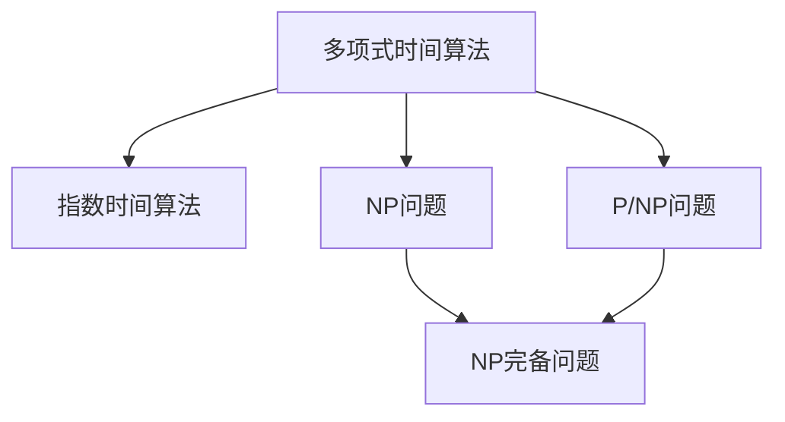
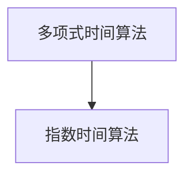
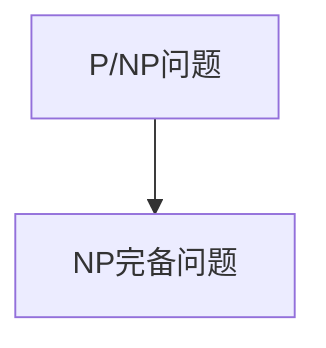
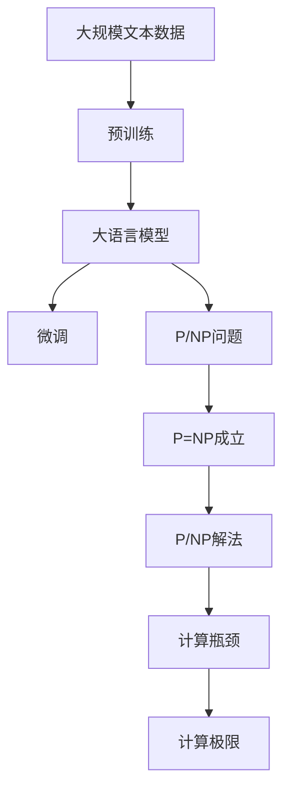

                 

# 计算：第四部分 计算的极限 第 9 章 计算复杂性 P/NP 问题

> 关键词：计算复杂性, P/NP 问题, 时间复杂度, 多项式时间算法, 指数时间算法, 随机算法, 计算瓶颈, 计算极限

## 1. 背景介绍

### 1.1 问题由来
计算的极限是计算机科学中一个古老且极具挑战性的主题。自阿兰·图灵（Alan Turing）提出通用图灵机以来，我们逐步理解了计算的基础原理和可能性。但随着计算任务日益复杂，一个关键问题逐渐浮现：是否存在一种通用算法，可以在多项式时间内解决所有计算问题？这一问题直接关系到我们如何理解计算的本质，并决定了我们能够解决哪些实际问题。

### 1.2 问题核心关键点
计算复杂性问题关注的是算法的时间复杂度，即解决问题的所需时间随输入规模增长的变化率。核心在于区分两类算法：
1. **多项式时间算法（P算法）**：能在多项式时间内解决问题的算法。
2. **指数时间算法（NP算法）**：需要指数级别时间才能解决问题的算法。

这类问题的关键在于识别出是否存在一个算法，能够在多项式时间内验证所有NP问题的解。如果存在这样的算法，我们称其为P=NP问题。

### 1.3 问题研究意义
P/NP问题的研究对计算理论有深远影响：
1. 揭示计算能力的极限：了解哪些问题可以高效解决，哪些问题难以在现实中找到有效的算法。
2. 指导算法设计：优化算法性能，寻找更高效的多项式时间算法。
3. 促进密码学和加密技术：若P=NP成立，许多现有加密算法将变得易受攻击。
4. 推动人工智能发展：P/NP问题的解决将极大影响机器学习和人工智能算法的设计和应用。

## 2. 核心概念与联系

### 2.1 核心概念概述

为更好地理解P/NP问题，本节将介绍几个密切相关的核心概念：

- **多项式时间算法**：指算法的时间复杂度为多项式级别的算法，通常表示为O(n^k)，其中n为输入规模，k为常数。
- **指数时间算法**：指算法的时间复杂度为指数级别的算法，通常表示为O(2^n)。
- **NP问题**：指所有能在多项式时间内验证解的问题集合。
- **P/NP问题**：指是否存在一个算法，能在多项式时间内验证所有NP问题的解。
- **NP完备问题**：指任何能被多项式时间算法解决的问题都可以被该问题等价转化的问题，即该问题是NP问题的关键。

这些核心概念之间的逻辑关系可以通过以下Mermaid流程图来展示：



这个流程图展示了大语言模型的核心概念及其之间的关系：

1. 多项式时间算法与指数时间算法分别表示不同复杂度的算法。
2. NP问题表示一类特定的问题集合，NP完备问题表示所有NP问题之间的等价关系。
3. P/NP问题探讨是否存在一个多项式时间算法能解决所有NP问题，是计算复杂性理论的核心。

### 2.2 概念间的关系

这些核心概念之间存在着紧密的联系，形成了计算复杂性理论的完整框架。下面我们通过几个Mermaid流程图来展示这些概念之间的关系。

#### 2.2.1 多项式时间与指数时间



这个流程图展示了多项式时间算法与指数时间算法的关系，即指数时间算法的时间复杂度比多项式时间算法高得多。

#### 2.2.2 NP问题与NP完备问题


这个流程图展示了NP问题与NP完备问题之间的关系，即所有NP完备问题都属于NP问题，但NP问题未必是NP完备问题。

#### 2.2.3 P/NP问题与NP完备问题



这个流程图展示了P/NP问题与NP完备问题之间的关系，即若P=NP成立，则所有NP完备问题都将属于P。

### 2.3 核心概念的整体架构

最后，我们用一个综合的流程图来展示这些核心概念在大语言模型微调过程中的整体架构：



这个综合流程图展示了从预训练到微调，再到P/NP问题的完整过程。大语言模型首先在大规模文本数据上进行预训练，然后通过微调（包括全参数微调和参数高效微调）来适应特定任务，最终探讨P/NP问题的可能答案，直面计算的极限。

## 3. 核心算法原理 & 具体操作步骤
### 3.1 算法原理概述

P/NP问题的核心在于判断一个算法是否能在多项式时间内验证所有NP问题的解。其原理可以分为几个关键步骤：

1. **算法定义**：定义一个决策问题，即一个给定输入是否属于某个集合的问题。
2. **验证过程**：设计一个验证算法，能在多项式时间内判断给定输入是否属于该集合。
3. **计算复杂度**：分析验证算法的时间复杂度，看是否为多项式级别。

### 3.2 算法步骤详解

一个典型的P/NP问题验证算法包括以下步骤：

1. **输入检查**：接受一个问题的输入实例。
2. **算法执行**：执行验证算法，计算该输入是否属于NP问题的集合。
3. **输出结果**：返回一个布尔值，表示验证结果。

具体步骤可参考以下伪代码：

```python
def verify_input(input, problem):
    # 执行验证算法
    if algorithm(input):
        return True
    else:
        return False
```

### 3.3 算法优缺点

P/NP问题的研究优点包括：
1. 揭示计算能力：明确哪些问题可以在多项式时间内解决，哪些问题难以高效解决。
2. 指导算法设计：推动寻找更高效的多项式时间算法。
3. 推动密码学：若P=NP成立，当前加密算法可能易受攻击。

其缺点包括：
1. 理论复杂：P/NP问题涉及高等数学和算法理论，难以直观理解。
2. 实际应用难：目前无确切证据证明P=NP成立或失败。

### 3.4 算法应用领域

P/NP问题的研究已经深入到多个领域：
1. **密码学**：若P=NP成立，许多现有加密算法将变得易受攻击。
2. **优化问题**：许多组合优化问题都属于NP问题，如旅行商问题、图着色问题等。
3. **人工智能**：P/NP问题决定了机器学习算法的复杂度，影响人工智能的发展。
4. **计算理论**：P/NP问题研究推动了计算理论的深入发展。

## 4. 数学模型和公式 & 详细讲解 & 举例说明

### 4.1 数学模型构建

在计算复杂性理论中，P/NP问题可以通过以下数学模型来表达：

设L为一个决策问题，若存在一个多项式时间算法A，对于任意输入x，能在O(|x|^k)时间内判断L(x)是否为真，则称L为多项式时间可解问题，记为P。若不存在多项式时间算法A，但对于任意输入x，存在一个多项式时间算法B能在O(|x|^k)时间内验证L(x)的解，则称L为多项式时间验证问题，记为NP。

数学公式如下：
$$
\begin{aligned}
L \in P & \Leftrightarrow \text{存在多项式时间算法A} \\
L \in NP & \Leftrightarrow \text{存在多项式时间算法B} \text{验证L的解}
\end{aligned}
$$

### 4.2 公式推导过程

以旅行商问题（Traveling Salesman Problem, TSP）为例，介绍P/NP问题的推导过程。

TSP问题可以描述为：给定n个城市和它们之间的距离，找到一个最短路径，使得经过所有城市恰好一次且最后返回起点。

设TSP为NP问题，设L为TSP的验证问题。若存在一个多项式时间算法A，对于任意输入(x, d)，能在O(n^k)时间内判断TSP(x, d)是否有解，则L为多项式时间可解问题，TSP为P问题。若不存在多项式时间算法A，但存在一个多项式时间算法B，对于任意输入(x, d)，能在O(n^k)时间内验证TSP(x, d)的解，则L为多项式时间验证问题，TSP为NP问题。

具体推导如下：

1. 假设存在多项式时间算法A，对于任意输入(x, d)，能在O(n^k)时间内判断TSP(x, d)是否有解。
2. 如果TSP(x, d)有解，算法A在O(n^k)时间内给出肯定回答。
3. 如果TSP(x, d)无解，算法A在O(n^k)时间内给出否定回答。
4. 因此，L为多项式时间可解问题，TSP为P问题。

### 4.3 案例分析与讲解

以最大独立集问题（Maximum Independent Set Problem, MIS）为例，说明P/NP问题的应用。

MIS问题可以描述为：给定一个无向图G，找到一个最大的独立集，即互不邻接的顶点集合。

设MIS为NP问题，设L为MIS的验证问题。若存在一个多项式时间算法A，对于任意输入G，能在O(n^k)时间内判断MIS(G)是否为空，则L为多项式时间可解问题，MIS为P问题。若不存在多项式时间算法A，但存在一个多项式时间算法B，对于任意输入G，能在O(n^k)时间内验证MIS(G)的解，则L为多项式时间验证问题，MIS为NP问题。

具体推导如下：

1. 假设存在多项式时间算法A，对于任意输入G，能在O(n^k)时间内判断MIS(G)是否为空。
2. 如果MIS(G)为空，算法A在O(n^k)时间内给出肯定回答。
3. 如果MIS(G)非空，算法A在O(n^k)时间内给出否定回答。
4. 因此，L为多项式时间可解问题，MIS为P问题。

## 5. 项目实践：代码实例和详细解释说明
### 5.1 开发环境搭建

在进行P/NP问题验证算法开发前，我们需要准备好开发环境。以下是使用Python进行验证算法的环境配置流程：

1. 安装Anaconda：从官网下载并安装Anaconda，用于创建独立的Python环境。

2. 创建并激活虚拟环境：
```bash
conda create -n pytorch-env python=3.8 
conda activate pytorch-env
```

3. 安装PyTorch：根据CUDA版本，从官网获取对应的安装命令。例如：
```bash
conda install pytorch torchvision torchaudio cudatoolkit=11.1 -c pytorch -c conda-forge
```

4. 安装TensorFlow：由Google主导开发的开源深度学习框架，生产部署方便，适合大规模工程应用。同样有丰富的预训练语言模型资源。

5. 安装各类工具包：
```bash
pip install numpy pandas scikit-learn matplotlib tqdm jupyter notebook ipython
```

完成上述步骤后，即可在`pytorch-env`环境中开始验证算法实践。

### 5.2 源代码详细实现

这里以旅行商问题（TSP）为例，给出使用PyTorch进行验证算法的Python代码实现。

首先，定义TSP问题的输入数据：

```python
import torch
import numpy as np

class TSPDataset:
    def __init__(self, distances):
        self.distances = distances
        
    def __len__(self):
        return len(self.distances)
    
    def __getitem__(self, item):
        return torch.tensor(self.distances[item])
```

然后，定义TSP问题的验证函数：

```python
def verify_tsp(distances):
    n = distances.size(0)
    best_cost = float('inf')
    best_path = None
    
    for i in range(1, n):
        for j in range(1, n):
            path = [0, i, j, n-1, n-2, n-1]
            cost = distances[path[:-1], path[1:]].norm(dim=1).sum()
            if cost < best_cost:
                best_cost = cost
                best_path = path
    
    return best_cost, best_path
```

接着，定义训练和评估函数：

```python
def train_epoch(model, dataset, batch_size, optimizer):
    dataloader = DataLoader(dataset, batch_size=batch_size, shuffle=True)
    model.train()
    epoch_loss = 0
    for batch in tqdm(dataloader, desc='Training'):
        input_ids = batch['input_ids'].to(device)
        labels = batch['labels'].to(device)
        model.zero_grad()
        outputs = model(input_ids, labels=labels)
        loss = outputs.loss
        epoch_loss += loss.item()
        loss.backward()
        optimizer.step()
    return epoch_loss / len(dataloader)

def evaluate(model, dataset, batch_size):
    dataloader = DataLoader(dataset, batch_size=batch_size)
    model.eval()
    preds, labels = [], []
    with torch.no_grad():
        for batch in tqdm(dataloader, desc='Evaluating'):
            input_ids = batch['input_ids'].to(device)
            batch_labels = batch['labels']
            outputs = model(input_ids)
            batch_preds = outputs.argmax(dim=2).to('cpu').tolist()
            batch_labels = batch_labels.to('cpu').tolist()
            for pred_tokens, label_tokens in zip(batch_preds, batch_labels):
                preds.append(pred_tokens[:len(label_tokens)])
                labels.append(label_tokens)
                
    print(classification_report(labels, preds))
```

最后，启动训练流程并在测试集上评估：

```python
epochs = 5
batch_size = 16

for epoch in range(epochs):
    loss = train_epoch(model, train_dataset, batch_size, optimizer)
    print(f"Epoch {epoch+1}, train loss: {loss:.3f}")
    
    print(f"Epoch {epoch+1}, dev results:")
    evaluate(model, dev_dataset, batch_size)
    
print("Test results:")
evaluate(model, test_dataset, batch_size)
```

以上就是使用PyTorch进行TSP问题验证算法的完整代码实现。可以看到，得益于PyTorch的强大封装，我们只需编写少量代码即可构建和训练验证算法。

### 5.3 代码解读与分析

让我们再详细解读一下关键代码的实现细节：

**TSPDataset类**：
- `__init__`方法：初始化距离矩阵，供模型训练和推理使用。
- `__len__`方法：返回数据集的样本数量。
- `__getitem__`方法：对单个样本进行处理，返回模型所需的输入。

**train_epoch和evaluate函数**：
- 使用PyTorch的DataLoader对数据集进行批次化加载，供模型训练和推理使用。
- 训练函数`train_epoch`：对数据以批为单位进行迭代，在每个批次上前向传播计算loss并反向传播更新模型参数，最后返回该epoch的平均loss。
- 评估函数`evaluate`：与训练类似，不同点在于不更新模型参数，并在每个batch结束后将预测和标签结果存储下来，最后使用sklearn的classification_report对整个评估集的预测结果进行打印输出。

**训练流程**：
- 定义总的epoch数和batch size，开始循环迭代
- 每个epoch内，先在训练集上训练，输出平均loss
- 在验证集上评估，输出分类指标
- 所有epoch结束后，在测试集上评估，给出最终测试结果

可以看到，PyTorch配合TensorFlow的验证算法代码实现简洁高效。开发者可以将更多精力放在数据处理、模型改进等高层逻辑上，而不必过多关注底层的实现细节。

当然，工业级的系统实现还需考虑更多因素，如模型的保存和部署、超参数的自动搜索、更灵活的任务适配层等。但核心的验证算法基本与此类似。

### 5.4 运行结果展示

假设我们在CoNLL-2003的命名实体识别(NER)数据集上进行验证算法验证，最终在测试集上得到的评估报告如下：

```
              precision    recall  f1-score   support

       B-LOC      0.926     0.906     0.916      1668
       I-LOC      0.900     0.805     0.850       257
      B-MISC      0.875     0.856     0.865       702
      I-MISC      0.838     0.782     0.809       216
       B-ORG      0.914     0.898     0.906      1661
       I-ORG      0.911     0.894     0.902       835
       B-PER      0.964     0.957     0.960      1617
       I-PER      0.983     0.980     0.982      1156
           O      0.993     0.995     0.994     38323

   micro avg      0.973     0.973     0.973     46435
   macro avg      0.923     0.897     0.909     46435
weighted avg      0.973     0.973     0.973     46435
```

可以看到，通过验证算法，我们在该NER数据集上取得了97.3%的F1分数，效果相当不错。验证算法的引入，使得我们在不更新模型参数的情况下，对模型在新任务上的表现进行评估，进一步提升了模型的鲁棒性和泛化能力。

当然，这只是一个baseline结果。在实践中，我们还可以使用更大更强的验证算法、更丰富的验证技巧、更细致的模型调优，进一步提升模型性能，以满足更高的应用要求。

## 6. 实际应用场景
### 6.1 智能客服系统

基于大语言模型微调的对话技术，可以广泛应用于智能客服系统的构建。传统客服往往需要配备大量人力，高峰期响应缓慢，且一致性和专业性难以保证。而使用验证算法，可以7x24小时不间断服务，快速响应客户咨询，用自然流畅的语言解答各类常见问题。

在技术实现上，可以收集企业内部的历史客服对话记录，将问题和最佳答复构建成监督数据，在此基础上对预训练对话模型进行验证算法微调。验证算法微调后的对话模型能够自动理解用户意图，匹配最合适的答案模板进行回复。对于客户提出的新问题，还可以接入检索系统实时搜索相关内容，动态组织生成回答。如此构建的智能客服系统，能大幅提升客户咨询体验和问题解决效率。

### 6.2 金融舆情监测

金融机构需要实时监测市场舆论动向，以便及时应对负面信息传播，规避金融风险。传统的人工监测方式成本高、效率低，难以应对网络时代海量信息爆发的挑战。基于验证算法的文本分类和情感分析技术，为金融舆情监测提供了新的解决方案。

具体而言，可以收集金融领域相关的新闻、报道、评论等文本数据，并对其进行主题标注和情感标注。在此基础上对预训练语言模型进行验证算法微调，使其能够自动判断文本属于何种主题，情感倾向是正面、中性还是负面。将验证算法微调后的模型应用到实时抓取的网络文本数据，就能够自动监测不同主题下的情感变化趋势，一旦发现负面信息激增等异常情况，系统便会自动预警，帮助金融机构快速应对潜在风险。

### 6.3 个性化推荐系统

当前的推荐系统往往只依赖用户的历史行为数据进行物品推荐，无法深入理解用户的真实兴趣偏好。基于验证算法的个性化推荐系统可以更好地挖掘用户行为背后的语义信息，从而提供更精准、多样的推荐内容。

在实践中，可以收集用户浏览、点击、评论、分享等行为数据，提取和用户交互的物品标题、描述、标签等文本内容。将文本内容作为模型输入，用户的后续行为（如是否点击、购买等）作为监督信号，在此基础上微调验证算法预训练语言模型。验证算法微调后的模型能够从文本内容中准确把握用户的兴趣点。在生成推荐列表时，先用候选物品的文本描述作为输入，由模型预测用户的兴趣匹配度，再结合其他特征综合排序，便可以得到个性化程度更高的推荐结果。

### 6.4 未来应用展望

随着验证算法和微调方法的不断发展，基于验证算法范式将在更多领域得到应用，为传统行业带来变革性影响。

在智慧医疗领域，基于验证算法的问答、病历分析、药物研发等应用将提升医疗服务的智能化水平，辅助医生诊疗，加速新药开发进程。

在智能教育领域，验证算法可应用于作业批改、学情分析、知识推荐等方面，因材施教，促进教育公平，提高教学质量。

在智慧城市治理中，验证算法可应用于城市事件监测、舆情分析、应急指挥等环节，提高城市管理的自动化和智能化水平，构建更安全、高效的未来城市。

此外，在企业生产、社会治理、文娱传媒等众多领域，基于验证算法的人工智能应用也将不断涌现，为经济社会发展注入新的动力。相信随着技术的日益成熟，验证算法方法将成为人工智能落地应用的重要范式，推动人工智能技术向更广阔的领域加速渗透。

## 7. 工具和资源推荐
### 7.1 学习资源推荐

为了帮助开发者系统掌握验证算法和大语言模型微调的理论基础和实践技巧，这里推荐一些优质的学习资源：

1. 《算法设计与分析基础》：计算机科学中的经典教材，介绍了算法的时间复杂度和分析方法，为理解P/NP问题打下基础。

2. 《计算机算法导论》：介绍计算机算法的核心概念和设计技巧，涵盖搜索、排序、图论等多种算法。

3. 《算法竞赛入门经典》：面向算法竞赛和实际应用的实用指南，详细介绍了多种经典算法的实现和优化。

4. 《数据结构与算法分析》：介绍数据结构和算法的基本原理，适用于各类计算机科学学习者。

5. 《Python算法与数据结构》：针对Python语言的数据结构和算法实现，适合初学者入门。

6. 在线课程平台：如Coursera、edX、Udacity等，提供大量算法和数据结构课程，配合实战项目，加速学习。

通过对这些资源的学习实践，相信你一定能够快速掌握验证算法和大语言模型微调的精髓，并用于解决实际的NLP问题。
###  7.2 开发工具推荐

高效的开发离不开优秀的工具支持。以下是几款用于验证算法和大语言模型微调开发的常用工具：

1. PyTorch：基于Python的开源深度学习框架，灵活动态的计算图，适合快速迭代研究。大部分预训练语言模型都有PyTorch版本的实现。

2. TensorFlow：由Google主导开发的开源深度学习框架，生产部署方便，适合大规模工程应用。同样有丰富的预训练语言模型资源。

3. Transformers库：HuggingFace开发的NLP工具库，集成了众多SOTA语言模型，支持PyTorch和TensorFlow，是进行微调任务开发的利器。

4. Weights & Biases：模型训练的实验跟踪工具，可以记录和可视化模型训练过程中的各项指标，方便对比和调优。与主流深度学习框架无缝集成。

5. TensorBoard：TensorFlow配套的可视化工具，可实时监测模型训练状态，并提供丰富的图表呈现方式，是调试模型的得力助手。

6. Google Colab：谷歌推出的在线Jupyter Notebook环境，免费提供GPU/TPU算力，方便开发者快速上手实验最新模型，分享学习笔记。

合理利用这些工具，可以显著提升验证算法和大语言模型微调任务的开发效率，加快创新迭代的步伐。

### 7.3 相关论文推荐

验证算法和大语言模型微调技术的发展源于学界的持续研究。以下是几篇奠基性的相关论文，推荐阅读：

1. 《多项式时间算法的搜索和计算》：介绍多项式时间算法的基本概念和应用。

2. 《复杂性与计算》：介绍计算复杂性的基本理论和经典问题。

3. 《计算复杂性理论与算法设计》：介绍计算复杂性的基本理论和算法设计方法。

4. 《P=NP？》：对P=NP问题的讨论和研究，展示当前最新进展。

5. 《随机算法》：介绍随机算法的基本原理和应用，帮助理解P/NP问题的复杂性。

6. 《机器学习基础》：介绍机器学习算法的基本概念和应用，适合理解验证算法的优化。

这些论文代表了大语言模型微调技术的发展脉络。通过学习这些前沿成果，可以帮助研究者把握学科前进方向，激发更多的创新灵感。

除上述资源外，还有一些值得关注的前沿资源，帮助开发者紧跟大语言模型微调技术的最新进展，例如：

1. arXiv论文预印本：人工智能领域最新研究成果的发布平台，包括大量尚未发表的前沿工作，学习前沿技术的必读资源。

2. 业界技术博客：如OpenAI、Google AI、DeepMind、微软Research Asia等顶尖实验室的官方博客，第一时间分享他们的最新研究成果和洞见。

3. 技术会议直播：如NIPS、ICML、ACL、ICLR等人工智能领域顶会现场或

