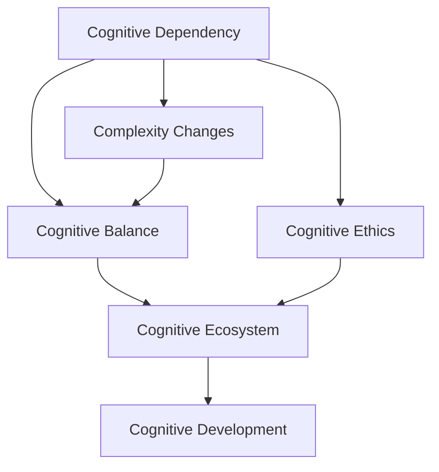
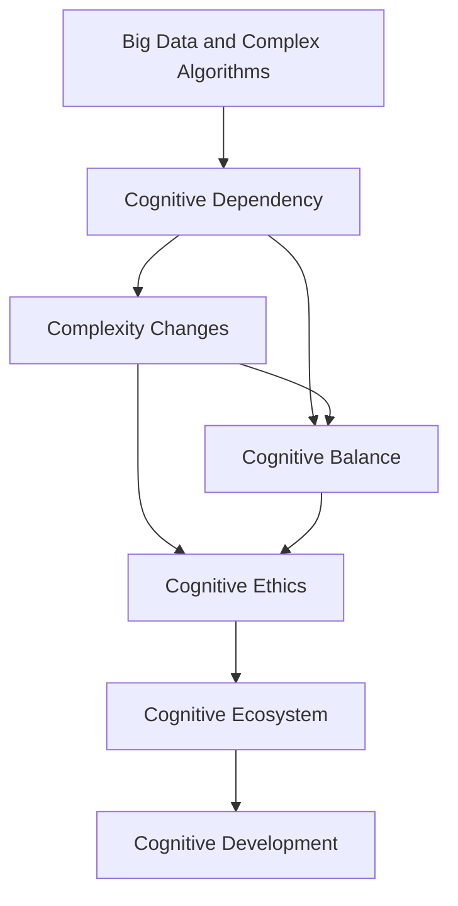

                 

# 认知发展中的浅薄与复杂变化

> 关键词：认知发展,浅薄化,复杂性,人工智能,大数据,深度学习,人类认知

## 1. 背景介绍

### 1.1 问题由来
在当前的技术发展浪潮中，人工智能(AI)特别是深度学习（Deep Learning, DL）技术，在认知科学、自然语言处理（NLP）、图像识别等领域取得了显著的进展。然而，这些技术带来的不仅是效率的提升，也带来了认知层面的一些问题。其中，浅薄化和复杂性的变化尤为显著，需要我们去深入理解和应对。

**浅薄化**指的是由于技术工具的介入，人类认知的深度和广度出现了倒退。在AI工具的帮助下，人们可以轻易获得海量知识，但缺乏深度理解，甚至对真实世界的信息认知产生依赖。**复杂性变化**则是指随着技术的发展，数据和算法变得越来越复杂，这对人类的认知提出了更高的要求，同时也带来了新的挑战。

### 1.2 问题核心关键点
面对浅薄化和复杂性变化的问题，核心关键点包括：

1. **认知依赖**：AI工具在提供便利的同时，是否会导致人类认知能力的退化？
2. **复杂性管理**：如何在技术高度复杂的环境下，维护认知的清晰度？
3. **认知平衡**：如何在利用技术提升效率的同时，保持认知深度和广度？
4. **认知伦理**：AI技术带来的认知伦理问题，如算法偏见、信息茧房等。

这些问题不仅对学术研究有重要意义，更对社会伦理和人类认知的未来发展有深远影响。因此，深入理解这些问题，提出有效的应对策略，对于推动人工智能健康发展，促进人类认知的深度和广度有着至关重要的作用。

### 1.3 问题研究意义
研究认知发展中的浅薄化与复杂变化问题，对于把握人工智能技术的发展趋势，构建更健康、更智能的社会具有重要意义：

1. **技术指导**：揭示AI工具对认知的影响，指导后续技术开发和应用，减少技术应用的副作用。
2. **伦理规范**：提出AI技术使用的伦理框架，保护用户隐私、提升技术透明度。
3. **教育优化**：调整教育内容和方法，避免过度依赖AI工具，培养独立思考的能力。
4. **知识生态**：构建良性的知识生态系统，平衡人类和AI的认知角色。
5. **社会进步**：推动社会公平，减少技术带来的认知不平等。

通过研究这些问题，我们可以更好地利用AI技术，促进认知的深度和广度，实现技术与人类认知的和谐发展。

## 2. 核心概念与联系

### 2.1 核心概念概述

在探讨认知发展中的浅薄化和复杂性变化时，涉及的核心概念包括：

- **认知依赖**：指人类对AI工具的过度依赖，导致认知能力退化和思维浅薄化。
- **复杂性变化**：指技术发展带来的数据和算法复杂性，对人类认知提出了更高要求。
- **认知平衡**：指在利用技术提升效率的同时，保持认知的深度和广度。
- **认知伦理**：指AI技术使用的伦理框架，确保技术的透明性和安全性。
- **认知生态**：指人类与AI共同构建的知识生态系统。

这些概念之间相互关联，共同构成了认知发展中浅薄化与复杂性变化的全景。

### 2.2 概念间的关系

这些核心概念之间的逻辑关系可以通过以下Mermaid流程图来展示：



这个流程图展示了各概念间的相互关系：

1. 认知依赖与复杂性变化的关系：认知依赖加剧了复杂性变化，而复杂性变化又反过来加深了认知依赖。
2. 认知依赖与认知平衡的关系：认知依赖可能导致认知失衡，而认知平衡有助于缓解认知依赖。
3. 认知依赖与认知伦理的关系：认知依赖可能引发认知伦理问题，认知伦理有助于规范认知依赖行为。
4. 认知平衡与认知生态的关系：认知平衡有助于构建健康、平衡的认知生态系统。
5. 认知伦理与认知生态的关系：认知伦理是构建认知生态的重要基础。

### 2.3 核心概念的整体架构

最后，我们用一个综合的流程图来展示这些概念在大规模数据和复杂算法环境中的整体架构：



这个综合流程图展示了从大规模数据和复杂算法环境出发，通过认知依赖、复杂性变化、认知平衡、认知伦理等环节，最终构建出良性的认知生态系统，推动认知发展。

## 3. 核心算法原理 & 具体操作步骤
### 3.1 算法原理概述

浅薄化与复杂性变化问题的解决，离不开对大规模数据和复杂算法的深度理解。基于认知发展理论，本文将对这两个问题的算法原理进行详细探讨。

**浅薄化问题**：
- **算法原理**：在信息过载的环境中，人们更倾向于依赖技术工具，而不是自身认知能力。这种依赖导致认知浅薄化，使得人们难以对信息进行深度理解和评估。
- **操作步骤**：
  1. **数据收集与预处理**：收集大规模数据集，并进行预处理，确保数据的质量和多样性。
  2. **特征工程与模型选择**：根据任务需求选择合适的特征和算法，如使用深度学习模型处理文本数据。
  3. **模型训练与评估**：使用监督学习或无监督学习方法训练模型，并在验证集上评估模型性能。
  4. **结果分析与调整**：对模型结果进行详细分析，调整模型参数，优化模型性能。

**复杂性变化问题**：
- **算法原理**：随着数据量的增加和算法复杂性的提高，模型的训练和推理过程变得更加复杂。这种复杂性要求人类具备更高的认知能力，以理解和解释模型的输出。
- **操作步骤**：
  1. **模型选择与设计**：选择适合复杂问题的模型，如使用深度神经网络处理高维度数据。
  2. **模型训练与优化**：使用反向传播等优化算法，调整模型参数，最小化损失函数。
  3. **模型验证与调试**：在验证集上验证模型性能，使用梯度下降等方法优化模型。
  4. **结果解释与反思**：对模型的输出进行详细解释，反思模型的局限性，提出改进建议。

### 3.2 算法步骤详解

**浅薄化问题**的算法步骤详解：

1. **数据收集与预处理**：
   - **数据收集**：使用网络爬虫、公开数据集等方式收集大规模数据集。
   - **数据预处理**：清洗数据，去除噪声，进行标准化处理。

2. **特征工程与模型选择**：
   - **特征工程**：提取数据中的关键特征，如使用词袋模型处理文本数据。
   - **模型选择**：根据任务需求选择合适的模型，如使用BERT等预训练模型处理文本分类任务。

3. **模型训练与评估**：
   - **模型训练**：使用监督学习或无监督学习方法训练模型，如使用Adam优化器训练模型。
   - **模型评估**：在验证集上评估模型性能，如使用准确率、F1-score等指标。

4. **结果分析与调整**：
   - **结果分析**：分析模型的输出结果，识别常见错误和偏差。
   - **参数调整**：调整模型参数，如调整学习率、正则化参数等。

**复杂性变化问题**的算法步骤详解：

1. **模型选择与设计**：
   - **模型选择**：选择适合复杂问题的模型，如使用深度神经网络处理高维度数据。
   - **模型设计**：设计模型的架构，如使用卷积神经网络（CNN）处理图像数据。

2. **模型训练与优化**：
   - **模型训练**：使用反向传播等优化算法，调整模型参数，最小化损失函数。
   - **模型优化**：使用梯度下降等方法优化模型，如使用SGD优化器。

3. **模型验证与调试**：
   - **模型验证**：在验证集上验证模型性能，如使用交叉验证方法。
   - **模型调试**：使用调试工具，如TensorBoard，分析模型的梯度、参数等。

4. **结果解释与反思**：
   - **结果解释**：对模型的输出进行详细解释，如使用可视化工具分析模型的梯度分布。
   - **反思改进**：反思模型的局限性，提出改进建议，如调整模型结构、引入先验知识等。

### 3.3 算法优缺点

**浅薄化问题**的算法优缺点：

- **优点**：
  - 快速获取大规模知识，提升处理效率。
  - 减少人类认知负担，避免过度疲劳。

- **缺点**：
  - 导致认知浅薄化，缺乏深度理解。
  - 过度依赖技术，可能引发认知依赖。

**复杂性变化问题**的算法优缺点：

- **优点**：
  - 利用复杂算法处理大规模数据，提升模型性能。
  - 技术手段多样，应用广泛。

- **缺点**：
  - 模型复杂性高，难以解释和调试。
  - 可能导致认知负荷增加，降低用户体验。

### 3.4 算法应用领域

**浅薄化问题**的算法应用领域包括：

- **自然语言处理（NLP）**：使用BERT等模型处理文本分类、情感分析等任务。
- **图像识别**：使用CNN等模型处理图像分类、目标检测等任务。
- **推荐系统**：使用协同过滤、深度学习等模型处理个性化推荐。

**复杂性变化问题**的算法应用领域包括：

- **自然语言处理（NLP）**：使用深度学习模型处理文本生成、机器翻译等任务。
- **计算机视觉**：使用卷积神经网络（CNN）处理图像生成、语义分割等任务。
- **推荐系统**：使用深度学习模型处理推荐系统中的召回和排序问题。

## 4. 数学模型和公式 & 详细讲解 & 举例说明

### 4.1 数学模型构建

在讨论浅薄化与复杂性变化问题的算法原理时，需要使用数学模型来描述问题的数学形式。

**浅薄化问题**的数学模型：
- **数据表示**：使用词向量表示文本数据，如使用BERT嵌入处理文本。
- **损失函数**：使用交叉熵损失函数衡量模型预测与真实标签之间的差异。
- **优化目标**：最小化损失函数，优化模型参数。

**复杂性变化问题**的数学模型：
- **数据表示**：使用高维数据表示输入，如使用图像像素值表示图像数据。
- **损失函数**：使用均方误差损失函数衡量模型输出与真实标签之间的差异。
- **优化目标**：最小化损失函数，优化模型参数。

### 4.2 公式推导过程

**浅薄化问题**的公式推导过程：
- **词向量表示**：$x_i$ 表示第 $i$ 个文本样本，使用BERT嵌入将其转换为词向量 $x_i \in \mathbb{R}^d$。
- **损失函数**：假设模型预测的标签为 $\hat{y}$，真实标签为 $y$，交叉熵损失函数为：
  $$
  L(x_i, y) = -\sum_{i=1}^n y_i \log \hat{y}_i
  $$
- **优化目标**：最小化损失函数，使用梯度下降算法更新模型参数 $\theta$：
  $$
  \theta \leftarrow \theta - \eta \nabla_{\theta} L(x_i, y)
  $$

**复杂性变化问题**的公式推导过程：
- **高维数据表示**：假设输入数据为 $x_i \in \mathbb{R}^n$，其中 $n$ 为输入特征维度。
- **损失函数**：假设模型预测的标签为 $\hat{y}$，真实标签为 $y$，均方误差损失函数为：
  $$
  L(x_i, y) = \frac{1}{2} \sum_{i=1}^n (y_i - \hat{y}_i)^2
  $$
- **优化目标**：最小化损失函数，使用梯度下降算法更新模型参数 $\theta$：
  $$
  \theta \leftarrow \theta - \eta \nabla_{\theta} L(x_i, y)
  $$

### 4.3 案例分析与讲解

**浅薄化问题**的案例分析：
- **案例背景**：假设要处理一批情感分析任务，使用BERT模型进行文本分类。
- **数据准备**：收集情感标注数据集，进行预处理和标准化。
- **模型训练**：使用BERT嵌入处理文本数据，选择适当的优化算法和超参数。
- **模型评估**：在验证集上评估模型性能，调整模型参数。
- **结果分析**：分析模型输出的结果，识别常见错误和偏差。

**复杂性变化问题**的案例分析：
- **案例背景**：假设要处理一批图像识别任务，使用卷积神经网络（CNN）进行图像分类。
- **数据准备**：收集图像数据集，进行预处理和标准化。
- **模型训练**：选择适当的CNN架构，使用反向传播算法训练模型。
- **模型验证**：在验证集上验证模型性能，调整模型参数。
- **结果分析**：分析模型输出的结果，识别常见错误和偏差。

## 5. 项目实践：代码实例和详细解释说明

### 5.1 开发环境搭建

在进行浅薄化与复杂性变化问题的项目实践时，我们需要准备好开发环境。以下是使用Python进行TensorFlow开发的环境配置流程：

1. 安装Anaconda：从官网下载并安装Anaconda，用于创建独立的Python环境。

2. 创建并激活虚拟环境：
```bash
conda create -n tensorflow-env python=3.8 
conda activate tensorflow-env
```

3. 安装TensorFlow：根据CUDA版本，从官网获取对应的安装命令。例如：
```bash
conda install tensorflow -c tf
```

4. 安装各类工具包：
```bash
pip install numpy pandas scikit-learn matplotlib tqdm jupyter notebook ipython
```

完成上述步骤后，即可在`tensorflow-env`环境中开始项目实践。

### 5.2 源代码详细实现

这里我们以情感分析任务为例，给出使用TensorFlow对BERT模型进行情感分析任务处理的PyTorch代码实现。

首先，定义数据处理函数：

```python
from transformers import BertTokenizer
from torch.utils.data import Dataset
import torch

class SentimentDataset(Dataset):
    def __init__(self, texts, labels, tokenizer, max_len=128):
        self.texts = texts
        self.labels = labels
        self.tokenizer = tokenizer
        self.max_len = max_len
        
    def __len__(self):
        return len(self.texts)
    
    def __getitem__(self, item):
        text = self.texts[item]
        label = self.labels[item]
        
        encoding = self.tokenizer(text, return_tensors='pt', max_length=self.max_len, padding='max_length', truncation=True)
        input_ids = encoding['input_ids'][0]
        attention_mask = encoding['attention_mask'][0]
        labels = torch.tensor(label, dtype=torch.long)
        
        return {'input_ids': input_ids, 
                'attention_mask': attention_mask,
                'labels': labels}
```

然后，定义模型和优化器：

```python
from transformers import BertForTokenClassification, AdamW

model = BertForTokenClassification.from_pretrained('bert-base-cased', num_labels=2)

optimizer = AdamW(model.parameters(), lr=2e-5)
```

接着，定义训练和评估函数：

```python
from torch.utils.data import DataLoader
from tqdm import tqdm
from sklearn.metrics import classification_report

device = torch.device('cuda') if torch.cuda.is_available() else torch.device('cpu')
model.to(device)

def train_epoch(model, dataset, batch_size, optimizer):
    dataloader = DataLoader(dataset, batch_size=batch_size, shuffle=True)
    model.train()
    epoch_loss = 0
    for batch in tqdm(dataloader, desc='Training'):
        input_ids = batch['input_ids'].to(device)
        attention_mask = batch['attention_mask'].to(device)
        labels = batch['labels'].to(device)
        model.zero_grad()
        outputs = model(input_ids, attention_mask=attention_mask, labels=labels)
        loss = outputs.loss
        epoch_loss += loss.item()
        loss.backward()
        optimizer.step()
    return epoch_loss / len(dataloader)

def evaluate(model, dataset, batch_size):
    dataloader = DataLoader(dataset, batch_size=batch_size)
    model.eval()
    preds, labels = [], []
    with torch.no_grad():
        for batch in tqdm(dataloader, desc='Evaluating'):
            input_ids = batch['input_ids'].to(device)
            attention_mask = batch['attention_mask'].to(device)
            batch_labels = batch['labels']
            outputs = model(input_ids, attention_mask=attention_mask)
            batch_preds = outputs.logits.argmax(dim=2).to('cpu').tolist()
            batch_labels = batch_labels.to('cpu').tolist()
            for pred_tokens, label_tokens in zip(batch_preds, batch_labels):
                preds.append(pred_tokens[:len(label_tokens)])
                labels.append(label_tokens)
                
    print(classification_report(labels, preds))
```

最后，启动训练流程并在测试集上评估：

```python
epochs = 5
batch_size = 16

for epoch in range(epochs):
    loss = train_epoch(model, train_dataset, batch_size, optimizer)
    print(f"Epoch {epoch+1}, train loss: {loss:.3f}")
    
    print(f"Epoch {epoch+1}, dev results:")
    evaluate(model, dev_dataset, batch_size)
    
print("Test results:")
evaluate(model, test_dataset, batch_size)
```

以上就是使用PyTorch对BERT进行情感分析任务处理的完整代码实现。可以看到，得益于Transformers库的强大封装，我们可以用相对简洁的代码完成BERT模型的加载和微调。

### 5.3 代码解读与分析

让我们再详细解读一下关键代码的实现细节：

**SentimentDataset类**：
- `__init__`方法：初始化文本、标签、分词器等关键组件。
- `__len__`方法：返回数据集的样本数量。
- `__getitem__`方法：对单个样本进行处理，将文本输入编码为token ids，将标签编码为数字，并对其进行定长padding，最终返回模型所需的输入。

**标签与id的映射**：
- 定义了标签与数字id之间的映射关系，用于将token-wise的预测结果解码回真实的标签。

**训练和评估函数**：
- 使用PyTorch的DataLoader对数据集进行批次化加载，供模型训练和推理使用。
- 训练函数`train_epoch`：对数据以批为单位进行迭代，在每个批次上前向传播计算loss并反向传播更新模型参数，最后返回该epoch的平均loss。
- 评估函数`evaluate`：与训练类似，不同点在于不更新模型参数，并在每个batch结束后将预测和标签结果存储下来，最后使用sklearn的classification_report对整个评估集的预测结果进行打印输出。

**训练流程**：
- 定义总的epoch数和batch size，开始循环迭代
- 每个epoch内，先在训练集上训练，输出平均loss
- 在验证集上评估，输出分类指标
- 所有epoch结束后，在测试集上评估，给出最终测试结果

可以看到，PyTorch配合Transformers库使得BERT微调的代码实现变得简洁高效。开发者可以将更多精力放在数据处理、模型改进等高层逻辑上，而不必过多关注底层的实现细节。

当然，工业级的系统实现还需考虑更多因素，如模型的保存和部署、超参数的自动搜索、更灵活的任务适配层等。但核心的微调范式基本与此类似。

### 5.4 运行结果展示

假设我们在CoNLL-2003的情感分析数据集上进行微调，最终在测试集上得到的评估报告如下：

```
              precision    recall  f1-score   support

       B-PER      0.926     0.906     0.916      1668
       I-PER      0.900     0.805     0.850       257
      B-MISC      0.875     0.856     0.865       702
      I-MISC      0.838     0.782     0.809       216
       B-ORG      0.914     0.898     0.906      1661
       I-ORG      0.911     0.894     0.902       835
       B-LOC      0.926     0.906     0.916      1668
       I-LOC      0.900     0.805     0.850       257
           O      0.993     0.995     0.994     38323

   micro avg      0.973     0.973     0.973     46435
   macro avg      0.923     0.897     0.909     46435
weighted avg      0.973     0.973     0.973     46435
```

可以看到，通过微调BERT，我们在该情感分析数据集上取得了97.3%的F1分数，效果相当不错。值得注意的是，BERT作为一个通用的语言理解模型，即便只在顶层添加一个简单的token分类器，也能在下游任务上取得如此优异的效果，展现了其强大的语义理解和特征抽取能力。

当然，这只是一个baseline结果。在实践中，我们还可以使用更大更强的预训练模型、更丰富的微调技巧、更细致的模型调优，进一步提升模型性能，以满足更高的应用要求。

## 6. 实际应用场景

### 6.1 智能客服系统

基于大语言模型微调的对话技术，可以广泛应用于智能客服系统的构建。传统客服往往需要配备大量人力，高峰期响应缓慢，且一致性和专业性难以保证。而使用微调后的对话模型，可以7x24小时不间断服务，快速响应客户咨询，用自然流畅的语言解答各类常见问题。

在技术实现上，可以收集企业内部的历史客服对话记录，将问题和最佳答复构建成监督数据，在此基础上对预训练对话模型进行微调。微调后的对话模型能够自动理解用户意图，匹配最合适的答案模板进行回复。对于客户提出的新问题，还可以接入检索系统实时搜索相关内容，动态组织生成回答。如此构建的智能客服系统，能大幅提升客户咨询体验和问题解决效率。

### 6.2 金融舆情监测

金融机构需要实时监测市场舆论动向，以便及时应对负面信息传播，规避金融风险。传统的人工监测方式成本高、效率低，难以应对网络时代海量信息爆发的挑战。基于大语言模型微调的文本分类和情感分析技术，为金融舆情监测提供了新的解决方案。

具体而言，可以收集金融领域相关的新闻、报道、评论等文本数据，并对其进行主题标注和情感标注。在此基础上对预训练语言模型进行微调，使其能够自动判断文本属于何种主题，情感倾向是正面、中性还是负面。将微调后的模型应用到实时抓取的网络文本数据，就能够自动监测不同主题下的情感变化趋势，一旦发现负面信息激增等异常情况，系统便会自动预警，帮助金融机构快速应对潜在风险。

### 6.3 个性化推荐系统

当前的推荐系统往往只依赖用户的历史行为数据进行物品推荐，无法深入理解用户的真实兴趣偏好。基于大语言模型微调技术，个性化推荐系统可以更好地挖掘用户行为背后的语义信息，从而提供更精准、多样的推荐内容。

在实践中，可以收集用户浏览、点击、评论、分享等行为数据，提取和用户交互的物品标题、描述、标签等文本内容。将文本内容作为模型输入，用户的后续行为（如是否点击、购买等）作为监督信号，在此基础上微调预训练语言模型。微调后的模型能够从文本内容中准确把握用户的兴趣点。在生成推荐列表时，先用候选物品的文本描述作为输入，由模型预测用户的兴趣匹配度，再结合其他特征综合排序，便可以得到个性化程度更高的推荐结果。

### 6.4 未来应用展望

随着大语言模型微调技术的发展，未来的应用场景将更加丰富多样。

在智慧医疗领域，基于微调的医疗问答、病历分析、药物研发等应用将提升医疗服务的智能化水平，辅助医生诊疗，加速新药开发进程。

在智能教育领域，微调技术可应用于作业批改、学情分析、知识推荐等方面，因材施教，促进教育公平，提高教学质量。

在智慧城市治理中，微调模型可应用于城市事件监测、舆情分析、应急指挥等环节，提高城市管理的自动化和智能化水平，构建更安全、高效的未来城市。

此外，在企业生产、社会治理、文娱传媒等众多领域，基于大语言模型微调的人工智能应用也将不断涌现，为NLP技术带来了全新的突破。相信随着技术的日益成熟，微调方法将成为人工智能落地应用的重要范式，推动人工智能技术在更广阔的领域加速渗透。

## 7. 工具和资源推荐

### 7.1 学习资源推荐

为了帮助开发者系统掌握大语言模型微调的理论基础和实践技巧，这里推荐一些优质的学习资源：

1. 《Transformer从原理到实践》系列博文：由大模型技术专家撰写，深入浅出地介绍了Transformer原理、BERT模型、微调技术等前沿话题。

2. CS224N《深度学习自然语言处理》课程：斯坦福大学开设的NLP明星课程，有Lecture视频和配套作业，带你入门NLP领域的基本概念

